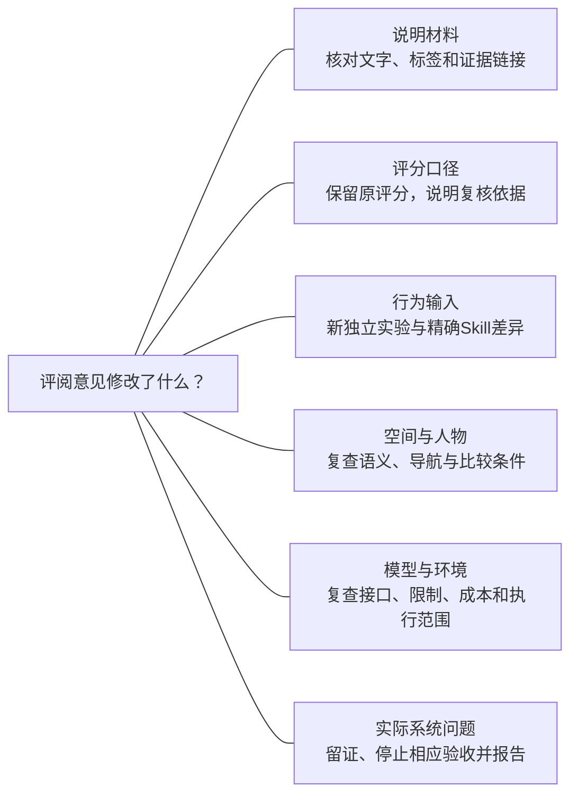
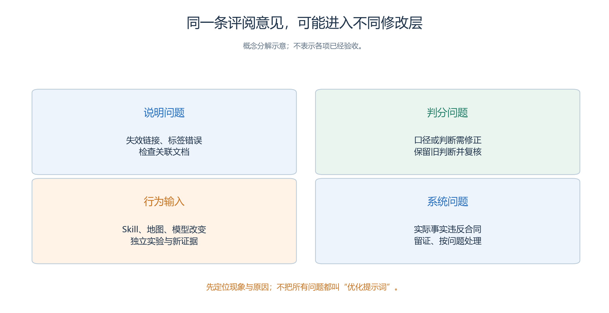
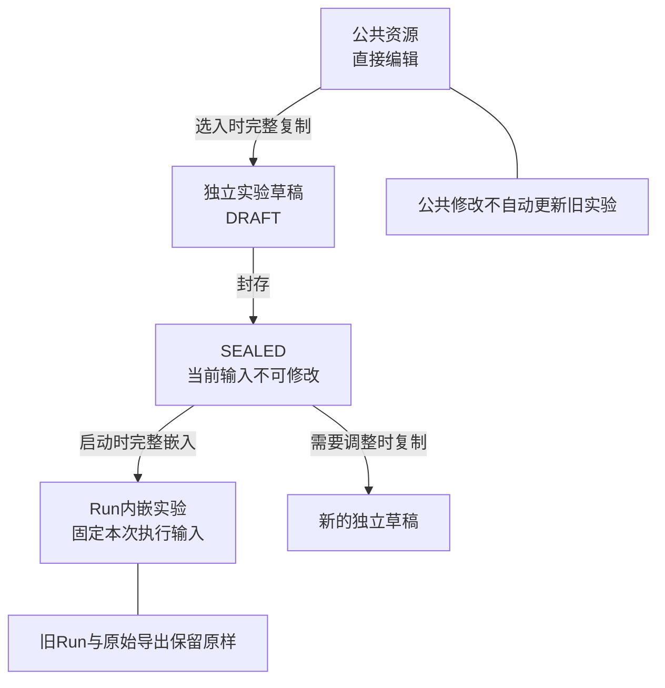
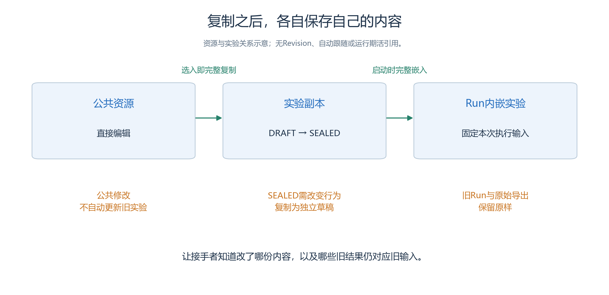

# 5.9 迭代与维护：改变下一次输入，保留这一次证据

项目交付以后，接收者可能发现一句策略不够清楚、一项需求遗漏，或当前环境已经无法运行。

- 维护工作的第一步，是确定问题发生在哪里，以及修改会影响哪份材料。
- 把所有问题都归为“提示词再优化一下”，会让实验条件、历史证据和软件故障混在一起。

服务大厅项目此刻还没有真实运行结果。本节以明确标为假设的情况说明后续工作方法：根据证据提出变更，把影响交代给接手者，再在新的独立输入上验证。它不提供一份已经改善效果的维护报告。

## 5.9.1 先写问题，再写修改

假设未来观察到孟川 H3 最终没有完成 B 窗口咨询。

- 可能是他没有补充私人目的，也可能是咨询台没有使用真实补充，或建议正确而路径、回复、确认中的某一环未完成。
- 仅凭一个失败结果，不能直接决定给所有角色增加完整任务答案。

一张可交接的问题单应回答以下内容：

| 字段 | 应记录的内容 |
| --- | --- |
| 现象 | 哪项需求没有达到哪个事前判据 |
| 位置 | 实际实验、Run、Attempt、Step 及相关人物／对象 |
| 证据 | 请求、回复、记忆、路径或页面记录的具体出处 |
| 解释 | 已证实原因、仍待排查的假设分别是什么 |
| 修改建议 | 准备改变什么，为什么针对这个原因 |
| 验收条件 | 下一次应看见哪些事实，怎样判断仍未解决 |

若只有“咨询台好像忘了”，原因仍是未知；

- 应查补充是否真正投递、后续请求是否带来新事实、对象是否检索了自己的记忆。
- 建议也可以是暂不改动、补齐缺失证据。
- 没有依据时保持问题开放，比把猜测写成已修复更便于别人继续调查。

## 5.9.2 不同变更需要不同的验证

评阅意见可能改的是说明、评分、Skill、空间人物、模型环境或系统实现。先选修改层，再按表确定复查范围。

<!-- book-figure: s59-change-impact -->

*图5.9-1　六类变更对应下表六行；改说明可只复查文档，改行为输入需要新的对应证据，实际系统问题按项目约定处理。*

**原图参考（转换前）**

维护不只有重跑。先判断修改对象，才能选择验证范围。

| 变更类型 | 示例 | 需要重新检查的重点 |
| --- | --- | --- |
| 说明材料 | 修正交付清单中的错别字、补上证据链接 | 引用是否准确，是否改变了原结论含义 |
| 评分口径 | 明确“确认下一步”需要哪些实际内容 | 保留原评分，说明新规则适用范围与重新评分依据 |
| 行为输入 | 改咨询台澄清措辞或记忆处理方法 | 新独立实验、精确差异、对应行为与消耗 |
| 空间与人物 | 移动窗口、改出生点、增大视野 | 语义、碰撞、导航、知识与比较条件 |
| 模型与环境 | 更换模型配置或程序版本 | 接口、限制、成本、读取兼容及实际执行范围 |
| 实际系统问题 | 回复重复、帧身份不符、页面选错Run | 停止相应验收并留证报告，按该问题的明确决定处理 |

书稿排版修改不一定需要模型运行；

- 已经执行的精确 Skill 文本哪怕只改一个词，也不能悄悄替换后继续用旧 Run 证明它有效。
- 评分口径变化同样要留下记录：原结果仍可复核，新评分作为有出处的分析材料保存，不能写回历史 Run 冒充系统当时的评价。

软件问题另有处理边界。

- 若发现对象回复重复、帧身份不一致或页面选错 Run，应停止相应案例验收并报告，修复须得到针对该问题的明确决定。
- 不能以改人物目标来绕过故障，也不能把一次新运行成功当作原问题已解决。[项目操作约定](../../../AGENTS.md)

## 5.9.3 从证据推导一项有限修改

继续使用假设的 H3 问题。

- 5.4原文已经允许“需要时”检索记忆；
- 若证据显示咨询台曾保存“报告今天已有故障”，后续却没有检索便再次猜成预约使用，一项候选修改是把可选检索改为判断前必做。
- 精确差异可写成：“每次为真实请求者判断窗口前，先检索自己此前为该请求者保存的明确目的；不存在就保持未知，再按原决策段处理。”这会增加调用成本，仍须比较。
- 修改应只作用于这项检索条件，不同时更换地图、放宽视野或向引导员泄漏私人目的。

相反，如果原始证据表明补充从未到达，增加对象记忆检索可能无效。

- 先要确认来访者是否真实提交、对象是否回复、消息是否进入下一轮。
- 维护者应把这两种情况分成不同问题单，不让一个模糊的“优化咨询”变更覆盖所有原因。

建议用[变更影响表](templates/change-impact.md)记录“原内容、拟改内容、支持证据、受影响材料、验证方法、仍不能解决的情况”。它帮助接手者理解改动目的，不是系统内新增的发布流程或资源 Revision。

## 5.9.4 选对副本，才能改对地方

以公共Skill改稿为例，沿复制边界看哪些副本仍保留原内容；封存后调整应另建独立实验。

<!-- book-figure: s59-copy-isolation -->

*图5.9-2　公共资源、草稿、封存实验与Run保存各自内容；图中的复制不建立“自动跟随最新”的关系，历史事实保持原样。*

> 无Revision、自动跟随或运行期外部活引用；明确修改了哪份内容，旧结果仍对应旧输入。

**原图参考（转换前）**

公共作者资源选入实验时，内容及依赖被物理复制。

- 后来修改公共咨询台 Skill，不会自动更新既有实验；
- Run 启动时又完整嵌入当次实验，之后不读取当前公共资源或实验目录。
- 这个隔离保证旧结果仍有固定输入，也要求维护者明确编辑范围。[实验副本](<../chapter 03/08-experiment-lifecycle.md>)

若实验仍为 DRAFT，可以在该草稿的包内副本中编辑，再保存、重开核对并预检。若已 SEALED，则复制成新的独立草稿，修改其内容，记录新实验身份与人工变更说明。封存原件不解锁改写，也不建立“自动跟随最新版”的关系。

可以把下一轮工作写成一段具体交接：“复制原封存实验为独立草稿；只把咨询台目的检索从‘需要时’改为‘每次判断前’，保留其原有澄清决策；保留四名来访者的初始话语、窗口规则和全部运行参数；保存后复核差异，再执行。”原实验和 Run 的真实 ID 在操作后登记，本书不预先填写。

- 此时研究的是检索条件的变化，不能把新结果仍归于最初的一次建议／先澄清对照。

调整公共资源是另一项决定，目的是让未来新项目能选到新材料。

- 两处可以都改，但必须分别确认：哪一个草稿已经采用新内容，哪些旧实验仍保留旧内容。
- Skill 同 key 异内容产生导入冲突时，应明确处理内容选择，不按名字静默覆盖，也不手工改包绕过校验。

## 5.9.5 用正确身份描述继续、再做与改后再做

| 下一项工作 | 输入与身份变化 |
| --- | --- |
| 原运行暂停后继续 | 同一 Run，新 Attempt，从完整已提交边界的下一 Step 开始 |
| 从旧 Run 重跑 | 读取旧 Run 内嵌实验，创建新 Run；公共资源新改动不会自动进入 |
| 修改咨询策略后执行 | 新的独立实验输入，再产生新的 Run |
| 重新评阅已有事实 | 引用同一 Run，新增独立评分说明，不制造新的执行事实 |

这张表应与交付索引一致。

- 将一次重跑叫作“续跑修好了问题”，会掩盖是否真正恢复了旧状态；
- 将修改后的新输入叫作“原方案又试一次”，则会混淆研究条件。
- Attempt 的增加说明执行尝试变化，不是模型策略产生了一个业务版本。

新尝试也不抹去旧尝试的成本和质量明细。若旧 Run 没有闭环，它仍保留在原批次中；新增 Run 单独登记来源和目的。预算耗尽后的扩展是一项新计划，不能把原来的停止条件改成“其实原本就准备一直跑到成功”。

## 5.9.6 维护说明与历史事实分别保存

建议让项目入口始终能回答三个问题：当前建议使用哪一份设计，历史结论对应哪批输入，还有哪些事项没有验证。人工文档可以用变更日期和问题单号组织；这些是资料管理标签，不是系统新增的 Revision 或包身份。

| 资料层 | 维护方式 |
| --- | --- |
| 当前项目说明 | 更新接手任务、负责人、状态与推荐材料位置 |
| 变更与验证记录 | 追加理由、影响、检查方法和真实结论，保留未解决项 |
| 精确输入与原始导出 | 保持当时内容及摘要，引用其原始位置 |
| 解释与出版材料 | 可修订文字或增补图表，注明依据与适用批次 |

若发现旧报告的算术错误，可以发布更正说明并重新计算；

- 原始输入和事实不必改变。
- 若截图标签错误，应修正讲义中的说明，不能通过改写历史时间或事件让截图看起来合理。
- 来源未知的文件继续标为未知，不根据目录修改时间猜一个 Run 身份。

归档用于整理展示或资料状态，与实验封存不同，也不使 Run 自动完成。

- 删除则可能使材料无法再次读取，必须先明确保留需求与已有独立副本，不拿删除正式证据演示资源隔离。
- 当前各类资源页面的归档入口并不完全相同，不写成一个已经统一存在的按钮流程。

## 5.9.7 环境变化以后怎样接手

程序升级、模型服务下线或文件位置变化，都可能发生在项目交付之后。

- 维护说明应记录哪个环境曾完成哪一级验证：文件字节核对、协议读取、离线回放、续跑或重跑。
- 只要包身份与内容未改变，改文件名或存放位置不应被描述为创建了新的实验；
- 业务身份仍来自清单。

当旧材料在新环境中无法读取，先保留原件和错误，不自动改写证据。

- 区分协议不受支持、文件损坏、素材缺失和执行依赖变化，再决定后续工作。
- 旧模型不可用时，换模型可以形成新条件，不能承诺它复现原来的消息或行为。

- 本节最后的练习是写一条真正可接手的维护任务：以一个有出处的现象开头，指出准备修改哪份独立材料、需要验证什么，以及原证据在哪里。
- 接手者应能够完成或明确退回这项任务，而不需要靠猜测重建项目历史。

---

[上一节：演示与评审](08-presentation-and-review.md) · [下一节：综合练习与后续方向](10-capstone-and-next-steps.md) · [返回本章](README.md)
