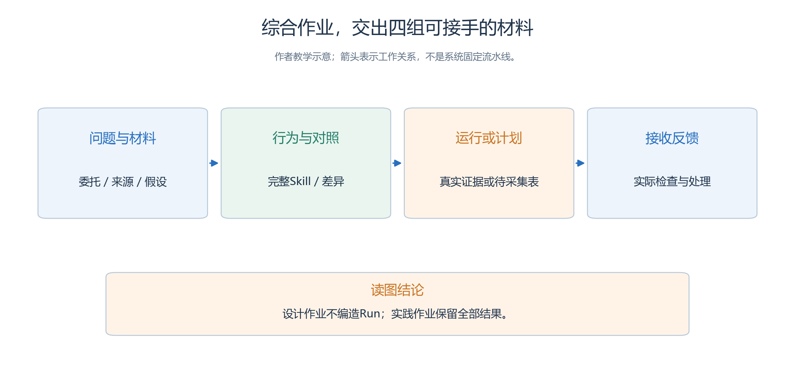
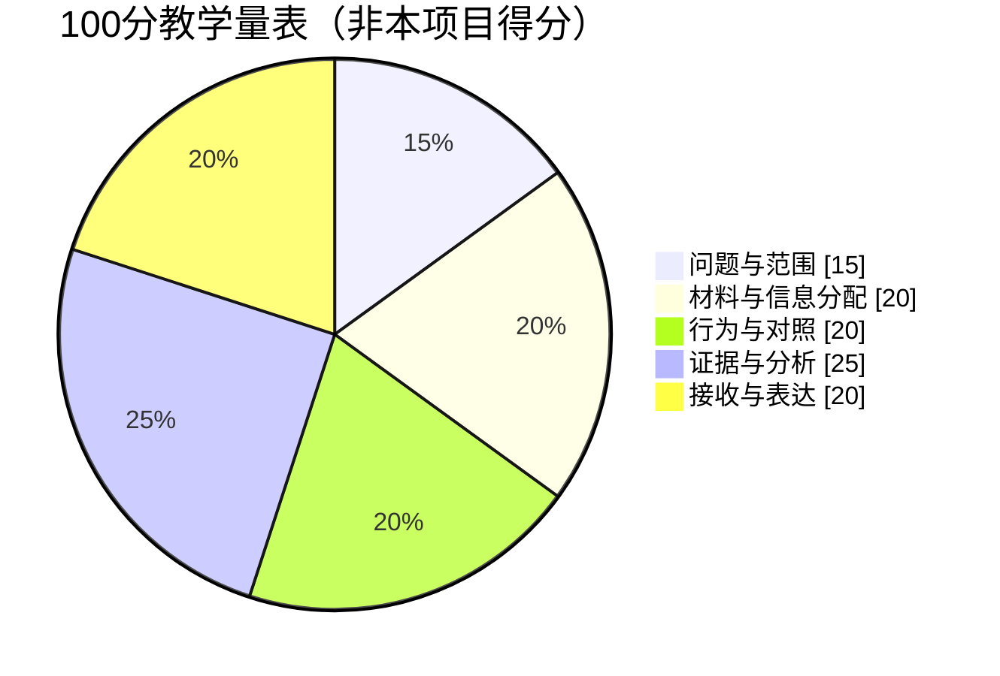
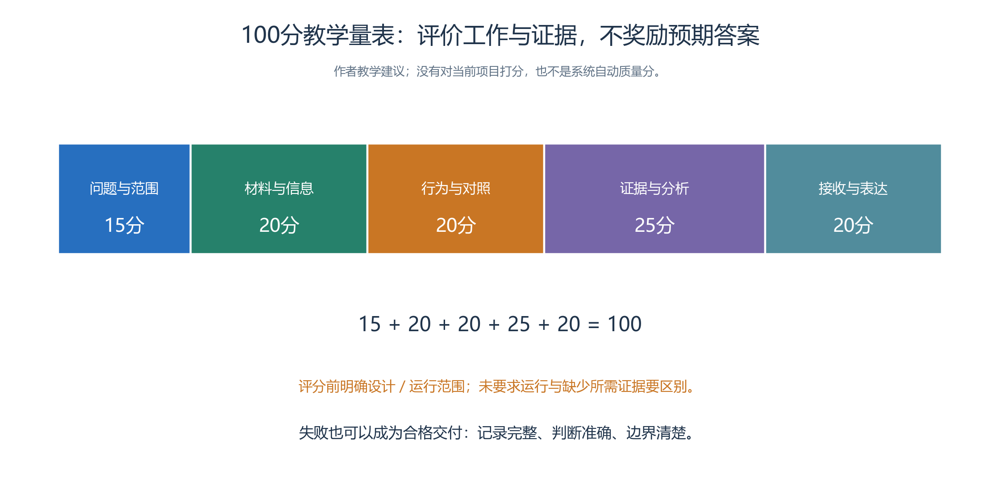

# 5.10 章末综合项目：让另一位操作者真正接手

读完全书之后，最有价值的练习是完成一次有明确接收者的交付。

- 接收者不必精通系统，但应能够独立判断交付物是什么、证据在哪里、哪些内容已经验证，以及下一步应如何继续。
- 把“作者能够讲明白”推进到“别人能够照着做”，可以检验前五章的知识是否已经连成一体。

本节给出可直接布置的综合作业。基础题沿用服务大厅；扩展题允许选择第四章其他场景，但每组只研究一个主要变化。作业不要求用最大模型、最多角色或最长时间，也不要求得到某个预期方向的结果。

## 5.10.1 先选择要交付的范围

**基础作业：设计交付。**适合尚未获得模型服务、没有运行预算，或正在学习系统的读者。交付一份完整项目设计、来源与假设、角色信息表、精确 Skill 与依赖清单、运行及判分计划，最后优先由另一人完成纸面接收。单人学习可按5.1的方法隔日自查，明确标记“非独立接收”。评分关注设计是否自洽、操作前提是否明确，不要求编造运行结果。

**实践作业：运行交付。**在基础作业上，通过系统 UI 完成独立资源、实验和运行，保存所有纳入项目的记录，制作可追溯报告，并完成双方约定的接收检查。重复次数和预算在开始前确定；如果只能完成很少的运行，应如实说明它属于小型探索，不做普遍优越的推断。

**扩展作业：独立环境接收。**由另一台机器上的接收者检查实际包、配置本机凭据，按可用且已核验的产品入口完成约定操作。不能通过发送成功、压缩包可解开或同机回放通过来替代这一层。案例配置与运行验收仍遵循本仓库的浏览器操作规则；如果所需入口尚未核验，就登记限制，不能绕过界面伪造验收完成。

这三种作业范围逐步增加证据。设计作业做得完整，可以得到完整的设计评价；它不会因为没有运行就被迫填上虚构的 Run。实践作业遇到失败，只要记录完整、判断准确，也能体现对系统和方法的掌握。

综合作业交付以下四组材料；接下来的5.10.2—5.10.5逐组说明要求，先按所选设计或运行范围理解第三组。

<!-- book-figure: s510-deliverables -->

*图5.10-1　四组材料构成后续四小节的总览；设计作业交待采集计划，运行作业交实际证据与全部结果，不能互相冒充。*

**原图参考（转换前）**

## 5.10.2 第一份交付：问题和材料

从[项目委托书](capstone/brief.md)开始，将委托目标改写成一个能够依据事实回答的问题。

- 保留第四章四项咨询需求，不改变其中的正确窗口映射，也不把评分答案分发给来访者。
- 若确实需要改任务，应作为自己的新设计重新说明分母、共同条件和评价范围。

随后填写[来源登记表](templates/source-register.md)。

- 区分作者虚构设定、当前产品事实、实测材料和外部方法依据。
- 给每项影响结果的假设写一个可能失败的条件：比如，窗口能并行答复多项请求意味着本题不描述现实窗口容量；
- 来访者如实说明目的意味着结果不能直接覆盖故意隐瞒的情境。

地图、人物和 Skill 的准备各自有完成条件。

- 地图需要真实语义边界、碰撞与可走站位；
- 人物需要资料和实验出生位置；
- Skill 需要完整正文与闭包。
- 纸面作业标为待制作，实践作业则通过 UI 保存后重开核对。
- 不要用“按第三章配置即可”跳过本案的具体内容。

## 5.10.3 第二份交付：行为与对照

交出两组咨询台的精确决策文本，以及两组共同使用的其他行为文本。

- 列出每个 Skill 的 `skill_key`、固有类型、使用角色、依赖和文件位置，说明实际运行使用的是哪一份包内副本。
- 这里的文本整理不建立业务 Revision，也不让 Run 动态引用公共资源。

由同伴做一次反例审读。

- 给他“目的仍缺失”“同一人已经回答关键字段”“收到错误窗口转介”“最后一轮才生成答复”等输入条件，让他仅根据 SOP 解释下一步。
- 若两人对同一条件有不同理解，先改清文本，不要指望增加模型调用次数消除作者歧义。

真正配置两组后，再核对共同条件与包内差异。

- 公共资源中的最新 Skill 不能证明已封存实验用的也是它。
- 发现导入副本与书面设计不一致时，记录差异及其影响；
- 需要调整 SEALED 实验时创建独立草稿，不能改写既有 Run 所依据的内容。

## 5.10.4 第三份交付：运行和结果

实践作业使用第四章的[全部运行索引](<../chapter 04/templates/run-ledger.md>)记录正式运行，也保留用于诊断的运行及其用途。实验计划先说明哪些样本进入比较，哪些是工程诊断，不在看到结果之后随意交换标签。

判分表按 H1—H4 逐行展开。

- 一个任务至少要能定位首次入口请求、实际得到的建议、窗口请求、适配回复以及是否完成确认；
- 缺少哪一环就写哪一环。
- 无效访问按真实错误窗口请求计数，首次有效回应与最终闭环分别处理。
- 解释动作时使用世界事实，解释调用代价时保留全部相关物理尝试。

设计作业在这个位置交空白采集表和一段明确标注的人工判分练习。

- 它应该展示自己知道怎样判，不应伪装成已取得数据。
- 实践作业则提交真实记录；
- 如果全部任务都未闭环，仍需说明失败发生在哪里、证据是否足够、是否值得修改方案。

报告至少包含方法、全部样本、主要结果、代价、替代解释和局限。配图可以很简单，原始计数比没有分母的大百分比更有用。每个主要结论都应在[需求—证据矩阵](templates/requirement-evidence-matrix.md)中找到对应依据。

## 5.10.5 第四份交付：接收与反馈处理

接收者首先只拿交付入口，不听作者口头补充。他应能够找到项目范围、组别差异、材料来源、原始文件和已知限制。然后随机选择一项需求，顺着证据矩阵定位支持材料，并写下实际检查结果。

如果约定接收运行成果，再核对实际文件类型、身份和哈希，并按[接收检查表](templates/recipient-checklist.md)完成约定层次。接收者无需将所有层次一次做完；完成只读回放就准确写只读回放，重新运行尚未执行就保留待执行。

作者依据这次反馈记录处理决定；

- 确实无需修改时写出理由，不为完成作业强造变更。
- 修正一个失效路径通常只影响说明；
- 更正错误判分需要更新结果及其派生图表；
- 改咨询台 SOP 则会影响实验行为，必须进入新的独立实验和运行安排。
- 用[变更影响表](templates/change-impact.md)说明处理范围，保留原始导出，避免把所有问题都用“重新打包一份最终版”掩盖。

## 5.10.6 一份可以说明理由的评分量表

先看100分怎样分配，再按后表核对每项需要的材料。分值相同，设计交付与运行交付提供的依据不同。

<!-- book-figure: s510-rubric -->

*图5.10-2　扇区表示作业评分权重，总计100分，不是本案已获分数；各项名称与下表对应。*

> 15+20+20+25+20=100。先明确设计或运行交付范围；失败也可形成合格交付，评价记录、判断与边界，不奖励预期答案。

**原图参考（转换前）**

以下是本书的教学评分建议，供讲师调整，不是系统自动质量分，也不是已经对本章进行的评分。评分前先选择作业范围，使“未要求运行”和“要求运行但无证据”得到不同处理。

| 维度 | 分值 | 设计交付的主要依据 | 运行交付增加的依据 |
| --- | ---: | --- | --- |
| 问题与范围 | 15 | 目标、用户、观察单位和边界具体 | 实际执行与约定一致或有偏差说明 |
| 材料与信息分配 | 20 | 来源、假设、角色知识无答案泄漏 | 保存后的资源和实验副本核对 |
| 行为与对照 | 20 | 精确 SOP、唯一变化和依赖明确 | 包内文本与共同条件的实际核对 |
| 证据与分析 | 25 | 判据可操作，人工练习标注清楚 | 全部样本、定位、费用和结论可追溯 |
| 接收与表达 | 20 | 他人能独立找到材料并提出反馈 | 实际接收范围、文件及复查结果完整 |
| 合计 | 100 | 按设计范围评分 | 按运行范围评分 |

同一维度可按充分、部分、缺失给分，并写一句理由。

- 伪造运行身份、把人工数据标成实测或删除不利样本，应先要求修正，相关维度不能凭包装精美获得通过。
- 作业评价的目的在于辨认知识与证据的缺口，不是奖励“所有任务成功”。

## 5.10.7 进一步扩展时，先识别改变了哪一层

读者常会提出三个后续方向。

- 第一类是改变策略，例如用清单核对替代自由整理，这主要进入 Skill 和研究设计。
- 第二类是改变输入与场景，例如角色数量或通知渠道，这需要重新核对信息分配、空间和比较条件。
- 第三类是新增系统机制，例如真实队列容量、动态碰撞或新的工具权限，这需要独立工程设计与验证，不能由一句 SOP 自动获得。

将来更换模型时，模型配置与能力评价也要重新进入视野。

- 第一章的基准帮助理解候选能力，第二章说明工具和上下文怎样影响表现；
- 它们都不能替代本场景的实际任务评价。
- 一个模型在知识题上得分更高，不保证它在长链请求、记忆与对象反馈中更稳定。

- 综合项目把这条学习路线连接起来：用能力证据提出合理预期，用技术组织可执行行为，用系统保存可核验事实，用研究方法解释差异，再把材料交给别人检查。
- 最后的练习不是再加一个功能，而是请接收者指出一条最想相信的结论，并让他独立找到足以支持或否定它的证据。

[上一节：迭代与维护](09-iteration-and-maintenance.md) · [参考资料](references.md) · [返回本章](README.md) · [返回全书](../README.md)
