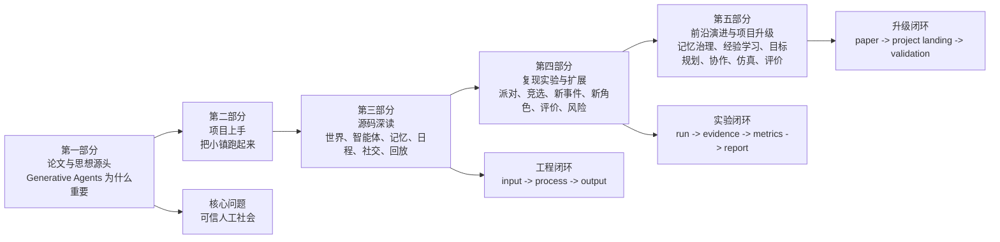
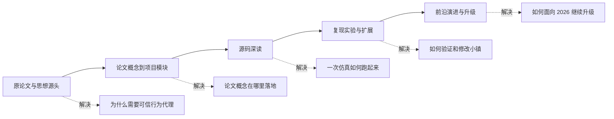

# 《从聊天机器人到虚拟小镇》——Generative Agents：论文、源码、实验与前沿升级


全书围绕 Stanford 论文《Generative Agents: Interactive Simulacra of Human Behavior》和本仓库 Generative Agents 展开，目标是把生成式智能体 Generative Agents 从论文思想、项目运行、源码机制、复现实验、可信评价一路讲到 2023-2026 年的前沿升级。

全书不是论文翻译，也不是 API 文档。它把智能体 agent 的关键问题落到真实项目材料里：角色配置、世界地图、提示词 prompt、记忆索引、仿真断点 checkpoint、对话记录 conversation、移动回放 movement、时间线报告 simulation、评价指标 metrics 和升级代码。

## 全书知识架构



全书主线可以压缩成一句话：

```text
论文思想 -> 项目运行 -> 源码机制 -> 复现实验 -> 可信评价 -> 前沿升级
```

## 分卷定位

这本书适合两类读者：一类想真正读懂 Generative Agents 这篇论文，另一类想把 Generative Agents 跑起来、改起来，并在它上面继续扩展。两类读者的起点不同，但最好都先按下面的顺序走一遍。

| 分卷 | 章节 | 核心问题 | 形成的知识能力 |
| --- | --- | --- | --- |
| 第一部分：原论文与思想源头 | 第 1-11 章 | 生成式智能体 Generative Agents 如何构造可信人工社会 | 理解 Smallville、人物定义 Persona、记忆流 Memory Stream、检索 Retrieval、反思 Reflection、日程 Planning、反应 Reacting、对话 Dialogue 和论文评价方法 |
| 第二部分：项目上手与功能体验 | 第 12-13 章 | 原项目如何跑起来，配置能改出什么实验 | 会运行最小仿真，读取 `movement.json`、`simulation.md`、`conversation.json`，通过配置自定义场景 |
| 第三部分：源码深读 | 第 14-23 章 | 一个智能体仿真系统如何从地图、角色、记忆、日程和社交循环中运转 | 能按输入 input、处理 process、输出 output 读懂世界模型 Maze、智能体 Agent、关联记忆 Associate、日程 Schedule、模型 provider 和回放系统 |
| 第四部分：复现实验与扩展 | 第 24-30 章 | 小镇实验如何复现、扩展和评价 | 能复现派对传播、竞选扩散，设计新事件、新角色、新地点、新关系，并建立可信行为评价和风险边界 |
| 第五部分：前沿演进与项目升级 | 第 31-38 章 | 2023-2026 年前沿研究如何落回本项目 | 能把记忆治理 memory governance、经验学习 experience learning、目标规划 goal planning、多智能体协作 multi-agent collaboration、社会仿真 social simulation 和评价体系 evaluation 转成可验证工程 |

## 阅读路径

本书的阅读路线如下。前面先把论文和项目读稳，后面再进入实验和前沿升级。



*图 1-11：本书阅读路线。读者先理解论文，再进入项目源码，最后用实验和前沿升级把项目真正用起来。*

## 完整目录

以下目录按正文实际标题展开到 `x.x` 小节层级；代码块、运行输出和报告模板中的标题不纳入目录。

### 第一部分：原论文与思想源头

1. [第 1 章：Generative Agents 的诞生](part_01/chapter_01.md)
   - 1.1 作者简介
   - 1.2 论文解决的问题
   - 1.3 HCI 视角
   - 1.4 普通 LLM 应用与生成式智能体的区别
   - 1.5 可信行为的边界
   - 1.6 传统 NPC 的局限
   - 1.7 另一条路：强化学习
   - 1.8 论文贡献：架构闭环
   - 1.9 本章小结

2. [第 2 章：论文的核心问题：如何构造一个可信的人工社会](part_01/chapter_02.md)
   - 2.1 群聊不是社会
   - 2.2 单轮聊天的根本局限
   - 2.3 可信人工社会需要三种连续性
   - 2.4 多智能体互动的级联效应
   - 2.5 可信人工社会不是全局剧本
   - 2.6 大语言模型在人工社会中扮演什么角色
   - 2.7 可信与可控之间的张力
   - 2.8 人工社会问题的工程落点
   - 2.9 本章小结

3. [第 3 章：Smallville：论文中的实验装置](part_01/chapter_03.md)
   - 3.1 小镇作为实验环境
   - 3.2 地图 map：行为必须发生在具体位置
   - 3.3 大区域 sector：小镇的生活场景
   - 3.4 场所 arena：建筑内部的空间
   - 3.5 设施 object / facility：行动如何落到具体对象
   - 3.6 时间 time：小镇如何形成生活顺序
   - 3.7 事件 event：环境如何被观察和记录
   - 3.8 小结：Smallville 提供世界，不提前讲角色

4. [第 4 章 论文架构一：人物定义 Persona](part_01/chapter_04.md)
   - 4.1 人物定义 Persona 的位置
   - 4.2 人物定义不是一句角色卡
   - 4.3 系统中如何定义一个角色
   - 4.4 base_desc.txt：基础人物描述模板
   - 4.5 agent.json：角色配置的真实格式
   - 4.6 Smallville 的 25 个角色
   - 4.7 好的人物定义要能产生行为
   - 4.8 本章小结

5. [第 5 章 论文架构二：记忆流 Memory Stream](part_01/chapter_05.md)
   - 5.1 从一段真实经历开始：克劳斯 Klaus Mueller 的论文对话
   - 5.2 聊天历史不够：过去必须成为状态
   - 5.3 记忆流 Memory Stream 保存什么
   - 5.4 一条记忆节点 Concept 长什么样
   - 5.5 关联记忆 Associate：记忆属于谁
   - 5.6 重要性 importance：记忆如何被评分
   - 5.7 本章小结

6. [第 6 章 论文架构三：检索 Retrieval](part_01/chapter_06.md)
   - 6.1 从克劳斯 Klaus Mueller 再次想起论文对话开始
   - 6.2 为什么不能读取全部记忆
   - 6.3 检索 Retrieval 的输入、处理、输出
   - 6.4 候选记忆从哪里来
   - 6.5 三因素重排：近期性 recency、相关性 relevance、重要性 importance
   - 6.6 检索结果的后续应用
   - 6.7 检索失败与参数设计
   - 6.8 可运行脚本：观察一次检索 Retrieval
   - 6.9 本章小结

7. [第 7 章 论文架构四：反思 Reflection](part_01/chapter_07.md)
   - 7.1 一条真实反思：克劳斯 Klaus Mueller 想到了什么
   - 7.2 反思 Reflection 解决什么问题
   - 7.3 反思函数 Agent.reflect() 的两条分支
   - 7.4 触发条件：触动程度 poignancy 过阈值
   - 7.5 常规反思：event / thought 如何生成新 thought
   - 7.6 对话反思：chat 如何生成计划类 thought 和长期记忆 thought
   - 7.7 统一写回：thought 最终进入哪里
   - 7.8 可运行脚本：断点复查与实时反思
   - 7.9 失败诊断与本章小结

8. [第 8 章 论文架构五：规划 Planning](part_01/chapter_08.md)
   - 8.1 从克劳斯 Klaus Mueller 的当前行动开始
   - 8.2 规划 Planning 解决什么问题
   - 8.3 Agent.make_schedule() 的输入、处理、输出
   - 8.4 日程 Schedule 保存什么数据
   - 8.5 起床与一天大纲：wake_up / schedule_init
   - 8.6 小时日程 schedule_daily：24 小时骨架
   - 8.7 递归拆解：schedule_decompose 与 current_plan()
   - 8.8 空间落地：plan / de_plan 如何变成 Action
   - 8.9 可运行脚本：观察规划如何使用反思 thought
   - 8.10 失败诊断与本章小结

9. [第 9 章 论文架构六：反应 Reacting](part_01/chapter_09.md)
   - 9.1 从克劳斯 Klaus Mueller 主动开口开始
   - 9.2 反应 Reacting 解决什么问题
   - 9.3 make_plan()：反应优先于继续行动
   - 9.4 反应 Reacting 的输入、处理、输出
   - 9.5 _reaction() 的三层门禁：焦点 focus、跳过 skip、分支 branch
   - 9.6 聊天触发 chat trigger：只决定是否开口
   - 9.7 等待 Waiting：空间冲突下的另一个分支
   - 9.8 写回边界：反应如何变成 Action
   - 9.9 可运行脚本：观察一次反应 Reacting
   - 9.10 失败诊断与本章小结

10. [第 10 章 论文架构七：对话 Dialogue](part_01/chapter_10.md)
   - 10.1 从克劳斯 Klaus Mueller 与阿伊莎 Ayesha Khan 的真实对话开始
   - 10.2 对话 Dialogue 解决什么问题
   - 10.3 `_chat_with()`：从开口裁决进入对话循环
   - 10.4 关系摘要 summarize_relation：先确定两个人怎么看彼此
   - 10.5 逐句生成 generate_chat：一句一句推进
   - 10.6 复读检查与结束判断：让对话停在合适位置
   - 10.7 对话摘要 summarize_chats：文本压成可保存事实
   - 10.8 写回边界：对话日志 conversation、行动 Action、聊天记忆 chat memory、反思输入 reflection input
   - 10.9 可运行脚本：观察一次对话 Dialogue
   - 10.10 失败诊断与本章小结

11. [第 11 章 论文的评价方法 Evaluation](part_01/chapter_11.md)
   - 11.1 评价 Evaluation 解决什么
   - 11.2 闭环案例：阿伊莎 Ayesha Khan 是否真的知道派对
   - 11.3 两层评价：受控评价 Controlled Evaluation 与端到端评价 End-to-End Evaluation
   - 11.4 受控评价 Controlled Evaluation：采访智能体
   - 11.5 五类访谈能力
   - 11.6 访谈回答如何进入提示词 prompt
   - 11.7 消融实验 Ablation：哪些模块真的有用
   - 11.8 人类评估 Human Evaluation 如何比较回答
   - 11.9 受控评价 Controlled Evaluation 的结论和错误边界
   - 11.10 端到端评价 End-to-End Evaluation：两天小镇仿真
   - 11.11 三类社会现象如何测量
   - 11.12 从论文评价到本项目证据链
   - 11.13 失败边界和常见误区
   - 11.14 评价视角下的论文贡献
   - 11.15 本章小结

### 第二部分：项目上手与功能体验

12. [第 12 章 把 Generative Agents 跑起来](part_02/chapter_12.md)
   - 12.1 综合冒烟测试 Smoke Test 要验证什么
   - 12.2 运行前检查：目录、模型配置和环境变量
   - 12.3 启动 book-smoke：角色列表、命令和标准输出 stdout
   - 12.4 断点 checkpoint：从行动到首次对话
   - 12.5 对话 conversation 与记忆 storage：Part 01 能力是否闭环
   - 12.6 压缩结果 compressed result：movement.json 与 simulation.md
   - 12.7 浏览器回放 replay：确认咖啡馆对话真的出现
   - 12.8 断点恢复 resume：继续跑到对话和长时间状态
   - 12.9 排错表与本章小结

13. [第 13 章 改配置，自定义智能体实验](part_02/chapter_13.md)
   - 13.1 配置迁移
   - 13.2 配置层能做什么，不能做什么
   - 13.3 先设计场景，再写 JSON
   - 13.4 备份并修改阿伊莎 Ayesha Khan 的配置
   - 13.5 修改克劳斯 Klaus Mueller 的配置
   - 13.6 运行配置实验
   - 13.7 控制台输出不是普通日志
   - 13.8 读取 conversation.json
   - 13.9 压缩结果并阅读 simulation.md
   - 13.10 阅读 movement.json
   - 13.11 本次运行生成了哪些文件
   - 13.12 恢复配置或保留实验
   - 13.13 迁移到自己的应用场景

### 第三部分：源码深读

14. [第 14 章 世界模型：地图格子、地址树与空间记忆](part_03/chapter_14.md)
   - 14.1 核心问题
   - 14.2 世界模型的优先位置
   - 14.3 地图数据入口：maze.json
   - 14.4 地址层级：世界 world、大区域 sector、场所 arena、游戏对象 game_object
   - 14.5 多层级地址的作用
   - 14.6 世界地图 Maze：从配置生成地图格子网格
   - 14.7 地图格子 Tile：后端表示
   - 14.8 事件 Event：让空间变成可感知状态
   - 14.9 地图格子 Tile 如何保存事件 Event
   - 14.10 从语义地址 address 到目标地图格子 Tile
   - 14.11 碰撞 collision 与寻路
   - 14.12 空间记忆 Spatial：角色自己的地点知识
   - 14.13 空间记忆 Spatial 与世界地图 Maze 的区别
   - 14.14 空间记忆找地址函数 Spatial.find_address()
   - 14.15 空间记忆加叶子函数 Spatial.add_leaf()
   - 14.16 世界模型如何服务感知
   - 14.17 世界模型如何服务计划
   - 14.18 世界模型如何服务社交
   - 14.19 世界模型如何服务对象占用
   - 14.20 世界模型如何服务回放
   - 14.21 世界模型的边界：地图生成困难
   - 14.22 世界模型的边界：地址回退 fallback
   - 14.23 世界模型的边界：场所 arena 感知简化
   - 14.24 世界模型的边界：对象语义依赖提示词 prompt
   - 14.25 如何读世界模型源码
   - 14.26 本章小结

15. [第 15 章 智能体初始化：角色设定如何进入系统](part_03/chapter_15.md)
   - 15.1 智能体初始化解决什么
   - 15.2 角色从哪里定义
   - 15.3 公共运行配置
   - 15.4 25 个角色配置清单
   - 15.5 agent.json 的真实结构
   - 15.6 角色设定如何进入提示词 prompt
   - 15.7 初始化链路
   - 15.8 智能体构造函数 Agent.__init__ 装配了什么
   - 15.9 初始行动 Action 如何写入世界地图 Maze
   - 15.10 可运行脚手架
   - 15.11 模型重置函数 reset、智能体补全函数 completion 与断点 checkpoint
   - 15.12 初始化检查
   - 15.13 本章小结

16. [第 16 章 仿真循环：入口脚本 start.py、游戏容器 Game 与智能体思考函数 Agent.think()](part_03/chapter_16.md)
   - 16.1 仿真循环解决什么
   - 16.2 入口命令与配置骨架
   - 16.3 角色集合决定循环顺序
   - 16.4 新仿真与断点恢复
   - 16.5 全局计时器 Timer：同一个仿真步 step 的共同时间
   - 16.6 仿真服务容器 SimulateServer 初始化了什么
   - 16.7 仿真循环函数 SimulateServer.simulate() 的真实循环
   - 16.8 角色思考包装函数 Game.agent_think() 包装了什么
   - 16.9 智能体思考函数 Agent.think() 的真实执行顺序
   - 16.10 日程计划 Schedule plan、行动 Action 和返回计划 plan
   - 16.11 断点 checkpoint 与对话 conversation 写入
   - 16.12 记录间隔字段 record_iterval 与记录点
   - 16.13 可运行脚手架
   - 16.14 完整仿真的调试顺序
   - 16.15 工程边界
   - 16.16 本章小结

17. [第 17 章 感知：智能体如何看见附近事件](part_03/chapter_17.md)
   - 17.1 核心问题
   - 17.2 感知不是全局读取
   - 17.3 智能体感知函数 Agent.percept() 的入口
   - 17.4 感知数据结构：事件 Event
   - 17.5 视野范围函数 Maze.get_scope()
   - 17.6 方形视野的工程取舍
   - 17.7 感知顺便更新空间记忆
   - 17.8 场所 arena 过滤
   - 17.9 收集地图格子事件 tile events
   - 17.10 距离排序与注意力带宽
   - 17.11 去重：避免重复写入记忆
   - 17.12 空闲事件如何处理
   - 17.13 非空闲事件如何写入记忆
   - 17.14 概念写入函数 _add_concept() 与重要性评分
   - 17.15 概念缓存 self.concepts 的作用
   - 17.16 过滤自身事件
   - 17.17 感知日志
   - 17.18 感知如何驱动信息扩散
   - 17.19 感知如何驱动关系形成
   - 17.20 感知如何驱动反思
   - 17.21 当前感知机制的边界
   - 17.22 可改进方向
   - 17.23 如何调试感知
   - 17.24 本章小结

18. [第 18 章 记忆：事件、对话、想法如何存储和检索](part_03/chapter_18.md)
   - 18.1 核心问题
   - 18.2 记忆模块的源码位置
   - 18.3 事件 Event：进入记忆系统的输入
   - 18.4 记忆数据结构：概念节点 Concept
   - 18.5 记忆在 Associate 中的保存格式
   - 18.6 三类记忆：事件 event、聊天 chat、想法 thought
   - 18.7 关联记忆 Associate：一个智能体 agent 的记忆管理器
   - 18.8 写入函数 add_node()：写入记忆
   - 18.9 记忆过期
   - 18.10 最大记忆数 max_memory：记忆数量限制
   - 18.11 索引清理函数 cleanup_index()
   - 18.12 向量索引 LlamaIndex：底层向量索引
   - 18.13 索引写入函数 add_node()
   - 18.14 基础检索函数 retrieve_events()、retrieve_thoughts()、retrieve_chats()
   - 18.15 对话检索函数 retrieve_chats() 的特殊查询
   - 18.16 多焦点检索函数 retrieve_focus()
   - 18.17 结果合并参数 reduce_all
   - 18.18 关联记忆检索器 AssociateRetriever：三因素重排
   - 18.19 新近性 recency 分数
   - 18.20 相关性 relevance 分数
   - 18.21 重要性 importance 分数
   - 18.22 更新访问时间 access
   - 18.23 持久化函数 to_dict()：记忆持久化
   - 18.24 记忆系统如何影响行为
   - 18.25 记忆失败模式
   - 18.26 如何检查一个智能体 agent 的记忆
   - 18.27 可改进方向
   - 18.28 本章小结

19. [第 19 章 日程：从一天计划到具体动作](part_03/chapter_19.md)
   - 19.1 核心问题
   - 19.2 日程的核心地位
   - 19.3 日程 Schedule 数据结构
   - 19.4 追加计划 add_plan()
   - 19.5 日程检查 scheduled()：当天是否已有日程
   - 19.6 日程生成 make_schedule() 总览
   - 19.7 新一天前更新当前目标 currently
   - 19.8 起床时间 wake_up：生成起床时间
   - 19.9 日程大纲 schedule_init：生成日程大纲
   - 19.10 小时日程 schedule_daily：生成小时级日程
   - 19.11 转成分钟制粗计划 plan
   - 19.12 把当天计划写入想法 thought
   - 19.13 当前计划 current_plan()
   - 19.14 拆解判断 decompose()：是否需要拆解
   - 19.15 日程拆解 schedule_decompose：粗计划变子计划
   - 19.16 子计划如何写回粗计划 plan
   - 19.17 动作生成 _determine_action()：日程落到动作
   - 19.18 日程修订 revise_schedule()：意外插入当前计划
   - 19.19 对话日程 schedule_chat()
   - 19.20 等待也会改写日程
   - 19.21 日程如何影响可信行为
   - 19.22 日程失败模式
   - 19.23 日程实验怎么设计
   - 19.24 可改进方向
   - 19.25 本章小结

20. [第 20 章 社交：聊天、等待与关系传播](part_03/chapter_20.md)
   - 20.1 核心问题
   - 20.2 社交从现场反应 reaction 开始
   - 20.3 _reaction() 如何选择焦点 focus
   - 20.4 关系上下文：get_relation()
   - 20.5 现场反应 reaction 的两条路径
   - 20.6 _skip_react()：何时不反应
   - 20.7 _chat_with() 的前置条件
   - 20.8 最近聊天冷却
   - 20.9 decide_chat：是否应该主动聊天
   - 20.10 summarize_relation：双方视角不同
   - 20.11 summarize_relation 如何检索
   - 20.12 generate_chat：生成一句话
   - 20.13 对话记忆检索
   - 20.14 多轮对话循环
   - 20.15 防复读
   - 20.16 decide_chat_terminate：判断话题结束
   - 20.17 保存对话记录 conversation
   - 20.18 summarize_chats：对话摘要
   - 20.19 schedule_chat：写回双方
   - 20.20 对话时长如何估算
   - 20.21 对话如何进入反思
   - 20.22 _wait_other()：等待机制
   - 20.23 decide_wait 的常识示例
   - 20.24 社交如何支撑信息扩散
   - 20.25 社交如何支撑关系形成
   - 20.26 社交失败模式
   - 20.27 如何调试一次对话
   - 20.28 社交实验怎么设计
   - 20.29 可改进方向
   - 20.30 本章小结

21. [第 21 章 反思：重要事件如何变成长期认知](part_03/chapter_21.md)
   - 21.1 核心问题
   - 21.2 reflect() 在 think() 中的位置
   - 21.3 触发条件：poignancy_max
   - 21.4 累计阈值的作用
   - 21.5 反思输入：事件 events + 想法 thoughts
   - 21.6 节点选择：max_importance
   - 21.7 日志：反思触发可观察
   - 21.8 第一步：生成反思焦点
   - 21.9 第二步：围绕焦点检索证据
   - 21.10 第三步：生成洞察 insights
   - 21.11 证据 evidence 的意义
   - 21.12 _add_thought()
   - 21.13 想法 thought 也会被评分
   - 21.14 对话反思
   - 21.15 chats 从哪里来
   - 21.16 状态清零
   - 21.17 反思如何影响后续行为
   - 21.18 调试反思的检查点
   - 21.19 反思失败模式
   - 21.20 反思实验怎么设计
   - 21.21 可改进方向
   - 21.22 本章小结

22. [第 22 章 模型适配：Ollama、MiniMax、OpenAI 与结构化输出](part_03/chapter_22.md)
   - 22.1 核心问题
   - 22.2 模型调用总链路
   - 22.3 Result：提示词 prompt 调用契约
   - 22.4 Pydantic 输出结构 schema 的作用
   - 22.5 模型基类 LLMModel
   - 22.6 模型统一调用 completion()
   - 22.7 OpenAI 模型提供方 provider
   - 22.8 Ollama 模型提供方 provider
   - 22.9 `<think>` 标签过滤
   - 22.10 MiniMax 模型提供方 provider
   - 22.11 parse_structured_output()
   - 22.12 create_llm_model()
   - 22.13 向量嵌入提供方 embedding provider
   - 22.14 OllamaHttpEmbedding
   - 22.15 当前配置与 README 的关系
   - 22.16 模型质量对仿真的影响
   - 22.17 成本与速度
   - 22.18 失败与 failsafe
   - 22.19 模型适配的边界
   - 22.20 模型实验怎么设计
   - 22.21 可改进方向
   - 22.22 本章小结

23. [第 23 章 回放系统：断点 checkpoint、移动回放文件 movement.json、时间线报告 simulation.md 与前端渲染引擎 Phaser](part_03/chapter_23.md)
   - 23.1 核心问题
   - 23.2 先读一条真实数据流
   - 23.3 从仿真到回放的三阶段
   - 23.4 断点 checkpoint 是原始仿真状态
   - 23.5 对话文件 conversation.json：全局对话证据
   - 23.6 压缩脚本 compress.py 的两个输出
   - 23.7 生成移动函数 generate_movement() 总览
   - 23.8 移动回放文件 movement.json 的顶层结构
   - 23.9 第 0 帧：insert_frame0()
   - 23.10 从断点 checkpoint 到路径 path
   - 23.11 每步帧数 frames_per_step：一个仿真步展开成 60 帧
   - 23.12 行动 action 文本如何生成
   - 23.13 对话如何进入移动回放文件 movement.json
   - 23.14 生成报告函数 generate_report()：生成时间线报告 simulation.md
   - 23.15 时间线报告 simulation.md 的价值
   - 23.16 回放服务 replay.py：Web 服务框架 Flask
   - 23.17 仿真步 step、回放速度 speed、缩放比例 zoom
   - 23.18 前端模板 index.html 与角色面板
   - 23.19 回放与断点 checkpoint 的区别
   - 23.20 回放系统如何服务复现实验
   - 23.21 回放系统调试清单
   - 23.22 回放系统边界
   - 23.23 可改进方向
   - 23.24 第三部分总结
   - 23.25 本章小结

### 第四部分：复现实验与扩展

24. [第 24 章 复现论文中的情人节派对传播](part_04/chapter_24.md)
   - 24.1 核心问题
   - 24.2 这个实验验证什么
   - 24.3 实验角色选择
   - 24.4 实验时间设置
   - 24.5 10 人运行命令
   - 24.6 10 人配置的观察重点
   - 24.7 观察文件一：simulation.md
   - 24.8 观察文件二：conversation.json
   - 24.9 观察文件三：movement.json
   - 24.10 如何判断“知道派对”
   - 24.11 如何判断“传播成功”
   - 24.12 如何判断“参加派对”
   - 24.13 真实观察报告：book-party-extended 10 人实验复盘
   - 24.14 本次实验结论
   - 24.15 常见失败一：伊莎贝拉 Isabella Rodriguez 没有邀请别人
   - 24.16 常见失败二：邀请中没有时间地点
   - 24.17 常见失败三：知道但不到场
   - 24.18 常见失败四：无证据知道
   - 24.19 实验记录模板
   - 24.20 扩展实验
   - 24.21 本章小结

25. [第 25 章 复现镇长竞选信息扩散](part_04/chapter_25.md)
   - 25.1 核心问题
   - 25.2 实验目标
   - 25.3 推荐角色
   - 25.4 运行命令
   - 25.5 观察关键词
   - 25.6 信息扩散记录表
   - 25.7 态度记录表
   - 25.8 如何判断“知道山姆 Sam Moore 竞选”
   - 25.9 汤姆 Tom Moreno 的实验价值
   - 25.10 与派对实验的差异
   - 25.11 预期现象
   - 25.12 常见失败一：山姆 Sam Moore 不谈竞选
   - 25.13 常见失败二：竞选信息传播但态度单一
   - 25.14 常见失败三：幻觉知道
   - 25.15 真实实验结果：book-election-extended
   - 25.16 实验指标
   - 25.17 实验记录模板
   - 25.18 扩展实验
   - 25.19 本章小结

26. [第 26 章 设计自己的小镇事件](part_04/chapter_26.md)
   - 26.1 核心问题
   - 26.2 好事件的标准
   - 26.3 示例事件设定
   - 26.4 本章改动清单
   - 26.5 改动一：修改 currently
   - 26.6 改动二：修改 daily_plan
   - 26.7 为什么不改其他角色
   - 26.8 为什么不改地图
   - 26.9 配置如何变成行动
   - 26.10 运行命令
   - 26.11 控制台输出怎么读
   - 26.12 观察关键词
   - 26.13 真实实验结果：book-custom-discussion
   - 26.14 到场判断
   - 26.15 事件是否真正发生
   - 26.16 不要硬编码结果
   - 26.17 如何增强事件稳定性
   - 26.18 失败模式
   - 26.19 设计更多事件
   - 26.20 本章小结

27. [第 27 章 增加新角色、新地点、新关系](part_04/chapter_27.md)
   - 27.1 核心问题
   - 27.2 扩展优先级
   - 27.3 本章使用的完整扩展示例
   - 27.4 新增角色资源目录
   - 27.5 新增角色 agent.json
   - 27.6 把新角色加入 start.py
   - 27.7 新增地点：社区公告板
   - 27.8 把新地点写进相关角色的 spatial.tree
   - 27.9 写入新关系：林晓 Lin Xiao、伊莎贝拉 Isabella Rodriguez、山姆 Sam Moore 和汤姆 Tom Moreno
   - 27.10 为什么这些改动缺一不可
   - 27.11 修改后的最小自检
   - 27.12 可执行实验：林晓 Lin Xiao 采访社区公告板
   - 27.13 真实实验结果：book-extension-linxiao
   - 27.14 本章小结

28. [第 28 章 用中文本地模型重跑论文思想](part_04/chapter_28.md)
   - 28.1 核心问题
   - 28.2 本地模型实验不是部署教程
   - 28.3 本章实验的目标
   - 28.4 当前项目的模型配置入口
   - 28.5 大语言模型 LLM 适配层做了什么
   - 28.6 结构化输出是第一道关卡
   - 28.7 用本地模型重跑的最小实验
   - 28.8 推荐运行参数
   - 28.9 实验前检查清单
   - 28.10 本地模型实验记录模板
   - 28.11 观察一：结构化输出通过率
   - 28.12 观察二：日程多样性
   - 28.13 观察三：对话自然性
   - 28.14 观察四：记忆检索是否抓住关键事实
   - 28.15 观察五：反思是否产生高层认知
   - 28.16 观察六：事件传播是否成立
   - 28.17 模型比较矩阵
   - 28.18 混合模型策略
   - 28.19 常见失败模式
   - 28.20 如何判断本地模型实验成功
   - 28.21 如何写实验结论
   - 28.22 对读者的推荐路径
   - 28.23 本地模型实验与论文思想的关系
   - 28.24 本章小结

29. [第 29 章 如何评价一个智能体是否“可信”](part_04/chapter_29.md)
   - 29.1 核心问题
   - 29.2 “可信”不是“真实”
   - 29.3 对话之外的可信证据
   - 29.4 可信行为的六个维度
   - 29.5 维度一：身份一致性
   - 29.6 维度二：记忆连续性
   - 29.7 记忆评价的证据链
   - 29.8 维度三：计划合理性
   - 29.9 计划评价的常见指标
   - 29.10 维度四：反应合理性
   - 29.11 维度五：社会传播可信度
   - 29.12 社会传播的指标
   - 29.13 维度六：行动落地能力
   - 29.14 一套 1-5 分评分规则
   - 29.15 可信行为评分表模板
   - 29.16 用评分比较两个实验
   - 29.17 受控评价：采访智能体
   - 29.18 端到端评价：观察小镇现象
   - 29.19 不要把成功率当成唯一目标
   - 29.20 失败样例如何变成改进方向
   - 29.21 评价报告模板
   - 29.22 本章框架如何连接第五部分
   - 29.23 本章小结

30. [第 30 章 风险、伦理与边界](part_04/chapter_30.md)
   - 30.1 核心问题
   - 30.2 风险不是附录
   - 30.3 第一类风险：拟人化
   - 30.4 如何降低拟人化误解
   - 30.5 第二类风险：把仿真当预测
   - 30.6 社会仿真结论的正确写法
   - 30.7 第三类风险：记忆幻觉
   - 30.8 记忆幻觉的来源
   - 30.9 如何处理记忆幻觉
   - 30.10 第四类风险：过度合作
   - 30.11 如何检查过度合作
   - 30.12 第五类风险：价值偏差与刻板表达
   - 30.13 第六类风险：真实人物与真实组织
   - 30.14 第七类风险：隐私与日志
   - 30.15 第八类风险：模型供应链与配置漂移
   - 30.16 第九类风险：把评价自动化过头
   - 30.17 第十类风险：用户干预的误读
   - 30.18 第十一类风险：选择性展示
   - 30.19 风险检查清单
   - 30.20 风险与工程改进的关系
   - 30.21 对开源项目作者和读者的建议
   - 30.22 本章与第五部分的连接
   - 30.23 本章小结

### 第五部分：前沿演进与项目升级

31. [第 31 章 智能体仿真的前沿研究实践](part_05/chapter_31.md)
   - 前置：前沿论文时间轴
   - 31.1 从前沿概念的项目落点开始
   - 31.2 2023 年的地基：可信行为链
   - 31.3 前沿判断原则
   - 31.4 长期记忆治理 memory governance
   - 31.5 反思式学习 reflexion-style learning
   - 31.6 目标规划 goal planning
   - 31.7 组织化协作 multi-agent collaboration
   - 31.8 社会仿真 social simulation
   - 31.9 评价体系 evaluation
   - 31.10 中文、本地模型与模型路由 model routing
   - 31.11 工程可观测性 observability
   - 31.12 本章小结

32. [第 32 章 记忆系统升级：从记忆流 Memory Stream 到可管理长期记忆](part_05/chapter_32.md)
   - 32.1 当前记忆能保存事实，但还不能治理事实
   - 32.3 当前实现的瓶颈
   - 32.4 升级方向一：扩展记忆类型 memory types
   - 32.5 升级方向二：结构化关系记忆 relationship memory
   - 32.6 升级方向三：记忆合并 merge 与摘要 summary
   - 32.7 升级方向四：冲突检测 conflict detection
   - 32.8 升级方向五：跨实验长期记忆 long-term memory
   - 32.9 升级方向六：来源 source 与置信度 confidence
   - 32.10 升级方向七：场景化检索 contextual retrieval
   - 32.11 升级后的评价指标 evaluation metrics
   - 32.12 实验设计与执行命令
   - 32.13 实验结果分析
   - 32.14 风险与边界
   - 32.15 本章小结

33. [第 33 章 反思系统升级：从事件反思到经验学习](part_05/chapter_33.md)
   - 33.1 从一次没有落地的邀请开始
   - 33.2 高频术语锚点表
   - 33.3 已有反思链路基线图
   - 33.4 升级点一：结果标签 outcome
   - 33.5 升级点二：自我评估 prompt
   - 33.6 升级点三：从结果抽取经验 lesson
   - 33.7 升级点四：技能记忆 skill memory
   - 33.8 升级点五：把 lesson / skill 接入计划和对话
   - 33.9 失败驱动反思 trigger
   - 33.10 反思质量评分
   - 33.11 实验设计与执行命令
   - 33.12 实验结果分析
   - 33.13 风险与边界
   - 33.14 本章小结

34. [第 34 章 规划系统升级：从日程拆解到目标驱动行动](part_05/chapter_34.md)
   - 34.1 17:00 的派对为什么仍需要目标规划
   - 34.2 高频术语锚点表
   - 34.3 旧规划链路的最小基线：目标能插在哪里
   - 34.4 升级点一：目标 Goal 对象
   - 34.5 升级点二：目标影响日程 prompt
   - 34.6 升级点三：多候选行动 candidate actions
   - 34.7 升级点四：目标进度 progress 评估
   - 34.8 升级点五：轻量工具调用 tool use
   - 34.9 升级点六：行动反馈 feedback
   - 34.10 实验设计与执行命令
   - 34.11 实验结果分析
   - 34.12 评价指标和公式卡片
   - 34.13 失败模式和排查路径
   - 34.14 本章小结

35. [第 35 章 多智能体协作升级：从自然偶遇到组织化协作](part_05/chapter_35.md)
   - 35.1 派对准备卡在“谁负责”
   - 35.2 项目锚点和术语
   - 35.3 升级入口：自然对话之后抽取协作状态
   - 35.4 升级一：公共事件板 event board
   - 35.5 升级二：临时工作组 temporary workgroup
   - 35.6 升级三：协作对话协议 dialogue act
   - 35.7 升级四：共享记忆 shared memory
   - 35.8 升级五：协作冲突处理 conflict resolution
   - 35.9 升级六：协作可视化 collaboration visualization
   - 35.10 实验设计与执行命令
   - 35.11 实验结果分析
   - 35.12 协作指标 metrics
   - 35.13 风险与边界
   - 35.14 本章小结

36. [第 36 章 社会仿真升级：从小镇 Smallville 到更大规模实验](part_05/chapter_36.md)
   - 36.1 要解决的问题：把多次运行变成实验对象
   - 36.2 已有证据链：从单次 run 到批量报告
   - 36.3 升级一：实验清单 experiment manifest
   - 36.4 升级二：批量运行 batch runs
   - 36.5 升级三：传播统计 diffusion metrics
   - 36.6 升级四：到场和轨迹统计 attendance metrics
   - 36.7 升级五：多次运行差异 multi-run spread
   - 36.8 升级六：对照实验 controlled experiment
   - 36.9 升级七：事件级数据集 event dataset
   - 36.10 升级八：自动报告 report generation
   - 36.11 与现实社会的边界
   - 36.12 实验设计与执行命令
   - 36.13 实验结果分析
   - 36.14 本章小结

37. [第 37 章 评价体系升级：从故事可信到可复现实验指标](part_05/chapter_37.md)
   - 37.1 要解决的问题：把故事判断变成可复查评价
   - 37.2 评价对象与证据等级
   - 37.3 对话传播：从 conversation 到 event_board
   - 37.4 到场验证：从 movement 到 attendance
   - 37.5 断点复查：从 checkpoint 定位失败层
   - 37.6 评价产物：metrics、report 与辅助文件
   - 37.7 批量比较：从多个 metrics 到 batch_summary
   - 37.8 失败分类：从候选字段到诊断路径
   - 37.9 评价脚本落地与执行命令
   - 37.10 实验结果分析
   - 37.11 不要为了指标牺牲交互可信
   - 37.12 本章小结

38. [第五部分小结：从升级方向到可验证工程](part_05/chapter_38.md)
   - 已经落地的能力
   - 仍然只是路线图的内容
   - 后续实践顺序
   - 全书收束

## 核心知识地图

| 知识层 | 关键章节 | 关键对象 |
| --- | --- | --- |
| 论文问题 | 第 1-3 章 | 可信人工社会、Smallville、涌现行为 |
| 认知架构 | 第 4-11 章 | 人物定义 Persona、记忆流 Memory Stream、检索 Retrieval、反思 Reflection、日程 Planning、反应 Reacting、对话 Dialogue、评价 Evaluation |
| 运行材料 | 第 12-13 章 | `config.json`、`movement.json`、`simulation.md`、`conversation.json`、checkpoint |
| 工程实现 | 第 14-23 章 | `Maze`、`Tile`、`Event`、`Agent`、`Associate`、`Schedule`、`LLMModel`、Phaser replay |
| 实验复现 | 第 24-28 章 | 派对传播、竞选扩散、自定义事件、新角色、新地点、本地模型 |
| 可信评价 | 第 29-30 章 | 身份一致性、记忆连续性、计划合理性、社会传播、行动落地、风险边界 |
| 前沿升级 | 第 31-38 章 | 记忆治理、经验学习、目标规划、协作证据、批量仿真、可复查评价 |

## 写作约束

1. 每章必须有清楚的核心问题。
2. 论文观点必须标明来源。
3. 项目实现必须标明文件路径、类和函数。
4. 源码章节必须同时讲 Python、数据结构和提示词 prompt。
5. 技术机制必须讲清输入 input、处理 process、输出 output。
6. 实验章节必须包含运行命令、观察材料、评价指标和失败模式。
7. 前沿章节必须说明项目落点、验证方式和工程边界。
8. 不写成论文翻译，不写成 API 文档，不神化智能体 agent。

## 当前状态

- 正文共 38 章。
- `README.md` 是全书唯一目录入口。
- 各章正文位于 `part_01/` 到 `part_05/`。
- 书稿优化流程记录在 [../08_editorial_workflow.md](../08_editorial_workflow.md)。
