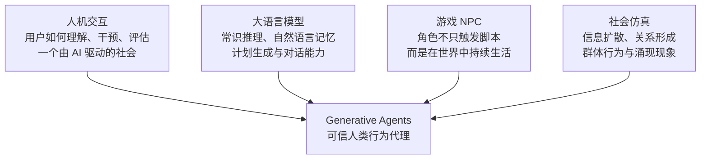
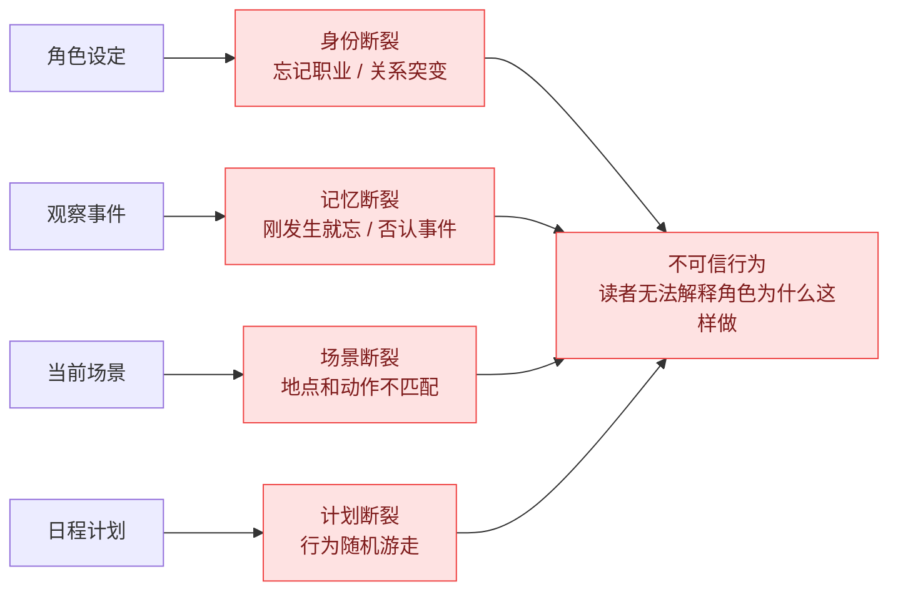
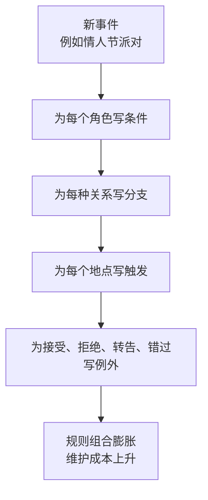
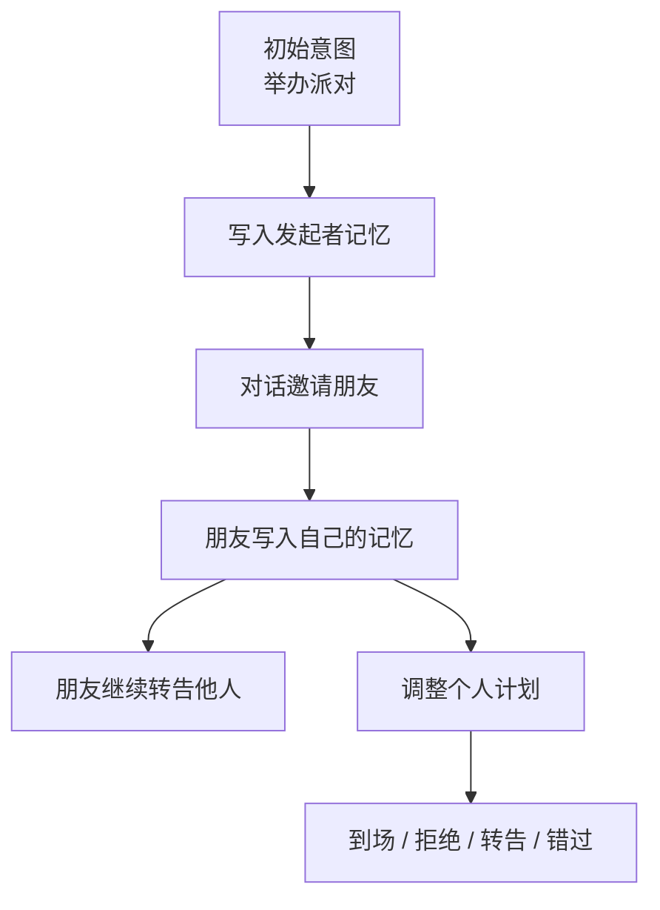
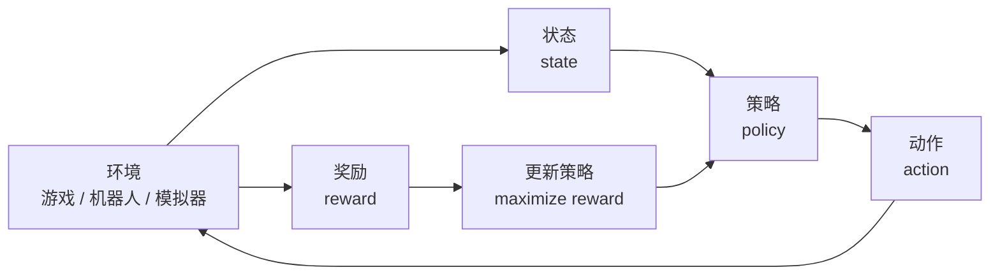
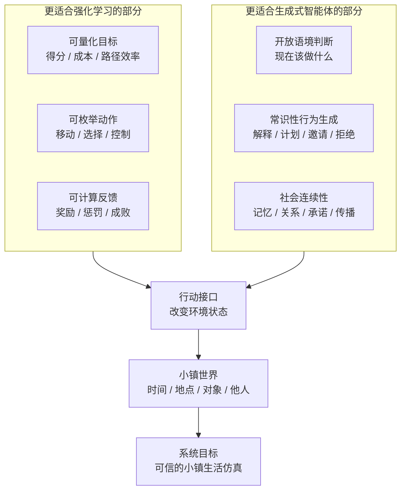
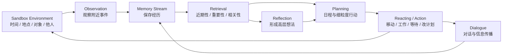
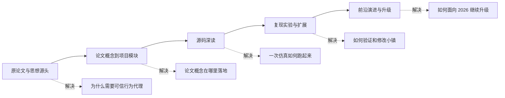

# 第 1 章：原作者与 Generative Agents 的诞生

## 1.1 作者简介

2023 年，Joon Sung Park、Joseph C. O'Brien、Carrie J. Cai、Meredith Ringel Morris、Percy Liang 和 Michael S. Bernstein 发表了论文 *Generative Agents: Interactive Simulacra of Human Behavior*。这篇论文后来成为生成式智能体方向绕不开的起点之一。六位作者来自 Stanford、Google Research 和 Google DeepMind 相关研究环境，研究背景横跨人机交互、大语言模型、社会计算、基础模型和智能体系统。这组背景决定了论文的系统性质：它不是普通 LLM 应用，而是一篇系统味很重的 HCI 论文。

<table>
  <tr>
    <td width="126" align="center"></td>
    <td>
      <strong>Joon Sung Park</strong> 
      论文第一作者，也是 Generative Agents 研究方向最重要的推动者之一。他的个人主页把研究方向概括为 human-computer interaction、natural language processing、generative agents、social computing 和 human-AI interaction。到 2026 年，他的研究已经从 Smallville 延伸到更大的问题：如何用语言模型代理模拟人类行为和社会。放回这篇论文里看，Joon 承担的是把想法落成系统、把系统组织成实验、再把实验讲成一个清楚研究问题的角色。
    </td>
  </tr>
  <tr>
    <td width="126" align="center"></td>
    <td>
      <strong>Joseph C. O'Brien</strong> 
      论文作者页将 Joseph C. O'Brien 列为 Stanford University 作者；Joon 的 Generative Agents 论文条目把 Joseph O'Brien 链接到公开的作者页。他是 Stanford 侧参与这项工作的合作者之一，并出现在论文作者序列的第二位。这个位置提醒读者，论文背后不只有资深教授和研究科学家，也有具体参与系统实现、实验推进和论文写作的年轻研究者。
    </td>
  </tr>
  <tr>
    <td width="126" align="center"></td>
    <td>
      <strong>Carrie J. Cai</strong> 
      Carrie J. Cai 是 Google DeepMind 的 Principal Research Scientist，长期研究 AI、HCI 和 human-centered AI 的交叉问题。她此前在 Google Brain 和 People + AI Research 相关环境中做过大量人机协作、AI 辅助工具和用户理解方面的工作。Generative Agents 需要的不只是“让模型能说话”，还需要解释用户如何观察智能体、如何判断可信行为、如何处理系统边界；Carrie 的背景把论文拉回 human-AI interaction 的主线。
    </td>
  </tr>
  <tr>
    <td width="126" align="center"></td>
    <td>
      <strong>Meredith Ringel Morris</strong> 
      Meredith Ringel Morris，也常用 Merrie Morris，是 Human-AI Interaction、Human-Centered AI、AI Safety、Responsible AI、可访问性和社会计算领域的重要研究者。她的个人主页显示，写作本书时她担任 Google DeepMind 的 Post-AGI Interaction Research 负责人，此前也曾领导 Google Research 的 People + AI Research 团队。放到 Generative Agents 中看，她带来的不是某个孤立代码模块，而是评价“可信行为”时必须具备的 HCI 视角：行为是否可解释，用户是否会误解，系统边界是否清楚。
    </td>
  </tr>
  <tr>
    <td width="126" align="center"></td>
    <td>
      <strong>Percy Liang</strong> 
      Percy Liang 是 Stanford Computer Science 教授，长期研究机器学习、自然语言处理和基础模型。写作本书时，他的个人主页强调开放模型建设、语言模型课程和基础模型发展。Generative Agents 需要 LLM 的常识推理、语言表达和上下文整合能力，但论文没有停留在“模型能力展示”；Percy 的背景帮助这篇论文把语言模型能力放进更清楚的系统结构里。
    </td>
  </tr>
  <tr>
    <td width="126" align="center"></td>
    <td>
      <strong>Michael S. Bernstein</strong> 
      Michael S. Bernstein 是 Stanford Computer Science 教授，也是 Stanford HCI 的代表性学者。他的个人主页把研究重点放在 interactive computing systems、social computing、collective intelligence、社会性技术和人类行为建模上。Joon 的主页也显示，Michael 和 Percy 是其博士阶段的重要导师。Smallville 很容易被看成一个“AI 小镇演示”，但从 Michael 的研究脉络看，它更像一个 HCI 系统：用可交互系统研究社会行为、协作、传播和人类对 AI 的理解。
    </td>
  </tr>
</table>

这组作者的组合决定了论文的基本形状：Joon 和 Joseph 参与系统与实验推进，Carrie 和 Meredith 提供 human-AI interaction 与可信评价视角，Percy 提供基础模型与自然语言推理视角，Michael 提供 HCI 系统、社会计算和交互式社会实验传统。

## 1.2 论文的领域交叉位置

Generative Agents 要解决的不是单点模型能力，而是一组互相牵连的系统问题。每个问题都能在不同研究领域中找到来源。

| 需要解决的问题 | 对应领域 | 这个领域提供的视角 |
| --- | --- | --- |
| 角色如何根据身份、经历和当前情境生成合理行为 | 大语言模型 / NLP | 常识推理、角色扮演、自然语言计划、上下文整合 |
| 角色如何在同一个世界中持续行动，而不是只回答一句话 | 游戏 AI / NPC | 地图、位置、对象、行动、日程、事件触发 |
| 用户如何观察、干预和理解一个由 AI 驱动的动态社会 | HCI / Human-AI Interaction | 可观察性、可控性、用户干预、系统边界、可信评价 |
| 多个角色互动后如何产生信息扩散、关系变化和协同行动 | 社会计算 / 社会仿真 | 群体行为、传播路径、关系网络、涌现现象 |
| 语言生成如何落到具体时间、地点和对象上 | 交互系统 / Sandbox Environment | 环境约束、行动 grounding、状态更新、回放证据 |

这张表也解释了论文发表于 UIST 2023 的意义。它不是单纯追求模型指标，而是在讨论一种新的交互系统形态：大语言模型只是能力来源，智能体架构才是系统形态，人机交互和社会仿真则是它的应用语境。

*图 1-1：Generative Agents 的领域交叉位置。论文的关键不是把某一个方向做到极致，而是把这些问题合成一个可运行的系统。*

## 1.3 普通 LLM 应用与生成式智能体的区别

Generative Agents 和普通 LLM 应用的区别，不在于 prompt 更长，而在于系统单位不同。普通应用围绕一次回答组织，生成式智能体围绕一个角色在世界中的持续行为组织。

| 对比维度 | 普通 LLM 应用 | Generative Agents |
| --- | --- | --- |
| 基本单位 | 一次用户请求和一次模型回答。 | 一个智能体在环境中的持续行为。 |
| 系统形态 | 请求-响应式应用。 | 多智能体交互系统。 |
| 角色状态 | 主要依赖当前 prompt 或聊天历史。 | 有 persona、位置、日程、当前行动和社会关系。 |
| 环境 grounding | 通常没有真实空间和对象约束。 | 行动落在 Smallville 的地图、房间、对象和时间上。 |
| 记忆方式 | 聊天上下文或外部知识检索。 | memory stream 保存观察、行动、对话和反思。 |
| 行动方式 | 输出文本。 | 起床、吃饭、工作、移动、等待、聊天、修改计划。 |
| 社交关系 | 多数情况下只模拟对话语气。 | 对话会改变记忆、关系和后续行为。 |
| 评价目标 | 回答是否流畅、正确、有帮助。 | 行为是否连续、合理、可信。 |

*图 1-2：普通 LLM 应用的基本结构。系统主要围绕一次输入和一次回答组织，历史上下文只是辅助材料。*

*图 1-3：生成式智能体的基本结构。系统围绕角色在世界中的持续行为组织，语言生成只是其中一个环节。*

语言能力仍然重要，因为计划、记忆、反思和对话都用自然语言表达；但语言不是终点。语言在这里是智能体理解世界、表达经验和生成行动的中间媒介。

## 1.4 可信行为的边界

这里说的“可信”，不是说智能体真的有意识，而是说它的行为前后连得上、放在当下场景里说得通。论文用 believable simulacra of human behavior 来描述这个目标：做出像人类行为那样可理解、可跟随的行为拟像，而不是证明机器拥有真实主体性。

| 判断维度 | 可信行为 | 不可信行为 |
| --- | --- | --- |
| 身份连续性 | 咖啡馆老板早上开店、在柜台工作、和顾客寒暄。 | 同一个角色一会儿是老板，一会儿忘记自己的职业和关系。 |
| 记忆连续性 | 刚被邀请参加派对，后续对话中能提到邀请并调整计划。 | 刚聊完就忘，反复询问同一件事，或否认刚刚发生的事件。 |
| 计划连续性 | 学生白天去图书馆，晚上回宿舍，行动符合日程节奏。 | 每一步都重新随机选择，像没有生活节奏的游走程序。 |
| 场景合理性 | 角色在厨房做早餐，在工作地点办公，在咖啡馆社交。 | 角色在不合适的地点执行不合适的动作，例如在卧室给陌生顾客结账。 |
| 社会关系 | 熟人之间会延续之前的关系、承诺和共同经历。 | 刚建立的关系没有后续影响，或者陌生人突然表现得像多年好友。 |
| 反应方式 | 突发事件会触发解释、等待、改计划或发起对话。 | 环境变化完全不影响行为，或者反应与事件无关。 |
| 边界意识 | 系统表现出行为连续性，但读者知道它来自代码、记忆检索和模型生成。 | 把行为拟像误读成真实意识、真实情绪或真实主体性。 |

*图 1-4：可信行为的形成路径。角色行为能被身份、记忆、计划和环境共同解释，读者就会觉得它“像一个持续生活的人”。*

*图 1-5：不可信行为的断裂路径。只要身份、记忆、场景或计划中的任一环断开，角色就容易从“可信拟像”退化成随机文本生成。*

后面读 Generative Agents 时，这张表也可以作为判断标准：角色会聊天、会行动、会反思，但这些表现来自代码、提示词、记忆检索和模型生成。它们可以形成行为连续性，却不能被当作真实的人。

## 1.5 传统 NPC 的局限

传统 NPC 并不是低级方案。规则、状态机、行为树和剧情脚本稳定、可控、成本清晰，适合固定任务和强剧情场景。问题出现在开放社会互动：角色越多，事件越多，地点越多，关系越多，脚本分支就越难维护。

| 场景需求 | 脚本 NPC 的做法 | Generative Agents 的做法 | 优缺点评价 |
| --- | --- | --- | --- |
| 固定日程 | 为每个 NPC 写时间表和触发条件。 | 由角色设定、当天目标和计划模块生成日程。 | 脚本适合固定流程；生成式更适合大量角色的日常生活模拟。 |
| 事件响应 | 为每类事件写分支规则。 | 根据观察、记忆和当前计划生成反应。 | 脚本反应稳定但覆盖有限；生成式能处理更多未预设情境。 |
| 派对邀请 | 手写谁知道派对、谁邀请谁、谁接受或拒绝。 | 一个角色提出派对意图，信息通过对话进入其他角色记忆。 | 脚本需要预先安排传播路径；生成式更容易产生自然扩散。 |
| 信息传播 | 显式维护每个角色知道什么。 | 通过对话、观察和记忆检索自然扩散。 | 脚本可控但维护重；生成式更贴近真实社交传播。 |
| 计划冲突 | 手写优先级和例外规则。 | 角色根据重要事件、已有日程和现场状态重规划。 | 脚本需要不断补例外；生成式更适合临时变化和多目标冲突。 |
| 关系变化 | 预设关系数值或剧情节点。 | 对话和共同经历写入记忆，影响后续互动。 | 脚本关系变化像剧情开关；生成式关系更容易形成连续轨迹。 |
| 扩展成本 | 新角色、新地点、新事件都会增加脚本组合。 | 主要扩展角色设定、地点和事件输入，行为由统一架构生成。 | 角色和事件越多，生成式方案优势越明显；代价是需要检索、评价和边界控制。 |

*图 1-6：脚本 NPC 的规则膨胀路径。事件越开放，脚本越需要覆盖角色、关系、地点和例外情况。*

*图 1-7：生成式智能体的局部决策传播。系统不需要预先写死每个人的分支，而是让信息通过记忆、对话和计划扩散。*

## 1.6 另一条路：强化学习

脚本 NPC 之外，还有一条常见路线：强化学习。它同样研究智能体如何在环境中行动，但它适合的问题类型，和 Generative Agents 要解决的问题并不一样。

| 对比维度 | 强化学习更适合 | Generative Agents 需要的是 | 优缺点评价 |
| --- | --- | --- | --- |
| 目标形式 | 胜负、得分、通关、收益最大化。 | 可信生活、合理行动、连续关系和社会传播。 | 强化学习适合目标明确的优化问题；生成式智能体更适合目标模糊的生活场景。 |
| 奖励函数 | 明确、可计算、能反复优化。 | 难以用单一数值定义，依赖语境和常识。 | 奖励越清楚，强化学习越强；行为合理性越依赖常识，生成式方法越有优势。 |
| 动作空间 | 可以枚举或离散化，例如移动、攻击、选择道具。 | 包含自然语言计划、对话、解释、邀请、拒绝、等待。 | 动作越离散，强化学习越好建模；动作越语言化、社会化，LLM 智能体越合适。 |
| 上下文来源 | 主要来自环境状态和训练反馈。 | 来自角色设定、长期记忆、社会关系和当前观察。 | 强化学习擅长从反馈中优化策略；生成式智能体擅长把文本背景转成行为依据。 |
| 优势场景 | 游戏胜负、机器人控制、策略优化。 | 小镇生活、社交传播、开放式角色行为。 | 两者不是谁替代谁；Generative Agents 选择的是开放社会仿真问题。 |
| 主要难点 | 奖励设计、样本效率、泛化。 | 记忆检索、行为一致性、幻觉控制、可信评价。 | 强化学习难在训练闭环；生成式智能体难在系统治理和可信边界。 |

*图 1-8：强化学习的典型闭环。它围绕状态、动作、奖励和策略更新组织，适合目标明确、奖励可计算的任务。*

强化学习在很多游戏环境中取得过非常强的结果，尤其是目标明确、奖励函数清楚、动作空间可定义的任务。例如在对抗游戏中，智能体可以围绕胜负优化策略。Generative Agents 要解决的不是“赢一局游戏”，而是“表现出可信的人类生活”。可信生活没有简单奖励函数。一个角色早上是否应该喝咖啡、是否应该和朋友聊天、是否应该接受派对邀请，很难用一个统一的数值奖励定义。更重要的是，角色行为的合理性高度依赖自然语言背景、社会关系和过去经历。一个人拒绝派对邀请，有时是合理的，因为他正在赶论文；有时是不合理的，因为他刚刚表示非常期待参加。一个角色没有和熟人打招呼，有时是失礼，有时是因为他正在赶时间。这样的判断离不开上下文和常识。

大语言模型的优势正在这里。它们接受过大量自然语言数据训练，能够根据角色背景、当前情境和相关记忆生成大体合理的解释、计划和对话。论文没有把 LLM 当作一个万能大脑，而是把它作为自然语言推理能力嵌入到智能体架构中。

*图 1-9：强化学习与生成式智能体的系统分工。可量化、可枚举、可反馈的部分适合强化学习；开放语境下的常识性行为生成，更适合交给 LLM 驱动的智能体架构。*

换句话说，Generative Agents 不是用 LLM 替代所有系统设计，而是用 LLM 补上传统规则系统最难处理的一部分：开放语境下的常识性行为生成。

## 1.7 论文贡献：架构闭环

Generative Agents 的核心贡献是把记忆、检索、反思、规划、行动、对话和环境状态连成闭环。这个闭环让 LLM 不再只是生成一句回答，而是持续影响角色接下来怎么生活。

*图 1-10：Generative Agents 架构闭环。观察、记忆、检索、反思、规划、行动和环境变化连在一起后，单次语言生成才变成持续行为。*

| 架构模块 | 负责的问题 | 对可信行为的作用 |
| --- | --- | --- |
| Sandbox Environment | 提供时间、地点、对象、角色和事件。 | 把语言生成约束在具体世界中。 |
| Observation | 让智能体感知附近发生了什么。 | 行为能响应环境，而不是脱离场景空转。 |
| Memory Stream | 保存观察、行动、对话和反思。 | 维持身份、经历和社会关系的连续性。 |
| Retrieval | 从记忆中选出当前最相关内容。 | 避免每次决策都只依赖当前 prompt。 |
| Reflection | 从碎片事件中归纳高层想法。 | 让角色形成更稳定的自我理解和他人理解。 |
| Planning | 生成日程和下一步行动。 | 让行为有节奏、有目标，而不是随机游走。 |
| Reacting / Action | 根据计划和现场变化执行或重规划。 | 让角色能处理突发事件和他人行为。 |
| Dialogue | 支持角色之间交流信息。 | 让一个人的记忆进入另一个人的记忆，形成社会传播。 |

这套闭环是后面阅读 Generative Agents 源码的主线：每个类、prompt、检索器和回放文件，都可以放回这张图里理解。

## 1.8 HCI 视角

HCI 是 Human-Computer Interaction，人机交互。它研究人如何理解、使用、控制和评价计算系统。UIST 是 ACM Symposium on User Interface Software and Technology，是 HCI 领域里偏系统、界面软件和交互技术的一类重要会议。

| 名称 | 中文理解 | 它是什么 | 关心什么 | 和 Generative Agents 的关系 |
| --- | --- | --- | --- | --- |
| HCI | 人机交互 | 一个研究领域。 | 人如何与计算系统互动，系统如何支持人的表达、探索、设计、学习和决策。 | Generative Agents 不是只让模型回答问题，而是让用户观察、干预和理解一个 AI 小镇。 |
| UIST | 用户界面软件与技术研讨会 | ACM 旗下的学术会议。 | 新型交互系统、界面工具、原型系统、可运行的软件技术。 | 论文发表于 UIST，说明它的重点是交互系统形态，而不只是模型指标。 |

放在 HCI 视角下，Generative Agents 主要回答这些问题：

| HCI 问题 | Generative Agents 中的体现 |
| --- | --- |
| 用户如何理解系统行为 | 小镇居民会自主行动，用户需要区分初始设定、记忆传播、模型生成和可能的幻觉。 |
| 用户如何干预系统 | 用户可以用自然语言改变环境或影响角色，而不是只调参数。 |
| 系统如何支持原型设计 | 生成式智能体可以作为“动态人群原型”，模拟社交平台、社区活动、校园空间或服务流程。 |
| 系统有哪些误用风险 | 角色表现得像人，用户可能过度拟人化；系统能模拟传播，也可能被用于操纵或误导。 |

所以，这篇论文的重点不是“模型更聪明了”，而是“交互系统的材料变了”。自然语言角色设定、记忆和对话，开始成为系统运行的一部分。

## 1.9 本书阅读顺序

这本书适合两类读者：一类想真正读懂 Generative Agents 这篇论文，另一类想把 Generative Agents 跑起来、改起来，并在它上面继续扩展。两类读者的起点不同，但最好都先按下面的顺序走一遍。

| 阅读阶段 | 主要内容 | 阅读收益 |
| --- | --- | --- |
| 第一部分 | 原论文、作者背景、Smallville 实验、核心架构 | 知道这篇论文要解决什么问题，为什么 memory stream、retrieval、reflection 和 planning 是关键。 |
| 第二部分 | 从 Stanford 原始项目到 Generative Agents | 知道论文概念在项目里落到哪些模块、文件和数据结构上。 |
| 第三部分 | 地图、角色、仿真循环、感知、记忆、日程、社交、反思、模型适配、回放系统 | 能顺着一次仿真过程读代码，而不是孤立地看函数。 |
| 第四部分 | 情人节派对、镇长竞选、自定义事件、新角色、新地点、可信性评价 | 能复现实验，也能设计自己的智能体小镇实验。 |
| 第五部分 | 2023-2026 年智能体前沿演进与项目升级 | 知道这个项目还能怎么往长期记忆、工具使用、多智能体协作和评价体系方向升级。 |

本书的阅读路线如下。前面先把论文和项目读稳，后面再进入实验和前沿升级。

*图 1-11：本书阅读路线。读者先理解论文，再进入项目源码，最后用实验和前沿升级把项目真正用起来。*

## 1.10 本章小结

不必急着记住每一个英文术语。先把 Generative Agents 放在正确位置上：它不是聊天机器人，也不是传统 NPC 的脚本升级，而是一套让角色在小镇世界里持续生活、记忆、计划、交流的系统架构。

| 本章内容 | 核心结论 |
| --- | --- |
| 六位作者与论文背景 | 这篇论文来自 HCI、AI、社会计算和交互系统的交叉地带，不是单纯的大模型应用论文。 |
| 领域交叉位置 | Generative Agents 同时借用了 LLM 的语言能力、游戏 NPC 的环境设定、社会仿真的群体视角和 HCI 的交互系统意识。 |
| 普通 LLM 应用对比 | 普通 LLM 应用围绕一次输入和一次回答组织；Generative Agents 围绕角色在世界中的持续行为组织。 |
| 可信行为边界 | 可信不等于有意识。只要身份、记忆、计划、场景和关系能连起来，读者就会觉得角色行为说得通。 |
| 传统 NPC 与强化学习 | 脚本 NPC 可控但扩展困难；强化学习适合奖励清楚的任务；开放式生活仿真更需要生成式智能体架构。 |
| 架构闭环 | observation、memory stream、retrieval、reflection、planning、reaction、dialogue 和 sandbox grounding 合在一起，才构成“持续生活”的系统。 |
| HCI 视角 | 这篇论文关心的不只是模型能力，还关心人如何理解、观察、干预和评价这种新型 AI 系统。 |
| 本书路线 | 先读论文，再读项目，再读源码，最后通过实验和前沿升级把 Generative Agents 真正用起来。 |

下一章开始进入论文的核心问题：一个智能体要在小镇里表现得像一个持续生活的人，为什么只会聊天远远不够。

## 参考资料

- Joon Sung Park, Joseph C. O'Brien, Carrie J. Cai, Meredith Ringel Morris, Percy Liang, Michael S. Bernstein. *Generative Agents: Interactive Simulacra of Human Behavior*. arXiv: https://arxiv.org/abs/2304.03442
- ar5iv full text: https://ar5iv.labs.arxiv.org/html/2304.03442
- Joon Sung Park personal site: https://www.joonsungpark.com/
- Carrie J. Cai personal site: https://sites.google.com/view/carriecai/home
- Meredith Ringel Morris personal site: https://cs.stanford.edu/~merrie/index.html
- Percy Liang personal site: https://cs.stanford.edu/~pliang/
- Michael S. Bernstein personal site: https://hci.stanford.edu/msb/
- Joseph O'Brien author link from Joon Sung Park's Generative Agents entry: https://www.linkedin.com/in/joeyobrien2024/
- Stanford Generative Agents repository: https://github.com/joonspk-research/generative_agents
