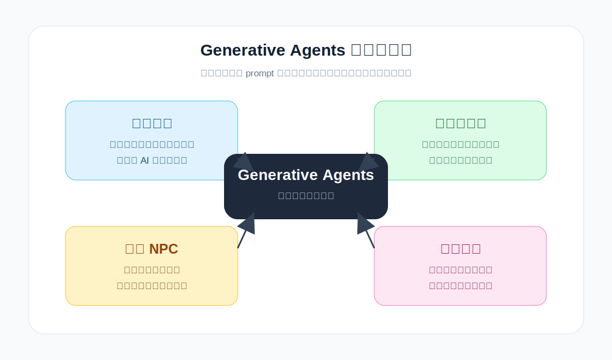
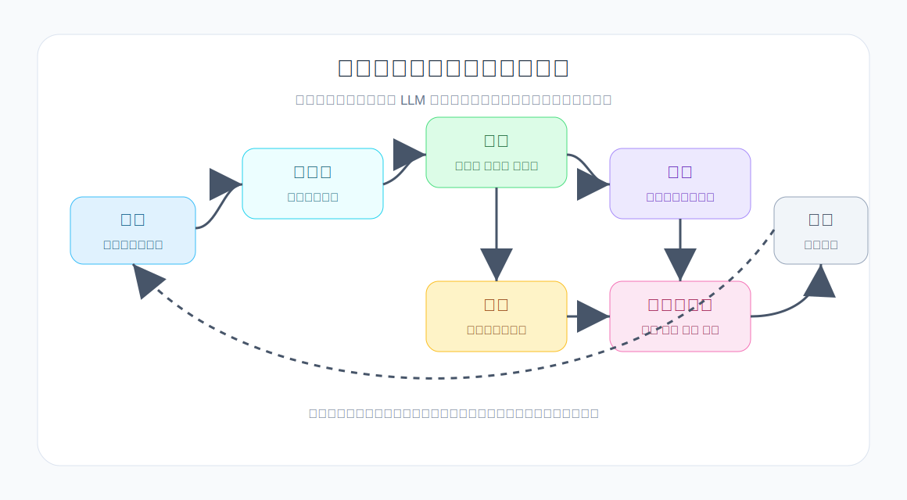

# 第 1 章：原作者与 Generative Agents 的诞生

## 1.1 为什么先看作者

2023 年，Joon Sung Park、Joseph C. O'Brien、Carrie J. Cai、Meredith Ringel Morris、Percy Liang 和 Michael S. Bernstein 发表了论文 *Generative Agents: Interactive Simulacra of Human Behavior*。这篇论文后来成为生成式智能体方向绕不开的起点之一。

先看作者不是闲笔。这篇论文不是某个孤立 prompt 的成功案例，而是一个跨学科系统：它用大语言模型提供自然语言推理能力，用 HCI 方法组织可观察、可干预的交互环境，再用社会计算问题检验群体行为是否能从个体行动中涌现出来。

<table>
  <tr>
    <td width="126" align="center"></td>
    <td>
      <strong>Joon Sung Park</strong> 
      论文第一作者，也是 Generative Agents 研究方向最重要的推动者之一。他的个人主页把研究方向概括为 human-computer interaction、natural language processing、generative agents、social computing 和 human-AI interaction。到 2026 年，他的研究已经从 Smallville 延伸到更大的问题：如何用语言模型代理模拟人类行为和社会。放回这篇论文里看，Joon 承担的是把想法落成系统、把系统组织成实验、再把实验讲成一个清楚研究问题的角色。
    </td>
  </tr>
  <tr>
    <td width="126" align="center"></td>
    <td>
      <strong>Joseph C. O'Brien</strong> 
      论文作者页将 Joseph C. O'Brien 列为 Stanford University 作者；Joon 的 Generative Agents 论文条目把 Joseph O'Brien 链接到公开的 LinkedIn 作者页。与其他几位作者相比，他的公开一手资料明显更少，所以本书只写能核验的内容：他是 Stanford 侧参与这项工作的合作者之一，并出现在论文作者序列的第二位。这个位置也提醒读者，论文背后不只有资深教授和研究科学家，还有具体参与系统实现、实验推进和论文写作的青年研究者。
    </td>
  </tr>
  <tr>
    <td width="126" align="center"></td>
    <td>
      <strong>Carrie J. Cai</strong> 
      Carrie J. Cai 是 Google DeepMind 的 Principal Research Scientist，长期研究 AI、HCI 和 human-centered AI 的交叉问题。她此前在 Google Brain 和 People + AI Research 相关环境中做过大量人机协作、AI 辅助工具和用户理解方面的工作。Generative Agents 需要的不只是“让模型能说话”，还需要解释用户如何观察智能体、如何判断可信行为、如何处理系统边界；Carrie 的背景把论文拉回 human-AI interaction 的主线。
    </td>
  </tr>
  <tr>
    <td width="126" align="center"></td>
    <td>
      <strong>Meredith Ringel Morris</strong> 
      Meredith Ringel Morris，也常用 Merrie Morris，是 Human-AI Interaction、Human-Centered AI、AI Safety、Responsible AI、可访问性和社会计算领域的重要研究者。她的个人主页显示，写作本书时她担任 Google DeepMind 的 Post-AGI Interaction Research 负责人，此前也曾领导 Google Research 的 People + AI Research 团队。放到 Generative Agents 中看，她带来的不是某个孤立代码模块，而是评价“可信行为”时必须具备的 HCI 视角：行为是否可解释，用户是否会误解，系统边界是否清楚。
    </td>
  </tr>
  <tr>
    <td width="126" align="center"></td>
    <td>
      <strong>Percy Liang</strong> 
      Percy Liang 是 Stanford Computer Science 教授，长期研究机器学习、自然语言处理和基础模型。写作本书时，他的个人主页强调开放模型建设、语言模型课程和基础模型发展。Generative Agents 需要 LLM 的常识推理、语言表达和上下文整合能力，但论文没有停留在“模型能力展示”；Percy 的背景帮助这篇论文把语言模型能力放进更清楚的系统结构里。
    </td>
  </tr>
  <tr>
    <td width="126" align="center"></td>
    <td>
      <strong>Michael S. Bernstein</strong> 
      Michael S. Bernstein 是 Stanford Computer Science 教授，也是 Stanford HCI 的代表性学者。他的个人主页把研究重点放在 interactive computing systems、social computing、collective intelligence、社会性技术和人类行为建模上。Joon 的主页也显示，Michael 和 Percy 是其博士阶段的重要导师。Smallville 很容易被看成一个“AI 小镇演示”，但从 Michael 的研究脉络看，它更像一个 HCI 系统：用可交互系统研究社会行为、协作、传播和人类对 AI 的理解。
    </td>
  </tr>
</table>

头像也要交代清楚。Joon、Meredith、Percy、Michael 的头像已经采集为本地图片，来源分别是个人主页或 Stanford HCI 页面。Carrie 的个人主页包含头像，但当前环境无法稳定下载 Googleusercontent 原图，本稿暂用姓名缩写头像占位；Joseph 没有找到可核验的公开本人头像，本稿同样使用姓名缩写头像，避免误用同名人物照片。

六位作者放在一起，论文的形状就清楚了。Joon 把问题落成系统，Joseph 代表 Stanford 侧具体参与工作的年轻合作者，Carrie 和 Meredith 提供 human-AI interaction 与可信评价视角，Percy 提供基础模型与自然语言推理视角，Michael 提供 HCI 系统、社会计算和交互式社会实验传统。Generative Agents 最值得学的地方，正是这种组合方式。

## 1.2 这篇论文站在哪些领域的交叉处

Generative Agents 这个问题本来就不是单一学科能解决的。从自然语言处理看，它涉及角色扮演、常识推理和长期上下文；从游戏 AI 看，它是在追问 NPC 能不能不靠写死脚本而持续产生可信行为；从人机交互看，它研究用户如何观察和干预一个由 AI 驱动的动态社会；从社会仿真看，它关心信息扩散、关系形成和协同行动如何从局部互动中出现。

论文的重要性就在这里。它没有把问题压缩成“让模型回答得更像人”，而是把大语言模型放回交互环境中，让它们以智能体的形式持续行动。论文发表于 UIST 2023，也就是 ACM Symposium on User Interface Software and Technology。这个会议背景很重要：它说明这篇论文不是单纯追求模型指标，而是在讨论一种新的交互系统形态。

论文页面给出的关键词包括 human-AI interaction、agents、generative AI、large language models。这几个词放在一起，基本就构成了本书主线：大语言模型只是能力来源，智能体架构才是系统形态，人机交互和社会仿真则是它的应用语境。

*图 1-1：Generative Agents 的领域交叉位置。论文的关键不是把某一个方向做到极致，而是把 HCI、LLM、NPC 和社会仿真合成一个可运行的系统问题。*

## 1.3 为什么它不是普通 LLM 应用

要理解 Generative Agents，首先要把它和普通的大模型应用区分开。

普通 LLM 应用常见的结构是：

1. 用户输入一个问题。
2. 模型根据上下文生成回答。
3. 应用把回答展示给用户。

这种模式当然有价值，但它通常是“请求-响应”式的。哪怕系统加上聊天历史，也主要是在维持对话上下文。角色在这个过程中并没有真正处于一个世界中，也没有持续的身体位置、日程安排、环境观察和社会关系。

Generative Agents 的目标不同。论文中的智能体会：

- 起床。
- 做早餐。
- 去工作。
- 画画、写作、学习。
- 观察别人。
- 形成意见。
- 主动发起对话。
- 记住过去发生的事情。
- 根据过去的经历反思。
- 为接下来的一天制定计划。
- 因为别人或环境变化而修改行动。

这些行为不是单独的一次回答，而是持续生活中的一个个片段。

所以，Generative Agents 和普通 LLM 应用的区别，不在于它使用了更复杂的提示词，而在于它改变了问题的单位。

普通聊天应用的基本单位是一次回答。

Generative Agents 的基本单位是一个智能体在环境中的持续行为。

这就是为什么论文中强调的是 believable human behavior，而不只是 fluent language generation。语言能力仍然重要，因为计划、记忆、反思和对话都用自然语言表达；但语言不是终点。语言在这里是智能体理解世界、表达经验和生成行动的中间媒介。

## 1.4 什么叫可信行为

论文中有一个非常重要的边界：它讨论的是 believable simulacra of human behavior，也就是“可信的人类行为拟像”。这个说法要仔细理解。

所谓可信，不是说智能体真的有意识，不是说它真的有情绪、欲望或主体性。可信指的是：在一个给定的交互环境里，观察者会觉得它的行为符合日常经验，具有合理的连续性。

例如，一个咖啡馆老板早上开店、在柜台工作、和顾客寒暄、邀请朋友参加活动，这是可信的。一个学生白天去图书馆、和同学讨论论文、晚上回宿舍休息，也是可信的。一个人刚刚被邀请参加派对，后来在对话中提到这件事，甚至调整自己的计划，这同样是可信的。

可信行为首先要求身份连续。角色不能这一分钟是咖啡馆老板，下一分钟突然变成对自己身份毫无记忆的路人。它的职业、性格、生活习惯和当前目标，应该在不同场景中持续发挥影响。

可信行为也要求记忆连续。角色不能刚聊完就忘。它需要记住别人说过什么，记住自己答应过什么，记住发生过哪些重要事件。没有记忆，就没有稳定的行为弧线。

可信行为还要求计划连续。角色不能每一步都重新即兴决定人生。真实的人多数时候会按照某种生活节奏行动：起床、吃饭、工作、学习、休息。智能体也需要日程和计划，否则就会变成随机游走的语言生成器。

论文反复强调，这类智能体的目标是产生可信行为，而不是证明机器具有真实主体性。这一点对本书很重要。后面我们会看到，GenerativeAgentsCN 中的角色会聊天、会行动、会反思，但所有这些都来自代码、提示词、记忆检索和模型生成。它们可以表现出行为上的连续性，却不能因此被当作真实的人。

这也是本书后面讲风险、伦理和边界时必须回到的原则。

## 1.5 传统 NPC 卡在哪里

理解 Generative Agents，还需要理解它试图超越什么。

在游戏和交互叙事中，NPC 长期以来主要依赖人工设计的规则、状态机、行为树或脚本。设计师可以规定：

- 早上 8 点去上班。
- 玩家靠近时说一句固定台词。
- 完成任务后切换到另一个状态。
- 某个剧情触发后移动到指定地点。

这种方法稳定、可控、成本清晰，在大量商业游戏中非常有效。但它也有明显上限：开放世界越复杂，可能发生的互动越多，手写规则就越难覆盖。

如果我们只想让一个 NPC 在固定场景里卖东西，脚本足够。如果我们想让 25 个居民在一个小镇中生活两天，并且自然地产生派对邀请、竞选传播、关系变化和临时协作，手写脚本就会迅速变得笨重。

传统脚本的问题不是“不能做”，而是“扩展困难”。每增加一种事件，设计师都要考虑它如何影响每个角色；每增加一个角色，都要考虑它与其他角色的互动；每增加一个地点，都要考虑每个人在这个地点应该做什么。

论文中的情人节派对案例正好说明了这一点。传统方法要让所有人按时参加派对，可能需要写很多规则：

- 谁知道派对。
- 谁会邀请谁。
- 谁接受邀请。
- 谁拒绝邀请。
- 谁会转告别人。
- 谁到了时间会去咖啡馆。
- 谁因为其他计划错过。

Generative Agents 的思路不同。系统只给一个智能体一个初始意图：她想举办派对。后续传播、邀请、接受、拒绝和到场，都由智能体的记忆、对话、计划和反应机制生成。

这并不意味着它一定比脚本更可靠。相反，它会引入不确定性、幻觉、误传和失败。但它提供了一种新的可能性：让复杂社会行为从多个个体的局部决策中产生，而不是完全由设计师逐条写死。

| 对比维度 | 脚本 NPC | 生成式智能体 |
| --- | --- | --- |
| 行为来源 | 设计师预先写好的规则、状态机、行为树或剧情脚本。 | 角色设定、记忆、环境观察、计划和 LLM 推理共同生成。 |
| 上下文能力 | 只响应被设计过的触发条件，超出脚本就失效。 | 可以把近期事件、长期记忆和当前场景放在一起解释。 |
| 社交传播 | 通常需要显式写出“谁告诉谁”“谁知道什么”。 | 对话会把一个人的记忆转移到另一个人的记忆中，形成信息扩散。 |
| 可控性 | 高，可预测，适合商业游戏中的稳定体验。 | 较低，可能出现误传、幻觉和计划偏移，需要评价与边界控制。 |
| 扩展成本 | 角色、地点、事件越多，脚本组合爆炸越明显。 | 可以用统一架构扩展角色和事件，但模型调用、记忆检索和一致性成本会上升。 |
| 研究价值 | 适合验证明确交互流程。 | 适合研究长期行为、社会涌现和人类如何理解 AI 社会。 |

*表 1-1：脚本 NPC 与生成式智能体的差异。生成式智能体不是无条件优于脚本 NPC，它是在开放社会互动问题上提供了另一种扩展方式。*

## 1.6 强化学习为什么不是直接答案

另一个容易想到的方向是强化学习。既然智能体要在环境中行动，为什么不用强化学习训练它们？

强化学习在很多游戏环境中取得过非常强的结果，尤其是目标明确、奖励函数清楚、动作空间可定义的任务。例如在对抗游戏中，智能体可以围绕胜负优化策略。问题是，Generative Agents 要解决的不是“赢一局游戏”，而是“表现出可信的人类生活”。

这两者差别很大。

可信生活没有简单奖励函数。一个角色早上是否应该喝咖啡、是否应该和朋友聊天、是否应该接受派对邀请，很难用一个统一的数值奖励定义。更重要的是，角色行为的合理性高度依赖自然语言背景、社会关系和过去经历。

一个人拒绝派对邀请，有时是合理的，因为他正在赶论文；有时是不合理的，因为他刚刚表示非常期待参加。一个角色没有和熟人打招呼，有时是失礼，有时是因为他正在赶时间。这样的判断离不开上下文和常识。

大语言模型的优势正在这里。它们接受过大量自然语言数据训练，能够根据角色背景、当前情境和相关记忆生成大体合理的解释、计划和对话。论文没有把 LLM 当作一个万能大脑，而是把它作为自然语言推理能力嵌入到智能体架构中。

换句话说，Generative Agents 不是用 LLM 替代所有系统设计，而是用 LLM 补上传统规则系统最难处理的一部分：开放语境下的常识性行为生成。

## 1.7 论文真正贡献是什么

很多人第一次看到 Generative Agents，最容易被小镇画面吸引。25 个小人在地图上走来走去，像一个由大模型驱动的 The Sims。这确实直观，也适合传播。

但如果只看到画面，就会低估这篇论文。

论文真正重要的是架构。它提出了一套让大语言模型生成长期可信行为的组织方式：

1. 用 memory stream 保存智能体经历。
2. 用 retrieval 从长期记忆中选择当前相关内容。
3. 用 reflection 把碎片事件提升成高层认知。
4. 用 planning 生成日程和细粒度行动。
5. 用 reacting 处理环境变化和他人行为。
6. 用 dialogue 支持社会传播和关系形成。
7. 用 sandbox environment 把语言生成落到时间、地点和对象上。

这套架构的关键不是某一个 prompt，而是多个模块之间的闭环。

观察会进入记忆。记忆会被检索。检索出来的记忆会影响计划。计划会产生行动。行动改变环境。环境变化又被自己或别人观察到，成为新的记忆。对话则让一个人的记忆有机会进入另一个人的记忆，从而形成社会传播。

这就是为什么本书后面不会把 GenerativeAgentsCN 讲成“一个 Flask + Phaser 小项目”，也不会只讲“如何调用本地模型”。我们要讲的是：论文中的这套智能体架构，如何在一个中文开源项目中被重新组织、工程化和本地化。

*图 1-2：Generative Agents 架构闭环。观察、记忆、检索、反思、规划、行动和环境变化连在一起后，单次语言生成才变成持续行为。*

## 1.8 为什么它属于 HCI

这篇论文发表于 UIST，而不是只出现在机器学习或自然语言处理会议上，这一点值得专门讲。

HCI 关心的不是模型在某个静态 benchmark 上得多少分，而是人如何与计算系统互动，系统如何支持人的表达、探索、设计、学习和决策。Generative Agents 的小镇恰好是一个交互系统：用户可以观察，也可以通过自然语言干预某个角色或环境，让系统继续演化。

这会把几个 HCI 问题推到台前。小镇中的居民会自主行动，用户就需要理解哪些行为来自初始设定，哪些行为来自后续传播，哪些行为可能只是模型幻觉。论文允许用户用自然语言改变环境或给角色建议，这比传统参数配置更自然，也更难预测。

这种系统还改变了原型设计的材料。如果设计师想模拟一个社交平台、社区活动、校园空间或服务流程，生成式智能体可以提供一种“动态人群原型”。它不只是静态 persona，而是一群能互动、记忆和传播信息的代理。

风险也随之出现。当角色表现得像人，用户可能会过度拟人化它们；当系统能模拟舆论或社交传播，它也可能被用于操纵或误导。论文在贡献总结中明确提到机会和伦理风险，这也是本书后面必须单独讨论边界的原因。

所以，Generative Agents 的位置不是“模型更聪明了”，而是“交互系统的材料变了”。过去设计一个动态社会需要大量手写规则；现在，大语言模型让自然语言角色设定、记忆和对话成为系统运行的一部分。

## 1.9 这本书接下来怎么读

这本书不是论文翻译，也不是 GenerativeAgentsCN 的 README 扩写。

它先讲清论文。Generative Agents 的价值来自它提出的问题和架构。Memory stream、retrieval、reflection、planning、reaction、dialogue，这些概念必须先讲清楚。否则后面读代码时，读者只会看到一个个类和函数，看不到它们共同服务的系统目标。

它再讲透项目。GenerativeAgentsCN 是一个很适合作为教材的项目。它规模不算巨大，核心 Python 代码可以读完；同时它又有完整的角色、地图、prompt、本地模型适配、checkpoint、压缩和回放。它不是一个孤立函数库，而是一个能运行、能观察、能修改的智能体小镇。

它最后讲升级方向。论文发表于 2023 年。到 2026 年，智能体领域已经出现了很多新的方向：长期记忆管理、反思式学习、技能库、目标驱动规划、多智能体协作框架、大规模社会仿真和更严格的评价体系。一本严肃的项目书不能只停留在 2023 年。我们会在最后一部分回到这些前沿成果，并讨论如何基于 GenerativeAgentsCN 做渐进升级。

这也是本书的整体结构：

1. 先讲原论文与思想源头。
2. 再讲从论文到 GenerativeAgentsCN。
3. 再逐行读核心源码。
4. 再复现论文实验并扩展项目。
5. 最后补上 2023-2026 年前沿演进和升级路线。

这个顺序很重要。前沿概念不能一开始就堆上来，否则读者还没理解 Generative Agents 的基本架构，就会被各种新名词淹没。我们先把经典地基打牢，再进入项目，再谈升级。

## 1.10 本章小结

本章建立了全书的起点：

1. *Generative Agents: Interactive Simulacra of Human Behavior* 是一篇交叉论文，连接了 HCI、大语言模型、游戏 AI 和社会仿真。
2. 它的目标不是让模型单轮回答得更像人，而是让智能体在世界中持续表现出可信行为。
3. 可信行为不等于真实意识。论文讨论的是行为拟像，而不是机器主体性。
4. 传统 NPC 脚本可控但难以扩展，强化学习强大但不直接适合开放式生活仿真。
5. 论文真正的贡献是架构：memory stream、retrieval、reflection、planning、reaction、dialogue 和 sandbox grounding 形成闭环。
6. 这本书将以论文为根，以 GenerativeAgentsCN 为工程底座，再补充前沿升级方向。

下一章我们会进入论文的核心问题：如果想构造一个可信的人工社会，为什么单轮聊天远远不够？长期记忆、多智能体互动和级联社会效应到底难在哪里？

## 参考资料

- Joon Sung Park, Joseph C. O'Brien, Carrie J. Cai, Meredith Ringel Morris, Percy Liang, Michael S. Bernstein. *Generative Agents: Interactive Simulacra of Human Behavior*. arXiv: https://arxiv.org/abs/2304.03442
- ar5iv full text: https://ar5iv.labs.arxiv.org/html/2304.03442
- Joon Sung Park personal site: https://www.joonsungpark.com/
- Carrie J. Cai personal site: https://sites.google.com/view/carriecai/home
- Meredith Ringel Morris personal site: https://cs.stanford.edu/~merrie/index.html
- Percy Liang personal site: https://cs.stanford.edu/~pliang/
- Michael S. Bernstein personal site: https://hci.stanford.edu/msb/
- Joseph O'Brien author link from Joon Sung Park's Generative Agents entry: https://www.linkedin.com/in/joeyobrien2024/
- Stanford Generative Agents repository: https://github.com/joonspk-research/generative_agents
