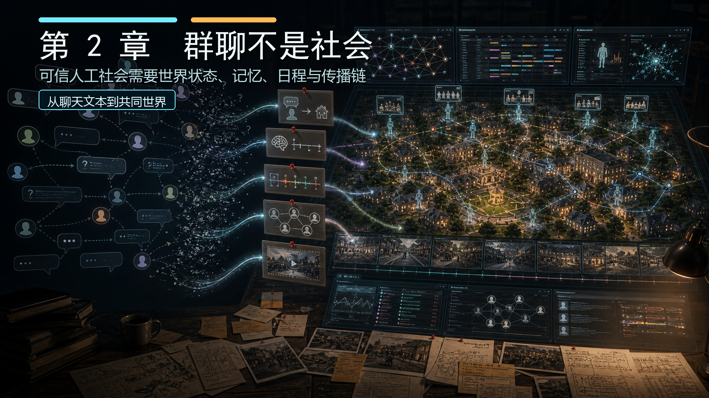
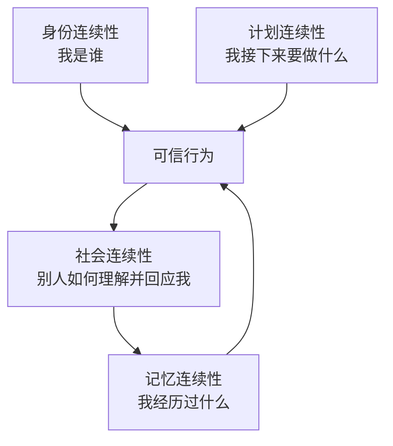
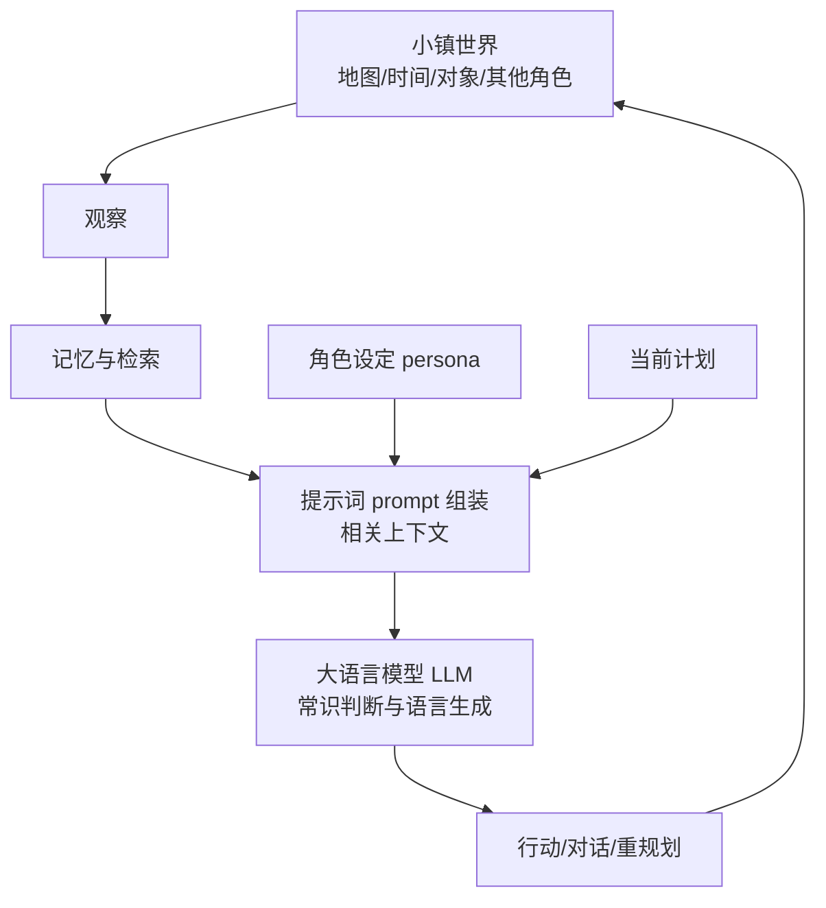

# 第 2 章：论文的核心问题：如何构造一个可信的人工社会

*图 2-1：群聊不是社会。左侧聊天泡泡停留在临时上下文 context，右侧虚拟小镇把同一段信息推进成世界状态、记忆 memory、日程 schedule、社会传播 social propagation 和回放证据；人工社会的分界线在状态是否可追溯。*

## 核心问题

生成式智能体 Generative Agents 的关键不在于“让模型说得像人”，而在于“让智能体在一个世界中持续表现出可信行为”。

> 如果我们想构造一个可信的人工社会，仅仅让多个大语言模型角色互相聊天，为什么远远不够？

因为“一个会聊天的人工智能 AI 角色”和“一群会生活的虚拟居民”，中间隔着很多系统问题：

- 角色是否记得自己是谁？
- 角色是否记得刚刚发生过什么？
- 角色是否有今天的计划？
- 角色是否会因为别人的话改变行动？
- 信息是否能从一个角色传到另一个角色？
- 多个角色局部互动之后，是否能形成群体层面的现象？

如果这些问题没有解决，我们得到的只是群聊，而不是人工社会。

## 2.1 群聊不是社会

先看一个很像多智能体系统的场景：我们创建 25 个角色，把每个人的名字、人设和说话风格写进提示词 prompt，然后让它们在聊天室里轮流发言。

- 伊莎贝拉 Isabella Rodriguez 说“今晚我想在霍布斯咖啡馆办派对”
- 阿伊莎 Ayesha Khan 说“我会带一些文学故事来分享”
- 克劳斯 Klaus Mueller 说“我可能要先读完研究资料”

这段对话看起来已经有角色、有地点、有计划、有社交关系。但它还不能证明系统已经形成“社会”。分界线不在角色会不会把话说圆，而在每句话能否改写后续状态。

- 伊莎贝拉 Isabella Rodriguez 的话有没有真的改变小镇状态？
- 阿伊莎 Ayesha Khan 有没有把邀请写进自己的记忆？
- 克劳斯 Klaus Mueller 后面是否会因为读书安排拒绝或迟到？
- 其他角色是否会从阿伊莎 Ayesha Khan 那里听说派对？

如果这些问题没有对应的状态变化，系统呈现出来的只是“角色在说自己会生活”，而不是“角色真的在同一个世界里生活”。聊天只是文本输出；人工社会必须能把文本变成世界状态、记忆、日程、关系和后续行为。

### 2.1.1 说了地点，不等于进入世界地图 Maze

群聊里，地点通常只是句子的一部分。角色说“我要去咖啡馆”，下一轮对话可以继续围绕咖啡馆展开，但系统未必知道这个角色当前在哪里、咖啡馆在哪里、路径怎么走、是否已经到达。

小镇系统里，地点必须进入世界地图 Maze。霍布斯咖啡馆不是一句背景词，而是地图配置中的空间地址；角色的位置、移动路径、可见范围和回放帧都要受它影响。伊莎贝拉 Isabella Rodriguez 说晚上在霍布斯咖啡馆办派对，系统后面至少要能回答三件事：谁在咖啡馆，谁正在前往，谁没有到场。

### 2.1.2 说了经历，不等于写入记忆 memory

群聊里，经历主要留在聊天上下文 context 中。模型可能在最近几轮里记得邀请、承诺或拒绝，但上下文一长，旧信息就会被截断；上下文不完整时，模型还可能补全出从未发生过的经历。

小镇系统里，经历必须进入记忆 memory。阿伊莎 Ayesha Khan 听到派对邀请后，这件事应当成为她后续可检索的记忆流 memory stream 条目；后面她和别人聊天、调整计划、判断是否到场，都应该有机会读取这段记忆。没有记忆写入，角色只是在当场应答，不是在积累过去。

### 2.1.3 说了打算，不等于修改日程 schedule

群聊里，打算通常是一句姿态。角色说“我会参加派对”或“我可能要先读书”，下一轮仍然可能继续闲聊，因为系统没有今天的日程骨架，也没有把这个打算变成时间上的约束。

小镇系统里，打算必须影响日程 schedule。克劳斯 Klaus Mueller 说自己要读完研究资料，后续行为就应该和他的当前目标、当天计划、当前位置和可用时间发生关系。他可以拒绝派对、晚点到达，也可以读完后改变安排；但无论哪一种，都要能从日程和行动状态里看出理由。

### 2.1.4 说了消息，不等于形成社会传播 social propagation

群聊里，消息传播常常像全员共享频道。只要某件事出现在聊天记录里，所有角色都可能默认知道它；或者相反，消息只停留在当场对话里，出了上下文就消失。

小镇系统里，社会传播 social propagation 必须有路径。谁先知道派对，谁转述给谁，谁相信了这个消息，谁因此改变了计划，都应该能沿着对话、记忆和行动记录追踪。社会不是对话数量的堆叠，而是局部互动不断沉淀之后形成的关系变化和群体行为。

群聊的问题，本质上来自把世界压缩成上下文 context。只要世界只存在于提示词 prompt 里，地点、时间、记忆、计划和关系就很容易变成一句话里的设定；一旦它们离开当前上下文，系统就失去连续性。下一节从单轮聊天开始拆解：生活为什么必须有时间、空间、记忆、计划和社会传播。

表 2-1 社会性判定表

| 判定问题 | 只是群聊时的表现 | 人工社会的最低结构 | 可检查证据 |
| --- | --- | --- | --- |
| 地点是否落地 | 地点只是聊天文本，角色说到哪里都可以。 | 地点进入世界地图 Maze，角色位置和可达路径受地图约束。 | 地图地址、当前位置、移动路径、回放帧。 |
| 经历是否保存 | 依赖近期上下文 context，旧信息容易丢失或被模型补全。 | 观察、行动、对话和反思写入记忆 memory，后续可以检索。 | 记忆流 memory stream、检索结果、角色后续引用。 |
| 打算是否约束行动 | 承诺停留在话术里，下一轮仍可能随意聊天。 | 打算进入日程 schedule 或行动选择，影响后续时间和地点。 | 当天计划、当前行动、重规划记录、到场或缺席结果。 |
| 消息是否有传播路径 | 信息像全员广播，或者离开上下文后消失。 | 信息通过对话、记忆和计划逐步扩散。 | 谁告诉谁、谁记住了什么、谁改变了计划。 |
| 结果是否可追溯 | 只能读聊天记录，难以判断说过的话有没有发生。 | 行为留下状态、日志、断点 checkpoint 和回放证据。 | 状态文件、对话记录、压缩结果、回放数据。 |
| 可信性如何判断 | 看对话是否像角色。 | 看身份、记忆、日程、空间和社交影响是否连续。 | 角色配置、记忆、日程、行动轨迹、传播链。 |

*表 2-1：群聊式多角色系统与生成式智能体社会的判定表。真正的分界线不在角色数量，而在系统是否能把文本输出推进成共同世界中的状态变化。*

## 2.2 单轮聊天的根本局限

大语言模型最自然的使用方式是单轮或多轮聊天。用户输入问题，模型给出回答。这个模式很强大，但它默认把世界压缩成文本上下文。对于问答任务，这没有问题。对于写作、总结、翻译、代码生成，这也很有效。但如果我们想模拟一个小镇的一天，单轮聊天就不够了。因为生活不是一次回答。

### 2.2.1 生活有时间

一个人早上做的事会影响中午的状态，中午遇到的人会影响下午的计划，下午收到的邀请会影响晚上的行动。如果系统无法记录时间，就无法判断某个行为是否合理。早上 7 点准备早餐和凌晨 2 点准备早餐，意义完全不同。

### 2.2.2 生活有空间

人在教室、咖啡馆、公园和卧室里会做不同的事。两个人是否能聊天，也取决于他们是否在附近。没有空间约束，角色就可能像漂浮在文本中的声音，随时和任何人说话。

### 2.2.3 生活有记忆

一个人会被过去塑造。昨天的对话、刚才的邀请、上周形成的关系，都会影响今天的反应。没有记忆，角色每次出现都像重新加载。

### 2.2.4 生活有计划

人通常不是完全随机行动。即使计划会被打断，它仍然提供行为骨架。没有计划，角色可能显得热闹，但缺少生活节奏。

### 2.2.5 生活有社会传播

一个人知道的信息会通过对话传给另一个人。信息传播之后，又会改变后者的记忆、态度和行为。单轮聊天很难自然表达这种跨人、跨时间的传播链。

所以，论文要解决的不是“如何让模型回答更好”，而是“如何为模型提供一个能维持生活连续性的外部架构”。这句话非常关键：*大语言模型提供语言推理能力，但人工社会需要系统架构。*

## 2.3 可信人工社会需要三种连续性

要让虚拟居民看起来像在生活，至少需要三种连续性：身份连续性、记忆连续性和计划连续性。

### 2.3.1 身份连续性

身份连续性指的是：角色在不同场景中都表现出相对稳定的人设。例如，伊莎贝拉 Isabella Rodriguez 是咖啡馆老板，友好、外向、好客。这个设定不应该只在自我介绍时出现，而应该持续影响她的行为：

- 她会去霍布斯咖啡馆。
- 她会关注顾客。
- 她会自然地邀请别人参加活动。
- 她会把咖啡馆看成社交场所。

山姆 Sam Moore 是一名退役军官，正在竞选地方市长。这个设定也应该持续发挥影响：

- 他会在对话中提到社区和竞选。
- 他会关心邻居对公共事务的看法。
- 他可能在公园或咖啡馆传播自己的竞选计划。

如果角色不能维持身份连续性，那么即使语言流畅，也会让人觉得不可信。在论文层面，身份连续性首先来自角色设定 persona：身份、职业、生活习惯、关系和当前目标都会进入智能体的行为生成过程。落到生成式智能体 Generative Agents，角色设定 persona 主要写在角色配置文件 `agent.json` 中。第一次看这些字段时，不需要急着记代码名，先看它们的中文意思：

| 字段 | 中文意思 | 对角色行为的影响 |
| --- | --- | --- |
| `currently` | 角色当前状态。可以理解为“这个人最近在关心什么、正在处于什么生活阶段”。 | 给模型提供当下背景，影响角色今天会做什么、遇到别人时会聊什么。 |
| `scratch.innate` | 角色比较稳定的内在特质，例如性格、价值倾向、说话气质。 | 决定角色行动和对话的底色，让同一个角色在不同场景中不至于变成另一个人。 |
| `scratch.learned` | 角色已经知道的背景事实，例如职业经历、人际关系、个人知识。 | 补充角色对自己和世界的理解，让回答和行动符合既有经历。 |
| `scratch.lifestyle` | 角色的生活习惯，例如作息、常去地点、日常节奏。 | 影响日程生成，让角色不像随机游走，而是有稳定生活方式。 |
| `scratch.daily_plan` | 角色当天的大致计划。 | 给后续细粒度行动提供骨架，让“现在做什么”有来源。 |

基础描述函数 `Scratch._base_desc()` 的作用，就是把这些字段整理成一段基础角色描述，放进多种提示词 prompt 里。后面模型生成日程、行动和对话时，都会读到这段描述。所以，论文里说的角色设定 persona 在项目里不是一段静态介绍，而是一组会反复进入提示词 prompt、持续影响行为生成的结构化字段。

### 2.3.2 记忆连续性

记忆连续性指的是：角色会把过去发生的事情带入未来判断。如果伊莎贝拉 Isabella Rodriguez 邀请了阿伊莎 Ayesha Khan 参加情人节派对，阿伊莎 Ayesha Khan 后面应该有可能记住这件事。她可能接受邀请，可能拒绝，可能告诉别人，也可能在晚上到达咖啡馆。如果她完全忘记这件事，行为就会断裂。如果汤姆 Tom Moreno 不喜欢山姆 Sam Moore，而山姆 Sam Moore 正在竞选地方市长，那么汤姆 Tom Moreno 在讨论选举时不应该像一个没有过去态度的人。他可以保持礼貌，也可以承认某些政策有价值，但他的既有态度应该在语言和行动中留下痕迹。

记忆连续性不是简单保存聊天记录。聊天记录只是记忆的一种。更完整的记忆应该包括：

- 我看见了什么。
- 我做了什么。
- 谁和我说了什么。
- 我从这些事情中总结出了什么。
- 哪些事情对我重要。

论文中的记忆流 memory stream 正是为了解决这个问题。生成式智能体 Generative Agents 中的关联记忆 `Associate`、概念对象 `Concept`、事件对象 `Event` 和向量索引框架 LlamaIndex，就是这一思想的工程实现。

### 2.3.3 计划连续性

计划连续性指的是：角色不是每一步临时乱动，而是围绕日程和目标行动。计划不等于死板。真实生活中，计划经常被打断。你本来准备学习，朋友突然来找你聊天；你本来要去咖啡馆，路上遇到熟人；你本来要工作，收到活动邀请后改变晚上的安排。因此，可信智能体需要两种能力同时存在：

1. 角色先拥有可执行的日程计划。
2. 角色能根据环境变化调整计划。

只有计划，没有反应，角色会像机械执行脚本。只有反应，没有计划，角色会像随机聊天对象。论文中的规划 planning 和反应 reacting 正是为了解决这个张力。生成式智能体 Generative Agents 中的日程对象 `Schedule`、日程生成方法 `Agent.make_schedule()`、反应方法 `Agent._reaction()`、聊天方法 `Agent._chat_with()` 和等待方法 `Agent._wait_other()`，共同承担这个任务。

*图 2-2：身份连续性、记忆连续性、计划连续性的关系。身份给行为定边界，记忆给行为接上过去，计划给行为提供节奏。*

## 2.4 多智能体互动的级联效应

单个智能体的行为连续性已经不容易，多智能体系统更复杂，因为一个智能体的行为会成为另一个智能体的环境。

这句话需要拆开看。在普通单人聊天中，模型只需要回应用户。用户说什么，模型答什么。上下文边界相对清楚。在多智能体小镇中，A 的行为会被 B 观察到，B 会把它写入记忆；B 后来和 C 聊天，可能把这件事告诉 C；C 因此改变计划，到了某个地点；C 的出现又被 D 看到，D 再产生新的反应。这就是级联效应。级联效应让人工社会变得有趣，也让它变得难控制。

以情人节派对为例：

1. 伊莎贝拉 Isabella Rodriguez 想在霍布斯咖啡馆办派对。
2. 她遇到亚当 Adam Smith，邀请他参加。
3. 亚当 Adam Smith 因为写书婉拒。
4. 伊莎贝拉 Isabella Rodriguez 遇到阿伊莎 Ayesha Khan，再次邀请。
5. 阿伊莎 Ayesha Khan 接受，并计划带文学故事来分享。
6. 阿伊莎 Ayesha Khan 后面可能把派对告诉别人。
7. 到了傍晚，部分角色可能出现在咖啡馆。

这里没有一个中央导演逐条安排所有人。事件从一个人的当前状态开始，通过对话、记忆和计划在小镇中扩散。镇长竞选也是类似。山姆 Sam Moore 的竞选意图存在于他的 `currently` 中。其他角色对选举的兴趣存在于各自设定中。汤姆 Tom Moreno 还带有“不喜欢山姆 Sam Moore”的初始态度。这样一来，同一个公共事件进入不同角色的记忆后，可能产生不同解释：

- 詹妮弗 Jennifer Moore 可能支持山姆 Sam Moore。
- 约翰 John Lin 可能好奇候选人是谁。
- 拉托亚 Latoya Williams 可能把选举当成谈话核心。
- 乔治 Giorgio Rossi 可能从数据和数学角度分析选情。
- 汤姆 Tom Moreno 可能从商店经营和个人好恶出发评价山姆 Sam Moore。

这就比“大家都听到一个消息”复杂得多。真正值得观察的是：同一事件如何在不同身份和记忆中被加工。

*图 2-3：一个事件在多个智能体之间级联传播。人工社会的复杂性来自“一个人的行为成为另一个人的环境”。*

## 2.5 可信人工社会不是全局剧本

这里要避免一个误解：人工社会中的复杂行为，不应该靠一个隐藏的全局剧本来伪装。

如果我们直接写死：

- 17:00 所有人去咖啡馆参加派对。
- 山姆 Sam Moore 告诉所有人自己竞选。
- 汤姆 Tom Moreno 说不喜欢山姆 Sam Moore。
- 克劳斯 Klaus Mueller 和玛丽亚 Maria Lopez 建立关系。

这样当然也能产生想要的画面。但它不是论文追求的方向。论文更关心的是：能否通过个体机制，让群体现象自然出现。这并不是说系统没有设计。角色人设、地图、记忆、检索、反思、计划、对话提示词 prompt 都是设计。

区别在于：

- 全局剧本直接规定结果。
- 智能体架构规定个体如何感知、记忆、思考和行动。

前者是导演式控制。后者是机制式生成。

生成式智能体 Generative Agents 的魅力就在于机制式生成。设计者不直接写“谁一定参加派对”，而是设计出一个系统，使得“某些人因为知道派对、觉得感兴趣、有时间、地点可达，于是选择参加”成为可能。这种机制式生成也意味着失败是正常的。有人可能没听说派对。有人可能听说了但忘了。有人可能口头答应却没到场。有人可能误解时间或地点。传统演示 demo 往往隐藏这些失败，但一本严肃的书必须把这些失败讲出来，因为它们恰恰暴露了系统边界。本书第四部分设计实验时，会特别关注这些失败模式。

## 2.6 大语言模型在人工社会中扮演什么角色

在生成式智能体 Generative Agents 中，大语言模型不是整个世界。它更像每个居民脑中的自然语言推理器。系统把角色背景、当前状态、相关记忆、地点、时间和对话历史组织成提示词 prompt，然后让模型完成一些局部任务：

- 这个角色几点起床？
- 这个角色今天的大致日程是什么？
- 当前计划应该拆成哪些小行动？
- 这个行动应该发生在哪个地点？
- 眼前这个人是否值得聊天？
- 如果聊天，应该说什么？
- 这次对话是否应该结束？
- 这个事件有多重要？
- 最近经历能总结出什么洞见 insight？

这些任务都适合大语言模型 LLM，因为它们依赖自然语言、常识和上下文。但大语言模型 LLM 不负责所有事情。

- 地图不是大语言模型 LLM 想象出来的，而是 `maze.json` 和 `tilemap.json` 定义的。
- 时间不是大语言模型 LLM 随口说的，而是计时器 `Timer` 推进的。
- 路径不是大语言模型 LLM 规划坐标，而是路径搜索方法 `Maze.find_path()` 计算的。
- 记忆不是全部塞进提示词 prompt，而是关联记忆 `Associate` 检索出来的。
- 回放不是大语言模型 LLM 生成视频，而是断点 checkpoint 经过 `compress.py` 变成 `movement.json`，再由前端渲染框架 Phaser 展示。

这就是架构的意义。如果说大语言模型 LLM 提供的是“语言和常识”，那么系统架构提供的是“边界和连续性”。两者缺一不可。

*图 2-4：大语言模型 LLM 在生成式智能体架构中的位置。大语言模型 LLM 负责开放语境下的判断与表达，世界状态、记忆、计划和行动落地仍由外部架构承担。*

## 2.7 可信与可控之间的张力

构造人工社会还有一个重要张力：可信和可控不完全一致。越是手写脚本，系统越可控。设计师可以保证每个角色在指定时间做指定动作。但这种系统容易显得死板。越是依赖生成式智能体，行为越灵活。角色可能产生设计师没有写过的对话、计划和互动。但这种系统也更不可控。

例如，伊莎贝拉 Isabella Rodriguez 邀请别人参加派对时，模型可能生成很自然的邀请，也可能忘记说清时间；可能有人合理拒绝，也可能所有人都过度热情地接受；可能话题顺利传播，也可能对话偏到完全无关的方向。这不是简单缺陷 bug，而是生成式系统的基本特征。因此，本书后面会坚持一个原则：

> 不只展示系统能做什么，也要记录它什么时候失败、为什么失败、如何评价失败。

论文没有只展示小镇实验环境 Smallville 的故事，而是通过控制评估 controlled evaluation、消融研究 ablation study 和端到端评估 end-to-end evaluation 来检验不同架构组件的贡献。生成式智能体 Generative Agents 作为中文工程项目，也需要类似的评价意识。不能只说“角色聊起来了”，还要问：

- 它是否记得过去？
- 它是否符合人设？
- 它是否按计划行动？
- 它是否把承诺转化成行动？
- 它是否在对话中传播了事实？
- 它是否产生了幻觉或错误记忆？

这些问题会在后面章节系统展开讨论。

## 2.8 人工社会问题的工程落点

现在可以回头看生成式智能体 Generative Agents 的工程结构。这个项目之所以值得写成书，不是因为它代码量巨大，而是因为它覆盖了人工社会所需的关键部件：

- 角色设定：`agent.json`
- 地图世界：`maze.json`、世界地图 `Maze`、地图格子 `Tile`
- 时间系统：计时器 `Timer`
- 事件表示：事件对象 `Event`
- 当前行动：行动对象 `Action`
- 日程系统：日程对象 `Schedule`
- 空间记忆：空间记忆 `Spatial`
- 长期记忆：关联记忆 `Associate`
- 向量检索：向量索引框架 `LlamaIndex`
- 提示词工厂：提示词组装器 `Scratch`
- 模型适配：模型适配器 `LLMModel`
- 仿真入口：`start.py`
- 数据压缩：`compress.py`
- 可视回放：`replay.py`、`live.py`

这些模块正好对应本章讨论的人工社会需求：

| 人工社会需求 | 生成式智能体 Generative Agents 模块 |
|---|---|
| 身份连续性 | 角色配置文件 `agent.json`、基础描述函数 `Scratch._base_desc()` |
| 记忆连续性 | 关联记忆 `Associate`、概念对象 `Concept`、事件对象 `Event` |
| 计划连续性 | 日程对象 `Schedule`、行动对象 `Action` |
| 空间约束 | 世界地图 `Maze`、地图格子 `Tile`、空间记忆 `Spatial` |
| 时间推进 | 计时器 `Timer`、步长 `stride` |
| 社会互动 | 反应方法 `_reaction()`、聊天方法 `_chat_with()`、对话文件 `conversation.json` |
| 行为观察 | 断点 checkpoint、仿真摘要 `simulation.md`、移动回放 `movement.json` |

后面读源码时，不应该把这些模块当成孤立工具。它们共同服务一个问题：让多个由大语言模型 LLM 驱动的角色在同一个世界中持续生活。

## 2.9 本章小结

“多角色聊天”和“人工社会”必须分开。生成式智能体 Generative Agents 真正关心的不是让 25 个角色轮流说话，而是让这些角色在同一个世界里持续生活，并且让过去的经历能够改变未来的行为。

下一章进入论文中的小镇实验环境 Smallville。那里不是一个简单的游戏画面，而是论文用来观察智能体生活、社交传播和群体涌现的实验装置。

## 参考资料

- Joon Sung Park, Joseph C. O'Brien, Carrie J. Cai, Meredith Ringel Morris, Percy Liang, Michael S. Bernstein. *Generative Agents: Interactive Simulacra of Human Behavior*. arXiv: https://arxiv.org/abs/2304.03442
- ar5iv 全文： https://ar5iv.labs.arxiv.org/html/2304.03442
- 生成式智能体 Generative Agents 本地源码：`generative_agents/modules/agent.py`, `generative_agents/modules/memory/associate.py`, `generative_agents/modules/memory/schedule.py`, `generative_agents/modules/maze.py`
