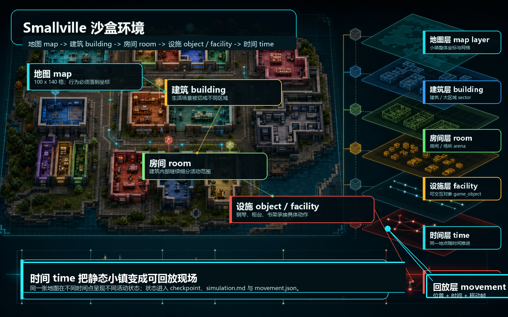
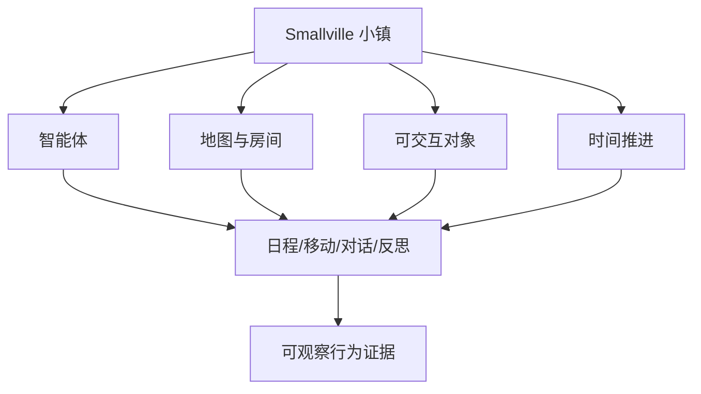

# 第 3 章：Smallville：论文中的实验装置

Generative Agents 目标不是构造一个会聊天的角色，而是构造一群能在同一个世界中持续生活、记忆、计划、对话和互相影响的虚拟居民。

Smallville 是论文用来观察这种行为的实验环境。为什么 Generative Agents 论文要建造一个类似 The Sims 的小镇，而不是只做命令行模拟或聊天室实验？

答案很直接：因为智能体的可信行为必须落在具体世界中观察。

 - 如果没有地图，角色就没有位置。
 - 如果没有房间和对象，行动就没有落点。
 - 如果没有时间，计划就没有顺序。
 - 如果没有其他居民，社交传播就不会发生。
 - 如果没有可观察的环境，研究者就无法判断智能体是否真的表现出可信行为。

*Smallville 不是论文的视觉包装，而是生成式智能体架构的实验装置。Smallville 负责提供“行为发生在哪里、能接触什么、什么时候发生、如何被回放观察”。*



*图 3-1：实验小镇 Smallville。中央小镇承载地图、地点、对象、时间和智能体*

## 3.1 小镇作为实验环境

论文选择“小镇”作为实验环境，并不是因为小镇本身浪漫，而是因为小镇具备社会生活的基本要素。

- 一座小镇里有居民。居民有身份、职业、性格、关系和生活习惯。
- 一座小镇里有地点。家、咖啡馆、公园、学校、商店、酒吧，不同地点会触发不同类型的行为。
- 一座小镇里有时间。早晨、上午、午饭、下午、晚上、睡前，每个时段都有不同的生活节奏。
- 一座小镇里有偶遇。两个人只有在相近地点才可能看到彼此、交谈、等待或产生后续关系。
- 一座小镇里有公共活动。派对、选举、展览、讲座、商店活动，这些活动可以被讨论、传播、误解、接受或拒绝。

这恰好满足论文想研究的问题：个体层面的记忆、计划和对话，如何在共享环境中形成群体层面的社会现象。

- 如果只做命令行模拟，研究者仍然可以记录文本，但很难直观看到角色是否真的去了某个地方、是否在同一时间聚集、是否因为空间接近而发生互动。
- 如果只做聊天室，研究者可以看到对话，但看不到生活。角色没有上下班，没有回家睡觉，没有路上偶遇，也没有“我正在使用这个对象，你要不要等一下”的空间冲突。

Smallville 用一个沙盒环境把这些问题放到一起。



*图 3-2：Smallville 实验环境构成。小镇不是视觉包装，而是让身份、记忆、计划和社交都能落地的实验装置。*

论文把 Smallville 放在实验系统层，而不是把它列为记忆、反思或规划这类内部模块。它的作用是提供一个可观察世界，让行为不再停留在文本回答里。地图背后有一套可执行的空间地址系统。没有这套地址系统，行为无法判断目的地，回放也无法还原发生现场。

## 3.2 地图 map：行为必须发生在具体位置

当前项目把 Smallville 的后端地图放在：

```text
generative_agents/frontend/static/assets/village/maze.json
```

这个文件不仅是给前端显示图片，还给后端提供可计算的地图，开头几个字段说明地图的基本尺度：

```json
{
  "world": "the Ville",
  "tile_size": 32,
  "size": [100, 140],
  "tile_address_keys": ["world", "sector", "arena", "game_object"]
}
```

| 字段 | 中文含义 | 对环境的作用 |
| --- | --- | --- |
| `world` | 世界 world 名称。 | 所有空间地址的根节点。 |
| `tile_size` | 地图格子 tile 的像素尺寸。 | 前端渲染和坐标换算的基础。 |
| `size` | 地图网格尺寸。 | 决定小镇可寻址范围。 |
| `tile_address_keys` | 地址层级键。 | 规定地址从世界到设施的层级。 |

`tile_address_keys` 是地图地址结构 schema。每个有地址的地图格子 tile 都会按这个顺序组织空间位置；代码中的 `Tile.get_address("arena")`、`Tile.get_address("game_object")` 也依赖这个顺序截取地址。

| 顺序 | 字段 key | 中文层级 | 真实示例 | 阅读方式 | 工程作用 |
| --- | --- | --- | --- | --- | --- |
| 1 | `world` | 世界 world | `the Ville` | 整个实验小镇的根节点。 | 所有空间地址都从同一个世界开始，行动位置和回放 movement 可以共享同一套地址。 |
| 2 | `sector` | 建筑或大区域 sector | `霍布斯咖啡馆`、`奥克山学院` | 第一层生活场景，不一定是狭义建筑，也可以是公园、市场、学院。 | 角色选择去哪里时，先落到这一层；空间记忆 spatial memory 也会按这一层组织候选地点。 |
| 3 | `arena` | 房间或场所 arena | `咖啡馆`、`图书馆`、`公园` | 建筑内部的具体活动区域。 | 感知 perception 会比较角色是否处在同一个场所，避免把同一建筑里的所有人都看成在一起。 |
| 4 | `game_object` | 可交互对象 game object | `钢琴`、`书架`、`柜台` | 行动真正落到的设施或对象。 | 对象承接具体状态，例如“钢琴空闲”或“柜台被使用”，后续行动、等待和对象占用都落在这里。 |

把这四层连起来，就是正文后面反复出现的地址链：

```text
the Ville -> 霍布斯咖啡馆 -> 咖啡馆 -> 钢琴
```

地图 map 解决的是“在哪里”的问题。没有地图，行为只能写成“去咖啡馆”；有了地图，系统可以进一步判断咖啡馆在什么坐标、哪些格子属于咖啡馆、哪些格子不可通行。

## 3.3 大区域 sector：小镇的生活场景

在 `maze.json` 中，建筑 building 和大区域 sector 共同承担第一层空间划分。它们不一定都是狭义建筑，也包括公园、市场、学院这类大场景。项目中的地图包含 19 个建筑 building / 大区域 sector，如下表所示。

| 建筑 building / 大区域 sector | 场景类型 | 覆盖地图格子 tile | 房间 arena 数 | 设施 game_object 数 | 包含的房间或场所 arena |
| --- | --- | ---: | ---: | ---: | --- |
| 霍布斯咖啡馆 | 公共商业空间 | 136 | 1 | 7 | 咖啡馆 |
| 奥克山学院 | 学习空间 | 288 | 3 | 6 | 图书馆、教室、走廊 |
| 奥克山学院宿舍 | 校园居住空间 | 524 | 9 | 32 | 克劳斯的房间、玛丽亚的房间、阿伊莎的房间、厨房、公共休息室、卫生间、花园 |
| 柳树市场和药店 | 商业空间 | 248 | 1 | 6 | 商店 |
| 玫瑰酒吧 | 夜间社交空间 | 104 | 1 | 7 | 酒吧 |
| 哈维奥克供应店 | 商业空间 | 188 | 1 | 3 | 供应店 |
| 约翰逊公园 | 公共开放空间 | 176 | 1 | 1 | 公园 |
| 艺术家共居空间 | 共居与创作空间 | 513 | 12 | 40 | 公共休息室、厨房、四组卧室和浴室 |
| 林氏家族的房子 | 家庭住宅 | 240 | 6 | 15 | 公共休息室、厨房、卧室、浴室、花园 |
| 莫雷诺家族的房子 | 家庭住宅 | 240 | 6 | 17 | 公共休息室、厨房、卧室、浴室、花园 |
| 塔玛拉和卡门的家 | 家庭住宅 | 242 | 6 | 15 | 公共休息室、厨房、塔玛拉的房间、卡门的房间、浴室、花园 |
| 摩尔家族的房子 | 独立住宅 | 89 | 2 | 10 | 主人房、浴室 |
| 山本百合子的房子 | 独立住宅 | 89 | 2 | 10 | 主人房、浴室 |
| 亚当的家 | 独立住宅 | 89 | 2 | 9 | 主人房、浴室 |
| 伊莎贝拉的公寓 | 公寓住宅 | 60 | 2 | 8 | 主人房、浴室 |
| 亚瑟的公寓 | 公寓住宅 | 64 | 2 | 9 | 主人房、浴室 |
| 瑞恩的公寓 | 公寓住宅 | 98 | 2 | 9 | 主人房、浴室 |
| 乔治的公寓 | 公寓住宅 | 98 | 2 | 10 | 主人房、浴室 |
| 卡洛斯的公寓 | 公寓住宅 | 98 | 2 | 9 | 主人房、浴室 |

建筑 building 的作用是把同一张地图切成不同生活场景，咖啡馆、学院、商店和公园不是同一种空间，设施 object / facility、行动方式和空间用途也会因此不同。

## 3.4 场所 arena：建筑内部的空间

建筑 building 还不够细，一个建筑内部可能有多个房间 room 或场所 arena。`maze.json` 里共有 63 个建筑-房间组合；按 arena 名称去重后是 35 个名称；再按空间功能归并，可以读成 8 类房间 room / 场所 arena。

| 场所 arena 类型 | 场所 arena | 数量 | 地址数 | 典型设施 game_object | 行为意义 |
| --- | --- | ---: | ---: | --- | --- |
| 公共交流空间 social arena | 公共休息室、咖啡馆、酒吧 | 3 | 7 | 沙发、桌子、顾客座位、钢琴、麦克风 | 对话、等待、公开活动和偶遇容易发生在这里。 |
| 厨房与餐饮空间 kitchen / dining arena | 厨房 | 1 | 5 | 冰箱、厨房水槽、烤箱、烹饪区 | 做饭、取食物、家务和居家活动落在这里。 |
| 学习空间 learning arena | 教室、图书馆 | 2 | 2 | 黑板、教室学生座位、书架、图书馆桌子 | 学习、授课、阅读和查资料有明确空间落点。 |
| 商业服务空间 commercial arena | 商店、供应店 | 2 | 2 | 货架、柜台、柜台后面 | 购物、服务、店员工作和商业互动发生在这里。 |
| 户外空间 outdoor arena | 公园、花园 | 2 | 5 | 公园花园、住宅花园、宿舍花园、花园座椅 | 散步、休息、户外交流和路过观察发生在这里。 |
| 通行空间 circulation arena | 走廊 | 1 | 1 | 无固定设施 | 连接教室、图书馆等空间，主要承担移动过渡。 |
| 卧室 bedroom arena | 主人房、克劳斯的房间、沃尔夫冈的房间、玛丽亚的房间、阿伊莎的房间、拉托亚的房间、拉吉夫的房间、阿比盖尔的房间、弗朗西斯科的房间、海莉的房间、卡门的房间、塔玛拉的房间、埃迪的卧室、梅和约翰的卧室、汤姆和简的卧室、空卧室 | 16 | 23 | 床、书桌、壁橱、架子、画架、游戏机、电脑、吉他 | 睡觉、个人工作、休息和私人活动落在这一类。 |
| 浴室与卫生间 bathroom / restroom arena | 浴室、男卫生间、女卫生间、拉托亚的浴室、拉吉夫的浴室、阿比盖尔的浴室、弗朗西斯科的浴室、海莉的浴室 | 8 | 18 | 厕所、浴室洗手池、花洒 | 洗漱、卫生和私人日常 routine 落在这一类。 |

房间 room / 场所 arena 解决的是“同一建筑里的哪个区域”的问题。没有这一层，空间只知道某个行为发生在某座建筑 building；有了这一层，系统才能区分角色是在公共休息室交流、在厨房做饭，还是回到自己的房间工作或休息。

## 3.5 设施 object / facility：行动如何落到具体对象

设施 object / facility 是空间层级里最接近具体动作的一层。角色不是抽象地“使用咖啡馆”，而是可能站在柜台后面、坐在顾客座位、靠近钢琴或使用厨房水槽。

项目中的地图包含 223 个原始设施 object 地址。按设施 object 名称去重后是 47 个名称；再按行动功能归并，可以读成 9 类设施 object / game_object。

| 设施 object 类型 | 设施 object 名称 | 名称数 | 设施地址数 | 常见场所 arena | 行为意义 |
| --- | --- | ---: | ---: | --- | --- |
| 睡眠与私人收纳 private living | 床、壁橱、架子 | 3 | 56 | 主人房、个人房间、卧室 | 睡觉、换衣、整理个人物品和私人休息落在这里。 |
| 学习与办公 learning / work | 书桌、电脑桌、电脑、黑板、书架、图书馆桌子、图书馆沙发、教室学生座位、教室讲台 | 9 | 28 | 卧室、教室、图书馆 | 阅读、写作、授课、做研究和使用电脑有明确对象。 |
| 厨房与烹饪 kitchen | 冰箱、厨房水槽、烤箱、烹饪区 | 4 | 43 | 厨房、咖啡馆、酒吧、部分主人房 | 做饭、取食物、清洗和准备饮品落在这一类。 |
| 卫生清洁 bathroom | 厕所、浴室洗手池、花洒 | 3 | 54 | 浴室、男卫生间、女卫生间 | 洗漱、如厕、淋浴等日常 routine 有具体对象。 |
| 商业服务 retail / service | 供应店产品货架、供应店柜台、供应店柜台后面、杂货店货架、杂货店柜台、杂货店柜台后面、药店货架、药店柜台、药店柜台后面、咖啡馆柜台后面、吧台后面 | 11 | 11 | 商店、供应店、咖啡馆、酒吧 | 店员工作、购物、取货和服务台互动发生在这里。 |
| 社交座位 social seating | 公共休息室桌子、公共休息室沙发、咖啡馆顾客座位、酒吧顾客座位 | 4 | 10 | 公共休息室、咖啡馆、酒吧 | 等待、聊天、用餐和公共休息有稳定落点。 |
| 户外花园 outdoor | 住宅花园、公园花园、宿舍花园、花园座椅 | 4 | 6 | 公园、花园 | 散步、户外休息和花园活动落在这里。 |
| 艺术娱乐与运动 art / recreation | 钢琴、麦克风、吉他、画架、竖琴、台球桌、游戏机、举重器械 | 8 | 14 | 咖啡馆、酒吧、个人房间、公共休息室 | 表演、创作、游戏和锻炼等兴趣行为有具体对象。 |
| 社区信息 community info | 社区公告板 | 1 | 1 | 咖啡馆 | 公共消息和社区活动可以落到可观察设施上。 |

设施 object / facility 让行动具备落点。计划说“去学习”仍然太抽象；落到 `the Ville -> 奥克山学院 -> 图书馆 -> 书架`，系统才有办法把行为放进地图格子 tile，并在回放 movement 中还原位置变化。

## 3.6 时间 time：小镇如何形成生活顺序

Smallville 不是静态地图，时间 time 让环境从“空间布置”变成“正在推进的仿真”。

当前项目的启动参数中，时间由三个值控制：

```text
--start 20240213-09:30
--step 10
--stride 10
```

| 参数 | 中文含义 | 环境作用 |
| --- | --- | --- |
| `--start` | 起始时间 start time。 | 决定小镇从哪一刻开始。 |
| `--step` | 仿真步数 step count。 | 决定本次推进多少轮。 |
| `--stride` | 每步时间跨度 stride。 | 决定每一轮推进多少分钟。 |

时间 time 解决的是“先后顺序”的问题。没有时间，空间只能表示位置；有了时间，同一地点可以在早上、中午和晚上承载不同活动状态。时间也会进入断点 checkpoint、时间线报告 simulation 和移动回放 movement，让同一张地图变成可追踪过程。

## 3.7 小结：Smallville 提供世界，不提前讲角色

到这里，Smallville 的环境骨架已经清楚了。它不是一张让角色站上去的背景图，而是一套可计算的世界结构。

地图 map 提供坐标，大区域 sector 划分生活场景，场所 arena 细化建筑内部空间，设施 object / facility 承接具体动作，时间 time 让行为有先后顺序。于是，“角色在做什么”不再只是文本描述，而是可以落到某个地点、某个对象和某个时间点。

第 3 章把世界本身搭起来。下一章再进入居民：他们是谁，带着什么经历、关系、习惯和当前目标走进这座小镇。

## 参考资料

- Joon Sung Park, Joseph C. O'Brien, Carrie J. Cai, Meredith Ringel Morris, Percy Liang, Michael S. Bernstein. *Generative Agents: Interactive Simulacra of Human Behavior*. arXiv: https://arxiv.org/abs/2304.03442
- ar5iv full text: https://ar5iv.labs.arxiv.org/html/2304.03442
- Generative Agents 本地地图数据 local map data: `generative_agents/frontend/static/assets/village/maze.json`
- Generative Agents 环境代码 environment code: `generative_agents/modules/maze.py`
