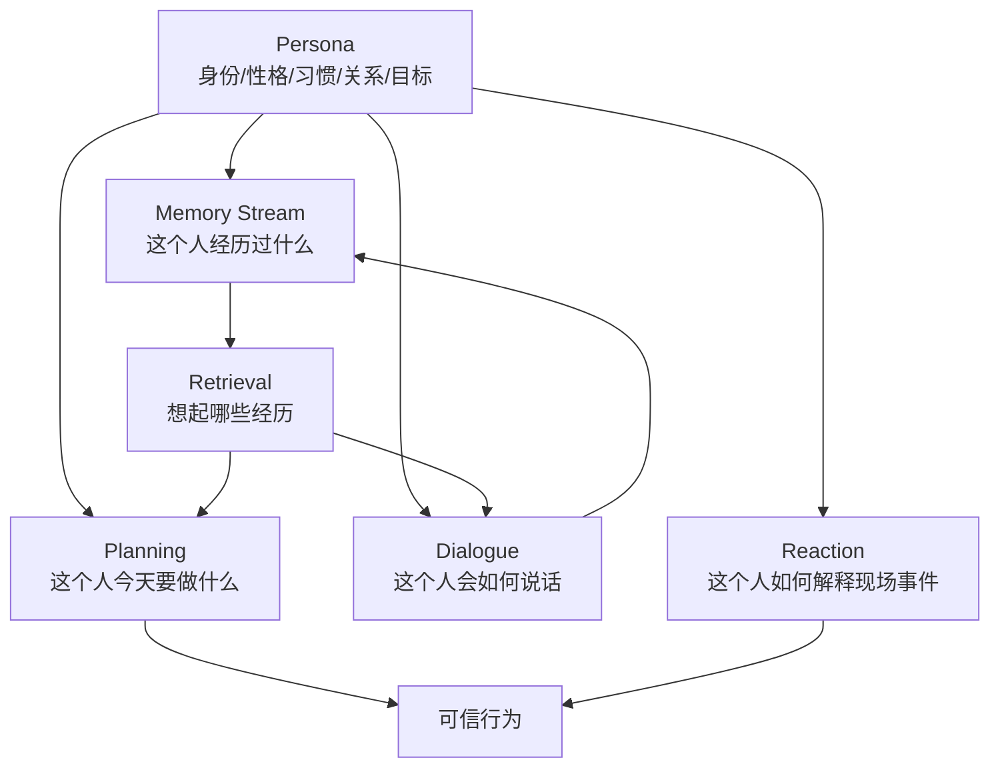
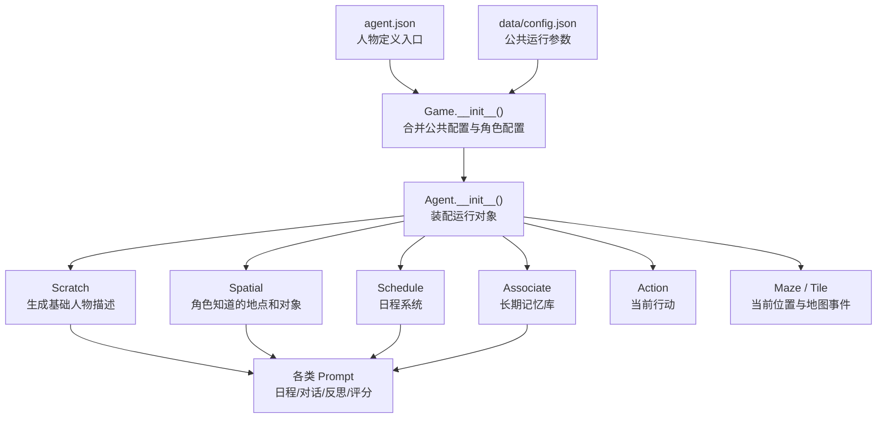

# 第 4 章 论文架构一：Persona 与人物定义

## 核心问题

Smallville 不是空城。它之所以能呈现可信社会行为，前提是小镇里的每个居民都被定义成一个具体的人。这里的“人”不是指真实意识，也不是指复杂心理模型，而是指一个能持续行动的角色锚点：

- 他是谁。
- 他住在哪里。
- 他平时怎么生活。
- 他和谁有关系。
- 他最近在关心什么。
- 他已经知道哪些事情。

这些信息共同构成 persona。没有 persona，后面的 memory stream、retrieval、reflection、planning 和 dialogue 都没有稳定对象。记忆不知道属于谁，计划不知道服务谁，对话也不知道应该延续什么关系。

> Persona 是生成式智能体的身份底座。它让同一个 LLM 在不同角色身上表现出不同生活轨迹，而不是每一轮都重新生成一个陌生人。

## 4.1 Persona 的位置

Generative Agents 的架构经常被概括为 memory stream、retrieval、reflection、planning 和 dialogue。这个概括没有错，但如果直接从 memory stream 开始，读者容易漏掉一个更基础的问题：

经验流属于谁？同样一件事，进入不同角色的人生里，意义并不一样。

 - 伊莎贝拉听到“情人节派对”，会想到咖啡馆、顾客、布置和邀请。
 - 山姆听到“地方选举”，会想到竞选、邻居、公共事务和说服。
 - 克劳斯听到“社会议题”，会联想到研究论文、低收入社区、社会正义和学术讨论。
 - 玛丽亚听到“霍布斯咖啡馆”，可能会想到学习、吃饭、直播之余的社交机会。

这些差异不是 memory stream 自动产生的。它们来自角色一开始就拥有的身份、习惯、关系和目标。



*图 4-1：Persona 在 Generative Agents 架构中的位置。Persona 不是装饰性人设，而是记忆、计划、对话和反应共同依赖的身份底座。*

## 4.2 人物定义不是一句角色卡

很多 LLM 角色应用会把 persona 简化成一句角色卡：

```text
你是伊莎贝拉，34 岁，友好、外向，是霍布斯咖啡馆老板。
```

这能让模型说话时带一点角色味道，但还不够支撑小镇生活。小镇居民不是只在被用户提问时出现。他们会起床、工作、吃饭、移动、等待、聊天、错过事件、记住邀请、调整计划。要支撑这些行为，人物定义至少要覆盖六个层面。

| 定义层 | 中文意思 | 对可信行为的影响 |
| --- | --- | --- |
| 身份 | 角色是谁，年龄、职业、家庭或社会位置是什么。 | 决定角色能自然做什么，不能突然变成另一个人。 |
| 性格 | 角色稳定的反应倾向和说话气质。 | 影响对话风格、是否主动社交、如何回应冲突。 |
| 背景知识 | 角色已经知道的事实、经历、专业和个人历史。 | 让回答和行动有来历，不像空白模型临场编造。 |
| 生活习惯 | 作息、常去地点、日常活动节奏。 | 生成日程时提供生活骨架，让角色不是随机游走。 |
| 社会关系 | 角色和其他居民的亲疏、合作、冲突或共同经历。 | 决定对话是否自然，信息传播是否有路径。 |
| 当前目标 | 角色最近正在关心或推进的事情。 | 让今天的行为有方向，例如筹备派对、竞选市长、写论文。 |

*表 4-1：人物定义的六个层面。Persona 的作用不是写一段漂亮介绍，而是给后续行为生成提供稳定约束。*这张表也解释了为什么“可信行为”不能只靠 prompt 语气。一个角色说话像咖啡馆老板，只是表层可信；他每天会去咖啡馆、会关心顾客、会把派对消息告诉合适的人，才是系统层面的可信。

## 4.3 系统中如何定义一个角色

在项目里，定义一个角色不是只写一句 prompt。一个可运行智能体由多类配置和运行模块共同装配出来。读者在这个阶段不需要逐行读源码，但必须先知道完整角色定义会流向哪里。

| 系统模块 | 接收的人物信息 | 对角色行为的影响 |
| --- | --- | --- |
| `agent.json` | `name`、`currently`、`scratch`、`spatial`、`coord`、头像资源路径。 | 这是角色定义的入口文件，决定角色是谁、在哪里、知道哪些空间、有什么生活设定。 |
| `data/config.json` | 公共 agent 配置，例如感知、思考、聊天、记忆、日程等默认参数。 | 给所有角色提供统一运行规则，避免每个角色都重复写系统参数。 |
| `Game.__init__()` | 合并公共配置、角色配置和运行时 agent 列表。 | 把“静态角色定义”变成当前仿真要加载的 agent 配置。 |
| `Agent.__init__()` | 装配 `Spatial`、`Schedule`、`Associate`、`Scratch`、当前 action、坐标和状态。 | 让角色从配置文件变成可感知、可记忆、可行动的运行对象。 |
| `Scratch` | `name`、`currently`、`scratch.age`、`scratch.innate`、`scratch.learned`、`scratch.lifestyle`、`scratch.daily_plan`。 | 把人物定义整理进 prompt，影响日程、对话、反思和事件评分。 |
| `Spatial` | `spatial.address`、`spatial.tree`。 | 定义角色知道哪些地点和对象，决定行动能落到哪些空间地址上。 |
| `Schedule` | 公共日程配置和角色生活习惯。 | 让角色的一天不是随机生成，而是围绕作息和日常计划展开。 |
| `Associate` | 角色自己的长期记忆库配置。 | 后续观察、对话和 thought 都会写到这个角色自己的记忆流里。 |
| `Maze` / `Tile` | `coord`、当前位置 tile、地址和事件。 | 把人物定义落到地图上，让角色能被看见、能移动、能遇到别人。 |

*表 4-2：项目中定义一个角色涉及的系统模块。人物定义不是单个 prompt，而是配置、空间、记忆、日程和运行状态的组合。*



*图 4-2：项目中角色定义进入系统的路径。`agent.json` 只是入口，真正运行时还要被拆入 Scratch、Spatial、Schedule、Associate、Action 和 Maze。*项目里最核心的人物描述模板是 `generative_agents/data/prompts/base_desc.txt`。这是很多后续 prompt 的共同底座。读这段模板前，先把变量含义看清楚。

| 模板字段 | 主要来源 | 中文意思 | 对行为的影响 |
| --- | --- | --- | --- |
| `${name}` | `name` | 角色姓名。 | 让模型知道当前要扮演的是哪个居民。 |
| `${age}` | `scratch.age` | 角色年龄。 | 影响说话方式、生活阶段、社会角色和日程合理性。 |
| `${innate}` | `scratch.innate` | 先天或稳定性格，例如友好、好奇、热情。 | 影响角色遇事时的反应倾向和对话气质。 |
| `${learned}` | `scratch.learned` | 后天经历、职业身份、专业背景和重要关系。 | 决定角色为什么会关心某些事情，也决定他能自然谈论什么。 |
| `${lifestyle}` | `scratch.lifestyle` | 长期生活习惯，例如几点睡、几点起、平时如何生活。 | 给日程生成提供作息边界，避免角色每天随机生活。 |
| `${daily_plan}` | `scratch.daily_plan` | 角色典型一天会做什么。 | 让系统生成一天安排时有稳定骨架。 |
| `${date}` | 仿真时钟 | 当前日期。 | 让计划、回忆和事件时间对齐。 |
| `${currently}` | `currently` | 角色最近正在关心、准备或推进的事情。 | 直接影响今天最可能出现的行动和对话主题。 |

*表 4-3：基础人物描述 prompt 的字段含义。定义角色时，最重要的不是写得漂亮，而是让每个字段都能影响后续行为。*

完整的中文模板如下：

```text
姓名: ${name}
年龄：${age}
先天特质：${innate}
后天特质：${learned}
生活习惯：${lifestyle}
日常计划：${daily_plan}

今天是 ${date}。${currently}
```

英文对照模板可以这样理解：

```text
Name: ${name}
Age: ${age}
Innate traits: ${innate}
Learned traits: ${learned}
Lifestyle: ${lifestyle}
Daily plan: ${daily_plan}

Today is ${date}. ${currently}
```

以伊莎贝拉为例，按项目字段填充后，基础人物定义 prompt 是：

```text
姓名: 伊莎贝拉
年龄：34
先天特质：友好、外向、好客
后天特质：伊莎贝拉是霍布斯咖啡馆的老板，她总是想办法让咖啡馆成为人们放松和享受的地方。
生活习惯：伊莎贝拉晚上11点左右上床睡觉，早上6点左右醒来。
日常计划：伊莎贝拉每天早上8点开放霍布斯咖啡馆，站在柜台前直到晚上8点，然后关闭咖啡馆。

今天是 2024年02月13日（星期二）。伊莎贝拉计划于2月14日下午5点在霍布斯咖啡馆与她的顾客举行情人节派对。她正在收集聚会材料，并告诉大家在2月14日下午5点至7点在霍布斯咖啡馆参加聚会。
```

对应的英文写法可以这样写：

```text
Name: Isabella
Age: 34
Innate traits: friendly, outgoing, hospitable
Learned traits: Isabella is the owner of Hobbs Cafe. She is always looking for ways to make the cafe a place where people can relax and enjoy themselves.
Lifestyle: Isabella goes to bed around 11 PM and wakes up around 6 AM.
Daily plan: Isabella opens Hobbs Cafe at 8 AM every day, stands behind the counter until 8 PM, and then closes the cafe.

Today is Tuesday, February 13, 2024. Isabella plans to hold a Valentine's Day party with her customers at Hobbs Cafe at 5 PM on February 14. She is gathering party materials and telling everyone to attend the party at Hobbs Cafe from 5 PM to 7 PM on February 14.
```

这段 prompt 的价值不在于文采，而在于它把角色定义压成模型每次都能读懂的基础上下文。后面生成起床时间、一天日程、对话、反思焦点、事件重要性评分时，都会反复用到这类基础描述。所以，本章先把人物定义讲清楚。第 15 章再进入源码，逐行看 `agent.json` 如何被 `Game.__init__()` 和 `Agent.__init__()` 装配成真正的智能体对象。

## 4.4 Smallville 的 25 个角色

Smallville 的人物不是无限扩展的抽象集合，而是一组明确的 25 个居民。进入 Memory Stream 之前，先看清这 25 个角色的完整轮廓。

| 角色 | 年龄 | 身份与背景 | 性格线索 | 当前目标或事件线索 |
| --- | --- | --- | --- | --- |
| 乔治 | 41 | 数学家，喜欢解决有挑战的问题，正在研究自然界中的数学模式。 | 分析、逻辑、古怪。 | 对下个月地方市长选举很好奇，经常和别人谈论这件事。 |
| 亚当 | 36 | 哲学家，喜欢探索不同观点，正在写一本关于创造力的书。 | 深思熟虑、善于反思、富有智慧。 | 好奇谁将参加地方市长选举。 |
| 亚瑟 | 42 | 玫瑰酒吧的调酒师和老板，经营酒吧十年。 | 友好、外向、慷慨。 | 学习调酒，创造新的鸡尾酒；每天傍晚经营酒吧。 |
| 伊莎贝拉 | 34 | 霍布斯咖啡馆老板，希望咖啡馆成为人们放松和社交的地方。 | 友好、外向、好客。 | 正在筹备 2 月 14 日情人节派对，并向居民传播邀请。 |
| 克劳斯 | 20 | 奥克山学院社会学学生，关注社会正义。 | 善良、好奇、热情。 | 正在写关于低收入社区中产阶级化影响的研究论文。 |
| 卡洛斯 | 32 | 诗人，喜欢探索内心想法和感受。 | 直率、狂野、不友好。 | 正在写探索自然之美的诗集，并参加创意写作研讨会。 |
| 卡门 | 33 | 哈维奥克供应店店主，帮助居民找到所需物资。 | 友好、外向、乐于助人。 | 管理供应店，与塔玛拉同住，并努力扩大网店。 |
| 埃迪 | 19 | 奥克山学院学生，学习音乐理论和作曲。 | 好奇、分析、音乐。 | 正在做音乐合成项目，并继续学习音乐理论。 |
| 塔玛拉 | 30 | 儿童读物作家，创作能激发想象力的故事。 | 富有想象力、耐心、善良。 | 正在写新的儿童读物，也在创作成人漫画系列。 |
| 山姆 | 65 | 退役海军军官，喜欢分享军队故事，和詹妮弗结婚 40 年。 | 聪明、足智多谋、幽默。 | 打算竞选地方市长，正在告诉邻居。 |
| 山本百合子 | 28 | 税务律师，帮助人们处理复杂税务问题。 | 有条理、可靠、注重细节。 | 正在做当地企业税务合规项目，也关注地方市长选举。 |
| 弗朗西斯科 | 23 | 喜剧演员，喜欢娱乐他人。 | 外向、友好、诚实。 | 正在制作关于共居空间生活的网络系列节目，并探索即兴喜剧课程。 |
| 拉吉夫 | 27 | 画家，想安静生活并享受日常创作。 | 耐心、可靠、开朗。 | 正在准备首场个人展，也开始喜欢弹吉他。 |
| 拉托亚 | 25 | 数码摄影师，擅长从旅行中获得创作灵感。 | 有条理、有逻辑、细心。 | 正在创作摄影系列，也把地方市长选举作为谈话核心话题。 |
| 梅 | 44 | 大学教授，也是母亲，喜欢支持学生和家人。 | 培养、善良、耐心。 | 教授哲学课程、撰写研究论文，并帮助孩子做功课。 |
| 汤姆 | 52 | 柳树市场和药店店主，负责商店日常运营。 | 粗鲁、好斗、精力充沛。 | 关注地方市长选举，但不喜欢山姆。 |
| 沃尔夫冈 | 21 | 奥克山学院化学学生，也是一名学生运动员。 | 勤奋、热情、敬业。 | 为下一场比赛训练，并为考试做准备。 |
| 海莉 | 30 | 作家，喜欢探索不同文化和文学。 | 富有想象力、精力充沛、足智多谋。 | 正在写关于艺术家共居空间生活的小说，并计划开播客。 |
| 玛丽亚 | 21 | 奥克山学院物理学生，兼职 Twitch 游戏主播。 | 精力充沛、热情、好学。 | 攻读物理学位，几乎每天去霍布斯咖啡馆学习和吃饭。 |
| 瑞恩 | 29 | 软件工程师，喜欢解决问题和改进系统。 | 善于分析、务实、有上进心。 | 正在开发新的移动应用，并研究最新技术。 |
| 简 | 46 | 家庭主妇，照顾家人，和汤姆同住。 | 友好、乐于助人、有条理。 | 主要围绕家庭生活展开，是汤姆社会关系的一部分。 |
| 约翰 | 45 | 柳树市场和药店的药店店主，帮助顾客获得药物。 | 耐心、善良、有条理。 | 经营药店，参加在线课程，也询问居民谁会参加市长选举。 |
| 詹妮弗 | 68 | 水彩画家，创作五十多年，和山姆结婚 40 年。 | 聪明、有经验、热情。 | 正在准备作品展，也指导年轻艺术家。 |
| 阿伊莎 | 20 | 大学生，热爱文学探索。 | 好奇、坚定、独立。 | 正在研究莎士比亚戏剧语言，并学习写作。 |
| 阿比盖尔 | 25 | 数字艺术家和动画师，探索艺术与技术结合。 | 思想开放、好奇、坚定。 | 正在为客户做动画项目，并尝试互动艺术工具。 |

*表 4-4：Smallville 的 25 个角色。每个角色都有身份、性格、目标或生活锚点，这些信息会进入后续记忆、日程和对话生成。*

## 4.5 初始设定与后续经历

Persona 不是 memory stream，但它会决定 memory stream 如何被理解。可以把两者区分开：

| 层次 | 作用 | 例子 |
| --- | --- | --- |
| 初始人物定义 | 角色一开始是谁，生活方式和目标是什么。 | 伊莎贝拉是咖啡馆老板，正在筹备情人节派对。 |
| 后续经验记录 | 角色运行过程中看见、做过、聊过、想到的内容。 | 伊莎贝拉告诉阿伊莎派对时间；阿伊莎把这件事告诉别人。 |
| 检索与行动 | 当前情境下，系统把哪些人物定义和经验放进 prompt。 | 遇到顾客时，伊莎贝拉想起派对目标并自然发出邀请。 |

初始人物定义提供的是“角色起点”。Memory Stream 保存的是“角色经历”。两者合在一起，才形成可持续的角色身份。如果只有初始定义，没有经验记录，角色会像固定角色卡。它知道自己是谁，但不会被过去改变。如果只有经验记录，没有稳定 persona，角色会像一堆无主日志。它记得很多事件，却缺少解释这些事件的身份背景。Generative Agents 的关键就在于把这两者接起来：角色先有初始身份，再在小镇中不断产生新经历，最后通过检索、反思和计划把过去带入未来。


*图 4-3：初始人物定义与后续经验的关系。Persona 给角色一个起点，memory stream 让角色在运行过程中持续变化。*

## 4.6 论文中的经典人物线索

论文中的案例之所以容易被读者记住，不是因为每个角色的人设很长，而是因为关键 persona 足够清楚，并且会进入后续行为。

| 角色 | 初始人物线索 | 后续行为价值 |
| --- | --- | --- |
| Isabella Rodriguez | 咖啡馆经营者，外向、好客，正在筹备情人节派对。 | 她会自然邀请顾客和熟人，派对消息从她这里开始扩散。 |
| Sam Moore | 退休军人，关心社区，准备竞选地方市长。 | 竞选信息有明确源头，居民可以根据关系和立场形成不同反应。 |
| Klaus Mueller | 社会学学生，关注社会议题，正在写研究论文。 | 他与 Maria 的交流不是随机寒暄，而是能围绕共同兴趣发展关系。 |
| Maria Lopez | 物理学生，喜欢探索新想法，也有游戏直播生活。 | 她与 Klaus 的互动有共同话题，关系变化有可信基础。 |
| John Lin | 有家庭、工作和日常安排。 | John 的一天展示了个体生活连续性，不只是聊天能力。 |

*表 4-5：论文案例中的人物定义线索。人物定义越清楚，后面的记忆、计划和对话越容易被读者理解。*这些设定不需要写成小说人物小传。技术系统真正需要的是能驱动行为的关键信息。例如，伊莎贝拉“友好、外向、好客”会影响她是否主动邀请别人；“咖啡馆老板”会影响她常去哪里；“正在筹备派对”会影响她今天对话中最可能传播什么信息。山姆“准备竞选地方市长”则把一个公共事件引入小镇。这个目标不是一句背景介绍，而是信息扩散实验的种子。

## 4.7 人物定义如何影响架构模块

Persona 与后续架构模块不是并列关系，而是底层输入关系。

| 架构模块 | Persona 的作用 | 如果缺失会怎样 |
| --- | --- | --- |
| Memory Stream | 决定记忆属于哪个角色，哪些经历对这个角色更有意义。 | 记忆变成无主日志，难以解释行为连续性。 |
| Retrieval | 影响相关性判断，同一事件对不同角色的重要程度不同。 | 检索可能只看文本相似度，想不起真正符合身份的经历。 |
| Reflection | 提供归纳背景，让反思能形成“我怎么看自己和别人”。 | 反思容易变成泛泛总结，缺少角色立场。 |
| Planning | 提供作息、职业、目标和常去地点。 | 日程会随机，角色不像在过自己的生活。 |
| Reacting | 提供现场反应的身份边界。 | 角色可能对所有事件都用同一种方式回应。 |
| Dialogue | 提供说话风格、关系背景和当前关注点。 | 对话会变成通用聊天，缺少人物差异。 |

*表 4-6：Persona 对后续架构模块的影响。人物定义不是独立章节的知识点，而是后面所有机制的共同前提。*这也说明了本章为什么必须放在 Memory Stream 之前。Memory Stream 记录的是“某个角色”的经验，而不是系统里的公共文本仓库。先讲人物定义，读者才能理解后面为什么每个智能体都要有自己的记忆流、检索结果、反思结果和日程。

## 4.8 从论文概念到项目字段

本章主线仍然是论文架构，但为了后续源码阅读，需要先把 persona 与项目字段建立一个轻量映射。

| 论文层概念 | 项目中的对应字段 | 中文意思 |
| --- | --- | --- |
| 角色身份 | `name`、`scratch.age`、`scratch.learned` | 角色叫什么、几岁、有什么职业和背景经历。 |
| 性格倾向 | `scratch.innate` | 角色比较稳定的性格底色，例如友好、好奇、热情。 |
| 当前目标 | `currently` | 角色最近正在关心或推进的事，例如筹备派对、竞选市长、写论文。 |
| 生活节奏 | `scratch.lifestyle`、`scratch.daily_plan` | 角色平时几点起床、去哪、一天通常如何安排。 |
| 空间起点 | `coord`、`spatial.address` | 角色一开始在哪里，住处或核心地点是什么。 |
| 可理解空间 | `spatial.tree` | 角色知道哪些地点和对象，行动可以落到哪些地址上。 |

*表 4-7：Persona 到项目字段的轻量映射。这里先建立概念入口，源码细节会在第 15 章展开。*

注意，这里不是要读者马上掌握 `agent.json`。真正的源码装配会放到第三部分。现在只需要记住一个原则：

> 项目里的智能体不是一个 prompt，而是 persona、空间、记忆、日程、当前行动和模型调用共同装配出来的运行对象。

## 4.9 好的人物定义要能产生行为

人物定义不是越长越好。对生成式智能体来说，好的人物定义要能被后续系统使用。一个弱定义是：

```text
李明是一个善良的人。
```

这句话太空。它能影响语气，却很难影响日程、地点、关系和事件传播。一个更有用的定义是：

```text
李明是社区诊所医生，平时上午在诊所接待居民，下午会去公园散步。他关心老年人的健康问题，最近正在组织一次免费体检活动。
```

后者包含职业、地点、作息、关注议题和当前目标。系统可以据此生成行动：上午去诊所，下午去公园，遇到老人时谈体检活动，把活动信息传播给其他居民。可以用这张表判断人物定义是否可用：

| 检查项 | 好定义 | 弱定义 |
| --- | --- | --- |
| 能生成日程 | 有作息、职业、常去地点。 | 只有抽象性格。 |
| 能触发对话 | 有当前目标、社会关系、共同话题。 | 只有“友好”“开朗”这类形容词。 |
| 能影响记忆重要性 | 某些事件对角色身份有特殊意义。 | 所有事件看起来都差不多。 |
| 能支持社会传播 | 角色有理由告诉别人某件事。 | 角色没有明确动机。 |
| 能被实验验证 | 行为能在回放和日志中观察。 | 只停留在模型语气上。 |

*表 4-8：可用人物定义与弱人物定义的区别。人物定义的质量，要看它能不能进入日程、对话、记忆和回放。*

## 4.10 本章小结

Persona 是 Generative Agents 的第一层架构。它不负责保存后续经历，也不负责生成全部行为，但它给每个智能体提供了身份底座。没有这层底座，小镇里就只有一组共享 LLM 能力的文本接口，而不是一群能持续生活的居民。

| 本章内容 | 核心结论 |
| --- | --- |
| Persona 的位置 | 人物定义是 memory、planning、dialogue 和 reaction 的共同前提。 |
| 人物定义层次 | 身份、性格、背景知识、生活习惯、社会关系和当前目标共同构成可行动 persona。 |
| 系统定义入口 | 一个角色不是一句 prompt，而是由 `agent.json`、公共配置、`Scratch`、`Spatial`、`Schedule`、`Associate` 和地图状态一起装配。 |
| 完整 prompt | `base_desc.txt` 把姓名、年龄、性格、背景、生活习惯、日常计划和当前状态压成基础上下文，后续日程、对话、反思都会复用。 |
| 25 个角色 | Smallville 的社会行为来自一组明确居民，每个人都有身份、性格、目标或生活锚点。 |
| 初始设定与后续经历 | Persona 给角色起点，memory stream 让角色在运行中变化。 |
| 论文案例 | Isabella、Sam、Klaus、Maria、John 的可信行为，都依赖清晰的人物线索。 |
| 架构影响 | Persona 会影响记忆重要性、检索相关性、反思立场、日程生成和对话方式。 |
| 项目映射 | `agent.json` 中的 `currently`、`scratch`、`spatial` 等字段，是 persona 的工程入口。 |
| 写作原则 | 好的人物定义要能产生行为，而不是只提供漂亮形容词。 |

下一章进入 Memory Stream。现在读者已经知道“角色是谁”，接下来要看“这个角色经历过什么”，以及这些经历如何被保存为未来行为的材料。

## 参考资料

- Joon Sung Park, Joseph C. O'Brien, Carrie J. Cai, Meredith Ringel Morris, Percy Liang, Michael S. Bernstein. *Generative Agents: Interactive Simulacra of Human Behavior*. arXiv: https://arxiv.org/abs/2304.03442
- ar5iv full text: https://ar5iv.labs.arxiv.org/html/2304.03442
- Local source: `generative_agents/frontend/static/assets/village/agents/伊莎贝拉/agent.json`
- Local source: `generative_agents/frontend/static/assets/village/agents/山姆/agent.json`
- Local source: `generative_agents/frontend/static/assets/village/agents/克劳斯/agent.json`
- Local source: `generative_agents/frontend/static/assets/village/agents/玛丽亚/agent.json`
