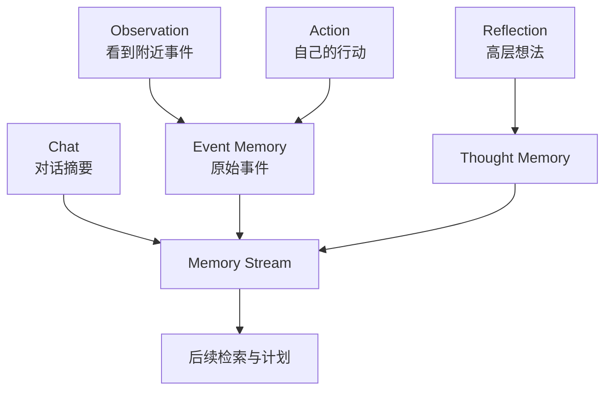

# 第 4 章：论文架构一：Memory Stream

## 本章要解决的问题

前三章已经说明，Generative Agents 要解决的不是单轮聊天，而是持续生活。持续生活的第一个前提是记忆。

本章要回答的问题是：

> 为什么生成式智能体不能只依赖聊天历史，而必须拥有 memory stream？

如果一个智能体没有记忆，它就无法形成连续生活。

它可能这一刻答应参加派对，下一刻完全忘记。

它可能刚刚和朋友聊完论文，下一次见面又像第一次认识。

它可能看见某人正在使用浴室，却不知道自己应该等待。

它可能经历了很多事件，却无法从这些事件中形成对自己和他人的理解。

因此，memory stream 是 Generative Agents 架构的第一块基石。

## 4.1 记忆为什么是第一问题

很多人第一次设计 LLM 角色时，会想到两种简单做法。

第一种做法是把人设写进 prompt。

例如：

```text
你是伊莎贝拉，34 岁，友好、外向，是霍布斯咖啡馆老板。
```

这种方式可以让模型在当前回答中保持角色风格，但它只能解决身份设定问题，不能解决经历问题。角色知道自己是谁，却不知道刚才发生了什么。

第二种做法是把聊天历史放进上下文。

这能让角色记住最近几轮对话，但仍然不够。因为智能体生活中的重要经历不只是聊天。

它还包括：

- 看见别人做什么。
- 自己去了哪里。
- 自己正在执行什么计划。
- 某个对象是否被占用。
- 今天形成了什么想法。
- 哪些事件让它产生了新的判断。

如果只保存聊天历史，智能体会变成“会聊天但不会生活”的角色。它可能记得你刚刚说过的话，却不记得自己刚才在地图上看到了谁，也不记得自己原本要去哪里。

Generative Agents 论文把这个问题推进了一步：智能体需要保存的是经验流，而不是对话流。

这就是 memory stream。

## 4.2 Memory Stream 是什么

Memory stream 可以理解为智能体的长期经验记录。它持续保存智能体观察到、经历到、想到的重要内容。

它不是一张简单表格，也不是纯粹日志。它的每一条记录都以自然语言描述，并附带时间信息。自然语言很重要，因为后续 LLM 可以直接阅读和推理这些记忆。

论文中的 memory stream 至少包含三类信息：

1. 观察。
2. 行动。
3. 反思。

观察是智能体从世界中看到的东西。例如：

```text
伊莎贝拉看见亚当正在霍布斯咖啡馆写作。
```

行动是智能体自己正在做或已经做过的事情。例如：

```text
伊莎贝拉正在准备情人节派对的饮品。
```

反思是智能体从过去经历中总结出的高层想法。例如：

```text
伊莎贝拉认为亚当最近很专注于写作，可能不太愿意参加长时间活动。
```

这三类信息共同构成角色的“过去”。未来每一次计划、对话和反应，都可能从这些过去中提取相关部分。

[图 4-1：Observation、Action、Reflection 进入 Memory Stream]



## 4.3 记忆不是聊天历史

这一点必须反复强调：memory stream 不等于聊天历史。

聊天历史只记录对话。Memory stream 记录生活。

一个角色在小镇中经历的事情远比对话多。它可能走到某个地点，看见某个人，发现某个对象被占用，执行某项计划，错过某个活动，或者在没有和任何人说话的情况下形成一个新想法。

这些都应该进入记忆。

举一个简单例子。

假设玛丽亚上午去霍布斯咖啡馆学习。她没有和任何人聊天，但她看到伊莎贝拉正在布置派对装饰。这个观察本身可能影响后续行为。下午她遇到朋友时，可能会提到咖啡馆好像在准备活动。

如果系统只保存聊天历史，这个信息就丢失了。

再看另一个例子。

汤姆在商店里看到很多人谈论山姆竞选市长。即使汤姆没有立刻发言，这些观察也可能强化他对选举的关注，甚至影响他后面对山姆的态度。

这些经验都不是聊天历史，但它们是社会仿真的材料。

因此，memory stream 要覆盖智能体生活中的多种事件，而不是只保存语言对话。

## 4.4 记忆也不是普通日志

另一个误解是把 memory stream 当成普通日志。

普通日志的目标是记录系统发生了什么，主要供开发者排查问题。日志可以很细，也可以很杂。它不一定要服务智能体未来的决策。

Memory stream 不同。它是智能体自己的经验材料，未来要被检索、整理和重新使用。

这带来几个要求。

第一，记忆必须对智能体有意义。

不是所有系统事件都应该进入 memory stream。比如某个函数调用成功、某个 JSON 文件写入完成，这对开发者重要，但对角色不重要。角色应该记住的是世界中的事件：谁做了什么，谁说了什么，自己想到了什么。

第二，记忆必须能被自然语言检索。

未来智能体要根据当前问题找回相关记忆。如果记忆只是代码对象或内部状态，LLM 很难直接使用。自然语言描述让记忆可以进入 prompt。

第三，记忆必须有时间。

同一句话在不同时间意义不同。昨天的邀请和一个月前的邀请，权重不一样。刚刚发生的对话和很久以前的闲聊，对当前行动的影响也不同。

第四，记忆需要重要性。

不是所有记忆同等重要。看到一把椅子空着，和被朋友邀请参加重要活动，显然不一样。论文后面用 importance 帮助检索系统判断哪些记忆更值得被想起。

所以，memory stream 是面向智能体决策的经验流，而不是面向程序员调试的日志流。

[表 4-1：聊天历史、系统日志、Memory Stream 的区别]

## 4.5 自然语言作为统一记忆表示

Generative Agents 的一个关键选择是：记忆用自然语言表达。

这看起来很普通，实际上非常重要。

传统系统中，记忆可能被设计成结构化数据：

```json
{
  "subject": "伊莎贝拉",
  "action": "邀请",
  "object": "亚当",
  "event": "情人节派对",
  "time": "2024-02-14 09:30"
}
```

这种表示清晰、可计算，但表达复杂情境时会变得笨重。例如“亚当礼貌地拒绝了邀请，因为他正在赶书稿，但表示感谢”这样的事件，要完整结构化并不容易。

自然语言的优势在于灵活。

```text
亚当婉拒了伊莎贝拉的情人节派对邀请，因为他需要集中精力完成书稿，但他感谢了伊莎贝拉的邀请。
```

这样的记忆可以直接放进 prompt，让 LLM 根据上下文理解其含义。

自然语言表示还有另一个好处：它可以统一不同类型的经验。

观察可以是自然语言。

对话摘要可以是自然语言。

计划可以是自然语言。

反思也可以是自然语言。

这样一来，智能体不需要为每种经验设计完全不同的推理接口。它可以把相关记忆组合成上下文，让 LLM 进行推理。

当然，自然语言表示也有代价：

- 它可能模糊。
- 它可能包含幻觉。
- 它不如结构化数据容易精确查询。
- 它可能在多次总结后失真。

这也是为什么后续 2023-2026 年前沿发展会强调记忆治理、冲突检测、关系图记忆和长期记忆管理。Memory stream 是起点，不是终点。

## 4.6 Memory Stream 如何支持未来行为

记忆保存下来之后，真正的问题是：它如何影响未来？

Memory stream 本身只是存储。要让它发挥作用，还需要检索。

假设山姆正在和约翰聊天。系统不应该把山姆一生所有记忆都塞进 prompt，而应该找出当前相关记忆：

- 山姆正在竞选地方市长。
- 约翰对谁参加选举感兴趣。
- 山姆最近和别人讨论过社区安全。
- 约翰是药店店主，关心居民服务。

这些记忆进入 prompt 后，模型才可能生成合理对话。

再比如伊莎贝拉遇到阿伊莎。相关记忆可能包括：

- 伊莎贝拉正在筹备情人节派对。
- 阿伊莎研究莎士比亚戏剧中的语言。
- 伊莎贝拉想让派对更有趣。

于是对话中可能自然出现邀请阿伊莎分享文学故事的内容。

这说明 memory stream 不是静态档案，而是未来行为的材料库。

它影响至少四类行为：

1. 计划。
   - 昨天的经历影响今天的 `currently` 和日程。
2. 对话。
   - 过去的关系和事件影响现在说什么。
3. 反应。
   - 看到某人时，过去记忆决定是否聊天或等待。
4. 反思。
   - 多条记忆被总结成更高层 insight。

没有 memory stream，retrieval、reflection、planning 和 dialogue 都会失去基础。

## 4.7 Memory Stream 与时间

Memory stream 中的每条记忆都需要时间。

时间至少有三个作用。

第一，判断近期性。

刚刚发生的事情通常更容易影响当前行动。五分钟前被邀请参加派对，比三个月前听说某个活动更相关。

第二，判断有效性。

有些记忆会过期。比如“下午 5 点参加派对”在当天晚上 8 点之后就不再是未来计划，而变成已经发生或错过的事件。

第三，形成生活节奏。

一个角色连续几天都在咖啡馆学习，这和偶然一次去咖啡馆意义不同。时间让系统可以从重复事件中发现习惯，也让反思有材料可用。

GenerativeAgentsCN 中，`Concept` 保存了：

- `create`
- `expire`
- `access`

这三个字段分别对应记忆创建时间、过期时间和最近访问时间。

这说明当前项目已经不只是把文本扔进向量库，而是把时间作为记忆系统的一部分。

后面读源码时，我们会看到 `AssociateRetriever` 会根据 `access` 计算 recency 分数；`LlamaIndex.cleanup()` 会清理过期节点；`Agent.reflect()` 会根据重要性累积和近期记忆触发反思。

## 4.8 Memory Stream 与重要性

时间不是唯一标准。

有些事情虽然很近，但不重要。比如看到一张椅子空着。

有些事情虽然不是刚刚发生，但很重要。比如朋友邀请你参加晚上的派对，或者你决定参加镇长竞选。

所以 memory stream 需要重要性。

论文中使用 importance score 来衡量记忆重要性。重要性高的记忆更容易被检索，也更可能触发反思。

GenerativeAgentsCN 使用 `poignancy` 这个名称承接这一概念。项目中有两个 prompt：

```text
poignancy_event.txt
poignancy_chat.txt
```

它们分别用于给事件和对话打分。

当智能体感知到新事件时，`Agent._add_concept()` 会调用这些 prompt，得到 1 到 10 的评分。评分会写入 `Concept.poignancy`，并累加到角色状态 `status["poignancy"]` 中。当累计值超过阈值时，角色会触发反思。

这说明重要性在项目中有两个作用：

1. 参与记忆检索排序。
2. 触发 reflection。

后面第 15 章读记忆系统源码时，这一点非常关键。

## 4.9 Memory Stream 与反思

Memory stream 保存的是原始经验，但原始经验通常是碎片。

例如：

- 克劳斯今天在咖啡馆遇到玛丽亚。
- 玛丽亚提到自己在做 Twitch 直播。
- 克劳斯提到自己研究社会议题。
- 两人都对探索新想法感兴趣。

这些都是独立记忆。如果没有反思，系统只能在后续检索时碰巧找到它们。

反思的作用是把碎片提升为高层认知：

```text
克劳斯发现玛丽亚虽然专业不同，但同样喜欢探索新想法，未来可以继续和她交流。
```

这个 insight 再次进入 memory stream，成为新的 thought。下次克劳斯遇到玛丽亚时，系统更容易检索到这个高层关系认知，而不必每次重新从多个碎片事件中推理。

这就是 memory stream 和 reflection 的关系：

- memory stream 为 reflection 提供材料。
- reflection 产生新的高层记忆。
- 新的高层记忆继续进入 memory stream。

因此，memory stream 不是只存“低层事件”，它也会逐渐包含智能体对世界的总结。

这也是 Generative Agents 能表现出长期行为连续性的关键。

## 4.10 GenerativeAgentsCN 中的对应实现

虽然本章主要讲论文概念，但我们可以提前看一下 GenerativeAgentsCN 中对应的工程结构。

在当前项目中，记忆相关核心文件包括：

```text
generative_agents/modules/memory/event.py
generative_agents/modules/memory/associate.py
generative_agents/modules/storage/index.py
generative_agents/modules/agent.py
```

其中：

- `Event` 表示世界中发生的事件。
- `Concept` 表示进入记忆流后的节点。
- `Associate` 管理 event、chat、thought 三类记忆。
- `LlamaIndex` 提供向量索引和检索能力。
- `Agent._add_concept()` 负责把事件打分后写入记忆。

可以把工程链路概括为：

```text
世界事件 -> Event -> Concept -> Associate -> LlamaIndex -> Retrieval -> Prompt
```

这条链路非常重要。它把“世界中发生了什么”和“模型下一步该怎么想”连接起来。

例如，当角色感知到别人在咖啡馆做某事时，这个观察会先以 `Event` 表示。如果这个事件不是最近已经记过的内容，就会被 `_add_concept()` 转成 `Concept`，并写入 `Associate` 管理的长期记忆。后续对话、计划或反思时，系统可以从这些记忆中检索相关内容。

这就是论文 memory stream 在 GenerativeAgentsCN 中的落地。

[图 4-2：GenerativeAgentsCN 中 Event 到 Memory Stream 的工程链路]

## 4.11 Memory Stream 的局限

Memory stream 很重要，但它不是万能方案。

第一，记忆会膨胀。

如果智能体运行很久，每天产生大量事件和对话，记忆数量会快速增长。检索会变慢，噪声会增加。

第二，记忆会重复。

角色每天都吃早餐、上班、回家。如果每次都原样写入，长期记忆会被日常重复事件淹没。

第三，记忆会出错。

LLM 生成的对话摘要可能不准确。模型可能把没有发生过的事情写进总结。错误记忆进入 memory stream 后，会影响后续行为。

第四，记忆可能互相冲突。

一个角色可能记得派对在 5 点开始，另一次对话却说成 7 点。如果没有冲突检测，系统可能继续传播错误信息。

第五，关系记忆不够结构化。

用自然语言记录“汤姆不喜欢山姆”是可行的，但如果要长期追踪信任、熟悉度、好感度、冲突历史，单纯文本记忆就不够稳定。

这些局限不会削弱 memory stream 的价值。相反，它们说明后续升级的方向。第五部分讨论 MemGPT、Mem0 和长期记忆治理时，会回到这些问题。

在当前阶段，读者只需要先抓住一点：

> Memory stream 让智能体拥有过去；但要让过去可靠、可控、可扩展，还需要进一步的记忆管理。

## 4.12 本章小结

本章讲清了 memory stream 的基本意义：

1. 生成式智能体需要保存经验流，而不是只保存聊天历史。
2. Memory stream 记录观察、行动、对话和反思，是持续生活的基础。
3. 记忆用自然语言表示，使 LLM 可以直接读取和推理。
4. Memory stream 不是普通日志，它服务于未来计划、对话、反应和反思。
5. 时间和重要性是记忆系统的重要属性。
6. Reflection 会把原始记忆提升成高层 thought，并写回 memory stream。
7. GenerativeAgentsCN 中，`Event`、`Concept`、`Associate` 和 LlamaIndex 共同实现了 memory stream 的工程落地。
8. Memory stream 也有局限：膨胀、重复、错误、冲突和关系表达不足。

下一章我们继续讲 Retrieval。拥有记忆只是第一步；真正做决定时，智能体不能读取全部记忆，而必须从 memory stream 中找出当前最相关的内容。

## 参考资料

- Joon Sung Park, Joseph C. O'Brien, Carrie J. Cai, Meredith Ringel Morris, Percy Liang, Michael S. Bernstein. *Generative Agents: Interactive Simulacra of Human Behavior*. arXiv: https://arxiv.org/abs/2304.03442
- ar5iv full text: https://ar5iv.labs.arxiv.org/html/2304.03442
- GenerativeAgentsCN local source: `generative_agents/modules/memory/event.py`, `generative_agents/modules/memory/associate.py`, `generative_agents/modules/storage/index.py`, `generative_agents/modules/agent.py`
