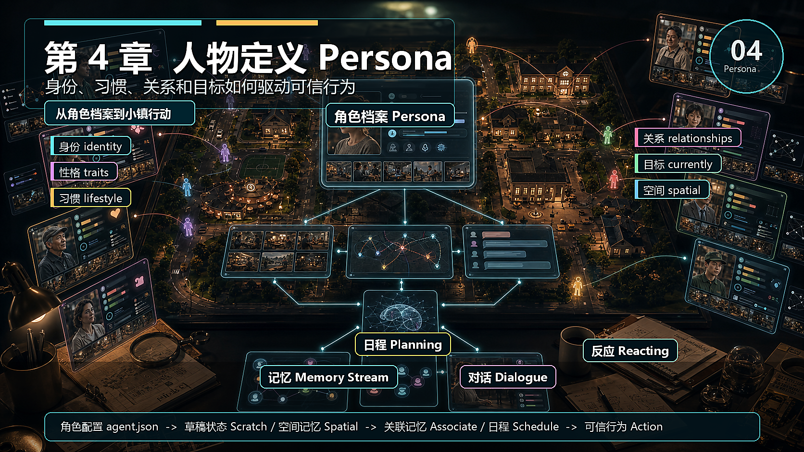
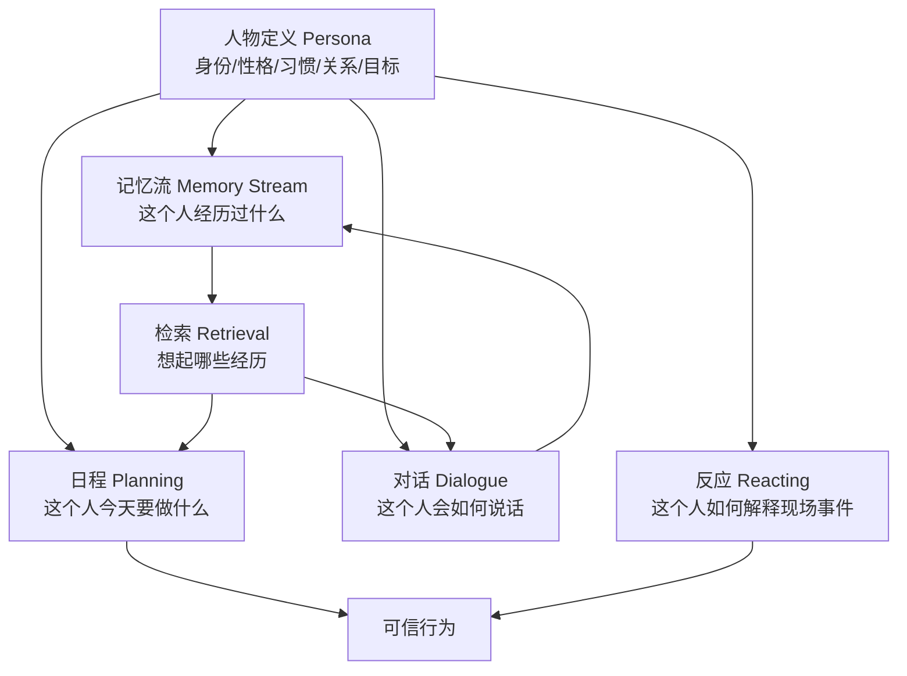
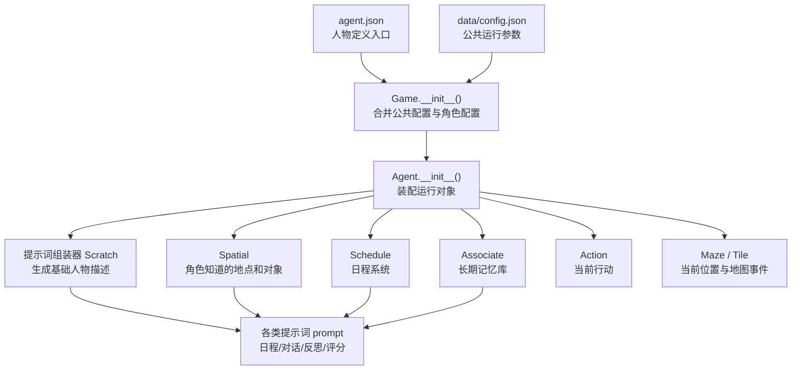

# 第 4 章 论文架构一：人物定义 Persona

Smallville 不是空城，它之所以能呈现可信社会行为，前提是小镇里的每个居民都被定义成一个具体的人。这里的“人”不是指真实意识，也不是指复杂心理模型，而是指一个能持续行动的角色锚点：

- 他是谁
- 他住在哪里
- 他平时怎么生活
- 他和谁有关系
- 他最近在关心什么
- 他已经知道哪些事情

这些信息共同构成人物定义 Persona。没有人物定义 Persona，后面的记忆流 Memory Stream、检索 Retrieval、反思 Reflection、日程 Planning 和对话 Dialogue 都没有稳定对象。记忆不知道属于谁，计划不知道服务谁，对话也不知道应该延续什么关系。

> 人物定义 Persona 是生成式智能体的身份底座。它让同一个大语言模型 LLM 在不同角色身上表现出不同生活轨迹，而不是每一轮都重新生成一个陌生人。



*图 4-1：人物定义 Persona 的系统入口。角色不是一句角色卡，而是从角色配置 `agent.json` 进入提示词组装器 Scratch、空间记忆 Spatial、关联记忆 Associate 和日程 Schedule，再影响记忆流 Memory Stream、日程 Planning、对话 Dialogue、反应 Reacting 和最终行动 Action。*

## 4.1 人物定义 Persona 的位置

生成式智能体 Generative Agents 的架构经常被概括为记忆流 Memory Stream、检索 Retrieval、反思 Reflection、日程 Planning 和对话 Dialogue。这个概括没有错，但如果直接从记忆流 Memory Stream 开始，读者容易漏掉一个更基础的问题：

经验流属于谁？同样一件事，进入不同角色的人生里，意义并不一样。

 - 伊莎贝拉 Isabella Rodriguez 听到“情人节派对”，会想到咖啡馆、顾客、布置和邀请。
 - 山姆 Sam Moore 听到“地方选举”，会想到竞选、邻居、公共事务和说服。
 - 克劳斯 Klaus Mueller 听到“社会议题”，会联想到研究论文、低收入社区、社会正义和学术讨论。
 - 玛丽亚 Maria Lopez 听到“霍布斯咖啡馆”，可能会想到学习、吃饭、直播之余的社交机会。

这些差异不是记忆流 Memory Stream 自动产生的。它们来自角色一开始就拥有的身份、习惯、关系和目标。


```mermaid
flowchart TD
    Persona["人物定义 Persona<br/>身份/性格/习惯/关系/目标"] --> Memory["记忆流 Memory Stream<br/>这个人经历过什么"]
    Persona --> Planning["日程 Planning<br/>这个人今天要做什么"]
    Persona --> Dialogue["对话 Dialogue<br/>这个人会如何说话"]
    Persona --> Reaction["反应 Reacting<br/>这个人如何解释现场事件"]

    Memory --> Retrieval["检索 Retrieval<br/>想起哪些经历"]
    Retrieval --> Planning
    Retrieval --> Dialogue
    Planning --> Action["可信行为"]
    Dialogue --> Memory
    Reaction --> Action
```

*图 4-2：人物定义 Persona 在生成式智能体 Generative Agents 架构中的位置。人物定义 Persona 不是装饰性人设，而是记忆流 Memory Stream、日程 Planning、对话 Dialogue 和反应 Reacting 共同依赖的身份底座。*

## 4.2 人物定义不是一句角色卡

很多大语言模型 LLM 角色应用会把人物定义 Persona 简化成一句角色卡：

```text
你是伊莎贝拉，34 岁，友好、外向，是霍布斯咖啡馆老板。
```

这能让模型说话时带一点角色味道，但还不够支撑小镇生活。小镇居民不是只在被用户提问时出现。他们会起床、工作、吃饭、移动、等待、聊天、错过事件、记住邀请、调整计划。要支撑这些行为，人物定义至少要覆盖六个层面。

| 定义层 | 中文意思 | 对可信行为的影响 |
| --- | --- | --- |
| 身份 | 角色是谁，年龄、职业、家庭或社会位置是什么。 | 决定角色能自然做什么，不能突然变成另一个人。 |
| 性格 | 角色稳定的反应倾向和说话气质。 | 影响对话风格、是否主动社交、如何回应冲突。 |
| 背景知识 | 角色已经知道的事实、经历、专业和个人历史。 | 让回答和行动有来历，不像空白模型临场编造。 |
| 生活习惯 | 作息、常去地点、日常活动节奏。 | 生成日程时提供生活骨架，让角色不是随机游走。 |
| 社会关系 | 角色和其他居民的亲疏、合作、冲突或共同经历。 | 决定对话是否自然，信息传播是否有路径。 |
| 当前目标 | 角色最近正在关心或推进的事情。 | 让今天的行为有方向，例如筹备派对、竞选市长、写论文。 |

*表 4-1：人物定义的六个层面。人物定义 Persona 的作用不是写一段漂亮介绍，而是给后续行为生成提供稳定约束。*

这张表也解释了为什么“可信行为”不能只靠提示词 prompt 语气。一个角色说话像咖啡馆老板，只是表层可信；他每天会去咖啡馆、会关心顾客、会把派对消息告诉合适的人，才是系统层面的可信。

## 4.3 系统中如何定义一个角色

在项目里，定义一个角色不是只写一句提示词 prompt。一个可运行智能体由多类配置和运行模块共同装配出来。读者在这个阶段不需要逐行读源码，但必须先知道完整角色定义会流向哪里。

角色配置先进入运行链路，再被拆给不同模块使用。


```mermaid
flowchart TD
    JSON["agent.json<br/>人物定义入口"] --> Game["Game.__init__()<br/>合并公共配置与角色配置"]
    Config["data/config.json<br/>公共运行参数"] --> Game
    Game --> Agent["Agent.__init__()<br/>装配运行对象"]

    Agent --> Scratch["提示词组装器 Scratch<br/>生成基础人物描述"]
    Agent --> Spatial["Spatial<br/>角色知道的地点和对象"]
    Agent --> Schedule["Schedule<br/>日程系统"]
    Agent --> Associate["Associate<br/>长期记忆库"]
    Agent --> Action["Action<br/>当前行动"]
    Agent --> Maze["Maze / Tile<br/>当前位置与地图事件"]

    Scratch --> Prompts["各类提示词 prompt<br/>日程/对话/反思/评分"]
    Spatial --> Prompts
    Schedule --> Prompts
    Associate --> Prompts
```

*图 4-3：项目中角色定义进入系统的路径。角色配置 `agent.json` 只是入口，真正运行时还要被拆入提示词组装器 Scratch、空间记忆 Spatial、日程 Schedule、关联记忆 Associate、行动 Action 和世界地图 Maze。*

## 4.4 base_desc.txt：基础人物描述模板

项目里最核心的人物描述模板是 `generative_agents/data/prompts/base_desc.txt`。这是很多后续提示词 prompt 的共同底座。读这段模板前，先把变量含义看清楚。

| 模板字段 | 主要来源 | 中文意思 | 对行为的影响 |
| --- | --- | --- | --- |
| `${name}` | `name` | 角色姓名。 | 让模型知道当前要扮演的是哪个居民。 |
| `${age}` | `scratch.age` | 角色年龄。 | 影响说话方式、生活阶段、社会角色和日程合理性。 |
| `${innate}` | `scratch.innate` | 先天或稳定性格，例如友好、好奇、热情。 | 影响角色遇事时的反应倾向和对话气质。 |
| `${learned}` | `scratch.learned` | 后天经历、职业身份、专业背景和重要关系。 | 决定角色为什么会关心某些事情，也决定他能自然谈论什么。 |
| `${lifestyle}` | `scratch.lifestyle` | 长期生活习惯，例如几点睡、几点起、平时如何生活。 | 给日程生成提供作息边界，避免角色每天随机生活。 |
| `${daily_plan}` | `scratch.daily_plan` | 角色典型一天会做什么。 | 让系统生成一天安排时有稳定骨架。 |
| `${date}` | 仿真时钟 | 当前日期。 | 让计划、回忆和事件时间对齐。 |
| `${currently}` | `currently` | 角色最近正在关心、准备或推进的事情。 | 直接影响今天最可能出现的行动和对话主题。 |

*表 4-3：基础人物描述提示词 prompt 的字段含义。定义角色时，最重要的不是写得漂亮，而是让每个字段都能影响后续行为。*

完整的中文模板如下：

```text
姓名: ${name}
年龄：${age}
先天特质：${innate}
后天特质：${learned}
生活习惯：${lifestyle}
日常计划：${daily_plan}

今天是 ${date}，${currently}
```

英文对照模板可以这样理解：

```text
Name: ${name}
Age: ${age}
Innate traits: ${innate}
Learned traits: ${learned}
Lifestyle: ${lifestyle}
Daily plan: ${daily_plan}

Today is ${date}. ${currently}
```

以伊莎贝拉 Isabella Rodriguez 为例，按项目字段填充后，基础人物定义提示词 prompt 是：

```text
姓名: 伊莎贝拉
年龄：34
先天特质：友好、外向、好客
后天特质：伊莎贝拉是霍布斯咖啡馆的老板，她总是想办法让咖啡馆成为人们放松和享受的地方。
生活习惯：伊莎贝拉晚上11点左右上床睡觉，早上6点左右醒来。
日常计划：伊莎贝拉每天早上8点开放霍布斯咖啡馆，站在柜台前直到晚上8点，然后关闭咖啡馆。

今天是 2024年02月13日（星期二）。伊莎贝拉计划于2月14日下午5点在霍布斯咖啡馆与她的顾客举行情人节派对。她正在收集聚会材料，并告诉大家在2月14日下午5点至7点在霍布斯咖啡馆参加聚会。
```

对应的英文写法可以这样写：

```text
Name: Isabella
Age: 34
Innate traits: friendly, outgoing, hospitable
Learned traits: Isabella is the owner of Hobbs Cafe. She is always looking for ways to make the cafe a place where people can relax and enjoy themselves.
Lifestyle: Isabella goes to bed around 11 PM and wakes up around 6 AM.
Daily plan: Isabella opens Hobbs Cafe at 8 AM every day, stands behind the counter until 8 PM, and then closes the cafe.

Today is Tuesday, February 13, 2024. Isabella plans to hold a Valentine's Day party with her customers at Hobbs Cafe at 5 PM on February 14. She is gathering party materials and telling everyone to attend the party at Hobbs Cafe from 5 PM to 7 PM on February 14.
```

这段提示词 prompt 的价值不在于文采，而在于它把角色定义压成模型每次都能读懂的基础上下文。后面生成起床时间、一天日程、对话、反思焦点、事件重要性评分时，都会反复用到这类基础描述。到第 15 章，这些字段会进入智能体 Agent 初始化链路，继续连接提示词组装器 Scratch、空间记忆 Spatial、日程 Schedule 和关联记忆 Associate。

## 4.5 agent.json：角色配置的真实格式

基础人物描述提示词 prompt 不是手写出来的孤立文本，它来自每个角色目录下的 `agent.json`。以伊莎贝拉 Isabella Rodriguez 为例，真实配置文件位于：

```text
generative_agents/frontend/static/assets/village/agents/伊莎贝拉/agent.json
```

下面保留完整顶层字段，并只截取空间树 spatial.tree 里最能说明问题的两个分支：霍布斯咖啡馆和伊莎贝拉的公寓。完整文件还包含玫瑰酒吧、哈维奥克供应店、柳树市场和药店、奥克山学院宿舍、约翰逊公园等已知地点。

```json
{
  "name": "伊莎贝拉",
  "portrait": "assets/village/agents/伊莎贝拉/portrait.png",
  "coord": [72, 14],
  "currently": "伊莎贝拉计划于2月14日下午5点在霍布斯咖啡馆与她的顾客举行情人节派对。她正在收集聚会材料，并告诉大家在2月14日下午5点至7点在霍布斯咖啡馆参加聚会。她也邀请本地记者林晓在社区公告板旁收集居民留言，希望林晓能帮忙把派对和社区活动告诉更多居民。",
  "scratch": {
    "age": 34,
    "innate": "友好、外向、好客",
    "learned": "伊莎贝拉是霍布斯咖啡馆的老板，她总是想办法让咖啡馆成为人们放松和享受的地方。她和本地记者林晓关系友好，经常请林晓记录咖啡馆里的社区活动。",
    "lifestyle": "伊莎贝拉晚上11点左右上床睡觉，早上6点左右醒来。",
    "daily_plan": "伊莎贝拉每天早上8点开放霍布斯咖啡馆，站在柜台前直到晚上8点，然后关闭咖啡馆。"
  },
  "spatial": {
    "address": {
      "living_area": ["the Ville", "伊莎贝拉的公寓", "主人房"]
    },
    "tree": {
      "the Ville": {
        "霍布斯咖啡馆": {
          "咖啡馆": [
            "冰箱",
            "咖啡馆顾客座位",
            "烹饪区",
            "厨房水槽",
            "咖啡馆柜台后面",
            "钢琴",
            "社区公告板"
          ]
        },
        "伊莎贝拉的公寓": {
          "主人房": [
            "床",
            "书桌",
            "冰箱",
            "壁橱",
            "架子"
          ]
        }
      }
    }
  }
}
```

这份配置可以按三层读：身份字段定义“她是谁”，空间字段定义“她知道哪些地方”，当前目标 currently 定义“她最近正在推进什么”。

| 字段 | 中文含义 | 进入模块 | 对行为的影响 |
| --- | --- | --- | --- |
| `name` | 角色姓名 name。 | `Agent.name`、提示词 prompt。 | 后续记忆、日程、对话和日志都用它标识这个角色。 |
| `portrait` | 头像资源 portrait。 | 前端资源路径。 | 让回放和界面能显示角色头像，不直接影响推理。 |
| `coord` | 初始坐标 coord。 | `Agent.__init__()`、世界地图 Maze。 | 决定角色进入小镇时站在哪个地图格子 tile 上。 |
| `currently` | 当前目标 currently。 | `Scratch.currently`、基础人物描述提示词 `base_desc.txt`。 | 直接影响当天日程、对话主题和可能传播的信息。 |
| `scratch` | 草稿状态 Scratch 的基础人物字段。 | 提示词组装器 Scratch。 | 提供年龄、性格、经历、生活习惯和典型日计划。 |
| `spatial.address` | 常用语义地址 semantic address。 | 空间记忆 Spatial。 | `living_area` 会被补成“睡觉”地址，用于睡眠和居住地点定位。 |
| `spatial.tree` | 空间树 spatial tree。 | 空间记忆 Spatial、行动地点选择。 | 决定角色知道哪些大区域 sector、场所 arena 和设施 object。 |

运行时，`agent.json` 不会直接变成完整智能体。项目先把 `data/config.json` 里的公共 agent 配置与角色自己的 `agent.json` 合并，再进入 `Game.__init__()` 创建角色配置，最后由 `Agent.__init__()` 拆给提示词组装器 Scratch、空间记忆 Spatial、日程 Schedule、关联记忆 Associate 和当前行动 Action。也就是说，`agent.json` 是角色定义入口，不是全部运行状态。

## 4.6 Smallville 的 25 个角色

Smallville 的人物不是无限扩展的抽象集合，而是一组明确的 25 个居民。进入记忆流 Memory Stream 之前，先按基础人物描述提示词 prompt 的字段看清这 25 个角色的完整轮廓。

| 角色姓名 | 角色年龄 | 先天或稳定性格 | 后天经历、职业身份、专业背景和重要关系 | 长期生活习惯 | 角色典型一天会做什么 | 角色最近正在关心、准备或推进的事情 |
| --- | --- | --- | --- | --- | --- | --- |
| 乔治 Giorgio Rossi | 41 | 分析、逻辑、古怪。 | 数学家，喜欢解决具有挑战性的问题，经常寻找方法运用自己的分析能力。 | 午夜前后睡觉，早上 7 点左右醒来，下午 4 点左右吃晚饭。 | `agent.json` 未单独填写；由生活习惯和当前目标生成。 | 正在研究自然界中的数学模式，也在上课了解最新数学理论；很好奇下个月谁会参加地方市长选举，并经常和别人谈论。 |
| 亚当 Adam Smith | 36 | 深思熟虑、善于反思、富有智慧。 | 哲学家，喜欢探索不同观点，并挑战人们的先入为主观念。 | 晚上 8 点左右睡觉，凌晨 4 点左右醒来，下午 5 点左右吃晚饭。 | `agent.json` 未单独填写；由生活习惯和当前目标生成。 | 正在写一本关于创造力重要性及其如何塑造世界的书，也很好奇谁会参加下个月的地方市长选举。 |
| 亚瑟 Arthur Burton | 42 | 友好、外向、慷慨。 | 玫瑰酒吧的调酒师和酒吧老板，喜欢让顾客感到受欢迎，也会让顾客觉得自己很特别。 | 午夜前后睡觉，早上 7 点左右醒来，下午 4 点左右吃晚饭。 | 每天下午 5 点开放玫瑰酒吧，在柜台前站到晚上 10 点，然后关门。 | 经营一家已经存在 10 年的本地酒吧，正在学习更多调酒知识，并创造独特鸡尾酒。 |
| 伊莎贝拉 Isabella Rodriguez | 34 | 友好、外向、好客。 | 霍布斯咖啡馆老板，总想让咖啡馆成为人们放松和享受的地方。 | 晚上 11 点左右睡觉，早上 6 点左右醒来。 | 每天早上 8 点开放霍布斯咖啡馆，站在柜台前直到晚上 8 点，然后关闭咖啡馆。 | 计划在 2 月 14 日下午 5 点到 7 点于霍布斯咖啡馆举办情人节派对，正在收集聚会材料并邀请居民参加。 |
| 克劳斯 Klaus Mueller | 20 | 善良、好奇、热情。 | 奥克山学院社会学专业学生，对社会正义充满热情，也喜欢探索不同观点。 | 晚上 11 点左右睡觉，早上 7 点左右醒来，下午 5 点左右吃晚饭。 | 一大早去奥克山学院图书馆，整日写作，在霍布斯咖啡馆吃饭。 | 正在撰写关于低收入社区中产阶级化影响的研究论文。 |
| 卡洛斯 Carlos Gomez | 32 | 直率、狂野、不友好。 | 诗人，喜欢探索自己的内心想法和感受，并持续寻找新的自我表达方式。 | 晚上 10 点左右睡觉，早上 7 点左右醒来，下午 5 点左右吃晚饭。 | `agent.json` 未单独填写；由生活习惯和当前目标生成。 | 正在写一本探索自然世界之美的诗集，也在参加创意写作研讨会磨练技能。 |
| 卡门 Carmen Ortiz | 33 | 友好、外向、乐于助人。 | 哈维奥克供应店店主，喜欢帮助人们找到所需物资，也会让顾客感到受欢迎。 | 晚上 11 点左右睡觉，早上 7 点左右醒来，晚上 8 点左右吃晚饭。 | 早上 8 点开放哈维奥克供应店，站在柜台后面，下午 6 点关门后去玫瑰酒吧放松。 | 正在管理哈维奥克供应店，与室友塔玛拉 Tamara Taylor 同住，并努力扩大网店。 |
| 埃迪 Eddy Lin | 19 | 好奇、分析、音乐。 | 奥克山学院学生，学习音乐理论和作曲，喜欢探索不同音乐风格并扩展知识。 | 晚上 11 点左右睡觉，早上 7 点左右起床，下午 5 点左右吃晚饭。 | 上午 10 点去奥克山学院上课，下午去霍布斯咖啡馆吃饭和学习。 | 正在为大学课程做音乐合成项目，也在继续学习音乐理论。 |
| 塔玛拉 Tamara Taylor | 30 | 富有想象力、耐心、善良。 | 儿童读物作家，喜欢创作能激发年轻读者想象力的故事。 | 晚上 10 点左右睡觉，早上 6 点左右醒来，晚上 6 点左右吃晚饭。 | `agent.json` 未单独填写；由生活习惯和当前目标生成。 | 与室友卡门 Carmen Ortiz 同住，正在写一系列新的儿童读物，也在为成人创作系列漫画。 |
| 山姆 Sam Moore | 65 | 聪明、足智多谋、幽默。 | 退役海军军官，喜欢分享军队故事，经常给别人讲有趣故事和建议；与詹妮弗 Jennifer Moore 结婚 40 年。 | 晚上 9 点左右睡觉，早上 5 点左右醒来，下午 5 点左右吃晚饭。 | 喜欢在约翰逊公园散步，或者坐在霍布斯咖啡馆看书。 | 空闲时间打理公园，也是狂热读者；打算在即将到来的选举中竞选地方市长，正在告诉邻居们这件事。 |
| 山本百合子 Yuriko Yamamoto | 28 | 有条理、可靠、注重细节。 | 税务律师，喜欢帮助人们应对复杂税务问题，做事有条理并且注重细节。 | 晚上 11 点左右睡觉，早上 7 点左右醒来，下午 6 点左右吃晚饭。 | `agent.json` 未单独填写；由生活习惯和当前目标生成。 | 正在为一家本地企业开展税务合规项目，也在上课了解最新税法；同样好奇谁会参加下个月的地方市长选举。 |
| 弗朗西斯科 Francisco Lopez | 23 | 外向、友好、诚实。 | 喜剧演员，喜欢娱乐别人，也一直寻找让人发笑的新方式。 | 晚上 11 点左右睡觉，早上 7 点左右醒来，下午 6 点左右吃晚饭。 | `agent.json` 未单独填写；由生活习惯和当前目标生成。 | 正在制作一个关于共居空间生活的网络系列节目，也在探索即兴喜剧课程。 |
| 拉吉夫 Rajiv Patel | 27 | 耐心、可靠、开朗。 | 画家，想安静地生活，一边享受日常生活，一边进行绘画创作。 | 午夜前后睡觉，早上 9 点左右醒来，下午 5 点左右吃晚饭。 | `agent.json` 未单独填写；由生活习惯和当前目标生成。 | 正在准备首场个人演出，主要在艺术家共居空间工作，最近也喜欢上弹吉他。 |
| 拉托亚 Latoya Williams | 25 | 有条理、有逻辑、细心。 | 数码摄影师，对细节有敏锐洞察力，艺术创作时非常有条理，也有很强的分析能力。 | 晚上 10 点左右睡觉，早上 6 点左右醒来，下午 5 点半左右吃晚饭。 | `agent.json` 未单独填写；由生活习惯和当前目标生成。 | 从旅行中获得灵感，正在创作摄影系列，主要在艺术家共居空间工作；地方市长选举也是她与别人交谈的核心话题。 |
| 梅 Mei Lin | 44 | 培养、善良、耐心。 | 大学教授，也是一位母亲，喜欢帮助人们实现目标，并支持学生和家人。 | 晚上 11 点左右睡觉，早上 7 点左右醒来，下午 5 点左右吃晚饭。 | 上午 10 点去奥克山学院教书，一直教到下午 2 点，然后回家。 | 与丈夫约翰 John Lin 和儿子埃迪 Eddy Lin 同住，正在教授哲学课程并撰写研究论文，也帮助孩子做功课。 |
| 汤姆 Tom Moreno | 52 | 粗鲁、好斗、精力充沛。 | 柳树市场和药店店主，喜欢与顾客互动，负责管理商店日常运营。 | 晚上 11 点左右睡觉，早上 7 点左右醒来，下午 5 点左右吃晚饭。 | 早上 8 点开放柳树市场和药店，站在杂货店柜台后面，下午 6 点回家和妻子吃晚饭。 | 与妻子简 Jane Moreno 同住，管理商店运营并帮助顾客完成订单；对地方市长选举感兴趣，但不喜欢山姆 Sam Moore。 |
| 沃尔夫冈 Wolfgang Schulz | 21 | 勤奋、热情、敬业。 | 奥克山学院化学专业学生，也是一名学生运动员，对学业和运动都很投入。 | 晚上 9 点左右睡觉，早上 5 点左右醒来，下午 6 点左右吃晚饭。 | 早上跑步，白天学习，晚上在房间里锻炼。 | 正在为下一场比赛训练，并为考试做准备，也在寻找提高学习效率的方法。 |
| 海莉 Hailey Johnson | 30 | 富有想象力、精力充沛、足智多谋。 | 作家，总是在寻找新的故事讲述方式，喜欢沉浸在不同文化中并探索文学。 | 凌晨 2 点左右睡觉，上午 10 点左右醒来，下午 6 点左右吃晚饭。 | `agent.json` 未单独填写；由生活习惯和当前目标生成。 | 正在写一部关于艺术家共居空间生活的小说，也计划开设播客。 |
| 玛丽亚 Maria Lopez | 21 | 精力充沛、热情、好学。 | 奥克山学院物理专业学生，也是兼职游戏直播平台 Twitch 主播，喜欢与他人建立联系并探索新想法。 | 午夜前后睡觉，上午 10 点左右醒来，晚上 7 点左右吃晚饭。 | 每天至少花 6 个小时在游戏直播平台 Twitch 上直播或玩游戏。 | 正在攻读物理学位，并通过游戏直播平台 Twitch 直播游戏赚取额外收入；几乎每天都会去霍布斯咖啡馆学习和吃饭。 |
| 瑞恩 Ryan Park | 29 | 善于分析、务实、有上进心。 | 软件工程师，热爱解决问题，并一直寻找改进现有系统的方法。 | 凌晨 1 点左右睡觉，早上 9 点左右醒来，下午 5 点左右吃晚饭。 | `agent.json` 未单独填写；由生活习惯和当前目标生成。 | 正在开发新的移动应用程序，也在研究最新技术以保持领先。 |
| 简 Jane Moreno | 46 | 友好、乐于助人、有条理。 | 家庭主妇，喜欢照顾家人，并寻找让每个人生活更轻松、更愉快的方法。 | 晚上 10 点左右睡觉，早上 6 点左右醒来，下午 6 点左右吃晚饭。 | `agent.json` 未单独填写；由生活习惯和当前目标生成。 | 与丈夫汤姆 Tom Moreno 同住，汤姆 Tom Moreno 是柳树市场和药店的店主；她的近期生活主要围绕家庭展开。 |
| 约翰 John Lin | 45 | 耐心、善良、有条理。 | 柳树市场和药店的药店店主，喜欢帮助别人，也在寻找让顾客更容易获得药物的方法。 | 晚上 10 点左右睡觉，早上 6 点左右醒来，下午 5 点左右吃晚饭。 | 上午 9 点左右去柳树市场和药店开放药店柜台，站在药店柜台后面直到下午 5 点，然后回家。 | 与妻子梅 Mei Lin 和儿子埃迪 Eddy Lin 同住，经营药店；也参加在线课程了解最新药物和治疗方法，并向别人询问谁会参加下个月的地方市长选举。 |
| 詹妮弗 Jennifer Moore | 68 | 聪明、有经验、热情。 | 水彩画家，已经创作五十多年，作品充满温暖；与山姆 Sam Moore 结婚 40 年。 | 晚上 9 点左右睡觉，早上 5 点左右醒来，下午 5 点左右吃晚饭。 | `agent.json` 未单独填写；由生活习惯和当前目标生成。 | 正在为自己的作品展览做准备，也指导年轻艺术家发掘创造性。 |
| 阿伊莎 Ayesha Khan | 20 | 好奇、坚定、独立。 | 大学生，热爱文学探索，决心理解每部作品的细微差别。 | 晚上 10 点左右睡觉，早上 6 点左右醒来，下午 5 点左右吃晚饭。 | 上午 10 点到下午 2 点去奥克山学院图书馆上课，然后在图书馆学习。 | 正在为毕业论文研究莎士比亚戏剧中的语言运用，也在上课学习更多写作知识。 |
| 阿比盖尔 Abigail Chen | 25 | 思想开放、好奇、坚定。 | 数字艺术家和动画师，喜欢探索如何用技术表达想法，并寻找结合艺术和技术的新方法。 | 午夜前后睡觉，早上 8 点左右醒来，下午 6 点左右吃晚饭。 | `agent.json` 未单独填写；由生活习惯和当前目标生成。 | 正在为客户做动画项目，也在尝试不同工具和技术来创造互动艺术。 |

*表 4-4：Smallville 的 25 个角色。表格按基础人物描述提示词 prompt 的字段展开：角色姓名、年龄、先天或稳定性格、后天经历、生活习惯、典型一天和当前目标。每个字段都会影响后续记忆、日程和对话生成。*

这张全量表里，论文最常引用的案例可以直接按“角色线索 -> 可观察行为”来读。

- 伊莎贝拉 Isabella Rodriguez 的关键线索是咖啡馆经营者、外向好客、正在筹备情人节派对。她会自然邀请顾客和熟人，派对消息也就有了明确源头。
- 山姆 Sam Moore 的关键线索是退休军人、关心社区、准备竞选地方市长。竞选信息从他这里进入小镇，居民可以根据关系和立场形成支持、怀疑或观望。
- 克劳斯 Klaus Mueller 和玛丽亚 Maria Lopez 的关键线索是学院生活、共同兴趣和咖啡馆交集。两人的交流不是随机寒暄，而是能围绕研究、学习和开放性问题发展关系。
- 约翰 John Lin 的关键线索是家庭、药店工作和稳定日常安排。他的一天展示个体生活连续性：角色不是只在对话时存在，而是在工作、回家、学习和社交之间持续行动。

把这些线索放回配置文件和运行链路里，判断标准就很直接：人物定义 Persona 不是写得越丰满越好，而是要能被日程、空间、对话、记忆和回放使用。判断标准可以落成下面这张表。

## 4.7 好的人物定义要能产生行为

人物定义不是越长越好。对生成式智能体来说，好的人物定义要能被后续系统使用。一个弱定义是：

```text
李明是一个善良的人。
```

这句话太空。它能影响语气，却很难影响日程、地点、关系和事件传播。一个更有用的定义是：

```text
李明是社区诊所医生，平时上午在诊所接待居民，下午会去公园散步。他关心老年人的健康问题，最近正在组织一次免费体检活动。
```

后者包含职业、地点、作息、关注议题和当前目标。系统可以据此生成行动：上午去诊所，下午去公园，遇到老人时谈体检活动，把活动信息传播给其他居民。可以用这张表判断人物定义是否可用：

| 检查项 | 好定义 | 弱定义 |
| --- | --- | --- |
| 能生成日程 | 有作息、职业、常去地点。 | 只有抽象性格。 |
| 能触发对话 | 有当前目标、社会关系、共同话题。 | 只有“友好”“开朗”这类形容词。 |
| 能影响记忆重要性 | 某些事件对角色身份有特殊意义。 | 所有事件看起来都差不多。 |
| 能支持社会传播 | 角色有理由告诉别人某件事。 | 角色没有明确动机。 |
| 能被实验验证 | 行为能在回放和日志中观察。 | 只停留在模型语气上。 |

*表 4-5：可用人物定义与弱人物定义的区别。人物定义的质量，要看它能不能进入日程、对话、记忆和回放。*

## 4.8 本章小结

人物定义 Persona 是生成式智能体 Generative Agents 的第一层架构。它不负责保存后续经历，也不负责生成全部行为，但它给每个智能体提供了身份底座。没有这层底座，小镇里就只有一组共享大语言模型 LLM 能力的文本接口，而不是一群能持续生活的居民。

在项目里，人物定义 Persona 不是一句角色卡，而是从 `agent.json`、公共配置、提示词组装器 Scratch、空间记忆 Spatial、日程 Schedule、关联记忆 Associate 和地图状态一起进入运行系统。`base_desc.txt` 把姓名、年龄、性格、背景、生活习惯、日常计划和当前目标压成基础上下文，后续日程、对话、反思和重要性评分都会复用这层身份信息。

好的人物定义必须能产生行为。伊莎贝拉 Isabella Rodriguez 的派对、山姆 Sam Moore 的竞选、克劳斯 Klaus Mueller 和玛丽亚 Maria Lopez 的关系形成、约翰 John Lin 的日常连续性，都不是靠漂亮形容词成立，而是靠身份、习惯、空间、关系和当前目标共同约束出来。角色配置提供起点，运行过程中的记忆流 Memory Stream 则继续保存新经历。

下一章进入记忆流 Memory Stream。角色是谁已经清楚，接下来要看“这个角色经历过什么”，以及这些经历如何被保存为未来行为的材料。

## 参考资料

- Joon Sung Park, Joseph C. O'Brien, Carrie J. Cai, Meredith Ringel Morris, Percy Liang, Michael S. Bernstein. *Generative Agents: Interactive Simulacra of Human Behavior*. arXiv: https://arxiv.org/abs/2304.03442
- ar5iv full text: https://ar5iv.labs.arxiv.org/html/2304.03442
- Local source: `generative_agents/frontend/static/assets/village/agents/伊莎贝拉/agent.json`
- Local source: `generative_agents/frontend/static/assets/village/agents/山姆/agent.json`
- Local source: `generative_agents/frontend/static/assets/village/agents/克劳斯/agent.json`
- Local source: `generative_agents/frontend/static/assets/village/agents/玛丽亚/agent.json`
