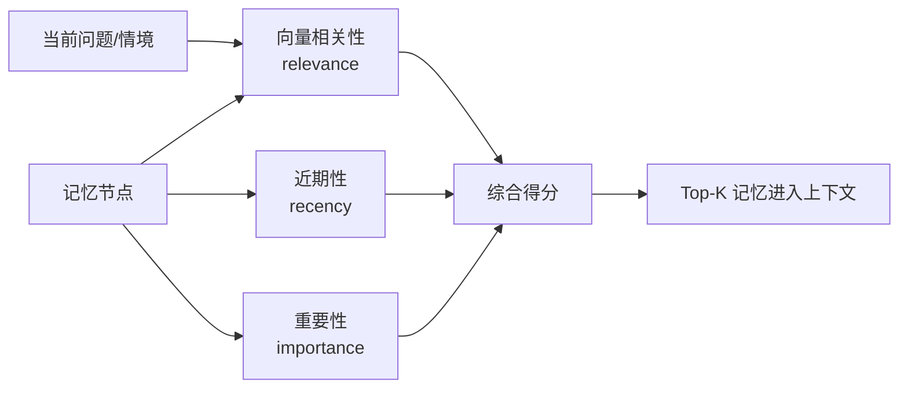

# 第 5 章：论文架构二：Retrieval

## 本章要解决的问题

上一章讲了 memory stream。智能体需要保存自己的经验流，因为没有过去，就没有连续生活。

但保存记忆只是第一步。

真正做决定时，智能体不可能把全部记忆都塞进 prompt。记忆越多，问题越明显：

- 上下文窗口有限。
- 无关记忆会干扰判断。
- 相似记忆会互相混淆。
- 重要信息可能被日常琐事淹没。
- 检索不到关键记忆会导致行为断裂。

因此，本章要回答的问题是：

> 当智能体拥有大量记忆时，它到底应该想起哪几条？

这就是 retrieval 的问题。

Generative Agents 论文的 retrieval 设计非常关键。它没有只使用简单的关键词匹配或向量相似度，而是组合了三个因素：

- recency：近期性。
- importance：重要性。
- relevance：相关性。

这三个因素共同决定哪些记忆会进入当前推理上下文。

## 5.1 为什么不能读取全部记忆

一种直觉做法是：既然记忆很重要，那就把所有记忆都放进 prompt。

这在小规模测试中似乎可行，但很快会失败。

第一，上下文空间有限。

一个智能体一天可能产生几十到几百条记忆。25 个智能体运行两天，整个小镇会产生大量事件、对话和反思。即使只看单个角色，全部记忆也不可能无限塞进模型上下文。

第二，信息过多会降低判断质量。

人做决定时，不会同时回忆过去所有细节。相反，人会根据当前情境想起少量相关经历。如果把无关记忆全部给模型，模型可能抓错重点。

第三，日常琐事会淹没关键事件。

角色每天会起床、吃饭、移动、使用对象。这些事件数量多，但多数不重要。如果不筛选，重要事件例如“被邀请参加派对”或“听说山姆竞选市长”可能被大量日常记录稀释。

第四，记忆之间可能互相矛盾。

如果上下文中同时出现多条时间、地点或态度不一致的记忆，模型可能混淆，甚至生成错误行为。

所以，retrieval 的目标不是“找出所有可能相关的记忆”，而是“为当前决策选择最合适的一小组记忆”。

这和人类记忆更接近。我们并不是完整读取自己的过去，而是在具体情境中想起少量有用片段。

## 5.2 Retrieval 的三个维度

论文提出，记忆检索应该综合三个维度：近期性、重要性和相关性。

这三个维度各自解决一个问题。

### 近期性：最近发生的更容易被想起

近期性对应 recency。

刚刚发生过的事情，通常更容易影响当前行动。

例如，伊莎贝拉五分钟前邀请阿伊莎参加派对，那么阿伊莎接下来遇到别人时，很可能想起这件事。相反，如果这个邀请发生在很久以前，除非它特别重要，否则当前影响可能较弱。

近期性不是绝对标准。最近发生的不一定重要，但它是检索时不能忽略的因素。

在工程实现中，近期性通常需要依赖时间戳。GenerativeAgentsCN 中的 `Concept` 有 `access` 字段，表示最近访问时间。`AssociateRetriever` 会根据访问顺序计算 recency score。

### 重要性：重要事件更值得进入上下文

重要性对应 importance。

有些事件虽然不近，但仍然重要。例如：

- 山姆打算竞选市长。
- 伊莎贝拉计划举办情人节派对。
- 汤姆不喜欢山姆。
- 克劳斯和玛丽亚发现彼此有共同兴趣。

这些信息应该比“看见一个空椅子”更容易被检索。

论文中，importance 由大语言模型打分。GenerativeAgentsCN 使用 `poignancy` 表示这个分数。事件和对话分别通过 `poignancy_event.txt` 和 `poignancy_chat.txt` 评分。

重要性还有另一个作用：触发反思。多个高重要性事件累积后，智能体会进入 reflection 阶段，把碎片经验总结成高层想法。

### 相关性：和当前问题有关的记忆更应该被想起

相关性对应 relevance。

当前问题不同，应该检索的记忆也不同。

如果伊莎贝拉正在决定是否和亚当聊天，相关记忆可能是：

- 亚当最近在写书。
- 亚当之前婉拒过长时间活动。
- 亚当常在咖啡馆工作。

如果伊莎贝拉正在准备派对，相关记忆可能是：

- 派对时间地点。
- 谁已经接受邀请。
- 谁能帮忙布置。

同一个角色，不同情境，需要想起不同记忆。

相关性通常通过 embedding 相似度实现。把当前查询和记忆文本都映射到向量空间，计算语义相似度。GenerativeAgentsCN 中，这部分由 LlamaIndex 和 embedding provider 完成。

[图 5-1：Recency、Importance、Relevance 三因素检索模型]



## 5.3 为什么三者缺一不可

如果只看相关性，会发生什么？

系统可能总是找出语义最相似的记忆，却忽略时间和重要性。例如，角色现在问“咖啡馆有什么活动”，向量检索可能找出很多关于咖啡馆的日常记忆，却不一定优先找出今天下午的派对。

如果只看近期性，会发生什么？

系统会被刚刚发生的小事牵着走。例如角色刚看见一个对象空闲，系统就把它当成主要上下文，忽略了更重要的竞选或派对。

如果只看重要性，会发生什么？

系统会反复想起人生大事，却无法处理当前具体场景。例如山姆一直想起竞选，但忘记眼前的人正在问他咖啡口味。

可信行为需要三者平衡。

一个人当前会想起什么，通常同时受这三个因素影响：

- 最近发生过。
- 对我重要。
- 和眼前情境有关。

论文的 retrieval 设计就是在模拟这种“情境化回忆”。

这也是它比简单向量搜索更适合生成式智能体的原因。

## 5.4 Retrieval 如何影响行为

检索结果会影响智能体的多个环节。

第一，影响计划。

如果一个角色在生成今天计划时检索到昨天的重要记忆，它可能更新自己的当前状态。例如昨天被邀请参加活动，今天的日程可能为活动留出时间。

第二，影响对话。

对话不应该只基于眼前状态。两个熟人见面时，过去的交流会影响话题。如果检索到上次对话，角色可能自然接上之前的话题；如果检索不到，对话就会像第一次见面。

第三，影响反应。

看到某个人时，系统会检索与这个人相关的事件和想法。过去关系越重要，当前互动越可能发生。

第四，影响反思。

Reflection 不是对全部记忆做总结，而是先生成问题，再根据问题检索相关记忆。检索质量直接决定反思质量。

第五，影响社会传播。

一个角色听说派对后，后续是否提到派对，取决于派对记忆是否在合适情境下被检索出来。如果检索失败，信息传播链就会断。

因此，retrieval 不是辅助模块，而是智能体行为的入口之一。

## 5.5 一个派对邀请的检索例子

来看一个更具体的例子。

假设阿伊莎上午遇到伊莎贝拉。伊莎贝拉邀请她参加下午 5 点的情人节派对。这个对话被总结后写入阿伊莎的记忆。

下午，阿伊莎在图书馆遇到克劳斯。她是否会提到派对，取决于多个因素。

近期性：

如果邀请刚发生不久，派对记忆更容易被想起。

重要性：

如果对话中明确说这是一次特别活动，或者阿伊莎表示很感兴趣，记忆重要性会更高。

相关性：

如果阿伊莎和克劳斯正在聊今天晚上的安排、文学分享或社交活动，派对记忆更相关。如果他们正在讨论论文方法论，派对记忆可能不被检索。

这三个因素共同决定对话走向。

如果派对记忆被检索出来，阿伊莎可能说：

```text
对了，伊莎贝拉下午在霍布斯咖啡馆办情人节派对，我可能会去，还想带一些文学故事分享。
```

如果没有被检索出来，她可能完全不提这件事。

这就是检索对社会传播的影响。

## 5.6 一个竞选话题的检索例子

再看山姆竞选镇长。

山姆的竞选意图存在于他的当前状态中，也可能通过对话写入其他角色记忆。

当汤姆遇到别人时，是否会提到山姆，取决于检索结果。

相关记忆可能包括：

- 汤姆对地方市长选举感兴趣。
- 汤姆不喜欢山姆。
- 山姆正在竞选地方市长。
- 汤姆关心商店经营和社区服务。

如果这些记忆被检索出来，汤姆可能不会简单说“山姆要竞选”，而是会带着态度：

```text
我看到候选人都在谈社区服务，这对商店也许有好处。不过我对山姆这个人还是不太感冒。
```

这里发生了两件事。

第一，事实被检索出来：山姆竞选。

第二，态度也被检索出来：汤姆不喜欢山姆。

可信行为依赖二者同时存在。如果系统只记得事实，汤姆会变得中性；如果只记得态度，却忘记选举事实，对话也会失去上下文。

这说明 retrieval 不只是找事实，也是在找角色立场。

## 5.7 GenerativeAgentsCN 中的 Retrieval

GenerativeAgentsCN 的检索系统主要位于：

```text
generative_agents/modules/memory/associate.py
generative_agents/modules/storage/index.py
```

核心类是：

```text
Associate
AssociateRetriever
LlamaIndex
```

`Associate` 管理角色记忆。它维护三类记忆列表：

- `event`
- `thought`
- `chat`

这些列表保存的是节点 ID。具体文本和 metadata 保存在 LlamaIndex 的 docstore 中。

当系统需要检索时，`Associate` 会调用 `LlamaIndex.retrieve()`。如果是 focus 检索，则会使用 `AssociateRetriever` 对结果进行重新排序。

`AssociateRetriever` 的关键逻辑正好对应论文中的三因素检索：

- 根据访问时间计算 recency。
- 使用向量检索分数作为 relevance。
- 使用 metadata 中的 `poignancy` 作为 importance。
- 将三项分数归一化后加权合成 final score。
- 根据 final score 重新排序。

这就是论文 retrieval 思想在当前项目中的直接落地。

后面第 15 章我们会逐行读 `AssociateRetriever._retrieve()`，看它如何实现这些分数计算。

[图 5-2：GenerativeAgentsCN 中 AssociateRetriever 的检索流程]

## 5.8 Focus：检索不是凭空发生的

检索需要问题。

如果没有当前问题，系统不知道该找什么。论文中的 retrieval 通常围绕当前情境、对话对象、计划目标或反思问题展开。

GenerativeAgentsCN 中也有类似设计。

例如在 `Agent.make_schedule()` 中，如果角色有已有记忆，系统会构造 focus：

```text
某人在某日的计划。
某人生活中重要的近期事件。
```

然后调用 `retrieve_focus()` 找相关记忆，用于更新 `currently` 和生成新一天计划。

在 `_reaction()` 中，如果角色感知到另一个 Agent，会通过 `get_relation()` 检索和对方相关的事件、想法和对话。

在 `reflect()` 中，系统先通过 `reflect_focus` 生成高层问题，再根据这些问题检索记忆，最后生成 insight。

这说明 retrieval 不是孤立动作。它总是由某个认知任务触发：

- 我要计划今天。
- 我要和这个人聊天。
- 我要判断是否等待。
- 我要反思近期经历。
- 我要更新当前状态。

同一批 memory stream，会因为 focus 不同而被不同方式地调用。

## 5.9 检索失败会造成什么后果

检索系统一旦失败，行为就会断裂。

第一，角色会忘记承诺。

如果阿伊莎接受派对邀请，但后续没有检索到这条记忆，她可能不会到场，也不会再提起。

第二，角色会重复自我介绍。

如果两个人第二次见面时没有检索到上次对话，他们可能又从“你好，你最近在忙什么”开始，像第一次见面。

第三，角色会忽略关系。

汤姆如果没有检索到“不喜欢山姆”，讨论选举时可能变得过度友好。

第四，反思会变浅。

如果 reflection 检索不到关键证据，它生成的 insight 会泛泛而谈，甚至偏离实际。

第五，社会传播会中断。

信息扩散依赖“听到之后还能想起来”。检索失败会让传播链断在某个角色身上。

因此，评价智能体系统时，不能只看有没有存记忆，还要看关键时刻有没有检索到正确记忆。

这也是第四部分实验要统计的内容之一。例如在派对实验中，我们不仅要看伊莎贝拉有没有邀请别人，还要看被邀请者后续是否提到派对、是否调整计划、是否到场。

## 5.10 检索和幻觉的关系

检索还有一个重要作用：降低幻觉。

如果模型在没有相关记忆的情况下生成回答，它可能凭常识补全内容。这种补全在普通聊天中有时看起来合理，但在智能体仿真中可能造成严重问题。

例如：

- 模型可能说“我们上次聊过派对”，但事实上没有。
- 模型可能说“你答应过会参加”，但对方没有答应。
- 模型可能把派对时间说错。
- 模型可能把竞选候选人记错。

如果检索系统提供了准确记忆，模型更有机会基于真实上下文生成回答。

但检索也不能完全消除幻觉。

一方面，检索可能召回错误或无关记忆。

另一方面，记忆本身可能来自模型生成的摘要，如果摘要已经出错，后续检索只会传播错误。

所以 retrieval 既是防幻觉机制，也是潜在风险源。

后面第五部分讨论记忆冲突检测和事实保真度时，会继续回到这个问题。

## 5.11 检索权重是一种系统价值判断

Recency、importance、relevance 的权重不是纯技术细节，它们会改变角色行为风格。

如果提高 recency 权重，角色会更受近期事件影响。它会显得反应灵敏，但也可能健忘，容易被刚发生的小事带跑。

如果提高 importance 权重，角色会更关注重大事件。它可能更稳定，但也可能反复提起大事，忽略当前场景。

如果提高 relevance 权重，角色会更贴合当前话题。它的回答可能更准确，但有时会错过长期重要背景。

这说明检索权重本质上是一种行为设计。

不同应用可能需要不同权重。

游戏 NPC 可能希望更重视当前场景。

心理陪伴类智能体可能希望更重视长期重要记忆。

社会仿真实验可能希望平衡近期传播和重要公共事件。

GenerativeAgentsCN 在 `Associate` 中将这些权重作为参数：

```text
recency_decay
recency_weight
relevance_weight
importance_weight
```

这为后续实验提供了调参空间。我们可以观察不同权重下，派对传播、选举讨论和关系形成会如何变化。

## 5.12 本章小结

本章讲清了 Retrieval 的作用：

1. 保存全部记忆不等于能正确使用记忆。
2. 智能体做决定时必须从 memory stream 中选择少量相关记忆。
3. Generative Agents 使用 recency、importance、relevance 三个维度组合检索。
4. 近期性保证智能体关注刚发生的事。
5. 重要性保证重大事件不会被日常琐事淹没。
6. 相关性保证检索结果服务当前任务。
7. Retrieval 影响计划、对话、反应、反思和社会传播。
8. GenerativeAgentsCN 中的 `AssociateRetriever` 对应论文三因素检索。
9. 检索失败会导致忘记承诺、重复寒暄、忽略关系、反思变浅和传播中断。
10. 检索权重会改变智能体行为风格。

下一章我们进入 Reflection。检索可以让智能体想起过去，但只想起过去还不够。智能体还需要从碎片经历中总结出高层认知。

## 参考资料

- Joon Sung Park, Joseph C. O'Brien, Carrie J. Cai, Meredith Ringel Morris, Percy Liang, Michael S. Bernstein. *Generative Agents: Interactive Simulacra of Human Behavior*. arXiv: https://arxiv.org/abs/2304.03442
- ar5iv full text: https://ar5iv.labs.arxiv.org/html/2304.03442
- GenerativeAgentsCN local source: `generative_agents/modules/memory/associate.py`, `generative_agents/modules/storage/index.py`
