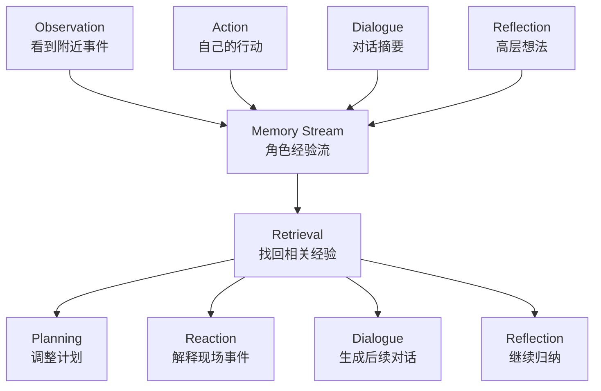
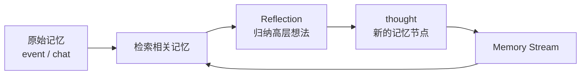

# 第 5 章 论文架构二：Memory Stream

## 核心问题

Persona 解决“这个角色是谁”，Memory Stream 解决“这个角色经历过什么”。没有 Memory Stream，智能体每天都会像重新出生。它可以在当前对话里看起来很聪明，却无法真正延续生活：

- 刚答应参加派对，下一轮就忘记。
- 刚和朋友聊完论文，下次见面又像第一次认识。
- 看到浴室有人使用，却不知道自己应该等待。
- 经历了很多事件，却无法从这些事件中形成稳定判断。

Generative Agents 的关键不只是让 LLM 会聊天，而是让角色在一个世界中持续生活。Memory Stream 就是这段生活的经验底账。

## 5.1 聊天历史不够

很多 LLM 角色应用会从两件事开始：写一段人设，再把最近聊天记录塞进上下文。这两件事都有用，但都不够。人设能说明角色是谁。例如：

```text
你是伊莎贝拉，34 岁，友好、外向，是霍布斯咖啡馆老板。
```

这能让模型在当前回答中带有角色风格，却不能保存刚刚发生过什么。伊莎贝拉知道自己是咖啡馆老板，但不知道今天上午已经邀请过谁。聊天历史能延续最近几轮对话，却覆盖不了小镇生活。智能体的经历不只发生在聊天里，还发生在地图上、计划里、观察里和反思里。一个居民可能没有说话，但他看见了别人正在布置派对；一个居民可能没有参与谈话，但他注意到很多人都在讨论镇长选举。这些都不是聊天历史，却会影响后续行为。所以，Generative Agents 需要保存的是经验流，而不是对话流。

## 5.2 Memory Stream 保存什么

Memory Stream 是智能体自己的长期经验记录。它持续保存角色观察到、做过、聊过、想到的内容，并让这些内容在未来能被检索和复用。论文中的 Memory Stream 至少覆盖四类经验。

| 经验类型 | 例子 | 为什么要保存 |
| --- | --- | --- |
| Observation | 玛丽亚看见伊莎贝拉正在布置霍布斯咖啡馆。 | 角色没有说话，也可能获得会影响未来的信息。 |
| Action | 伊莎贝拉正在准备情人节派对的饮品。 | 角色自己的行动会影响后续计划和别人对她的观察。 |
| Dialogue | 伊莎贝拉邀请阿伊莎参加 2 月 14 日下午 5 点的派对。 | 对话是关系和信息传播的主要载体。 |
| Reflection | 克劳斯认为玛丽亚喜欢探索新想法，未来可以继续交流。 | 反思把零散经验提升成更稳定的判断。 |

*表 5-1：Memory Stream 保存的经验类型。它不是单纯聊天记录，而是角色生活中可被未来行为使用的经验集合。*



*图 5-1：经验进入 Memory Stream 后，会继续参与检索、计划、反应、对话和反思。记忆不是档案柜，而是行为生成的材料库。*

## 5.3 记忆不是聊天历史，也不是系统日志

Memory Stream 很容易被误解成两种东西：聊天历史，或者系统日志。聊天历史只记录对话。系统日志主要服务开发者排查问题。Memory Stream 记录的是角色自己的经验，服务的是未来行为。

| 对比维度 | 聊天历史 | 系统日志 | Memory Stream |
| --- | --- | --- | --- |
| 记录对象 | 最近几轮对话。 | 函数调用、文件写入、异常、接口响应等程序事件。 | 观察、行动、对话、反思等角色经验。 |
| 使用者 | 模型当前上下文或用户。 | 开发者。 | 智能体后续的检索、计划、对话和反思。 |
| 角色视角 | 弱，通常只是会话上下文。 | 弱，偏工程事实。 | 强，同一事件会进入特定角色的经验。 |
| 时间要求 | 主要依赖上下文顺序。 | 有时间戳，但不一定影响智能体。 | 时间直接影响近期性、过期判断和生活连续性。 |
| 未来影响 | 受上下文窗口限制。 | 通常不直接影响角色行为。 | 直接影响后续行为生成。 |
| 核心价值 | 保持对话连贯。 | 调试和追溯。 | 让角色拥有过去。 |

*表 5-2：聊天历史、系统日志和 Memory Stream 的区别。Memory Stream 的重点不是“记录更多文本”，而是让过去能重新参与未来决策。*这一区分很重要。看到“某个 JSON 文件写入成功”对开发者有用，对伊莎贝拉没有意义；看到“阿伊莎答应参加派对”对伊莎贝拉有意义，应该进入她自己的经验流。

## 5.4 系统中如何定义一条记忆

在项目里，一条记忆不是一段裸文本。它先来自世界事件，再被转换成可检索的记忆节点。读者在源码章节会看到完整实现，但在这里需要先把对象模型看清楚：Memory Stream 的基本链路是 `Event -> Concept -> Associate -> LlamaIndex -> Retrieval`。

| 系统模块 | 接收或生成什么 | 对 Memory Stream 的作用 |
| --- | --- | --- |
| `Maze` / `Tile` | 地图上的当前事件、对象地址、附近角色状态。 | 提供智能体能观察到的世界事实。 |
| `Event` | `subject`、`predicate`、`object`、`describe`、`address`、`emoji`。 | 把世界中发生的事表示成一个可描述事件。 |
| `Agent.percept()` | 当前感知范围内的 `Event`。 | 过滤附近事件，避免把已经记过的近期事件重复写入。 |
| `Agent._add_concept()` | 事件类型和事件内容。 | 判断事件是 `event` 还是 `chat`，并调用重要性评分。 |
| `Associate.add_node()` | 事件、类型、重要性、创建时间、过期时间。 | 把事件写成长期记忆节点。 |
| `Concept` | LlamaIndex 节点文本和 metadata。 | 让记忆以统一对象进入检索、展示和反思。 |
| `LlamaIndex` | 文本、metadata、embedding。 | 建立语义索引，让后续能按相关性检索。 |
| `AssociateRetriever` | 查询文本和记忆节点。 | 按近期性、相关性、重要性重新排序。 |

*表 5-3：定义一条记忆涉及的系统模块。Memory Stream 是世界事件、角色感知、重要性评分、向量索引和检索排序共同组成的机制。*

```mermaid
flowchart LR
    Tile["Maze / Tile<br/>地图上的事件"] --> Event["Event<br/>世界事件表示"]
    Event --> Percept["Agent.percept()<br/>感知与去重"]
    Percept --> AddConcept["Agent._add_concept()<br/>判断类型并评分"]
    AddConcept --> Associate["Associate.add_node()<br/>写入角色记忆"]
    Associate --> Concept["Concept<br/>记忆节点对象"]
    Concept --> Index["LlamaIndex<br/>文本与 metadata 索引"]
    Index --> Retrieval["AssociateRetriever<br/>后续检索排序"]
    Retrieval --> Behavior["计划 / 对话 / 反思"]
```



*图 5-2：项目中一条记忆进入 Memory Stream 的路径。世界事件只有写成 Concept 并进入索引后，才会成为未来行为可使用的经验。*`Event` 是进入记忆前的事件表示。

| `Event` 字段 | 中文意思 | 对记忆的影响 |
| --- | --- | --- |
| `subject` | 谁或什么对象产生事件。 | 决定事件主语，例如伊莎贝拉、山姆、咖啡馆柜台。 |
| `predicate` | 事件关系或动作。 | 决定事件类型，例如“此时”“对话”。 |
| `object` | 动作对象或状态。 | 决定事件指向，例如“空闲”“阿伊莎”。 |
| `describe` | 自然语言描述。 | 优先作为记忆文本，方便 LLM 直接理解。 |
| `address` | 事件发生的空间地址。 | 把记忆绑定到地图位置，支持空间 grounding。 |
| `emoji` | 前端展示符号。 | 主要服务回放和展示，不是记忆推理的核心。 |

*表 5-4：`Event` 字段含义。`Event` 负责描述“世界发生了什么”。*

教学化展开后，一个事件可以长这样：

```json
{
  "subject": "伊莎贝拉",
  "predicate": "此时",
  "object": "准备情人节派对的饮品",
  "describe": "伊莎贝拉正在霍布斯咖啡馆准备情人节派对的饮品",
  "address": ["Smallville", "霍布斯咖啡馆", "柜台"],
  "emoji": "☕"
}
```

`Concept` 是进入 Memory Stream 后的记忆节点。它会把事件文本、类型、时间和重要性一起保存。

| `Concept` 字段 | 中文意思 | 对后续行为的影响 |
| --- | --- | --- |
| `node_id` | 记忆节点 ID。 | 让系统能在索引中找到这条记忆。 |
| `node_type` | 记忆类型，主要是 `event`、`chat`、`thought`。 | 决定它被放进哪一类记忆列表，也影响后续检索入口。 |
| `describe` / `text` | 记忆的自然语言文本。 | 这是 LLM 未来真正读到的内容。 |
| `subject`、`predicate`、`object` | 从 `Event` 带来的事件三元信息。 | 保留基本结构，方便判断事件主体和类型。 |
| `address` | 事件地址，保存为冒号连接的空间路径。 | 保留事件发生地点。 |
| `poignancy` | 重要性评分。 | 影响检索排序，也会累积触发反思。 |
| `create` | 创建时间。 | 说明记忆什么时候发生。 |
| `expire` | 过期时间。 | 让过期记忆可以被清理，默认约 30 天。 |
| `access` | 最近访问时间。 | 影响 recency，刚被想起的记忆会更新访问时间。 |

*表 5-5：`Concept` 字段含义。`Concept` 负责描述“这件事如何成为角色自己的记忆”。*

同一个事件写入 Memory Stream 后，可以理解成下面这样的节点：

```json
{
  "node_id": "node_42",
  "node_type": "event",
  "text": "伊莎贝拉正在霍布斯咖啡馆准备情人节派对的饮品",
  "metadata": {
    "subject": "伊莎贝拉",
    "predicate": "此时",
    "object": "准备情人节派对的饮品",
    "address": "Smallville:霍布斯咖啡馆:柜台",
    "poignancy": 6,
    "create": "20240213-09:30:00",
    "expire": "20240314-09:30:00",
    "access": "20240213-09:30:00"
  }
}
```

这段示例说明了 Memory Stream 的工程本质：自然语言文本负责让 LLM 读懂，metadata 负责让系统检索、排序、清理和分类。

## 5.5 自然语言作为统一记忆表示

Generative Agents 的一个关键选择是：记忆用自然语言表达。结构化数据当然清晰。例如：

```json
{
  "subject": "伊莎贝拉",
  "action": "邀请",
  "object": "阿伊莎",
  "event": "情人节派对",
  "time": "2024-02-13 09:30"
}
```

但复杂生活很难只靠固定字段表达。比如“阿伊莎答应参加派对，但她想知道是否可以带一本莎士比亚戏剧选段来分享”，如果强行拆字段，信息会变得生硬。自然语言能保留情境：

```text
阿伊莎答应参加伊莎贝拉在霍布斯咖啡馆举办的情人节派对，并提到自己可能会带一段莎士比亚戏剧选段与大家分享。
```

这样的记忆可以直接进入 prompt，让 LLM 根据上下文理解它的含义。自然语言表示也带来代价。

| 优点 | 代价 | 本书后续会如何处理 |
| --- | --- | --- |
| 容易表达复杂情境。 | 内容可能模糊。 | 第 30 章讨论长期记忆治理。 |
| LLM 可以直接读取。 | 摘要可能引入幻觉。 | 第 30 章讨论记忆校验和冲突处理。 |
| 可统一 observation、chat、thought。 | 不如结构化字段容易精确查询。 | 第 38 章讨论结构化关系记忆升级。 |
| 方便放入 prompt 推理。 | 多轮总结后可能失真。 | 第 31 章讨论反思系统升级。 |

*表 5-6：自然语言记忆的优点和代价。Generative Agents 选择自然语言，是为了让 LLM 能直接使用经验；它不是长期记忆治理的终点。*

## 5.6 时间、重要性和访问记录

一条记忆只保存文本还不够。系统还需要知道它什么时候发生、是否过期、最近有没有被想起、重要不重要。`Concept` 中的 `create`、`expire`、`access` 分别处理这三件事：

- `create`：这条记忆什么时候创建。
- `expire`：这条记忆什么时候过期。
- `access`：这条记忆最近一次什么时候被检索到。

时间让“最近发生的事”更容易影响当前行为。昨天被邀请参加派对，比一个月前听过的闲聊更可能改变今天的计划。重要性解决另一个问题：近不等于重要。看到一张椅子空着很近，但不一定重要；听说朋友准备竞选市长可能不是刚刚发生，却会长期影响对话和关系判断。项目里用 `poignancy` 承接论文中的 importance score。它有两个评分 prompt。

| Prompt | 评分对象 | 用途 |
| --- | --- | --- |
| `poignancy_event.txt` | 普通事件。 | 给观察和行动事件打 1 到 10 分。 |
| `poignancy_chat.txt` | 对话事件。 | 给完整对话摘要打 1 到 10 分。 |

*表 5-7：重要性评分 prompt。不同类型的经验使用不同评分提示词，但输出都进入 `Concept.poignancy`。*

事件重要性评分的完整 prompt 模板如下：

```text
${base_desc}

在1到10的范围内评分，评分原则：
1代表极其平常，例如刷牙、整理床铺等普通事件；
10代表极其特殊或强烈，令人印象深刻，例如分手、大学录取等特殊事件。
每个事件只能用1到10的整数表示。例如：
事件：刷牙。评分：1
事件：整理床铺。评分：1
事件：分手。评分：10
事件：大学录取。评分：10

以下是 ${agent} 需要评分的一个完整事件：
"""
${event}
"""
评分：<分数>

根据完整事件填写<分数>。
格式要求：只在1到10范围内输出1个数字，不要输出数字以外的任何内容。
```

完整的英文对照如下：

```text
${base_desc}

Rate the event on a scale from 1 to 10:
1 means extremely ordinary, such as brushing teeth or making the bed.
10 means extremely special or intense, and therefore memorable, such as a breakup or college admission.
Each event must be represented by an integer from 1 to 10. For example:
Event: brushing teeth. Rating: 1
Event: making the bed. Rating: 1
Event: breakup. Rating: 10
Event: college admission. Rating: 10

Here is a complete event that ${agent} needs to rate:
"""
${event}
"""
Rating: <score>

Fill in <score> based on the complete event.
Format requirement: output only one number from 1 to 10. Do not output anything other than the number.
```

对话重要性评分使用另一份完整 prompt：

```text
${base_desc}

在1到10的范围内评分，评分原则：
1代表极其平常，例如早上的日常问候；
10代表极其特殊或强烈，令人印象深刻，例如关于分手、争吵的对话。
每个对话只能用1到10的整数表示。例如：
对话：早上的日常问候。评分：1
对话：关于分手、争吵的对话。评分：10

以下是 ${agent} 需要评分的一场完整对话：
"""
${event}
"""
评分：<分数>

根据完整事件填写<分数>。
格式要求：只在1到10范围内输出1个数字，不要输出数字以外的任何内容。
```

完整的英文对照如下：

```text
${base_desc}

Rate the conversation on a scale from 1 to 10:
1 means extremely ordinary, such as a routine morning greeting.
10 means extremely special or intense, and therefore memorable, such as a conversation about a breakup or an argument.
Each conversation must be represented by an integer from 1 to 10. For example:
Conversation: routine morning greeting. Rating: 1
Conversation: a conversation about a breakup or an argument. Rating: 10

Here is a complete conversation that ${agent} needs to rate:
"""
${event}
"""
Rating: <score>

Fill in <score> based on the complete event.
Format requirement: output only one number from 1 to 10. Do not output anything other than the number.
```

项目代码还用 Pydantic 约束返回值：

| Prompt | 返回字段 | 类型 | 含义 |
| --- | --- | --- | --- |
| `poignancy_event.txt` | `res` | `int` | 事件的情感强度评分，范围 1 到 10。 |
| `poignancy_chat.txt` | `res` | `int` | 对话的情感强度评分，范围 1 到 10。 |

如果伊莎贝拉听到山姆准备竞选市长，填充后的关键部分可以理解为：

```text
以下是 伊莎贝拉 需要评分的一个完整事件：
"""
山姆告诉伊莎贝拉，他准备参加下个月的地方市长选举。
"""
评分：7
```

评分会写入 `Concept.poignancy`，并累加到角色状态 `status["poignancy"]`。当累计值超过阈值时，角色会触发 Reflection。重要性因此有两个作用：参与检索排序，也推动角色把零散经历总结成高层想法。

## 5.7 Memory Stream 如何支持未来行为

Memory Stream 本身只是存储。它要发挥作用，必须被检索系统带回到 prompt 里。假设山姆正在和约翰聊天。系统不应该把山姆所有记忆都塞进上下文，而应该找出当前相关的几条经验：

- 山姆正在竞选地方市长。
- 约翰最近在询问谁会参加选举。
- 山姆和其他居民讨论过社区安全。
- 约翰是药店店主，关心居民服务。

这些记忆进入 prompt 后，对话才会像两个小镇居民之间的真实交流，而不是通用聊天。Memory Stream 至少影响四类行为。

| 行为 | Memory Stream 提供什么 | 如果没有记忆会怎样 |
| --- | --- | --- |
| 计划 | 昨天发生的事、未完成的邀请、近期目标。 | 日程每天随机生成，角色无法延续承诺。 |
| 对话 | 共同经历、关系背景、刚传播过的信息。 | 角色反复寒暄，像第一次见面。 |
| 反应 | 现场事件和过去经验之间的联系。 | 角色看见事情也不知道是否该回应。 |
| 反思 | 多条相关记忆。 | 角色无法从经历中形成稳定判断。 |

*表 5-8：Memory Stream 对未来行为的影响。过去不是被保存起来就结束，而是会重新进入计划、对话、反应和反思。*

## 5.8 反思会写回 Memory Stream

Memory Stream 保存原始经验，但原始经验通常是碎片。例如：

- 克劳斯在咖啡馆遇到玛丽亚。
- 玛丽亚提到自己在做 Twitch 游戏直播。
- 克劳斯提到自己研究社会议题。
- 两人都对探索新想法感兴趣。

这些都是独立记忆。如果没有反思，系统只能在后续检索时碰巧找到它们。Reflection 会把碎片提升成高层认知：

```text
克劳斯发现玛丽亚虽然专业不同，但同样喜欢探索新想法，未来可以继续和她交流。
```

这个 insight 会再次进入 Memory Stream，成为 `thought`。下次克劳斯遇到玛丽亚时，系统更容易检索到这个高层关系认知，而不必每次重新从多条事件中推理。这就是 Memory Stream 和 Reflection 的闭环：



*图 5-3：Reflection 会把高层想法写回 Memory Stream。记忆流不只保存低层事件，也会逐渐保存角色对自己和他人的理解。*

## 5.9 Memory Stream 的局限

Memory Stream 很重要，但它不是万能方案。

| 局限 | 表现 | 后续升级方向 |
| --- | --- | --- |
| 记忆膨胀 | 角色运行越久，事件和对话越多，检索噪声增加。 | 分层记忆、摘要压缩、生命周期管理。 |
| 记忆重复 | 每天吃饭、上班、回家会产生大量相似记忆。 | 去重、聚合、习惯建模。 |
| 记忆错误 | LLM 可能把没有发生过的内容写进摘要。 | 证据绑定、冲突检测、可追溯记忆。 |
| 记忆冲突 | 派对时间可能被不同对话说成 5 点或 7 点。 | 事实校验、版本管理、置信度。 |
| 关系表达不足 | “汤姆不喜欢山姆”只靠文本记录，不够稳定。 | 关系图记忆、信任度和亲密度建模。 |

*表 5-9：Memory Stream 的局限。它解决了“角色要有过去”，但还没有完全解决“过去必须可靠、可控、可扩展”。*这些局限不会削弱 Memory Stream 的价值。相反，它们给出了后续三年智能体记忆系统继续演进的方向。第五部分讨论 MemGPT、Mem0、长期记忆治理和关系图记忆时，会回到这些问题。

## 5.10 本章小结

Memory Stream 是 Persona 之后的第二层架构。Persona 给角色身份，Memory Stream 给角色过去。两者合在一起，角色才不只是“会说某种话”，而是能在小镇中延续经历、关系和计划。

| 本章内容 | 核心结论 |
| --- | --- |
| 聊天历史不够 | 角色生活不只发生在对话里，还发生在观察、行动、地图和反思里。 |
| 经验类型 | Memory Stream 保存 observation、action、dialogue 和 reflection。 |
| 与日志的区别 | 系统日志服务开发者，Memory Stream 服务角色未来行为。 |
| 记忆对象定义 | 项目中一条记忆会从 `Event` 进入 `Concept`，再写入 `Associate` 和 LlamaIndex。 |
| 字段含义 | `describe` 让 LLM 读懂，`metadata` 让系统检索、分类、排序和清理。 |
| 自然语言表示 | 自然语言让经验可以直接进入 prompt，但也带来模糊、幻觉和冲突风险。 |
| 时间与重要性 | `create`、`expire`、`access` 和 `poignancy` 共同决定记忆如何被保留和想起。 |
| 反思写回 | Reflection 会生成 `thought`，再写回 Memory Stream。 |
| 系统边界 | 记忆膨胀、重复、错误、冲突和关系表达不足，是后续升级重点。 |

下一章进入 Retrieval。拥有记忆只是第一步；真正做决定时，智能体不能读取全部记忆，而必须从 Memory Stream 中找出当前最相关的内容。

## 参考资料

- Joon Sung Park, Joseph C. O'Brien, Carrie J. Cai, Meredith Ringel Morris, Percy Liang, Michael S. Bernstein. *Generative Agents: Interactive Simulacra of Human Behavior*. arXiv: https://arxiv.org/abs/2304.03442
- ar5iv full text: https://ar5iv.labs.arxiv.org/html/2304.03442
- Local source: `generative_agents/modules/memory/event.py`
- Local source: `generative_agents/modules/memory/associate.py`
- Local source: `generative_agents/modules/storage/index.py`
- Local source: `generative_agents/modules/agent.py`
- Local prompt: `generative_agents/data/prompts/poignancy_event.txt`
- Local prompt: `generative_agents/data/prompts/poignancy_chat.txt`
