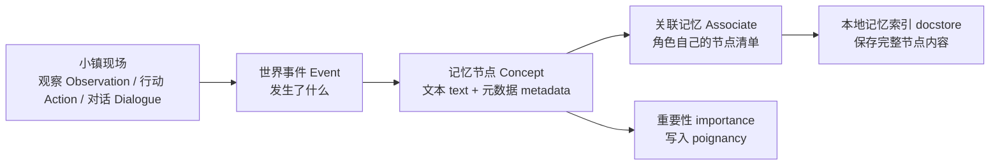

# 第 5 章 论文架构二：记忆流 Memory Stream

人物定义 Persona 给角色身份，记忆流 Memory Stream 给角色过去。没有记忆流 Memory Stream，智能体每天都会像重新出生：

- 刚答应参加派对，下一轮就忘记；
- 刚和朋友聊完论文，下次见面又像第一次认识；
- 经历了很多事件，却无法从这些事件中形成稳定判断。

生成式智能体 Generative Agents 的关键不只是让大语言模型 LLM 会聊天，而是让角色在同一个世界中持续生活。记忆流 Memory Stream 承接的就是这段生活的经验底账：发生过什么、对谁重要、以后还能不能被找回来。


*图 5-1：记忆流 Memory Stream 的系统入口。观察 Observation、行动 Action、对话 Dialogue 和反思 Reflection*

## 5.1 从一段真实经历开始：克劳斯 Klaus Mueller 的论文对话

先看一段小镇时间线。克劳斯 Klaus Mueller 正在写一篇关于`低收入社区中产阶级化影响`的研究论文，他在图书馆遇到阿伊莎 Ayesha Khan，并向她请教论文开头怎么写。

证据路径：`generative_agents\results\compressed\book-custom-discussion\simulation.md`

```text
# 20240213-10:20

## 活动记录：

### 克劳斯
位置：the Ville，奥克山学院，图书馆，图书馆桌子
活动：克劳斯向阿伊莎请教中产阶级化论文的写作开头，阿伊莎建议用调研中的真实场景或街巷改造前后对比来切入。

### 阿伊莎
位置：the Ville，奥克山学院，图书馆，书架
活动：老师讲解文学分析方法的理论框架

## 对话记录：

### 克劳斯 -> 阿伊莎 @ the Ville，奥克山学院，图书馆，图书馆桌子

`克劳斯`
> 阿伊莎老师，您刚才讲的写作技巧正好是我现在需要的——我正在搭建中产阶级化论文的框架，您觉得开头应该怎么切入比较吸引人？

`阿伊莎`
> 老师刚提到，好的开头可以用一个具体场景或细节切入，引发读者的代入感。你可以从你调研中遇到的一个真实案例开始——比如某条街巷在改造前后的对比画面，这样比直接下定义更容易抓住读者。
```

这段压缩结果 compressed result 只是阅读入口。它告诉人类“克劳斯 Klaus Mueller 和阿伊莎 Ayesha Khan 聊过什么”，但系统真正依赖的是后面的状态文件：这段经历会被写成聊天 chat 节点，挂到克劳斯 Klaus Mueller 和阿伊莎 Ayesha Khan 各自的关联记忆 Associate 中，再带着时间、地点、重要性 importance 和节点编号进入后续检索 Retrieval。

### 证据实验：book-custom-discussion

实验从 `20240213-08:00` 开始，推进到 `20240213-19:50`，参与角色包括克劳斯 Klaus Mueller、玛丽亚 Maria Lopez、阿伊莎 Ayesha Khan、沃尔夫冈 Wolfgang Schulz 和伊莎贝拉 Isabella Rodriguez。它同时留下压缩时间线、断点 checkpoint 和本地记忆索引 local memory index，适合观察一段经历如何从小镇现场进入记忆流 Memory Stream。

| 证据类型 | 证据路径 | 用途 |
| --- | --- | --- |
| 压缩结果 compressed result | `generative_agents\results\compressed\book-custom-discussion\simulation.md` | 先读剧情，确认小镇里发生过哪些活动和对话。 |
| 断点 checkpoint | `generative_agents\results\checkpoints\book-custom-discussion\simulate-20240213-1950.json` | 查看每个角色当前持有哪些 `event`、`chat`、`thought` 节点编号。 |
| 本地记忆索引 local memory index | `generative_agents\results\checkpoints\book-custom-discussion\storage\<角色>\associate\docstore.json` | 查看具体记忆节点 Concept 的文本 text 和元数据 metadata。 |

第 5 章只看记忆写入链路：


```mermaid
flowchart LR
    Scene["小镇现场<br/>观察 Observation / 行动 Action / 对话 Dialogue"] --> Event["世界事件 Event<br/>发生了什么"]
    Event --> Concept["记忆节点 Concept<br/>文本 text + 元数据 metadata"]
    Concept --> Associate["关联记忆 Associate<br/>角色自己的节点清单"]
    Associate --> Docstore["本地记忆索引 docstore<br/>保存完整节点内容"]
    Concept --> Importance["重要性 importance<br/>写入 poignancy"]
```

*图 5-2：第 5 章关注的记忆写入链路。它只覆盖“经历如何变成角色自己的记忆”，不覆盖检索 Retrieval、向量索引 LlamaIndex 和未来行为生成。*

## 5.2 聊天历史不够：过去必须成为状态

很多大语言模型 LLM 角色应用会从两件事开始：写一段人设，再把最近聊天记录塞进上下文 context。这两件事都有用，但都不够。

克劳斯 Klaus Mueller 刚向阿伊莎 Ayesha Khan 请教论文开头，不等于下一轮还能记住这个写作建议；玛丽亚 Maria Lopez 刚答应帮伊莎贝拉 Isabella Rodriguez 准备派对饮品和水果，也不等于这个承诺会自然进入后续日程。即时聊天只证明“话说过”，不证明“系统已经把这件事变成可回查状态”。

小镇中的经历也不只发生在聊天里。阿伊莎 Ayesha Khan 没有开口时，系统仍然记录她在图书馆挑选莎士比亚戏剧篇目；伊莎贝拉 Isabella Rodriguez 只是打开咖啡馆大门并开灯，这个动作也会成为小镇状态的一部分。这些都不是聊天历史，却会影响后续行为。

| 判定问题 | 聊天历史 | 记忆流 Memory Stream |
| --- | --- | --- |
| 保存范围 | 最近几轮对话。 | 观察 Observation、行动 Action、对话 Dialogue、想法 thought。 |
| 归属对象 | 一次会话或上下文 context。 | 某个具体智能体 agent。 |
| 保存位置 | 通常只在当前提示词 prompt 或会话缓存里。 | 进入关联记忆 Associate 和向量索引 LlamaIndex。 |
| 影响行为 | 受上下文窗口限制。 | 能被检索 Retrieval 找回，再进入日程、对话、反应和反思。 |
| 证据形态 | 对话文本。 | 记忆节点 Concept、元数据 metadata、断点 checkpoint、索引文件。 |

*表 5-1：聊天历史与记忆流 Memory Stream 的判定表。关键分界不是“有没有保存文本”，而是过去是否成为可检索、可排序、可回写的状态。*

## 5.3 记忆流 Memory Stream 保存什么

论文中，记忆流 Memory Stream 覆盖角色观察到、做过、聊过、想到的内容，如下表所示：

| 论文层经验 | 项目落地类型 | `book-custom-discussion` 案例 | 后续用途 |
| --- | --- | --- | --- |
| 观察 Observation | 事件 event | 阿伊莎 Ayesha Khan 在图书馆书架前选读莎士比亚戏剧篇目。 | 角色没有说话，也能获得会影响未来的信息。 |
| 行动 Action | 事件 event | 伊莎贝拉 Isabella Rodriguez 打开霍布斯咖啡馆大门并开灯。 | 自己的行动会影响后续计划，也会成为别人观察到的事件。 |
| 对话 Dialogue | 聊天 chat | 克劳斯 Klaus Mueller 向阿伊莎 Ayesha Khan 请教中产阶级化论文的写作开头。 | 对话是关系变化和信息传播的主要载体。 |
| 反思 Reflection | 想法 thought | 玛丽亚 Maria Lopez 记住明天下午参加情人节派对，并准备饮品和水果。 | 反思把零散经验提升成更稳定的判断。 |

*表 5-2：记忆流 Memory Stream 保存的经验类型。观察和行动最终以事件 event 进入系统，对话以聊天 chat 进入系统，反思结果以想法 thought 重新写回记忆流。*

## 5.4 一条记忆节点 Concept 长什么样

项目里，一条记忆不是一段裸文本。小镇现场先被表示成世界事件 Event，记录“谁、在哪里、处于什么状态”；随后转换成记忆节点 Concept，补上 `node_type`、`poignancy`、`create` 等元数据 metadata；最后落到某个角色自己的关联记忆 Associate 文件里。

世界事件 Event 的源码入口位于：

```text
generative_agents/modules/memory/event.py
```

它的字段很少，但这些字段决定了一条经验能不能被系统重新读出来：

| Event 属性 | 默认值 | 例值 | 读法 |
| --- | --- | --- | --- |
| `subject` | 无默认值，必须传入。 | `阿伊莎` | 事件主体 subject，表示这条事件记录的是谁或什么对象。 |
| `predicate` | `此时` | `此时` | 谓词 predicate，表示主体和宾语之间的关系；默认读作“此刻处于某种状态”。 |
| `object` | `空闲` | `选读今日要阅读的莎士比亚戏剧篇目` | 宾语 object，保存具体状态、动作内容、对话对象或计划时间。 |
| `_describe` | 空字符串。 | `克劳斯向阿伊莎请教...` | 自然语言描述 describe；非空时 `get_describe()` 优先使用它，空值时由 `subject + predicate/object` 拼出文本。 |
| `address` | 空列表 `[]`。 | `["the Ville", "奥克山学院", "图书馆", "图书馆桌子"]` | 空间地址 address，把事件绑定到世界、建筑、房间和设施。 |
| `emoji` | 空字符串。 | `💬` | 表情或前端展示标记 emoji，聊天事件会使用它，但本地记忆索引 local memory index 不依赖它。 |

克劳斯 Klaus Mueller 与阿伊莎 Ayesha Khan 的论文交流落盘后，会变成克劳斯 Klaus Mueller 记忆文件 `generative_agents\results\checkpoints\book-custom-discussion\storage\克劳斯\associate\docstore.json` 中的一条聊天 chat 节点。

```json
{
  "id_": "node_25",
  "text": "克劳斯向阿伊莎请教中产阶级化论文的写作开头，阿伊莎建议用调研中的真实场景或街巷改造前后对比来切入。",
  "metadata": {
    "node_type": "chat",
    "subject": "克劳斯",
    "predicate": "对话",
    "object": "阿伊莎",
    "address": "the Ville:奥克山学院:图书馆:图书馆桌子",
    "poignancy": 3,
    "create": "20240213-10:30:00"
  }
}
```

这条 JSON 可以按字段读：

| 字段 | 读法 |
| --- | --- |
| `id_` | 记忆节点 Concept 的本地编号，关联记忆 Associate 的清单里只保存这个编号。 |
| `text` | 可检索的自然语言记忆文本，不是整段逐字对话，而是压缩后的经验摘要。 |
| `metadata.node_type` | 记忆分类标签，这里是聊天 chat。 |
| `metadata.subject` / `metadata.object` | 对话关系，这条记忆从克劳斯 Klaus Mueller 的视角记录“克劳斯对话阿伊莎”。 |
| `metadata.address` | 这段经历发生的位置：the Ville、奥克山学院、图书馆、图书馆桌子。 |
| `metadata.poignancy` | 重要性 importance 评分，后续检索 Retrieval 和反思 Reflection 会使用它。 |
| `metadata.create` | 记忆创建时间，支持时间衰减和最近访问判断。 |

完整的 `metadata.node_type` 枚举值在这一场实验中都能看到：

| `metadata.node_type` | 中文类型 | 读法 |
| --- | --- | --- |
| `event` | 事件 event | 普通世界现场，可以是角色自己的行动，也可以是角色观察到的外部对象或其他角色状态。 |
| `chat` | 聊天 chat | 一次对话的压缩记录，`subject` 是当前记忆所属角色，`object` 是对话对象。 |
| `thought` | 想法 thought | 计划、反思或摘要类记忆，把低层经历提升成后续可检索的判断或安排。 |

每个角色在一天开始的时候，都会思考今天一整天的计划是什么，系统会通过 想法 thought 节点记录下角色的计划，例如 阿伊莎 Ayesha Khan 的一个 想法 thought 节点，如下所示：

```json
{
  "id_": "node 0",
  "text": "这是 阿伊莎 在 2024年02月13日（星期二）08:00 的计划：早上6点起床并完成早餐的例行工作；早上7点吃早餐；上午10点到奥克山学院图书馆上课；中午12点在图书馆短暂休息并吃午饭；下午2点继续在图书馆学习；下午5点吃晚饭；晚上7点为毕业论文做莎士比亚戏剧语言运用的研究；晚上9点放松一下；晚上10点睡觉",
  "metadata": {
    "node_type": "thought",
    "subject": "阿伊莎",
    "predicate": "计划",
    "object": "2024年02月13日（星期二）08:00",
    "address": "the Ville:奥克山学院宿舍:阿伊莎的房间:床",
    "poignancy": 2,
    "create": "20240213-08:00:00"
  }
}
```

有了规划之后，角色就会按照计划去执行，当然不是完全 100% 按照计划去执行，角色会根据实际的情况，去执行事件。例如 阿伊莎 Ayesha Khan 在 8 点的时候，并没有一个具体的规划，但是她已经在图书馆的书架上开始选读今日要阅读的莎士比亚戏剧篇目。

```json
{
    "id_": "node_2",
    "text": "阿伊莎 选读今日要阅读的莎士比亚戏剧篇目",
    "metadata": {
        "node_type": "event",
        "subject": "阿伊莎",
        "predicate": "此时",
        "object": "选读今日要阅读的莎士比亚戏剧篇目",
        "address": "the ville:奥克山学院:图书馆:书架",
        "poignancy": 2,
        "create": "20240213-08:10:00"
    }        
}  
```

### 什么是谓词 `predicate` 

谓词 predicate 也是一种枚举值，它的类型如下表所示：

| 谓词 predicate | 宾语 object 的取值方式 | 典型事件 event | 读法 |
| --- | --- | --- | --- |
| `此时` | 默认是 `空闲`；普通行动时是动作描述；对象状态时来自 `describe_object` 提示词 prompt。 | `钢琴 此时 空闲`、`阿伊莎 此时 阅读研究资料` | 最常见的状态关系，表示“某主体此刻处于某种状态”。 |
| `正在` | 固定为 `睡觉`。 | `克劳斯 正在 睡觉` | 用于角色睡眠状态，`is_awake()` 会用它判断角色是否醒着。 |
| `被占用` | 角色姓名。 | `床 被占用 克劳斯` | 用于对象占用状态，表示某个设施 object 被某个角色使用。 |
| `计划` | 计划生成时间。 | `克劳斯 计划 2024年02月13日（星期二）09:30` | 用于把日程计划作为想法 thought 写入记忆。 |
| `waiting to start` | 等待的目标事件描述。 | `阿伊莎 waiting to start 克劳斯正在读书` | 用于空间冲突下的等待 waiting 行为。 |
| `对话` | 对话对象姓名。 | `伊莎贝拉 对话 阿伊莎` | 用于记录一次聊天，并避免对话嵌套触发。 |
| `待开始` | 当前代码只做识别，不在主链路中主动创建。 | `predicate == "待开始"` | 用于跳过还没有开始的行动，属于兼容或防御性判断。 |
| `is` | 兼容旧英文格式；常见 object 是 `idle` 或 `sleeping`。 | `bed is idle` | 旧版英文事件格式的保留入口，当前中文主链路使用 `此时/空闲` 和 `正在/睡觉`。 |

`object` 字段更像“谓词 predicate 的参数”。`predicate == "此时"` 时，`object` 可以是 `空闲`，也可以是“阅读研究资料”“正在加热以烹饪早餐”这类自然语言状态；`predicate == "对话"` 时，`object` 是另一个角色名；`predicate == "被占用"` 时，`object` 是占用设施的人。阅读事件 event 时，先看 `predicate` 判断关系类型，再看 `object` 判断这条关系的具体内容。

### 什么是观察 Observation

观察 Observation 也是 事件 event 的一种，它是 Agent 通过感知能力，了解世界，从外部接收信息的能力。要理解观察的事件，需要同时看两个归属：记忆属于谁，事件记录谁。

记忆属于谁，由文件路径决定，例如 阿伊莎 Ayesha Khan 的记忆，保存在：`generative_agents\results\checkpoints\book-custom-discussion\storage\阿伊莎\associate\docstore.json`

事件记录谁，由 `metadata.subject` 决定，下面是一个 event 事件：

```json
{
    "id_": "node_1",
    "text": "书架 正在被挑选阅读书目",
    "metadata": {
        "node_type": "event",
        "subject": "书架",
        "predicate": "此时",
        "object": "正在被挑选阅读书目",
        "address": "the ville:奥克山学院:图书馆:书架",
        "poignancy": 2,
        "create": "20240213-08:10:00"
    }        
}  
```

这条记忆保存在阿伊莎 Ayesha Khan 的 `docstore.json` 里，所以它属于阿伊莎 Ayesha Khan；但 `metadata.subject` 是 `书架`，说明事件主体不是阿伊莎 Ayesha Khan，而是她视野中的外部对象。它的 `node_type` 仍然是 `event`，因为项目没有单独的 `observation` 类型。这个组合可以读成：阿伊莎 Ayesha Khan 通过感知 Perception 观察到“书架正在被挑选阅读书目”，这条观察 Observation 以事件 event 的形式写入了她自己的记忆流 Memory Stream。

相反，如果同一份文件里的 `metadata.subject` 也是 `阿伊莎`，它更像阿伊莎 Ayesha Khan 自己的行动或状态记录。判断一条记忆是不是观察 Observation，不只看 `node_type`，还要看“文件所属角色”和 `metadata.subject` 是否一致。

## 5.5 关联记忆 Associate：记忆属于谁

世界事件 Event 进入记忆节点 Concept 之后，还需要归属到具体角色。关联记忆 Associate 负责管理一个角色自己的记忆集合。它不是全局共享记忆库，而是每个智能体 agent 进入运行目录后拥有一份自己的索引和清单。

源码入口位于：

```text
generative_agents/modules/memory/associate.py
```

初始化时，记忆清单按三类组织：

```json
{
  "event": [],
  "thought": [],
  "chat": []
}
```

真实运行后，断点 checkpoint 会保存这份清单。`book-custom-discussion` 推进到 `20240213-19:50` 后，克劳斯 Klaus Mueller 的 `associate.memory` 已经积累出三类节点：

证据路径：`generative_agents\results\checkpoints\book-custom-discussion\simulate-20240213-1950.json`

```json
{
  "agents": {
    "克劳斯": {
      "associate": {
        "memory": {
          "event": ["node_193", "node_192", "node_191", "node_190"],
          "thought": ["node_110", "node_109", "node_108", "node_107"],
          "chat": ["node_188", "node_167", "node_163", "node_156"]
        }
      }
    }
  }
}
```

这段 JSON 只摘出每一类最新的几个编号。完整运行中，克劳斯 Klaus Mueller 在该时刻有 153 条事件 event、18 条想法 thought 和 18 条聊天 chat。`associate.memory` 保存“克劳斯 Klaus Mueller 当前拥有哪些节点编号”，真正的节点文本 text、元数据 metadata 和向量检索信息保存在本地记忆索引 local memory index：

```text
generative_agents\results\checkpoints\book-custom-discussion\storage\克劳斯\associate\docstore.json
```

同一场实验里，每个角色都有自己的 `associate\docstore.json`：

| 角色 | 事件 event 节点 | 聊天 chat 节点 | 想法 thought 节点 | 本地记忆索引 local memory index |
| --- | ---: | ---: | ---: | --- |
| 克劳斯 Klaus Mueller | 158 | 18 | 18 | `generative_agents\results\checkpoints\book-custom-discussion\storage\克劳斯\associate\docstore.json` |
| 玛丽亚 Maria Lopez | 105 | 5 | 18 | `generative_agents\results\checkpoints\book-custom-discussion\storage\玛丽亚\associate\docstore.json` |
| 阿伊莎 Ayesha Khan | 146 | 13 | 35 | `generative_agents\results\checkpoints\book-custom-discussion\storage\阿伊莎\associate\docstore.json` |
| 沃尔夫冈 Wolfgang Schulz | 126 | 4 | 18 | `generative_agents\results\checkpoints\book-custom-discussion\storage\沃尔夫冈\associate\docstore.json` |
| 伊莎贝拉 Isabella Rodriguez | 130 | 9 | 18 | `generative_agents\results\checkpoints\book-custom-discussion\storage\伊莎贝拉\associate\docstore.json` |

表中的数量来自各角色 `docstore.json` 的节点类型统计。上面的 `associate.memory` 来自断点 checkpoint 当前清单；两者共同说明一件事：记忆先归属到角色，再按事件 event、聊天 chat、想法 thought 三类组织。

同一段对话会分别写入参与者自己的记忆文件。克劳斯 Klaus Mueller 的 `node_25` 记录“克劳斯对话阿伊莎”，阿伊莎 Ayesha Khan 的 `node_25` 记录“阿伊莎对话克劳斯”。这不是重复存储的错误，而是角色视角不同：后续检索 Retrieval 发生在某个角色自己的记忆流 Memory Stream 中，而不是在全局文本日志里全文搜索。

## 5.6 重要性 importance：记忆如何被评分

记忆只保存文本还不够。系统还需要知道它重要不重要、最近有没有被想起、是否已经过期。当前项目用 `poignancy` 承接论文中的重要性 importance。

添加记忆时，源码入口是智能体 Agent 的 `_add_concept()`：

```text
generative_agents/modules/agent.py
```

关键分支如下：

```python
if event.fit(None, "is", "idle"):
    poignancy = 1
elif event.fit(None, "此时", "空闲"):
    poignancy = 1
elif e_type == "chat":
    poignancy = self.completion("poignancy_chat", event)
else:
    poignancy = self.completion("poignancy_event", event)
```

| 分支 | 评分来源 | 含义 |
| --- | --- | --- |
| 空闲事件 `idle` / `空闲` | 固定为 `1`。 | 普通对象空闲状态不需要调用大语言模型 LLM 评分。 |
| 聊天 chat | `poignancy_chat.txt`。 | 对整段对话的重要性做评分。 |
| 事件 event / 想法 thought | `poignancy_event.txt`。 | 对普通事件或想法的重要性做评分。 |

*表 5-3：重要性 importance 的评分分支。普通空闲状态直接给低分，真正有语义价值的事件和对话交给提示词 prompt 评分。*

评分结果会写入 `Concept.poignancy`。它不是装饰性分数，而是后续检索 Retrieval 和反思 Reflection 的输入。一个最近发生但无关紧要的事件，不应该总是压过较早发生但更重要的承诺；重要性 importance 解决的正是这种排序问题。

这个分支把聊天 chat 和普通事件 event 分开处理，对应到项目里就是两份重要性评分提示词 prompt：

| 提示词 prompt | 评分对象 | 输入变量 | 输出结构 schema | 回调 callback | 兜底值 failsafe |
| --- | --- | --- | --- | --- | --- |
| `poignancy_event.txt` | 普通事件 event 或想法 thought。 | `base_desc`、`agent`、`event`。 | `res: int`，范围 1 到 10。 | 无。 | 随机整数 1 到 10。 |
| `poignancy_chat.txt` | 对话 chat。 | `base_desc`、`agent`、`event`。 | `res: int`，范围 1 到 10。 | 无。 | 随机整数 1 到 10。 |

*表 5-4：重要性评分提示词 prompt 的输入与输出。两份模板的评分对象不同，但都输出一个整数评分，并写入重要性字段 `poignancy`。*

两份模板原文如下：

<table>
  <tr>
    <th><code>poignancy_event.txt</code></th>
    <th><code>poignancy_chat.txt</code></th>
  </tr>
  <tr>
    <td><pre><code>${base_desc}

在1到10的范围内评分，评分原则：
1代表极其平常，例如刷牙、整理床铺等普通事件；
10代表极其特殊或强烈，令人印象深刻，例如分手、大学录取等特殊事件。
每个事件只能用1到10的整数表示。例如：
事件：刷牙。评分：1
事件：整理床铺。评分：1
事件：分手。评分：10
事件：大学录取。评分：10

以下是 ${agent} 需要评分的一个完整事件：
"""
${event}
"""
评分：&lt;分数&gt;

根据完整事件填写&lt;分数&gt;。
格式要求：只在1到10范围内输出1个数字，不要输出数字以外的任何内容。</code></pre></td>
    <td><pre><code>${base_desc}

在1到10的范围内评分，评分原则：
1代表极其平常，例如早上的日常问候；
10代表极其特殊或强烈，令人印象深刻，例如关于分手、争吵的对话。
每个对话只能用1到10的整数表示。例如：
对话：早上的日常问候。评分：1
对话：关于分手、争吵的对话。评分：10

以下是 ${agent} 需要评分的一场完整对话：
"""
${event}
"""
评分：&lt;分数&gt;

根据完整事件填写&lt;分数&gt;。
格式要求：只在1到10范围内输出1个数字，不要输出数字以外的任何内容。</code></pre></td>
  </tr>
</table>

*表 5-5：两份重要性评分提示词 prompt 的完整模板。事件评分强调“某件事是否重要”，聊天评分强调“整场对话是否重要”。*

把 `book-custom-discussion` 中克劳斯 Klaus Mueller 和阿伊莎 Ayesha Khan 的论文写作对话填入聊天评分模板后，关键部分可以这样读：

证据路径：`generative_agents\results\checkpoints\book-custom-discussion\storage\克劳斯\associate\docstore.json`

节点编号：`node_25`

```text
以下是 克劳斯 需要评分的一场完整对话：
"""
克劳斯向阿伊莎请教中产阶级化论文的写作开头，阿伊莎建议用调研中的真实场景或街巷改造前后对比来切入。
"""
评分：3
```

这个 `3` 会进入记忆节点 Concept 的元数据 metadata：

```json
{
  "id_": "node_25",
  "text": "克劳斯向阿伊莎请教中产阶级化论文的写作开头，阿伊莎建议用调研中的真实场景或街巷改造前后对比来切入。",
  "metadata": {
    "node_type": "chat",
    "address": "the Ville:奥克山学院:图书馆:图书馆桌子",
    "poignancy": 3,
    "create": "20240213-10:30:00"
  }
}
```

这段证据来自克劳斯 Klaus Mueller 的本地记忆索引 local memory index。它的 `node_type` 是聊天 chat，说明对话已经离开即时上下文 context，成为可检索的经验；`poignancy: 3` 表示它比普通空闲状态重要，但还不是极端强烈的人生事件。重要性 importance 不是全局标签，而是角色视角下的经验强度；同一段对话在阿伊莎 Ayesha Khan 的记忆文件中也会重新打分。

## 5.7 本章小结

记忆流 Memory Stream 把小镇经历变成可回查的状态。人物定义 Persona 让角色有身份，记忆流 Memory Stream 让角色拥有过去；两者合在一起，角色才不只是“会说某种话”，而是能在小镇中延续经历、关系和计划。

第 5 章沿着克劳斯 Klaus Mueller 的论文对话走完了一条主线：小镇现场先出现在压缩结果 compressed result 中，再落成记忆节点 Concept，进入角色自己的关联记忆 Associate，最后带上重要性 importance 分数。到这里，系统已经有了过去；下一章进入检索 Retrieval，解决“记忆越来越多时，当前场景应该取回哪几条”的问题。

## 参考资料

- Joon Sung Park, Joseph C. O'Brien, Carrie J. Cai, Meredith Ringel Morris, Percy Liang, Michael S. Bernstein. *Generative Agents: Interactive Simulacra of Human Behavior*. arXiv: https://arxiv.org/abs/2304.03442
- ar5iv full text: https://ar5iv.labs.arxiv.org/html/2304.03442
- Local source: `generative_agents/modules/memory/event.py`
- Local source: `generative_agents/modules/memory/associate.py`
- Local source: `generative_agents/modules/storage/index.py`
- Local source: `generative_agents/modules/agent.py`
- Local source: `generative_agents/modules/prompt/scratch.py`
- Local prompt: `generative_agents/data/prompts/poignancy_event.txt`
- Local prompt: `generative_agents/data/prompts/poignancy_chat.txt`
- Local compressed result: `generative_agents/results/compressed/book-custom-discussion/simulation.md`
- Local checkpoint: `generative_agents/results/checkpoints/book-custom-discussion/simulate-20240213-1950.json`
- Local storage: `generative_agents/results/checkpoints/book-custom-discussion/storage/阿伊莎/associate/docstore.json`
- Local storage: `generative_agents/results/checkpoints/book-custom-discussion/storage/玛丽亚/associate/docstore.json`
- Local storage: `generative_agents/results/checkpoints/book-custom-discussion/storage/克劳斯/associate/docstore.json`
