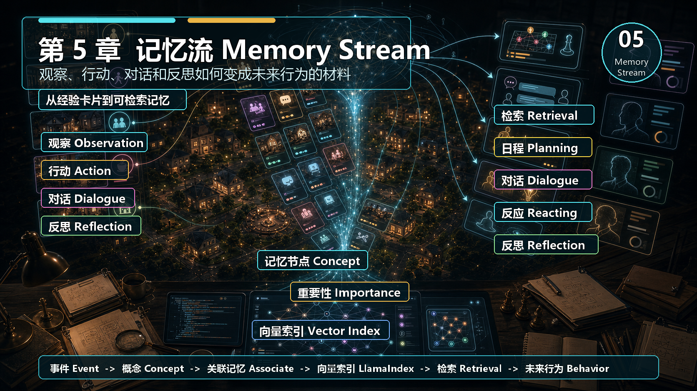
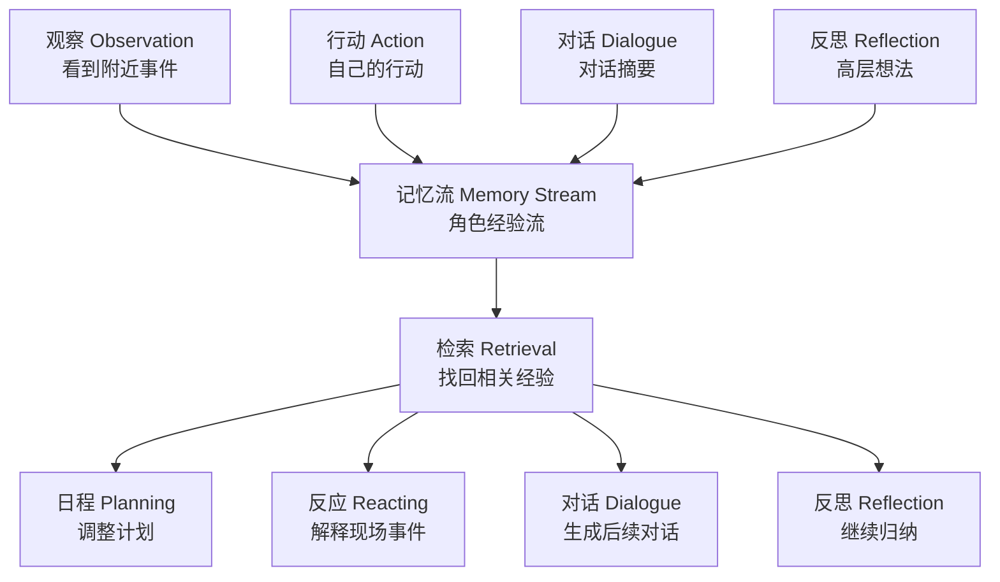
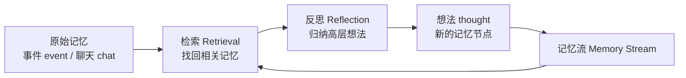

# 第 5 章 论文架构二：记忆流 Memory Stream

人物定义 Persona 解决“这个角色是谁”，记忆流 Memory Stream 解决“这个角色经历过什么”。没有记忆流 Memory Stream，智能体每天都会像重新出生。它可以在当前对话里看起来很聪明，却无法真正延续生活：

- 刚答应参加派对，下一轮就忘记。
- 看到浴室有人使用，却不知道自己应该等待。
- 刚和朋友聊完论文，下次见面又像第一次认识。
- 经历了很多事件，却无法从这些事件中形成稳定判断。

生成式智能体 Generative Agents 的关键不只是让大语言模型 LLM 会聊天，而是让角色在一个世界中持续生活。记忆流 Memory Stream 就是这段生活的经验底账。



*图 5-1：记忆流 Memory Stream 的系统入口。观察 Observation、行动 Action、对话 Dialogue 和反思 Reflection 从小镇现场进入记忆节点 Concept，再写入关联记忆 Associate、向量索引 LlamaIndex 和检索 Retrieval，最后回到日程 Planning、对话 Dialogue、反应 Reacting 和新的反思 Reflection。*

## 5.1 聊天历史不够

很多大语言模型 LLM 角色应用会从两件事开始：写一段人设，再把最近聊天记录塞进上下文。这两件事都有用，但都不够。人设能说明角色是谁。例如：

```text
姓名: 伊莎贝拉
年龄：34
先天特质：友好、外向、好客
后天特质：伊莎贝拉是霍布斯咖啡馆的老板，她总是想办法让咖啡馆成为人们放松和享受的地方。
生活习惯：伊莎贝拉晚上11点左右上床睡觉，早上6点左右醒来。
日常计划：伊莎贝拉每天早上8点开放霍布斯咖啡馆，站在柜台前直到晚上8点，然后关闭咖啡馆。

今天是 2024年02月13日（星期二）。伊莎贝拉计划于2月14日下午5点在霍布斯咖啡馆与她的顾客举行情人节派对。她正在收集聚会材料，并告诉大家在2月14日下午5点至7点在霍布斯咖啡馆参加聚会。
```

这能让模型在当前回答中带有角色风格，却不能保存刚刚发生过什么。伊莎贝拉 Isabella Rodriguez 知道自己是咖啡馆老板，但不知道今天上午已经邀请过谁。聊天历史能延续最近几轮对话，却覆盖不了小镇生活。

智能体的经历不只发生在聊天里，还发生在地图上、计划里、观察里和反思里。一个居民可能没有说话，但他看见了别人正在布置派对；一个居民可能没有参与谈话，但他注意到很多人都在讨论地方选举。这些都不是聊天历史，却会影响后续行为。生成式智能体 Generative Agents 需要保存的是经验流，而不是对话流。

## 5.2 记忆流 Memory Stream 保存什么

记忆流 Memory Stream 是智能体自己的长期经验记录。它持续保存角色观察到、做过、聊过、想到的内容，并让这些内容在未来能被检索和复用。论文中的记忆流 Memory Stream 至少覆盖四类经验。

| 经验类型 | 小镇 Smallville 案例 | 未来行为价值 |
| --- | --- | --- |
| 观察 Observation | 玛丽亚 Maria Lopez 看见伊莎贝拉 Isabella Rodriguez 正在布置霍布斯咖啡馆。 | 角色没有说话，也可能获得会影响未来的信息。 |
| 行动 Action | 伊莎贝拉 Isabella Rodriguez 正在准备情人节派对的饮品。 | 角色自己的行动会影响后续计划，也会成为别人观察到的事件。 |
| 对话 Dialogue | 伊莎贝拉 Isabella Rodriguez 邀请阿伊莎 Ayesha Khan 参加 2 月 14 日下午 5 点的派对。 | 对话是关系变化和信息传播的主要载体。 |
| 反思 Reflection | 克劳斯 Klaus Mueller 认为玛丽亚 Maria Lopez 喜欢探索新想法，未来可以继续交流。 | 反思把零散经验提升成更稳定的判断。 |

*表 5-1：记忆流 Memory Stream 保存的经验类型。它不是单纯聊天记录，而是角色生活中可被未来行为使用的经验集合。*

伊莎贝拉 Isabella Rodriguez 的派对能够传播，是因为邀请、承诺、看到布置、后续转述都能成为记忆。山姆 Sam Moore 的竞选能够扩散，是因为关于竞选的谈话不是当场消失，而会留在居民自己的经验里。克劳斯 Klaus Mueller 和玛丽亚 Maria Lopez 的关系能够变化，是因为一次次相遇和对话会被反思 Reflection 压缩成更高层的判断。


```mermaid
flowchart TD
    Observation["观察 Observation<br/>看到附近事件"] --> Stream["记忆流 Memory Stream<br/>角色经验流"]
    Action["行动 Action<br/>自己的行动"] --> Stream
    Dialogue["对话 Dialogue<br/>对话摘要"] --> Stream
    Reflection["反思 Reflection<br/>高层想法"] --> Stream

    Stream --> Retrieval["检索 Retrieval<br/>找回相关经验"]
    Retrieval --> Planning["日程 Planning<br/>调整计划"]
    Retrieval --> Reaction["反应 Reacting<br/>解释现场事件"]
    Retrieval --> Dialogue2["对话 Dialogue<br/>生成后续对话"]
    Retrieval --> Reflection2["反思 Reflection<br/>继续归纳"]
```

*图 5-2：经验进入记忆流 Memory Stream 后，会继续参与检索、日程、反应、对话和反思。主图展示了这条链路的视觉现场；这张图把链路压缩成论文架构关系。*

## 5.3 记忆不是聊天历史，也不是系统日志

记忆流 Memory Stream 很容易被误解成聊天历史，或者系统日志。聊天历史只记录对话。系统日志主要服务开发者排查问题。记忆流 Memory Stream 记录的是角色自己的经验，服务的是未来行为。

| 判定问题 | 聊天历史 | 系统日志 | 记忆流 Memory Stream |
| --- | --- | --- | --- |
| 这条记录属于谁？ | 属于一次会话。 | 属于系统运行过程。 | 属于某个具体角色。 |
| 记录什么？ | 最近几轮对话。 | 函数调用、文件写入、异常、接口响应。 | 观察 Observation、行动 Action、对话 Dialogue、反思 Reflection。 |
| 谁会使用它？ | 当前模型上下文或用户。 | 开发者。 | 智能体自己的检索、日程、对话和反思。 |
| 会不会影响未来行为？ | 受上下文窗口限制。 | 通常不直接影响角色行为。 | 会重新进入未来行为生成。 |
| 是否有角色视角？ | 弱，通常只保留发言顺序。 | 弱，偏工程事实。 | 强，同一事件会进入特定角色的经验。 |

*表 5-2：聊天历史、系统日志和记忆流 Memory Stream 的判定表。记忆流 Memory Stream 的重点不是“记录更多文本”，而是让过去能重新参与未来决策。*

看到“某个 JSON 文件写入成功”对开发者有用，对伊莎贝拉 Isabella Rodriguez 没有意义；看到“阿伊莎 Ayesha Khan 答应参加派对”对伊莎贝拉 Isabella Rodriguez 有意义，应该进入她自己的经验流。这个判定比“有没有保存聊天记录”更重要。

## 5.4 项目中一条记忆如何轻量落地

在项目里，一条记忆不是一段裸文本。它先来自世界事件，再被转换成可检索的记忆节点。第 18 章会展开完整源码；本章先保留概念层链路：

```text
世界事件 Event -> 记忆节点 Concept -> 关联记忆 Associate -> 向量索引 LlamaIndex -> 检索 Retrieval
```

| 概念层 | 项目锚点 | 在记忆流 Memory Stream 中的作用 |
| --- | --- | --- |
| 世界事件 Event | `subject`、`predicate`、`object`、`describe`、`address`。 | 描述“世界发生了什么”。 |
| 记忆节点 Concept | `node_type`、`text`、时间、重要性字段 `poignancy`。 | 描述“这件事如何成为角色自己的记忆”。 |
| 关联记忆 Associate | 按 `event`、`chat`、`thought` 保存节点编号。 | 管理一个智能体自己的记忆集合。 |
| 向量索引 LlamaIndex | 文本节点、元数据 metadata、向量嵌入 embedding。 | 让记忆能按语义相似度被找回。 |
| 检索 Retrieval | 新近性 recency、相关性 relevance、重要性 importance。 | 把候选记忆重新排序，供未来行为使用。 |

*表 5-3：一条记忆的轻量项目落点。第 5 章只建立工程入口；完整字段、存储文件和检索实现会在第 18 章展开。*

伊莎贝拉 Isabella Rodriguez 正在霍布斯咖啡馆准备派对饮品时，这件事进入记忆流 Memory Stream 后，可以先这样读：

```text
记忆文本：伊莎贝拉正在霍布斯咖啡馆准备情人节派对的饮品。
记忆类型：事件 event
发生地点：Smallville:霍布斯咖啡馆:柜台
创建时间：20240213-09:30
重要性：6
未来用途：被检索到后，支持派对计划、邀请对话和他人观察。
```

自然语言文本让大语言模型 LLM 能直接读懂这条记忆；时间、地点、类型和重要性让系统能检索、排序、清理和分类。记忆流 Memory Stream 的工程价值就在这里：它同时服务模型理解和系统管理。


```mermaid
flowchart LR
    Event["世界事件 Event<br/>发生了什么"] --> Concept["记忆节点 Concept<br/>文本 / 类型 / 时间 / 重要性"]
    Concept --> Associate["关联记忆 Associate<br/>属于哪个智能体"]
    Associate --> Index["向量索引 LlamaIndex<br/>可检索节点"]
    Index --> Retrieval["检索 Retrieval<br/>未来找回相关经验"]
    Retrieval --> Behavior["未来行为<br/>日程 / 对话 / 反应 / 反思"]
```

*图 5-3：项目中一条记忆进入记忆流 Memory Stream 的轻量路径。世界事件只有写成记忆节点 Concept 并进入索引后，才会成为未来行为可使用的经验。*

## 5.5 自然语言作为统一记忆表示

生成式智能体 Generative Agents 的一个关键选择是：记忆用自然语言表达。结构化数据当然清晰。例如：

```json
{
  "subject": "伊莎贝拉",
  "action": "邀请",
  "object": "阿伊莎",
  "event": "情人节派对",
  "time": "2024-02-13 09:30"
}
```

但复杂生活很难只靠固定字段表达。比如“阿伊莎 Ayesha Khan 答应参加派对，但她想知道是否可以带一本莎士比亚戏剧选段来分享”，如果强行拆字段，信息会变得生硬。自然语言能保留情境：

```text
阿伊莎答应参加伊莎贝拉在霍布斯咖啡馆举办的情人节派对，并提到自己可能会带一段莎士比亚戏剧选段与大家分享。
```

这样的记忆可以直接进入提示词 prompt，让大语言模型 LLM 根据上下文理解它的含义。自然语言表示也带来代价。

| 优点 | 代价 | 后续章节如何处理 |
| --- | --- | --- |
| 容易表达复杂情境。 | 内容可能模糊。 | 第 32 章讨论长期记忆治理 memory governance。 |
| 大语言模型 LLM 可以直接读取。 | 摘要可能引入幻觉。 | 第 30 章讨论风险、伦理与证据回查。 |
| 可统一观察 observation、聊天 chat、想法 thought。 | 不如结构化字段容易精确查询。 | 第 18 章讲元数据 metadata 和向量索引 LlamaIndex。 |
| 方便放入提示词 prompt 推理。 | 多轮总结后可能失真。 | 第 32 章讨论记忆压缩、冲突和可追溯性。 |

*表 5-4：自然语言记忆的优点和代价。生成式智能体 Generative Agents 选择自然语言，是为了让大语言模型 LLM 能直接使用经验；它不是长期记忆治理的终点。*

## 5.6 时间、重要性和访问记录

一条记忆只保存文本还不够。系统还需要知道它什么时候发生、是否过期、最近有没有被想起、重要不重要。项目中最核心的几个字段是：

| 字段 | 中文含义 | 行为影响 |
| --- | --- | --- |
| `create` | 创建时间。 | 说明记忆什么时候发生。 |
| `expire` | 过期时间。 | 让过期记忆可以被清理。 |
| `access` | 最近访问时间。 | 影响新近性 recency，刚被想起的记忆更容易再次被使用。 |
| `poignancy` | 重要性字段。 | 对应论文中的重要性 importance，影响检索排序，也会累积触发反思 Reflection。 |

时间让“最近发生的事”更容易影响当前行为。昨天被邀请参加派对，比一个月前听过的闲聊更可能改变今天的计划。重要性解决另一个问题：近不等于重要。看到一张椅子空着很近，但不一定重要；听说朋友准备竞选市长可能不是刚刚发生，却会长期影响对话和关系判断。

项目里用重要性字段 `poignancy` 承接论文中的重要性评分 importance score。它有两份评分提示词 prompt。

| 提示词 prompt | 评分对象 | 输入变量 | 输出结构 |
| --- | --- | --- | --- |
| `poignancy_event.txt` | 普通事件。 | 基础人物描述 `base_desc`、角色 `agent`、事件 `event`。 | `res: int`，范围 1 到 10。 |
| `poignancy_chat.txt` | 对话事件。 | 基础人物描述 `base_desc`、角色 `agent`、完整对话 `event`。 | `res: int`，范围 1 到 10。 |

*表 5-5：重要性评分提示词 prompt。不同类型的经验使用不同评分模板，但输出都进入重要性字段 `Concept.poignancy`。*

这两份提示词 prompt 的评分口径很直接：`1` 表示极其平常，`10` 表示极其特殊或强烈。填入真实事件后，关键部分可以这样读：

```text
以下是 伊莎贝拉 需要评分的一个完整事件：
"""
山姆告诉伊莎贝拉，他准备参加下个月的地方市长选举。
"""
评分：7
```

这个 `7` 会写入记忆节点 Concept 的重要性字段 `poignancy`。它不是装饰性分数，而是后续检索 Retrieval 和反思 Reflection 的输入。第 18 章会展示完整提示词 prompt、结构化输出库 Pydantic 约束和源码调用链。

## 5.7 记忆流 Memory Stream 如何支持未来行为

记忆流 Memory Stream 本身只是存储。它要发挥作用，必须被检索 Retrieval 系统带回到提示词 prompt 里。假设山姆 Sam Moore 正在和约翰 John Lin 聊天，系统不应该把山姆 Sam Moore 的所有记忆都塞进上下文，而应该找出当前相关的几条经验：

- 山姆 Sam Moore 正在竞选地方市长。
- 约翰 John Lin 最近在询问谁会参加选举。
- 山姆 Sam Moore 和其他居民讨论过社区安全。
- 约翰 John Lin 是药店店主，关心居民服务。

这些记忆进入提示词 prompt 后，对话才会像两个小镇居民之间的真实交流，而不是通用聊天。记忆流 Memory Stream 至少影响四类行为。

| 行为 | 记忆流 Memory Stream 提供什么 | 如果没有记忆会怎样 |
| --- | --- | --- |
| 日程 Planning | 昨天发生的事、未完成的邀请、近期目标。 | 日程每天随机生成，角色无法延续承诺。 |
| 对话 Dialogue | 共同经历、关系背景、刚传播过的信息。 | 角色反复寒暄，像第一次见面。 |
| 反应 Reacting | 现场事件和过去经验之间的联系。 | 角色看见事情也不知道是否该回应。 |
| 反思 Reflection | 多条相关记忆。 | 角色无法从经历中形成稳定判断。 |

*表 5-6：记忆流 Memory Stream 对未来行为的影响。过去不是被保存起来就结束，而是会重新进入日程、对话、反应和反思。*

## 5.8 反思 Reflection 会写回记忆流 Memory Stream

记忆流 Memory Stream 保存原始经验，但原始经验通常是碎片。例如：

- 克劳斯 Klaus Mueller 在咖啡馆遇到玛丽亚 Maria Lopez。
- 玛丽亚 Maria Lopez 提到自己在做游戏直播平台 Twitch。
- 克劳斯 Klaus Mueller 提到自己研究社会议题。
- 两人都对探索新想法感兴趣。

这些都是独立记忆。如果没有反思 Reflection，系统只能在后续检索时碰巧找到它们。反思 Reflection 会把碎片提升成高层认知：

```text
克劳斯发现玛丽亚虽然专业不同，但同样喜欢探索新想法，未来可以继续和她交流。
```

这个洞察 insight 会再次进入记忆流 Memory Stream，成为想法 thought。下次克劳斯 Klaus Mueller 遇到玛丽亚 Maria Lopez 时，系统更容易检索到这个高层关系认知，而不必每次重新从多条事件中推理。


```mermaid
flowchart LR
    Raw["原始记忆<br/>事件 event / 聊天 chat"] --> Retrieve["检索 Retrieval<br/>找回相关记忆"]
    Retrieve --> Reflect["反思 Reflection<br/>归纳高层想法"]
    Reflect --> Thought["想法 thought<br/>新的记忆节点"]
    Thought --> Stream["记忆流 Memory Stream"]
    Stream --> Retrieve
```

*图 5-4：反思 Reflection 会把高层想法写回记忆流 Memory Stream。记忆流不只保存低层事件，也会逐渐保存角色对自己和他人的理解。*

第 7 章会专门讲反思 Reflection 如何触发、如何提出问题、如何生成洞察 insight。本章只需要把边界看清：反思结果不是临时总结，它会作为想法 thought 重新写回记忆流 Memory Stream。

## 5.9 记忆流 Memory Stream 的局限

记忆流 Memory Stream 很重要，但它不是万能方案。它解决了“角色要有过去”，还没有完全解决“过去必须可靠、可控、可扩展”。

| 局限 | 表现 | 项目中会看到什么 | 后续升级方向 |
| --- | --- | --- | --- |
| 记忆膨胀 | 角色运行越久，事件和对话越多，检索噪声增加。 | 记忆节点数量增长，检索结果出现很多日常琐事。 | 分层记忆、摘要压缩、生命周期管理。 |
| 记忆重复 | 每天吃饭、上班、回家会产生大量相似记忆。 | 多条记忆文本高度相似，重要事件被普通日常稀释。 | 去重、聚合、习惯建模。 |
| 记忆错误 | 大语言模型 LLM 可能把没有发生过的内容写进摘要。 | `simulation.md` 摘要与原始对话或行动不一致。 | 证据绑定、冲突检测、可追溯记忆。 |
| 记忆冲突 | 派对时间可能被不同对话说成 5 点或 7 点。 | 同一事实在不同记忆里出现多个版本。 | 事实校验、版本管理、置信度。 |
| 关系表达不足 | “汤姆 Tom Moreno 不喜欢山姆 Sam Moore”只靠文本记录，不够稳定。 | 关系变化散落在多条对话和想法 thought 中。 | 关系图记忆、信任度和亲密度建模。 |

*表 5-7：记忆流 Memory Stream 的局限。局限不是概念缺陷，而是后续工程升级的入口。*

这些局限不会削弱记忆流 Memory Stream 的价值。相反，它们给出了后续三年智能体记忆系统继续演进的方向。第 30 章会讨论风险和证据回查，第 32 章会进入长期记忆治理 memory governance。

## 5.10 本章小结

记忆流 Memory Stream 是人物定义 Persona 之后的第二层架构。人物定义 Persona 给角色身份，记忆流 Memory Stream 给角色过去。两者合在一起，角色才不只是“会说某种话”，而是能在小镇中延续经历、关系和计划。

本章建立了三个判断。第一，聊天历史不等于记忆流 Memory Stream；角色生活发生在观察、行动、对话、地图和反思里。第二，记忆流 Memory Stream 保存的不只是文本，而是带有类型、时间、重要性和角色归属的经验。第三，记忆只有被检索 Retrieval 带回未来行为，才真正变成智能体持续生活的材料。

下一章进入检索 Retrieval。拥有记忆只是第一步；真正做决定时，智能体不能读取全部记忆，而必须从记忆流 Memory Stream 中找出当前最相关的内容。

## 参考资料

- Joon Sung Park, Joseph C. O'Brien, Carrie J. Cai, Meredith Ringel Morris, Percy Liang, Michael S. Bernstein. *Generative Agents: Interactive Simulacra of Human Behavior*. arXiv: https://arxiv.org/abs/2304.03442
- ar5iv full text: https://ar5iv.labs.arxiv.org/html/2304.03442
- Local source: `generative_agents/modules/memory/event.py`
- Local source: `generative_agents/modules/memory/associate.py`
- Local source: `generative_agents/modules/storage/index.py`
- Local source: `generative_agents/modules/agent.py`
- Local prompt: `generative_agents/data/prompts/poignancy_event.txt`
- Local prompt: `generative_agents/data/prompts/poignancy_chat.txt`
