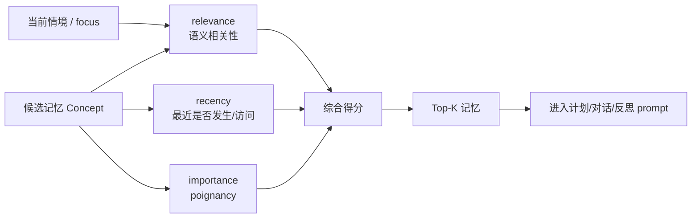
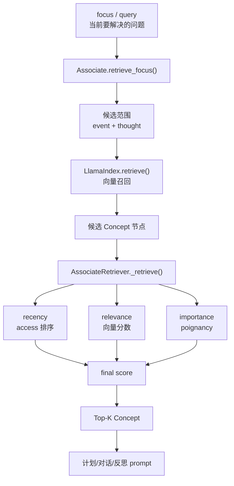

# 第 6 章 论文架构三：Retrieval

## 核心问题

> Memory Stream 让智能体拥有过去，Retrieval 决定智能体此刻想起哪一部分过去。

保存记忆只是第一步。真正做决定时，智能体不能把全部记忆都塞进 prompt。记忆越多，问题越明显：

- 上下文窗口有限。
- 无关记忆会干扰判断。
- 相似记忆会互相混淆。
- 重要信息可能被日常琐事淹没。
- 关键记忆检索不到，行为就会断裂。

Retrieval 解决的是一个很具体的问题：

> 当前情境下，哪几条记忆最应该进入模型上下文？

Generative Agents 没有只做简单向量搜索，而是把三种因素合在一起：近期性、重要性、相关性。这个选择决定了它更像“人在当前情境下想起相关经历”，而不是“数据库按关键词返回文本”。

## 6.1 不能读取全部记忆

把所有记忆都放进 prompt，是最直接也最容易失败的方案。

| 问题 | 表现 | 对行为的影响 |
| --- | --- | --- |
| 上下文有限 | 单个角色一天就可能产生几十到几百条记忆。 | 长期运行后，全部记忆无法进入 prompt。 |
| 噪声过多 | 起床、吃饭、移动、看见空椅子等日常记忆数量很多。 | 模型容易抓错重点。 |
| 关键事件被稀释 | 派对邀请、竞选声明、关系变化被琐事包围。 | 角色会忘记承诺或错过社会事件。 |
| 记忆互相冲突 | 同一活动时间、地点、态度可能出现不一致说法。 | 模型可能混淆事实，生成错误行为。 |
| 缺少当前目标 | “全部记忆”没有告诉模型此刻应该关注什么。 | 对话、计划和反应会变得散。 |

*表 6-1：不能读取全部记忆的原因。Retrieval 的目标不是拿到更多记忆，而是拿到当前最有用的少量记忆。*

人也不会完整读取过去。一个人听到“今天晚上的安排”，会想起最近的邀请、未完成的约定、和当前对话对象有关的事，而不是回忆一生所有细节。Generative Agents 的 Retrieval 就是在系统层面实现这种“情境化回忆”。

## 6.2 Retrieval 的三个维度

论文提出的检索分数由三个维度组成：recency、importance、relevance。

| 维度 | 中文意思 | 回答的问题 | 如果缺失会怎样 |
| --- | --- | --- | --- |
| recency | 近期性 | 这条记忆最近是否发生或被想起？ | 角色会忽略刚发生的事，行为缺少即时连续性。 |
| importance | 重要性 | 这条记忆对角色是否重要？ | 派对、竞选、关系变化会被日常琐事淹没。 |
| relevance | 相关性 | 这条记忆是否和当前情境有关？ | 角色会想起重要但不合时宜的事，回答跑题。 |

*表 6-2：Retrieval 的三个维度。可信行为需要三者平衡，而不是只看语义相似度。*

### 近期性

近期性对应 recency。刚刚发生过的事情，通常更容易影响当前行动。阿伊莎五分钟前接受了伊莎贝拉的派对邀请。她下午遇到克劳斯时，这条记忆应该更容易被想起。如果邀请发生在很久以前，除非它特别重要或特别相关，否则当前影响会降低。在项目中，近期性主要依赖 `Concept.access`。`AssociateRetriever` 会先按 `access` 排序，再给越靠前的候选记忆更高的 recency 分数。

### 重要性

重要性对应 importance。有些事件不一定最近，但仍然应该被想起：

- 山姆打算竞选市长。
- 伊莎贝拉计划举办情人节派对。
- 汤姆不喜欢山姆。
- 克劳斯和玛丽亚发现彼此有共同兴趣。

这些信息应该比“看见一个空椅子”更容易进入上下文。项目中用 `poignancy` 表示重要性。它来自上一章讲过的 `poignancy_event.txt` 和 `poignancy_chat.txt`，并保存在 `Concept` 的 metadata 中。

### 相关性

相关性对应 relevance。同一个角色，在不同情境下应该想起不同记忆。伊莎贝拉准备派对时，应该想起派对时间、材料、已经邀请过谁；她决定是否和亚当聊天时，应该想起亚当最近在写书、常在咖啡馆工作、之前是否愿意参加活动。项目中，相关性来自向量检索分数。`LlamaIndex.retrieve()` 会把当前查询和记忆文本放到 embedding 空间里比较，返回语义上更接近的候选记忆。



*图 6-1：Recency、Importance、Relevance 三因素检索模型。Retrieval 决定的是当前 prompt 里出现哪几条过去经验。*

## 6.3 三个维度缺一不可

只看相关性，系统会变成普通语义搜索。它可能找到很多“咖啡馆”相关记忆，却错过今天下午的派对。只看近期性，系统会被刚刚发生的小事带跑。角色刚看见一把空椅子，检索结果就可能被这个无意义事件占据。只看重要性，系统会反复想起重大事件。山姆可能一直谈竞选，却忘记眼前的人正在问咖啡口味。这三个维度的分工可以再看得直接一点。

| 当前情境 | 只看相关性的问题 | 只看近期性的问题 | 只看重要性的问题 | 三因素平衡后的结果 |
| --- | --- | --- | --- | --- |
| 阿伊莎和克劳斯聊今晚安排 | 可能找出很多“图书馆”“学习”记忆。 | 可能只想起刚才看见的家具或路人。 | 可能想起很重要但和今晚无关的学业压力。 | 更容易想起伊莎贝拉刚邀请她参加派对。 |
| 汤姆谈地方选举 | 可能只找出“选举”事实。 | 可能被刚刚的商店事件干扰。 | 可能反复想起对山姆的不满。 | 同时想起山姆竞选和自己不喜欢山姆。 |
| 伊莎贝拉决定是否邀请亚当 | 可能只找出亚当在咖啡馆的所有记录。 | 可能只看见亚当此刻在写作。 | 可能只想起派对很重要。 | 同时考虑派对目标、亚当状态和过去互动。 |

*表 6-3：三个维度如何互相补足。Retrieval 的质量直接决定行为是否自然。*

## 6.4 系统中如何完成一次检索

在项目里，检索不是一个抽象概念。它由 `Associate`、`LlamaIndex` 和 `AssociateRetriever` 共同完成。

| 系统模块 | 负责什么 | 对 Retrieval 的作用 |
| --- | --- | --- |
| `Associate` | 管理角色自己的 `event`、`thought`、`chat` 记忆列表。 | 提供检索入口，决定查哪类记忆。 |
| `LlamaIndex` | 保存 TextNode、metadata 和向量索引。 | 先按语义相似度召回候选记忆。 |
| `AssociateRetriever` | 对候选记忆重新打分。 | 合并 recency、relevance、importance。 |
| `Concept` | 统一封装记忆文本、时间、类型、重要性。 | 提供排序和回填 prompt 所需字段。 |
| `Agent.make_schedule()` | 新一天计划前检索近期重要经验。 | 用过去经验更新 `currently` 和当天安排。 |
| `Agent.reflect()` | 反思时按问题检索相关记忆。 | 为 insight 提供证据。 |
| `_reaction()` / `_chat_with()` | 社交反应和对话前检索关系背景。 | 让对话不只是现场寒暄。 |

*表 6-4：Retrieval 涉及的系统模块。检索不是单个函数，而是记忆容器、向量索引、重排序器和行为模块的协作。*



*图 6-2：项目中 `retrieve_focus()` 的检索流程。先由向量索引召回候选，再由 `AssociateRetriever` 用三因素重排。*

## 6.5 检索接口和输入输出

`Associate` 提供了几类检索入口。它们不是完全等价的。

| 接口 | 查询范围 | 典型用途 | 注意点 |
| --- | --- | --- | --- |
| `retrieve_events(text=None)` | `event` 记忆。 | 查最近事件，或按文本查相关事件。 | 不传文本时主要取最近事件。 |
| `retrieve_thoughts(text=None)` | `thought` 记忆。 | 查反思产生的高层想法。 | thought 往往比 event 更抽象。 |
| `retrieve_chats(name=None)` | `chat` 记忆。 | 查与某个人的历史对话。 | 传入名字时会构造“对话 某人”的查询文本。 |
| `retrieve_focus(focus, retrieve_max=30, reduce_all=True)` | `event + thought`。 | 计划、反思、关系总结等多焦点检索。 | 默认不直接查 `chat`，对话通常单独通过 `retrieve_chats()` 查。 |
| `get_relation(node)` | 与某个 node 描述相关的 events 和 thoughts。 | 社交反应前理解“我和这个人/事件有什么关系”。 | 返回的是关系上下文，不只是单条记忆。 |

*表 6-5：项目中的检索接口。不同接口回答不同问题，不能把 Retrieval 简化成一个向量搜索调用。*

一次计划前的检索输入可以长这样：

```python
focus = [
    "伊莎贝拉 在 2024年02月14日（星期三） 的计划。",
    "在 伊莎贝拉 的生活中，重要的近期事件。",
]
retrieved = associate.retrieve_focus(focus)
```

这段代码的含义很直白：系统不是凭空问“给我一些记忆”，而是在问两件事：

- 今天计划需要哪些过去经验？
- 最近有哪些重要事件会影响伊莎贝拉？

检索输出不是纯字符串，而是一组 `Concept`。进入 prompt 前，系统通常会使用每条记忆的时间和描述：

```text
2024-02-13 09:30: 伊莎贝拉邀请阿伊莎参加 2 月 14 日下午 5 点的情人节派对。
2024-02-13 11:10: 阿伊莎表示她可能会带一段莎士比亚戏剧选段来分享。
2024-02-13 15:00: 山姆告诉伊莎贝拉，他准备参加下个月的地方市长选举。
```

这样的输出才是后续 `retrieve_plan`、`retrieve_thought`、`retrieve_currently` 能使用的材料。这里有三份真实 prompt。它们不是 Retrieval 排序算法本身，而是“检索结果进入 Planning 前”的压缩层。`retrieve_plan.txt` 会把记忆节点整理成计划描述：

```text
根据给定的记忆节点，生成智能体的计划描述。

示例：
"""
记忆节点：
2023-12-15 08:00: 凯莉在厨房做早餐
2023-12-15 09:00: 凯莉计划今天去超市购物
2023-12-15 14:00: 凯莉昨天和朋友聊天很愉快

生成5个计划描述：

[
  "凯莉今天早上准备了营养早餐",
  "凯莉计划去超市购买生活用品",
  "凯莉重视与朋友的社交关系",
  "凯莉的生活很有规律",
  "凯莉注重健康饮食"
]

参考示例，为以下记忆节点生成计划描述：
"""
记忆节点：
${description}

智能体：${agent}
当前日期：${date}
"""

确保返回的数据格式遵守schema：
[
  "计划描述1",
  "计划描述2",
  "计划描述3",
  ...
]

要求：
- 计划描述要基于给定的记忆节点
- 描述要简洁明了，符合智能体的生活习惯
- 确保返回的数据格式遵守schema
```

英文对照如下：

```text
Generate plan descriptions for the agent based on the given memory nodes.

Example:
"""
Memory nodes:
2023-12-15 08:00: Kelly made breakfast in the kitchen.
2023-12-15 09:00: Kelly planned to go grocery shopping today.
2023-12-15 14:00: Kelly had a pleasant conversation with a friend yesterday.

Generate 5 plan descriptions:

[
  "Kelly prepared a nutritious breakfast this morning",
  "Kelly plans to buy daily supplies at the supermarket",
  "Kelly values her social relationships with friends",
  "Kelly has a regular lifestyle",
  "Kelly pays attention to healthy eating"
]

Following the example, generate plan descriptions for the following memory nodes:
"""
Memory nodes:
${description}

Agent: ${agent}
Current date: ${date}
"""

Make sure the returned data follows the schema:
[
  "plan description 1",
  "plan description 2",
  "plan description 3",
  ...
]

Requirements:
- The plan descriptions must be based on the given memory nodes.
- The descriptions should be concise and fit the agent's lifestyle.
- Make sure the returned data follows the schema.
```

`retrieve_thought.txt` 会把检索结果压成一句当前想法：

```text
"""
${description}
"""

根据以上内容，以 ${agent} 的视角，用一句话总结 ${agent} 此刻的想法和感受：
```

英文对照如下：

```text
"""
${description}
"""

Based on the content above, summarize ${agent}'s current thoughts and feelings in one sentence from ${agent}'s perspective:
```

`retrieve_currently.txt` 会把旧的 `currently`、计划描述和想法合成为新一天状态：

```text
${agent} 在 ${time} 的状态：
${currently}

${agent} 在 ${time} 结束时记得这些事情：
${plan}

${agent} 在 ${time} 结束时的想法和感受：
${thought}

现在是 ${current_time}。根据上述情况，以第三人称，用一句话描述 ${agent} 在 ${current_time} 的状态，以反映 ${agent} 在 ${time} 结束时的想法和感受。
```

英文对照如下：

```text
${agent}'s state on ${time}:
${currently}

At the end of ${time}, ${agent} remembered these things:
${plan}

At the end of ${time}, ${agent}'s thoughts and feelings were:
${thought}

It is now ${current_time}. Based on the information above, describe ${agent}'s state on ${current_time} in one sentence, in the third person, so that it reflects ${agent}'s thoughts and feelings at the end of ${time}.
```

这三份 prompt 的输出 schema 分别是：

| Prompt | 返回字段 | 类型 | 用途 |
| --- | --- | --- | --- |
| `retrieve_plan.txt` | `res` | `list[str]` | 从记忆中提炼与计划有关的描述。 |
| `retrieve_thought.txt` | `res` | `str` | 用一句话总结角色此刻的想法和感受。 |
| `retrieve_currently.txt` | `res` | `str` | 更新角色的新一天当前状态。 |

## 6.6 三因素在代码中如何合成

`AssociateRetriever._retrieve()` 的核心逻辑可以概括为五步。

| 步骤 | 代码中的来源 | 中文意思 |
| --- | --- | --- |
| 1. 向量召回 | `VectorIndexRetriever.retrieve()` | 先找语义相似的候选记忆。 |
| 2. 按访问时间排序 | `metadata["access"]` | 越最近访问的记忆，recency 基础越高。 |
| 3. 计算三类分数 | `recency_decay`、`node.score`、`metadata["poignancy"]` | 分别得到近期性、相关性、重要性。 |
| 4. 归一化并加权 | `_normalize(..., weight)` | 把不同量纲的分数放到可相加区间。 |
| 5. 合成最终分数 | `final = recency + relevance + importance` | 按 final score 排序，取前 `retrieve_max`。 |

*表 6-6：`AssociateRetriever` 的重排序步骤。向量召回只是第一步，最终进入 prompt 的记忆由三因素合成决定。*

可以把项目里的打分过程写成教学版公式：

```text
final_score =
  normalize(recency, recency_weight)
+ normalize(relevance, relevance_weight)
+ normalize(importance, importance_weight)
```

当前项目默认参数是：

| 参数 | 默认值 | 中文意思 | 行为倾向 |
| --- | --- | --- | --- |
| `recency_decay` | `0.995` | 近期性衰减系数。 | 候选越靠后，近期性越低。 |
| `recency_weight` | `0.5` | 近期性权重。 | 近期性有影响，但不是主导因素。 |
| `relevance_weight` | `3` | 相关性权重。 | 当前语境匹配度最重要。 |
| `importance_weight` | `2` | 重要性权重。 | 重大事件会明显抬高排名。 |
| `retrieve_max` | 调用时设置，`retrieve_focus()` 默认 `30`。 | 最多返回多少条重排后的记忆。 | 控制进入后续 prompt 的记忆数量。 |

*表 6-7：Retrieval 默认参数。这个实现明显偏向“先贴合当前问题，再保留重要事件，最后参考近期性”。*

举一个教学化的排序例子。阿伊莎下午遇到克劳斯，当前 focus 是“今晚安排”和“社交活动”。

| 候选记忆 | recency | relevance | importance | 综合判断 |
| --- | --- | --- | --- | --- |
| 上午伊莎贝拉邀请阿伊莎参加情人节派对。 | 高 | 高 | 高 | 最应该被检索出来。 |
| 阿伊莎刚刚看见图书馆里有一张空桌子。 | 高 | 低 | 低 | 很近，但不该主导对话。 |
| 阿伊莎上周完成了一篇莎士比亚论文。 | 低 | 中 | 中 | 和文学有关，但不如派对贴近当前社交活动。 |
| 山姆准备竞选地方市长。 | 中 | 低 | 高 | 重要，但当前话题不一定需要。 |

*表 6-8：三因素排序示例。Retrieval 不是选择“最重要的一条”，而是选择当前情境下综合最合适的记忆。*

## 6.7 Focus：检索必须带着问题发生

检索需要问题。没有 focus，系统不知道要找什么。项目中的 focus 可以来自不同认知任务。

| 任务 | focus 从哪里来 | 检索用途 |
| --- | --- | --- |
| 生成日程 | `make_schedule()` 构造“某人在某日的计划”“重要的近期事件”。 | 更新 `currently`，再生成当天计划。 |
| 反思 | `reflect_focus` 先根据近期记忆生成问题。 | 按问题检索证据，再生成 insight。 |
| 社交反应 | `_reaction()` 根据当前感知到的人或事件调用 `get_relation()`。 | 判断是否聊天、等待或忽略。 |
| 生成对话 | `prompt_generate_chat()` 用关系、对方当前事件、最近对话构造 focus。 | 找回相关记忆，让对话接上过去。 |
| 关系总结 | `prompt_summarize_relation()` 用对方名字检索。 | 总结两个角色之间的关系。 |

*表 6-9：Retrieval 的触发场景。检索不是孤立模块，而是计划、反思、社交和对话的共同入口。*

Retrieval 必须放在 Reflection、Planning、Reacting 和 Dialogue 之前理解。后面所有模块都依赖它：不是“有记忆”就够了，而是“关键时刻能想起正确记忆”。

## 6.8 两个小镇案例

### 情人节派对

阿伊莎上午遇到伊莎贝拉。伊莎贝拉邀请她参加 2 月 14 日下午 5 点的情人节派对。这条对话被总结后写入阿伊莎的记忆。下午，阿伊莎在图书馆遇到克劳斯。她是否会提到派对，取决于三因素检索。

| 因素 | 派对记忆的表现 | 结果 |
| --- | --- | --- |
| recency | 邀请刚发生不久。 | 容易被想起。 |
| importance | 派对是一次具体社交活动。 | 比日常学习更值得进入上下文。 |
| relevance | 当前对话如果涉及今晚安排、文学分享或社交活动，就高度相关。 | 可能自然提到派对。 |

*表 6-10：派对邀请的检索路径。信息传播不是自动发生的，它依赖被邀请者后续能在合适情境下想起这件事。*

如果派对记忆被检索出来，阿伊莎可能说：

```text
对了，伊莎贝拉下午在霍布斯咖啡馆办情人节派对，我可能会去，还想带一些文学故事分享。
```

如果没有被检索出来，她可能完全不提这件事。信息传播链就会断。

### 镇长竞选

山姆的竞选意图可能通过对话写入其他角色的 Memory Stream。汤姆谈地方选举时，系统需要同时检索事实和立场。

| 记忆 | 作用 |
| --- | --- |
| 山姆正在竞选地方市长。 | 提供事实背景。 |
| 汤姆关注地方市长选举。 | 说明汤姆有理由谈这件事。 |
| 汤姆不喜欢山姆。 | 决定汤姆说话时不会完全中性。 |
| 汤姆经营市场和药店，关心社区服务。 | 让选举话题和他的生活有关。 |

*表 6-11：竞选话题需要同时检索事实和立场。可信行为不只是想起事实，还要想起角色如何看待事实。*

如果这些记忆都被检索出来，汤姆的表达可能带有态度：

```text
我看到候选人都在谈社区服务，这对商店也许有好处。不过我对山姆这个人还是不太感冒。
```

这就是 Retrieval 对角色差异的影响。同样谈选举，不同角色会想起不同记忆，也会说出不同的话。

## 6.9 检索失败的后果

检索失败会直接变成行为失败。

| 失败类型 | 表现 | 读者在实验中应该观察什么 |
| --- | --- | --- |
| 忘记承诺 | 接受派对邀请后没有到场，也不再提起。 | 被邀请者后续日程和对话是否出现派对。 |
| 重复寒暄 | 两个角色第二次见面仍像第一次认识。 | 对话是否接续过去交流。 |
| 忽略关系 | 汤姆谈山姆时突然变得中性或友好。 | 角色立场是否和过去记忆一致。 |
| 反思变浅 | insight 没有证据，只是泛泛总结。 | 反思是否引用了关键经历。 |
| 社会传播中断 | 一个角色听到消息后没有继续传播。 | 消息是否跨角色级联扩散。 |
| 幻觉补全 | 模型说“你答应过”，但记忆里没有证据。 | 对话中的事实是否能追溯到记忆。 |

*表 6-12：检索失败的常见后果。评价智能体不能只看“有没有存记忆”，还要看关键场景下“有没有想起正确记忆”。*

Retrieval 也能降低幻觉，但不能彻底消除幻觉。如果检索系统提供了准确记忆，模型更可能基于真实上下文说话；如果检索召回了错误记忆，或者记忆本身来自错误摘要，模型也会把错误继续传播。因此，Retrieval 同时是防幻觉机制，也是风险入口。第五部分讨论记忆冲突检测和事实保真度时，会继续回到这个问题。

## 6.10 检索权重是一种行为设计

`recency_weight`、`relevance_weight`、`importance_weight` 不是纯技术细节。它们会改变角色像什么样的人。

| 调整方向 | 角色表现 | 风险 |
| --- | --- | --- |
| 提高 recency | 更容易受刚发生的事影响。 | 容易被琐碎新事件带跑。 |
| 提高 relevance | 更贴合当前问题。 | 可能错过长期重要背景。 |
| 提高 importance | 更重视重大事件和关系变化。 | 可能反复提大事，忽略眼前场景。 |
| 降低 retrieve_max | prompt 更干净。 | 关键证据可能进不来。 |
| 提高 retrieve_max | 证据更充分。 | 噪声增加，模型更容易混淆。 |

*表 6-13：检索参数对行为风格的影响。Retrieval 权重本质上是系统对“什么值得被想起”的设计。*

不同应用会需要不同权重。游戏 NPC 可能更重视当前场景。心理陪伴类智能体可能更重视长期重要记忆。社会仿真实验则需要在近期传播、重要公共事件和当前语境之间取得平衡。

## 6.11 本章小结

Retrieval 是“角色此刻想起什么”的系统机制。Memory Stream 保存过去，Retrieval 选择当前能进入 prompt 的过去。真正影响行为的，不是全部记忆，而是被检索出来的那一小组记忆。

| 本章内容 | 核心结论 |
| --- | --- |
| 不能读取全部记忆 | 全量记忆会带来上下文限制、噪声、冲突和重点丢失。 |
| 三因素模型 | recency、importance、relevance 分别解决“近不近”“重不重要”“相不相关”。 |
| 三者缺一不可 | 只看一个维度都会导致行为偏差。 |
| 系统实现 | `Associate`、`LlamaIndex`、`AssociateRetriever` 共同完成检索和重排序。 |
| 检索接口 | `retrieve_focus()`、`retrieve_events()`、`retrieve_thoughts()`、`retrieve_chats()` 和 `get_relation()` 服务不同场景。 |
| 打分公式 | final score 由近期性、相关性和重要性归一化加权后相加。 |
| Focus | 检索必须带着问题发生，问题来自计划、反思、社交和对话。 |
| 小镇案例 | 派对传播和镇长竞选都依赖关键记忆在合适情境下被想起。 |
| 失败后果 | 检索失败会导致忘记承诺、重复寒暄、忽略关系、反思变浅和幻觉补全。 |
| 行为设计 | 权重参数决定角色更容易想起近期事件、相关事件还是重要事件。 |

下一章进入 Reflection。Retrieval 可以让智能体想起相关过去，但只想起过去还不够。智能体还需要把零散经历归纳成更高层的判断。

## 参考资料

- Joon Sung Park, Joseph C. O'Brien, Carrie J. Cai, Meredith Ringel Morris, Percy Liang, Michael S. Bernstein. *Generative Agents: Interactive Simulacra of Human Behavior*. arXiv: https://arxiv.org/abs/2304.03442
- ar5iv full text: https://ar5iv.labs.arxiv.org/html/2304.03442
- Local source: `generative_agents/modules/memory/associate.py`
- Local source: `generative_agents/modules/storage/index.py`
- Local source: `generative_agents/modules/agent.py`
- Local source: `generative_agents/modules/prompt/scratch.py`
- Local prompt: `generative_agents/data/prompts/retrieve_plan.txt`
- Local prompt: `generative_agents/data/prompts/retrieve_thought.txt`
- Local prompt: `generative_agents/data/prompts/retrieve_currently.txt`
