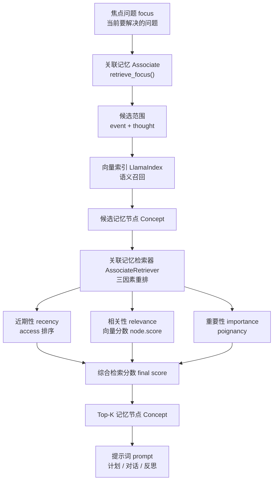

# 第 6 章 论文架构三：检索 Retrieval

记忆流 Memory Stream 让智能体拥有过去，检索 Retrieval 决定智能体此刻想起哪一部分过去。保存记忆只是第一步。真正做决定时，智能体不能把全部记忆都塞进提示词 prompt。记忆越多，噪声、冲突和上下文限制越明显。

检索 Retrieval 要回答的问题很具体：

> 当前情境下，哪几条记忆最应该进入模型上下文？

生成式智能体 Generative Agents 没有只做简单向量搜索，而是把近期性 recency、重要性 importance 和相关性 relevance 合在一起。这个选择让系统更像“人在当前情境下想起相关经历”，而不是“数据库按关键词返回文本”。


*图 6-1：检索 Retrieval 的系统入口。左侧是角色自己的记忆流 Memory Stream，中间用近期性 recency、相关性 relevance 和重要性 importance 重排候选记忆，右侧只把 Top-K 记忆送入提示词 prompt，并继续影响日程 Planning、对话 Dialogue 和反思 Reflection。*

## 6.1 不能读取全部记忆

把所有记忆都放进提示词 prompt，是最直接也最容易失败的方案。

| 问题 | 表现 | 对行为的影响 |
| --- | --- | --- |
| 上下文有限 | 单个角色一天就可能产生几十到几百条记忆。 | 长期运行后，全部记忆无法进入提示词 prompt。 |
| 噪声过多 | 起床、吃饭、移动、看见空椅子等日常记忆数量很多。 | 模型容易抓错重点。 |
| 关键事件被稀释 | 派对邀请、竞选声明、关系变化被琐事包围。 | 角色会忘记承诺或错过社会事件。 |
| 记忆互相冲突 | 同一活动时间、地点、态度可能出现不一致说法。 | 模型可能混淆事实，生成错误行为。 |
| 缺少当前目标 | “全部记忆”没有告诉模型此刻应该关注什么。 | 对话、计划和反应会变得散。 |

*表 6-1：不能读取全部记忆的原因。检索 Retrieval 的目标不是拿到更多记忆，而是拿到当前最有用的少量记忆。*

人也不会完整读取过去。听到“今天晚上的安排”时，一个人会想起最近的邀请、未完成的约定、和当前对话对象有关的事，而不是回忆一生所有细节。检索 Retrieval 在系统层面实现的就是这种“情境化回忆”。

## 6.2 检索 Retrieval 的输入-处理-输出

先把检索 Retrieval 看成一次数据流。输入不是“所有记忆”，而是一个或多个焦点问题 focus；处理过程先从记忆节点 Concept 中召回候选，再按三因素重排；输出是少量 Top-K 记忆，供后续提示词 prompt 使用。

| 环节 | 真实项目对象 | 读法 | 输出到哪里 |
| --- | --- | --- | --- |
| 输入 input | 焦点问题 `focus`、候选记忆类型 `event` / `thought` / `chat`。 | 当前任务到底在问什么。 | 传入 `Associate.retrieve_focus()`、`retrieve_events()`、`retrieve_chats()` 等接口。 |
| 处理 process | 向量索引 LlamaIndex 召回、`AssociateRetriever` 三因素重排。 | 先找语义相关，再按新近、相关和重要综合排序。 | 形成重排后的记忆节点 Concept 列表。 |
| 输出 output | Top-K 记忆节点 Concept。 | 当前上下文最值得想起的过去经验。 | 进入日程 Planning、对话 Dialogue、反应 Reacting 和反思 Reflection 的提示词 prompt。 |

*表 6-2：检索 Retrieval 的输入、处理和输出。检索不是“查数据库”，而是为当前行为挑选上下文材料。*

一次计划前的检索输入可以这样读：

```python
focus = [
    "伊莎贝拉 在 2024年02月14日（星期三） 的计划。",
    "在 伊莎贝拉 的生活中，重要的近期事件。",
]
retrieved = associate.retrieve_focus(focus)
```

这段输入问的是两件事：今天计划需要哪些过去经验，最近有哪些重要事件会影响伊莎贝拉 Isabella Rodriguez。检索输出不是纯字符串，而是一组记忆节点 Concept。进入提示词 prompt 前，系统通常会使用每条记忆的时间和描述：

```text
2024-02-13 09:30: 伊莎贝拉邀请阿伊莎参加 2 月 14 日下午 5 点的情人节派对。
2024-02-13 11:10: 阿伊莎表示她可能会带一段莎士比亚戏剧选段来分享。
2024-02-13 15:00: 山姆告诉伊莎贝拉，他准备参加下个月的地方市长选举。
```

这些记忆进入提示词 prompt 后，才会变成日程、对话、反思和后续行动的材料。

## 6.3 三因素模型：近期性 recency、重要性 importance、相关性 relevance 缺一不可

论文提出的检索 Retrieval 分数由三个维度组成：近期性 recency、重要性 importance 和相关性 relevance。

| 维度 | 回答的问题 | 项目中的主要来源 | 如果缺失会怎样 |
| --- | --- | --- | --- |
| 近期性 recency | 这条记忆最近是否发生或被想起？ | 访问时间 `Concept.access`。 | 角色会忽略刚发生的事，行为缺少即时连续性。 |
| 重要性 importance | 这条记忆对角色是否重要？ | 重要性字段 `Concept.poignancy`。 | 派对、竞选、关系变化会被日常琐事淹没。 |
| 相关性 relevance | 这条记忆是否和当前情境有关？ | 向量检索分数 `node.score`。 | 角色会想起重要但不合时宜的事，回答跑题。 |

*表 6-3：检索 Retrieval 的三个维度。可信行为需要三者平衡，而不是只看语义相似度。*

近期性 recency 对应“刚刚发生过的事情更容易影响当前行动”。阿伊莎 Ayesha Khan 五分钟前接受了伊莎贝拉 Isabella Rodriguez 的派对邀请。她下午遇到克劳斯 Klaus Mueller 时，这条记忆应该更容易被想起。如果邀请发生在很久以前，除非它特别重要或特别相关，否则当前影响会降低。

重要性 importance 对应“有些事不近，但仍然应该被想起”。山姆 Sam Moore 打算竞选市长、伊莎贝拉 Isabella Rodriguez 计划举办情人节派对、汤姆 Tom Moreno 不喜欢山姆 Sam Moore、克劳斯 Klaus Mueller 和玛丽亚 Maria Lopez 发现彼此有共同兴趣，这些信息都比“看见一个空椅子”更值得进入上下文。

相关性 relevance 对应“同一个角色在不同情境下应该想起不同记忆”。伊莎贝拉 Isabella Rodriguez 准备派对时，应该想起派对时间、材料、已经邀请过谁；她决定是否和亚当 Adam Smith 聊天时，应该想起亚当 Adam Smith 最近在写书、常在咖啡馆工作、之前是否愿意参加活动。


```mermaid
flowchart LR
    Query["当前情境 focus<br/>这一步要解决什么"] --> Relevance["相关性 relevance<br/>语义是否贴合"]
    Memory["候选记忆 Concept<br/>事件 / 聊天 / 想法"] --> Relevance
    Memory --> Recency["近期性 recency<br/>最近是否发生或访问"]
    Memory --> Importance["重要性 importance<br/>poignancy 是否高"]

    Relevance --> Score["综合检索分数 final score"]
    Recency --> Score
    Importance --> Score
    Score --> TopK["Top-K 记忆"]
    TopK --> Prompt["提示词 prompt<br/>日程 / 对话 / 反思"]
```

*图 6-2：近期性 recency、重要性 importance 和相关性 relevance 的三因素模型。检索 Retrieval 决定的是当前提示词 prompt 里出现哪几条过去经验。*

只看相关性 relevance，系统会变成普通语义搜索。它可能找到很多“咖啡馆”相关记忆，却错过今天下午的派对。

只看近期性 recency，系统会被刚刚发生的小事带跑。角色刚看见一把空椅子，检索结果就可能被这个无意义事件占据。

只看重要性 importance，系统会反复想起重大事件。山姆 Sam Moore 可能一直谈竞选，却忘记眼前的人正在问咖啡口味。

| 当前情境 | 只看相关性 relevance 的问题 | 只看近期性 recency 的问题 | 只看重要性 importance 的问题 | 三因素平衡后的结果 |
| --- | --- | --- | --- | --- |
| 阿伊莎 Ayesha Khan 和克劳斯 Klaus Mueller 聊今晚安排。 | 可能找出很多“图书馆”“学习”记忆。 | 可能只想起刚才看见的家具或路人。 | 可能想起很重要但和今晚无关的学业压力。 | 更容易想起伊莎贝拉 Isabella Rodriguez 刚邀请她参加派对。 |
| 汤姆 Tom Moreno 谈地方选举。 | 可能只找出“选举”事实。 | 可能被刚刚的商店事件干扰。 | 可能反复想起对山姆 Sam Moore 的不满。 | 同时想起山姆 Sam Moore 竞选和自己不喜欢山姆 Sam Moore。 |
| 伊莎贝拉 Isabella Rodriguez 决定是否邀请亚当 Adam Smith。 | 可能只找出亚当 Adam Smith 在咖啡馆的所有记录。 | 可能只看见亚当 Adam Smith 此刻在写作。 | 可能只想起派对很重要。 | 同时考虑派对目标、亚当 Adam Smith 状态和过去互动。 |

*表 6-4：三个维度如何互相补足。检索 Retrieval 的质量直接决定行为是否自然。*

## 6.4 项目中如何完成一次检索

在项目里，检索 Retrieval 由关联记忆 Associate、向量索引 LlamaIndex、关联记忆检索器 AssociateRetriever 和记忆节点 Concept 共同完成。

| 中文模块 | 源码对象 | 负责什么 | 对检索 Retrieval 的作用 |
| --- | --- | --- | --- |
| 关联记忆 | `Associate` | 管理角色自己的 `event`、`thought`、`chat` 记忆列表。 | 提供检索入口，决定查哪类记忆。 |
| 向量索引 | `LlamaIndex` | 保存文本节点 TextNode、元数据 metadata 和向量索引。 | 先按语义相似度召回候选记忆。 |
| 关联记忆检索器 | `AssociateRetriever` | 对候选记忆重新打分。 | 合并近期性 recency、相关性 relevance、重要性 importance。 |
| 记忆节点 | `Concept` | 统一封装记忆文本、时间、类型、重要性。 | 提供排序和回填提示词 prompt 所需字段。 |
| 日程生成 | `Agent.make_schedule()` | 新一天计划前检索近期重要经验。 | 用过去经验更新 `currently` 和当天安排。 |
| 反思生成 | `Agent.reflect()` | 反思时按问题检索相关记忆。 | 为洞察 insight 提供证据。 |
| 社交反应和对话 | `_reaction()` / `_chat_with()` | 社交反应和对话前检索关系背景。 | 让对话不只是现场寒暄。 |

*表 6-5：检索 Retrieval 涉及的系统模块。检索不是单个函数，而是记忆容器、向量索引、重排序器和行为模块的协作。*

`AssociateRetriever._retrieve()` 的代表性源码如下：

```python
nodes = self._vector_retriever.retrieve(query_bundle)
nodes = sorted(nodes, key=lambda n: utils.to_date(n.metadata["access"]), reverse=True)

fac = self._config["recency_decay"]
recency_scores = self._normalize(
    [fac**i for i in range(1, len(nodes) + 1)],
    self._config["recency_weight"],
)
relevance_scores = self._normalize(
    [n.score for n in nodes],
    self._config["relevance_weight"],
)
importance_scores = self._normalize(
    [n.metadata["poignancy"] for n in nodes],
    self._config["importance_weight"],
)
```

这段代码把三件事放在一起：`access` 提供近期性 recency，`node.score` 提供相关性 relevance，`metadata["poignancy"]` 提供重要性 importance。重排完成后，项目还会把被选中的节点访问时间更新为当前时间，说明“这条记忆刚刚被想起过”。


```mermaid
flowchart TD
    Focus["焦点问题 focus<br/>当前要解决的问题"] --> Associate["关联记忆 Associate<br/>retrieve_focus()"]
    Associate --> Scope["候选范围<br/>event + thought"]
    Scope --> Llama["向量索引 LlamaIndex<br/>语义召回"]
    Llama --> Candidates["候选记忆节点 Concept"]
    Candidates --> Retriever["关联记忆检索器 AssociateRetriever<br/>三因素重排"]
    Retriever --> R1["近期性 recency<br/>access 排序"]
    Retriever --> R2["相关性 relevance<br/>向量分数 node.score"]
    Retriever --> R3["重要性 importance<br/>poignancy"]
    R1 --> Final["综合检索分数 final score"]
    R2 --> Final
    R3 --> Final
    Final --> TopK["Top-K 记忆节点 Concept"]
    TopK --> Prompt["提示词 prompt<br/>计划 / 对话 / 反思"]
```

*图 6-3：项目中 `retrieve_focus()` 的检索流程。向量索引 LlamaIndex 先召回候选，关联记忆检索器 AssociateRetriever 再用三因素重排。*

## 6.5 检索接口和输出形态

关联记忆 Associate 提供了几类检索入口。它们不是完全等价的。

| 接口 | 查询范围 | 典型用途 | 注意点 |
| --- | --- | --- | --- |
| 事件检索 `retrieve_events(text=None)` | `event` 记忆。 | 查最近事件，或按文本查相关事件。 | 不传文本时主要取最近事件。 |
| 想法检索 `retrieve_thoughts(text=None)` | `thought` 记忆。 | 查反思产生的高层想法。 | 想法 thought 往往比事件 event 更抽象。 |
| 对话检索 `retrieve_chats(name=None)` | `chat` 记忆。 | 查与某个人的历史对话。 | 传入名字时会构造“对话 某人”的查询文本。 |
| 焦点检索 `retrieve_focus(focus, retrieve_max=30, reduce_all=True)` | `event + thought`。 | 计划、反思、关系总结等多焦点检索。 | 默认不直接查聊天 chat，对话通常单独通过 `retrieve_chats()` 查。 |
| 关系上下文 `get_relation(node)` | 与某个节点描述相关的事件 events 和想法 thoughts。 | 社交反应前理解“我和这个人或事件有什么关系”。 | 返回的是关系上下文，不只是单条记忆。 |

*表 6-6：项目中的检索接口。不同接口回答不同问题，不能把检索 Retrieval 简化成一个向量搜索调用。*

输出形态可以分两层看。第一层是程序里的记忆节点 Concept，带有文本、类型、时间、重要性和访问时间。第二层是进入提示词 prompt 前的文本化描述，通常长成“时间 + 记忆描述”的形式。第 18 章会展开完整字段、持久化文件和索引结构。

## 6.6 检索结果如何进入提示词 prompt

检索 Retrieval 本身不直接生成日程。它先拿出少量记忆，再由提示词 prompt 把这些记忆压缩成更适合计划模块使用的状态材料。项目里有三份相关提示词 prompt。

| 阶段 | 提示词 prompt | 关键变量 | 输出结构 schema | 失败回退 failsafe |
| --- | --- | --- | --- | --- |
| 计划描述 | `retrieve_plan.txt` | 记忆描述 `description`、角色 `agent`、日期 `date`。 | `res: list[str]`。 | 从候选记忆随机取 5 条描述。 |
| 当前想法 | `retrieve_thought.txt` | 记忆描述 `description`、角色 `agent`。 | `res: str`。 | “某某应该遵循昨天的日程”。 |
| 当前状态 | `retrieve_currently.txt` | 角色 `agent`、旧状态 `currently`、计划 `plan`、想法 `thought`、当前时间 `current_time`。 | `res: str`。 | 保留旧的 `currently`。 |

*表 6-7：检索结果进入日程 Planning 前的提示词 prompt 压缩层。它们不是检索排序算法，而是把 Top-K 记忆变成当天状态材料。*

`retrieve_plan.txt` 的核心输入片段是：

```text
记忆节点：
${description}

智能体：${agent}
当前日期：${date}
```

英文含义可以读成：

```text
Memory nodes:
${description}

Agent: ${agent}
Current date: ${date}
```

这里的 `description` 不是原始全部记忆，而是检索 Retrieval 已经挑出来的一组记忆。大语言模型 LLM 接下来要做的，是把这些记忆压成“今天计划应该考虑什么”。同样，`retrieve_thought.txt` 把检索结果压成一句当前想法，`retrieve_currently.txt` 再把旧状态、计划描述和当前想法合成为新一天的 `currently`。

## 6.7 综合检索分数 final score

`AssociateRetriever._retrieve()` 的核心逻辑可以概括为五步。

| 步骤 | 代码中的来源 | 中文意思 |
| --- | --- | --- |
| 1. 向量召回 | `VectorIndexRetriever.retrieve()` | 先找语义相似的候选记忆。 |
| 2. 按访问时间排序 | 元数据 `metadata["access"]` | 越最近访问的记忆，近期性 recency 基础越高。 |
| 3. 计算三类分数 | `recency_decay`、`node.score`、`metadata["poignancy"]` | 分别得到近期性 recency、相关性 relevance、重要性 importance。 |
| 4. 归一化并加权 | `_normalize(..., weight)` | 把不同量纲的分数放到可相加区间。 |
| 5. 合成最终分数 | `final = recency + relevance + importance` | 按综合检索分数 final score 排序，取前 `retrieve_max`。 |

*表 6-8：关联记忆检索器 AssociateRetriever 的重排序步骤。向量召回只是第一步，最终进入提示词 prompt 的记忆由三因素合成决定。*

**公式 6-1：综合检索分数 final score**

$$
\text{final}(m, q)
= \operatorname{norm}(r_{\text{time}}(m), w_{\text{recency}})
+ \operatorname{norm}(s_{\text{vector}}(m, q), w_{\text{relevance}})
+ \operatorname{norm}(p(m), w_{\text{importance}})
$$

读法：对候选记忆 \(m\) 和当前查询 \(q\)，系统分别计算时间近期性、向量相关性和重要性，再把三类分数归一化到各自权重区间后相加。

| 符号 | 中文含义 | 项目来源 |
| --- | --- | --- |
| $m$ | 候选记忆节点 Concept。 | 向量索引 LlamaIndex 召回的节点。 |
| $q$ | 当前查询或焦点问题 focus。 | `retrieve_focus(focus)` 的每个文本问题。 |
| $r_{\mathrm{time}}(m)$ | 时间近期性原始分数。 | 按访问时间 `access` 排序后，用 `recency_decay` 生成。 |
| $s_{\mathrm{vector}}(m, q)$ | 向量相关性原始分数。 | `node.score`。 |
| $p(m)$ | 重要性原始分数。 | 元数据 `metadata["poignancy"]`。 |
| $w_{\mathrm{recency}}$ | 近期性权重。 | `recency_weight`，默认 `0.5`。 |
| $w_{\mathrm{relevance}}$ | 相关性权重。 | `relevance_weight`，默认 `3`。 |
| $w_{\mathrm{importance}}$ | 重要性权重。 | `importance_weight`，默认 `2`。 |

当前项目默认参数是：

| 参数 | 默认值 | 中文意思 | 行为倾向 |
| --- | --- | --- | --- |
| `recency_decay` | `0.995` | 近期性衰减系数。 | 候选越靠后，近期性越低。 |
| `recency_weight` | `0.5` | 近期性权重。 | 近期性有影响，但不是主导因素。 |
| `relevance_weight` | `3` | 相关性权重。 | 当前语境匹配度最重要。 |
| `importance_weight` | `2` | 重要性权重。 | 重大事件会明显抬高排名。 |
| `retrieve_max` | 调用时设置，`retrieve_focus()` 默认 `30`。 | 最多返回多少条重排后的记忆。 | 控制进入后续提示词 prompt 的记忆数量。 |

*表 6-9：检索 Retrieval 默认参数。这个实现偏向“先贴合当前问题，再保留重要事件，最后参考近期性”。*

阿伊莎 Ayesha Khan 下午遇到克劳斯 Klaus Mueller，当前焦点问题 focus 是“今晚安排”和“社交活动”。教学化排序可以这样读：

| 候选记忆 | 近期性 recency | 相关性 relevance | 重要性 importance | 综合判断 |
| --- | --- | --- | --- | --- |
| 上午伊莎贝拉 Isabella Rodriguez 邀请阿伊莎 Ayesha Khan 参加情人节派对。 | 高 | 高 | 高 | 最应该被检索出来。 |
| 阿伊莎 Ayesha Khan 刚刚看见图书馆里有一张空桌子。 | 高 | 低 | 低 | 很近，但不该主导对话。 |
| 阿伊莎 Ayesha Khan 上周完成了一篇莎士比亚论文。 | 低 | 中 | 中 | 和文学有关，但不如派对贴近当前社交活动。 |
| 山姆 Sam Moore 准备竞选地方市长。 | 中 | 低 | 高 | 重要，但当前话题不一定需要。 |

*表 6-10：三因素排序示例。检索 Retrieval 不是选择“最重要的一条”，而是选择当前情境下综合最合适的记忆。*

## 6.8 焦点问题 focus：检索必须带着问题发生

检索 Retrieval 需要问题。没有焦点问题 focus，系统不知道要找什么。项目中的 focus 来自不同认知任务。

| 任务 | focus 从哪里来 | focus 样例 | 检索用途 |
| --- | --- | --- | --- |
| 生成日程 | `make_schedule()` 构造“某人在某日的计划”“重要的近期事件”。 | “伊莎贝拉在 2024年02月14日的计划。” | 更新 `currently`，再生成当天计划。 |
| 反思 Reflection | `reflect_focus` 先根据近期记忆生成问题。 | “克劳斯和玛丽亚的共同兴趣是什么？” | 按问题检索证据，再生成洞察 insight。 |
| 社交反应 Reacting | `_reaction()` 根据当前感知到的人或事件调用 `get_relation()`。 | “我和这个人或事件有什么关系？” | 判断是否聊天、等待或忽略。 |
| 生成对话 Dialogue | `prompt_generate_chat()` 用关系、对方当前事件、最近对话构造上下文。 | “我和对方最近聊过什么？” | 找回相关记忆，让对话接上过去。 |
| 关系总结 | `prompt_summarize_relation()` 用对方名字检索。 | “玛丽亚 Maria Lopez”。 | 总结两个角色之间的关系。 |

*表 6-11：检索 Retrieval 的触发场景。计划、反思、社交和对话都会先提出焦点问题 focus，再向记忆流 Memory Stream 要材料。*

检索 Retrieval 必须放在反思 Reflection、日程 Planning、反应 Reacting 和对话 Dialogue 之前理解。后面所有模块都依赖它：不是“有记忆”就够了，而是“关键时刻能想起正确记忆”。

## 6.9 两个小镇案例

### 情人节派对

阿伊莎 Ayesha Khan 上午遇到伊莎贝拉 Isabella Rodriguez。伊莎贝拉 Isabella Rodriguez 邀请她参加 2 月 14 日下午 5 点的情人节派对。这条对话被总结后写入阿伊莎 Ayesha Khan 的记忆。下午，阿伊莎 Ayesha Khan 在图书馆遇到克劳斯 Klaus Mueller。她是否会提到派对，取决于三因素检索。

| 环节 | 内容 | 行为意义 |
| --- | --- | --- |
| 输入记忆 | “伊莎贝拉邀请阿伊莎参加情人节派对。” | 事件已经进入阿伊莎 Ayesha Khan 的记忆流 Memory Stream。 |
| 当前 focus | “今晚安排”“社交活动”“文学分享”。 | 当前对话给了派对记忆被找回的机会。 |
| 三因素判断 | 近期性 recency 高，重要性 importance 中高，相关性 relevance 取决于当前话题。 | 如果三者综合分数足够高，派对记忆会进入提示词 prompt。 |
| 行为输出 | 阿伊莎 Ayesha Khan 可能向克劳斯 Klaus Mueller 提到派对。 | 信息传播链继续向下游扩散。 |

*表 6-12：派对邀请的检索路径。信息传播不是自动发生的，它依赖被邀请者后续能在合适情境下想起这件事。*

如果派对记忆被检索出来，阿伊莎 Ayesha Khan 的表达可能接近这样：

```text
对了，伊莎贝拉下午在霍布斯咖啡馆办情人节派对，我可能会去，还想带一些文学故事分享。
```

如果没有被检索出来，她可能完全不提这件事。信息传播链就会断。

### 地方市长竞选

山姆 Sam Moore 的竞选意图可能通过对话写入其他角色的记忆流 Memory Stream。汤姆 Tom Moreno 谈地方选举时，系统需要同时检索事实和立场。

| 需要想起的记忆 | 记忆类型 | 对输出的影响 |
| --- | --- | --- |
| 山姆 Sam Moore 正在竞选地方市长。 | 事实背景。 | 让汤姆 Tom Moreno 知道讨论对象是谁。 |
| 汤姆 Tom Moreno 关注地方市长选举。 | 当前兴趣或计划。 | 说明汤姆 Tom Moreno 有理由谈这件事。 |
| 汤姆 Tom Moreno 不喜欢山姆 Sam Moore。 | 关系立场。 | 决定汤姆 Tom Moreno 说话时不会完全中性。 |
| 汤姆 Tom Moreno 经营市场和药店，关心社区服务。 | 生活背景。 | 让选举话题和他的日常利益有关。 |

*表 6-13：竞选话题需要同时检索事实和立场。可信行为不只是想起事实，还要想起角色如何看待事实。*

如果这些记忆都被检索出来，汤姆 Tom Moreno 的表达可能带有态度：

```text
我看到候选人都在谈社区服务，这对商店也许有好处。不过我对山姆这个人还是不太感冒。
```

同样谈选举，不同角色会想起不同记忆，也会说出不同的话。检索 Retrieval 直接参与了角色差异的形成。

## 6.10 检索失败的后果

检索失败会直接变成行为失败。排查时不要只问“记忆有没有存下来”，还要问“关键场景下有没有想起正确记忆”。

| 失败表现 | 可能原因 | 检查位置 | 修正方向 |
| --- | --- | --- | --- |
| 忘记承诺 | 派对邀请写入了记忆，但没有被当前 focus 召回。 | 角色后续日程、对话记录、`retrieve_focus()` 查询文本。 | 调整 focus 生成方式，或提高相关记忆的重要性 importance。 |
| 重复寒暄 | 历史对话 chat 没有进入当前对话上下文。 | `retrieve_chats(name)`、关系总结 prompt。 | 检查对方姓名、聊天记忆写入和对话前上下文拼接。 |
| 忽略关系 | 关系立场散在事件 event 和想法 thought 中，未被聚合。 | `get_relation(node)` 返回的 events 和 thoughts。 | 增强关系总结，或把关键关系写成想法 thought。 |
| 反思变浅 | 反思 Reflection 的焦点问题太泛，检索证据弱。 | `reflect_focus` 输出、`retrieve_focus(..., reduce_all=False)`。 | 让反思问题更具体，保留证据链。 |
| 社会传播中断 | 听到消息后没有在合适场景检索到。 | `conversation.json`、后续 `simulation.md`、角色记忆节点。 | 检查信息是否进入被邀请者或听闻者自己的记忆流 Memory Stream。 |
| 幻觉补全 | 模型说出没有证据的过去事件。 | 对话原文、检索结果、记忆节点 Concept。 | 回到原始证据复核，增加事实回查或冲突检测。 |

*表 6-14：检索 Retrieval 失败的诊断表。检索既是防幻觉机制，也是风险入口。*

检索 Retrieval 能降低幻觉，但不能彻底消除幻觉。如果检索系统提供了准确记忆，模型更可能基于真实上下文说话；如果检索召回了错误记忆，或者记忆本身来自错误摘要，模型也会把错误继续传播。第五部分讨论记忆冲突检测和事实保真度时，会继续回到这个问题。

## 6.11 检索权重是一种行为设计

`recency_weight`、`relevance_weight`、`importance_weight` 不是纯技术细节。它们会改变角色像什么样的人。

| 调整方向 | 角色表现 | 风险 | 适合观察什么 |
| --- | --- | --- | --- |
| 提高近期性权重 `recency_weight` | 更容易受刚发生的事影响。 | 容易被琐碎新事件带跑。 | 刚发生的小事件是否频繁进入对话。 |
| 提高相关性权重 `relevance_weight` | 更贴合当前问题。 | 可能错过长期重要背景。 | 回答是否更聚焦，但关系背景是否变浅。 |
| 提高重要性权重 `importance_weight` | 更重视重大事件和关系变化。 | 可能反复提大事，忽略眼前场景。 | 派对、竞选、关系变化是否更容易被提起。 |
| 降低返回上限 `retrieve_max` | 提示词 prompt 更干净。 | 关键证据可能进不来。 | 输出是否更稳定，但证据是否变少。 |
| 提高返回上限 `retrieve_max` | 证据更充分。 | 噪声增加，模型更容易混淆。 | 对话是否变长，是否出现事实混合。 |

*表 6-15：检索参数对行为风格的影响。检索 Retrieval 权重本质上是系统对“什么值得被想起”的设计。*

不同应用会需要不同权重。游戏 NPC 可能更重视当前场景。心理陪伴类智能体可能更重视长期重要记忆。社会仿真实验则需要在近期传播、重要公共事件和当前语境之间取得平衡。

## 6.12 本章小结

检索 Retrieval 是“角色此刻想起什么”的系统机制。记忆流 Memory Stream 保存过去，检索 Retrieval 选择当前能进入提示词 prompt 的过去。真正影响行为的，不是全部记忆，而是被检索出来的那一小组记忆。

本章建立了三个判断。第一，检索 Retrieval 必须带着焦点问题 focus 发生，焦点来自日程、反思、社交、对话等具体任务。第二，近期性 recency、重要性 importance 和相关性 relevance 缺一不可，单一语义搜索不足以支撑可信行为。第三，检索结果还要进入提示词 prompt 压缩层，才会变成新的 `currently`、计划描述、对话上下文和反思证据。

下一章进入反思 Reflection。检索 Retrieval 可以让智能体想起相关过去，但只想起过去还不够。智能体还需要把零散经历归纳成更高层的判断，并把这些判断重新写回记忆流 Memory Stream。

## 参考资料

- Joon Sung Park, Joseph C. O'Brien, Carrie J. Cai, Meredith Ringel Morris, Percy Liang, Michael S. Bernstein. *Generative Agents: Interactive Simulacra of Human Behavior*. arXiv: https://arxiv.org/abs/2304.03442
- ar5iv full text: https://ar5iv.labs.arxiv.org/html/2304.03442
- Local source: `generative_agents/modules/memory/associate.py`
- Local source: `generative_agents/modules/storage/index.py`
- Local source: `generative_agents/modules/agent.py`
- Local source: `generative_agents/modules/prompt/scratch.py`
- Local prompt: `generative_agents/data/prompts/retrieve_plan.txt`
- Local prompt: `generative_agents/data/prompts/retrieve_thought.txt`
- Local prompt: `generative_agents/data/prompts/retrieve_currently.txt`
