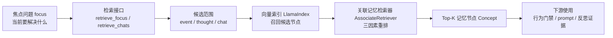
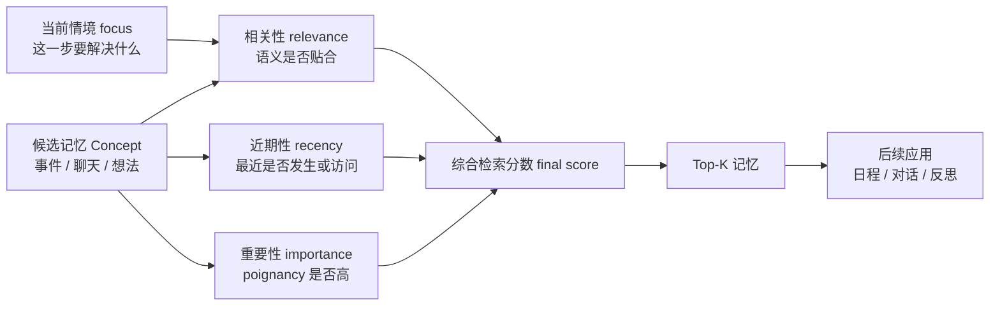

# 第 6 章 论文架构三：检索 Retrieval

记忆流 Memory Stream 让智能体拥有过去，检索 Retrieval 决定智能体此刻想起哪一部分过去。在前面的章节，克劳斯 Klaus Mueller 与阿伊莎 Ayesha Khan 的论文交流被写成了克劳斯自己的聊天 chat 记忆节点。这条记忆接下来会被再次找回：它什么时候被找回，找回时长什么样，系统为什么没有把全部记忆都塞进提示词 prompt。

检索 Retrieval 回答的问题很具体：

> 当前情境下，哪几条记忆最应该进入模型上下文？


*图 6-1：检索 Retrieval 的记忆检索工作台*

## 6.1 从克劳斯 Klaus Mueller 再次想起论文对话开始

`book-custom-discussion` 的 `20240213-10:20`，克劳斯 Klaus Mueller 在图书馆向阿伊莎 Ayesha Khan 请教中产阶级化论文的写作开头。压缩阅读入口是 `generative_agents\results\compressed\book-custom-discussion\simulation.md`，本节继续看这段经历在断点 checkpoint 和本地记忆 `generative_agents\results\checkpoints\book-custom-discussion\storage\克劳斯\associate\docstore.json` 中如何被找回。

```json
{
  "id_": "node_25",
  "text": "克劳斯向阿伊莎请教中产阶级化论文的写作开头，阿伊莎建议用调研中的真实场景或街巷改造前后对比来切入。",
  "metadata": {
    "node_type": "chat",
    "subject": "克劳斯",
    "predicate": "对话",
    "object": "阿伊莎",
    "address": "the Ville:奥克山学院:图书馆:图书馆桌子",
    "poignancy": 3,
    "create": "20240213-10:30:00",
    "access": "20240213-10:30:00"
  }
}
```

10 分钟后，系统再次处理克劳斯 Klaus Mueller 的行为时，日志里出现了一条关键记录：

证据路径：`generative_agents\results\checkpoints\book-custom-discussion\book-custom-discussion.log`

```text
==========      Simulate Step[17/72, time: 2024-02-13 10:40:00]       ==========
2026-06-29 01:15:58,744 agent.py[ln:306]<INFO> 克劳斯 percept 5/5 concepts
2026-06-29 01:16:00,641 agent.py[ln:515]<INFO> retrieved chat between 克劳斯 and 阿伊莎(10 min):
chat(P.3): 克劳斯向阿伊莎请教中产阶级化论文的写作开头，阿伊莎建议用调研中的真实场景或街巷改造前后对比来切入。 @ the Ville:奥克山学院:图书馆:图书馆桌子
duration: 20240213-10:30 ~ 20240314-10:30 (access: 20240213-10:30)
2026-06-29 01:16:00,641 agent.py[ln:420]<INFO> 克劳斯 is determining action...
```

这段日志说明三件事：
- 第一，`node_25` 没有停留在静态文件里，它被 `retrieve_chats()` 找回。
- 第二，找回结果不是一句裸文本，而是带有类型 `chat`、重要性 `P.3`、地点和时间范围的记忆节点 Concept。
- 第三，这条记忆直接参与当前行为判断：克劳斯 Klaus Mueller 刚和阿伊莎 Ayesha Khan 聊过，系统会避免他马上重复发起同类对话。

检索 Retrieval 不等于“把记忆读出来给人看”。它是运行时的选择机制：同一个角色拥有很多记忆，但当前行为只能使用其中一小部分。

## 6.2 为什么不能读取全部记忆

把所有记忆都放进提示词 prompt，是最直接也最容易失败的方案。

实验 `book-custom-discussion` 推进到 `20240213-19:50` 后（`generative_agents\results\checkpoints\book-custom-discussion\simulate-20240213-1950.json`），克劳斯 Klaus Mueller 的断点 checkpoint 已经持有 153 条事件 event、18 条想法 thought 和 18 条聊天 chat。完整清单已经接近 200 条，如果全部塞进提示词 prompt，克劳斯 Klaus Mueller 当前正在做什么、刚和谁聊过、哪件事对论文写作最相关，都会被大量日常事件淹没。

| 问题 | 表现 | 对行为的影响 |
| --- | --- | --- |
| 上下文有限 | 单个角色一天就可能产生几十到几百条记忆。 | 长期运行后，全部记忆无法进入提示词 prompt。 |
| 噪声过多 | 起床、吃饭、移动、看见空椅子等日常记忆数量很多。 | 模型容易抓错重点。 |
| 关键事件被稀释 | 论文建议、派对邀请、关系变化被琐事包围。 | 角色会忘记承诺或错过社会事件。 |
| 记忆互相冲突 | 同一活动时间、地点、态度可能出现不一致说法。 | 模型可能混淆事实，生成错误行为。 |
| 缺少当前目标 | “全部记忆”没有告诉模型此刻应该关注什么。 | 对话、计划和反应会变得散。 |

*表 6-1：不能读取全部记忆的原因。检索 Retrieval 的目标不是拿到更多记忆，而是拿到当前最有用的少量记忆。*

## 6.3 检索 Retrieval 的输入、处理、输出

检索 Retrieval 可以先按输入 input、处理 process、输出 output 三层读。

| 环节 | 真实项目对象 | 读法 | 输出到哪里 |
| --- | --- | --- | --- |
| 输入 input | 焦点问题 focus、检索接口、候选节点范围。 | 当前任务到底在问什么，要查哪类记忆。 | 传入 `retrieve_focus()`、`retrieve_chats()`、`retrieve_events()` 等接口。 |
| 处理 process | 向量索引 LlamaIndex 召回、关联记忆检索器 AssociateRetriever 重排。 | 先找语义相关，再按新近、相关和重要综合排序。 | 形成重排后的记忆节点 Concept 列表。 |
| 输出 output | Top-K 记忆节点 Concept。 | 当前上下文最值得想起的过去经验。 | 进入行为门禁、提示词 prompt、关系总结或反思证据。 |

*表 6-2：检索 Retrieval 的输入、处理和输出。检索不是“查数据库”，而是为当前行为挑选上下文材料。*

这条链路在项目中可以压缩成：


```mermaid
flowchart LR
    Focus["焦点问题 focus<br/>当前要解决什么"] --> Interface["检索接口<br/>retrieve_focus / retrieve_chats"]
    Interface --> Scope["候选范围<br/>event / thought / chat"]
    Scope --> Index["向量索引 LlamaIndex<br/>召回候选节点"]
    Index --> Rerank["关联记忆检索器 AssociateRetriever<br/>三因素重排"]
    Rerank --> TopK["Top-K 记忆节点 Concept"]
    TopK --> Consumer["下游使用<br/>行为门禁 / prompt / 反思证据"]
```

*图 6-2：检索 Retrieval 的数据流。输入不是全部记忆，而是当前任务给出的焦点问题 focus 或对话对象。*

一次计划前的检索输入可以这样读：

```python
focus = [
    "伊莎贝拉 在 2024年02月14日（星期三） 的计划。",
    "在 伊莎贝拉 的生活中，重要的近期事件。",
]
retrieved = associate.retrieve_focus(focus)
```

这段输入问的是两件事：今天计划需要哪些过去经验，最近有哪些重要事件会影响伊莎贝拉 Isabella Rodriguez。检索输出不是纯字符串，而是一组记忆节点 Concept。进入提示词 prompt 前，系统通常会使用每条记忆的时间和描述：

```text
2024-02-13 09:30: 伊莎贝拉邀请阿伊莎参加 2 月 14 日下午 5 点的情人节派对。
2024-02-13 11:10: 阿伊莎表示她可能会带一段莎士比亚戏剧选段来分享。
2024-02-13 15:00: 山姆告诉伊莎贝拉，他准备参加下个月的地方市长选举。
```

这些记忆进入提示词 prompt 后，才会变成日程、对话、反思和后续行动的材料。

### 焦点问题 focus 决定想起什么

检索 Retrieval 必须带着问题发生。没有焦点问题 focus，系统不知道要找什么。项目中的 focus 来自不同认知任务。

| 任务 | focus 从哪里来 | focus 样例 | 检索用途 |
| --- | --- | --- | --- |
| 生成日程 Planning | `make_schedule()` 构造“某人在某日的计划”“重要的近期事件”。 | `克劳斯 在 2024年02月13日（星期二） 的计划。` | 更新 `currently`，再生成当天计划。 |
| 反思 Reflection | `reflect_focus` 先根据近期记忆生成问题。 | `克劳斯和玛丽亚的共同兴趣是什么？` | 按问题检索证据，再生成洞察 insight。 |
| 社交反应 Reacting | `_reaction()` 根据当前感知到的人或事件调用 `get_relation()`。 | `我和这个人或事件有什么关系？` | 判断是否聊天、等待或忽略。 |
| 生成对话 Dialogue | `prompt_generate_chat()` 用关系、对方当前事件、最近对话构造上下文。 | `我和对方最近聊过什么？` | 找回相关记忆，让对话接上过去。 |
| 关系总结 | `prompt_summarize_relation()` 用对方名字检索。 | `阿伊莎 Ayesha Khan` | 总结两个角色之间的关系。 |

*表 6-3：不同任务会提出不同焦点问题 focus，因此同一批记忆会被不同方式取回。*

聊天 Dialogue 里的焦点构造更具体，源码入口：`generative_agents\modules\prompt\scratch.py`

```python
focus = [relation, other.get_event().get_describe()]
if len(chats) > 4:
    focus.append("; ".join("{}: {}".format(n, t) for n, t in chats[-4:]))
nodes = agent.associate.retrieve_focus(focus, 15)
chat_nodes = agent.associate.retrieve_chats(other.name)
```

这段代码把关系、对方当前事件、最近对话同时作为检索线索。于是克劳斯 Klaus Mueller 和阿伊莎 Ayesha Khan 再次相遇时，系统不会只看“当前图书馆里有谁”，还会尝试找回两人刚刚聊过的论文写作建议。

## 6.4 候选记忆从哪里来

候选记忆来自每个角色自己的关联记忆 Associate。第 5 章已经看到，关联记忆 Associate 按 `event`、`thought`、`chat` 三类保存节点编号；第 6 章继续看这些编号如何被检索接口消费。

源码入口：`generative_agents\modules\memory\associate.py`

```python
def retrieve_events(self, text=None):
    return self._retrieve_nodes("event", text)

def retrieve_thoughts(self, text=None):
    return self._retrieve_nodes("thought", text)

def retrieve_chats(self, name=None):
    text = ("对话 " + name) if name else None
    return self._retrieve_nodes("chat", text)

def retrieve_focus(self, focus, retrieve_max=30, reduce_all=True):
    node_ids = self.memory["event"] + self.memory["thought"]
    for text in focus:
        nodes = self._index.retrieve(
            text,
            similarity_top_k=len(node_ids),
            node_ids=node_ids,
            retriever_creator=_create_retriever,
        )
```

| 检索接口 | 候选范围 | 典型问题 | 输出 |
| --- | --- | --- | --- |
| 事件检索 `retrieve_events(text=None)` | 事件 event。 | 最近发生了什么，或者某个事件相关的现场记忆是什么。 | 事件 event 类型的记忆节点 Concept。 |
| 想法检索 `retrieve_thoughts(text=None)` | 想法 thought。 | 过去形成过哪些计划、反思或摘要判断。 | 想法 thought 类型的记忆节点 Concept。 |
| 聊天检索 `retrieve_chats(name=None)` | 聊天 chat。 | 我和某个人最近聊过什么。 | 聊天 chat 类型的记忆节点 Concept。 |
| 焦点检索 `retrieve_focus(focus, retrieve_max=30, reduce_all=True)` | 事件 event + 想法 thought。 | 当前任务给出的一个或多个焦点问题 focus 需要哪些记忆。 | 合并去重后的 Top-K 记忆节点 Concept。 |
| 关系上下文 `get_relation(node)` | 与当前节点描述相关的事件 event 和想法 thought。 | 我和眼前这个人或事件有什么关系。 | `node`、`events`、`thoughts` 三部分关系上下文。 |

*表 6-4：项目中的检索接口。不同接口回答不同问题，不能把检索 Retrieval 简化成一个向量搜索调用。*

`retrieve_chats("阿伊莎")` 会把查询文本构造成 `对话 阿伊莎`，并只在克劳斯 Klaus Mueller 自己的聊天 chat 记忆里查找。`retrieve_focus()` 则默认只查事件 event 和想法 thought，不直接查聊天 chat；对话记忆通常由 `retrieve_chats()` 单独处理。

## 6.5 三因素重排：近期性 recency、相关性 relevance、重要性 importance

向量索引 LlamaIndex 先召回候选节点，关联记忆检索器 AssociateRetriever 再把候选节点重排。重排逻辑来自三类分数：近期性 recency、相关性 relevance、重要性 importance。

源码入口：`generative_agents\modules\memory\associate.py`

```python
nodes = self._vector_retriever.retrieve(query_bundle)
nodes = sorted(nodes, key=lambda n: utils.to_date(n.metadata["access"]), reverse=True)

fac = self._config["recency_decay"]
recency_scores = self._normalize(
    [fac**i for i in range(1, len(nodes) + 1)],
    self._config["recency_weight"],
)
relevance_scores = self._normalize(
    [n.score for n in nodes],
    self._config["relevance_weight"],
)
importance_scores = self._normalize(
    [n.metadata["poignancy"] for n in nodes],
    self._config["importance_weight"],
)
final_scores = {
    n.id_: r1 + r2 + i
    for n, r1, r2, i in zip(nodes, recency_scores, relevance_scores, importance_scores)
}
nodes = sorted(nodes, key=lambda n: final_scores[n.id_], reverse=True)
```

| 维度 | 项目来源 | 解决什么问题 | 如果缺失会怎样 |
| --- | --- | --- | --- |
| 近期性 recency | `metadata["access"]` 和 `recency_decay`。 | 刚发生或刚想起的记忆更容易影响当前行为。 | 克劳斯 Klaus Mueller 可能忽略刚和阿伊莎 Ayesha Khan 聊过论文。 |
| 相关性 relevance | 向量召回分数 `node.score`。 | 当前焦点问题 focus 与记忆内容是否贴合。 | 系统会想起重要但不合时宜的事。 |
| 重要性 importance | 元数据 `metadata["poignancy"]`。 | 重要经历不被日常琐事淹没。 | 论文建议、派对邀请和关系变化会输给普通移动事件。 |

*表 6-5：检索 Retrieval 的三个维度。可信行为需要三者平衡，而不是只看语义相似度。*

三因素模型可以这样看：


```mermaid
flowchart LR
    Query["当前情境 focus<br/>这一步要解决什么"] --> Relevance["相关性 relevance<br/>语义是否贴合"]
    Memory["候选记忆 Concept<br/>事件 / 聊天 / 想法"] --> Relevance
    Memory --> Recency["近期性 recency<br/>最近是否发生或访问"]
    Memory --> Importance["重要性 importance<br/>poignancy 是否高"]

    Relevance --> Score["综合检索分数 final score"]
    Recency --> Score
    Importance --> Score
    Score --> TopK["Top-K 记忆"]
    TopK --> Prompt["后续应用<br/>日程 / 对话 / 反思"]
```

*图 6-3：近期性 recency、重要性 importance 和相关性 relevance 的三因素模型。检索 Retrieval 决定的是当前提示词 prompt 里出现哪几条过去经验。*

**公式 6-1：综合检索分数 final score**

$$
\text{final}(m, q)
= \operatorname{norm}(r_{\text{time}}(m), w_{\text{recency}})
+ \operatorname{norm}(s_{\text{vector}}(m, q), w_{\text{relevance}})
+ \operatorname{norm}(p(m), w_{\text{importance}})
$$

读法：对候选记忆 \(m\) 和当前查询 \(q\)，系统分别计算时间近期性、向量相关性和重要性，再把三类分数归一化到各自权重区间后相加。

| 符号 | 中文含义 | 项目来源 |
| --- | --- | --- |
| $m$ | 候选记忆节点 Concept。 | 向量索引 LlamaIndex 召回的节点。 |
| $q$ | 当前查询或焦点问题 focus。 | `retrieve_focus(focus)` 的每个文本问题。 |
| $r_{\mathrm{time}}(m)$ | 时间近期性原始分数。 | 按访问时间 `access` 排序后，用 `recency_decay` 生成。 |
| $s_{\mathrm{vector}}(m, q)$ | 向量相关性原始分数。 | `node.score`。 |
| $p(m)$ | 重要性原始分数。 | 元数据 `metadata["poignancy"]`。 |
| $w_{\mathrm{recency}}$ | 近期性权重。 | `recency_weight`，默认 `0.5`。 |
| $w_{\mathrm{relevance}}$ | 相关性权重。 | `relevance_weight`，默认 `3`。 |
| $w_{\mathrm{importance}}$ | 重要性权重。 | `importance_weight`，默认 `2`。 |

当前默认参数是：

| 参数 | 默认值 | 中文意思 | 行为倾向 |
| --- | --- | --- | --- |
| `recency_decay` | `0.995` | 近期性衰减系数。 | 候选越靠后，近期性越低。 |
| `recency_weight` | `0.5` | 近期性权重。 | 近期性有影响，但不是主导因素。 |
| `relevance_weight` | `3` | 相关性权重。 | 当前语境匹配度最重要。 |
| `importance_weight` | `2` | 重要性权重。 | 重大事件会明显抬高排名。 |
| `retrieve_max` | `retrieve_focus()` 默认 `30`。 | 最多返回多少条重排后的记忆。 | 控制进入后续提示词 prompt 的记忆数量。 |

*表 6-6：检索 Retrieval 默认参数。这个实现偏向“先贴合当前问题，再保留重要事件，最后参考近期性”。*

回到 `node_25`，它在 10:40 被找回时，三个维度可以这样读：

| 候选记忆 | 近期性 recency | 相关性 relevance | 重要性 importance | 综合判断 |
| --- | --- | --- | --- | --- |
| 克劳斯 Klaus Mueller 刚向阿伊莎 Ayesha Khan 请教论文开头。 | 高，10 分钟前创建。 | 高，当前对话对象仍是阿伊莎 Ayesha Khan。 | 中，`poignancy = 3`。 | 应该被找回，并用于避免重复对话。 |
| 克劳斯 Klaus Mueller 早餐时看到冰箱装着早餐食物。 | 低，距离当前任务较远。 | 低，与阿伊莎 Ayesha Khan 和论文无关。 | 低，普通日常事件。 | 不该主导当前行为。 |
| 克劳斯 Klaus Mueller 当天计划继续写研究论文。 | 中，属于当天计划。 | 中，与论文写作相关。 | 中，计划类想法。 | 可能作为背景，但不如刚发生的对话直接。 |

*表 6-7：围绕 `node_25` 的三因素排序读法。检索 Retrieval 不是选择“最重要的一条”，而是选择当前情境下综合最合适的记忆。*

## 6.6 检索结果的后续应用

检索 Retrieval 本身不直接生成计划、想法、状态。它先检索出少量记忆，再由提示词 prompt 把这些记忆压缩成更适合计划模块使用的状态材料。

源码入口：`generative_agents\modules\agent.py`

```python
focus = [
    f"{self.name} 在 {utils.get_timer().daily_format_cn()} 的计划。",
    f"在 {self.name} 的生活中，重要的近期事件。",
]
retrieved = self.associate.retrieve_focus(focus)
if retrieved:
    plan = self.completion("retrieve_plan", retrieved)
    thought = self.completion("retrieve_thought", retrieved)
    self.scratch.currently = self.completion("retrieve_currently", plan, thought)
```

可以看到，日程 Planning 入口会先构造两个焦点问题 focus，再调用 `retrieve_focus(focus)`。如果取回了记忆节点 Concept，系统会连续调用三份提示词 prompt。

| 阶段 | 提示词 prompt | 输入变量 | 输出结构 schema | 回调 callback | 兜底值 failsafe |
| --- | --- | --- | --- | --- | --- |
| 计划描述 | `retrieve_plan.txt` | `description`、`agent`、`date`。 | `res: list[str]`。 | 检查列表非空。 | 从候选记忆随机取 5 条描述。 |
| 当前想法 | `retrieve_thought.txt` | `description`、`agent`。 | `res: str`。 | 去掉空白；为空时回退。 | `某某 应该遵循昨天的日程`。 |
| 当前状态 | `retrieve_currently.txt` | `agent`、`time`、`currently`、`plan`、`thought`、`current_time`。 | `res: str`。 | 去掉空白；为空时回退。 | 保留旧的 `currently`。 |

*表 6-8：检索结果进入日程 Planning 前的提示词 prompt 压缩层。它们不是检索排序算法，而是把 Top-K 记忆变成当天状态材料。*

三份提示词 prompt 的完整模板如下：

<table>
  <tr>
    <th style="width: 50%;"><code>retrieve_plan.txt</code></th>
    <th style="width: 20%;"><code>retrieve_thought.txt</code></th>
    <th style="width: 30%;"><code>retrieve_currently.txt</code></th>
  </tr>
  <tr>
    <td><pre><code>根据给定的记忆节点，生成智能体的计划描述。
示例：
"""
记忆节点：
2023-12-15 08:00: 凯莉在厨房做早餐
2023-12-15 09:00: 凯莉计划今天去超市购物
2023-12-15 14:00: 凯莉昨天和朋友聊天很愉快
生成5个计划描述： [
  "凯莉今天早上准备了营养早餐", "凯莉计划去超市购买生活用品",
  "凯莉重视与朋友的社交关系", "凯莉的生活很有规律", "凯莉注重健康饮食" ]
参考示例，为以下记忆节点生成计划描述：
"""
记忆节点：${description}， 智能体：${agent}， 当前日期：${date}
"""
确保返回的数据格式遵守schema：["计划描述1", "计划描述2", "计划描述3", ...]
要求：
- 计划描述要基于给定的记忆节点
- 描述要简洁明了，符合智能体的生活习惯
- 确保返回的数据格式遵守schema</code></pre></td>
    <td><pre><code>"""
${description}
"""

根据以上内容，以 ${agent} 的视角，用一句话总结 ${agent} 此刻的想法和感受：</code></pre></td>
    <td><pre><code>${agent} 在 ${time} 的状态：
${currently}

${agent} 在 ${time} 结束时记得这些事情：
${plan}

${agent} 在 ${time} 结束时的想法和感受：
${thought}

现在是 ${current_time}。根据上述情况，以第三人称，用一句话描述 ${agent} 在 ${current_time} 的状态，以反映 ${agent} 在 ${time} 结束时的想法和感受。</code></pre></td>
  </tr>
</table>

*表 6-9：三份检索提示词 prompt 的完整模板。第一列把检索结果整理成计划描述，第二列压成当前想法，第三列合成新的当前状态 currently。*

这里的 `description` 不是原始全部记忆，而是检索 Retrieval 已经挑出来的一组记忆。`retrieve_plan.txt` 把记忆压成计划描述，`retrieve_thought.txt` 把记忆压成一句当前想法，`retrieve_currently.txt` 再把旧状态、计划描述和当前想法合成新的 `Scratch.currently`。

## 6.7 检索失败与参数设计

检索失败会直接变成行为失败。排查时不要只问“记忆有没有存下来”，还要问“关键场景下有没有想起正确记忆”。

| 失败表现 | 可能原因 | 检查位置 | 修正方向 |
| --- | --- | --- | --- |
| 忘记承诺 | 相关记忆写入了，但没有被当前 focus 召回。 | `retrieve_focus()` 查询文本、角色后续日程和对话记录。 | 调整 focus 生成方式，或提高相关记忆的重要性 importance。 |
| 重复寒暄 | 历史聊天 chat 没有进入当前对话上下文。 | `retrieve_chats(name)`、`book-custom-discussion.log` 中的 retrieved chat 记录。 | 检查对方姓名、聊天记忆写入和对话前上下文拼接。 |
| 忽略关系 | 关系立场散在事件 event 和想法 thought 中，未被聚合。 | `get_relation(node)` 返回的 `events` 和 `thoughts`。 | 增强关系总结，或把关键关系写成想法 thought。 |
| 反思变浅 | 反思 Reflection 的焦点问题太泛，检索证据弱。 | `reflect_focus` 输出、`retrieve_focus(..., reduce_all=False)`。 | 让反思问题更具体，保留证据链。 |
| 幻觉补全 | 模型说出没有证据的过去事件。 | 对话原文、检索结果、记忆节点 Concept。 | 回到原始证据复核，增加事实回查或冲突检测。 |

*表 6-10：检索 Retrieval 失败的诊断表。检索既是防幻觉机制，也是风险入口。*

检索参数也会改变角色表现。

| 调整方向 | 角色表现 | 风险 | 适合观察什么 |
| --- | --- | --- | --- |
| 提高近期性权重 `recency_weight` | 更容易受刚发生的事影响。 | 容易被琐碎新事件带跑。 | 刚发生的小事件是否频繁进入对话。 |
| 提高相关性权重 `relevance_weight` | 更贴合当前问题。 | 可能错过长期重要背景。 | 回答是否更聚焦，但关系背景是否变浅。 |
| 提高重要性权重 `importance_weight` | 更重视重大事件和关系变化。 | 可能反复提大事，忽略眼前场景。 | 论文建议、派对、关系变化是否更容易被提起。 |
| 降低返回上限 `retrieve_max` | 提示词 prompt 更干净。 | 关键证据可能进不来。 | 输出是否更稳定，但证据是否变少。 |
| 提高返回上限 `retrieve_max` | 证据更充分。 | 噪声增加，模型更容易混淆。 | 对话是否变长，是否出现事实混合。 |

*表 6-11：检索参数对行为风格的影响。检索 Retrieval 权重本质上是系统对“什么值得被想起”的设计。*

检索 Retrieval 能降低幻觉，但不能彻底消除幻觉。如果检索系统提供了准确记忆，模型更可能基于真实上下文说话；如果检索召回了错误记忆，或者记忆本身来自错误摘要，模型也会把错误继续传播。

## 6.8 可运行脚本：观察一次检索 Retrieval

第 6 章的机制可以用一个脚本直接复查。脚本入口是 `docs/book/scaffolds/part_01/ch06_retrieval_demo.py`，它不调用大语言模型 LLM，只读取 `book-custom-discussion` 的断点 checkpoint、记忆索引 docstore 和向量索引 LlamaIndex，然后分别执行聊天检索 `retrieve_chats()` 与焦点检索 `retrieve_focus()`。

从仓库根目录执行：

```powershell
python docs/book/scaffolds/part_01/ch06_retrieval_demo.py --retrieve-max 3
```

这个命令的输入可以按下表读：

| 输入项 | 默认值 | 作用 |
| --- | --- | --- |
| 实验 experiment | `book-custom-discussion` | 指定读取哪一次仿真实验的断点 checkpoint。 |
| 角色 agent | `克劳斯` | 指定从谁的关联记忆 Associate 中检索。 |
| 对话对象 chat_with | `阿伊莎` | 传给 `retrieve_chats("阿伊莎")`，检查两个人最近聊过什么。 |
| 早期断点 early_time | `20240213-10:40` | 对应 `node_25` 刚写入后的状态，用来观察聊天 chat 记忆如何被找回。 |
| 后期断点 late_time | `20240213-19:50` | 对应实验结束前的状态，用来观察大量记忆中的 Top-K 检索。 |
| 返回上限 retrieve_max | `3` | 控制每个焦点问题 focus 展示多少条检索结果。 |

*表 6-12：第 6 章检索 Retrieval 脚本的输入参数。脚本读取真实断点 checkpoint，不构造模拟记忆。*

本次运行的真实输出如下：

```text
第 6 章检索 Retrieval 脚本应用
================================================================
实验 experiment: book-custom-discussion
角色 agent: 克劳斯 Klaus Mueller
对话对象 chat_with: 阿伊莎 Ayesha Khan
焦点问题数量 focus_count: 2

[1] 读取早期断点 checkpoint: 20240213-10:40
记忆清单 memory: event=29, thought=1, chat=1
执行 retrieve_chats("阿伊莎")
  [1] node_25 | chat | P.3 | create=20240213-10:30 | address=the Ville:奥克山学院:图书馆:图书馆桌子
      克劳斯向阿伊莎请教中产阶级化论文的写作开头，阿伊莎建议用调研中的真实场景或街巷改造前后对比来切入。

[2] 读取后期断点 checkpoint: 20240213-19:50
记忆清单 memory: event=153, thought=18, chat=18
候选范围 candidate_scope: retrieve_focus 默认检索 event + thought，不直接检索 chat

焦点问题 focus: 克劳斯 在 2024年02月13日（星期二） 的计划。
  [1] node_0 | thought | P.2 | create=20240213-08:00 | address=the Ville:奥克山学院宿舍:克劳斯的房间:床
      这是 克劳斯 在 2024年02月13日（星期二）08:00 的计划：早上7点起床并完成早餐的例行工作；早上8点前往奥克山学院图书馆；上午8点30分开始撰写关于中产阶级化的研究论文；中午12点在图书馆附近吃午饭；下午1点继续写作研究论文；下午5点在霍布斯咖啡馆吃晚饭；下午6点返回图书馆继续研究论文的写作；晚上9点整理当天研究笔记并规划明天的写作计划；晚上11点准备睡觉
  [2] node_110 | thought | P.7 | create=20240213-14:00 | address=the Ville:奥克山学院:图书馆:图书馆桌子
      克劳斯 阿伊莎建议把感官描写包装成'参与式观察'的田野笔记，让我找到了在社会学论文中兼顾文学感染力和学术严谨性的巧妙平衡点。
  [3] node_109 | thought | P.4 | create=20240213-14:00 | address=the Ville:奥克山学院:图书馆:图书馆桌子
      对于 克劳斯 的计划：克劳斯需要记住：明天下午5点参加伊莎贝拉的情人节派对，以及先去图书馆翻找置换效应数据在《城市更新》文献中的出处，找到后再找阿伊莎一起梳理置换效应段的论证逻辑，同时继续按'核心论点分节+田野笔记与文献分析呼应'的结构推进论文写作。

焦点问题 focus: 在 克劳斯 的生活中，重要的近期事件。
  [1] node_171 | event | P.1 | create=20240213-18:10 | address=the Ville:奥克山学院:图书馆:图书馆桌子
      克劳斯 步行返回奥克山学院图书馆
  [2] node_110 | thought | P.7 | create=20240213-14:00 | address=the Ville:奥克山学院:图书馆:图书馆桌子
      克劳斯 阿伊莎建议把感官描写包装成'参与式观察'的田野笔记，让我找到了在社会学论文中兼顾文学感染力和学术严谨性的巧妙平衡点。
  [3] node_154 | event | P.4 | create=20240213-16:50 | address=the Ville:奥克山学院:图书馆:图书馆桌子
      克劳斯 融入访谈引用和田野观察案例

[3] 读法
- retrieve_chats() 用对话对象过滤聊天 chat，适合检查两个人最近聊过什么。
- retrieve_focus() 用焦点问题 focus 检索事件 event 和想法 thought，适合给计划、反思和关系总结提供证据。
- 同一个角色的记忆数量会持续增长，检索 Retrieval 只把少量 Top-K 记忆交给后续提示词 prompt。
```

这段输出把本章的三个结论落到了真实运行结果上。
- 第一，`20240213-10:40` 的克劳斯 Klaus Mueller 只有 1 条聊天 chat 记忆，`retrieve_chats("阿伊莎")` 精确找回 `node_25`，说明“刚才聊过什么”不是从对话日志里临时拼出来的，而是从克劳斯自己的关联记忆 Associate 中取回来的。
- 第二，`20240213-19:50` 的克劳斯 Klaus Mueller 已经有 189 条记忆索引，焦点检索 `retrieve_focus()` 没有把全部记忆交给模型，而是围绕“当天计划”和“重要近期事件”各自取回 Top-K 记忆。
- 第三，聊天 chat 与焦点 focus 的候选范围不同：`retrieve_chats()` 处理聊天节点，`retrieve_focus()` 默认处理事件 event 和想法 thought。

这个分工解释了为什么项目里会同时存在多个检索接口，而不是一个通用搜索函数解决所有问题。

脚本还可以改输入观察检索结果如何变化。例如：

```powershell
python docs/book/scaffolds/part_01/ch06_retrieval_demo.py --focus "克劳斯和阿伊莎最近如何合作论文写作？" --retrieve-max 5
```

实际执行后，关键输出如下：

```text
焦点问题 focus: 克劳斯和阿伊莎最近如何合作论文写作？
  [1] node_94 | thought | P.5 | create=20240213-14:00 | address=the Ville:奥克山学院:图书馆:图书馆桌子
      克劳斯展现了系统完整的学术研究方法论，从文献收集与查阅（5,6,14,18）、大纲搭建（13,24）、分章节起草（3,7,10,12,17）到反复修改完善（2,19），体现了迭代深化的写作流程
  [2] node_110 | thought | P.7 | create=20240213-14:00 | address=the Ville:奥克山学院:图书馆:图书馆桌子
      克劳斯 阿伊莎建议把感官描写包装成'参与式观察'的田野笔记，让我找到了在社会学论文中兼顾文学感染力和学术严谨性的巧妙平衡点。
  [3] node_99 | thought | P.4 | create=20240213-14:00 | address=the Ville:奥克山学院:图书馆:图书馆桌子
      克劳斯展现了一套完整的学术研究工作流：从文献收集、大纲规划到分步撰写与反复修改，体现了系统化、迭代式的研究方法论
  [4] node_179 | event | P.3 | create=20240213-18:50 | address=the Ville:奥克山学院:图书馆:图书馆桌子
      克劳斯 撰写研究论文主体内容
  [5] node_139 | event | P.2 | create=20240213-15:50 | address=the Ville:奥克山学院:图书馆:图书馆桌子
      阿伊莎 记录文献中的关键观点
```

焦点问题 focus 变成“克劳斯和阿伊莎最近如何合作论文写作”以后，返回结果也明显转向论文协作。`node_110` 直接对应阿伊莎 Ayesha Khan 给克劳斯 Klaus Mueller 的写作建议，`node_139` 把阿伊莎 Ayesha Khan 的文献工作拉入证据链，`node_179` 则说明克劳斯 Klaus Mueller 晚上仍在继续写论文。`node_94` 和 `node_99` 更偏克劳斯 Klaus Mueller 的个人研究工作流，它们排名靠前说明焦点检索 `retrieve_focus()` 不只是按人物共同出现检索，也会把语义相关、重要性 importance 和已有想法 thought 摘要一起纳入排序。检索 Retrieval 的工程意义正在这里：它把“角色此刻应该想起什么”变成可执行、可复查、可调参的系统行为。

## 6.9 本章小结

检索 Retrieval 是“角色此刻想起什么”的系统机制。记忆流 Memory Stream 保存过去，检索 Retrieval 选择当前能进入行为判断或提示词 prompt 的过去。真正影响行为的，不是全部记忆，而是被检索出来的那一小组记忆。

第 6 章沿着克劳斯 Klaus Mueller 的 `node_25` 走完了一条主线：论文对话先写成聊天 chat 记忆，随后被 `retrieve_chats("阿伊莎")` 找回，成为当前行为判断的一部分。日程 Planning、反思 Reflection 和关系总结等任务则通过焦点问题 focus 调用 `retrieve_focus()`，再把 Top-K 记忆送入 `retrieve_plan.txt`、`retrieve_thought.txt` 和 `retrieve_currently.txt`。

下一章进入反思 Reflection。检索 Retrieval 可以让智能体想起相关过去，但只想起过去还不够。智能体还需要把零散经历归纳成更高层的判断，并把这些判断重新写回记忆流 Memory Stream。

## 参考资料

- Joon Sung Park, Joseph C. O'Brien, Carrie J. Cai, Meredith Ringel Morris, Percy Liang, Michael S. Bernstein. *Generative Agents: Interactive Simulacra of Human Behavior*. arXiv: https://arxiv.org/abs/2304.03442
- ar5iv full text: https://ar5iv.labs.arxiv.org/html/2304.03442
- Local source: `generative_agents/modules/memory/associate.py`
- Local source: `generative_agents/modules/storage/index.py`
- Local source: `generative_agents/modules/agent.py`
- Local source: `generative_agents/modules/prompt/scratch.py`
- Local scaffold: `docs/book/scaffolds/part_01/ch06_retrieval_demo.py`
- Local prompt: `generative_agents/data/prompts/retrieve_plan.txt`
- Local prompt: `generative_agents/data/prompts/retrieve_thought.txt`
- Local prompt: `generative_agents/data/prompts/retrieve_currently.txt`
- Local evidence: `generative_agents/results/compressed/book-custom-discussion/simulation.md`
- Local evidence: `generative_agents/results/checkpoints/book-custom-discussion/storage/克劳斯/associate/docstore.json`
- Local evidence: `generative_agents/results/checkpoints/book-custom-discussion/book-custom-discussion.log`
- Local evidence: `generative_agents/results/checkpoints/book-custom-discussion/simulate-20240213-1950.json`
