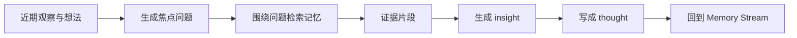
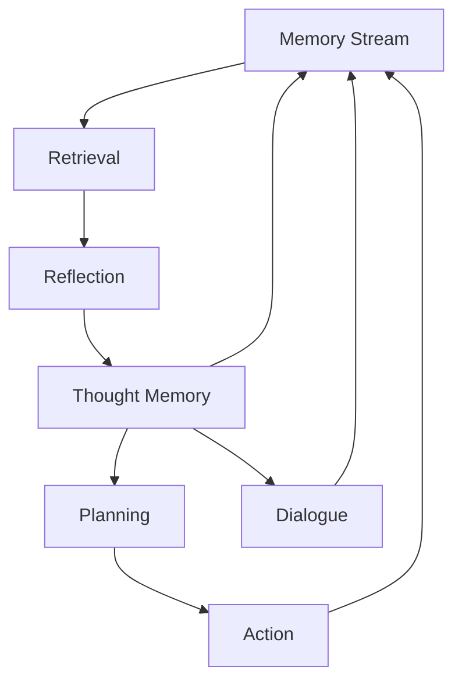
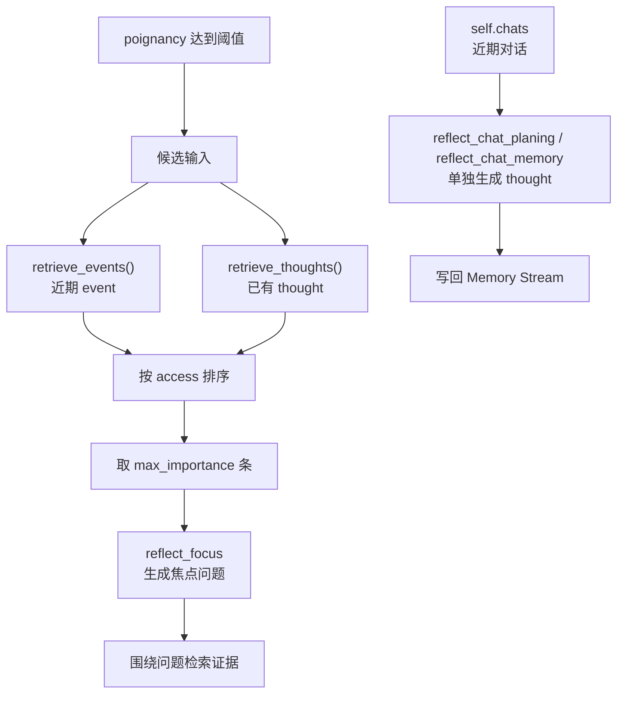

# 第 7 章 论文架构四：Reflection

## 7.1 核心问题

Retrieval 解决的是“智能体在需要行动时，应该想起哪些过去经历”。Reflection 解决的是“智能体如何从经历中形成高层判断”。人并不是每次都从原始经历重新推理一遍。人会总结、归纳，并形成对自己、他人、关系、环境和未来的较稳定判断。例如，一个人不是只记得：

- 昨天和某人聊过学业。
- 今天在咖啡馆又遇到这个人。
- 对方也喜欢探索新想法。
- 对方愿意继续交流。

他可能会进一步形成一个高层判断：

> 我与这个人有共同兴趣，未来可以更主动地交流。

这种高层判断不是直接观察到的物理事件，而是从多个观察中归纳出来的。Generative Agents 论文把这种机制称为 Reflection。Reflection 让智能体不只记录世界，也解释世界；不只保存过去，也把过去压缩成能够影响未来的认知结构。



*图 7-1：Reflection 的基本链路。反思不是直接总结全部历史，而是先提出问题，再围绕问题找证据并生成高层想法。*

## 7.2 原始观察的局限

只保存 observation，会留下三个缺口。

### 记忆太碎

真实生活中的经验大多是碎片化的。一个人一天可能看到几十个事件，听到几段对话，执行许多动作。这些记录单独看都很小：

- 在厨房吃早餐。
- 在咖啡馆看到某人。
- 听说有人要参加派对。
- 和朋友聊了几句作业。
- 计划下午去图书馆。

如果智能体每次决策都从这些碎片直接推理，它会依赖当次 prompt 的临场能力。只要检索少了一两条关键记忆，高层判断就会断裂。

### 低层事件不等于长期认知

- “克劳斯和玛丽亚在咖啡馆聊天”是一条事件。
- “克劳斯认为玛丽亚也喜欢探索新想法”是一个认知。
- “克劳斯愿意继续和玛丽亚交流”则是一个可能影响未来行为的社交倾向。

这三者不是同一层东西。Memory stream 保存低层事件，但可信行为需要高层认知。Reflection 的作用，就是在低层记忆和高层行为之间建立一层解释结构。

### 行为连续性需要抽象

如果智能体没有抽象能力，它的行为连续性只能依赖重复检索过去事件。这样很脆弱。比如克劳斯再次遇到玛丽亚时，系统可能检索到“在咖啡馆聊天”，但没有检索到“共同兴趣”。于是他只会寒暄，而不会表现出“上次交流改变了我对你的认识”。有了 Reflection，系统可以把一组碎片经验变成 thought：

```text
克劳斯发现玛丽亚虽然专业不同，但同样喜欢探索新想法，未来可以继续和她交流。
```

这条 thought 之后会像事件一样被保存、检索和使用。智能体不需要每次从零归纳。

## 7.3 Reflection 不是总结聊天记录

很多人在第一次读 Generative Agents 时，会把 Reflection 理解成“记忆总结”。这个理解太浅。总结通常是压缩，Reflection 是解释。压缩关心的是更短地表达已有信息；解释关心的是从已有信息中得出新的高层判断。例如，下面是一段压缩：

```text
克劳斯和玛丽亚在咖啡馆聊了学习、兴趣和近期计划。
```

下面是一段 Reflection：

```text
克劳斯认为玛丽亚愿意讨论开放性问题，这让他觉得她可能是适合深入交流的人。
```

两者差别很大。前者回答“发生了什么”。后者回答“这件事意味着什么”。论文中的 Reflection 不是为了省 token，也不是为了替代完整记忆流。它的关键价值在于生成更抽象的 thought，并把这些 thought 重新放入 memory stream。这样，后续 Retrieval 可以同时检索到事件和洞察。

> 这也是 Generative Agents 与普通聊天机器人记忆总结的差别。普通总结往往是外部维护的上下文压缩。Generative Agents 的 Reflection 是智能体内部认知状态的一部分。

## 7.4 Reflection 在整体架构中的位置

论文的架构可以简化为下面这条链：

```text
观察世界
  -> 写入 memory stream
  -> 根据当前任务 retrieval
  -> 生成计划、反应、对话
  -> 重要记忆积累到阈值
  -> reflection 生成 thought
  -> thought 再写回 memory stream
```

Reflection 不是独立模块。它和 Memory Stream、Retrieval、Planning、Dialogue 都连接在一起。

| 连接模块 | Reflection 的关系 |
| --- | --- |
| Memory Stream | 从已有经历中生成洞察，并把 thought 写回记忆流。 |
| Retrieval | 围绕焦点问题检索相关记忆，避免读取全部历史。 |
| Planning | 让计划受角色目标、关系判断和近期理解影响。 |
| Dialogue | 让对话主题、语气、邀请和回避依赖长期判断。 |
| Social Simulation | 让关系网络通过观察、对话和反思逐步变化。 |

*表 7-1：Reflection 与其他架构模块的关系。Reflection 的位置不是独立总结器，而是记忆、检索、计划和对话之间的认知转换层。*Reflection 让小镇中的角色出现“经历之后的改变”。没有它，智能体可以看起来忙碌，但不容易成长。



*图 7-2：Reflection 与 Memory、Retrieval、Planning、Dialogue 的连接。反思生成的 thought 不是外部笔记，而是会继续影响计划和对话的长期认知。*

## 7.5 何时触发 Reflection

论文并不是每发生一件事就反思一次。频繁反思成本高，也会让角色对小事过度解读。更合理的做法是：事件先获得 importance score；近期重要性累积到阈值后，再触发 Reflection。Generative Agents 使用 `poignancy` 表示“触动程度”或“重要程度”。事件写入记忆时，系统会调用重要性评分：

```text
poignancy_event
poignancy_chat
```

项目中的 prompt 要求模型在 1 到 10 之间打分。普通日常事件得分低，分手、录取、争吵等强烈事件得分高。`Agent.reflect()` 中的触发条件很直接：

```python
if self.status["poignancy"] < self.think_config["poignancy_max"]:
    return
```

累计触动程度低于阈值时，智能体直接跳过 Reflection。`poignancy_max` 出现在 `generative_agents/data/config.json`，用于控制反思频率。

## 7.6 Reflection 的输入边界

触发 Reflection 后，系统先准备候选输入，再生成焦点问题。它不会直接读取全部 memory stream。Generative Agents 中的核心代码是：

```python
nodes = self.associate.retrieve_events() + self.associate.retrieve_thoughts()
nodes = sorted(nodes, key=lambda n: n.access, reverse=True)[
    : self.associate.max_importance
]
```

这段逻辑有三个约束：

- 常规候选输入来自 `event` 和 `thought`。
- 候选输入按 `access` 取近期内容。
- 输入数量受 `max_importance` 控制。

| 输入类型 | 中文意思 | 在 Reflection 中的作用 | 边界 |
| --- | --- | --- | --- |
| `event` | 观察、行动、对话等低层事件。 | 提供事实证据。 | 单条 event 太碎，不能直接代表长期认知。 |
| `thought` | 过去反思生成的高层想法。 | 提供已有判断，让 Reflection 可以递归。 | thought 也可能过度概括，需要新证据校正。 |
| `chat` | 对话记忆。 | 不进入这一步的 `event + thought` 候选池。 | 对话会在后面通过 `self.chats` 分支单独整理成 thought。 |

*表 7-2：Reflection 的候选输入边界。常规反思读取近期 event 和 thought，对话走单独摘要分支。*



*图 7-3：Reflection 的输入筛选路径。常规反思先筛 event 和 thought，对话再通过单独分支写成 thought。*Reflection 的输入边界决定了它不是“总览全部历史”，也不是“只看最后一件事”。它先从近期事件和已有 thought 中提出问题，再把问题交给 Retrieval 寻找证据。

## 7.7 从候选记忆到焦点问题

Reflection 不直接总结候选记忆，而是先生成焦点问题。

```python
focus = self.completion("reflect_focus", nodes, 3)
```

`reflect_focus.txt` 的任务是根据候选记忆提出几个值得深入思考的问题。给定这组记忆：

```text
克劳斯今天在咖啡馆遇到玛丽亚。
玛丽亚说她喜欢探索新想法。
克劳斯提到自己正在研究低收入社区中产阶级化。
玛丽亚认真回应了克劳斯的研究话题。
```

系统可能生成下面这样的内容：

```text
克劳斯与玛丽亚是否有共同兴趣？
克劳斯今天的研究计划受到了哪些社交互动影响？
克劳斯未来是否应该继续与玛丽亚交流？
```

焦点问题决定后续检索方向。问题越具体，后面的 insight 越容易落到行为上。`reflect_focus.txt` 的完整模板如下：

```text
根据给定的记忆节点，生成反思的焦点问题。

示例：
"""
记忆节点：
1. 凯莉在厨房做早餐
2. 凯莉计划今天去超市购物
3. 凯莉昨天和朋友聊天很愉快

生成3个反思焦点问题：
"""

确保返回的数据格式遵守schema：
[
  "凯莉今天的生活重点是什么？",
  "凯莉最近的社交活动如何？",
  "凯莉的日常习惯有什么变化？"
]

参考示例，为以下记忆节点生成反思焦点问题：
"""
记忆节点：
${reference}

生成${number}个反思焦点问题：
"""

确保返回的数据格式遵守schema：
[
  "焦点问题1",
  "焦点问题2",
  "焦点问题3",
  ...
]

要求：
- 问题要基于给定的记忆节点
- 问题要简洁明了，便于引导反思
- 确保遵守返回的格式schema
```

完整的英文对照如下：

```text
Generate reflection focus questions based on the given memory nodes.

Example:
"""
Memory nodes:
1. Kelly made breakfast in the kitchen.
2. Kelly plans to go grocery shopping today.
3. Kelly had a pleasant conversation with a friend yesterday.

Generate 3 reflection focus questions:
"""

Make sure the returned data follows the schema:
[
  "What is Kelly's main focus today?",
  "How have Kelly's recent social activities been?",
  "What has changed in Kelly's daily habits?"
]

Following the example, generate reflection focus questions for the following memory nodes:
"""
Memory nodes:
${reference}

Generate ${number} reflection focus questions:
"""

Make sure the returned data follows the schema:
[
  "focus question 1",
  "focus question 2",
  "focus question 3",
  ...
]

Requirements:
- The questions must be based on the given memory nodes.
- The questions should be concise and useful for guiding reflection.
- Make sure the returned data follows the schema.
```

## 7.8 围绕焦点问题检索证据

生成焦点问题后，系统用每个问题重新检索 memory stream。

```python
retrieved = self.associate.retrieve_focus(focus, reduce_all=False)
```

`reduce_all=False` 保留“一个问题对应一组证据”的结构，而不是把所有检索结果混成一堆。

| 做法 | 结果 | 风险 |
| --- | --- | --- |
| 把所有记忆混在一起总结。 | 容易得到宽泛判断。 | `克劳斯是一个关心社会议题的人。` |
| 按焦点问题分别检索证据。 | 更容易得到可用 insight。 | `克劳斯可能愿意继续与玛丽亚交流，因为她认真回应了他的研究话题。` |

*表 7-3：焦点问题与证据结构。Reflection 的质量取决于问题和证据是否对应。*Reflection 仍然遵循 `memory stream -> retrieval -> reasoning`。它不是绕过检索机制的全量总结。

## 7.9 生成有证据的 insight

检索到证据后，系统调用 `reflect_insights`：

```python
for r_nodes in retrieved.values():
    thoughts = self.completion("reflect_insights", r_nodes, 5)
    for thought, evidence in thoughts:
        _add_thought(thought, evidence)
```

`reflect_insights.txt` 要求返回洞察内容和证据编号：

```text
("克劳斯认为玛丽亚愿意讨论开放性问题，未来可以继续交流", "1,2,3")
```

项目会把这些编号转换成真实的 `node_id`：

```python
node_ids = [nodes[i].node_id for i in indices if i < len(nodes)]
insights.append([insight.strip(), node_ids])
```

证据约束控制 insight 的推断强度。`reflect_insights.txt` 的完整模板如下：

```text
根据给定的记忆节点，生成反思洞察。

示例：
"""
记忆节点：
1. 凯莉在厨房做早餐
2. 凯莉计划今天去超市购物
3. 凯莉昨天和朋友聊天很愉快

生成5个反思洞察：
"""

确保返回的数据格式遵守schema：
[
  ("凯莉注重健康饮食，每天都会准备营养早餐", "1"),
  ("凯莉有良好的购物计划习惯", "2"),
  ("凯莉重视社交关系，经常与朋友保持联系", "3"),
  ("凯莉的生活很有规律，注重工作与生活的平衡", "1,2"),
  ("凯莉是一个有条理的人，善于安排时间", "1,2,3")
]

参考示例，为以下记忆节点生成反思洞察：
"""
记忆节点：
${reference}

生成${number}个反思洞察：
"""

确保返回的数据格式遵守schema：
[
  ("洞察内容", "相关节点编号"),
  ("洞察内容", "相关节点编号"),
  ...
]

要求：
- 洞察要基于给定的记忆节点
- 洞察要深刻且有启发性
- 节点编号用逗号分隔，如"1,2,3"
- 确保返回的数据格式遵守schema
```

完整的英文对照如下：

```text
Generate reflection insights based on the given memory nodes.

Example:
"""
Memory nodes:
1. Kelly made breakfast in the kitchen.
2. Kelly plans to go grocery shopping today.
3. Kelly had a pleasant conversation with a friend yesterday.

Generate 5 reflection insights:
"""

Make sure the returned data follows the schema:
[
  ("Kelly values healthy eating and prepares nutritious breakfasts every day", "1"),
  ("Kelly has good shopping planning habits", "2"),
  ("Kelly values social relationships and often keeps in touch with friends", "3"),
  ("Kelly has a regular life and cares about work-life balance", "1,2"),
  ("Kelly is organized and good at arranging time", "1,2,3")
]

Following the example, generate reflection insights for the following memory nodes:
"""
Memory nodes:
${reference}

Generate ${number} reflection insights:
"""

Make sure the returned data follows the schema:
[
  ("insight content", "related node indices"),
  ("insight content", "related node indices"),
  ...
]

Requirements:
- The insights must be based on the given memory nodes.
- The insights should be deep and useful.
- Separate node indices with commas, such as "1,2,3".
- Make sure the returned data follows the schema.
```

| 原始证据 | 过度推断 | 更合理的 insight |
| --- | --- | --- |
| 玛丽亚认真听克劳斯讲话。 | 玛丽亚已经爱上了克劳斯。 | 克劳斯认为玛丽亚愿意倾听自己的研究想法。 |
| 阿伊莎答应了解派对。 | 阿伊莎一定会参加派对。 | 阿伊莎知道派对时间，并可能考虑参加。 |
| 居民询问山姆的竞选。 | 居民已经支持山姆。 | 山姆意识到居民开始关注他的竞选。 |

*表 7-4：Insight 的证据边界。Reflection 可以抽象，但不能把弱证据写成强结论。*

## 7.10 thought 写回 Memory Stream

Insight 会写回 memory stream，成为 `thought` 类型的 concept。

```python
event = self.make_event(self.name, thought, self.get_tile().get_address())
return self._add_concept("thought", event, filling=evidence)
```

项目把 thought 包装成 event-like structure。这样做有三个结果：

| 结果 | 含义 |
| --- | --- |
| 检索统一 | event 和 thought 都能被向量索引检索。 |
| 推理统一 | Planning、Reaction、Dialogue 都可以把 thought 当作普通 concept 使用。 |
| 反思递归 | thought 进入 memory stream 后，可以参与下一轮 Reflection。 |

*表 7-5：Thought 写回 memory stream 的作用。Reflection 的产物不是临时摘要，而是角色长期认知的一部分。*

Reflection tree 来自这种递归写回：

```text
event
  -> thought
    -> higher-level thought
      -> self / relation / goal understanding
```

## 7.11 Klaus 与 Maria 案例

Klaus 与 Maria 的案例展示了 Reflection 如何改变社交选择。

| 层次 | 内容 |
| --- | --- |
| 初始条件 | Klaus 是社会学学生，Maria 是物理学生，两人都愿意探索新想法。 |
| 低层记忆 | 他们在咖啡馆聊天，Maria 认真回应 Klaus 的研究话题。 |
| 反思问题 | Klaus 与 Maria 是否有共同兴趣？ |
| 可能 insight | Klaus 认为 Maria 愿意讨论开放性问题，未来可以继续交流。 |
| 后续行为 | Klaus 更可能主动接近 Maria，或在对话中延续共同兴趣。 |

*表 7-6：Klaus 与 Maria 的反思链路。关系不是静态标签，而是由事件、问题、证据和 insight 逐步生成。*

脚本会直接写出如下内容：

```text
Klaus 喜欢 Maria。
```

Generative Agents 更希望系统从经历中生成：

```text
Klaus 发现 Maria 与自己有共同兴趣，因此更愿意继续交流。
```

前者是设定，后者是经历推动的关系变化。

## 7.12 Reflection 影响什么

Reflection 的价值要看 thought 是否进入后续行为链路。

| 影响对象 | 示例 thought | 可能改变的行为 |
| --- | --- | --- |
| 自我认知 | 伊莎贝拉重视社区活动，并愿意主动组织居民参与。 | 她更可能继续邀请居民、安排派对准备。 |
| 关系记忆 | 阿伊莎认为伊莎贝拉正在认真组织社区活动。 | 阿伊莎更可能帮忙传播派对消息。 |
| 计划更新 | 山姆认为居民更关心实际生活问题。 | 他后续竞选对话更可能询问居民需求。 |
| 社交选择 | Klaus 认为 Maria 适合继续交流。 | Klaus 更可能主动找 Maria 聊天。 |

*表 7-7：Reflection 对行为链路的影响。Thought 必须被后续检索和使用，否则只是日志。*在项目中，thought 写入 `Associate` 后，可以被 `retrieve_thoughts()` 和 `retrieve_focus()` 取出。计划、对话、反应相关 prompt 都可能读到这些记忆。

## 7.13 对话后的 Reflection

`Agent.reflect()` 还会处理 `self.chats`。

```python
if self.chats:
    recorded, evidence = set(), []
    for name, _ in self.chats:
        if name == self.name or name in recorded:
            continue
        res = self.associate.retrieve_chats(name)
        if res and len(res) > 0:
            node = res[-1]
            evidence.append(node.node_id)
    thought = self.completion("reflect_chat_planing", self.chats)
    _add_thought(f"对于 {self.name} 的计划：{thought}", evidence)
    thought = self.completion("reflect_chat_memory", self.chats)
    _add_thought(f"{self.name} {thought}", evidence)
```

对话反思分成两类结果。

| Prompt | 作用 |
| --- | --- |
| `reflect_chat_planing` | 提取对角色计划的影响。 |
| `reflect_chat_memory` | 提取值得长期记住的关系或事实。 |

*表 7-8：对话后的 Reflection。对话不只是文本交换，也可能改变计划、承诺和关系。*

`reflect_chat_planing.txt` 的完整模板如下：

```text
对话记录：
"""
${conversation}
"""

根据以上对话记录，以 ${agent} 的视角，用一句话描述 ${agent} 是否需要记住自己的计划。
```

完整的英文对照如下：

```text
Conversation record:
"""
${conversation}
"""

Based on the conversation record above, describe in one sentence, from ${agent}'s perspective, whether ${agent} needs to remember anything about their own plan.
```

`reflect_chat_memory.txt` 的完整模板如下：

```text
对话记录：
"""
${conversation}
"""

以 ${agent} 的视角，用一句话描述对话中最有趣的地方。
```

完整的英文对照如下：

```text
Conversation record:
"""
${conversation}
"""

From ${agent}'s perspective, describe the most interesting part of the conversation in one sentence.
```

这两份 prompt 的输出 schema 都是一个字符串：

| Prompt | 返回字段 | 类型 | 写回形式 |
| --- | --- | --- | --- |
| `reflect_chat_planing.txt` | `res` | `str` | 写成 `对于 {name} 的计划：...` |
| `reflect_chat_memory.txt` | `res` | `str` | 写成 `{name} ...` |

伊莎贝拉邀请阿伊莎参加派对后，系统不应该只保存“她们聊过天”。更有用的 thought 是：

```text
阿伊莎知道了派对时间。
阿伊莎可能计划参加派对。
伊莎贝拉认为阿伊莎可能会帮忙传播消息。
```

## 7.14 成本、失败模式与观察方法

Reflection 有收益，也有成本。调试时可以把问题压成三张表。

| 成本 | 表现 | 控制入口 |
| --- | --- | --- |
| 模型调用 | 焦点问题、证据检索、洞察生成、对话反思都会消耗调用。 | `poignancy_max`、焦点数量、insight 数量。 |
| 错误传播 | 错误 thought 写回 memory stream 后会继续被检索。 | 证据编号、人工审计、冲突检测。 |
| 抽象过度 | 弱证据生成强结论。 | prompt 约束、评分阈值、证据检查。 |
| 记忆膨胀 | thought 过多导致检索噪声变大。 | `max_importance`、`retention`、`max_memory`。 |

*表 7-9：Reflection 的工程成本。反思不是越多越好。*

| 失败模式 | 表现 | 检查方法 |
| --- | --- | --- |
| 触发过少 | 角色保存很多事件，但很少形成高层认知。 | 看 `poignancy` 是否长期低于阈值。 |
| 触发过多 | 角色频繁对小事过度解读。 | 看反思频率和 thought 数量。 |
| 焦点问题太泛 | insight 不能改变具体行为。 | 检查 `reflect_focus` 输出。 |
| 检索证据不准 | insight 建立在无关记忆上。 | 检查 `retrieve_focus(..., reduce_all=False)` 的结果。 |
| 洞察过度推断 | 普通互动被写成强关系或强承诺。 | 对照 evidence node。 |
| thought 没被使用 | 生成了 thought，但计划和对话没有变化。 | 看后续 prompt 是否检索到 thought。 |

*表 7-10：Reflection 的失败模式。重点不是有没有 thought，而是 thought 是否有证据、是否被使用。*

| 观察入口 | 看什么 |
| --- | --- |
| 日志 | `Agent.reflect()` 是否打印角色名、累计 poignancy、阈值和 concept 数量。 |
| 记忆 | checkpoint 中 `Associate.memory["thought"]` 是否新增内容。 |
| 行为 | Klaus 是否更常接近 Maria，是否引用共同兴趣，是否改变对话和计划。 |

*表 7-11：如何观察 Reflection。最终标准不是写入成功，而是行为改变。*

## 7.15 本项目的实现差异

Generative Agents 继承了论文 Reflection 的核心思想，但实现上有几个工程化选择。

| 差异 | 项目做法 | 影响 |
| --- | --- | --- |
| 中文 prompt | 使用 `reflect_focus.txt`、`reflect_insights.txt` 等中文 prompt。 | 更适合中文模型，但格式约束要更清楚。 |
| 结构化输出 | `prompt_reflect_focus()` 和 `prompt_reflect_insights()` 使用 Pydantic schema。 | 比纯文本解析稳定。 |
| thought 包装 | thought 通过 `make_event()` 写成事件结构。 | 存储和检索统一。 |
| 对话反思 | `reflect_chat_planing` 和 `reflect_chat_memory` 单独处理聊天影响。 | 对话可以改变计划和长期记忆。 |
| 证据保留 | `reflect_insights` 返回节点编号，代码转成 `node_id`。 | 便于追踪 insight 来源。 |

*表 7-12：项目中 Reflection 的工程化差异。这些差异让论文机制更容易在中文项目中运行和调试。*

## 7.16 后续章节如何使用 Reflection

Reflection 会在后续章节反复出现。

| 后续章节 | 关联点 |
| --- | --- |
| 第 8 章 Planning | 日程生成会读取 thought，让计划接上过去经历。 |
| 第 9 章 Reacting | 现场反应会读取关系记忆和 thought，判断是否打断原计划。 |
| 第 10 章 Dialogue | 对话会依赖双方关系记忆，并把聊天摘要写回 memory stream。 |
| 第 11 章评价方法 | 消融实验会观察去掉 Reflection 后的高层认知退化。 |
| 第 21 章源码深读 | 拆 `Agent.reflect()`、prompt、证据、写回和参数。 |
| 第四部分复现实验 | 设计 Klaus/Maria 关系形成实验和 Reflection 消融实验。 |
| 第五部分前沿演进 | 对比 Reflexion、自我改进、长期记忆治理和经验压缩。 |

*表 7-13：Reflection 与后续章节的关系。它是从“记住过去”走向“解释过去”的关键机制。*

## 7.17 本章小结

Reflection 的核心不是“总结得更漂亮”，而是让角色从经历中形成有证据的高层判断。后面读 `Agent.reflect()` 时，要追踪三件事：thought 是否有证据、是否写回记忆、是否改变后续行为。

| 本章内容 | 核心结论 |
| --- | --- |
| 原始观察的局限 | observation 太碎，只靠事件列表无法形成长期认知。 |
| 反思的本质 | Reflection 不是普通摘要，而是从经历中生成高层解释。 |
| 触发机制 | 论文用 importance 累积触发反思，项目用 `poignancy` 和 `poignancy_max` 控制触发。 |
| 输入边界 | 常规输入是近期 event 和 thought，对话单独整理成 thought。 |
| 焦点问题 | 系统先生成问题，再围绕问题检索证据，避免无目标总结。 |
| 证据要求 | insight 必须有证据，否则容易变成记忆幻觉。 |
| 写回记忆 | 生成的 thought 会回到 memory stream，继续参与检索和行为生成。 |
| 行为影响 | Reflection 可以改变自我认知、关系记忆、计划和社交选择。 |
| 评价标准 | Reflection 的价值最终要看它是否改变后续计划、对话和行动。 |

下一章进入 Planning。到那里可以看到 memory、retrieval 和 reflection 如何先落到一天的生活安排里。

## 参考资料

- Joon Sung Park, Joseph C. O'Brien, Carrie J. Cai, Meredith Ringel Morris, Percy Liang, Michael S. Bernstein. *Generative Agents: Interactive Simulacra of Human Behavior*. arXiv: https://arxiv.org/abs/2304.03442
- ar5iv full text: https://ar5iv.labs.arxiv.org/html/2304.03442
- Generative Agents local source: `generative_agents/modules/agent.py`
- Generative Agents local source: `generative_agents/modules/prompt/scratch.py`
- Generative Agents local prompts: `generative_agents/data/prompts/reflect_focus.txt`, `generative_agents/data/prompts/reflect_insights.txt`, `generative_agents/data/prompts/reflect_chat_planing.txt`, `generative_agents/data/prompts/reflect_chat_memory.txt`, `generative_agents/data/prompts/poignancy_event.txt`, `generative_agents/data/prompts/poignancy_chat.txt`
