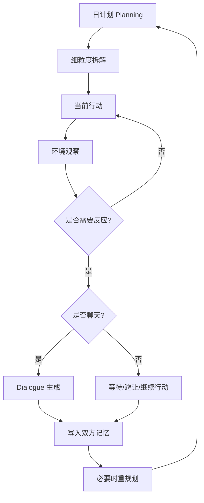

# 第 7 章 论文架构四：Planning、Reacting 与 Dialogue

## 7.1 本章要解决的问题

前面三章讲了 Memory Stream、Retrieval 和 Reflection。它们解决的是智能体如何保存过去、想起过去、解释过去。

但可信人类行为代理最终必须落到行动。

一个角色不能只拥有记忆和想法。它必须在小镇里醒来、吃饭、上学、工作、去咖啡馆、遇见别人、决定是否聊天、根据意外事件改变计划，并把这些行为持续地投射到环境中。

这就是 Planning、Reacting 与 Dialogue 要解决的问题。

在 Generative Agents 论文中，这三个机制共同把“内部认知状态”转换为“外部可观察行为”：

- Planning：角色今天打算做什么。
- Reacting：角色遇到新事件时是否改变行为。
- Dialogue：角色与其他人如何自然交流。

如果只有计划，没有反应，智能体会像机械日程表。

如果只有反应，没有计划，智能体会像被环境牵着走的聊天机器人。

如果只有对话，没有记忆和计划，智能体会像随机寒暄的 NPC。

可信行为需要三者结合：

```text
长期设定 + 当前日程 + 空间环境 + 近期记忆 + 关系记忆 + 现场事件
    -> 具体行动 / 对话 / 等待 / 重规划
```

本章要回答八个问题：

1. 为什么论文要把 planning 放到核心架构里？
2. 从日计划到细粒度行为是如何递归拆解的？
3. 计划如何落到地图和对象上？
4. 智能体如何处理意外事件？
5. 对话为什么必须依赖双方记忆和关系？
6. GenerativeAgentsCN 如何实现计划、反应和对话？
7. 这些机制如何支撑情人节派对和镇长竞选？
8. 它们有哪些常见失败模式？

[图 7-1：Planning、Reacting、Dialogue 的行为闭环]



## 7.2 从“会聊天”到“会生活”

很多 LLM 应用只解决“会回答问题”。Generative Agents 要解决的是“会生活”。

二者差别很大。

会聊天的系统只需要在用户输入后生成一段回复。

会生活的智能体必须在没有用户输入时也能持续行动。

它要知道现在几点，要知道自己今天要做什么，要知道当前位置，要能从宿舍走到咖啡馆，要能遇到别人，要能判断是否打招呼，要能把聊天占用的时间写回日程。

这就是论文为什么把 Planning 放到核心架构里。

在 Smallville 中，智能体不是等待用户提问的角色，而是持续运行在沙盒世界中的居民。每个居民都有一天的生活节奏。

例如：

```text
早上醒来。
吃早餐。
去学校或工作地点。
中午吃饭。
下午继续工作或学习。
晚上参加活动。
回家睡觉。
```

这些行为不需要用户逐条指定。它们由角色设定、生活习惯、记忆、当天目标和环境共同生成。

这就是“agent”与“chatbot”的分界。

聊天机器人主要响应输入。

行为代理要主动生成生活。

## 7.3 Planning 的第一层：日计划

论文中的 Planning 首先生成粗粒度日计划。

这个日计划不是最终动作，而是一天的骨架。

例如：

```text
7:00 起床并洗漱
8:00 吃早餐
9:00 去图书馆写论文
12:00 吃午饭
14:00 继续研究
17:00 去咖啡馆
19:00 回宿舍
23:00 睡觉
```

这个层次的计划有三个作用。

第一，它让智能体有持续性。

如果没有日计划，角色每一步都要临时决定下一件事，行为会显得漂浮。

第二，它让行为有节奏。

居民不会凌晨三点随机去咖啡馆聊天，也不会连续二十四小时无休止社交。

第三，它为社会交互创造可预期的时空结构。

只有当角色有稳定日程，他们才会在特定地点相遇。咖啡馆、学校、商店、宿舍这些地点才会成为社会互动的舞台。

GenerativeAgentsCN 中，日计划由 `Agent.make_schedule()` 生成。

如果当天还没有 schedule，系统会进入计划生成流程：

```python
if not self.schedule.scheduled():
    self.logger.info("{} is making schedule...".format(self.name))
```

这里的 `scheduled()` 会检查当前日期是否已经有 `daily_schedule`。

如果没有，它会生成新的日程。

## 7.4 计划生成前的“当前状态更新”

GenerativeAgentsCN 在生成新一天日程前，会先根据已有记忆更新 `currently`。

这一步非常重要。

角色的初始 persona 只是起点。经过一天仿真后，角色的当前状态应该改变。

例如，伊莎贝拉原本计划举办情人节派对。如果前一天已经邀请了很多人，第二天的 `currently` 应该体现她已经做过哪些准备、还需要做什么。

项目中对应代码是：

```python
focus = [
    f"{self.name} 在 {utils.get_timer().daily_format_cn()} 的计划。",
    f"在 {self.name} 的生活中，重要的近期事件。",
]
retrieved = self.associate.retrieve_focus(focus)
```

系统围绕“今天计划”和“近期重要事件”检索记忆，然后生成：

- `retrieve_plan`
- `retrieve_thought`
- `retrieve_currently`

也就是说，新一天计划不是从原始角色卡重新开始，而是从过去经验中接续。

这一步是行为连续性的关键。

如果没有它，角色每天早上都会像重启一样，只记得初始设定，不记得昨天发生的事。

[图 7-2：新一天日程生成前的 currently 更新流程]

## 7.5 起床时间与初始日程

日计划生成的第一步是 wake up。

GenerativeAgentsCN 中：

```python
wake_up = self.completion("wake_up")
```

`wake_up.txt` 会根据角色的基础描述和生活习惯生成起床时间。`prompt_wake_up()` 用 schema 约束输出为 0 到 11 之间的整数。

这看似小事，但很重要。

不同角色应该有不同作息。

早起的店主、晚睡的学生、通宵工作的艺术家，如果都在同一时间醒来，小镇会失去生活感。

起床时间之后，系统生成初始日程：

```python
init_schedule = self.completion("schedule_init", wake_up)
```

这一步生成的是简短、按时间顺序排列的活动列表。

它更像一天的叙事大纲，而不是严格的 24 小时表。

例如：

```text
早上起床并吃早餐。
上午去学院学习。
中午在咖啡馆吃饭。
下午继续写论文。
晚上回宿舍休息。
```

之后系统再把这个大纲扩展为小时级日程。

## 7.6 小时级日程

GenerativeAgentsCN 用 `schedule_daily` 生成 24 小时日程。

代码中先构造时间模板：

```python
hours = [f"{i}:00" for i in range(24)]
seed = [(h, "睡觉") for h in hours[:wake_up]]
seed += [(h, "") for h in hours[wake_up:]]
```

也就是说，起床前默认是睡觉，起床后由模型填活动。

`schedule_daily.txt` 要求模型返回类似下面的结构：

```json
{
  "6:00": "起床并完成早晨的例行工作",
  "7:00": "吃早餐",
  "8:00": "读书",
  "9:00": "读书",
  "12:00": "吃午饭",
  "18:00": "回家",
  "23:00": "睡觉"
}
```

项目还要求至少包含多个不同活动类型：

```python
if len(set(schedule.values())) >= self.schedule.diversity:
    break
```

这防止模型生成过于单调的日程。

生成后，系统把小时字符串转换为一天中的分钟数，并计算每段活动持续时间：

```python
schedule = {_to_duration(k): v for k, v in schedule.items()}
starts = list(sorted(schedule.keys()))
for idx, start in enumerate(starts):
    end = starts[idx + 1] if idx + 1 < len(starts) else 24 * 60
    self.schedule.add_plan(schedule[start], end - start)
```

最终的 `Schedule.daily_schedule` 由一组 plan 组成，每个 plan 包含：

- `idx`
- `describe`
- `start`
- `duration`
- `decompose`

这就是角色一天的粗粒度计划表。

## 7.7 把计划本身写入记忆

GenerativeAgentsCN 生成日计划后，会把“今天计划”作为 thought 写入记忆。

代码中：

```python
thought = "这是 {} 在 {} 的计划：{}".format(
    self.name, schedule_time, "；".join(init_schedule)
)
event = memory.Event(
    self.name,
    "计划",
    schedule_time,
    describe=thought,
    address=self.get_tile().get_address(),
)
self._add_concept("thought", event, expire=self.schedule.create + datetime.timedelta(days=30))
```

这一步很有价值。

计划不是只存在于 scheduler 里。它也成为角色记忆的一部分。

这样，后续对话或反思就可以引用自己的计划。

例如，别人问伊莎贝拉今天忙什么，她应该能够说自己在筹备派对。别人问克劳斯下午是否有空，他应该能参考自己的日程。

这也符合论文思想：memory stream 不只是被动记录外部事件，也记录智能体自己的计划和想法。

## 7.8 Planning 的第二层：递归拆解

小时级计划还不够细。

“上午写论文”不是一个可执行动作。角色需要知道在这段时间里具体做什么。

论文中，计划会被递归拆解为更细粒度行为。

GenerativeAgentsCN 中对应逻辑是：

```python
plan, _ = self.schedule.current_plan()
if self.schedule.decompose(plan):
    decompose_schedule = self.completion("schedule_decompose", plan, self.schedule)
```

例如，粗计划是：

```text
9:00-12:00 写研究论文
```

拆解后可能变成：

```text
9:00-9:30 整理资料
9:30-10:30 阅读论文
10:30-11:15 写引言
11:15-12:00 修改段落
```

这个机制让角色行动有层次。

长期计划提供方向，短期拆解提供动作。

如果没有拆解，小镇前端只会显示角色“写论文”三个小时。拆解后，角色行为更像真实过程。

[图 7-3：日计划到细粒度行动的递归拆解]

## 7.9 当前计划如何被选择

`Schedule.current_plan()` 根据当前时间选择正在执行的计划。

它先找粗粒度 plan，再找该 plan 下尚未结束的 decompose plan。

简化理解：

```text
当前时间
  -> 找到当前小时级 plan
  -> 如果有子计划，找到当前子计划
  -> 返回 plan 与 de_plan
```

这就是为什么 `make_schedule()` 返回：

```python
return self.schedule.current_plan()
```

后续行为生成使用的通常是 `de_plan`，因为它更具体。

例如：

```python
plan, de_plan = self.schedule.current_plan()
describes = [plan["describe"], de_plan["describe"]]
```

`plan["describe"]` 给出大方向，`de_plan["describe"]` 给出当前具体动作。

这种双层描述对地点选择很有帮助。

如果大计划是“在学院学习”，小计划是“阅读物理教材”，系统更容易把角色定位到学院、图书馆或书桌，而不是随机地点。

## 7.10 从计划到空间位置

计划必须落到地图上。

一个角色不能只是“计划吃午饭”，还要知道去哪里吃。

GenerativeAgentsCN 中，这一步由 `_determine_action()` 完成。

它先取当前计划：

```python
plan, de_plan = self.schedule.current_plan()
describes = [plan["describe"], de_plan["describe"]]
```

然后尝试从空间记忆中找地址：

```python
address = self.spatial.find_address(describes[0], as_list=True)
```

如果找不到，就调用模型逐层决定：

- sector
- arena
- object

对应 prompt 是：

```text
determine_sector
determine_arena
determine_object
```

这与 Smallville 的地图结构相匹配。角色不是直接传送到抽象行为，而是把行为绑定到具体空间地址。

例如：

```text
世界：Smallville
区域：奥克山学院
场所：图书馆
对象：书桌
```

生成地址后，系统创建两个事件：

```python
event = self.make_event(self.name, describes[-1], address)
obj_describe = self.completion("describe_object", address[-1], describes[-1])
obj_event = self.make_event(address[-1], obj_describe, address)
```

第一个事件描述角色在做什么。

第二个事件描述对象被如何占用或影响。

例如：

```text
克劳斯此时阅读研究资料。
书桌此时被克劳斯用于阅读研究资料。
```

这样，地图上的 tile 不只是坐标，也承载事件。

其他角色感知附近 tile 时，就能看到这些事件。

## 7.11 Action：行为的时间边界

GenerativeAgentsCN 用 `Action` 表示当前行为。

`Action` 包含：

- `event`
- `obj_event`
- `start`
- `duration`
- `end`

`finished()` 用于判断行为是否结束：

```python
if not self.duration:
    return True
if not self.event.address:
    return True
return utils.get_timer().get_date() > self.end
```

这让行为有时间边界。

角色不会每一步都重新决定动作。只要当前 action 没结束，它会继续执行。

这对可信行为非常重要。

如果角色每 10 分钟都重新决定一次，行为会像抖动的状态机。Action 的持续时间让行为稳定下来。

## 7.12 Reacting：计划不能压死现场

有了计划之后，另一个问题出现了：角色是否应该完全照计划执行？

答案是否定的。

真实生活中，人会遇到意外。

例如：

- 去咖啡馆时遇到熟人。
- 准备使用浴室时发现室友正在用。
- 在路上听到别人讨论情人节派对。
- 遇到候选人山姆正在拉票。

这些事件可能改变当前行为。

论文中的 Reacting 就是处理这类情况。

Reacting 的目标不是抛弃计划，而是在计划与现场之间做权衡。

GenerativeAgentsCN 中，每个 awake 的智能体在 `think()` 中会执行：

```python
self.percept()
self.make_plan(agents)
self.reflect()
```

`make_plan()` 先尝试 reaction：

```python
if self._reaction(agents):
    return
if self.path:
    return
if self.action.finished():
    self.action = self._determine_action()
```

这说明反应优先于继续确定新动作。

如果现场触发了聊天或等待，系统会直接使用 reaction 的结果。否则，才按当前计划确定下一步 action。

[图 7-4：计划执行与现场反应的优先级]

## 7.13 感知结果如何进入 Reaction

Reaction 依赖感知。

`percept()` 会把附近可见事件转成 `self.concepts`。

`_reaction()` 从这些 concepts 中选择一个焦点：

```python
if agents:
    priority = [i for i in self.concepts if _focus(i)]
    if priority:
        focus = random.choice(priority)
if not focus:
    priority = [i for i in self.concepts if not _ignore(i)]
    if priority:
        focus = random.choice(priority)
```

这里有两类优先级：

第一，如果 concept 的 subject 是其他 agent，优先考虑。

这意味着看到人比看到物体更可能触发互动。

第二，如果没有 agent 事件，再从非空闲事件中选。

这避免智能体对“空闲”状态过度反应。

选中 focus 后，如果 focus 的 subject 是其他 agent，系统会取出对方对象，并构造关系上下文：

```python
other, focus = agents[focus.event.subject], self.associate.get_relation(focus)
```

`get_relation()` 会检索与该事件相关的 events 和 thoughts：

```python
return {
    "node": node,
    "events": self.retrieve_events(node.describe),
    "thoughts": self.retrieve_thoughts(node.describe),
}
```

这说明反应不是只看眼前事件，也会带上相关记忆。

角色是否和某人聊天，不能只由“看见某人”决定，还要由过去关系决定。

## 7.14 Reaction 的两种主要形式：聊天与等待

GenerativeAgentsCN 中 `_reaction()` 尝试两种行为：

```python
if self._chat_with(other, focus):
    return True
if self._wait_other(other, focus):
    return True
return False
```

第一种是聊天。

当角色遇到另一个角色，并且上下文适合时，它可能发起对话。

第二种是等待。

当角色正在去某个地点，而对方已经占用了目标地点或相关对象时，它可能选择等待。

这两种反应分别对应社会互动和空间冲突。

聊天让信息传播、关系形成、计划改变成为可能。

等待让角色不会在同一对象上产生明显不合理的冲突。

例如，两个人不能同时自然地使用同一个浴室。等待机制使行为更符合常识。

## 7.15 什么时候不该反应

可信行为不仅需要知道何时反应，也需要知道何时不反应。

GenerativeAgentsCN 用 `_skip_react()` 过滤不合适场景：

```python
if utils.get_timer().daily_duration(mode="hour") >= 23:
    return True
if _skip(self.get_event()) or _skip(other.get_event()):
    return True
return False
```

如果时间太晚，跳过反应。

如果自己或对方正在睡觉，跳过反应。

如果事件处于待开始状态，也跳过反应。

`_chat_with()` 还有更多限制：

- 双方日程必须已初始化。
- 对方不能正在移动。
- 双方不能已经在对话。
- 最近 60 分钟内聊过则不再重复聊。

这些限制非常重要。

没有这些限制，智能体会频繁打断彼此，产生不自然的重复对话。

可信行为不是越主动越好，而是在合适时机主动。

## 7.16 Dialogue 的第一步：决定是否聊天

对话不是遇见人就自动发生。

`_chat_with()` 会先检索最近与对方的聊天记录：

```python
chats = self.associate.retrieve_chats(other.name)
if chats:
    delta = utils.get_timer().get_delta(chats[0].create)
    if delta < 60:
        return False
```

如果一小时内聊过，就不再聊天。

然后系统调用：

```python
if not self.completion("decide_chat", self, other, focus, chats):
    return False
```

`decide_chat.txt` 会基于以下信息判断是否可能主动对话：

- 当前上下文。
- 当前时间。
- 上次聊天历史。
- 当前角色状态。
- 对方角色状态。

这一步把对话从“生成文本”前移到“是否应该说话”。

这对社会仿真很关键。

真实小镇里，居民不会每次擦肩而过都长聊。他们会根据关系、场合、时间和当前任务决定是否开口。

## 7.17 Dialogue 的第二步：关系摘要

如果决定聊天，系统会先总结双方关系：

```python
relations = [
    self.completion("summarize_relation", self, other.name),
    other.completion("summarize_relation", other, self.name),
]
```

注意，这里生成了两个关系摘要。

这很重要。

同一段关系在两个人心中可能不同。

克劳斯对玛丽亚的理解，不一定等于玛丽亚对克劳斯的理解。

山姆认为自己在积极竞选，汤姆可能认为山姆令人反感。

对话如果只使用一个全局关系状态，就会失去这种不对称性。

`summarize_relation()` 会围绕对方名字检索记忆：

```python
nodes = agent.associate.retrieve_focus([other_name], 50)
```

然后生成一句关系描述。

这让对话拥有历史感。

角色不是只根据当前画面说话，而是根据过去与对方有关的记忆说话。

## 7.18 Dialogue 的第三步：多轮生成

关系摘要生成后，系统开始多轮对话。

`_chat_with()` 中：

```python
for i in range(self.chat_iter):
    text = self.completion("generate_chat", self, other, relations[0], chats)
    ...
    text = other.completion("generate_chat", other, self, relations[1], chats)
```

`generate_chat.txt` 的输入包括：

- 角色基础描述。
- 角色记忆。
- 当前位置。
- 当前时间。
- 最近相关对话背景。
- 当前场景。
- 已有对话记录。
- 对话原则。

对话原则要求：

- 不重复已有内容。
- 符合性格和当前情境。
- 语言自然。
- 长度控制在 1 到 3 句话。
- 直接输出角色要说的话。

这比简单 prompt 更接近实际社交。

每轮生成时，系统还会检查重复：

```python
generate_chat_check_repeat
```

并判断话题是否结束：

```python
decide_chat_terminate
```

这避免对话无限循环，也减少复读。

## 7.19 Dialogue 的第四步：写回日程与记忆

对话结束后，系统不会只把文本打印出来。

它会做三件事。

第一，记录对话。

```python
self.conversation[key].append({f"{self.name} -> {other.name} @ ...": chats})
```

第二，生成对话摘要：

```python
chat_summary = self.completion("summarize_chats", chats)
```

第三，把聊天写入双方日程：

```python
self.schedule_chat(chats, chat_summary, start, duration, other)
other.schedule_chat(chats, chat_summary, start, duration, self)
```

`schedule_chat()` 会创建一个“对话”事件，并调用 `revise_schedule()`：

```python
event = memory.Event(
    self.name,
    "对话",
    other.name,
    describe=chats_summary,
    address=address or self.get_tile().get_address(),
    emoji=f"💬",
)
self.revise_schedule(event, start, duration)
```

这说明聊天会占用真实时间。

对话不是免费的文本输出。它会改变当前 action，也会影响日程。

同时，对话事件会被后续感知和记忆系统捕捉，最终可能进入 reflection。

这就是行为闭环：

```text
相遇
  -> 决定聊天
  -> 生成对话
  -> 摘要对话
  -> 写回日程和记忆
  -> 后续检索与反思
```

[图 7-5：Dialogue 从决策到写回的完整流程]

## 7.20 Waiting：空间冲突下的重规划

除了聊天，GenerativeAgentsCN 还实现了等待。

`_wait_other()` 处理的是一种常见现实情况：

```text
我正要去做某件事，但另一个人已经在那个地点或对象上做事。
```

系统会判断是否等待：

```python
if not self.completion("decide_wait", self, other, focus):
    return False
```

`decide_wait` prompt 中有示例：

- 如果两人都要使用浴室，应该等待。
- 如果一人吃午饭、一人洗衣服，互不冲突，就继续当前行动。

如果决定等待，系统创建等待事件：

```python
event = memory.Event(
    self.name,
    "waiting to start",
    self.get_event().get_describe(False),
    address=self.get_event().address,
    emoji=f"⌛",
)
self.revise_schedule(event, start, duration)
```

这让角色不会穿模式地同时占用同一对象。

等待机制看起来小，但它是 believable behavior 的重要细节。

可信小镇不是只靠大事件，也靠大量小的常识约束。

## 7.21 revise_schedule：把意外写回计划

Reaction 发生后，原计划需要更新。

GenerativeAgentsCN 用 `revise_schedule()` 完成这件事：

```python
self.action = memory.Action(event, start=start, duration=duration)
plan, _ = self.schedule.current_plan()
if len(plan["decompose"]) > 0:
    plan["decompose"] = self.completion(
        "schedule_revise", self.action, self.schedule
    )
```

例如，克劳斯原计划 10:00 到 11:00 阅读论文。10:15 他遇到玛丽亚并聊了 15 分钟。

原计划不能完全保留，否则时间会重叠。

`schedule_revise` 会基于当前 action 修改剩余子计划：

```text
10:00-10:15 阅读论文
10:15-10:30 与玛丽亚对话
10:30-11:00 继续阅读论文
```

这就是论文中“意外事件触发重规划”的工程体现。

如果没有 `revise_schedule()`，对话只是插入事件，不会影响日程。角色会同时聊天和执行原任务，行为就会不可信。

## 7.22 情人节派对如何依赖 Planning 与 Dialogue

论文中的情人节派对不是靠一个全局广播完成的。

它依赖 Planning、Reaction 与 Dialogue 的组合。

首先，伊莎贝拉的 `currently` 中有派对目标。

这会影响她的日计划。她可能安排采购、准备、邀请居民、布置咖啡馆。

其次，当伊莎贝拉遇到其他居民时，Reaction 可能触发聊天。

如果 decide_chat 判断当前场景适合，她会主动提到派对。

然后，对话摘要进入双方记忆。

被邀请者后续可能在计划中考虑是否参加，也可能在遇到别人时继续传播。

最后，Reflection 可能把这些对话升为 thought：

```text
伊莎贝拉认为阿伊莎可能会参加情人节派对。
阿伊莎知道伊莎贝拉正在邀请居民参加派对。
```

这些 thought 又会影响后续行为。

因此，派对传播不是“写死的剧情”，而是多个机制叠加：

```text
persona/currently
  -> planning
  -> spatial encounter
  -> dialogue
  -> memory
  -> reflection
  -> revised planning
  -> attendance
```

这就是社会行为涌现的基础。

## 7.23 镇长竞选如何依赖 Reacting

山姆的镇长竞选也是类似机制。

如果山姆只是有一个静态设定“正在竞选”，系统不会自然产生信息扩散。

要让竞选在小镇中出现社会效果，山姆必须：

1. 在计划中安排竞选相关行动。
2. 在空间中遇到居民。
3. 判断是否发起对话。
4. 根据关系和现场生成竞选话题。
5. 让居民记住这次对话。
6. 让居民在之后的对话中可能提到山姆。

这里尤其能看到 Reacting 的重要性。

山姆不可能站在一个地方向全镇广播。竞选信息是在一次次偶遇和对话中扩散的。

汤姆不喜欢山姆这一点也会通过记忆和关系摘要影响对话。

如果汤姆遇到山姆，他可能不会热情支持，而是表现出怀疑或冷淡。可信行为不要求所有人配合剧情，而要求每个人根据自己的设定和经历合理行动。

## 7.24 Planning 与 Dialogue 的互相影响

Planning 和 Dialogue 不是单向关系。

计划影响对话。

例如，一个人正在赶去上班，可能不会长聊。一个人正在准备派对，可能会主动邀请别人。

对话也影响计划。

例如，伊莎贝拉邀请阿伊莎参加派对。阿伊莎可能把晚上计划改为去咖啡馆。克劳斯遇到玛丽亚后，可能把之后一段时间改为继续交流或参加相关活动。

GenerativeAgentsCN 通过 `schedule_chat()` 和 `revise_schedule()` 把对话写回计划。

但更深层的计划改变还依赖后续 reflection 和新日程生成。

短期上，对话占用当前时间。

长期上，对话形成记忆和 thought，影响明天或之后的计划。

这就是生成式智能体的动态性。

## 7.25 为什么 Dialogue 必须依赖双方记忆

如果对话只依赖当前场景，会出现很多问题。

第一，角色不记得曾经聊过什么。

他们会重复自我介绍，重复邀请，重复问同样问题。

第二，角色关系没有差异。

朋友、陌生人、竞争者、怀疑者说话方式都一样。

第三，信息传播无法追踪。

一个人明明听过情人节派对，后面却像第一次听说。

第四，对话不能改变未来。

聊完就结束，不进入记忆系统。

GenerativeAgentsCN 的对话实现避免了这些问题。

生成对话时，系统会检索：

- 与对方有关的 relation summary。
- 当前动作和场景。
- 近期相关记忆。
- 与对方最近的聊天记录。

并在对话后写回：

- conversation 记录。
- chat summary。
- 当前 action。
- 后续 reflection 的素材。

这才构成有记忆的对话。

## 7.26 失败模式：计划漂移

Planning 常见失败之一是计划漂移。

例如，角色原本设定今天要准备派对，但日程生成时没有安排任何派对相关行动。

这可能有几个原因：

- `currently` 没有被正确更新。
- `schedule_init` 生成过于普通。
- `schedule_daily` 没有保留关键目标。
- 检索到的近期事件不足。

解决思路是检查日程生成链路：

```text
persona/currently
  -> retrieve_plan/retrieve_thought
  -> retrieve_currently
  -> schedule_init
  -> schedule_daily
```

如果目标在某一步丢失，就要加强 prompt 或调整记忆检索。

## 7.27 失败模式：过度社交

另一个常见失败是过度社交。

如果 decide_chat 太容易返回 true，居民会频繁聊天。

小镇看起来会很热闹，但不可信。

过度社交会导致：

- 日程被频繁打断。
- 对话内容重复。
- 信息传播过快。
- 每个人都像社交机器。

GenerativeAgentsCN 中已有一些限制，例如一小时内聊过不再聊、睡觉时不反应、对方移动时不聊天。

但实验时仍然要观察对话密度。

可信社会仿真不是聊天越多越好，而是社交行为符合角色、时间、地点和关系。

## 7.28 失败模式：对话不改变行为

有些系统看似能聊天，但聊天不会改变任何事情。

这会让对话变成装饰。

在 Generative Agents 中，对话必须进入后续行为链路。

检查方法很简单：

1. 对话是否被摘要？
2. 摘要是否写入双方记忆？
3. 重要性评分是否合理？
4. 后续 planning 是否能检索到对话？
5. reflection 是否基于对话形成 thought？
6. 角色后续行动是否体现这次对话？

如果这些都没有发生，那么对话只是临时文本。

本书后面的复现实验会专门检查这一点。

## 7.29 失败模式：空间落地错误

计划还可能在空间落地时失败。

例如：

- 角色计划吃饭，却去了不合理地点。
- 角色计划睡觉，却找不到床。
- 角色计划上课，却去了咖啡馆。
- 多个角色占用同一对象但没有等待。

这类问题通常出在：

- `Spatial` 记忆不完整。
- `determine_sector` 选择错误。
- `determine_arena` 或 `determine_object` 选择错误。
- 地址树和 prompt 描述不匹配。

这也是为什么源码深读部分要专门讲世界模型、地址树和空间记忆。

Planning 不是纯文本问题。只要要在地图中执行，它就一定变成空间 grounding 问题。

## 7.30 对后续章节的影响

理解本章后，第 8 章的评价方法会更好读。

论文评价智能体是否可信，不只是看它是否说得好听，而是看它是否能：

- 记住自己。
- 记住别人。
- 生成合理计划。
- 对新事件做出合理反应。
- 通过反思形成高层认知。

第三部分源码深读中，第 13 章会拆 `start.py`、`Game` 和 `Agent.think()`，第 16 章会专门拆日程，第 17 章会专门拆社交。

第四部分复现实验中，情人节派对、镇长竞选、关系形成都离不开本章机制。

第五部分前沿演进中，我们会把 Planning 与 2023-2026 年的 ReAct、Tree of Thoughts、LATS、Voyager、AutoGen、AgentScope 等方向连接起来，讨论当前项目如何升级成更强的任务规划和多智能体协作系统。

## 7.31 本章小结

本章讲清了 Planning、Reacting 与 Dialogue：

1. Generative Agents 要解决的是“会生活”，不是只会聊天。
2. Planning 先生成日计划，再拆解成细粒度动作。
3. GenerativeAgentsCN 在新一天计划前会根据记忆更新 `currently`。
4. 日计划会写回 memory stream，成为角色自己的 thought。
5. `_determine_action()` 把计划落到空间地址和对象事件。
6. Action 用 start、duration、end 保持行为稳定。
7. Reacting 在计划和现场之间做权衡。
8. `_reaction()` 主要处理聊天和等待。
9. Dialogue 先判断是否应该聊，再总结关系，再多轮生成，再写回日程和记忆。
10. 情人节派对和镇长竞选都依赖计划、反应、对话、记忆、反思的闭环。

下一章我们进入论文评价方法。只有理解了前面这些机制，才能看懂论文为什么要做 controlled evaluation、ablation study 和 end-to-end evaluation，也才能知道如何评价 GenerativeAgentsCN 是否真正复现了论文思想。

## 参考资料

- Joon Sung Park, Joseph C. O'Brien, Carrie J. Cai, Meredith Ringel Morris, Percy Liang, Michael S. Bernstein. *Generative Agents: Interactive Simulacra of Human Behavior*. arXiv: https://arxiv.org/abs/2304.03442
- ar5iv full text: https://ar5iv.labs.arxiv.org/html/2304.03442
- GenerativeAgentsCN local source: `generative_agents/modules/agent.py`
- GenerativeAgentsCN local source: `generative_agents/modules/memory/schedule.py`
- GenerativeAgentsCN local source: `generative_agents/modules/memory/action.py`
- GenerativeAgentsCN local prompts: `generative_agents/data/prompts/schedule_daily.txt`, `generative_agents/data/prompts/generate_chat.txt`, `generative_agents/data/prompts/decide_chat.txt`, `generative_agents/data/prompts/decide_wait.txt`
