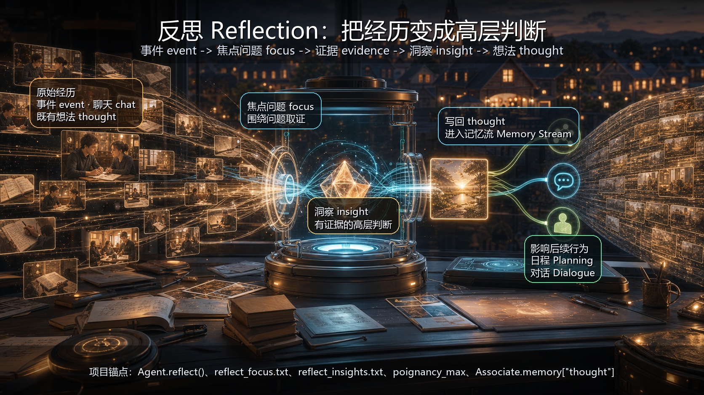
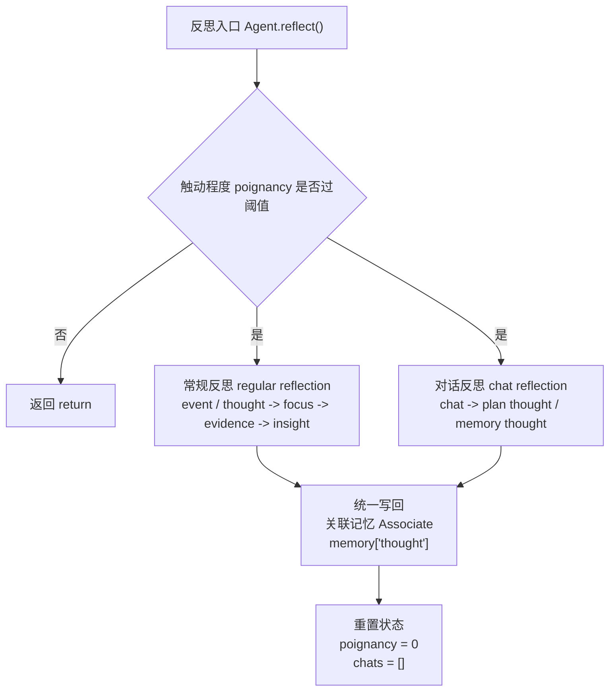
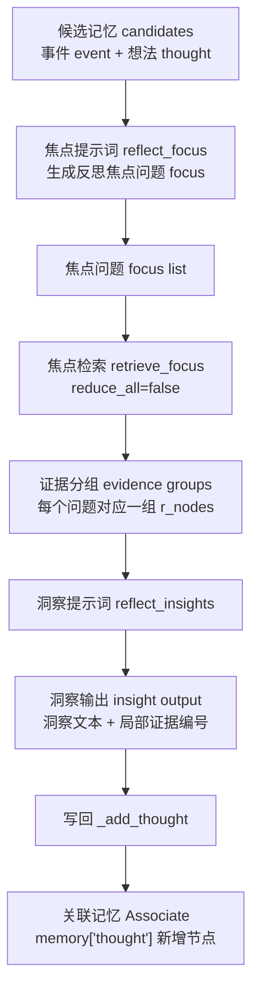
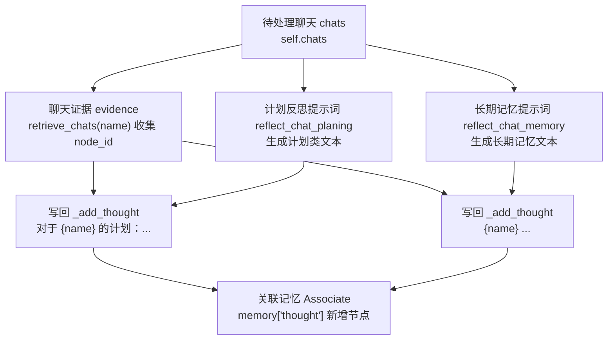

# 第 7 章 论文架构四：反思 Reflection

克劳斯 Klaus Mueller 与阿伊莎 Ayesha Khan 的论文交流已经在第 5 章进入记忆流 Memory Stream，也已经在第 6 章被检索 Retrieval 找回。第 7 章继续追踪同一条证据链：一段经历如何在触动程度 poignancy 过阈值后，被反思 Reflection 写成新的想法 thought。

```text
克劳斯 阿伊莎建议把感官描写包装成'参与式观察'的田野笔记，让我找到了在社会学论文中兼顾文学感染力和学术严谨性的巧妙平衡点。
```

这条想法 thought 来自 `book-custom-discussion` 实验的真实断点 checkpoint。它不是聊天原文，也不是简单摘要，而是克劳斯 Klaus Mueller 对论文写作方法形成的新判断。



*图 7-1：反思 Reflection 的系统入口。低层事件 event、聊天 chat 和已有想法 thought 进入反思链路后，最终写回关联记忆 Associate。*

## 7.1 一条真实反思：克劳斯 Klaus Mueller 想到了什么

证据实验仍然是 `book-custom-discussion`。克劳斯 Klaus Mueller 在图书馆推进 `中产阶级化` 论文，阿伊莎 Ayesha Khan 给出参与式观察写作建议，反思 Reflection 围绕这条论文协作线生成了新的想法 thought。

证据路径：

```text
generative_agents\results\checkpoints\book-custom-discussion\simulate-20240213-1350.json
generative_agents\results\checkpoints\book-custom-discussion\simulate-20240213-1400.json
generative_agents\results\checkpoints\book-custom-discussion\storage\克劳斯\associate\docstore.json
```

两个断点 checkpoint 的差异很直接：`13:50` 时触动程度 poignancy 还没过线，`14:00` 后想法 thought 从 1 条增加到 18 条，触动程度 poignancy 被重置为 0。

| 时间 time | 触动程度 poignancy | 事件 event | 想法 thought | 聊天 chat | 待处理聊天 pending chats |
| --- | ---: | ---: | ---: | ---: | ---: |
| `20240213-13:50` | `147` | `83` | `1` | `7` | `26` |
| `20240213-14:00` | `0` | `86` | `18` | `7` | `6` |

*表 7-1：克劳斯 Klaus Mueller 反思前后的断点状态。*

`node_110` 是最适合作为入口的结果节点：

```json
{
  "id_": "node_110",
  "text": "克劳斯 阿伊莎建议把感官描写包装成'参与式观察'的田野笔记，让我找到了在社会学论文中兼顾文学感染力和学术严谨性的巧妙平衡点。",
  "metadata": {
    "node_type": "thought",
    "poignancy": 7,
    "create": "20240213-14:00:00"
  }
}
```

这条 thought 有两个关键信号：
- 第一，它的 `node_type` 是 `thought`，说明它已经不是原始事件 event 或聊天 chat
- 第二，它把阿伊莎 Ayesha Khan 的建议转成克劳斯 Klaus Mueller 自己后续可检索、可引用的论文写作原则

## 7.2 反思 Reflection 解决什么问题

记忆流 Memory Stream 保存过去，但过去本身还不是判断。反思 Reflection 的作用，是把若干低层经历压缩成更稳定的解释。

| 层次 | 保存的内容 | 能回答的问题 | 还缺什么 |
| --- | --- | --- | --- |
| 事件 event | 克劳斯 Klaus Mueller 在图书馆写论文、查资料、和别人交谈。 | 发生了什么。 | 不能直接形成长期判断。 |
| 聊天 chat | 阿伊莎 Ayesha Khan 建议把感官描写转成参与式观察田野笔记。 | 谁说了什么。 | 不能直接说明这条建议对克劳斯的意义。 |
| 想法 thought | 克劳斯 Klaus Mueller 认为参与式观察可以兼顾文学感染力和学术严谨性。 | 这件事意味着什么。 | 已经可以进入后续行为。 |

*表 7-2：反思 Reflection 的位置。它不是替代事件 event 和聊天 chat，而是从它们中生成新的高层想法 thought。*

没有反思 Reflection，系统每次行动都要重新翻低层记录；有了反思 Reflection，克劳斯 Klaus Mueller 可以直接检索到“参与式观察写法适合我的论文”这类稳定判断。智能体 agent 的连续性，正是从这类高层想法 thought 中长出来的。

## 7.3 反思函数的两条分支——常规反思与对话反思

源码入口是 `generative_agents/modules/agent.py` 中的 `Agent.reflect()`。删去日志与细节后，运行顺序可以压缩成四段：门禁、常规反思、对话反思、状态重置。

```python
def reflect(self):
    # 触发门禁：触动程度不够，直接退出。
    if self.status["poignancy"] < self.think_config["poignancy_max"]:
        return

    # 常规反思：事件 event / 想法 thought -> 焦点 focus -> 证据 evidence -> 洞察 insight -> 新 thought。
    nodes = self.associate.retrieve_events() + self.associate.retrieve_thoughts()
    focus = self.completion("reflect_focus", nodes, 3)
    retrieved = self.associate.retrieve_focus(focus, reduce_all=False)
    for r_nodes in retrieved.values():
        for thought, evidence in self.completion("reflect_insights", r_nodes, 5):
            _add_thought(thought, evidence)

    # 对话反思：聊天 chat -> 计划类 thought / 长期记忆 thought。
    if self.chats:
        plan = self.completion("reflect_chat_planing", self.chats)
        _add_thought(f"对于 {self.name} 的计划：{plan}", evidence)

        memory = self.completion("reflect_chat_memory", self.chats)
        _add_thought(f"{self.name} {memory}", evidence)

    # 状态重置：本轮触发条件清空。
    self.status["poignancy"] = 0
    self.chats = []
```


```mermaid
flowchart TD
    Start["反思入口 Agent.reflect()"] --> Gate{"触动程度 poignancy 是否过阈值"}
    Gate -- "否" --> Stop["返回 return"]
    Gate -- "是" --> Regular["常规反思 regular reflection<br/>event / thought -> focus -> evidence -> insight"]
    Gate -- "是" --> Chat["对话反思 chat reflection<br/>chat -> plan thought / memory thought"]
    Regular --> Write["统一写回<br/>关联记忆 Associate<br/>memory['thought']"]
    Chat --> Write
    Write --> Reset["重置状态<br/>poignancy = 0<br/>chats = []"]
```

*图 7-2：`Agent.reflect()` 的两条分支。常规反思处理事件 event 和已有想法 thought，对话反思处理待处理聊天 chats。*

| 分支 branch | 输入 input | 处理 process | 输出 output |
| --- | --- | --- | --- |
| 触发门禁 gate | `status.poignancy`、`think_config.poignancy_max` | 低于阈值直接返回。 | 是否进入反思 Reflection。 |
| 常规反思 regular reflection | 近期事件 event、已有想法 thought | 生成焦点问题 focus，检索证据 evidence，生成洞察 insight。 | 一批新的想法 thought。 |
| 对话反思 chat reflection | `self.chats` 中尚未消化的对话 | 生成计划反思和长期记忆。 | 两类对话相关 thought。 |
| 状态重置 reset | 本轮反思结果 | 清空累计触动程度和待处理聊天。 | `poignancy = 0`，`chats = []`。 |

## 7.4 触发条件：触动程度 poignancy 过阈值

反思 Reflection 不会每一步都执行。项目用触动程度 poignancy 控制触发频率，阈值来自 `generative_agents/data/config.json`：

```json
"think": {
  "interval": 1000,
  "poignancy_max": 150
}
```

对应的代码门禁如下：

```python
if self.status["poignancy"] < self.think_config["poignancy_max"]:
    return
```

第 5 章已经展开 `poignancy_event.txt` 和 `poignancy_chat.txt`。在反思 Reflection 中，这些评分会累计到 `status.poignancy`；达到 `poignancy_max` 后，`Agent.reflect()` 才会继续执行。

| 时间 time | 状态 status | 解释 |
| --- | --- | --- |
| `13:50` | `poignancy = 147` | 尚未达到 `150`，反思 Reflection 不启动。 |
| `14:00` | 运行过程中达到阈值 | `Agent.reflect()` 执行，生成 17 条新增 thought。 |
| `14:00` 之后 | `poignancy = 0` | 反思结束后重置累计值。 |

## 7.5 常规反思：event / thought 如何生成新 thought

常规反思只处理两类候选记忆：事件 event 和已有想法 thought。聊天 chat 不进入这一支。

```python
nodes = self.associate.retrieve_events() + self.associate.retrieve_thoughts()
nodes = sorted(nodes, key=lambda n: n.access, reverse=True)
nodes = nodes[: self.associate.max_importance]
```

| 阶段 stage | 输入 input | 处理 process | 输出 output |
| --- | --- | --- | --- |
| 候选记忆 candidate memories | 近期事件 event、已有想法 thought | 按访问时间 access 倒序排列，截取 `max_importance` 条。 | 本轮可反思的候选节点。 |
| 焦点问题 focus | 候选节点的文本 text | 调用 `reflect_focus`。 | 若干反思问题。 |
| 证据检索 evidence retrieval | 焦点问题 focus | 调用 `retrieve_focus(..., reduce_all=False)`。 | 每个问题对应一组证据 evidence。 |
| 洞察生成 insight generation | 每组证据 evidence | 调用 `reflect_insights`。 | 洞察 insight 与证据编号。 |
| 写回 write-back | 洞察 insight | 调用 `_add_concept("thought", ...)`。 | 新的想法 thought。 |


```mermaid
flowchart TD
    Candidates["候选记忆 candidates<br/>事件 event + 想法 thought"] --> FocusPrompt["焦点提示词 reflect_focus<br/>生成反思焦点问题 focus"]
    FocusPrompt --> FocusList["焦点问题 focus list"]
    FocusList --> Retrieve["焦点检索 retrieve_focus<br/>reduce_all=false"]
    Retrieve --> EvidenceGroups["证据分组 evidence groups<br/>每个问题对应一组 r_nodes"]
    EvidenceGroups --> InsightPrompt["洞察提示词 reflect_insights"]
    InsightPrompt --> InsightOutput["洞察输出 insight output<br/>洞察文本 + 局部证据编号"]
    InsightOutput --> AddThought["写回 _add_thought"]
    AddThought --> Associate["关联记忆 Associate<br/>memory['thought'] 新增节点"]
```

*图 7-3：常规反思 regular reflection 的数据流。`reflect_focus` 负责生成检索问题，`reflect_insights` 负责从证据 evidence 中生成洞察 insight，最终写回想法 thought。*

两份提示词 prompt 的原文并排阅读即可。`reflect_focus.txt` 决定“该问什么问题”，`reflect_insights.txt` 决定“从证据里形成什么洞察”。

<table>
  <tr>
    <th style="width:50%">reflect_focus.txt</th>
    <th style="width:50%">reflect_insights.txt</th>
  </tr>
  <tr>
    <td>
<pre><code>根据给定的记忆节点，生成反思的焦点问题。
示例：
"""
记忆节点：
1. 凯莉在厨房做早餐
2. 凯莉计划今天去超市购物
3. 凯莉昨天和朋友聊天很愉快

生成3个反思焦点问题：
"""

确保返回的数据格式遵守schema：
[
  "凯莉今天的生活重点是什么？",
  "凯莉最近的社交活动如何？",
  "凯莉的日常习惯有什么变化？"
]

参考示例，为以下记忆节点生成反思焦点问题：
"""
记忆节点：
${reference}

生成${number}个反思焦点问题：
"""

确保返回的数据格式遵守schema：
[
  "焦点问题1",
  "焦点问题2",
  "焦点问题3",
  ...
]

要求：
-问题要基于给定的记忆节点
-问题要简洁明了，便于引导反思
-确保遵守返回的格式schema
</code></pre>
    </td>
    <td>
<pre><code>根据给定的记忆节点，生成反思洞察。

示例：
"""
记忆节点：
1. 凯莉在厨房做早餐
2. 凯莉计划今天去超市购物
3. 凯莉昨天和朋友聊天很愉快

生成5个反思洞察：
"""

确保返回的数据格式遵守schema：
[
  ("凯莉注重健康饮食，每天都会准备营养早餐", "1"),
  ("凯莉有良好的购物计划习惯", "2"),
  ("凯莉重视社交关系，经常与朋友保持联系", "3"),
  ("凯莉的生活很有规律，注重工作与生活的平衡", "1,2"),
  ("凯莉是一个有条理的人，善于安排时间", "1,2,3")
]

参考示例，为以下记忆节点生成反思洞察：
"""
记忆节点：
${reference}

生成${number}个反思洞察：
"""

确保返回的数据格式遵守schema：
[
  ("洞察内容", "相关节点编号"),
  ("洞察内容", "相关节点编号"),
  ...
]

要求：
- 洞察要基于给定的记忆节点
- 洞察要深刻且有启发性
- 节点编号用逗号分隔，如"1,2,3"
- 确保返回的数据格式遵守schema</code></pre>
    </td>
  </tr>
</table>

| 提示词 prompt | 输入 input | 输出 output | 落点 |
| --- | --- | --- | --- |
| `reflect_focus` | 候选记忆列表 `reference`、问题数量 `number` | `res: List[str]` | 输出给 `retrieve_focus()`，用于找回证据 evidence。 |
| `reflect_insights` | 某个焦点问题检索出的证据 evidence、洞察数量 `number` | `res: List[Tuple[str, str]]` | 输出给 `_add_thought()`，写回关联记忆 Associate。 |

`Scratch.prompt_reflect_focus()` 和 `Scratch.prompt_reflect_insights()` 构造 `reference` 时使用 `enumerate(nodes)`，真实输入里的编号从 `0` 开始：

```text
0. 克劳斯在图书馆整理中产阶级化论文材料。
1. 克劳斯查找置换效应数据在《城市更新》文献中的出处。
2. 阿伊莎建议克劳斯把感官描写包装成参与式观察。
```

这些数字只是本轮提示词 prompt 的局部编号，不是全局记忆编号，也不是 `node_id`。`reflect_insights` 的回调 callback 会把 `"0,1,2"` 这类局部编号映射成当前证据列表中的真实 `node_id`。

```python
node_ids = [
    nodes[i].node_id
    for i in range(len(nodes))
    if str(i) in node_ids
]
```

## 7.6 对话反思：chat 如何生成计划类 thought 和长期记忆 thought

对话反思只在 `self.chats` 非空时执行。它不走 `reflect_focus`，而是直接把近期聊天 chat 交给两个提示词 prompt：

```python
if self.chats:
    thought = self.completion("reflect_chat_planing", self.chats)
    _add_thought(f"对于 {self.name} 的计划：{thought}", evidence)

    thought = self.completion("reflect_chat_memory", self.chats)
    _add_thought(f"{self.name} {thought}", evidence)
```


```mermaid
flowchart TD
    Chats["待处理聊天 chats<br/>self.chats"] --> Evidence["聊天证据 evidence<br/>retrieve_chats(name) 收集 node_id"]
    Chats --> PlanPrompt["计划反思提示词 reflect_chat_planing<br/>生成计划类文本"]
    Chats --> MemoryPrompt["长期记忆提示词 reflect_chat_memory<br/>生成长期记忆文本"]
    Evidence --> AddPlan["写回 _add_thought<br/>对于 {name} 的计划：..."]
    PlanPrompt --> AddPlan
    Evidence --> AddMemory["写回 _add_thought<br/>{name} ..."]
    MemoryPrompt --> AddMemory
    AddPlan --> Associate["关联记忆 Associate<br/>memory['thought'] 新增节点"]
    AddMemory --> Associate
```

*图 7-4：对话反思 chat reflection 的数据流。计划反思和长期记忆的文本不同，但最终都会通过 `_add_thought()` 写入 `memory["thought"]`。*

源码文件名保留了 `reflect_chat_planing` 的拼写。正文读法是“对话后的计划反思”。

<table>
  <tr>
    <th style="width:50%">reflect_chat_planing.txt</th>
    <th style="width:50%">reflect_chat_memory.txt</th>
  </tr>
  <tr>
    <td>
<pre><code>对话记录：
"""
${conversation}
"""

根据以上对话记录，以 ${agent} 的视角，用一句话描述 ${agent} 是否需要记住自己的计划。</code></pre>
    </td>
    <td>
<pre><code>对话记录：
"""
${conversation}
"""

以 ${agent} 的视角，用一句话描述对话中最有趣的地方。
</code></pre>
    </td>
  </tr>
</table>

| 项目 | 计划反思 reflect_chat_planing | 长期记忆 reflect_chat_memory |
| --- | --- | --- |
| 输入变量 input variables | 对话记录 `conversation`、角色 `agent` | 对话记录 `conversation`、角色 `agent` |
| 输出结构 schema | `res: str` | `res: str` |
| 回调 callback | 去掉首尾空白；空结果使用兜底值 failsafe。 | 去掉首尾空白；空结果使用兜底值 failsafe。 |
| 兜底值 failsafe | `{name} 进行了一次对话` | `{name} 进行了一次对话` |
| 写回前缀 | `对于 {name} 的计划：...` | `{name} ...` |

在 `book-custom-discussion` 里，这两个分支分别落成 `node_109` 和 `node_110`。

| 真实节点 node | 代表原文 | 作用 |
| --- | --- | --- |
| `node_109` | `对于 克劳斯 的计划：克劳斯需要记住：明天下午5点参加伊莎贝拉的情人节派对...` | 把对话中的承诺、派对和论文安排写成克劳斯 Klaus Mueller 的后续计划。 |
| `node_110` | `克劳斯 阿伊莎建议把感官描写包装成'参与式观察'的田野笔记...` | 把阿伊莎 Ayesha Khan 的参与式观察建议写成长期记忆。 |

同一段聊天会产生两类想法 thought：一类影响“接下来要做什么”，另一类影响“以后如何理解这件事”。这就是对话反思 chat reflection 和普通聊天摘要的差别。

## 7.7 统一写回：thought 最终进入哪里

常规反思和对话反思最终都会调用 `_add_thought()`：

```python
def _add_thought(thought, evidence=None):
    event = self.make_event(self.name, thought, self.get_tile().get_address())
    return self._add_concept("thought", event, filling=evidence)
```

这行代码把洞察 insight 或对话结论包装成事件类 Event，再以 `node_type = "thought"` 写入关联记忆 Associate。

```python
metadata = {
    "node_type": node_type,
    "subject": event.subject,
    "predicate": event.predicate,
    "object": event.object,
    "address": event.address,
    "poignancy": poignancy,
    "create": create,
    "expire": expire,
}
```

| 字段 field | 是否落盘 | 含义 |
| --- | --- | --- |
| `text` | 是 | 想法 thought 的自然语言内容。 |
| `metadata.node_type` | 是 | 固定为 `thought`。 |
| `metadata.subject` | 是 | 通常是角色姓名，例如 `克劳斯`。 |
| `metadata.predicate` / `metadata.object` | 是 | 由 `make_event()` 构造，表达“角色此时形成了什么想法”。 |
| `metadata.address` | 是 | 反思发生时角色所在位置。 |
| `metadata.poignancy` | 是 | 新 thought 自己的重要性评分 importance。 |
| `metadata.create` / `expire` / `access` | 是 | 创建、过期和访问时间。 |
| `evidence` | 否 | 当前基线代码没有持久化证据字段。 |

这里有一条重要工程边界：`reflect_insights` 的回调 callback 确实把局部编号映射成了真实 `node_id`，但现有记忆索引文件 `docstore.json` 里看不到证据 evidence 字段。想要在界面或评估脚本里复查“这条 thought 来自哪些证据”，需要扩展 `Associate.add_node()` 的持久化逻辑。

## 7.8 可运行脚本：断点复查与实时反思

脚手架位置：

```text
docs\book\scaffolds\part_01\ch07_reflection_demo.py
```

脚本提供两种模式。断点复查 checkpoint mode 读取已有实验结果，不调用大语言模型 LLM；实时反思 live mode 会复制 `13:50` 状态到临时目录，然后调用真实 `Agent.reflect()`，需要 `MINIMAX_API_KEY`。

断点复查 checkpoint mode：

```powershell
python docs/book/scaffolds/part_01/ch07_reflection_demo.py --mode checkpoint
```

关键输出 stdout 摘录：

```text
实验 experiment: book-custom-discussion
角色 agent: 克劳斯 Klaus Mueller
触发阈值 threshold: poignancy_max=150
反思前 before: 20240213-13:50
  status.poignancy: 147
  memory: event=83, thought=1, chat=7
  pending_chats: 26
反思后 after: 20240213-14:00
  status.poignancy: 0
  memory: event=86, thought=18, chat=7
  pending_chats: 6
新增想法 new_thoughts: 17
```

实时反思 live mode：

```powershell
python docs/book/scaffolds/part_01/ch07_reflection_demo.py --mode live --force-poignancy 153
```

关键输出 stdout 摘录：

```text
原始触动程度 original_poignancy: 147
强制触动程度 forced_poignancy: 153
反思前 thought_count_before: 1
调用链 completion_calls:
  reflect_focus: 1
  reflect_insights: 3
  poignancy_event: 18
  reflect_chat_planing: 1
  reflect_chat_memory: 1
反思后 thought_count_after: 19
新增想法 new_thoughts: 18
```

历史断点稳定，实时重跑会随模型输出变化。两者共同证明同一件事：反思 Reflection 不是文档里的抽象概念，而是项目中可复查、可触发、可落盘的工程链路。

把两个脚本完整展开到 `--show-new 18` 后，输出的 thought 可以并排读。下面按主题相近程度把两侧结果放在同一行；某一侧为 `-`，表示另一种模式没有生成完全同类的 thought。

| 主题 | 断点复查 checkpoint mode 输出 thought | 实时反思 live mode 输出 thought |
| --- | --- | --- |
| 论文写作流程 | `node_94`：克劳斯展现了系统完整的学术研究方法论，从文献收集与查阅（5,6,14,18）、大纲搭建（13,24）、分章节起草（3,7,10,12,17）到反复修改完善（2,19），体现了迭代深化的写作流程 | `node_194`：克劳斯展现出严谨系统的学术写作流程，从文献收集、大纲梳理、主题句起草到段落撰写和反复修改，体现了扎实的研究方法论 |
| 研究方法 | `node_99`：克劳斯展现了一套完整的学术研究工作流：从文献收集、大纲规划到分步撰写与反复修改，体现了系统化、迭代式的研究方法论 | `node_200`：克劳斯的论文写作历程完整展现了学术研究的迭代本质：从文献筛选到论点构建，再到分段撰写与反复修改，体现严谨的学者态度 |
| 中产阶级化研究 | `node_105`：克劳斯对中产阶级化议题有深入且系统的研究路径，从查阅文献到形成论点再到撰写具体段落，展现了严谨的学术写作工作流 | `node_204`：克劳斯深入研究低收入社区中产阶级化议题，从经济影响、流离失所到置换效应多维度展开，体现对社会公平议题的深切关注与学术责任感 |
| 社会关怀 | - | `node_197`：克劳斯对中产阶级化议题的研究不仅关注经济影响，还深入探讨流离失所和居民生活，反映出对社会公平正义议题的人文关怀 |
| 时间管理 | `node_95`：克劳斯制定了高度结构化的每日计划（20），将写作时间、就餐和休息合理分配，反映出强大的自律性和时间管理能力，这种节奏感有助于长期高强度的学术工作 | `node_206`：克劳斯制定了从晨起到就寝的详细时间规划，并严格执行前往图书馆写作的安排，展现出高度的时间管理能力与自律品质 |
| 计划拆解 | `node_103`：克劳斯将宏观写作目标拆解为精确到小时的执行计划，这种微观时间管理能力是将研究想法转化为高质量学术产出的关键保障 | - |
| 阿伊莎建议 | `node_96`：克劳斯 阿伊莎采用主动参与式的学习方式，通过课堂讨论、案例分析、阅读批注和互动交流（8,9,11,21,23）来掌握文学分析方法，体现了协作学习与理论实践相结合的特点 | `node_209`：克劳斯 阿伊莎通过小组讨论、课堂互动和图书馆学习等多种方式参与文学分析，展现出积极主动的学习态度和合作精神 |
| 文学学习 | `node_101`：克劳斯 阿伊莎的文学学习路径体现'细读+讨论'的双轨模式：既有理论框架的输入，又有文本细节的精读，更通过课堂互动深化理解 | `node_202`：克劳斯 阿伊莎融合了被动学习（听讲）与主动建构（小组讨论、文本标记），通过理论与实践的双向互动实现深度理解 |
| 协作学习 | `node_106`：克劳斯 阿伊莎的学习模式兼具课堂理论学习与小组讨论实践，体现了文学分析需要理论与协作并重的特点 | `node_195`：克劳斯 阿伊莎通过课堂学习、小组讨论、文本细读和笔记梳理多维度提升文学分析能力，学习方式多元且注重理论与实践结合 |
| 沃尔夫冈学习 | `node_97`：克劳斯 沃尔夫冈运用深度学习策略学习有机化学，通过梳理反应类型、构建知识框架图、标注关键概念并逐步推导例题（15,16,22,25,26,27,28），展现出对学科本质的系统性把握 | `node_196`：克劳斯 沃尔夫冈注重化学知识的深度理解，通过标注重点、梳理反应类型与原理、构建知识框架等方式系统掌握有机化学 |
| 知识框架 | `node_100`：克劳斯 沃尔夫冈运用多元化的深度学习策略，构建知识框架、批注关键概念、推导例题，将抽象的化学反应机制转化为结构化、可迁移的知识体系 | `node_203`：克劳斯 沃尔夫冈运用框架图、批注和分类梳理等元认知工具，体现出对系统性知识结构的主动追求 |
| 学习策略 | `node_107`：克劳斯 沃尔夫冈专注有机化学中消除反应机制（E1/E2）的核心概念，反映出对反应中间体与过渡态等抽象理论的深入钻研 | `node_207`：克劳斯 三位同学均采用系统化学习方法，包括构建知识框架图、批注重点概念、梳理论文笔记和回顾文献资料，体现出高效的学习策略 |
| 多元成长 | `node_98`：三位学生虽学习领域和方式各异，克劳斯专注于研究型深度写作，阿伊莎强调互动式课堂学习，沃尔夫冈注重概念框架构建，但都体现了明确的学术目标和高效的学习策略 | `node_198`：克劳斯、阿伊莎和沃尔夫冈均在奥克山学院开展学术活动，体现了该校浓厚的学术氛围和学生积极向上的学习态度 |
| 学院氛围 | `node_102`：克劳斯 奥克山学院图书馆是三位学习者的共同学术空间，铺满桌面的笔记与草稿成为勤奋钻研的缩影，映射出浓厚的校园学习文化 | `node_205`：克劳斯 三位同学分别专注于社会研究、文学分析与化学反应机制等不同领域，反映出奥克山学院多元化的学术生态与跨学科学习氛围 |
| 图书馆空间 | `node_104`：图书馆是多学科学习的交汇点，承载着从社会科学（克劳斯的中产阶级化研究）到人文学科（阿伊莎的文学分析）再到自然科学（沃尔夫冈的化学反应机制）的多元化知识探索 | `node_199`：克劳斯 图书馆作为跨学科学习枢纽，同时承载着文学分析、社会学论文与化学研究三种截然不同的知识建构过程，体现了学院教育中多领域思想并行的学术生态 |
| 桌面状态 | `node_108`：克劳斯 图书馆桌子在不同时间段承载着不同学习者的任务，从化学到文学到社会学论文，桌面材料的不断更迭象征着知识生产的流动与积累 | `node_201`：克劳斯 图书馆桌面的状态演变，从空置到文献散落再到论据整理，隐喻着学术思维从混沌探索走向有序整合的认知过程 |
| 计划反思 | `node_109`：对于 克劳斯 的计划：克劳斯需要记住：明天下午5点参加伊莎贝拉的情人节派对，以及先去图书馆翻找置换效应数据在《城市更新》文献中的出处，找到后再找阿伊莎一起梳理置换效应段的论证逻辑，同时继续按'核心论点分节+田野笔记与文献分析呼应'的结构推进论文写作。 | `node_210`：对于 克劳斯 的计划：克劳斯需要记住两件计划：一是明天下午5点参加伊莎贝拉的情人节派对，二是去图书馆翻阅城市更新的笔记找到置换效应数据的出处，以便之后和阿伊莎一起梳理那段论证逻辑。 |
| 长期记忆 | `node_110`：克劳斯 阿伊莎建议把感官描写包装成'参与式观察'的田野笔记，让我找到了在社会学论文中兼顾文学感染力和学术严谨性的巧妙平衡点。 | `node_211`：克劳斯 卡在论文开头时，阿伊莎建议把感官细节当作'参与式观察'的田野笔记来呈现，让我既能用文学化描写增强感染力，又能保住社会学论文的学术性，一下子把写作僵局打破了。 |

## 7.9 失败诊断与本章小结

反思 Reflection 常见问题可以按输入、处理、输出定位。

| 问题 | 典型表现 | 观察入口 | 处理方式 |
| --- | --- | --- | --- |
| 触发不了 | `status.poignancy` 长期低于 `poignancy_max`。 | checkpoint 的 `agents.<name>.status.poignancy`。 | 检查第 5 章的重要性评分 importance，或降低实验用阈值。 |
| 候选记忆太弱 | `reflect_focus` 生成的问题很泛。 | `retrieve_events()` / `retrieve_thoughts()` 的候选节点。 | 确认近期 event / thought 是否包含足够信息。 |
| 洞察 insight 太空 | 新 thought 只是“角色很努力”之类空话。 | `reflect_insights` 输出和写回的记忆索引文件 `docstore.json`。 | 调整提示词 prompt 示例，强化证据约束。 |
| 对话反思缺失 | 没有生成 `对于 {name} 的计划：...` 这类节点。 | checkpoint 的 `agents.<name>.chats`。 | 检查对话是否进入 `self.chats`，以及反思前是否已被清空。 |
| 证据无法回查 | thought 文本存在，但元数据 metadata 里没有证据 evidence。 | `storage\<角色>\associate\docstore.json`。 | 当前基线边界如此；需要扩展 `Associate.add_node()` 才能持久化 evidence。 |
| 实时脚本失败 | live mode 报 MiniMax 或 embedding 错误。 | 脚本 stderr、环境变量 `MINIMAX_API_KEY`。 | 确认 API key、网络和模型配置。 |

最可靠的观察顺序是：先看断点 checkpoint 的数量变化，再看记忆索引文件 docstore 的新增 thought，最后用脚本 live mode 验证调用链。数量变化证明反思发生，新增节点证明结果落盘，调用链证明真实代码路径跑通。

反思 Reflection 把经历解释成新的想法 thought。它的输入不是整个世界，而是近期事件 event、已有想法 thought 和待处理聊天 chat；它的处理不是简单摘要，而是先生成焦点问题 focus，再检索证据 evidence，再生成洞察 insight；它的输出不是临时文本，而是写回关联记忆 Associate 的 thought 节点。

`book-custom-discussion` 给出了一条完整证据链：`13:50` 时克劳斯 Klaus Mueller 的触动程度 poignancy 尚未过线；`14:00` 后 thought 从 1 条增长到 18 条；`node_109` 写下计划反思，`node_110` 写下长期记忆；脚本还能从断点重新触发 `Agent.reflect()`。到这里，记忆流 Memory Stream、检索 Retrieval 和反思 Reflection 已经连成一条闭环：经历被保存，相关经历被找回，新的判断再写回过去。

## 参考资料

- Park et al. (2023). *Generative Agents: Interactive Simulacra of Human Behavior*.
- Local code: `generative_agents/modules/agent.py`
- Local code: `generative_agents/modules/memory/associate.py`
- Local prompts: `generative_agents/data/prompts/reflect_focus.txt`
- Local prompts: `generative_agents/data/prompts/reflect_insights.txt`
- Local prompts: `generative_agents/data/prompts/reflect_chat_planing.txt`
- Local prompts: `generative_agents/data/prompts/reflect_chat_memory.txt`
- Local scaffold: `docs/book/scaffolds/part_01/ch07_reflection_demo.py`
- Local evidence: `generative_agents/results/checkpoints/book-custom-discussion/`
