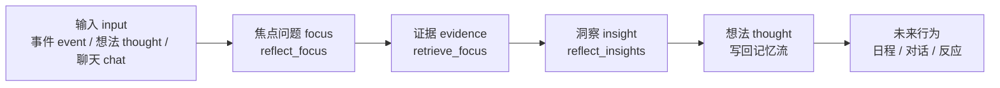
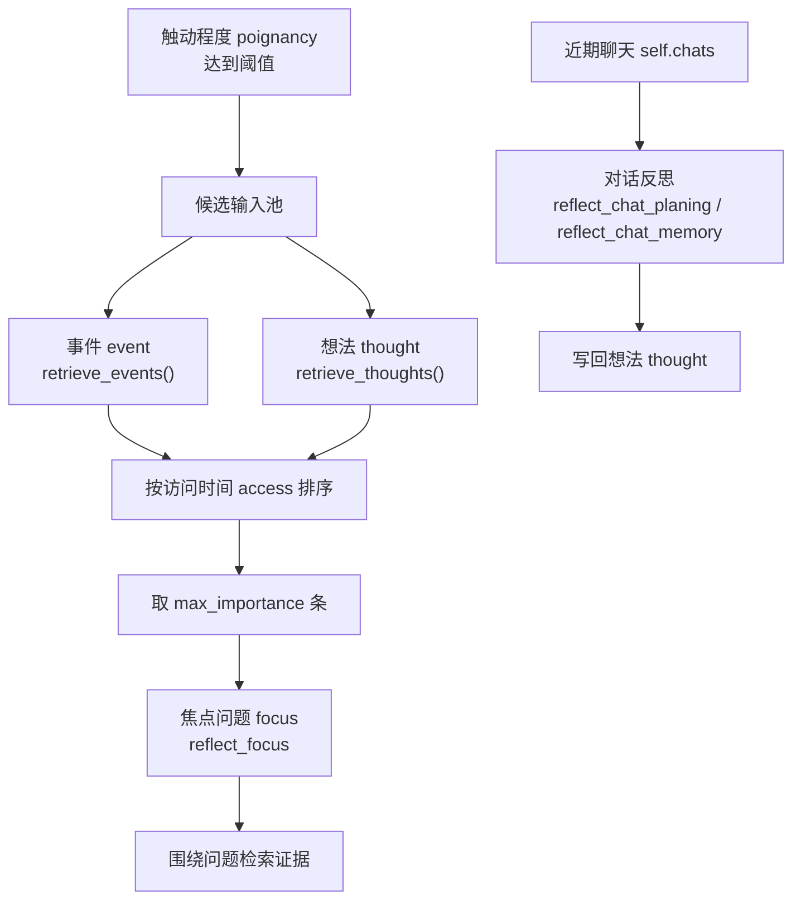

# 第 7 章 论文架构四：反思 Reflection

检索 Retrieval 解决“智能体此刻应该想起哪些过去经历”。反思 Reflection 解决“智能体如何从经历中形成高层判断”。人并不是每次都从原始经历重新推理一遍。人会总结、归纳，并形成对自己、他人、关系、环境和未来的稳定判断。

克劳斯 Klaus Mueller 与玛丽亚 Maria Lopez 的关系不是一条静态标签。它可以从几条经历中长出来：两人在咖啡馆聊天，玛丽亚认真回应克劳斯的研究话题，两人都愿意探索新想法。反思 Reflection 把这些碎片压成一条更有行为价值的想法 thought：

```text
克劳斯认为玛丽亚愿意讨论开放性问题，未来可以继续和她交流。
```

这条想法 thought 不是临时摘要。它会写回记忆流 Memory Stream，之后像事件 event 一样被检索 Retrieval 找回，继续影响日程 Planning、对话 Dialogue 和社交反应 Reacting。


*图 7-1：反思 Reflection 的系统入口。左侧是原始经历，包括事件 event、聊天 chat 和已有想法 thought；中间围绕焦点问题 focus 检索证据 evidence，生成洞察 insight；右侧把洞察写成新的想法 thought，重新进入记忆流 Memory Stream，并影响后续日程 Planning 和对话 Dialogue。*

## 7.1 原始经历为什么不够

只保存观察 observation，会留下三个缺口。

| 缺口 | 表现 | 对行为的影响 |
| --- | --- | --- |
| 记忆太碎 | 一天会产生大量吃饭、移动、看到别人、聊几句的低层事件 event。 | 每次决策都要临场推理，缺一两条关键记忆就会断。 |
| 低层事件不等于长期认知 | “两个人聊天”只说明发生了什么，不说明这段关系意味着什么。 | 角色重复寒暄，缺少经历之后的变化。 |
| 行为连续性需要抽象 | 共同兴趣、信任、目标和关系倾向不是单条观察能直接给出的。 | 后续计划和对话无法接上过去形成的判断。 |

*表 7-1：原始经历的局限。记忆流 Memory Stream 保存过去，反思 Reflection 把过去解释成可复用的高层认知。*

“克劳斯 Klaus Mueller 和玛丽亚 Maria Lopez 在咖啡馆聊天”是一条事件 event；“克劳斯认为玛丽亚愿意讨论开放性问题”是一个想法 thought；“克劳斯未来更愿意继续和玛丽亚交流”则是可能改变行为的社交倾向。反思 Reflection 的价值就在这三层之间：从事实到解释，再从解释回到未来行为。

## 7.2 业务闭环：克劳斯 Klaus Mueller 如何把咖啡馆交流变成想法 thought

克劳斯 Klaus Mueller 和玛丽亚 Maria Lopez 在咖啡馆的交流，进入反思 Reflection 后会被拆成一条可追溯链路。原始输入不是“关系很好”这种结论，而是几条低层经历：两人见面、聊天、交换兴趣、玛丽亚认真回应克劳斯的研究话题。

| 阶段 | 输入 | 处理 | 输出 |
| --- | --- | --- | --- |
| 原始经历 | 事件 event、聊天 chat、已有想法 thought | 写入记忆流 Memory Stream，并计算触动程度 poignancy | 可检索的记忆节点 Concept |
| 触发判断 | 累计触动程度 `poignancy`、阈值 `poignancy_max = 150` | `Agent.reflect()` 判断是否进入反思 | 达到阈值才继续 |
| 候选输入 | 近期事件 event、已有想法 thought | 按访问时间 access 排序，并截取 `max_importance` 条 | 反思候选记忆列表 |
| 焦点问题 | 候选记忆列表 | `reflect_focus.txt` 生成问题 | “克劳斯与玛丽亚是否有共同兴趣？” |
| 证据检索 | 焦点问题 focus | `retrieve_focus(..., reduce_all=False)` 分问题检索 | 问题到证据 evidence 的映射 |
| 洞察生成 | 每组证据 evidence | `reflect_insights.txt` 生成洞察 insight 和证据编号 | “克劳斯认为玛丽亚愿意讨论开放性问题” |
| 写回记忆 | 洞察 insight、真实证据节点 `node_id` | `_add_concept("thought", ...)` 写回 | 新想法 thought 进入 `Associate.memory["thought"]` |
| 后续使用 | 新想法 thought | 检索 Retrieval 在后续日程、对话、反应中找回 | 克劳斯更可能继续和玛丽亚交流 |

*表 7-2：克劳斯 Klaus Mueller 与玛丽亚 Maria Lopez 案例中的反思 Reflection 闭环。*

这条链路的最终结果可以写成一条业务事实：

```text
克劳斯 Klaus Mueller 不是被静态设定成“喜欢玛丽亚 Maria Lopez”，而是从咖啡馆交流、共同兴趣和认真回应这些证据中，形成“玛丽亚愿意讨论开放性问题，未来可以继续交流”的想法 thought。
```

反思不是一次性总结，而是把经历转成可检索、可追溯、可影响行为的想法 thought。后续章节看到克劳斯主动接近玛丽亚、延续共同兴趣话题，检查入口就是这条写回记忆流 Memory Stream 的 thought。


```mermaid
flowchart LR
    Input["输入 input<br/>事件 event / 想法 thought / 聊天 chat"] --> Focus["焦点问题 focus<br/>reflect_focus"]
    Focus --> Evidence["证据 evidence<br/>retrieve_focus"]
    Evidence --> Insight["洞察 insight<br/>reflect_insights"]
    Insight --> Thought["想法 thought<br/>写回记忆流"]
    Thought --> Future["未来行为<br/>日程 / 对话 / 反应"]
```

*图 7-2：反思 Reflection 的数据流。系统不是直接压缩全部历史，而是围绕问题收集证据，并把洞察写回记忆流 Memory Stream。*

## 7.3 反思 Reflection 不是聊天总结

普通总结通常是压缩，反思 Reflection 是解释。压缩关心的是更短地表达已有信息；解释关心的是从已有信息中得出新的高层判断。

| 类型 | 示例 | 回答的问题 | 是否会改变未来行为 |
| --- | --- | --- | --- |
| 聊天总结 | 克劳斯 Klaus Mueller 和玛丽亚 Maria Lopez 在咖啡馆聊了学习、兴趣和近期计划。 | 发生了什么。 | 影响较弱，只是压缩事实。 |
| 反思 Reflection | 克劳斯 Klaus Mueller 认为玛丽亚 Maria Lopez 愿意讨论开放性问题，未来可以继续交流。 | 这件事意味着什么。 | 影响较强，会改变后续社交选择。 |

*表 7-3：聊天总结和反思 Reflection 的差别。反思的核心不是省上下文，而是生成能被未来行为使用的解释。*

论文中的反思 Reflection 不是为了替代完整记忆流 Memory Stream。它的关键价值在于生成更抽象的想法 thought，并把这些想法 thought 重新放入记忆流 Memory Stream。之后，检索 Retrieval 可以同时找回低层事件和高层判断。

## 7.4 何时触发反思 Reflection

反思 Reflection 不是每发生一件事就执行一次。频繁反思成本高，也会让角色对小事过度解读。项目使用触动程度 `poignancy` 控制反思频率：事件写入记忆时会先经过重要性评分 prompt，普通日常事件得分低，强烈事件或关系变化得分高。

`generative_agents/data/config.json` 中的反思阈值如下：

```json
"think": {
  "interval": 1000,
  "poignancy_max": 150
}
```

`Agent.reflect()` 的触发条件很直接：

```python
if self.status["poignancy"] < self.think_config["poignancy_max"]:
    return
```

累计触动程度低于阈值时，智能体直接跳过反思 Reflection。达到阈值后，系统才会进入候选输入筛选、焦点问题生成、证据检索和洞察生成。反思结束后，项目会把 `self.status["poignancy"]` 重置为 `0`，避免同一批经历反复触发。

| 配置或字段 | 中文含义 | 行为影响 |
| --- | --- | --- |
| `poignancy` | 当前累计触动程度。 | 越高越接近反思触发点。 |
| `poignancy_max` | 反思触发阈值，当前配置为 `150`。 | 阈值越低，反思越频繁；阈值越高，反思越稀疏。 |
| `interval` | 思考间隔配置。 | 控制思考相关流程的节奏。 |
| `poignancy_event.txt` / `poignancy_chat.txt` | 重要性评分 prompt。 | 决定单条事件或聊天对累计值的贡献。 |

*表 7-4：反思 Reflection 的触发入口。反思频率由重要性评分和阈值共同决定。*

事件重要性评分提示词 `poignancy_event.txt` 的真实模板如下：

```text
${base_desc}

在1到10的范围内评分，评分原则：
1代表极其平常，例如刷牙、整理床铺等普通事件；
10代表极其特殊或强烈，令人印象深刻，例如分手、大学录取等特殊事件。
每个事件只能用1到10的整数表示。例如：
事件：刷牙。评分：1
事件：整理床铺。评分：1
事件：分手。评分：10
事件：大学录取。评分：10

以下是 ${agent} 需要评分的一个完整事件：
"""
${event}
"""
评分：<分数>

根据完整事件填写<分数>。
格式要求：只在1到10范围内输出1个数字，不要输出数字以外的任何内容。
```

英文含义：

```text
Score the emotional intensity of one event from 1 to 10.
Use 1 for ordinary events and 10 for highly memorable events.
Return only one integer.
```

对话重要性评分提示词 `poignancy_chat.txt` 的真实模板如下：

```text
${base_desc}

在1到10的范围内评分，评分原则：
1代表极其平常，例如早上的日常问候；
10代表极其特殊或强烈，令人印象深刻，例如关于分手、争吵的对话。
每个对话只能用1到10的整数表示。例如：
对话：早上的日常问候。评分：1
对话：关于分手、争吵的对话。评分：10

以下是 ${agent} 需要评分的一场完整对话：
"""
${event}
"""
评分：<分数>

根据完整事件填写<分数>。
格式要求：只在1到10范围内输出1个数字，不要输出数字以外的任何内容。
```

英文含义：

```text
Score the emotional intensity of one conversation from 1 to 10.
Use 1 for routine greetings and 10 for intense or memorable conversations.
Return only one integer.
```

包装函数把两类输出都限制成整数：

```python
class PoignancyEventResponse(BaseModel):
    res: int = Field(description="事件的情感强度评分，整数，范围1到10")

class PoignancyChatResponse(BaseModel):
    res: int = Field(description="对话的情感强度评分，整数，范围1到10")
```

| 项目 | 事件评分 `poignancy_event` | 对话评分 `poignancy_chat` |
| --- | --- | --- |
| 输入变量 | 基础描述 base_desc、角色 agent、事件 event | 基础描述 base_desc、角色 agent、对话 event |
| 输出结构 schema | `res: int`，范围 1 到 10 | `res: int`，范围 1 到 10 |
| 回调 callback | 无额外回调，直接使用结构化整数 | 无额外回调，直接使用结构化整数 |
| 兜底值 failsafe | 1 到 10 的随机整数 | 1 到 10 的随机整数 |
| 累计位置 | 写入 `self.status["poignancy"]` | 写入 `self.status["poignancy"]` |

克劳斯 Klaus Mueller 与玛丽亚 Maria Lopez 的案例中，代表性评分如下：

| 输入 | 代表性输出 | 含义 |
| --- | --- | --- |
| `克劳斯今天在咖啡馆遇到玛丽亚` | `4` | 普通社交事件，但和关系发展有关。 |
| `玛丽亚认真回应了克劳斯的研究话题` | `6` | 对克劳斯有明显意义，可能影响后续社交判断。 |
| `克劳斯和玛丽亚围绕研究兴趣展开了一段深入对话` | `7` | 对话不只是寒暄，足以推动反思 Reflection。 |

这些分数会累加到触动程度 poignancy。达到 `poignancy_max = 150` 后，系统才进入下一节的候选输入筛选。

## 7.5 候选输入边界

触发反思 Reflection 后，系统先准备候选输入。它不会读取全部记忆流 Memory Stream，而是取近期事件 event 和已有想法 thought。

```python
nodes = self.associate.retrieve_events() + self.associate.retrieve_thoughts()
nodes = sorted(nodes, key=lambda n: n.access, reverse=True)[
    : self.associate.max_importance
]
```

这段逻辑有三个约束：
- 常规候选输入来自事件 event 和想法 thought；
- 候选输入按访问时间 `access` 取近期内容；输入数量受 `max_importance` 控制。
- 聊天 chat 不进入这一步的 `event + thought` 候选池，而是在后面的对话反思分支单独处理。

| 输入类型 | 中文含义 | 在反思 Reflection 中的作用 | 边界 |
| --- | --- | --- | --- |
| 事件 event | 观察、行动、对话摘要等低层经历。 | 提供事实证据。 | 单条事件太碎，不能直接代表长期认知。 |
| 想法 thought | 过去反思生成的高层判断。 | 提供已有认知，让反思可以递归。 | 想法也可能过度概括，需要新证据校正。 |
| 聊天 chat | 与某人的对话记忆。 | 对话后单独整理成计划影响和长期记忆。 | 不进入常规 `event + thought` 候选池。 |

*表 7-5：反思 Reflection 的候选输入边界。它不是总览全部历史，也不是只看最后一件事。*


```mermaid
flowchart TD
    Trigger["触动程度 poignancy<br/>达到阈值"] --> Pool["候选输入池"]
    Pool --> Events["事件 event<br/>retrieve_events()"]
    Pool --> Thoughts["想法 thought<br/>retrieve_thoughts()"]
    Events --> Sort["按访问时间 access 排序"]
    Thoughts --> Sort
    Sort --> Limit["取 max_importance 条"]
    Limit --> Focus["焦点问题 focus<br/>reflect_focus"]

    Chats["近期聊天 self.chats"] --> ChatReflect["对话反思<br/>reflect_chat_planing / reflect_chat_memory"]
    ChatReflect --> Thought["写回想法 thought"]
    Focus --> Evidence["围绕问题检索证据"]
```

*图 7-3：项目中 `Agent.reflect()` 的分支。常规反思先筛事件 event 和想法 thought；对话反思单独处理聊天 chat，并把结果写成想法 thought。*

## 7.6 从候选记忆到焦点问题 focus

反思 Reflection 不直接总结候选记忆，而是先生成焦点问题 focus。

```python
focus = self.completion("reflect_focus", nodes, 3)
```

`reflect_focus.txt` 的任务是根据候选记忆提出几个值得深入思考的问题。给定下面这组记忆：

```text
0. 克劳斯今天在咖啡馆遇到玛丽亚。
1. 玛丽亚说她喜欢探索新想法。
2. 克劳斯提到自己正在研究低收入社区中产阶级化。
3. 玛丽亚认真回应了克劳斯的研究话题。
```

代表性焦点问题 focus 如下：

```text
克劳斯与玛丽亚是否有共同兴趣？
克劳斯今天的研究计划受到了哪些社交互动影响？
克劳斯未来是否应该继续与玛丽亚交流？
```

`generative_agents/data/prompts/reflect_focus.txt` 的真实模板如下：

```text
根据给定的记忆节点，生成反思的焦点问题。

"""
记忆节点：
${reference}

生成${number}个反思焦点问题：
"""

确保返回的数据格式遵守schema：
[
  "焦点问题1",
  "焦点问题2",
  "焦点问题3",
  ...
]

要求：
- 问题要基于给定的记忆节点
- 问题要简洁明了，便于引导反思
- 确保遵守返回的格式schema

示例：
"""
记忆节点：
1. 凯莉在厨房做早餐
2. 凯莉计划今天去超市购物
3. 凯莉昨天和朋友聊天很愉快

生成3个反思焦点问题：
"""

确保返回的数据格式遵守schema：
[
  "凯莉今天的生活重点是什么？",
  "凯莉最近的社交活动如何？",
  "凯莉的日常习惯有什么变化？"
]
```

`reflect_focus.txt` 的关键结构如下：

| 项目 | 内容 |
| --- | --- |
| 提示词 prompt 路径 | `generative_agents/data/prompts/reflect_focus.txt` |
| 输入变量 | 候选记忆 `reference`、问题数量 `number`。 |
| 中文任务 | 根据给定的记忆节点，生成反思的焦点问题。 |
| 英文含义 | Generate reflection focus questions based on the given memory nodes. |
| 输出结构 schema | `res: list[str]`，每项是一个焦点问题。 |
| 兜底值 failsafe | “某某是谁？”、“某某住在哪里？”、“某某今天要做什么？” |

*表 7-6：焦点问题 prompt 的项目读法。焦点问题决定后续检索证据的方向。*

这段模板的关键不是把多条记忆压缩成摘要，而是把候选记忆转成可检索的问题。`${reference}` 承接前面筛出的高重要性记忆节点，`${number}` 在当前调用中是 `3`，输出结构 schema 则要求模型只返回问题字符串列表。

源码构造 `${reference}` 时使用的是 0-based 局部编号：

```python
"reference": "\n".join(
    ["{}. {}".format(idx, n.describe) for idx, n in enumerate(nodes)]
)
```

所以正文中的代表性输入使用 `0. 1. 2. 3.`。这些数字不是全局记忆编号，也不是 `node_id`；它们只是当前这一次提示词 prompt 输入列表里的局部下标。后面的 `reflect_insights` 会把局部下标映射回真实证据节点 `node_id`。

问题越具体，后面的洞察 insight 越容易落到行为上；过于泛的问题会生成“克劳斯是一个关心社会议题的人”这类宽泛判断，更具体的问题会把证据推向“克劳斯是否愿意继续与玛丽亚交流”。

## 7.7 围绕焦点问题检索证据 evidence

生成焦点问题 focus 后，系统用每个问题重新检索记忆流 Memory Stream。

```python
retrieved = self.associate.retrieve_focus(focus, reduce_all=False)
```

`reduce_all=False` 很关键。它保留“一个问题对应一组证据”的结构，而不是把所有检索结果混成一堆。

从 `generative_agents/modules/memory/associate.py` 看，`retrieve_focus()` 的返回值有两种形状。默认的 `reduce_all=True` 会把多个焦点问题的结果合并去重；反思 Reflection 这里显式传入 `reduce_all=False`，所以返回的是焦点问题到证据节点列表的映射。

```python
def retrieve_focus(self, focus, retrieve_max=30, reduce_all=True):
    retrieved = {}
    node_ids = self.memory["event"] + self.memory["thought"]
    for text in focus:
        nodes = self._index.retrieve(
            text,
            similarity_top_k=len(node_ids),
            node_ids=node_ids,
            retriever_creator=_create_retriever,
        )
        if reduce_all:
            retrieved.update({n.id_: n for n in nodes})
        else:
            retrieved[text] = nodes
    if reduce_all:
        return [self.to_concept(v) for v in retrieved.values()]
    return {
        text: [self.to_concept(n) for n in nodes]
        for text, nodes in retrieved.items()
    }
```

这段返回值可以按下面的形状理解：

```python
{
    "克劳斯与玛丽亚是否有共同兴趣？": [
        Concept(node_id="event-001", node_type="event", describe="克劳斯今天在咖啡馆遇到玛丽亚"),
        Concept(node_id="event-002", node_type="event", describe="玛丽亚说她喜欢探索新想法"),
        Concept(node_id="event-003", node_type="event", describe="克劳斯提到自己正在研究低收入社区中产阶级化"),
    ],
    "克劳斯未来是否应该继续与玛丽亚交流？": [
        Concept(node_id="event-002", node_type="event", describe="玛丽亚说她喜欢探索新想法"),
        Concept(node_id="event-004", node_type="event", describe="玛丽亚认真回应了克劳斯的研究话题"),
    ],
}
```

这里的证据 evidence 不是普通字符串，而是 `Concept` 记忆节点。节点对象里至少有几类会影响反思质量的字段：

| 字段 | 含义 | 对反思 Reflection 的作用 |
| --- | --- | --- |
| `node_id` | 真实记忆节点编号。 | 后面写回想法 thought 时保存证据来源。 |
| `node_type` | 记忆类型，例如 `event` 或 `thought`。 | 说明证据来自低层事件还是已有高层想法。 |
| `describe` | 可读的事件或想法描述。 | 会进入 `reflect_insights` 的提示词 prompt。 |
| `poignancy` | 触动程度或重要性评分。 | 参与检索排序，重要记忆更容易成为证据。 |
| `access` | 最近访问时间。 | 检索后会被刷新，影响后续近因性 recency。 |

这个映射结构会直接进入下一步洞察生成。`Agent.reflect()` 不把所有证据摊平成一个列表，而是逐组处理：

```python
for r_nodes in retrieved.values():
    thoughts = self.completion("reflect_insights", r_nodes, 5)
```

因此，7.8 中 `reflect_insights` 返回的 `"0,1,2"`，编号的是当前这一组 `r_nodes` 中的局部证据下标，不是全局记忆流 Memory Stream 的编号。回调 callback 会再把这些局部下标映射回真实 `node_id`，这样新写入的想法 thought 才能保留可追溯证据。

| 做法 | 结果 | 风险或价值 |
| --- | --- | --- |
| 把所有记忆混在一起总结。 | 得到宽泛判断。 | 容易生成“这个人很友好”之类弱结论。 |
| 按焦点问题分别检索证据。 | 得到问题-证据对应关系。 | 更容易生成可追溯、可用于行为的洞察 insight。 |

*表 7-7：焦点问题和证据结构。反思 Reflection 仍然遵循“记忆流 Memory Stream -> 检索 Retrieval -> 推理 reasoning”的路径。*

这一步让反思 Reflection 保持证据边界。焦点问题 focus 负责问“要解释什么”，证据 evidence 负责回答“凭什么解释”。

## 7.8 生成洞察 insight

检索到证据后，系统调用 `reflect_insights`。

```python
for r_nodes in retrieved.values():
    thoughts = self.completion("reflect_insights", r_nodes, 5)
    for thought, evidence in thoughts:
        _add_thought(thought, evidence)
```

`reflect_insights.txt` 要求返回洞察内容和相关节点编号。代表性输出如下：

```text
("克劳斯认为玛丽亚愿意讨论开放性问题，未来可以继续交流", "0,1,2")
```

`generative_agents/data/prompts/reflect_insights.txt` 的真实模板如下：

```text
根据给定的记忆节点，生成反思洞察。

"""
记忆节点：
${reference}

生成${number}个反思洞察：
"""

确保返回的数据格式遵守schema：
[
  ("洞察内容", "相关节点编号"),
  ("洞察内容", "相关节点编号"),
  ...
]

要求：
- 洞察要基于给定的记忆节点
- 洞察要深刻且有启发性
- 节点编号用逗号分隔，如"1,2,3"
- 确保返回的数据格式遵守schema

示例：
"""
记忆节点：
1. 凯莉在厨房做早餐
2. 凯莉计划今天去超市购物
3. 凯莉昨天和朋友聊天很愉快

生成5个反思洞察：
"""

确保返回的数据格式遵守schema：
[
  ("凯莉注重健康饮食，每天都会准备营养早餐", "1"),
  ("凯莉有良好的购物计划习惯", "2"),
  ("凯莉重视社交关系，经常与朋友保持联系", "3"),
  ("凯莉的生活很有规律，注重工作与生活的平衡", "1,2"),
  ("凯莉是一个有条理的人，善于安排时间", "1,2,3")
]
```

项目会把模型返回的编号字符串转成真实的 `node_id`：

```python
indices = [int(i.strip()) for i in node_ids_str.split(",")]
node_ids = [nodes[i].node_id for i in indices if i < len(nodes)]
insights.append([insight.strip(), node_ids])
```

| 项目 | 内容 |
| --- | --- |
| 提示词 prompt 路径 | `generative_agents/data/prompts/reflect_insights.txt` |
| 输入变量 | 证据记忆 `reference`、洞察数量 `number`。 |
| 中文任务 | 根据给定的记忆节点，生成反思洞察。 |
| 英文含义 | Generate reflection insights based on the given memory nodes. |
| 输出结构 schema | `res: list[tuple[str, str]]`，每项是“洞察内容 + 相关节点编号字符串”。 |
| 兜底值 failsafe | “某某在考虑下一步该做什么”，证据为第一条候选记忆。 |

*表 7-8：洞察 prompt 的项目读法。洞察 insight 必须绑定证据编号，否则很容易变成没有来源的记忆幻觉。*

`reflect_insights` 和 `reflect_focus` 的差别在输出约束上。焦点问题只需要返回字符串；洞察 insight 必须返回二元组 `(洞察内容, 相关节点编号)`。这里的编号不是全局 `node_id`，而是本次提示词 prompt 输入列表中的局部下标。项目构造输入时使用 `enumerate(nodes)`，因此真实输入下标从 `0` 开始；模板里的 `"1,2,3"` 是示例文本，不代表全局记忆编号。

回调 callback 会把 `"0,1,2"` 这类局部下标映射成真实记忆节点 `node_id`。以克劳斯 Klaus Mueller 的案例为例：

| 局部下标 | 代表性记忆 describe | 映射后的证据节点 |
| --- | --- | --- |
| `0` | 克劳斯今天在咖啡馆遇到玛丽亚 | `event-001` |
| `1` | 玛丽亚说她喜欢探索新想法 | `event-002` |
| `2` | 克劳斯提到自己正在研究低收入社区中产阶级化 | `event-003` |

写回的想法 thought 保存的是 `event-001`、`event-002`、`event-003` 这些真实证据节点，而不是字符串 `"0,1,2"` 本身。

这个设计让每条新想法 thought 都能带着证据来源写回记忆流 Memory Stream，也留下了一个边界：prompt 里“深刻且有启发性”的要求可能鼓励模型做抽象归纳，相关节点编号只能约束来源，不能自动保证结论不过度推断。

| 原始证据 | 过度推断 | 更合理的洞察 insight |
| --- | --- | --- |
| 玛丽亚 Maria Lopez 认真听克劳斯 Klaus Mueller 讲话。 | 玛丽亚已经爱上了克劳斯。 | 克劳斯认为玛丽亚愿意倾听自己的研究想法。 |
| 阿伊莎 Ayesha Khan 答应了解派对。 | 阿伊莎一定会参加派对。 | 阿伊莎知道派对时间，并可能考虑参加。 |
| 居民询问山姆 Sam Moore 的竞选。 | 居民已经支持山姆。 | 山姆意识到居民开始关注他的竞选。 |

*表 7-9：洞察 insight 的证据边界。反思可以抽象，但不能把弱证据写成强结论。*

## 7.9 写回想法 thought

洞察 insight 会写回记忆流 Memory Stream，成为 `thought` 类型的记忆节点 Concept。

```python
event = self.make_event(self.name, thought, self.get_tile().get_address())
return self._add_concept("thought", event, filling=evidence)
```

项目把想法 thought 包装成事件式结构 event-like structure。这样做有三个结果。

| 结果 | 含义 | 后续影响 |
| --- | --- | --- |
| 存储统一 | 事件 event 和想法 thought 都能写入关联记忆 Associate。 | 记忆管理不用再维护两套完全不同的数据结构。 |
| 检索统一 | 想法 thought 也能进入向量索引并被检索 Retrieval 找回。 | 日程、对话和反应可以直接读取高层判断。 |
| 反思递归 | 想法 thought 进入记忆流 Memory Stream 后，可以参与下一轮反思 Reflection。 | 角色能从经历形成更高层的自我、关系和目标理解。 |

*表 7-10：想法 thought 写回记忆流 Memory Stream 的作用。反思产物不是临时摘要，而是角色长期认知的一部分。*

递归写回会形成反思树 reflection tree：

```text
事件 event
  -> 想法 thought
    -> 更高层想法 higher-level thought
      -> 自我理解 / 关系理解 / 目标理解
```

## 7.10 对话后的反思 Reflection

`Agent.reflect()` 还会处理近期聊天 `self.chats`。这条分支和常规反思不同：它不先生成焦点问题，而是把聊天直接整理成两类想法。

```python
thought = self.completion("reflect_chat_planing", self.chats)
_add_thought(f"对于 {self.name} 的计划：{thought}", evidence)
thought = self.completion("reflect_chat_memory", self.chats)
_add_thought(f"{self.name} {thought}", evidence)
```

源码文件名保留了 `reflect_chat_planing` 的拼写。正文读法是“对话后的计划反思”。

| 分支 | 提示词 prompt | 输入 | 输出结构 schema | 写回形式 |
| --- | --- | --- | --- | --- |
| 计划影响 | `reflect_chat_planing.txt` | 对话记录 `conversation`、角色 `agent`。 | `res: str`。 | `对于 {name} 的计划：...` |
| 长期记忆 | `reflect_chat_memory.txt` | 对话记录 `conversation`、角色 `agent`。 | `res: str`。 | `{name} ...` |

*表 7-11：对话后的反思 Reflection。对话不只是文本交换，也可能改变计划、承诺和关系。*

计划反思提示词 `reflect_chat_planing.txt` 的真实模板如下：

```text
对话记录：
"""
${conversation}
"""

根据以上对话记录，以 ${agent} 的视角，用一句话描述 ${agent} 是否需要记住自己的计划。
```

英文含义：

```text
Given the conversation, describe in one sentence whether ${agent} needs to remember anything about their own plan.
```

长期记忆提示词 `reflect_chat_memory.txt` 的真实模板如下：

```text
对话记录：
"""
${conversation}
"""

以 ${agent} 的视角，用一句话描述对话中最有趣的地方。
```

英文含义：

```text
Given the conversation, describe the most interesting thing from ${agent}'s perspective in one sentence.
```

两份提示词 prompt 的包装函数结构相同：

| 项目 | 计划反思 `reflect_chat_planing` | 长期记忆 `reflect_chat_memory` |
| --- | --- | --- |
| 输入变量 | 对话记录 conversation、角色 agent | 对话记录 conversation、角色 agent |
| 输出结构 schema | `res: str`，一句话描述计划影响 | `res: str`，一句话描述值得记忆的内容 |
| 回调 callback | `response.strip() or failsafe` | `response.strip() or failsafe` |
| 兜底值 failsafe | `{name} 进行了一次对话` | `{name} 进行了一次对话` |
| 写回前缀 | `对于 {name} 的计划：...` | `{name} ...` |

伊莎贝拉 Isabella Rodriguez 邀请阿伊莎 Ayesha Khan 参加派对后，代表性对话输入如下：

```text
伊莎贝拉: 阿伊莎，2月14日下午5点到7点，霍布斯咖啡馆会举办情人节派对。
阿伊莎: 听起来很有意思，我会看看时间，也可以告诉附近的朋友。
```

计划反思 `reflect_chat_planing` 的代表性输出：

```text
伊莎贝拉需要记住阿伊莎已经知道派对时间，并可能帮助把消息告诉附近的朋友。
```

写回后的想法 thought：

```text
对于 伊莎贝拉 的计划：伊莎贝拉需要记住阿伊莎已经知道派对时间，并可能帮助把消息告诉附近的朋友。
```

长期记忆 `reflect_chat_memory` 的代表性输出：

```text
记得阿伊莎对咖啡馆情人节派对表现出兴趣，并愿意把消息告诉朋友。
```

写回后的想法 thought：

```text
伊莎贝拉 记得阿伊莎对咖啡馆情人节派对表现出兴趣，并愿意把消息告诉朋友。
```

这两条 thought 的用途不同：第一条更容易影响日程 Planning 和提醒任务，第二条更容易影响后续对话 Dialogue 和关系判断。

## 7.11 克劳斯 Klaus Mueller 与玛丽亚 Maria Lopez 案例

克劳斯 Klaus Mueller 与玛丽亚 Maria Lopez 的案例可以把整条链路串起来。

| 阶段 | 内容 | 项目读法 |
| --- | --- | --- |
| 原始事件 event | 克劳斯和玛丽亚在咖啡馆聊天，玛丽亚认真回应克劳斯的研究话题。 | 低层经历进入记忆流 Memory Stream。 |
| 焦点问题 focus | 克劳斯与玛丽亚是否有共同兴趣？ | `reflect_focus` 生成反思方向。 |
| 证据 evidence | 玛丽亚喜欢探索新想法，克劳斯研究社会议题，双方都愿意继续讨论。 | `retrieve_focus(..., reduce_all=False)` 找回相关记忆。 |
| 洞察 insight | 克劳斯认为玛丽亚愿意讨论开放性问题，未来可以继续交流。 | `reflect_insights` 生成带证据编号的高层判断。 |
| 想法 thought | 克劳斯发现玛丽亚虽然专业不同，但同样喜欢探索新想法。 | `_add_concept("thought", ...)` 写回记忆。 |
| 后续行为 | 克劳斯更可能主动接近玛丽亚，或延续共同兴趣话题。 | 日程 Planning、对话 Dialogue、反应 Reacting 都可能检索到这条 thought。 |

*表 7-12：克劳斯 Klaus Mueller 与玛丽亚 Maria Lopez 的反思链路。关系不是静态标签，而是由事件、问题、证据和洞察逐步生成。*

直接写“克劳斯喜欢玛丽亚”是设定；通过反思 Reflection 得到“克劳斯发现玛丽亚与自己有共同兴趣，因此更愿意继续交流”是经历推动的关系变化。后者才是生成式智能体 Generative Agents 想要模拟的行为可信性。

## 7.12 失败诊断与观察入口

反思 Reflection 有收益，也有成本。调试时不能只看“有没有生成 thought”，还要看触发是否合理、证据是否可靠、写回后是否真的影响行为。

| 失败表现 | 可能原因 | 检查位置 | 修正方向 |
| --- | --- | --- | --- |
| 很少形成高层认知 | `poignancy` 长期低于 `poignancy_max`。 | 日志中的 `reflect(P.../...)`、`config.json`。 | 调低阈值，或检查重要性评分 prompt。 |
| 对小事过度解读 | 阈值过低，或普通事件重要性评分过高。 | thought 数量、反思频率、普通事件的 `poignancy`。 | 提高阈值，收紧重要性评分口径。 |
| 焦点问题太泛 | `reflect_focus` 只生成“今天重点是什么”这类问题。 | `reflect_focus` 输出。 | 让候选记忆更有代表性，或调整 prompt 示例。 |
| 洞察没有证据 | `reflect_insights` 输出过度抽象，证据编号弱。 | 洞察对应的 `node_id` 和原始记忆。 | 强化证据约束，人工审计高风险 thought。 |
| thought 没被使用 | 写回成功，但后续检索 Retrieval 没取到。 | `Associate.memory["thought"]`、`retrieve_focus()` 结果。 | 检查向量索引、查询 focus 和重要性权重。 |
| 错误继续传播 | 错误 thought 写回后被计划或对话继续使用。 | 对话原文、断点 checkpoint、记忆节点 Concept。 | 增加冲突检测和事实回查。 |

*表 7-13：反思 Reflection 的失败诊断。重点不是有没有 thought，而是 thought 是否有证据、是否被使用、是否真的改变行为。*

| 观察入口 | 看什么 | 证据强度 |
| --- | --- | --- |
| 日志 log | `Agent.reflect()` 是否打印角色名、累计 `poignancy`、阈值和候选概念数量。 | 中，说明触发发生过。 |
| 记忆 memory | checkpoint 中 `Associate.memory["thought"]` 是否新增内容。 | 强，说明 thought 写入成功。 |
| 证据 evidence | 洞察绑定的 `node_id` 是否能回到原始事件。 | 强，说明 insight 有来源。 |
| 行为 behavior | 克劳斯是否更常接近玛丽亚，是否引用共同兴趣，是否改变对话和计划。 | 最强，说明反思真的进入行为链路。 |

*表 7-14：如何观察反思 Reflection。最终标准不是写入成功，而是后续行为改变。*

## 7.13 本章小结

反思 Reflection 的核心不是“总结得更漂亮”，而是让角色从经历中形成有证据的高层判断。它先用重要性评分和 `poignancy_max` 控制触发，再从近期事件 event 和已有想法 thought 中提出焦点问题 focus，围绕问题检索证据 evidence，生成洞察 insight，最后把洞察写回记忆流 Memory Stream，成为新的想法 thought。

判断一条反思是否可靠，要看四件事：它是否有明确输入，是否围绕具体问题检索证据，洞察是否绑定原始节点，写回后是否能被后续日程 Planning、对话 Dialogue 或反应 Reacting 使用。没有证据的 thought 只是更漂亮的幻觉；能回到证据并改变行为的 thought，才是生成式智能体 Generative Agents 中有价值的反思。

下一章进入日程 Planning。到那里可以看到记忆流 Memory Stream、检索 Retrieval 和反思 Reflection 如何共同落到一天的生活安排里。

## 参考资料

- Joon Sung Park, Joseph C. O'Brien, Carrie J. Cai, Meredith Ringel Morris, Percy Liang, Michael S. Bernstein. *Generative Agents: Interactive Simulacra of Human Behavior*. arXiv: https://arxiv.org/abs/2304.03442
- ar5iv full text: https://ar5iv.labs.arxiv.org/html/2304.03442
- Generative Agents local source: `generative_agents/modules/agent.py`
- Generative Agents local source: `generative_agents/modules/prompt/scratch.py`
- Generative Agents local config: `generative_agents/data/config.json`
- Generative Agents local prompts: `generative_agents/data/prompts/reflect_focus.txt`, `generative_agents/data/prompts/reflect_insights.txt`, `generative_agents/data/prompts/reflect_chat_planing.txt`, `generative_agents/data/prompts/reflect_chat_memory.txt`, `generative_agents/data/prompts/poignancy_event.txt`, `generative_agents/data/prompts/poignancy_chat.txt`
