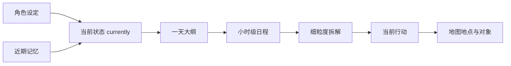
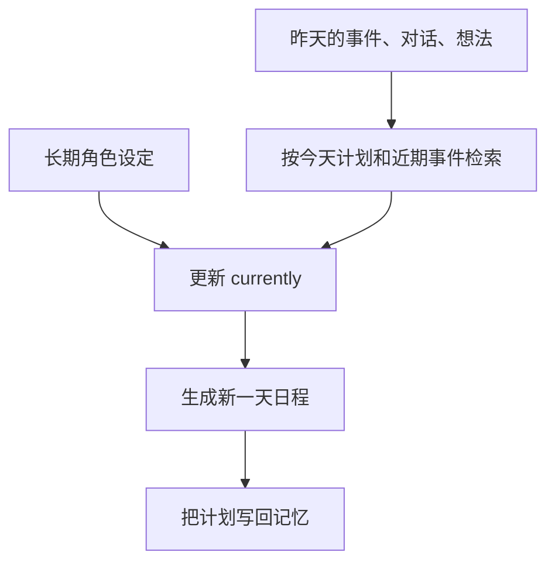
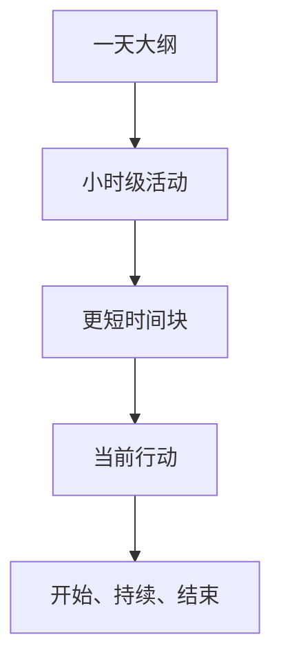

# 第 8 章 论文架构五：Planning

## 8.1 Planning 解决什么

Memory Stream、Retrieval 和 Reflection 让智能体能够保存经历、想起经历、解释经历。Planning 要解决下一步：角色如何把这些内部状态变成一天的生活。在 Generative Agents 中，智能体不是等用户提问的聊天窗口。它们生活在 Smallville 里，要醒来、吃饭、上学、工作、去咖啡馆、遇见别人、回家睡觉。用户不应该逐条指定这些动作，系统必须自己生成合理日程。Planning 的目标可以说得很直接：

| Planning 要解决的问题 | 没有它会怎样 | 有了它以后 |
| --- | --- | --- |
| 今天做什么 | 角色每一步都临时决定，行为漂浮 | 角色有一天的生活骨架 |
| 每件事做多久 | 行动频繁跳变，缺少稳定性 | 行动有开始、持续和结束 |
| 去哪里做 | 文本计划无法落到地图 | 行为能绑定到具体地点和对象 |
| 计划如何细化 | “写论文三小时”太粗 | 系统能拆成整理资料、阅读、写作等动作 |
| 过去如何影响今天 | 每天像重启 | 新一天会接上昨天的记忆和目标 |

所以，Planning 不是给角色写一张漂亮的时间表。它是把 persona、currently、记忆、空间和时间连起来，让角色能够持续生活。



*图 8-1：Planning 的基本链路。角色不是直接生成一个动作，而是从长期设定和近期经历出发，逐层生成可执行的生活安排。*

## 8.2 从“会聊天”到“会生活”

普通 LLM 应用通常围绕一次输入生成一次输出。用户问一句，模型答一句。这个结构适合问答、摘要、改写和客服，但不适合虚拟小镇。Smallville 中的居民即使没有用户输入，也要继续行动。早上到了要起床，白天要去工作或学习，晚上要休息；路上遇到熟人，可能会停下来聊天；听到派对消息，后续计划可能发生变化。这就是 agent 和 chatbot 的分界。

| 对比项 | 聊天机器人 | 生成式智能体 |
| --- | --- | --- |
| 触发方式 | 用户输入触发 | 时间、位置、记忆、事件共同触发 |
| 行为单位 | 一段回复 | 一段持续行动 |
| 时间意识 | 通常很弱 | 必须知道现在几点、今天要做什么 |
| 空间意识 | 通常没有 | 必须知道自己在哪里、要去哪里 |
| 状态延续 | 依赖聊天历史 | 依赖 persona、memory、schedule、action |
| 核心问题 | 怎么回答 | 怎么生活 |

Planning 让智能体从“会说话”进入“会生活”。后面的 Reacting 和 Dialogue 都建立在这个基础上：角色先有自己的生活安排，现场事件和对话才有东西可以打断、修改和继承。

## 8.3 新一天不是从空白开始

Generative Agents 在生成新一天日程前，会先更新 `currently`。这一步容易被忽略，但它决定角色是否有连续性。初始 persona 只描述角色一开始是谁；仿真运行一天以后，角色已经经历了新的对话、计划、事件和想法。新一天的计划如果只看原始角色卡，角色就像每天早上被格式化。项目中，系统会围绕两个焦点检索记忆：

```python
focus = [
    f"{self.name} 在 {utils.get_timer().daily_format_cn()} 的计划。",
    f"在 {self.name} 的生活中，重要的近期事件。",
]
retrieved = self.associate.retrieve_focus(focus)
```

这段代码的中文意思很简单：

| 代码元素 | 中文意思 | 对 Planning 的影响 |
| --- | --- | --- |
| `focus` | 检索记忆时使用的关注点 | 告诉系统“今天计划”和“近期重要事件”最重要 |
| `retrieve_focus()` | 围绕关注点召回相关记忆 | 把昨天和最近发生的事带入新一天 |
| `retrieve_plan` | 与计划有关的记忆 | 帮助角色延续未完成目标 |
| `retrieve_thought` | 与想法有关的记忆 | 帮助角色延续关系判断和自我理解 |
| `retrieve_currently` | 更新后的当前状态 | 成为生成日程的直接上下文 |

例如，伊莎贝拉前一天已经开始准备情人节派对，第二天的 `currently` 就不能还停留在“她想办派对”。更合理的状态是：她已经邀请了一些人，还需要继续准备咖啡馆和提醒朋友。



*图 8-2：新一天日程生成前的状态接续。Planning 不是从空白开始，而是把过去经历接到今天。*

## 8.4 起床时间

Planning 的第一步是确定角色什么时候醒来。

```python
wake_up = self.completion("wake_up")
```

`wake_up.txt` 会根据角色的基础描述和生活习惯生成起床时间。项目用 schema 把输出约束为 0 到 11 之间的整数。这看似是小细节，实际很关键。不同角色应该有不同作息。早起的店主、晚睡的学生、通宵工作的艺术家，如果都在同一时间醒来，小镇会显得很假。起床时间还会影响一天后面的全部活动。醒得早，上午就有更多空间；醒得晚，上午的行动自然减少。可信行为往往不是靠一句宏大的设定，而是靠这些小约束累计出来的。

## 8.5 一天大纲

确定起床时间后，系统生成初始日程：

```python
init_schedule = self.completion("schedule_init", wake_up)
```

这一步生成的是一天的叙事大纲，不是严格的 24 小时时间表。它通常像这样：

```text
早上起床并吃早餐。
上午去学院学习。
中午在咖啡馆吃饭。
下午继续写论文。
晚上回宿舍休息。
```

这个大纲有三个作用：

| 作用 | 说明 |
| --- | --- |
| 给一天定主题 | 角色今天主要是在工作、学习、休息，还是准备活动 |
| 保留角色差异 | 学生、店主、艺术家、政治候选人的一天不应该一样 |
| 为细化留空间 | 后续可以再拆成小时级活动和更短时间块 |

如果一上来就让模型输出 24 小时细表，容易出现两类问题：活动太碎，缺少主线；或者活动太机械，像填表。先生成一天大纲，再细化，是更稳的做法。

## 8.6 小时级日程

一天大纲之后，Generative Agents 用 `schedule_daily` 生成 24 小时日程。代码中先构造时间模板：

```python
hours = [f"{i}:00" for i in range(24)]
seed = [(h, "睡觉") for h in hours[:wake_up]]
seed += [(h, "") for h in hours[wake_up:]]
```

起床前默认是睡觉，起床后由模型填活动。输出类似：

```json
{
  "6:00": "起床并完成早晨的例行工作",
  "7:00": "吃早餐",
  "8:00": "读书",
  "9:00": "读书",
  "12:00": "吃午饭",
  "18:00": "回家",
  "23:00": "睡觉"
}
```

项目还会检查活动是否过于单调：

```python
if len(set(schedule.values())) >= self.schedule.diversity:
    break
```

这段逻辑的意思是：一天不能全是同一个动作。角色可以长时间学习或工作，但仍然应该有吃饭、移动、休息、社交等节奏变化。生成后，系统把小时转换为一天中的分钟数，并计算每段活动持续多久：

```python
schedule = {_to_duration(k): v for k, v in schedule.items()}
starts = list(sorted(schedule.keys()))
for idx, start in enumerate(starts):
    end = starts[idx + 1] if idx + 1 < len(starts) else 24 * 60
    self.schedule.add_plan(schedule[start], end - start)
```

最终 `Schedule.daily_schedule` 中的每个计划项都带有时间边界。

| 字段 | 中文意思 | 行为影响 |
| --- | --- | --- |
| `idx` | 计划项编号 | 帮助系统定位当前计划 |
| `describe` | 活动描述 | 说明这段时间要做什么 |
| `start` | 开始时间 | 决定什么时候进入该计划 |
| `duration` | 持续时间 | 决定行动稳定多久 |
| `decompose` | 子计划列表 | 承载更细粒度动作 |

## 8.7 计划也要写入记忆

Generative Agents 生成日计划后，会把“今天计划”作为 thought 写入记忆。

```python
thought = "这是 {} 在 {} 的计划：{}".format(
    self.name, schedule_time, "；".join(init_schedule)
)
event = memory.Event(
    self.name,
    "计划",
    schedule_time,
    describe=thought,
    address=self.get_tile().get_address(),
)
self._add_concept("thought", event, expire=self.schedule.create + datetime.timedelta(days=30))
```

这一步让计划不只是 scheduler 的内部数据，也成为角色可回忆的内容。别人问伊莎贝拉今天忙什么，她可以说自己在准备派对。别人问克劳斯下午有没有空，他可以参考自己的日程。后续 Reflection 也可以把计划和实际经历放在一起，形成更高层的判断。这符合论文的核心思想：memory stream 不只记录外部事件，也记录智能体自己的计划、想法和解释。

## 8.8 递归拆解

小时级计划仍然太粗。“上午写论文”不是一个可执行动作。角色还需要知道这段时间里具体做什么。论文中，计划会被递归拆成更细的行为。Generative Agents 中对应逻辑是：

```python
plan, _ = self.schedule.current_plan()
if self.schedule.decompose(plan):
    decompose_schedule = self.completion("schedule_decompose", plan, self.schedule)
```

可以看一个具体例子：

```text
9:00-12:00 写研究论文
```

可以拆成下面几类来理解：

```text
9:00-9:30 整理资料
9:30-10:30 阅读论文
10:30-11:15 写引言
11:15-12:00 修改段落
```

这让角色的行动更像真实过程。前端不只是显示“写论文三小时”，而是能看到角色在一个大目标下连续做不同小事。



*图 8-3：Planning 的递归拆解。大计划负责方向，小计划负责执行粒度。*

## 8.9 当前计划如何被取出

`Schedule.current_plan()` 根据当前时间选择正在执行的计划。它先找到当前小时级 plan，再检查这个 plan 下面有没有尚未结束的 decompose plan。简化理解是：

```text
当前时间
  -> 找到当前小时级 plan
  -> 如果有子计划，找到当前子计划
  -> 返回 plan 与 de_plan
```

所以 `make_schedule()` 最后返回：

```python
return self.schedule.current_plan()
```

后续行为生成通常会同时使用大计划和小计划：

```python
plan, de_plan = self.schedule.current_plan()
describes = [plan["describe"], de_plan["describe"]]
```

大计划给出方向，小计划给出动作。例如，大计划是“在学院学习”，小计划是“阅读物理教材”。系统据此更容易把角色放到学院、图书馆或书桌，而不是随机地点。

## 8.10 计划落到空间

Planning 不能停在文本。一个角色不能只“计划吃午饭”，还要知道去哪里吃，坐在哪里，使用什么对象。Generative Agents 中，这一步由 `_determine_action()` 完成。它先取当前计划：

```python
plan, de_plan = self.schedule.current_plan()
describes = [plan["describe"], de_plan["describe"]]
```

然后尝试从空间记忆中找地址：

```python
address = self.spatial.find_address(describes[0], as_list=True)
```

如果找不到，就调用模型逐层决定：

| Prompt | 决定什么 | 例子 |
| --- | --- | --- |
| `determine_sector` | 大区域 | 奥克山学院 |
| `determine_arena` | 区域内场所 | 图书馆 |
| `determine_object` | 具体对象 | 书桌 |

这样，计划会落到类似下面的地址：

```text
世界：Smallville
区域：奥克山学院
场所：图书馆
对象：书桌
```

生成地址后，系统创建两个事件：

```python
event = self.make_event(self.name, describes[-1], address)
obj_describe = self.completion("describe_object", address[-1], describes[-1])
obj_event = self.make_event(address[-1], obj_describe, address)
```

第一个事件描述角色在做什么，第二个事件描述对象正在被如何使用。

| 事件 | 含义 |
| --- | --- |
| 角色事件 | 克劳斯此时阅读研究资料 |
| 对象事件 | 书桌此时被克劳斯用于阅读研究资料 |

其他角色感知附近 tile 时，就能看到这些事件。Planning 由此进入世界模型，而不是停留在文本计划里。

## 8.11 Action 的时间边界

Generative Agents 用 `Action` 表示当前行为。`Action` 包含：

| 字段 | 中文意思 |
| --- | --- |
| `event` | 角色当前行为事件 |
| `obj_event` | 被使用对象的事件 |
| `start` | 行动开始时间 |
| `duration` | 行动持续时间 |
| `end` | 行动结束时间 |

`finished()` 用于判断行为是否结束：

```python
if not self.duration:
    return True
if not self.event.address:
    return True
return utils.get_timer().get_date() > self.end
```

只要当前 action 没结束，角色就继续执行。它不会每一步都重新决定动作。这对可信行为很重要。如果角色每 10 分钟都重新问模型“我现在该做什么”，行为会像抖动的状态机。Action 的持续时间让生活有稳定性。

## 8.12 Planning 的真实 prompt

Planning 不是一个单独 prompt，而是一组连续 prompt。读者可以按下面顺序理解：先决定作息，再生成一天安排，再细化到小时和子任务，最后把文字计划落到空间对象。

| 阶段 | Prompt | 输出 |
| --- | --- | --- |
| 起床时间 | `wake_up.txt` | `res: int`，0 到 11 的小时数。 |
| 初始日程 | `schedule_init.txt` | `res: list[str]`，按时间顺序排列的活动列表。 |
| 小时日程 | `schedule_daily.txt` | `res: dict[str, str]`，24 小时活动表。 |
| 递归拆解 | `schedule_decompose.txt` | `res: list[tuple[str, int]]`，活动与时长。 |
| 选择区域 | `determine_sector.txt` | `res: str`，必须来自候选 sector。 |
| 选择场所 | `determine_arena.txt` | `res: str`，必须来自候选 arena。 |
| 选择对象 | `determine_object.txt` | `res: str`，必须来自候选 object。 |
| 对象状态 | `describe_object.txt` | `res: str`，不超过 10 个字的对象状态。 |

`wake_up.txt` 的完整模板如下：

```text
${base_desc}

通常，${lifestyle}

根据上述提示，输出 ${agent} 的起床时间。只输出小时（24小时制），不要包含其他内容。
```

完整的英文对照如下：

```text
${base_desc}

Usually, ${lifestyle}

Based on the prompt above, output ${agent}'s wake-up time. Output only the hour in 24-hour format, and do not include anything else.
```

`schedule_init.txt` 的完整模板如下：

```text
请根据以下信息生成一个初始日程列表：

"""
${base_desc}
生活方式：${lifestyle}
智能体：${agent}
起床时间：${wake_up}点
"""

确保返回的数据格式遵守schema：
示例：
[
  "早上6点起床并完成早餐的例行工作",
  "早上7点吃早餐",
  "早上8点看书",
  "中午12点吃午饭",
  "下午1点小睡一会儿",
  "晚上7点放松一下，看电视",
  "晚上11点睡觉"
]

要求：
- 每个活动简洁明了
- 按时间顺序排列
- 确保返回的数据格式遵守schema
```

完整的英文对照如下：

```text
Generate an initial schedule list based on the following information:

"""
${base_desc}
Lifestyle: ${lifestyle}
Agent: ${agent}
Wake-up time: ${wake_up}:00
"""

Make sure the returned data follows the schema:
Example:
[
  "wake up at 6 AM and complete the breakfast routine",
  "eat breakfast at 7 AM",
  "read at 8 AM",
  "eat lunch at noon",
  "take a short nap at 1 PM",
  "relax and watch TV at 7 PM",
  "go to sleep at 11 PM"
]

Requirements:
- Each activity should be concise and clear.
- Activities should be in chronological order.
- Make sure the returned data follows the schema.
```

`schedule_daily.txt` 的完整模板如下：

```text
请根据以下信息生成详细的24小时日程表：

"""
${base_desc}
智能体：${agent}
初始日程：${daily_schedule}
时间模板：
${hourly_schedule}
"""

确保返回的数据格式遵守schema：
示例：
{
  "6:00": "起床并完成早晨的例行工作",
  "7:00": "吃早餐",
  "8:00": "读书",
  "9:00": "读书",
  "10:00": "读书",
  "11:00": "读书",
  "12:00": "吃午饭",
  "13:00": "小睡一会儿",
  "14:00": "小睡一会儿",
  "15:00": "小睡一会儿",
  "16:00": "继续工作",
  "17:00": "继续工作",
  "18:00": "回家",
  "19:00": "放松，看电视",
  "20:00": "放松，看电视",
  "21:00": "睡前看书",
  "22:00": "准备睡觉",
  "23:00": "睡觉"
}

要求：
- 为每个小时填写具体活动
- 活动描述要具体且符合人物设定
- 至少包含5个不同的活动类型
- 确保返回的数据格式遵守schema
```

完整的英文对照如下：

```text
Generate a detailed 24-hour schedule based on the following information:

"""
${base_desc}
Agent: ${agent}
Initial schedule: ${daily_schedule}
Time template:
${hourly_schedule}
"""

Make sure the returned data follows the schema:
Example:
{
  "6:00": "wake up and complete the morning routine",
  "7:00": "eat breakfast",
  "8:00": "read",
  "9:00": "read",
  "10:00": "read",
  "11:00": "read",
  "12:00": "eat lunch",
  "13:00": "take a short nap",
  "14:00": "take a short nap",
  "15:00": "take a short nap",
  "16:00": "continue working",
  "17:00": "continue working",
  "18:00": "go home",
  "19:00": "relax and watch TV",
  "20:00": "relax and watch TV",
  "21:00": "read before bed",
  "22:00": "get ready for sleep",
  "23:00": "sleep"
}

Requirements:
- Fill in a specific activity for each hour.
- Activity descriptions should be specific and fit the character setting.
- Include at least 5 different activity types.
- Make sure the returned data follows the schema.
```

`schedule_decompose.txt` 的完整模板如下：

```text
示例：
"""
姓名：凯莉
年龄：35岁
日常计划：凯莉计划上午上课，下午在家工作
凯莉是一名幼儿园教师。她在家里制定课程计划。她目前独自住在一套单卧室公寓里。

凯莉的计划是：08:00 至 09:00，凯莉计划吃早餐；09:00 至 10:00，凯莉计划制定第二天的幼儿园课程。

以5分钟为增量，列出凯丽在 9:00 至 10:00 期间的所有子任务（总时长为60分钟）：
[
  ("审查幼儿园课程标准", 15),
  ("为这节课集思广益", 10),
  ("制定课程计划", 20),
  ("打印教案", 10),
  ("把教案放进包里", 5)
]
"""

确保返回的数据格式遵守schema：

参考示例，为以下计划列出子任务。
"""
${base_desc}
${agent} 现在的计划是：${plan}
"""

子任务总数不超过10个，确保返回的数据格式遵守schema：
[
  ("活动描述", 时长分钟数),
  ("活动描述", 时长分钟数),
  ...
]

以 ${increment} 分钟为增量，列出 ${agent} 在 ${start} 至 ${end} 期间的所有子任务（总时长为60分钟）：
```

完整的英文对照如下：

```text
Example:
"""
Name: Kelly
Age: 35
Daily plan: Kelly plans to teach in the morning and work from home in the afternoon.
Kelly is a kindergarten teacher. She prepares lesson plans at home. She currently lives alone in a one-bedroom apartment.

Kelly's plan is: from 08:00 to 09:00, Kelly plans to eat breakfast; from 09:00 to 10:00, Kelly plans to prepare tomorrow's kindergarten lesson.

List all subtasks Kelly will perform from 9:00 to 10:00 in 5-minute increments, for a total duration of 60 minutes:
[
  ("review kindergarten curriculum standards", 15),
  ("brainstorm ideas for the lesson", 10),
  ("draft the lesson plan", 20),
  ("print the lesson plan", 10),
  ("put the lesson plan into the bag", 5)
]
"""

Make sure the returned data follows the schema:

Following the example, list subtasks for the following plan.
"""
${base_desc}
${agent}'s current plan is: ${plan}
"""

The total number of subtasks should not exceed 10. Make sure the returned data follows the schema:
[
  ("activity description", duration in minutes),
  ("activity description", duration in minutes),
  ...
]

In ${increment}-minute increments, list all subtasks ${agent} will perform from ${start} to ${end}, for a total duration of 60 minutes:
```

空间落地的三个 prompt 负责从地图层级中选位置。`determine_sector.txt` 的完整模板如下：

```text
在区域选项中，为当前任务选择一个合适的区域。

${agent} 住在 <${live_sector}>，里面有 ${live_arenas}。
${agent} 目前的位置是 <${current_sector}>，里面有 ${current_arenas}。
${daily_plan}
问题：
${agent} 正在 ${complete_plan}。为了 ${decomposed_plan}，${agent} 应该去哪里？

要求：
1. 必须在这个列表中选择一个区域，列表：[${areas}]。
2. 如果现在正位于列表中的区域，并且计划的活动可以在这里进行，最好留在当前区域。
3. 不要选择列表以外的区域。
4. 直接输出选中的结果。

${agent} 应该去：
```

完整的英文对照如下：

```text
Choose an appropriate sector from the sector options for the current task.

${agent} lives in <${live_sector}>, which contains ${live_arenas}.
${agent}'s current location is <${current_sector}>, which contains ${current_arenas}.
${daily_plan}
Question:
${agent} is currently ${complete_plan}. To ${decomposed_plan}, where should ${agent} go?

Requirements:
1. You must choose one sector from this list: [${areas}].
2. If the agent is already in a sector from the list and the planned activity can be done there, it is better to stay in the current sector.
3. Do not choose a sector outside the list.
4. Output the chosen result directly.

${agent} should go to:
```

`determine_arena.txt` 的完整模板如下：

```text
在区域选项中，为当前任务选择一个合适的区域。

${agent} 正去往 <${target_sector}>，里面有 ${target_arenas}。
${daily_plan}
问题：
${agent} 正在 ${complete_plan}。为了 ${decomposed_plan}，${agent} 应该去 ${target_sector} 里面的哪个区域？

要求：
1. 必须在这个列表中选择一个区域，列表：[${target_arenas}]。
2. 如果现在正位于列表中的区域，并且计划的活动可以在这里进行，最好留在当前区域。
3. 不要选择列表以外的区域。
4. 直接输出选中的结果。

${agent} 应该去：
```

完整的英文对照如下：

```text
Choose an appropriate arena from the arena options for the current task.

${agent} is going to <${target_sector}>, which contains ${target_arenas}.
${daily_plan}
Question:
${agent} is currently ${complete_plan}. To ${decomposed_plan}, which arena inside ${target_sector} should ${agent} go to?

Requirements:
1. You must choose one arena from this list: [${target_arenas}].
2. If the agent is already in an arena from the list and the planned activity can be done there, it is better to stay in the current arena.
3. Do not choose an arena outside the list.
4. Output the chosen result directly.

${agent} should go to:
```

`determine_object.txt` 的完整模板如下：

```text
从选项列表中，为当前活动选择最相关的对象。

当前活动：${activity}

要求：
1. 必须在这个列表中选择一个对象：[${objects}]。
2. 不要选择列表以外的对象。
3. 直接输出选中的结果。

与当前活动最相关的对象是：
```

完整的英文对照如下：

```text
Choose the most relevant object for the current activity from the option list.

Current activity: ${activity}

Requirements:
1. You must choose one object from this list: [${objects}].
2. Do not choose an object outside the list.
3. Output the chosen result directly.

The object most relevant to the current activity is:
```

`describe_object.txt` 的完整模板如下：

```text
任务：用不超过10个字的短句，描述某人身边物品的状态。注意：只输出物品的状态描述，不要包含物品名称。

示例：

一步一步地思考 烤箱 的状态：
步骤1：山姆正在 烤箱 旁边吃早餐。
步骤2：描述 烤箱 的状态。
输出：正在加热以烹饪早餐

一步一步地思考 电脑 的状态：
步骤1：迈克正在用 电脑 写电子邮件。
步骤2：描述 电脑 的状态。
输出：正在用于编写电子邮件

一步一步地思考 水槽 的状态：
步骤1：汤姆正在用 水槽 洗脸。
步骤2：描述 水槽 的状态。
输出：正在进水

根据上述示例，一步一步思考 ${object} 的状态：
步骤1：${agent} 正在 ${action}，身边是 ${object}
步骤2：描述 ${object} 的状态。
输出：
```

完整的英文对照如下：

```text
Task: In a short phrase of no more than 10 Chinese characters, describe the state of an object near someone. Note: output only the object's state description. Do not include the object name.

Examples:

Think step by step about the state of the oven:
Step 1: Sam is eating breakfast near the oven.
Step 2: Describe the state of the oven.
Output: heating to cook breakfast

Think step by step about the state of the computer:
Step 1: Mike is using the computer to write an email.
Step 2: Describe the state of the computer.
Output: being used to write an email

Think step by step about the state of the sink:
Step 1: Tom is using the sink to wash his face.
Step 2: Describe the state of the sink.
Output: running water

Following the examples above, think step by step about the state of ${object}:
Step 1: ${agent} is ${action}, and ${object} is nearby.
Step 2: Describe the state of ${object}.
Output:
```

这些 prompt 的共同特点是：都要求模型在给定候选空间或 schema 内输出，而不是自由写作。Planning 能稳定运行，靠的正是这种“生成 + 约束”的组合。

## 8.13 Planning 的常见失败

Planning 失败通常不是一句 prompt 写得不好，而是链路上某个环节丢了信息。

| 失败现象 | 常见原因 | 检查位置 |
| --- | --- | --- |
| 计划漂移 | `currently` 没有保留关键目标 | `retrieve_currently`、`schedule_init` |
| 一天过于单调 | 活动多样性不足 | `schedule_daily`、`schedule.diversity` |
| 行动太粗 | 没有拆解到可执行粒度 | `schedule_decompose` |
| 地点不合理 | 空间记忆或地址选择错误 | `Spatial`、`determine_sector`、`determine_arena`、`determine_object` |
| 行动频繁跳变 | 当前 action 没有稳定持续 | `Action.duration`、`Action.finished()` |

例如，伊莎贝拉明明在 `currently` 中要准备情人节派对，但日程里完全没有派对相关行动，就要沿着这条链路检查：

```text
persona/currently
  -> retrieve_plan/retrieve_thought
  -> retrieve_currently
  -> schedule_init
  -> schedule_daily
  -> schedule_decompose
```

目标在哪一步丢失，就从哪一步修。

## 8.14 本章小结

Planning 把角色从“能回答”推向“能生活”。它从长期设定和近期记忆出发，生成新一天状态、起床时间、一天大纲、小时级日程、细粒度子计划，再把计划落到地图位置和对象事件上。

| 本章内容 | 核心结论 |
| --- | --- |
| 新一天状态 | 角色每天不是重启，而是从近期记忆接续到新的 `currently`。 |
| 起床时间 | 作息差异让小镇居民拥有不同生活节奏。 |
| 一天大纲 | 先定主线，再细化时间表，能减少机械填表感。 |
| 小时级日程 | `Schedule.daily_schedule` 给角色一天的时间骨架。 |
| 递归拆解 | 大计划负责方向，小计划负责可执行动作。 |
| 空间落地 | `_determine_action()` 把文字计划绑定到地图地址和对象事件。 |
| Action 边界 | `start`、`duration`、`end` 防止角色每一步都随机重来。 |

下一章进入 Reacting。Planning 让角色有自己的生活，但真实生活不会完全按计划发生。遇到人、遇到冲突、遇到新信息时，系统必须决定是否打断原计划。

## 参考资料

- Joon Sung Park, Joseph C. O'Brien, Carrie J. Cai, Meredith Ringel Morris, Percy Liang, Michael S. Bernstein. *Generative Agents: Interactive Simulacra of Human Behavior*. arXiv: https://arxiv.org/abs/2304.03442
- ar5iv full text: https://ar5iv.labs.arxiv.org/html/2304.03442
- Generative Agents local source: `generative_agents/modules/agent.py`
- Generative Agents local source: `generative_agents/modules/memory/schedule.py`
- Generative Agents local source: `generative_agents/modules/memory/action.py`
- Generative Agents local prompts: `generative_agents/data/prompts/wake_up.txt`, `generative_agents/data/prompts/schedule_init.txt`, `generative_agents/data/prompts/schedule_daily.txt`, `generative_agents/data/prompts/schedule_decompose.txt`, `generative_agents/data/prompts/determine_sector.txt`, `generative_agents/data/prompts/determine_arena.txt`, `generative_agents/data/prompts/determine_object.txt`, `generative_agents/data/prompts/describe_object.txt`
