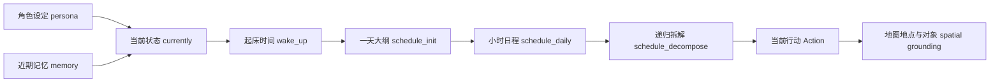
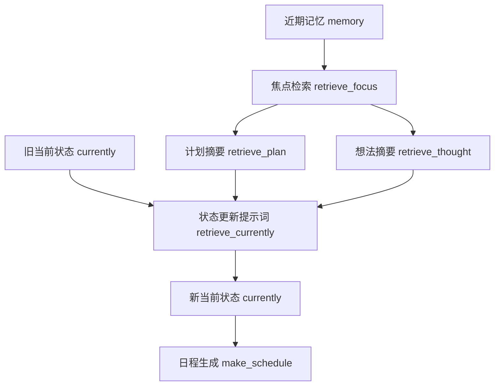
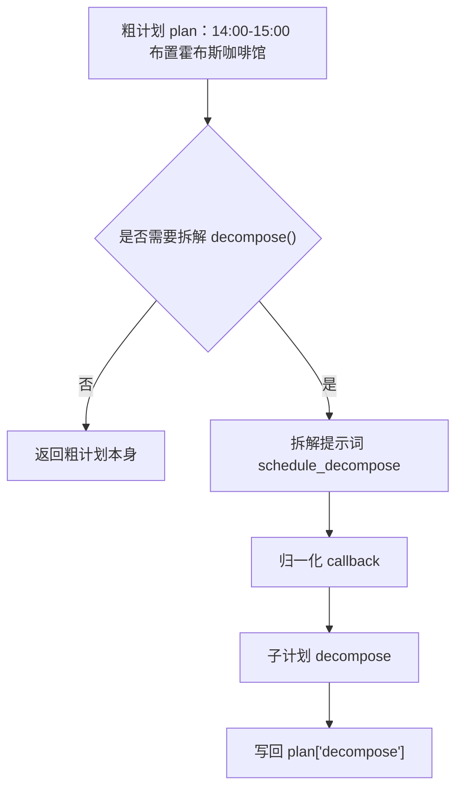
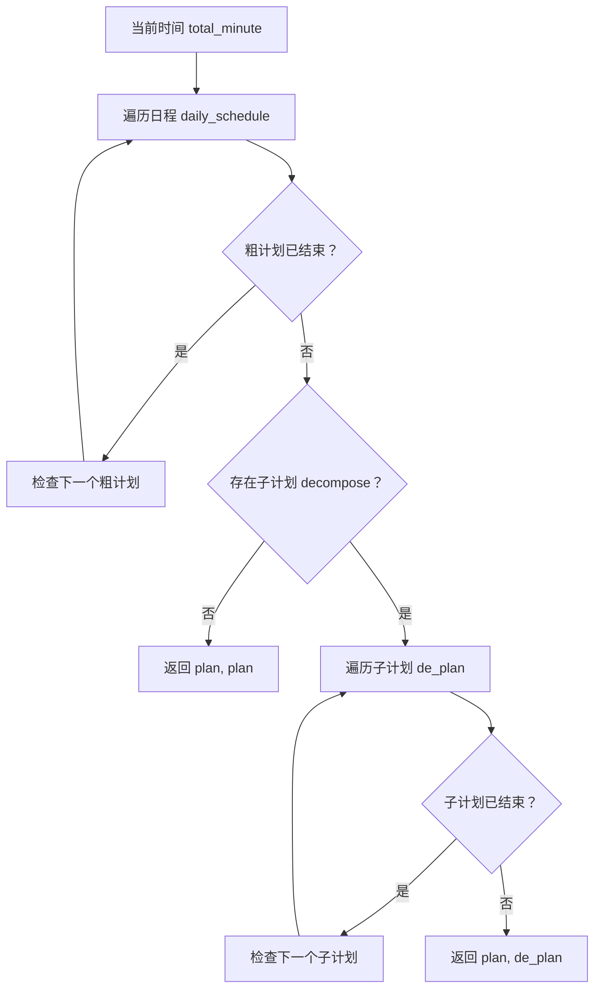
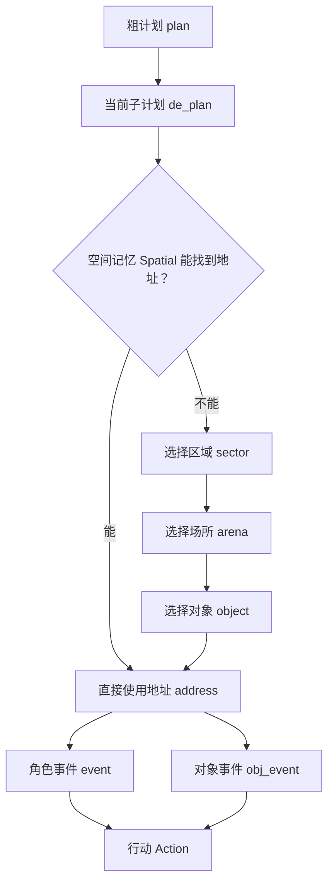
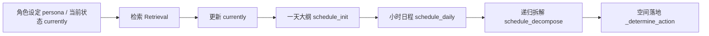

# 第 8 章 论文架构五：规划 Planning

规划 Planning 负责把角色的内部状态变成可执行生活。记忆流 Memory Stream 保存经历，检索 Retrieval 找回相关经历，反思 Reflection 生成高层想法；规划 Planning 接过这些材料，决定角色今天何时起床、做什么、每件事做多久、去哪里做，以及当前行为什么时候结束。


## 8.1 规划 Planning 解决什么

虚拟小镇 Smallville 里的居民不是等待用户提问的聊天窗口。即使没有外部输入，他们也要起床、吃饭、上学、工作、去咖啡馆、遇见别人、回家睡觉。用户不逐条指定这些行为，系统必须自己生成合理日程。

| 规划 Planning 要解决的问题 | 没有它会怎样 | 有了它以后 |
| --- | --- | --- |
| 今天做什么 | 角色每一步都临时决定，行为漂浮 | 角色有一天的生活骨架 |
| 每件事做多久 | 行动频繁跳变，缺少稳定性 | 行动有开始、持续和结束 |
| 去哪里做 | 文本计划无法落到地图 | 行为能绑定到具体地点和对象 |
| 计划如何细化 | “准备派对三小时”太粗 | 系统能拆成检查材料、布置咖啡馆、准备饮品、提醒朋友等动作 |
| 过去如何影响今天 | 每天像重启 | 新一天会接上昨天的记忆和目标 |

规划 Planning 不是给角色写一张漂亮时间表。它把角色设定 persona、当前状态 currently、记忆 memory、空间 spatial、日程 Schedule 和行动 Action 接起来，让角色能够持续生活。


```mermaid
flowchart LR
    Persona["角色设定 persona"] --> Current["当前状态 currently"]
    Memory["近期记忆 memory"] --> Current
    Current --> Wake["起床时间 wake_up"]
    Wake --> Init["一天大纲 schedule_init"]
    Init --> Daily["小时日程 schedule_daily"]
    Daily --> Decompose["递归拆解 schedule_decompose"]
    Decompose --> Action["当前行动 Action"]
    Action --> Space["地图地点与对象 spatial grounding"]
```

*图 8-2：规划 Planning 的基本链路。角色不是直接生成一个动作，而是从长期设定和近期经历出发，逐层生成可执行的生活安排。*

## 8.2 业务闭环：伊莎贝拉 Isabella Rodriguez 如何把派对目标变成行动

先看一个端到端业务样例。伊莎贝拉 Isabella Rodriguez 是霍布斯咖啡馆老板，她正在为 2 月 14 日下午 5 点的情人节派对做准备。规划 Planning 链路不会只输出一句“伊莎贝拉在准备派对”，而是把这个目标变成时间、地点、对象和可被其他角色感知的事件 event。

| 阶段 | 输入 | 处理 | 输出 |
| --- | --- | --- | --- |
| 状态接续 | 角色设定 persona、当前状态 currently、近期记忆 memory | 检索 Retrieval 找出派对计划和近期重要事件 | 更新后的当前状态 currently：继续布置咖啡馆并提醒朋友 |
| 作息决定 | 基础描述 base_desc、生活习惯 lifestyle | 起床提示词 `wake_up.txt` | 起床小时 `wake_up = 6` |
| 一天大纲 | 角色状态、生活习惯、起床时间 | 初始日程提示词 `schedule_init.txt` | 开店、检查派对材料、布置咖啡馆、迎接客人 |
| 小时日程 | 一天大纲、24 小时时间模板 | 小时日程提示词 `schedule_daily.txt` | 日程 Schedule 中的 `daily_schedule` |
| 任务拆解 | 当前粗计划 plan | 拆解提示词 `schedule_decompose.txt` | “检查桌椅摆放 15 分钟”“准备饮品和点心 20 分钟”等子计划 |
| 空间落地 | 粗计划 plan、子计划 de_plan、空间记忆 Spatial | 地址选择提示词 `determine_sector / determine_arena / determine_object` | 地图地址 address，例如霍布斯咖啡馆、咖啡馆、咖啡馆柜台后面 |
| 当前行动 | 子计划、地址、对象状态 | 行动对象 Action 封装 | 角色事件 event、对象事件 obj_event、开始时间 start、持续时间 duration |

这条链路的最终结果可以写成一个业务事实：

```text
伊莎贝拉 Isabella Rodriguez 此时在霍布斯咖啡馆的咖啡馆柜台后面，准备派对饮品和点心。
这个行为从 14:15 开始，持续 20 分钟。
其他角色经过附近格子 tile 时，可以感知到这条事件 event。
```

规划 Planning 的工程价值在这里闭合：输入不是一条用户问题，输出也不是一段回答，而是一个能进入小镇世界状态的行动 Action。

## 8.3 从“会聊天”到“会生活”

普通大语言模型 LLM 应用通常围绕一次输入生成一次输出。用户问一句，模型答一句。这个结构适合问答、摘要、改写和客服，但不适合虚拟小镇 Smallville。小镇居民即使没有用户输入，也要继续行动；路上遇到熟人，可能停下来聊天；听到派对消息，后续计划可能发生变化。

| 对比项 | 聊天机器人 chatbot | 生成式智能体 generative agent |
| --- | --- | --- |
| 触发方式 | 用户输入触发 | 时间、位置、记忆、事件共同触发 |
| 行为单位 | 一段回复 | 一段持续行动 |
| 时间意识 | 通常很弱 | 必须知道现在几点、今天要做什么 |
| 空间意识 | 通常没有 | 必须知道自己在哪里、要去哪里 |
| 状态延续 | 依赖聊天历史 | 依赖角色设定 persona、记忆 memory、日程 Schedule、行动 Action |
| 核心问题 | 怎么回答 | 怎么生活 |

规划 Planning 让智能体 agent 从“会说话”进入“会生活”。后面的反应 Reacting 和对话 Dialogue 都建立在这个基础上：角色先有自己的生活安排，现场事件和对话才有东西可以打断、修改和继承。

## 8.4 新一天状态 currently 如何接上记忆

生成新一天日程前，系统先更新当前状态 currently。初始角色设定 persona 只描述角色一开始是谁；仿真运行一天以后，角色已经经历了新的对话、计划、事件和想法。新一天的计划只看原始角色卡，角色就像每天早上被格式化。

项目中的入口代码在 `Agent.make_schedule()`：

```python
if self.associate.index.nodes_num > 0:
    self.associate.cleanup_index()
    focus = [
        f"{self.name} 在 {utils.get_timer().daily_format_cn()} 的计划。",
        f"在 {self.name} 的生活中，重要的近期事件。",
    ]
    retrieved = self.associate.retrieve_focus(focus)
    if retrieved:
        plan = self.completion("retrieve_plan", retrieved)
        thought = self.completion("retrieve_thought", retrieved)
        self.scratch.currently = self.completion(
            "retrieve_currently", plan, thought
        )
```

这段代码包含一个清楚的输入-处理-输出闭环。

| 环节 | 内容 | 行为影响 |
| --- | --- | --- |
| 输入 | 关联记忆 Associate 中已有的记忆节点 concept | 只在角色已经积累过经历时触发 |
| 处理 | 用两个焦点 focus 检索今天计划和近期重要事件 | 把昨天和最近发生的事召回 |
| 中间结果 | 计划摘要 `retrieve_plan`、想法摘要 `retrieve_thought` | 将原始记忆压缩成可进入提示词 prompt 的材料 |
| 输出 | 更新后的当前状态 currently | 成为起床时间和日程生成的上下文 |

例如，伊莎贝拉 Isabella Rodriguez 前一天已经开始准备情人节派对，第二天的当前状态 currently 就不能还停留在“她想办派对”。更合理的状态是：她已经邀请了一些人，还需要继续准备咖啡馆和提醒朋友。

`retrieve_currently.txt` 是这个状态接续的关键提示词 prompt：

```text
${agent} 在 ${time} 的状态：
${currently}

${agent} 在 ${time} 结束时记得这些事情：
${plan}

${agent} 在 ${time} 结束时的想法和感受：
${thought}

现在是 ${current_time}。根据上述情况，以第三人称，用一句话描述 ${agent} 在 ${current_time} 的状态，以反映 ${agent} 在 ${time} 结束时的想法和感受。
```

英文含义：

```text
Describe the agent's current state for the new day in third person.
Use yesterday's state, remembered plans, and thoughts as evidence.
The output should be one sentence that carries yesterday's unfinished concerns into today's context.
```

| 变量 | 中文含义 | 来源 |
| --- | --- | --- |
| `${agent}` | 角色姓名 | `Scratch.name` |
| `${time}` | 前一天日期 | 当前时间减一天 |
| `${currently}` | 原当前状态 currently | `self.currently` |
| `${plan}` | 计划相关记忆摘要 | `retrieve_plan` 输出 |
| `${thought}` | 想法和感受摘要 | `retrieve_thought` 输出 |
| `${current_time}` | 新一天日期 | 当前仿真时间 |

填入伊莎贝拉 Isabella Rodriguez 的派对案例后，这个提示词 prompt 的输入可以这样读：

| 变量 | 代表性内容 |
| --- | --- |
| `${currently}` | 伊莎贝拉计划在 2 月 14 日下午 5 点在霍布斯咖啡馆举办情人节派对 |
| `${plan}` | 她需要收集聚会材料，布置霍布斯咖啡馆，并邀请顾客和朋友参加 |
| `${thought}` | 她希望咖啡馆成为大家放松和享受的地方，也担心派对准备不够充分 |

代表性输出是一个新的当前状态 currently：

```text
伊莎贝拉 Isabella Rodriguez 正在为 2 月 14 日下午 5 点的情人节派对做最后准备，她需要继续收集聚会材料、布置霍布斯咖啡馆，并提醒朋友和顾客准时参加。
```

这句话会写回 `self.scratch.currently`。后续起床时间、一天大纲、小时日程都把它当成今天的角色状态，而不是只看静态角色卡。


```mermaid
flowchart TD
    Old["旧当前状态 currently"] --> Prompt["状态更新提示词 retrieve_currently"]
    Memory["近期记忆 memory"] --> Focus["焦点检索 retrieve_focus"]
    Focus --> Plan["计划摘要 retrieve_plan"]
    Focus --> Thought["想法摘要 retrieve_thought"]
    Plan --> Prompt
    Thought --> Prompt
    Prompt --> New["新当前状态 currently"]
    New --> Schedule["日程生成 make_schedule"]
```

*图 8-3：新一天日程生成前的状态接续。规划 Planning 不是从空白开始，而是把过去经历接到今天。*

## 8.5 起床时间 wake_up：作息从提示词进入日程

当前状态 currently 更新后，规划 Planning 的第一步是确定角色什么时候醒来。

```python
self.schedule.create = utils.get_timer().get_date()
wake_up = self.completion("wake_up")
```

起床时间提示词 `wake_up.txt` 的真实模板如下：

```text
${base_desc}

通常，${lifestyle}

根据上述提示，输出 ${agent} 的起床时间。只输出小时（24小时制），不要包含其他内容。
```

英文版本：

```text
${base_desc}

Usually, ${lifestyle}

Based on the prompt above, output ${agent}'s wake-up time.
Output only the hour in 24-hour format, and do not include anything else.
```

提示词包装函数 `prompt_wake_up()` 给这段模板加上输出结构 schema、回调 callback 和兜底值 failsafe：

```python
class wakeupResponse(BaseModel):
    res: int = Field(description="起床时间，24小时制的小时数，整数，范围0到11")

def _callback(response):
    value = response
    if value > 11:
        value = 11
    return value

return Result(prompt, _callback, 8, wakeupResponse)
```

| 项目 | 解释 |
| --- | --- |
| 输入 | 基础描述 base_desc、生活习惯 lifestyle、角色姓名 agent |
| 输出结构 schema | `res: int`，起床小时，范围 0 到 11 |
| 回调 callback | 如果模型返回大于 11 的数字，压到 11 |
| 兜底值 failsafe | `8`，即上午 8 点 |
| 下游使用 | 起床前小时默认填为“睡觉”，起床后交给小时日程 `schedule_daily` 填写 |

伊莎贝拉 Isabella Rodriguez 的生活习惯 lifestyle 写着她晚上 11 点左右上床睡觉，早上 6 点左右醒来。填入提示词 prompt 后，代表性输出是：

```text
6
```

这里的 `res: int` 不是抽象整数，而是“起床小时”。如果返回 `6`，意思是角色在 06:00 起床。不同角色的起床时间会影响后续所有计划：早起的店主上午有更多开店和备货空间，晚睡的学生上午更可能继续睡觉。可信行为不是靠一句宏大设定堆出来的，而是靠这些小约束累计出来的。

## 8.6 一天大纲 schedule_init：先定生活主线

确定起床时间后，系统生成初始日程。

```python
init_schedule = self.completion("schedule_init", wake_up)
```

初始日程提示词 `schedule_init.txt` 的真实模板如下：

```text
请根据以下信息生成一个初始日程列表：

"""
${base_desc}
生活方式：${lifestyle}
智能体：${agent}
起床时间：${wake_up}点
"""

确保返回的数据格式遵守schema：
示例：
[
  "早上6点起床并完成早餐的例行工作",
  "早上7点吃早餐",
  "早上8点看书",
  "中午12点吃午饭",
  "下午1点小睡一会儿",
  "晚上7点放松一下，看电视",
  "晚上11点睡觉"
]

要求：
- 每个活动简洁明了
- 按时间顺序排列
- 确保返回的数据格式遵守schema
```

英文版本：

```text
Generate an initial schedule list based on the following information:

"""
${base_desc}
Lifestyle: ${lifestyle}
Agent: ${agent}
Wake-up time: ${wake_up}:00
"""

Make sure the returned data follows the schema:
Example:
[
  "wake up at 6 AM and complete the breakfast routine",
  "eat breakfast at 7 AM",
  "read at 8 AM",
  "eat lunch at noon",
  "take a short nap at 1 PM",
  "relax and watch TV at 7 PM",
  "go to sleep at 11 PM"
]

Requirements:
- Each activity should be concise and clear.
- Activities should be in chronological order.
- Make sure the returned data follows the schema.
```

包装函数 `prompt_schedule_init()` 对输出的要求更具体：

```python
class schedule_initResponse(BaseModel):
    res: list[str] = Field(description="按时间顺序排列的日程活动列表，每项为简短的活动描述")

def _callback(response):
    assert len(response) >= 3, "schedule_init: too few items"
    return response
```

| 项目 | 解释 |
| --- | --- |
| 输入 | 基础描述 base_desc、生活习惯 lifestyle、角色 agent、起床时间 wake_up |
| 输出结构 schema | `res: list[str]`，按时间顺序排列的活动列表 |
| 回调 callback | 至少返回 3 项活动 |
| 兜底值 failsafe | 起床、早餐、读书、午饭、小睡、放松、睡觉 |
| 下游使用 | 作为小时日程 `schedule_daily` 的叙事大纲 |

伊莎贝拉 Isabella Rodriguez 案例中，输入已经包含“霍布斯咖啡馆老板”“早上 6 点醒来”“下午 5 点派对”这些信息。代表性输出如下：

```json
[
  "早上6点起床并完成早餐和开店前准备",
  "早上8点打开霍布斯咖啡馆并站在柜台后面接待顾客",
  "上午检查情人节派对所需物品",
  "下午布置霍布斯咖啡馆并准备饮品和点心",
  "下午5点迎接参加情人节派对的顾客和朋友",
  "晚上8点关闭咖啡馆并整理派对后的物品",
  "晚上11点上床睡觉"
]
```

一天大纲不是严格的 24 小时时间表。它承担的是“给今天定主题”：角色今天主要是在工作、学习、休息，还是准备活动。如果一上来就让模型输出 24 小时细表，活动容易碎，主线也容易丢。先生成一天大纲，再细化成小时日程，更像人在脑中先定今天的生活方向。

## 8.7 小时日程 schedule_daily：把一天变成时间骨架

一天大纲之后，系统用小时日程提示词 `schedule_daily.txt` 生成 24 小时日程。代码先构造时间模板：

```python
hours = [f"{i}:00" for i in range(24)]
seed = [(h, "睡觉") for h in hours[:wake_up]]
seed += [(h, "") for h in hours[wake_up:]]
```

起床前默认是睡觉，起床后由模型填活动。提示词模板如下：

```text
请根据以下信息生成详细的24小时日程表：

"""
${base_desc}
智能体：${agent}
初始日程：${daily_schedule}
时间模板：
${hourly_schedule}
"""

确保返回的数据格式遵守schema：
示例：
{
  "6:00": "起床并完成早晨的例行工作",
  "7:00": "吃早餐",
  "8:00": "读书",
  "9:00": "读书",
  "10:00": "读书",
  "11:00": "读书",
  "12:00": "吃午饭",
  "13:00": "小睡一会儿",
  "14:00": "小睡一会儿",
  "15:00": "小睡一会儿",
  "16:00": "继续工作",
  "17:00": "继续工作",
  "18:00": "回家",
  "19:00": "放松，看电视",
  "20:00": "放松，看电视",
  "21:00": "睡前看书",
  "22:00": "准备睡觉",
  "23:00": "睡觉"
}

要求：
- 为每个小时填写具体活动
- 活动描述要具体且符合人物设定
- 至少包含5个不同的活动类型
- 确保返回的数据格式遵守schema
```

英文版本：

```text
Generate a detailed 24-hour schedule based on the following information:

"""
${base_desc}
Agent: ${agent}
Initial schedule: ${daily_schedule}
Time template:
${hourly_schedule}
"""

Make sure the returned data follows the schema:
Example:
{
  "6:00": "wake up and complete the morning routine",
  "7:00": "eat breakfast",
  "8:00": "read",
  "9:00": "read",
  "10:00": "read",
  "11:00": "read",
  "12:00": "eat lunch",
  "13:00": "take a short nap",
  "14:00": "take a short nap",
  "15:00": "take a short nap",
  "16:00": "continue working",
  "17:00": "continue working",
  "18:00": "go home",
  "19:00": "relax and watch TV",
  "20:00": "relax and watch TV",
  "21:00": "read before bed",
  "22:00": "get ready for sleep",
  "23:00": "sleep"
}

Requirements:
- Fill in a specific activity for each hour.
- Activity descriptions should be specific and fit the character setting.
- Include at least 5 different activity types.
- Make sure the returned data follows the schema.
```

包装函数 `prompt_schedule_daily()` 把输出限定为字典 dict：

```python
class schedule_dailyResponse(BaseModel):
    res: dict[str, str] = Field(description="24小时日程表，键为时间字符串如'8:00'，值为该时段的活动描述")

def _callback(response):
    assert len(response) >= 5, "less than 5 schedules"
    return response
```

| 项目 | 解释 |
| --- | --- |
| 输入 | 基础描述 base_desc、角色 agent、初始日程 daily_schedule、时间模板 hourly_schedule |
| 输出结构 schema | `res: dict[str, str]`，键是时间，值是活动 |
| 回调 callback | 至少返回 5 个时间点 |
| 兜底值 failsafe | 06:00 到 23:00 的默认生活模板 |
| 下游使用 | 进入 `Schedule.add_plan()`，变成带开始时间和持续时间的计划项 |

伊莎贝拉 Isabella Rodriguez 的初始日程进入 `schedule_daily.txt` 后，再与起床前的睡觉 seed 合并，代表性小时日程 daily schedule 如下：

```json
{
  "0:00": "睡觉",
  "1:00": "睡觉",
  "2:00": "睡觉",
  "3:00": "睡觉",
  "4:00": "睡觉",
  "5:00": "睡觉",
  "6:00": "起床并完成早晨例行事务",
  "7:00": "检查咖啡馆开门前准备",
  "8:00": "打开霍布斯咖啡馆并站在柜台后面",
  "9:00": "接待早晨的顾客并准备咖啡",
  "10:00": "检查情人节派对材料清单",
  "11:00": "补充派对所需杯子和餐巾",
  "12:00": "在咖啡馆吃午饭并继续接待顾客",
  "13:00": "确认派对邀请和到场名单",
  "14:00": "布置霍布斯咖啡馆",
  "15:00": "准备派对饮品和点心",
  "16:00": "提醒朋友下午5点参加派对",
  "17:00": "迎接情人节派对客人",
  "18:00": "主持咖啡馆里的情人节派对",
  "19:00": "继续照看派对并和顾客交流",
  "20:00": "关闭咖啡馆并整理派对现场",
  "21:00": "清点剩余物品并记录派对反馈",
  "22:00": "回家放松并准备睡觉",
  "23:00": "睡觉"
}
```

系统还会检查活动是否过于单调：

```python
for _ in range(self.schedule.max_try):
    schedule = {h: s for h, s in seed[:wake_up]}
    schedule.update(
        self.completion("schedule_daily", wake_up, init_schedule)
    )
    if len(set(schedule.values())) >= self.schedule.diversity:
        break
```

`schedule.diversity` 是多样性阈值，默认来自日程 Schedule 对象。一天不能全是同一个动作；角色可以长时间学习或工作，但仍然应该有吃饭、移动、休息、社交等节奏变化。

## 8.8 日程 Schedule 的保存结构

模型返回的小时日程还不是最终数据结构。系统先把时间字符串转成一天中的分钟数，再计算每段活动持续多久：

```python
def _to_duration(date_str):
    return utils.daily_duration(utils.to_date(date_str, "%H:%M"))

schedule = {_to_duration(k): v for k, v in schedule.items()}
starts = list(sorted(schedule.keys()))
for idx, start in enumerate(starts):
    end = starts[idx + 1] if idx + 1 < len(starts) else 24 * 60
    self.schedule.add_plan(schedule[start], end - start)
```

日程 Schedule 的 `add_plan()` 会把每段计划保存为一个字典。

```python
self.daily_schedule.append(
    {
        "idx": len(self.daily_schedule),
        "describe": describe,
        "start": start,
        "duration": duration,
        "decompose": decompose or {},
    }
)
```

一个代表性日程项如下：

```json
{
  "idx": 14,
  "describe": "布置霍布斯咖啡馆",
  "start": 840,
  "duration": 60,
  "decompose": {}
}
```

| 字段 | 中文含义 | 来源 | 行为影响 |
| --- | --- | --- | --- |
| `idx` | 计划项编号 | `len(self.daily_schedule)` | 帮助系统定位当前粗计划 plan |
| `describe` | 活动描述 | `schedule_daily` 输出 | 说明这段时间要做什么 |
| `start` | 开始分钟数 | 时间字符串转换 | 决定什么时候进入该计划 |
| `duration` | 持续分钟数 | 下一个时间点减当前时间点 | 决定行动稳定多久 |
| `decompose` | 子计划列表 | 初始为空，后续由 `schedule_decompose` 写入 | 承载更细粒度动作 |

`start = 840` 表示当天第 840 分钟，也就是 14:00。`duration = 60` 表示“布置霍布斯咖啡馆”这段粗计划持续一小时。日程 Schedule 因此不是“文字列表”，而是可计算的时间结构。

## 8.9 计划也要写入记忆流 Memory Stream

生成日计划后，系统会把“今天计划”作为想法 thought 写入记忆流 Memory Stream。

```python
schedule_time = utils.get_timer().time_format_cn(self.schedule.create)
thought = "这是 {} 在 {} 的计划：{}".format(
    self.name, schedule_time, "；".join(init_schedule)
)
event = memory.Event(
    self.name,
    "计划",
    schedule_time,
    describe=thought,
    address=self.get_tile().get_address(),
)
self._add_concept(
    "thought",
    event,
    expire=self.schedule.create + datetime.timedelta(days=30),
)
```

这一步让计划不只是调度器 scheduler 的内部数据，也成为角色可回忆的内容。别人问伊莎贝拉 Isabella Rodriguez 今天忙什么，她可以说自己在准备派对；后续反思 Reflection 也可以把计划和实际经历放在一起，形成更高层判断。

写入记忆的概念节点 concept 可以这样理解：

| 字段 | 代表性值 | 说明 |
| --- | --- | --- |
| 类型 type | `thought` | 计划被写成想法，而不是外部事件 |
| 主语 subject | `伊莎贝拉` | 计划属于哪个角色 |
| 谓语 predicate | `计划` | 事件三元组中的动作关系 |
| 宾语 object | `20240213-06:00` | 计划对应的时间说明 |
| 描述 describe | `这是伊莎贝拉在2024年2月13日的计划：早上6点起床...下午布置霍布斯咖啡馆...下午5点迎接派对客人...` | 后续检索 Retrieval 和反思 Reflection 可读的文本 |
| 地址 address | 当前地图地址 | 保留计划生成时角色所在位置 |
| 过期 expire | 当前日期后 30 天 | 避免计划永久占据记忆 |

这条想法 thought 的业务含义很直接：日程系统生成的计划会重新进入记忆系统。第二天的 `retrieve_currently.txt` 如果检索到它，就能继续把“派对准备”带入新一天，而不是把派对当成一次性文本输出。

## 8.10 递归拆解 schedule_decompose：把粗计划变成子任务

小时级计划仍然太粗。“布置霍布斯咖啡馆”不是一个可执行动作。角色还需要知道这段时间里具体做什么。`Agent.make_schedule()` 在生成或确认当天日程后，会检查当前粗计划 plan 是否需要拆解：

```python
plan, _ = self.schedule.current_plan()
if self.schedule.decompose(plan):
    decompose_schedule = self.completion(
        "schedule_decompose", plan, self.schedule
    )
    decompose, start = [], plan["start"]
    for describe, duration in decompose_schedule:
        decompose.append(
            {
                "idx": len(decompose),
                "describe": describe,
                "start": start,
                "duration": duration,
            }
        )
        start += duration
    plan["decompose"] = decompose
```

拆解提示词 `schedule_decompose.txt` 的真实模板如下：

```text
示例：
"""
姓名：凯莉
年龄：35岁
日常计划：凯莉计划上午上课，下午在家工作
凯莉是一名幼儿园教师。她在家里制定课程计划。她目前独自住在一套单卧室公寓里。

凯莉的计划是：08:00 至 09:00，凯莉计划吃早餐；09:00 至 10:00，凯莉计划制定第二天的幼儿园课程。

以5分钟为增量，列出凯丽在 9:00 至 10:00 期间的所有子任务（总时长为60分钟）：
[
  ("审查幼儿园课程标准", 15),
  ("为这节课集思广益", 10),
  ("制定课程计划", 20),
  ("打印教案", 10),
  ("把教案放进包里", 5)
]
"""

确保返回的数据格式遵守schema：

参考示例，为以下计划列出子任务。
"""
${base_desc}
${agent} 现在的计划是：${plan}
"""

子任务总数不超过10个，确保返回的数据格式遵守schema：
[
  ("活动描述", 时长分钟数),
  ("活动描述", 时长分钟数),
  ...
]

以 ${increment} 分钟为增量，列出 ${agent} 在 ${start} 至 ${end} 期间的所有子任务（总时长为60分钟）：
```

英文版本：

```text
Following the example, list subtasks for the agent's current plan.
Use the agent profile, the surrounding daily plan, the time window, and the requested increment.
Return no more than 10 subtasks.
Each item should be a tuple of activity description and duration in minutes.
```

包装函数 `prompt_schedule_decompose()` 对返回值做了归一化：

```python
class schedule_decomposeResponse(BaseModel):
    res: List[Tuple[str, int]] = Field(description="子任务列表，每项为 [活动描述, 时长分钟数] 的元组")

def _callback(response):
    normalized = []
    for item in response:
        if isinstance(item, dict):
            describe = (
                item.get("describe")
                or item.get("activity")
                or item.get("task")
                or item.get("活动描述")
            )
            duration = item.get("duration") or item.get("minutes") or item.get("时长分钟数")
        elif isinstance(item, (list, tuple)) and len(item) >= 2:
            describe, duration = item[0], item[1]
        else:
            continue
        ...
```

| 项目 | 解释 |
| --- | --- |
| 输入 | 基础描述 base_desc、当前粗计划 plan、相邻日程片段、开始时间 start、结束时间 end、时间粒度 increment |
| 输出结构 schema | `res: List[Tuple[str, int]]`，每项是活动描述和分钟数 |
| 回调 callback | 支持元组、列表、字典三种返回形态，并把时长转成整数 |
| 兜底值 failsafe | 按 10 分钟重复当前粗计划描述 |
| 下游使用 | 写入当前粗计划的 `decompose` 字段，供 `current_plan()` 取出当前子计划 |

拆解后的结构如下：

```json
{
  "idx": 14,
  "describe": "布置霍布斯咖啡馆",
  "start": 840,
  "duration": 60,
  "decompose": [
    {
      "idx": 0,
      "describe": "检查桌椅摆放",
      "start": 840,
      "duration": 15
    },
    {
      "idx": 1,
      "describe": "准备饮品和点心",
      "start": 855,
      "duration": 20
    },
    {
      "idx": 2,
      "describe": "确认派对装饰",
      "start": 875,
      "duration": 15
    },
    {
      "idx": 3,
      "describe": "提醒朋友下午5点参加派对",
      "start": 890,
      "duration": 10
    }
  ]
}
```


```mermaid
flowchart TD
    Plan["粗计划 plan：14:00-15:00 布置霍布斯咖啡馆"] --> Need{"是否需要拆解 decompose()"}
    Need -->|否| ReturnSelf["返回粗计划本身"]
    Need -->|是| Prompt["拆解提示词 schedule_decompose"]
    Prompt --> Normalize["归一化 callback"]
    Normalize --> Sub["子计划 decompose"]
    Sub --> Write["写回 plan['decompose']"]
```

*图 8-4：递归拆解 decompose 的代码逻辑。粗计划负责方向，子计划负责可执行粒度。*

## 8.11 当前计划 current_plan() 如何被取出

`Schedule.current_plan()` 根据当前时间选择正在执行的计划。它先找到当前小时级粗计划 plan，再检查这个粗计划下面有没有尚未结束的子计划 de_plan。

```python
def current_plan(self):
    total_minute = utils.get_timer().daily_duration()
    for plan in self.daily_schedule:
        if self.plan_stamps(plan)[1] <= total_minute:
            continue
        for de_plan in plan.get("decompose", []):
            if self.plan_stamps(de_plan)[1] <= total_minute:
                continue
            return plan, de_plan
        return plan, plan
    last_plan = self.daily_schedule[-1]
    return last_plan, last_plan
```

这个函数有两个关键返回形态。

| 情况 | 返回值 | 含义 |
| --- | --- | --- |
| 当前粗计划没有子计划 | `plan, plan` | 大计划和小计划相同，直接用粗计划执行 |
| 当前粗计划已经拆解 | `plan, de_plan` | 粗计划提供方向，子计划提供当前动作 |

用前面的伊莎贝拉 Isabella Rodriguez 案例，14:10 时可能返回：

```json
{
  "plan": {
    "describe": "布置霍布斯咖啡馆",
    "start": 840,
    "duration": 60
  },
  "de_plan": {
    "describe": "检查桌椅摆放",
    "start": 840,
    "duration": 15
  }
}
```

14:30 时则可能返回：

```json
{
  "plan": {
    "describe": "布置霍布斯咖啡馆",
    "start": 840,
    "duration": 60
  },
  "de_plan": {
    "describe": "准备饮品和点心",
    "start": 855,
    "duration": 20
  }
}
```


```mermaid
flowchart TD
    Time["当前时间 total_minute"] --> Loop["遍历日程 daily_schedule"]
    Loop --> Ended{"粗计划已结束？"}
    Ended -->|是| Next["检查下一个粗计划"]
    Ended -->|否| HasSub{"存在子计划 decompose？"}
    HasSub -->|否| Pair1["返回 plan, plan"]
    HasSub -->|是| CheckSub["遍历子计划 de_plan"]
    CheckSub --> SubEnded{"子计划已结束？"}
    SubEnded -->|是| NextSub["检查下一个子计划"]
    SubEnded -->|否| Pair2["返回 plan, de_plan"]
    Next --> Loop
    NextSub --> CheckSub
```

*图 8-5：当前计划 current_plan() 的分支逻辑。它决定下一步行动使用粗计划，还是使用更细的子计划。*

`make_schedule()` 最后返回的正是这组计划：

```python
return self.schedule.current_plan()
```

后续行为生成会同时读取粗计划和子计划：

```python
plan, de_plan = self.schedule.current_plan()
describes = [plan["describe"], de_plan["describe"]]
```

粗计划给出方向，小计划给出动作。大计划是“布置霍布斯咖啡馆”，小计划是“准备饮品和点心”，系统就更容易把角色放到霍布斯咖啡馆、咖啡馆、咖啡馆柜台后面，而不是随机地点。

## 8.12 空间落地 spatial grounding：计划进入地图

规划 Planning 不能停在文本。一个角色不能只“计划吃午饭”，还要知道去哪里吃、坐在哪里、使用什么对象。项目中这一步由 `_determine_action()` 完成。

```python
def _determine_action(self):
    self.logger.info("{} is determining action...".format(self.name))
    plan, de_plan = self.schedule.current_plan()
    describes = [plan["describe"], de_plan["describe"]]
    address = self.spatial.find_address(describes[0], as_list=True)
    if not address:
        tile = self.get_tile()
        kwargs = {
            "describes": describes,
            "spatial": self.spatial,
            "address": tile.get_address("world", as_list=True),
        }
        kwargs["address"].append(
            self.completion("determine_sector", **kwargs, tile=tile)
        )
        arenas = self.spatial.get_leaves(kwargs["address"])
        if len(arenas) == 1:
            kwargs["address"].append(arenas[0])
        else:
            kwargs["address"].append(self.completion("determine_arena", **kwargs))
        objs = self.spatial.get_leaves(kwargs["address"])
        if len(objs) == 1:
            kwargs["address"].append(objs[0])
        elif len(objs) > 1:
            kwargs["address"].append(self.completion("determine_object", **kwargs))
        address = kwargs["address"]
```

空间落地 spatial grounding 先尝试用空间记忆 Spatial 查找地址。如果找不到，就按地图层级逐层选择。

| 提示词 prompt | 中文作用 | 输出结构 schema | 例子 |
| --- | --- | --- | --- |
| 区域选择 `determine_sector.txt` | 从候选区域 sector 里选一个 | `res: str`，必须来自候选列表 | 霍布斯咖啡馆 |
| 场所选择 `determine_arena.txt` | 从目标区域里的场所 arena 里选一个 | `res: str`，必须来自候选列表 | 咖啡馆 |
| 对象选择 `determine_object.txt` | 从场所对象 object 里选一个 | `res: str`，必须来自候选列表 | 咖啡馆柜台后面 |

区域选择提示词 `determine_sector.txt`：

```text
在区域选项中，为当前任务选择一个合适的区域。

${agent} 住在 <${live_sector}>，里面有 ${live_arenas}。
${agent} 目前的位置是 <${current_sector}>，里面有 ${current_arenas}。
${daily_plan}
问题：
${agent} 正在 ${complete_plan}。为了 ${decomposed_plan}，${agent} 应该去哪里？

要求：
1. 必须在这个列表中选择一个区域，列表：[${areas}]。
2. 如果现在正位于列表中的区域，并且计划的活动可以在这里进行，最好留在当前区域。
3. 不要选择列表以外的区域。
4. 直接输出选中的结果。

${agent} 应该去：
```

英文版本：

```text
Choose an appropriate sector from the candidate sector list.
Use the agent's home sector, current sector, available arenas, daily plan, complete plan, and decomposed plan.
If the current sector can support the activity, prefer staying there.
Return only one sector from the candidate list.
```

伊莎贝拉 Isabella Rodriguez 的当前计划是“布置霍布斯咖啡馆”，当前子计划是“准备饮品和点心”。候选区域 sector 里包含霍布斯咖啡馆时，代表性输出是：

```text
霍布斯咖啡馆
```

场所选择提示词 `determine_arena.txt`：

```text
在区域选项中，为当前任务选择一个合适的区域。

${agent} 正去往 <${target_sector}>，里面有 ${target_arenas}。
${daily_plan}
问题：
${agent} 正在 ${complete_plan}。为了 ${decomposed_plan}，${agent} 应该去 ${target_sector} 里面的哪个区域？

要求：
1. 必须在这个列表中选择一个区域，列表：[${target_arenas}]。
2. 如果现在正位于列表中的区域，并且计划的活动可以在这里进行，最好留在当前区域。
3. 不要选择列表以外的区域。
4. 直接输出选中的结果。

${agent} 应该去：
```

英文版本：

```text
Choose one arena inside the target sector.
Use the target sector, candidate arenas, daily plan, complete plan, and decomposed plan.
Return only one arena from the candidate list.
```

区域 sector 已经确定为霍布斯咖啡馆，候选场所 arena 可能包含咖啡馆、厨房、休息区等。代表性输出是：

```text
咖啡馆
```

对象选择提示词 `determine_object.txt`：

```text
从选项列表中，为当前活动选择最相关的对象。

当前活动：${activity}

要求：
1. 必须在这个列表中选择一个对象：[${objects}]。
2. 不要选择列表以外的对象。
3. 直接输出选中的结果。

与当前活动最相关的对象是：
```

英文版本：

```text
Choose the object most relevant to the current activity.
Return only one object from the candidate object list.
```

活动 activity 是“准备饮品和点心”，候选对象 object 里包含咖啡馆柜台后面、顾客座位、钢琴等。代表性输出是：

```text
咖啡馆柜台后面
```

生成地址后，系统创建两个事件 event：

```python
event = self.make_event(self.name, describes[-1], address)
obj_describe = self.completion("describe_object", address[-1], describes[-1])
obj_event = self.make_event(address[-1], obj_describe, address)
```

对象状态提示词 `describe_object.txt` 负责描述被使用对象的状态：

```text
任务：用不超过10个字的短句，描述某人身边物品的状态。注意：只输出物品的状态描述，不要包含物品名称。

示例：

一步一步地思考 烤箱 的状态：
步骤1：山姆正在 烤箱 旁边吃早餐。
步骤2：描述 烤箱 的状态。
输出：正在加热以烹饪早餐

一步一步地思考 电脑 的状态：
步骤1：迈克正在用 电脑 写电子邮件。
步骤2：描述 电脑 的状态。
输出：正在用于编写电子邮件

一步一步地思考 水槽 的状态：
步骤1：汤姆正在用 水槽 洗脸。
步骤2：描述 水槽 的状态。
输出：正在进水

根据上述示例，一步一步思考 ${object} 的状态：
步骤1：${agent} 正在 ${action}，身边是 ${object}
步骤2：描述 ${object} 的状态。
输出：
```

英文版本：

```text
Describe the state of the object near the agent in a short phrase.
Output only the object state, not the object name.
Use the agent's current action as evidence.
```

把对象 object 设为“咖啡馆柜台后面”、动作 action 设为“准备饮品和点心”后，代表性输出是：

```text
正在准备派对饮品
```

最终结果类似：

| 事件 event | 代表性内容 | 作用 |
| --- | --- | --- |
| 角色事件 event | 伊莎贝拉 Isabella Rodriguez 此时准备饮品和点心 | 说明角色正在做什么 |
| 对象事件 obj_event | 咖啡馆柜台后面此时正在准备派对饮品 | 说明地图对象处于什么状态 |
| 地址 address | `["小镇", "霍布斯咖啡馆", "咖啡馆", "咖啡馆柜台后面"]` | 让其他角色能在附近格子 tile 感知这件事 |


```mermaid
flowchart TD
    Plan["粗计划 plan"] --> Current["当前子计划 de_plan"]
    Current --> Spatial{"空间记忆 Spatial 能找到地址？"}
    Spatial -->|能| Address["直接使用地址 address"]
    Spatial -->|不能| Sector["选择区域 sector"]
    Sector --> Arena["选择场所 arena"]
    Arena --> Object["选择对象 object"]
    Object --> Address
    Address --> Event["角色事件 event"]
    Address --> ObjEvent["对象事件 obj_event"]
    Event --> Action["行动 Action"]
    ObjEvent --> Action
```

*图 8-6：空间落地 spatial grounding 的分支逻辑。文本计划只有绑定地图地址和对象事件以后，才会进入小镇世界状态。*

## 8.13 行动 Action 的时间边界

生成角色事件 event 和对象事件 obj_event 后，`_determine_action()` 返回行动 Action。

```python
return memory.Action(
    event,
    obj_event,
    duration=de_plan["duration"],
    start=utils.get_timer().daily_time(de_plan["start"]),
)
```

行动 Action 的结构在 `generative_agents/modules/memory/action.py`：

```python
class Action:
    def __init__(
        self,
        event,
        obj_event=None,
        start=None,
        duration=0,
    ):
        self.event = event
        self.obj_event = obj_event
        self.start = start or utils.get_timer().get_date()
        self.duration = duration
        self.end = self.start + datetime.timedelta(minutes=self.duration)
```

一个代表性行动 Action 可以这样读：

```json
{
  "event": {
    "subject": "伊莎贝拉",
    "predicate": "此时",
    "object": "准备饮品和点心",
    "address": ["小镇", "霍布斯咖啡馆", "咖啡馆", "咖啡馆柜台后面"]
  },
  "obj_event": {
    "subject": "咖啡馆柜台后面",
    "predicate": "此时",
    "object": "正在准备派对饮品",
    "address": ["小镇", "霍布斯咖啡馆", "咖啡馆", "咖啡馆柜台后面"]
  },
  "start": "20240213-14:15:00",
  "duration": 20
}
```

| 字段 | 中文含义 | 行为影响 |
| --- | --- | --- |
| `event` | 角色当前行为事件 | 其他角色感知时看到“谁在做什么” |
| `obj_event` | 被使用对象的状态事件 | 地图对象不再只是静态背景 |
| `start` | 行动开始时间 | 决定行动从什么时候生效 |
| `duration` | 行动持续分钟数 | 决定行为稳定多久 |
| `end` | 行动结束时间 | 由 `start + duration` 计算 |

`Action.finished()` 决定角色是否需要重新生成行动：

```python
def finished(self):
    if not self.duration:
        return True
    if not self.event.address:
        return True
    return utils.get_timer().get_date() > self.end
```

只要当前行动 Action 没结束，角色就继续执行。它不会每一步都重新问模型“我现在该做什么”。如果角色每 10 分钟都重新决定行为，小镇会像抖动的状态机。行动 Action 的持续时间让生活有稳定性。

## 8.14 提示词 prompt 链路总表

规划 Planning 不是一个单独提示词 prompt，而是一组连续提示词。完整模板已经随各小节展开，这里只保留链路总表。

| 阶段 | 提示词 prompt | 主要输入 | 输出结构 schema | 输出流向 |
| --- | --- | --- | --- | --- |
| 状态接续 | `retrieve_currently.txt` | 当前状态 currently、计划摘要、想法摘要 | `res: str` | 写回 `self.scratch.currently` |
| 起床时间 | `wake_up.txt` | 基础描述 base_desc、生活习惯 lifestyle | `res: int`，0 到 11 的小时数 | 进入小时模板 seed |
| 初始日程 | `schedule_init.txt` | 基础描述、生活习惯、起床时间 | `res: list[str]` | 进入小时日程提示词 |
| 小时日程 | `schedule_daily.txt` | 初始日程、时间模板 | `res: dict[str, str]` | 写入 `Schedule.daily_schedule` |
| 递归拆解 | `schedule_decompose.txt` | 当前粗计划、相邻日程、时间窗口 | `res: List[Tuple[str, int]]` | 写入 `plan["decompose"]` |
| 区域选择 | `determine_sector.txt` | 当前地址、候选区域、日计划、当前计划 | `res: str` | 地址 address 的 sector 层 |
| 场所选择 | `determine_arena.txt` | 目标区域、候选场所、当前计划 | `res: str` | 地址 address 的 arena 层 |
| 对象选择 | `determine_object.txt` | 当前活动、候选对象 | `res: str` | 地址 address 的 object 层 |
| 对象状态 | `describe_object.txt` | 对象 object、角色 agent、当前动作 action | `res: str` | 生成对象事件 obj_event |

这组提示词的共同特点是“生成 + 约束”：大语言模型 LLM 负责生成候选内容，输出结构 schema、回调 callback 和兜底值 failsafe 负责把结果收回到工程可用范围内。

## 8.15 规划 Planning 的常见失败

规划 Planning 失败通常不是一句提示词 prompt 写得不好，而是链路上某个环节丢了信息。

| 输出症状 | 输入缺口 | 出错环节 | 检查函数或文件 | 修正方向 |
| --- | --- | --- | --- | --- |
| 角色目标突然消失 | 当前状态 currently 没有保留关键目标 | 状态接续 | `retrieve_currently.txt`、`self.scratch.currently` | 检查检索 Retrieval 是否召回相关记忆 |
| 一天日程像通用模板 | 角色设定 persona 或生活习惯 lifestyle 太弱 | 初始日程 | `schedule_init.txt`、`agent.json` | 强化角色职业、近期任务和生活习惯 |
| 一天过于单调 | 活动类型不足 | 小时日程 | `schedule_daily.txt`、`schedule.diversity` | 提高多样性要求，检查模型输出 |
| 行动太粗 | 粗计划没有拆到可执行粒度 | 递归拆解 | `schedule_decompose.txt`、`plan["decompose"]` | 检查拆解提示词和回调归一化 |
| 地点不合理 | 空间记忆 Spatial 不知道计划对应地址 | 空间落地 | `_determine_action()`、`determine_sector / arena / object` | 检查地图对象和候选地址 |
| 行动频繁跳变 | 行动 Action 缺少持续时间或地址 | 行动封装 | `Action.duration`、`Action.finished()` | 检查子计划 de_plan 的时长和地址生成 |

例如，伊莎贝拉 Isabella Rodriguez 明明在当前状态 currently 中要准备情人节派对，但日程里完全没有派对相关行动，排查路径应沿着数据流向走：


```mermaid
flowchart LR
    Persona["角色设定 persona / 当前状态 currently"] --> Retrieve["检索 Retrieval"]
    Retrieve --> Current["更新 currently"]
    Current --> Init["一天大纲 schedule_init"]
    Init --> Daily["小时日程 schedule_daily"]
    Daily --> Decompose["递归拆解 schedule_decompose"]
    Decompose --> Action["空间落地 _determine_action"]
```

*图 8-7：规划 Planning 失败诊断路径。目标在哪一步丢失，就从哪一步回查输入和输出。*

## 8.16 本章小结

规划 Planning 把角色从“能回答”推向“能生活”。它从长期角色设定 persona 和近期记忆 memory 出发，更新当前状态 currently，生成起床时间、一天大纲、小时日程、细粒度子计划，再把计划落到地图地址和对象事件上。

判断一个智能体 agent 是否真的具备规划能力，可以看四件事：它有没有稳定的日程 Schedule，日程是否来自角色状态和记忆，粗计划能否拆成当前行动 Action，当前行动是否绑定到空间地址和持续时间。

下一章进入反应 Reacting。规划 Planning 让角色有自己的生活，但真实生活不会完全按计划发生。遇到人、遇到冲突、遇到新信息时，系统必须决定是否打断原计划。

## 参考资料

- Joon Sung Park, Joseph C. O'Brien, Carrie J. Cai, Meredith Ringel Morris, Percy Liang, Michael S. Bernstein. *Generative Agents: Interactive Simulacra of Human Behavior*. arXiv: https://arxiv.org/abs/2304.03442
- ar5iv full text: https://ar5iv.labs.arxiv.org/html/2304.03442
- Generative Agents local source: `generative_agents/modules/agent.py`
- Generative Agents local source: `generative_agents/modules/memory/schedule.py`
- Generative Agents local source: `generative_agents/modules/memory/action.py`
- Generative Agents local prompts: `generative_agents/data/prompts/retrieve_currently.txt`, `generative_agents/data/prompts/wake_up.txt`, `generative_agents/data/prompts/schedule_init.txt`, `generative_agents/data/prompts/schedule_daily.txt`, `generative_agents/data/prompts/schedule_decompose.txt`, `generative_agents/data/prompts/determine_sector.txt`, `generative_agents/data/prompts/determine_arena.txt`, `generative_agents/data/prompts/determine_object.txt`, `generative_agents/data/prompts/describe_object.txt`
