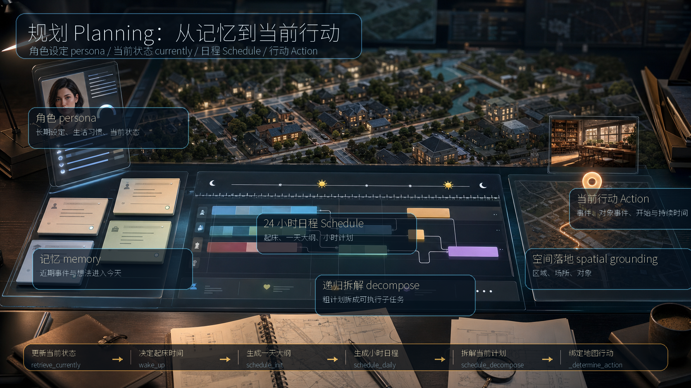
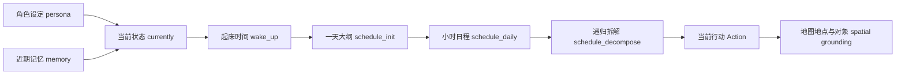
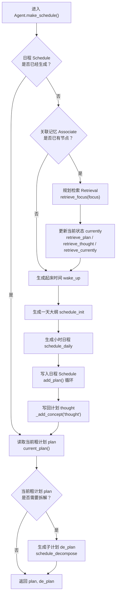
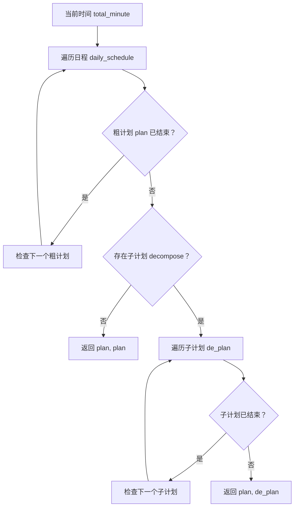
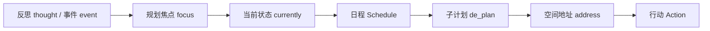

# 第 8 章 论文架构五：规划 Planning

规划 Planning 是生成式智能体从“记得过去”走向“安排生活”的环节。经历已经在第 5 章写入记忆流 Memory Stream，第 6 章能把相关记忆检索 Retrieval 出来，第 7 章又把关键经历沉淀为想法 thought。到了第 8 章，这些材料要真正变成可执行状态：克劳斯 Klaus Mueller 此刻该做什么、做多久、在哪里做，以及这段行为如何写成日程 Schedule、子计划 de_plan、空间地址 address 和行动 Action。



*图 8-1：规划 Planning 的工作台。规划链路从当前状态 currently 和记忆 memory 出发，生成日程 Schedule、递归拆解 decompose，并最终落到地图上的行动 Action。*

## 8.1 从克劳斯 Klaus Mueller 的当前行动开始

第 8 章沿用 `book-custom-discussion` 实验。`20240213-14:00` 这个断点很适合观察规划 Planning：克劳斯 Klaus Mueller 已经和阿伊莎 Ayesha Khan 多次讨论论文写作，第 7 章的反思 Reflection 也在这一刻生成了 `node_109` 和 `node_110`。

先看断点 checkpoint 文件 `generative_agents\results\checkpoints\book-custom-discussion\simulate-20240213-1400.json` 中保存的原文。

```json
{
  "agents": {
    "克劳斯": {
      "currently": "克劳斯正在撰写一篇关于低收入社区中产阶级化影响的研究论文。",
      "action": {
        "event": {
          "subject": "克劳斯",
          "predicate": "此时",
          "object": "修改完善流离失所部分的内容",
          "describe": "修改完善流离失所部分的内容",
          "address": ["the Ville", "奥克山学院", "图书馆", "图书馆桌子"]
        },
        "obj_event": {
          "subject": "图书馆桌子",
          "predicate": "此时",
          "object": "摊开着修改的文稿",
          "describe": "摊开着修改的文稿",
          "address": ["the Ville", "奥克山学院", "图书馆", "图书馆桌子"]
        },
        "start": "20240213-13:41:00",
        "duration": 19
      }
    }
  }
}
```

把这段 JSON 对齐到规划 Planning 里的概念，可以得到下面这张表。第一列写真实 JSON 位置，第二列写文件里保存的原文，第三列才是规划系统中的读法。

| JSON 位置 | 文件中保存的文字或数值 | 规划 Planning 读法 |
| --- | --- | --- |
| `currently` | 克劳斯正在撰写一篇关于低收入社区中产阶级化影响的研究论文。 | 当前状态 currently |
| `action.event.object` | 修改完善流离失所部分的内容 | 当前行动 Action 的角色事件 event |
| `action.event.address` | `["the Ville", "奥克山学院", "图书馆", "图书馆桌子"]` | 空间地址 address |
| `action.obj_event.object` | 摊开着修改的文稿 | 当前行动 Action 的对象事件 obj_event |
| `action.start / duration` | `20240213-13:41:00 / 19` | 当前行动时间边界：`13:41-14:00` |

这个断点先证明当前行动 Action 已经落盘：克劳斯 Klaus Mueller 的角色事件 event 记录“正在修改完善流离失所部分”，图书馆桌子的对象事件 obj_event 记录“摊开着修改的文稿”，二者共享同一个空间地址 address。至于 `14:00` 之后的粗计划 plan 和子计划 de_plan，8.4 会回到日程 Schedule 结构中展开。

第 7 章产生的两个反思节点也在这个断点 `generative_agents\results\checkpoints\book-custom-discussion\storage\克劳斯\associate\docstore.json` 中落盘：

```json
{
  "id_": "node_109",
  "text": "对于 克劳斯 的计划：克劳斯需要记住：明天下午5点参加伊莎贝拉的情人节派对，以及先去图书馆翻找置换效应数据在《城市更新》文献中的出处，找到后再找阿伊莎一起梳理置换效应段的论证逻辑，同时继续按'核心论点分节+田野笔记与文献分析呼应'的结构推进论文写作。",
  "metadata": {
    "node_type": "thought",
    "subject": "克劳斯",
    "predicate": "此时",
    "address": "the Ville:奥克山学院:图书馆:图书馆桌子",
    "poignancy": 4,
    "create": "20240213-14:00:00"
  }
}
```

```json
{
  "id_": "node_110",
  "text": "克劳斯 阿伊莎建议把感官描写包装成'参与式观察'的田野笔记，让我找到了在社会学论文中兼顾文学感染力和学术严谨性的巧妙平衡点。",
  "metadata": {
    "node_type": "thought",
    "subject": "克劳斯",
    "predicate": "此时",
    "address": "the Ville:奥克山学院:图书馆:图书馆桌子",
    "poignancy": 7,
    "create": "20240213-14:00:00"
  }
}
```

| 节点 | 类型 | 内容 |
| --- | --- | --- |
| `node_109` | 想法 thought | 对于克劳斯的计划：明天下午 5 点参加伊莎贝拉的情人节派对，并先去图书馆翻找置换效应数据出处，再和阿伊莎梳理论证逻辑。 |
| `node_110` | 想法 thought | 克劳斯把阿伊莎的建议理解为：感官描写可以包装成参与式观察的田野笔记，从而兼顾文学感染力和学术严谨性。 |

规划 Planning 的关键问题就落在这里：这些 thought 不只是第 7 章的结尾，它们会进入后续规划检索，影响克劳斯下一步如何安排论文写作、协作和行动。

## 8.2 规划 Planning 解决什么问题

虚拟小镇 Smallville 中的角色不是等待提问的聊天窗口。没有用户输入时，角色也要起床、写论文、吃饭、复习、去咖啡馆、遇见别人。规划 Planning 提供的是“持续生活”的调度能力。

| 规划 Planning 要解决的问题 | 没有它会怎样 | 有了它以后 |
| --- | --- | --- |
| 今天做什么 | 角色每一步都临时决定，行为漂浮 | 角色有一天的生活骨架 |
| 每件事做多久 | 行动频繁跳变，缺少稳定性 | 行动有开始、持续和结束 |
| 当前做哪件事 | 粗计划停在“写论文”这类大词 | 当前时刻能取出具体子计划 de_plan |
| 去哪里做 | 文本计划无法落到地图 | 行为能绑定到具体地点和对象 |
| 过去如何影响今天 | 每天像重启 | 反思 thought 和近期事件能重新进入规划输入 |

规划 Planning 不是给角色写一张漂亮时间表。它把角色设定 persona、当前状态 currently、记忆 memory、空间 spatial、日程 Schedule 和行动 Action 接起来，让角色能够持续生活。


```mermaid
flowchart LR
    Persona["角色设定 persona"] --> Current["当前状态 currently"]
    Memory["近期记忆 memory"] --> Current
    Current --> Wake["起床时间 wake_up"]
    Wake --> Init["一天大纲 schedule_init"]
    Init --> Daily["小时日程 schedule_daily"]
    Daily --> Decompose["递归拆解 schedule_decompose"]
    Decompose --> Action["当前行动 Action"]
    Action --> Space["地图地点与对象 spatial grounding"]
```

*图 8-2：规划 Planning 的基本链路。角色不是直接生成动作，而是从状态、记忆和日程逐层落到当前行动。*

## 8.3 Agent.make_schedule() 的输入、处理、输出

规划入口在 `generative_agents/modules/agent.py` 的 `Agent.make_schedule()`。这段函数同时做四件事：接续当前状态 currently、生成日程 Schedule、把日程写成 thought、拆解当前计划。

```python
def make_schedule(self):
    if not self.schedule.scheduled():
        # 1. 用记忆更新当前状态 currently。
        if self.associate.index.nodes_num > 0:
            self.associate.cleanup_index()
            focus = [
                f"{self.name} 在 {utils.get_timer().daily_format_cn()} 的计划。",
                f"在 {self.name} 的生活中，重要的近期事件。",
            ]
            retrieved = self.associate.retrieve_focus(focus)
            if retrieved:
                plan = self.completion("retrieve_plan", retrieved)
                thought = self.completion("retrieve_thought", retrieved)
                self.scratch.currently = self.completion(
                    "retrieve_currently", plan, thought
                )

        # 2. 生成起床时间、一天大纲和小时日程。
        self.schedule.create = utils.get_timer().get_date()
        wake_up = self.completion("wake_up")
        init_schedule = self.completion("schedule_init", wake_up)
        schedule = self.completion("schedule_daily", wake_up, init_schedule)

        # 3. 把小时日程转成 Schedule.daily_schedule。
        for start, describe in sorted(schedule.items()):
            self.schedule.add_plan(describe, duration=60)

        # 4. 日程本身也写回关联记忆 Associate，类型是 thought。
        self._add_concept("thought", event, expire=...)

    # 5. 只拆解当前粗计划。
    plan, _ = self.schedule.current_plan()
    if self.schedule.decompose(plan):
        plan["decompose"] = self.completion("schedule_decompose", plan, self.schedule)

    return self.schedule.current_plan()
```

这段函数有一个明显的分支：日程 Schedule 还没生成时，先完整生成一天计划；日程已经存在时，只检查当前粗计划 plan 是否需要拆解。


```mermaid
flowchart TD
    Start["进入 Agent.make_schedule()"] --> HasSchedule{"日程 Schedule<br/>是否已经生成？"}
    HasSchedule -->|否| HasMemory{"关联记忆 Associate<br/>是否已有节点？"}
    HasMemory -->|是| Retrieve["规划检索 Retrieval<br/>retrieve_focus(focus)"]
    Retrieve --> UpdateCurrently["更新当前状态 currently<br/>retrieve_plan / retrieve_thought / retrieve_currently"]
    HasMemory -->|否| Wake["生成起床时间 wake_up"]
    UpdateCurrently --> Wake
    Wake --> Init["生成一天大纲 schedule_init"]
    Init --> Daily["生成小时日程 schedule_daily"]
    Daily --> AddPlan["写入日程 Schedule<br/>add_plan() 循环"]
    AddPlan --> AddThought["写回计划 thought<br/>_add_concept('thought')"]
    HasSchedule -->|是| CurrentPlan["读取当前粗计划 plan<br/>current_plan()"]
    AddThought --> CurrentPlan
    CurrentPlan --> NeedDecompose{"当前粗计划 plan<br/>是否需要拆解？"}
    NeedDecompose -->|是| Decompose["生成子计划 de_plan<br/>schedule_decompose"]
    NeedDecompose -->|否| Return["返回 plan, de_plan"]
    Decompose --> Return
```

*图 8-3：`Agent.make_schedule()` 的真实执行分支。第一次进入时生成日程并写回 thought；后续进入时复用已有日程，只在当前计划需要细化时生成子计划 de_plan。*

上面的代码是注释型摘要，完整源码保留在 `generative_agents/modules/agent.py`。它的输入、处理和输出可以压缩成下面这张表：

| 环节 | 输入 input | 处理 process | 输出 output |
| --- | --- | --- | --- |
| 状态接续 | 当前状态 currently、关联记忆 Associate | 用规划焦点 focus 检索 event / thought，再生成 `retrieve_currently` | 更新后的 `self.scratch.currently` |
| 生成日程 | 基础描述 base_desc、生活习惯 lifestyle、当前状态 currently | `wake_up`、`schedule_init`、`schedule_daily` | `Schedule.daily_schedule` |
| 写回计划 | 一天大纲 init_schedule | 包装成 `Event(self.name, "计划", schedule_time)` | 计划 thought，例如 `node_0` |
| 当前拆解 | 当前粗计划 plan | `schedule_decompose` | 当前子计划列表 `plan["decompose"]` |
| 返回结果 | `Schedule.daily_schedule` | `current_plan()` | `plan, de_plan` |

第 6 章已经展开检索 Retrieval，第 7 章已经展开反思 Reflection。规划 Planning 关心的是它们留下的接口：`make_schedule()` 会用两个规划焦点 focus 从关联记忆 Associate 中找回事件 event 和想法 thought，反思生成的 `node_109`、`node_110` 也在这个候选范围内。

## 8.4 日程 Schedule 保存什么数据

日程 Schedule 的数据结构在 `generative_agents/modules/memory/schedule.py`。每个计划项 plan 由 `add_plan()` 写入：

```python
def add_plan(self, describe, duration, decompose=None):
    if self.daily_schedule:
        last_plan = self.daily_schedule[-1]
        start = last_plan["start"] + last_plan["duration"]
    else:
        start = 0
    self.daily_schedule.append(
        {
            "idx": len(self.daily_schedule),
            "describe": describe,
            "start": start,
            "duration": duration,
            "decompose": decompose or {},
        }
    )
```

`book-custom-discussion` 中克劳斯 Klaus Mueller 的 `14:00-15:00` 计划 `generative_agents\results\checkpoints\book-custom-discussion\simulate-20240213-1400.json` 已经落成下面的结构：

```json
{
  "idx": 14,
  "describe": "继续撰写研究论文，比较不同城市中产阶级化的案例",
  "start": 840,
  "duration": 60,
  "decompose": [
    {
      "idx": 0,
      "describe": "回顾之前关于不同城市中产阶级化的研究笔记",
      "start": 840,
      "duration": 0
    },
    {
      "idx": 1,
      "describe": "沃尔夫冈建议克劳斯用田野场景（如街角杂货店关门）作为引子，再嵌入置换效应的核心数据，以改进流离失所部分的写作，融入参与式观察写法。",
      "start": 840,
      "duration": 2
    },
    {
      "idx": 2,
      "describe": "确定要比较的城市案例（如旧金山、纽约、伦敦）",
      "start": 842,
      "duration": 5
    }
  ]
}
```

| 字段 field | 中文含义 | 工程作用 |
| --- | --- | --- |
| `idx` | 计划编号 | 保持日程顺序，方便相邻计划查询 |
| `describe` | 计划文本 | 进入提示词 prompt、行动 Action 和事件 event |
| `start` | 当天开始分钟数 | `840` 表示 14:00 |
| `duration` | 持续分钟数 | 决定计划何时结束 |
| `decompose` | 子计划列表 | 粗计划被拆成当前可执行动作 |

日程本身也会被写成 thought。克劳斯 Klaus Mueller 的 `node_0` 就是当天计划：

```text
这是 克劳斯 在 2024年02月13日（星期二）08:00 的计划：早上7点起床并完成早餐的例行工作；早上8点前往奥克山学院图书馆；上午8点30分开始撰写关于中产阶级化的研究论文；中午12点在图书馆附近吃午饭；下午1点继续写作研究论文；下午5点在霍布斯咖啡馆吃晚饭；下午6点返回图书馆继续研究论文的写作；晚上9点整理当天研究笔记并规划明天的写作计划；晚上11点准备睡觉
```

这条计划 thought 让日程不只是调度器内部状态，也成为角色后续可检索的记忆材料。

## 8.5 起床与一天大纲：wake_up / schedule_init

规划 Planning 的第一组提示词 prompt 负责确定“这一天从哪里开始”。`wake_up.txt` 先给出起床小时，`schedule_init.txt` 再生成一天大纲。

<table>
  <tr>
    <th style="width:50%">wake_up.txt</th>
    <th style="width:50%">schedule_init.txt</th>
  </tr>
  <tr>
    <td>
<pre><code>${base_desc}

通常，${lifestyle}

根据上述提示，输出 ${agent} 的起床时间。只输出小时（24小时制），不要包含其他内容。</code></pre>
    </td>
    <td>
<pre><code>请根据以下信息生成一个初始日程列表：

"""
${base_desc}
生活方式：${lifestyle}
智能体：${agent}
起床时间：${wake_up}点
"""

确保返回的数据格式遵守schema：
示例：
[
  "早上6点起床并完成早餐的例行工作",
  "早上7点吃早餐",
  "早上8点看书",
  "中午12点吃午饭",
  "下午1点小睡一会儿",
  "晚上7点放松一下，看电视",
  "晚上11点睡觉"
]

要求：
- 每个活动简洁明了
- 按时间顺序排列
- 确保返回的数据格式遵守schema</code></pre>
    </td>
  </tr>
</table>

英文含义：`wake_up` 只输出 24 小时制的起床小时；`schedule_init` 根据人物描述、生活习惯和起床时间，输出按时间顺序排列的一天大纲。

| 提示词 prompt | 输入变量 input | 输出结构 schema | 回调 callback | 兜底值 failsafe | 输出流向 |
| --- | --- | --- | --- | --- | --- |
| `wake_up` | 基础描述 base_desc、生活习惯 lifestyle、角色 agent | `res: int`，范围 0 到 11 | 大于 11 时压到 11 | `8` | 进入睡眠 seed 和 `schedule_init` |
| `schedule_init` | base_desc、lifestyle、agent、wake_up | `res: list[str]` | 至少 3 项 | 起床、早餐、读书、午饭、小睡、放松、睡觉 | 进入 `schedule_daily` |

克劳斯 Klaus Mueller 的生活习惯写着早上 7 点左右醒来。真实断点中的计划 thought 也显示他在 `07:00` 起床，`08:00` 前往奥克山学院图书馆，`08:30` 开始写中产阶级化论文。起床小时不是装饰字段，它会决定 `0:00-7:00` 被填成睡觉，也会影响后续所有小时计划。

## 8.6 小时日程 schedule_daily：24 小时骨架

一天大纲生成后，系统把它扩展成 24 小时日程。代码先构造一个时间模板：起床前默认睡觉，起床后留给模型填写。

```python
hours = [f"{i}:00" for i in range(24)]
seed = [(h, "睡觉") for h in hours[:wake_up]]
seed += [(h, "") for h in hours[wake_up:]]
```

`schedule_daily.txt` 的真实模板如下：

```text
请根据以下信息生成详细的24小时日程表：

"""
${base_desc}
智能体：${agent}
初始日程：${daily_schedule}
时间模板：
${hourly_schedule}
"""

确保返回的数据格式遵守schema：
示例：
{
  "6:00": "起床并完成早晨的例行工作",
  "7:00": "吃早餐",
  "8:00": "读书",
  "9:00": "读书",
  "10:00": "读书",
  "11:00": "读书",
  "12:00": "吃午饭",
  "13:00": "小睡一会儿",
  "14:00": "小睡一会儿",
  "15:00": "小睡一会儿",
  "16:00": "继续工作",
  "17:00": "继续工作",
  "18:00": "回家",
  "19:00": "放松，看电视",
  "20:00": "放松，看电视",
  "21:00": "睡前看书",
  "22:00": "准备睡觉",
  "23:00": "睡觉"
}

要求：
- 为每个小时填写具体活动
- 活动描述要具体且符合人物设定
- 至少包含5个不同的活动类型
- 确保返回的数据格式遵守schema
```

英文含义：根据人物描述、初始日程和 24 小时时间模板，为每个小时生成具体活动，并保证至少有 5 种不同活动类型。

| 项目 | 解释 |
| --- | --- |
| 输入变量 input variables | 基础描述 base_desc、角色 agent、初始日程 daily_schedule、时间模板 hourly_schedule |
| 输出结构 schema | `res: dict[str, str]`，键是时间字符串，值是活动描述 |
| 回调 callback | 至少返回 5 个时间点 |
| 兜底值 failsafe | 从 `6:00` 到 `23:00` 的默认生活模板 |
| 输出流向 | 转换成分钟数后写入 `Schedule.daily_schedule` |

系统还会做一次多样性 diversity 检查：

```python
for _ in range(self.schedule.max_try):
    schedule = {h: s for h, s in seed[:wake_up]}
    schedule.update(
        self.completion("schedule_daily", wake_up, init_schedule)
    )
    if len(set(schedule.values())) >= self.schedule.diversity:
        break
```

克劳斯 Klaus Mueller 的真实小时骨架可以从 `node_0` 读出：上午去图书馆写中产阶级化论文，中午在图书馆附近吃饭，下午继续写作，晚饭后返回图书馆，晚上整理研究笔记并规划明天。这个日程不是临时一句回答，而是 `Schedule.daily_schedule` 里 24 个小时级计划的来源。

## 8.7 递归拆解：schedule_decompose 与 current_plan()

小时日程仍然太粗。`14:00-15:00` 的“继续撰写研究论文，比较不同城市中产阶级化的案例”不能直接变成行动 Action，系统需要把它拆成更细的子计划 de_plan。

`Schedule.decompose()` 决定是否拆解：

```python
def decompose(self, plan):
    d_plan = plan.get("decompose", {})
    if len(d_plan) > 0:
        return False
    describe = plan["describe"]
    if "sleep" not in describe and "bed" not in describe:
        return True
    if "睡" not in describe and "床" not in describe:
        return True
    if "睡" in describe or "床" in describe:
        return False
    return True
```

`schedule_decompose.txt` 的真实模板如下：

```text
示例：
"""
姓名：凯莉
年龄：35岁
日常计划：凯莉计划上午上课，下午在家工作
凯莉是一名幼儿园教师。她在家里制定课程计划。她目前独自住在一套单卧室公寓里。

凯莉的计划是：08:00 至 09:00，凯莉计划吃早餐；09:00 至 10:00，凯莉计划制定第二天的幼儿园课程。

以5分钟为增量，列出凯丽在 9:00 至 10:00 期间的所有子任务（总时长为60分钟）：
[
  ("审查幼儿园课程标准", 15),
  ("为这节课集思广益", 10),
  ("制定课程计划", 20),
  ("打印教案", 10),
  ("把教案放进包里", 5)
]
"""

确保返回的数据格式遵守schema：

参考示例，为以下计划列出子任务。
"""
${base_desc}
${agent} 现在的计划是：${plan}
"""

子任务总数不超过10个，确保返回的数据格式遵守schema：
[
  ("活动描述", 时长分钟数),
  ("活动描述", 时长分钟数),
  ...
]

以 ${increment} 分钟为增量，列出 ${agent} 在 ${start} 至 ${end} 期间的所有子任务（总时长为60分钟）：
```

英文含义：根据当前粗计划、相邻日程片段和时间窗口，把一个小时级活动拆成不超过 10 个子任务，每个子任务带分钟数。

| 项目 | 解释 |
| --- | --- |
| 输入变量 input variables | 基础描述 base_desc、角色 agent、当前计划 plan、增量 increment、开始 start、结束 end |
| 输出结构 schema | `res: List[Tuple[str, int]]`，每项是活动描述和分钟数 |
| 回调 callback | 支持元组、列表、字典三种形态，并把时长转成整数 |
| 兜底值 failsafe | 按 10 分钟重复当前粗计划描述 |
| 输出流向 | 写入当前 plan 的 `decompose` 字段 |

`Schedule.current_plan()` 根据当前时间取出粗计划和子计划：

```python
def current_plan(self):
    total_minute = utils.get_timer().daily_duration()
    for plan in self.daily_schedule:
        if self.plan_stamps(plan)[1] <= total_minute:
            continue
        for de_plan in plan.get("decompose", []):
            if self.plan_stamps(de_plan)[1] <= total_minute:
                continue
            return plan, de_plan
        return plan, plan
    last_plan = self.daily_schedule[-1]
    return last_plan, last_plan
```


```mermaid
flowchart TD
    Time["当前时间 total_minute"] --> Loop["遍历日程 daily_schedule"]
    Loop --> Ended{"粗计划 plan 已结束？"}
    Ended -- "是" --> Next["检查下一个粗计划"]
    Ended -- "否" --> HasSub{"存在子计划 decompose？"}
    HasSub -- "否" --> PairA["返回 plan, plan"]
    HasSub -- "是" --> SubLoop["遍历子计划 de_plan"]
    SubLoop --> SubEnded{"子计划已结束？"}
    SubEnded -- "是" --> NextSub["检查下一个子计划"]
    SubEnded -- "否" --> PairB["返回 plan, de_plan"]
    Next --> Loop
    NextSub --> SubLoop
```

*图 8-4：`current_plan()` 的分支逻辑。它决定当前行动使用粗计划，还是使用更细的子计划。*

`20240213-14:00` 的真实返回值是：

| 返回值 | 内容 |
| --- | --- |
| 粗计划 plan | `14:00-15:00`，继续撰写研究论文，比较不同城市中产阶级化的案例 |
| 子计划 de_plan | `14:00-14:02`，沃尔夫冈建议克劳斯用田野场景作为引子，再嵌入置换效应的核心数据 |

粗计划给方向，子计划给当前动作。没有子计划时，角色只能“写论文”；有了子计划，系统能把行为缩到“回顾研究笔记”“确定城市案例”“撰写比较分析段落”这类可执行单位。

## 8.8 空间落地：plan / de_plan 如何变成 Action

`Agent.make_schedule()` 返回 plan / de_plan 后，行动生成函数 `_determine_action()` 把文本计划落到地图空间。

```python
def _determine_action(self):
    plan, de_plan = self.schedule.current_plan()
    describes = [plan["describe"], de_plan["describe"]]
    address = self.spatial.find_address(describes[0], as_list=True)
    if not address:
        tile = self.get_tile()
        kwargs = {
            "describes": describes,
            "spatial": self.spatial,
            "address": tile.get_address("world", as_list=True),
        }
        kwargs["address"].append(
            self.completion("determine_sector", **kwargs, tile=tile)
        )
        kwargs["address"].append(self.completion("determine_arena", **kwargs))
        kwargs["address"].append(self.completion("determine_object", **kwargs))
        address = kwargs["address"]

    event = self.make_event(self.name, describes[-1], address)
    obj_describe = self.completion("describe_object", address[-1], describes[-1])
    obj_event = self.make_event(address[-1], obj_describe, address)
    return memory.Action(event, obj_event, duration=de_plan["duration"], start=...)
```

空间落地 spatial grounding 先用空间记忆 Spatial 查地址；找不到时，再用区域 sector、场所 arena、对象 object 三层提示词 prompt 逐级选择，最后生成对象事件 obj_event。

| 选择区域 prompt `determine_sector.txt` | 选择场所 prompt `determine_arena.txt` | 选择对象 prompt `determine_object.txt` | 描述对象 prompt `describe_object.txt` |
| --- | --- | --- | --- |
| <pre><code>在区域选项中，为当前任务选择一个合适的区域。<br><br>&#36;{agent} 住在 &lt;&#36;{live_sector}&gt;，里面有 &#36;{live_arenas}。<br>&#36;{agent} 目前的位置是 &lt;&#36;{current_sector}&gt;，里面有 &#36;{current_arenas}。<br>&#36;{daily_plan}<br>问题：<br>&#36;{agent} 正在 &#36;{complete_plan}。为了 &#36;{decomposed_plan}，&#36;{agent} 应该去哪里？<br><br>要求：<br>1. 必须在这个列表中选择一个区域，列表：[&#36;{areas}]。<br>2. 如果现在正位于列表中的区域，并且计划的活动可以在这里进行，最好留在当前区域。<br>3. 不要选择列表以外的区域。<br>4. 直接输出选中的结果。<br><br>&#36;{agent} 应该去：</code></pre> | <pre><code>在区域选项中，为当前任务选择一个合适的区域。<br><br>&#36;{agent} 正去往 &lt;&#36;{target_sector}&gt;，里面有 &#36;{target_arenas}。<br>&#36;{daily_plan}<br>问题：<br>&#36;{agent} 正在 &#36;{complete_plan}。为了 &#36;{decomposed_plan}，&#36;{agent} 应该去 &#36;{target_sector} 里面的哪个区域？<br><br>要求：<br>1. 必须在这个列表中选择一个区域，列表：[&#36;{target_arenas}]。<br>2. 如果现在正位于列表中的区域，并且计划的活动可以在这里进行，最好留在当前区域。<br>3. 不要选择列表以外的区域。<br>4. 直接输出选中的结果。<br><br>&#36;{agent} 应该去：</code></pre> | <pre><code>从选项列表中，为当前活动选择最相关的对象。<br><br>当前活动：&#36;{activity}<br><br>要求：<br>1. 必须在这个列表中选择一个对象：[&#36;{objects}]。<br>2. 不要选择列表以外的对象。<br>3. 直接输出选中的结果。<br><br>与当前活动最相关的对象是：</code></pre> | <pre><code>任务：用不超过10个字的短句，描述某人身边物品的状态。注意：只输出物品的状态描述，不要包含物品名称。<br><br>示例：<br><br>一步一步地思考 烤箱 的状态：<br>步骤1：山姆正在 烤箱 旁边吃早餐。<br>步骤2：描述 烤箱 的状态。<br>输出：正在加热以烹饪早餐<br><br>一步一步地思考 电脑 的状态：<br>步骤1：迈克正在用 电脑 写电子邮件。<br>步骤2：描述 电脑 的状态。<br>输出：正在用于编写电子邮件<br><br>一步一步地思考 水槽 的状态：<br>步骤1：汤姆正在用 水槽 洗脸。<br>步骤2：描述 水槽 的状态。<br>输出：正在进水<br><br>根据上述示例，一步一步思考 &#36;{object} 的状态：<br>步骤1：&#36;{agent} 正在 &#36;{action}，身边是 &#36;{object}<br>步骤2：描述 &#36;{object} 的状态。<br>输出：</code></pre> |


真实断点中的行动 Action 如下：

```json
{
  "event": {
    "subject": "克劳斯",
    "predicate": "此时",
    "object": "修改完善流离失所部分的内容",
    "address": ["the Ville", "奥克山学院", "图书馆", "图书馆桌子"]
  },
  "obj_event": {
    "subject": "图书馆桌子",
    "predicate": "此时",
    "object": "摊开着修改的文稿",
    "address": ["the Ville", "奥克山学院", "图书馆", "图书馆桌子"]
  },
  "start": "20240213-13:41:00",
  "duration": 19
}
```

行动 Action 的结构在 `generative_agents/modules/memory/action.py`：

```python
class Action:
    def __init__(self, event, obj_event=None, start=None, duration=0):
        self.event = event
        self.obj_event = obj_event
        self.start = start or utils.get_timer().get_date()
        self.duration = duration
        self.end = self.start + datetime.timedelta(minutes=self.duration)

    def finished(self):
        if not self.duration:
            return True
        if not self.event.address:
            return True
        return utils.get_timer().get_date() > self.end
```

| 字段 field | 中文含义 | 行为影响 |
| --- | --- | --- |
| `event` | 角色当前行为事件 | 其他角色感知时看到“谁在做什么” |
| `obj_event` | 被使用对象的状态事件 | 地图对象不再只是静态背景 |
| `start` | 行动开始时间 | 决定行动从什么时候生效 |
| `duration` | 行动持续分钟数 | 决定行为稳定多久 |
| `end` | 行动结束时间 | 由 `start + duration` 计算 |

规划 Planning 的输出不是一句“克劳斯继续写论文”，而是一段有地址、有对象、有开始时间和持续时间的行动 Action。

## 8.9 可运行脚本：观察规划如何使用反思 thought

脚手架位置：

```text
docs\book\scaffolds\part_01\ch08_planning_demo.py
```

断点复查 checkpoint mode 读取已有实验结果，不调用大语言模型 LLM：

```powershell
python docs/book/scaffolds/part_01/ch08_planning_demo.py --mode checkpoint --time 20240213-14:00 --agent 克劳斯
```

关键输出 stdout 摘录：

```text
第 8 章规划 Planning 脚本应用：断点复查
========================================================================
实验 experiment: book-custom-discussion
时间 checkpoint_time: 20240213-14:00
角色 agent: 克劳斯 Klaus Mueller
当前状态 currently: 克劳斯正在撰写一篇关于低收入社区中产阶级化影响的研究论文。
日程数量 schedule_items: 24

当前粗计划 current_plan:
  idx=14 | 14:00-15:00 | 继续撰写研究论文，比较不同城市中产阶级化的案例
当前子计划 current_de_plan:
  idx=1 | 14:00-14:02 | 沃尔夫冈建议克劳斯用田野场景（如街角杂货店关门）作为引子，再嵌入置换效应的核心数据，以改进流离失所部分的写作，融入参与式观察写法。

当前行动 current_action:
  event: 克劳斯 此时 修改完善流离失所部分的内容 @ the Ville > 奥克山学院 > 图书馆 > 图书馆桌子
  obj_event: 图书馆桌子 此时 摊开着修改的文稿 @ the Ville > 奥克山学院 > 图书馆 > 图书馆桌子
  start: 20240213-13:41:00
  duration: 19 minutes
  end: 20240213-14:00:00

反思节点 reflection_thoughts:
  node_109 | thought | P4 | create=20240213-14:00:00
  node_110 | thought | P7 | create=20240213-14:00:00
```

反思输入 retrieve-input mode 使用 `Agent.make_schedule()` 中同样的规划焦点 focus 执行检索 Retrieval。它会调用 MiniMax 向量嵌入 embedding，所以需要环境变量 `MINIMAX_API_KEY`：

```powershell
python docs/book/scaffolds/part_01/ch08_planning_demo.py --mode retrieve-input --time 20240213-14:00 --agent 克劳斯 --retrieve-max 6
```

关键输出 stdout 摘录：

```text
第 8 章规划 Planning 脚本应用：反思 thought 进入规划检索
========================================================================
规划焦点 planning_focus:
  - 克劳斯 在 2024年02月13日（星期二） 的计划。
  - 在 克劳斯 的生活中，重要的近期事件。

焦点问题 focus: 克劳斯 在 2024年02月13日（星期二） 的计划。
  node_0 | thought | P2 | create=20240213-08:00 | 这是 克劳斯 在 2024年02月13日（星期二）08:00 的计划...
  node_109 | thought | P4 | create=20240213-14:00 | 对于 克劳斯 的计划：克劳斯需要记住...
  node_110 | thought | P7 | create=20240213-14:00 | 克劳斯 阿伊莎建议把感官描写包装成'参与式观察'...

焦点问题 focus: 在 克劳斯 的生活中，重要的近期事件。
  node_110 | thought | P7 | create=20240213-14:00 | 克劳斯 阿伊莎建议把感官描写包装成'参与式观察'...
  node_92 | event | P3 | create=20240213-14:00 | 克劳斯 修改完善流离失所部分的内容
  node_109 | thought | P4 | create=20240213-14:00 | 对于 克劳斯 的计划：克劳斯需要记住...

反思节点 node_109: 命中 retrieved
反思节点 node_110: 命中 retrieved
```

| 脚本模式 | 证明什么 | 关键观察 |
| --- | --- | --- |
| `checkpoint` | 规划结果已经落成 Schedule / Action | 能看到当前粗计划、当前子计划、行动事件、对象事件、地址和时间边界 |
| `retrieve-input` | 反思 thought 可以成为后续规划输入 | `node_109` 和 `node_110` 被两个规划焦点 focus 命中 |

这两个结果把第 7 章和第 8 章接起来：反思 Reflection 生成 thought，规划 Planning 再用检索 Retrieval 把 thought 召回，并把它们送入当前状态和日程生成链路。

## 8.10 失败诊断与本章小结

规划 Planning 的失败通常发生在输入、拆解或空间落地的某个环节。

| 输出症状 | 输入缺口 | 出错环节 | 检查函数或文件 | 修正方向 |
| --- | --- | --- | --- | --- |
| 角色目标突然消失 | 当前状态 currently 没有保留关键目标 | 状态接续 | `retrieve_currently.txt`、`self.scratch.currently` | 检查规划焦点 focus 是否召回关键 thought |
| 一天日程像通用模板 | 角色设定 persona 或生活习惯 lifestyle 太弱 | 一天大纲 | `schedule_init.txt`、`agent.json` | 强化职业、近期任务和生活习惯 |
| 一天过于单调 | 活动类型不足 | 小时日程 | `schedule_daily.txt`、`schedule.diversity` | 检查模型输出和多样性阈值 |
| 行动太粗 | 粗计划没有拆到可执行粒度 | 递归拆解 | `schedule_decompose.txt`、`plan["decompose"]` | 检查拆解提示词和回调归一化 |
| 地点不合理 | 空间记忆 Spatial 不知道计划对应地址 | 空间落地 | `_determine_action()`、`determine_sector / arena / object` | 检查地图对象和候选地址 |
| 行动频繁跳变 | 行动 Action 缺少持续时间或地址 | 行动封装 | `Action.duration`、`Action.finished()` | 检查子计划 de_plan 的时长和地址生成 |


```mermaid
flowchart LR
    Memory["反思 thought / 事件 event"] --> Focus["规划焦点 focus"]
    Focus --> Currently["当前状态 currently"]
    Currently --> Schedule["日程 Schedule"]
    Schedule --> DePlan["子计划 de_plan"]
    DePlan --> Address["空间地址 address"]
    Address --> Action["行动 Action"]
```

*图 8-5：规划 Planning 的失败诊断路径。目标在哪一步丢失，就从哪一步回查输入和输出。*

规划 Planning 把角色从“有记忆”推向“有生活”。它从当前状态 currently 和关联记忆 Associate 出发，生成起床时间、一天大纲、小时日程、细粒度子计划，再把计划落到地图地址和对象事件上。克劳斯 Klaus Mueller 的例子说明：反思 thought 不会停留在记忆系统里，它会被规划焦点 focus 再次召回，进入后续计划和行动。

下一章进入反应 Reacting。规划 Planning 让角色有自己的生活，但真实生活不会完全按计划发生。遇到人、遇到冲突、遇到新信息时，系统必须决定是否打断原计划。

## 参考资料

- Park et al. (2023). *Generative Agents: Interactive Simulacra of Human Behavior*.
- Local code: `generative_agents/modules/agent.py`
- Local code: `generative_agents/modules/memory/schedule.py`
- Local code: `generative_agents/modules/memory/action.py`
- Local prompts: `generative_agents/data/prompts/wake_up.txt`
- Local prompts: `generative_agents/data/prompts/schedule_init.txt`
- Local prompts: `generative_agents/data/prompts/schedule_daily.txt`
- Local prompts: `generative_agents/data/prompts/schedule_decompose.txt`
- Local prompts: `generative_agents/data/prompts/determine_sector.txt`
- Local prompts: `generative_agents/data/prompts/determine_arena.txt`
- Local prompts: `generative_agents/data/prompts/determine_object.txt`
- Local prompts: `generative_agents/data/prompts/describe_object.txt`
- 本章脚手架 scaffold：`docs/book/scaffolds/part_01/ch08_planning_demo.py`
- Local evidence: `generative_agents/results/checkpoints/book-custom-discussion/`
