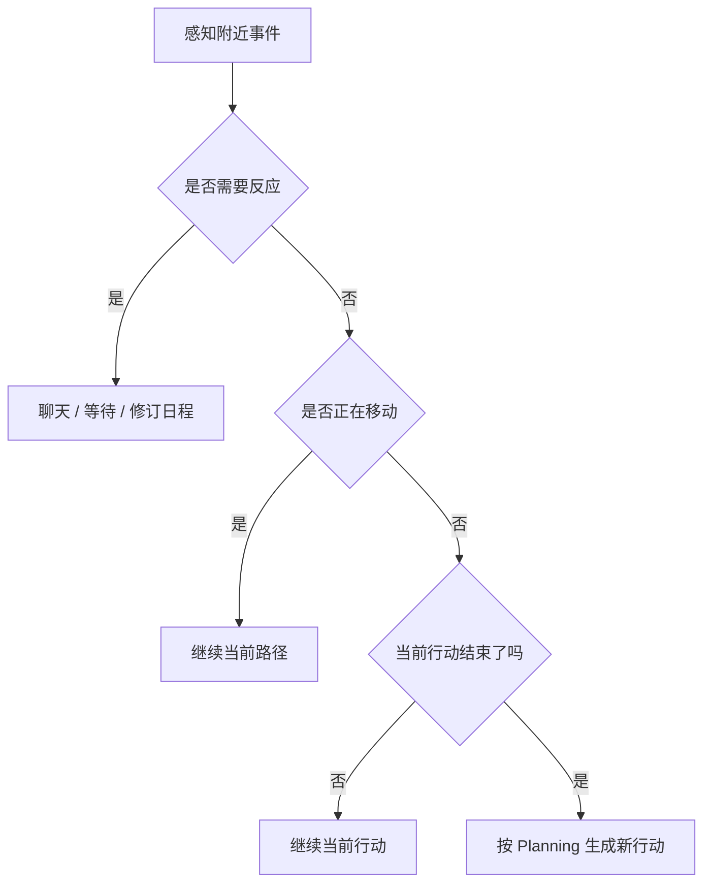
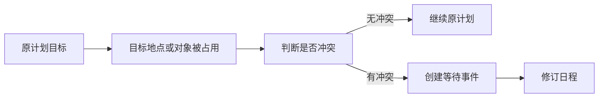

# 第 9 章 论文架构六：Reacting

## 9.1 Reacting 解决什么

Planning 让角色有自己的生活安排。Reacting 处理另一件事：计划遇到现场变化时，角色该不该改。真实生活不会严格按日程执行。一个人计划去图书馆，路上可能遇到朋友；准备使用浴室，可能发现别人正在里面；准备拉票，可能碰到一个对自己态度冷淡的居民。如果智能体只执行计划，它会像机械日程表。如果它对每个事件都反应，又会像被环境牵着走的聊天机器人。Reacting 要处理的就是这条边界：

| 场景 | 不反应的问题 | 过度反应的问题 | 合理反应 |
| --- | --- | --- | --- |
| 路上遇到熟人 | 像没看见人 | 每次遇见都长聊 | 根据关系、时间和任务判断是否聊天 |
| 目标对象被占用 | 两个人同时使用同一对象 | 任何占用都停下来 | 冲突明显时等待或改计划 |
| 听到新信息 | 信息无法传播 | 一听到就立刻改变人生目标 | 重要信息进入记忆，影响后续行动 |
| 计划被打断 | 继续执行原计划，时间重叠 | 原计划完全崩掉 | 把打断写回日程，并修订剩余计划 |

Reacting 的核心不是“更主动”，而是“在合适时机改变原计划”。

## 9.2 Reacting 在运行循环中的位置

Generative Agents 中，清醒的智能体会在 `think()` 中执行三个动作：

```python
self.percept()
self.make_plan(agents)
self.reflect()
```

顺序很重要。先感知，再决定是否调整行动，最后才反思。Reacting 就发生在 `make_plan()` 里。

```python
if self._reaction(agents):
    return
if self.path:
    return
if self.action.finished():
    self.action = self._determine_action()
```

这段代码可以翻译成三句话：

| 代码判断 | 中文意思 | 行为结果 |
| --- | --- | --- |
| `self._reaction(agents)` | 现场是否触发聊天或等待 | 如果触发，优先处理反应 |
| `self.path` | 角色是否已经在移动路线上 | 如果正在移动，继续走 |
| `self.action.finished()` | 当前行动是否结束 | 结束后才根据计划确定新行动 |

Reacting 的优先级高于新行动生成。现场事件足够重要时，系统不会机械地继续计划。



*图 9-1：Reacting 在行动循环中的优先级。现场反应先于新行动生成，但不会随意覆盖未结束的行动。*

## 9.3 反应来自感知

Reacting 不能凭空发生。它依赖 `percept()` 收集到的附近事件。`percept()` 会把附近可见事件转成 `self.concepts`。随后 `_reaction()` 从这些 concept 中选择一个焦点：

```python
if agents:
    priority = [i for i in self.concepts if _focus(i)]
    if priority:
        focus = random.choice(priority)
if not focus:
    priority = [i for i in self.concepts if not _ignore(i)]
    if priority:
        focus = random.choice(priority)
```

这段逻辑有两层优先级：

| 优先级 | 选择对象 | 原因 |
| --- | --- | --- |
| 第一层 | 其他 agent 的事件 | 看到人比看到物体更可能触发社会互动 |
| 第二层 | 非空闲事件 | 避免对“空闲”状态过度反应 |

如果焦点事件来自另一个角色，系统会取出对方对象，并检索与对方相关的记忆：

```python
other, focus = agents[focus.event.subject], self.associate.get_relation(focus)
```

`get_relation()` 返回：

```python
return {
    "node": node,
    "events": self.retrieve_events(node.describe),
    "thoughts": self.retrieve_thoughts(node.describe),
}
```

这说明 Reacting 不是只看眼前画面。角色是否要跟某个人说话，取决于现场事件，也取决于过去关系和相关想法。

## 9.4 Reaction 的两个主要动作

Generative Agents 中 `_reaction()` 主要尝试两类动作：

```python
if self._chat_with(other, focus):
    return True
if self._wait_other(other, focus):
    return True
return False
```

| 动作 | 处理的问题 | 典型场景 |
| --- | --- | --- |
| `_chat_with()` | 社会互动 | 路上遇到熟人，当前关系和情境适合聊天 |
| `_wait_other()` | 空间冲突 | 自己想使用某个地点或对象，但对方已经占用 |

这两个动作看起来简单，却分别对应论文里两种关键能力：社会信息传播和常识性行为约束。聊天让情人节派对、镇长竞选、关系变化有传播路径。等待让角色不会穿模式地同时使用同一个浴室、床、书桌或工作台。

## 9.5 什么时候不该反应

可信行为不只是“会反应”，也包括“知道什么时候不反应”。Generative Agents 用 `_skip_react()` 过滤不合适场景：

```python
if utils.get_timer().daily_duration(mode="hour") >= 23:
    return True
if _skip(self.get_event()) or _skip(other.get_event()):
    return True
return False
```

`_chat_with()` 还有更多限制。

| 限制 | 中文意思 | 为什么需要 |
| --- | --- | --- |
| 时间太晚 | 23 点以后跳过反应 | 避免深夜频繁社交 |
| 自己或对方在睡觉 | 睡觉状态不触发互动 | 保持日常常识 |
| 事件尚未开始 | 待开始事件不反应 | 避免对未来事件过早反应 |
| 对方正在移动 | 移动中不聊天 | 避免路上不断打断 |
| 双方已经在对话 | 不重复开启对话 | 避免对话嵌套 |
| 最近 60 分钟聊过 | 不再重复聊天 | 避免反复寒暄 |

没有这些限制，小镇会很快变成过度社交系统。每个人不停打招呼、重复聊天、打断日程，看起来热闹，但并不可信。

## 9.6 Waiting：空间冲突下的反应

等待处理的是一种很普通、但很重要的现实情况：

```text
我正要去做某件事，但另一个人已经在那个地点或对象上做事。
```

系统会先判断是否应该等待：

```python
if not self.completion("decide_wait", self, other, focus):
    return False
```

`decide_wait` prompt 中的判断很接近日常常识：

| 场景 | 是否等待 | 原因 |
| --- | --- | --- |
| 两个人都要使用浴室 | 等待 | 同一对象不能自然地同时使用 |
| 一人洗衣服，一人吃午饭 | 不等待 | 行为没有直接冲突 |
| 对方坐在自己要用的书桌前 | 可能等待 | 取决于对象是否唯一、任务是否冲突 |

如果决定等待，系统创建等待事件：

```python
event = memory.Event(
    self.name,
    "waiting to start",
    self.get_event().get_describe(False),
    address=self.get_event().address,
    emoji=f"⌛",
)
self.revise_schedule(event, start, duration)
```

等待不是“什么都不做”。它是一段有时间、有地点、有原因的 action。



*图 9-2：等待机制。Reacting 不只处理聊天，也处理空间对象冲突。*

## 9.7 revise_schedule：把打断写回计划

Reacting 一旦发生，原计划就不能原封不动。Generative Agents 用 `revise_schedule()` 把打断写回日程：

```python
self.action = memory.Action(event, start=start, duration=duration)
plan, _ = self.schedule.current_plan()
if len(plan["decompose"]) > 0:
    plan["decompose"] = self.completion(
        "schedule_revise", self.action, self.schedule
    )
```

例如，克劳斯原计划 10:00 到 11:00 阅读论文。10:15 遇到玛丽亚并聊了 15 分钟。原来的子计划不能继续保持不变，否则时间会重叠。更合理的修订是：

```text
10:00-10:15 阅读论文
10:15-10:30 与玛丽亚对话
10:30-11:00 继续阅读论文
```

这就是论文中“意外事件触发重规划”的工程体现。Reacting 不是在计划旁边插一段文本，而是修改角色接下来的行为安排。

## 9.8 镇长竞选为什么依赖 Reacting

山姆的镇长竞选不是靠系统广播完成的。如果山姆只是有一个静态设定“正在竞选”，小镇不会自然出现竞选传播。要让竞选进入社会生活，他必须：

1. 在计划中安排竞选相关行动。
2. 在空间中遇到居民。
3. 判断当前场景是否适合开口。
4. 根据关系和现场生成竞选话题。
5. 让居民记住这次对话。
6. 让居民之后可能把这件事告诉别人。

这里尤其能看到 Reacting 的价值。山姆不能站在一个地方向全镇广播；竞选信息是在一次次偶遇、判断、对话和记忆写回中扩散的。汤姆不喜欢山姆这一点也会影响反应。如果汤姆遇到山姆，他未必会热情支持，可能会冷淡、怀疑，甚至回避。可信行为不要求所有人配合剧情，而要求每个人根据自己的设定和经历合理行动。

## 9.9 Reacting 的真实 prompt

Reacting 本身先由代码选择焦点事件，再交给 prompt 做具体判断。本章涉及两类真实 prompt：等待判断和日程修订。`decide_wait.txt` 负责把少样本示例和当前任务拼起来：

```text
示例1：
${examples_1}

示例2：
${examples_2}

根据上述示例，回答哪个选项最适合以下任务：
${task}

不要输出推理过程，直接输出答案：
```

英文对照如下：

```text
Example 1:
${examples_1}

Example 2:
${examples_2}

Based on the examples above, answer which option is most suitable for the following task:
${task}

Do not output the reasoning process. Output only the answer:
```

其中每个示例都使用 `decide_wait_example.txt`：

```text
背景：
"""
${context}
现在是 ${date}
${status}
${agent} 看到 ${another_status}
"""
问题：一步一步思考，在以下两个选项中，${agent} 应该怎么做？
选项A：等待 ${another} 完成 ${another_action}，然后再 ${action}
选项B：现在继续 ${action}
${reason}${answer}
```

英文对照如下：

```text
Background:
"""
${context}
It is now ${date}.
${status}
${agent} sees that ${another_status}
"""
Question: Think step by step. Among the following two options, what should ${agent} do?
Option A: wait for ${another} to finish ${another_action}, and then ${action}
Option B: continue to ${action} now
${reason}${answer}
```

`decide_wait` 的返回 schema 是 `res: str`。代码只关心输出里是否包含 `A`：包含 `A` 就等待，否则继续当前行动。`schedule_revise.txt` 负责在新活动插入后续写剩余日程：

```text
根据新的活动调整日程安排。

示例：
"""
智能体：凯莉
原始计划：
[08:00 至 09:00] 吃早餐
[09:00 至 10:00] 制定课程计划

新活动：与朋友聊天（持续30分钟，从09:15开始）
调整后的计划：
[08:00 至 09:15] 吃早餐
[09:15 至 09:45] 与朋友聊天
[09:45 至 10:00] 制定课程计划
"""

确保返回的数据格式遵守schema：
[
  ("08:00", "09:15", "吃早餐"),
  ("09:15", "09:45", "与朋友聊天"),
  ("09:45", "10:00", "制定课程计划")
]

参考示例，为以下情况调整日程：
"""
智能体：${agent}
原始计划：
${original_plan}

新活动：${event}（持续${duration}分钟）
调整后的计划：
${new_plan}
"""

确保返回的数据格式遵守schema：
[
  ("开始时间", "结束时间", "活动描述"),
  ("开始时间", "结束时间", "活动描述"),
  ...
]

续写时间表中剩余的部分（必须在 ${end} 前结束）：
```

英文对照如下：

```text
Adjust the schedule based on the new activity.

Example:
"""
Agent: Kelly
Original plan:
[08:00 to 09:00] eat breakfast
[09:00 to 10:00] prepare a lesson plan

New activity: chat with a friend (lasting 30 minutes, starting at 09:15)
Adjusted plan:
[08:00 to 09:15] eat breakfast
[09:15 to 09:45] chat with a friend
[09:45 to 10:00] prepare a lesson plan
"""

Make sure the returned data follows the schema:
[
  ("08:00", "09:15", "eat breakfast"),
  ("09:15", "09:45", "chat with a friend"),
  ("09:45", "10:00", "prepare a lesson plan")
]

Following the example, adjust the schedule for the following situation:
"""
Agent: ${agent}
Original plan:
${original_plan}

New activity: ${event} (lasting ${duration} minutes)
Adjusted plan:
${new_plan}
"""

Make sure the returned data follows the schema:
[
  ("start time", "end time", "activity description"),
  ("start time", "end time", "activity description"),
  ...
]

Continue writing the remaining part of the schedule. It must end before ${end}:
```

`schedule_revise` 的返回 schema 是 `res: list[tuple[str, str, str]]`，也就是“开始时间、结束时间、活动描述”。代码再把它转换回 `decompose` 结构。

## 9.10 Reacting 的常见失败

Reacting 的失败通常出现在两个极端：完全不反应，或者反应过度。

| 失败现象 | 表现 | 检查位置 |
| --- | --- | --- |
| 看见人也无反应 | 角色像没感知到别人 | `percept()`、`self.concepts`、`_focus()` |
| 对任何人都聊天 | 小镇变成寒暄机器 | `decide_chat`、60 分钟限制、关系摘要 |
| 对空间冲突无反应 | 两人同时使用同一对象 | `_wait_other()`、`decide_wait` |
| 反应后计划不变 | 聊天和原任务时间重叠 | `revise_schedule()`、`schedule_revise` |
| 信息传播过快 | 一件事瞬间传遍小镇 | 聊天频率、相遇概率、记忆检索 |

Reacting 的调试重点不是单看输出文字，而是看行为链路是否闭合：感知到事件，判断要不要反应，生成反应动作，写回日程，并影响后续行为。聊天相关的 `decide_chat`、`generate_chat`、`summarize_chats` 等完整模板放在第 10 章。Reacting 只决定现场是否进入互动；Dialogue 才负责把互动展开成对话。

## 9.11 本章小结

Reacting 让智能体在计划和现场之间做选择。它不推翻 Planning，而是在遇到人、空间冲突和新信息时，判断是否应该打断、等待、聊天或修订日程。

| 本章内容 | 核心结论 |
| --- | --- |
| 运行位置 | Reacting 在 `make_plan()` 中优先于新行动生成。 |
| 感知输入 | 反应来自附近事件，尤其是其他 agent 的事件。 |
| 关系记忆 | 是否反应不只看眼前，也看过去关系和相关 thought。 |
| 聊天与等待 | `_chat_with()` 处理社会互动，`_wait_other()` 处理空间冲突。 |
| 跳过规则 | 深夜、睡觉、移动中、近期聊过等条件会抑制反应。 |
| 日程修订 | `revise_schedule()` 把意外事件写回剩余计划。 |

下一章进入 Dialogue。Reacting 决定角色是否开口，Dialogue 决定开口以后怎么说、说多久、如何总结，以及这段对话如何进入双方记忆。

## 参考资料

- Joon Sung Park, Joseph C. O'Brien, Carrie J. Cai, Meredith Ringel Morris, Percy Liang, Michael S. Bernstein. *Generative Agents: Interactive Simulacra of Human Behavior*. arXiv: https://arxiv.org/abs/2304.03442
- ar5iv full text: https://ar5iv.labs.arxiv.org/html/2304.03442
- Generative Agents local source: `generative_agents/modules/agent.py`
- Generative Agents local prompts: `generative_agents/data/prompts/decide_wait.txt`, `generative_agents/data/prompts/decide_wait_example.txt`, `generative_agents/data/prompts/schedule_revise.txt`
