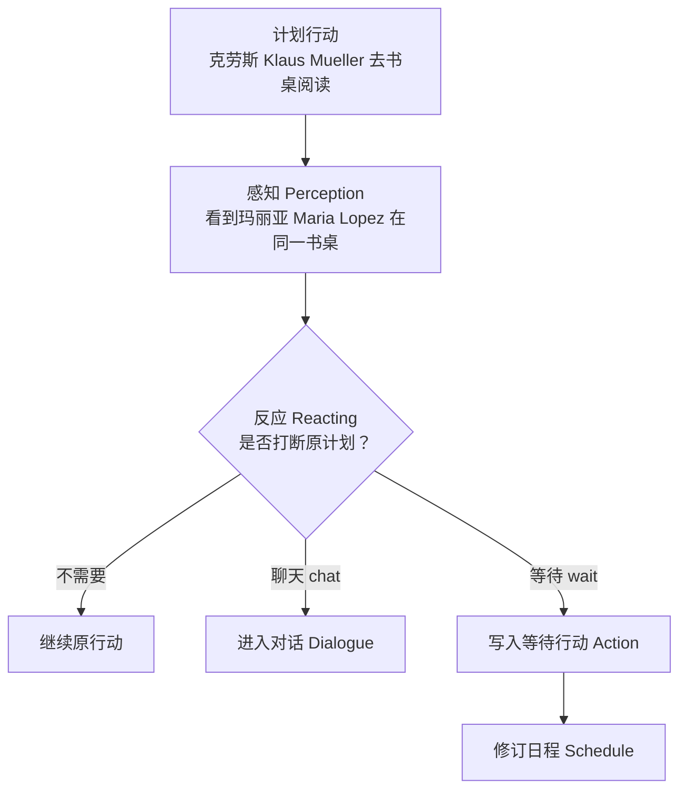

# 第 9 章 论文架构六：反应 Reacting

规划 Planning 给角色一条原计划，反应 Reacting 处理现场变化是否足以打断原计划。它不负责生成完整对话，也不负责重新设计一天日程；它只回答一个关键问题：眼前这件事，要不要改变当前行动。


## 9.1 反应 Reacting 解决什么

可信的小镇生活不能只靠日程执行。

| 现场变化 | 只执行计划会怎样 | 过度反应会怎样 | 反应 Reacting 的判断 |
| --- | --- | --- | --- |
| 路上遇到熟人 | 像没看见人，社会关系不起作用 | 每次遇见都长聊 | 根据关系、时间、近期聊天记录判断是否开口 |
| 目标地点被占用 | 两个人同时使用同一对象 | 任何占用都停下来 | 只有目标地址和对方位置冲突时等待 |
| 听到新信息 | 信息无法进入后续行为 | 一听到就改变整天计划 | 重要信息先进入记忆，再影响后续行动 |
| 计划被打断 | 原计划和新行动时间重叠 | 原计划完全丢失 | 把新行动插入当前子计划，并修订剩余部分 |

反应 Reacting 的工程边界很窄：它发生在行动循环中，先看附近事件 event，再判断聊天 chat、等待 wait 或继续原行动。第 10 章再展开对话 Dialogue 如何生成内容，第 19 章再展开日程 Schedule 如何完整修订。

## 9.2 闭环案例：克劳斯 Klaus Mueller 为什么等待

先看一个完整现场。克劳斯 Klaus Mueller 正要去奥克山学院图书馆的书桌阅读研究资料，玛丽亚 Maria Lopez 已经在同一个书桌阅读。这个场景不需要长篇社交推理，它只需要一个常识判断：同一个书桌已经被占用，克劳斯 Klaus Mueller 应该等一下，而不是和玛丽亚 Maria Lopez 重叠在同一个对象上。

现场输入可以压成四组数据。

```json
{
  "agent": "克劳斯",
  "self_event": {
    "subject": "克劳斯",
    "predicate": "此时",
    "object": "阅读研究资料",
    "address": ["小镇", "奥克山学院", "图书馆", "书桌"]
  },
  "self_path": [[118, 24], [119, 24]],
  "other": "玛丽亚",
  "other_event": {
    "subject": "玛丽亚",
    "predicate": "此时",
    "object": "阅读研究资料",
    "address": ["小镇", "奥克山学院", "图书馆", "书桌"]
  },
  "other_tile_address": ["小镇", "奥克山学院", "图书馆", "书桌"]
}
```

这组数据依次通过以下判断阶段：

| 阶段 | 判断 | 结果 |
| --- | --- | --- |
| 焦点 focus | 玛丽亚 Maria Lopez 是附近可见智能体 agent | 选中她的事件作为焦点 |
| 跳过 skip | 双方有地址、没有睡觉、事件不是待开始、小镇时间未到 23 点 | 可以继续判断 |
| 聊天触发 chat trigger | 当前主要问题不是社交开口 | 不进入聊天分支 |
| 等待 Waiting | 克劳斯 Klaus Mueller 有路径 path，目标地址等于玛丽亚 Maria Lopez 所在瓦片 tile 地址 | 进入等待判断 |
| 行动 Action | 等待判断返回选项 A | 写入等待事件 |
| 日程 Schedule | 新等待行动插入当前子计划 | 剩余计划重新排布 |

等待判断的代表性输出很小。

```json
{
  "res": "A"
}
```

这不是一句说明文字，而是分支裁决：`A` 表示等待玛丽亚 Maria Lopez 完成当前行动，再继续自己的行动。代码把它写成新的行动 Action。

```json
{
  "event": {
    "subject": "克劳斯",
    "predicate": "waiting to start",
    "object": "阅读研究资料",
    "address": ["小镇", "奥克山学院", "图书馆", "书桌"],
    "emoji": "⌛"
  },
  "start": "20240213-10:15:00",
  "duration": 20
}
```

这一条等待事件 event 就是第 9 章的主线结果：现场变化进入当前行动，并继续影响日程、移动和回放。


```mermaid
flowchart TD
    A["计划行动<br/>克劳斯 Klaus Mueller 去书桌阅读"] --> B["感知 Perception<br/>看到玛丽亚 Maria Lopez 在同一书桌"]
    B --> C{"反应 Reacting<br/>是否打断原计划？"}
    C -->|不需要| D["继续原行动"]
    C -->|聊天 chat| E["进入对话 Dialogue"]
    C -->|等待 wait| F["写入等待行动 Action"]
    F --> G["修订日程 Schedule"]
```

## 9.3 运行入口：make_plan() 先处理现场

反应 Reacting 在 `make_plan()` 的最前面。角色每一步先尝试处理现场，再决定是否继续移动或生成新行动。

```python
def make_plan(self, agents):
    if self._reaction(agents):
        return
    if self.path:
        return
    if self.action.finished():
        self.action = self._determine_action()
```

| 代码判断 | 中文含义 | 行为结果 |
| --- | --- | --- |
| `self._reaction(agents)` | 现场是否触发聊天或等待 | 如果触发，直接返回，不再生成新行动 |
| `self.path` | 移动路径 path 是否存在 | 如果正在移动，继续走当前路径 |
| `self.action.finished()` | 当前行动 Action 是否结束 | 结束后才按规划 Planning 生成新行动 |

这段顺序决定了反应 Reacting 的优先级：现场足够重要时，角色不会机械地继续计划；现场不重要时，角色也不会被任何事件牵着走。

## 9.4 感知 Perception 输出什么

反应 Reacting 的输入不是一句聊天文本，而是感知 Perception 产生的概念节点 concept。`percept()` 会从附近地图格子 tile 中收集事件 event，去重后放进 `self.concepts`。

```python
self.concepts, valid_num = [], 0
for idx, event in enumerate(events[: self.percept_config["att_bandwidth"]]):
    recent_nodes = (
        self.associate.retrieve_events() + self.associate.retrieve_chats()
    )
    recent_nodes = set(n.describe for n in recent_nodes)
    if event.get_describe() not in recent_nodes:
        if event.object == "idle" or event.object == "空闲":
            node = Concept.from_event(
                "idle_" + str(idx), "event", event, poignancy=1
            )
        else:
            valid_num += 1
            node_type = "chat" if event.fit(self.name, "对话") else "event"
            node = self._add_concept(node_type, event)
            self.status["poignancy"] += node.poignancy
        self.concepts.append(node)
self.concepts = [c for c in self.concepts if c.event.subject != self.name]
```

一个进入 `self.concepts` 的节点可以这样读。

```json
{
  "node_id": "event_42",
  "node_type": "event",
  "describe": "玛丽亚 此时 阅读研究资料 @ 小镇:奥克山学院:图书馆:书桌",
  "event": {
    "subject": "玛丽亚",
    "predicate": "此时",
    "object": "阅读研究资料",
    "address": ["小镇", "奥克山学院", "图书馆", "书桌"]
  },
  "poignancy": 3,
  "create": "20240213-10:15:00",
  "expire": "20240314-10:15:00",
  "access": "20240213-10:15:00"
}
```

| 字段 | 中文含义 | 后续作用 |
| --- | --- | --- |
| `node_id` | 概念节点 concept 的索引编号 | 后续检索、证据引用和调试定位 |
| `node_type` | 节点类型，事件 event、聊天 chat 或想法 thought | 决定写入哪类关联记忆 Associate |
| `describe` | 可检索的自然语言描述 | 进入向量索引 embedding，并用于关系检索 |
| `event.subject` | 行动主体 | `_reaction()` 用它判断焦点是不是其他智能体 agent |
| `event.predicate` | 事件关系 | `待开始` 会被跳过；`对话` 用于避免对话嵌套 |
| `event.object` | 行动内容或对象 | `空闲` 会轻量处理，普通事件会评分并写入记忆 |
| `event.address` | 世界地图 Maze 中的空间地址 | `_wait_other()` 用它判断空间冲突 |
| `poignancy` | 触动程度 poignancy | 累加到反思 Reflection 的触发阈值 |
| `create / expire / access` | 创建、过期和访问时间 | 参与记忆有效期和检索 Retrieval 排序 |

对第 9 章来说，最关键的是 `subject` 和 `address`：前者决定“要不要把玛丽亚 Maria Lopez 当作反应对象”，后者决定“是否和克劳斯 Klaus Mueller 的目标地点冲突”。

## 9.5 `_reaction()` 的三层判断

`_reaction()` 很短。它先选焦点 focus，再尝试聊天触发 chat trigger，最后尝试等待 Waiting。

```python
def _reaction(self, agents=None, ignore_words=None):
    focus = None
    ignore_words = ignore_words or ["空闲"]

    def _focus(concept):
        return concept.event.subject in agents

    def _ignore(concept):
        return any(i in concept.describe for i in ignore_words)

    if agents:
        priority = [i for i in self.concepts if _focus(i)]
        if priority:
            focus = random.choice(priority)
    if not focus:
        priority = [i for i in self.concepts if not _ignore(i)]
        if priority:
            focus = random.choice(priority)
    if not focus or focus.event.subject not in agents:
        return
    other, focus = agents[focus.event.subject], self.associate.get_relation(focus)

    if self._chat_with(other, focus):
        return True
    if self._wait_other(other, focus):
        return True
    return False
```

这段代码有三层门禁。

| 门禁 | 判断内容 | 不通过时 |
| --- | --- | --- |
| 焦点 focus | 有没有其他智能体 agent 的可见事件 | 直接不反应 |
| 跳过 skip | 当前时间、双方状态、事件地址是否适合反应 | 聊天和等待都不触发 |
| 分支 branch | 聊天或等待是否命中各自条件 | 继续原行动 |

全局跳过 skip 由 `_skip_react()` 处理。

```python
def _skip_react(self, other):
    def _skip(event):
        if not event.address or "sleeping" in event.get_describe(False) or "睡觉" in event.get_describe(False):
            return True
        if event.predicate == "待开始":
            return True
        return False

    if utils.get_timer().daily_duration(mode="hour") >= 23:
        return True
    if _skip(self.get_event()) or _skip(other.get_event()):
        return True
    return False
```

不反应清单按三层门禁分开看。

| 层级 | 不反应条件 | 源码条件 | 抑制的失败 |
| --- | --- | --- | --- |
| 焦点 focus | 没有可处理概念 | `not focus` | 没有现场事件时编造互动 |
| 焦点 focus | 焦点不是其他智能体 agent | `focus.event.subject not in agents` | 对物体、地点、空闲状态社交反应 |
| 跳过 skip | 23 点以后 | `daily_duration(mode="hour") >= 23` | 深夜频繁互动 |
| 跳过 skip | 自己或对方没有地址 | `not event.address` | 生成没有空间落点的互动 |
| 跳过 skip | 自己或对方正在睡觉 | 描述含 `sleeping` 或 `睡觉` | 睡眠状态被打断 |
| 跳过 skip | 自己或对方事件尚未开始 | `event.predicate == "待开始"` | 对未来计划提前反应 |
| 分支 branch | 聊天和等待都没有命中 | `_chat_with()` 与 `_wait_other()` 都为 `False` | 反应系统过度接管日程 |

这张表是调试入口，不是主流程。主流程只需要记住一句话：先确认现场对象，再过滤不该反应的状态，最后只在聊天或等待分支命中时改写行动。

## 9.6 等待 Waiting：空间冲突如何落地

等待 Waiting 是本章主案例。它处理的不是“想不想交流”，而是“目标空间是否被别人占用”。

```python
def _wait_other(self, other, focus):
    if self._skip_react(other):
        return False
    if not self.path:
        return False
    if self.get_event().address != other.get_tile().get_address():
        return False
    if not self.completion("decide_wait", self, other, focus):
        return False
    self.logger.info("{} decides wait to {}".format(self.name, other.name))
    start = utils.get_timer().get_date()
    t = other.action.end - start
    duration = int(t.total_seconds() / 60)
    event = memory.Event(
        self.name,
        "waiting to start",
        self.get_event().get_describe(False),
        address=self.get_event().address,
        emoji=f"⌛",
    )
    self.revise_schedule(event, start, duration)
```

| 条件 | 中文含义 | 不满足时 |
| --- | --- | --- |
| `_skip_react(other)` 为 false | 当前状态适合反应 | 不等待 |
| `self.path` 存在 | 自己正在前往目标地点 | 不等待 |
| `self.get_event().address == other.get_tile().get_address()` | 目标地址正是对方所在位置 | 不等待 |
| `decide_wait` 返回选项 A | 模型判断应该等待 | 不等待 |

等待判断只有一次模型调用：`self.completion("decide_wait", self, other, focus)`。项目中有两个 prompt 文件，是因为 `decide_wait_example.txt` 只是少样本示例 few-shot 的片段模板，不会单独调用模型；最终发送给模型的是 `decide_wait.txt`。

| 文件或变量 | 角色 | 是否调用大语言模型 LLM |
| --- | --- | --- |
| `decide_wait_example.txt` | 渲染示例 1、示例 2 和当前任务 | 否 |
| `examples_1` | “同一浴室，应等待”的固定示例 | 否 |
| `examples_2` | “不同区域，不等待”的固定示例 | 否 |
| `task` | 当前小镇现场的待判断问题 | 否 |
| `decide_wait.txt` | 唯一发送给模型的等待判断提示词 prompt | 是 |

等待判断提示词 prompt `generative_agents/data/prompts/decide_wait.txt`：

```text
示例1：
${examples_1}

示例2：
${examples_2}

根据上述示例，回答哪个选项最适合以下任务：
${task}

不要输出推理过程，直接输出答案：
```

英文含义：

```text
Example 1:
${examples_1}

Example 2:
${examples_2}

Based on the examples above, choose the most suitable option for the current task.
Output only the answer.
```

片段模板 `generative_agents/data/prompts/decide_wait_example.txt`：

```text
背景：
"""
${context}
现在是 ${date}
${status}
${agent} 看到 ${another_status}
"""
问题：一步一步思考，在以下两个选项中，${agent} 应该怎么做？
选项A：等待 ${another} 完成 ${another_action}，然后再 ${action}
选项B：现在继续 ${action}
${reason}${answer}
```

输出结构 schema 和回调 callback：

```python
class decide_waitResponse(BaseModel):
    res: str = Field(description="选择的选项，'A' 表示等待，'B' 表示继续当前行动")

def _callback(response):
    return "A" in response

failsafe = False
```

在克劳斯 Klaus Mueller 的案例里，选项 A 是“等待玛丽亚 Maria Lopez 完成阅读研究资料，然后再阅读研究资料”，选项 B 是“现在继续阅读研究资料”。同一书桌冲突成立，返回 `A` 后才会写入等待行动 Action。

## 9.7 聊天触发 chat trigger：只判断是否开口

聊天触发 chat trigger 是另一个分支，但它不是第 9 章的主线。第 9 章只判断是否开口；真正的多轮对话生成、终止、总结和记忆写入由第 10 章对话 Dialogue 展开。

```python
def _chat_with(self, other, focus):
    if len(self.schedule.daily_schedule) < 1 or len(other.schedule.daily_schedule) < 1:
        return False
    if self._skip_react(other):
        return False
    if other.path:
        return False
    if self.get_event().fit(predicate="对话") or other.get_event().fit(predicate="对话"):
        return False

    chats = self.associate.retrieve_chats(other.name)
    if chats:
        delta = utils.get_timer().get_delta(chats[0].create)
        if delta < 60:
            return False

    if not self.completion("decide_chat", self, other, focus, chats):
        return False
```

聊天触发 chat trigger 的硬条件如下。

| 不开口条件 | 源码条件 | 抑制的失败 |
| --- | --- | --- |
| 任一方日程尚未初始化 | `len(daily_schedule) < 1` | 初始化阶段提前写入社交事件 |
| 对方正在移动 | `other.path` | 对方在路上被频繁截停 |
| 任一方已经在对话 | `fit(predicate="对话")` | 对话嵌套对话 |
| 60 分钟内已经聊过 | `delta < 60` | 同一对角色反复寒暄 |
| 聊天判断提示词 prompt 返回否 | `not completion("decide_chat", ...)` | 关系、场景或话题不足时硬聊 |

聊天判断提示词 prompt `generative_agents/data/prompts/decide_chat.txt`：

```text
背景：
"""
${context}

现在是 ${date}。${chat_history}

${agent_status}
${another_status}
"""

根据上述背景判断，${agent} 是否有可能主动与 ${another} 对话？只用“是”或“否”回答：
```

英文含义：

```text
Given the relationship context, current time, recent chat history, and both agents' current states, decide whether ${agent} is likely to proactively talk with ${another}. Answer only yes or no.
```

输出结构 schema 和回调 callback：

```python
class decide_chatResponse(BaseModel):
    res: bool = Field(description="是否主动发起对话，true 表示会主动对话，false 表示不会")

def _callback(response):
    if isinstance(response, bool):
        return response
    return str(response).strip().lower() in ("true", "yes", "是", "1")

failsafe = False
```

第 9 章到这里为止只产生一个布尔判断。判断为 `True` 以后，对话 Dialogue 机制才开始接管。

## 9.8 行动 Action 与日程 Schedule 如何写回

反应 Reacting 一旦命中分支，就必须改变可执行状态。等待 Waiting 会构造等待事件，聊天触发 chat trigger 会在对话结束后构造对话事件，两者最后都调用 `revise_schedule()`。

```python
def schedule_chat(self, chats, chats_summary, start, duration, other, address=None):
    self.chats.extend(chats)
    event = memory.Event(
        self.name,
        "对话",
        other.name,
        describe=chats_summary,
        address=address or self.get_tile().get_address(),
        emoji=f"💬",
    )
    self.revise_schedule(event, start, duration)
```

```python
def revise_schedule(self, event, start, duration):
    self.action = memory.Action(event, start=start, duration=duration)
    plan, _ = self.schedule.current_plan()
    if len(plan["decompose"]) > 0:
        plan["decompose"] = self.completion(
            "schedule_revise", self.action, self.schedule
        )
```

| 分支 | 写入的事件 event | 下游状态 |
| --- | --- | --- |
| 等待 Waiting | `predicate="waiting to start"`，`object` 是原行动描述 | 当前行动 Action 改成等待 |
| 对话 Dialogue | `predicate="对话"`，`object` 是对方姓名，`describe` 是对话摘要 | 当前行动 Action 改成对话 |
| 日程修订 Schedule Revision | `schedule_revise` 返回新的子计划 decompose | 当前粗计划的剩余部分重新排布 |

`schedule_revise` 是第 19 章日程 Schedule 的主讲内容。第 9 章只保留接口层含义：反应动作不是写在旁边的一段注释，而是成为新的 `Action`，再推动 `plan["decompose"]` 更新。

写回前后的结构可以这样看。

```json
{
  "before": {
    "action": "阅读研究资料",
    "decompose": [
      {"idx": 0, "describe": "阅读论文并记录重点", "start": 600, "duration": 60}
    ]
  },
  "insert": {
    "action": "等待玛丽亚完成阅读研究资料",
    "start": 615,
    "duration": 20
  },
  "after": {
    "decompose": [
      {"idx": 0, "describe": "等待玛丽亚完成阅读研究资料", "start": 615, "duration": 20},
      {"idx": 1, "describe": "继续阅读论文并记录重点", "start": 635, "duration": 40}
    ]
  }
}
```

这个 JSON 摘要表达的是状态变化，不是项目直接输出的完整 checkpoint。真实 checkpoint 中还会包含角色状态、记忆、路径和地图信息；本章只抓住反应 Reacting 改写行动的那一段。

## 9.9 常见失败与检查位置

反应 Reacting 的失败通常不是模型一句话写错，而是输入、门禁、分支或写回链路断开。

| 输出症状 | 常见原因 | 检查位置 | 修正方向 |
| --- | --- | --- | --- |
| 看见人也无反应 | 附近事件没有进入 `self.concepts` | `percept()`、`att_bandwidth`、地图格子 tile 事件 | 检查可见范围、事件写入和自身事件过滤 |
| 焦点选错 | 空闲事件或物体事件压过人物事件 | `_reaction()`、`_focus()`、`_ignore()` | 检查 `ignore_words` 和事件 subject |
| 对任何人都聊天 | 跳过规则太弱或聊天判断太宽 | `_chat_with()`、`decide_chat.txt` | 检查 60 分钟限制、当前行动和关系上下文 |
| 对空间冲突无反应 | 目标地址和对方位置没有对齐 | `_wait_other()`、`self.path`、`get_tile().get_address()` | 检查行动地址和地图对象 |
| 等待过多 | `decide_wait` 把无冲突场景判成等待 | `decide_wait.txt`、`decide_wait_example.txt` | 强化“不同区域不冲突”的示例 |
| 反应后计划不变 | 新行动没有写回子计划 | `revise_schedule()`、`schedule_revise.txt` | 检查当前粗计划是否有 `decompose` |
| 时间重叠 | 修订输出的开始结束时间不连续 | `prompt_schedule_revise()` | 检查 `HH:MM` 输出和时长转换 |

调试顺序也按本章主线来：先看感知 Perception 是否有事件，再看焦点 focus 是否选对，再看跳过 skip 是否误挡，最后看聊天 chat、等待 wait 和日程写回。

## 9.10 本章小结

反应 Reacting 是规划 Planning 和对话 Dialogue 之间的决策层。规划 Planning 给角色原计划，感知 Perception 把现场事件带进来，反应 Reacting 判断这件事是否足以改变当前行动。

第 9 章的关键判断有三个：附近事件 event 是否形成焦点 focus，当前状态是否应该跳过 skip，聊天 chat 或等待 wait 是否命中分支。三者都闭合时，现场变化才会写成新的行动 Action，并继续影响日程 Schedule。

下一章进入对话 Dialogue。反应 Reacting 只决定角色是否开口；对话 Dialogue 决定开口以后怎么说、说多久、何时结束，以及这段对话如何进入双方记忆。

## 参考资料

- Joon Sung Park, Joseph C. O'Brien, Carrie J. Cai, Meredith Ringel Morris, Percy Liang, Michael S. Bernstein. *Generative Agents: Interactive Simulacra of Human Behavior*. arXiv: https://arxiv.org/abs/2304.03442
- ar5iv full text: https://ar5iv.labs.arxiv.org/html/2304.03442
- Generative Agents local source: `generative_agents/modules/agent.py`
- Generative Agents local source: `generative_agents/modules/memory/event.py`
- Generative Agents local source: `generative_agents/modules/memory/associate.py`
- Generative Agents local source: `generative_agents/modules/prompt/scratch.py`
- Generative Agents local prompts: `generative_agents/data/prompts/decide_chat.txt`, `generative_agents/data/prompts/decide_wait.txt`, `generative_agents/data/prompts/decide_wait_example.txt`, `generative_agents/data/prompts/schedule_revise.txt`
