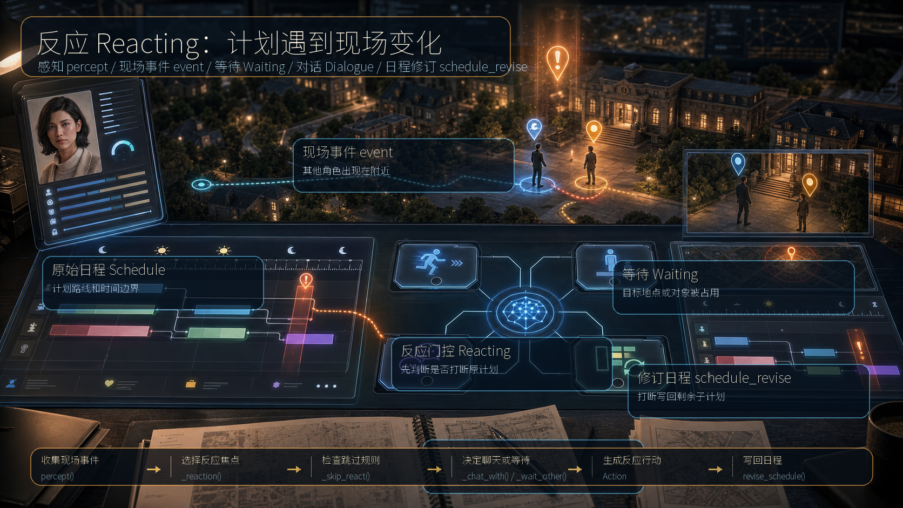
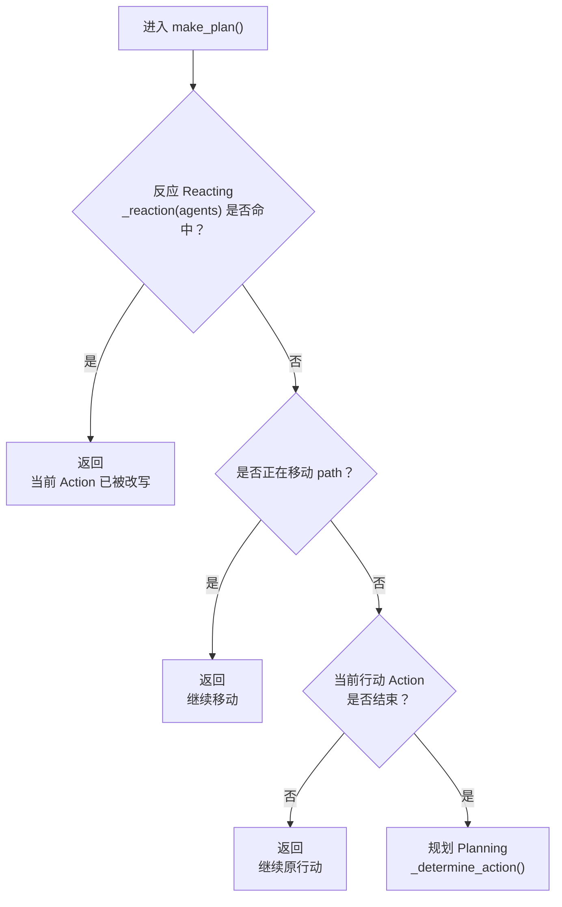
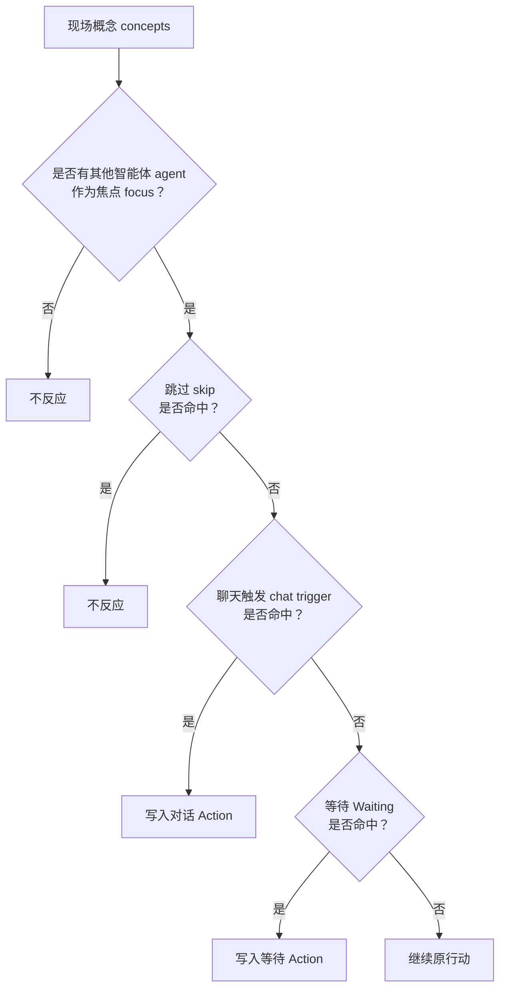

# 第 9 章 论文架构六：反应 Reacting

反应 Reacting 站在规划 Planning 和对话 Dialogue 之间。规划 Planning 已经给角色安排了当前行动；现场出现另一个人、一个事件或一个空间冲突时，反应 Reacting 判断这件事是否足以打断原计划，并把结果写成新的行动 Action。



*图 9-1：反应 Reacting 的判断台。左侧是原计划和当前行动，右侧是现场事件、门禁判断和写回后的 Action。*

## 9.1 从克劳斯 Klaus Mueller 主动开口开始

第 9 章继续使用 `book-custom-discussion` 实验。`20240213-10:20` 这一刻，克劳斯 Klaus Mueller 原本在图书馆写关于中产阶级化的论文；阿伊莎 Ayesha Khan 也在附近学习写作技巧。现场事件被感知后，克劳斯的当前行动从“搭建论文框架”变成了“和阿伊莎对话”。

证据路径：

```text
generative_agents\results\checkpoints\book-custom-discussion\simulate-20240213-1010.json
generative_agents\results\checkpoints\book-custom-discussion\simulate-20240213-1020.json
generative_agents\results\checkpoints\book-custom-discussion\simulate-20240213-1030.json
generative_agents\results\checkpoints\book-custom-discussion\conversation.json
```

反应前，克劳斯 Klaus Mueller 的行动仍是论文写作：

```json
{
  "event": {
    "subject": "克劳斯",
    "predicate": "此时",
    "object": "搭建论文整体框架和章节结构",
    "describe": "搭建论文整体框架和章节结构",
    "address": ["the Ville", "奥克山学院", "图书馆", "图书馆桌子"]
  },
  "start": "20240213-10:05:00",
  "duration": 10
}
```

触发反应的现场事件来自同一个断点前后的阿伊莎 Ayesha Khan。克劳斯 Klaus Mueller 看到的不是抽象的“有人在附近”，而是一个带主体、行为和地址的事件 event：

```json
{
  "event": {
    "subject": "阿伊莎",
    "predicate": "此时",
    "object": "老师讲解写作技巧理论知识",
    "describe": "老师讲解写作技巧理论知识",
    "address": ["the Ville", "奥克山学院", "图书馆", "图书馆桌子"]
  },
  "start": "20240213-10:10:00",
  "duration": 10
}
```

这条事件提供了反应 Reacting 的焦点 focus：`subject="阿伊莎"` 说明现场对象是另一个智能体 agent，`address` 和克劳斯当前地址相同，`object="老师讲解写作技巧理论知识"` 又正好和克劳斯的论文写作需求相关。后面的 `decide_chat` 判断，处理的就是“这个现场事件是否值得打断当前计划”。

反应命中后，当前行动 Action 被改写成对话：

```json
{
  "event": {
    "subject": "克劳斯",
    "predicate": "对话",
    "object": "阿伊莎",
    "describe": "克劳斯向阿伊莎请教中产阶级化论文的写作开头，阿伊莎建议用调研中的真实场景或街巷改造前后对比来切入。",
    "address": ["the Ville", "奥克山学院", "图书馆", "图书馆桌子"],
    "emoji": "💬"
  },
  "obj_event": null,
  "start": "20240213-10:20:00",
  "duration": 0
}
```

同一时间点的 `conversation.json` 保存了对话原文：

```json
{
  "克劳斯 -> 阿伊莎 @ the Ville，奥克山学院，图书馆，图书馆桌子": [
    [
      "克劳斯",
      "阿伊莎老师，您刚才讲的写作技巧正好是我现在需要的——我正在搭建中产阶级化论文的框架，您觉得开头应该怎么切入比较吸引人？"
    ],
    [
      "阿伊莎",
      "老师刚提到，好的开头可以用一个具体场景或细节切入，引发读者的代入感。你可以从你调研中遇到的一个真实案例开始——比如某条街巷在改造前后的对比画面，这样比直接下定义更容易抓住读者。"
    ]
  ]
}
```

反应结束后，克劳斯 Klaus Mueller 回到论文写作链路：

```json
{
  "event": {
    "subject": "克劳斯",
    "predicate": "此时",
    "object": "发展中产阶级化的主要论点（如置换效应、社区影响等）",
    "address": ["the Ville", "奥克山学院", "图书馆", "图书馆桌子"]
  },
  "start": "20240213-10:20:00",
  "duration": 15
}
```

这一组断点把第 9 章的主线钉住了：反应 Reacting 不是生成整段对话，也不是重新规划一整天；它只是在现场事件足够重要时，把当前行动 Action 暂时改写成新的状态。

## 9.2 反应 Reacting 解决什么问题

只有规划 Planning，小镇居民会机械执行自己的日程；只有对话 Dialogue，角色又会在任何相遇时过度开口。反应 Reacting 的价值在于“只在必要时打断”。

| 现场变化 | 没有反应 Reacting | 过度反应 | 合理反应 |
| --- | --- | --- | --- |
| 看到熟人 | 像没看见，对社会关系无感 | 每次遇见都聊天 | 根据关系、状态、近期聊天记录判断是否开口 |
| 目标地点被占用 | 两个角色重叠使用同一对象 | 任何占用都停下 | 只有目标地址冲突时等待 |
| 听到新信息 | 信息无法影响后续行为 | 一听到就重写全天计划 | 先写成当前事件或对话，再进入记忆和后续规划 |
| 当前计划被打断 | 原计划和现场变化互不影响 | 原计划被完全丢掉 | 新行动覆盖当前 Action，日程修订接口处理剩余子计划 |

第 9 章只讲“是否反应”。多轮对话内容留给第 10 章；完整日程修订留给第 19 章；对话和事件进入反思 Reflection 的链路留给第 7 章与第 18 章。

## 9.3 make_plan()：反应优先于继续行动

反应 Reacting 的入口在 `generative_agents/modules/agent.py` 的 `make_plan()`。角色每一步先判断现场是否触发反应，再处理移动和新行动生成。

```python
def make_plan(self, agents):
    if self._reaction(agents):
        return
    if self.path:
        return
    if self.action.finished():
        self.action = self._determine_action()
```

| 顺序 | 代码 | 含义 | 命中结果 |
| --- | --- | --- | --- |
| 1 | `_reaction(agents)` | 现场事件是否触发聊天 chat 或等待 wait | 命中后直接返回，当前 Action 已被改写 |
| 2 | `self.path` | 角色是否正在移动 | 继续沿路径移动，不生成新行动 |
| 3 | `self.action.finished()` | 当前行动是否结束 | 结束后才调用规划 Planning 生成新行动 |


```mermaid
flowchart TD
    Start["进入 make_plan()"] --> React{"反应 Reacting<br/>_reaction(agents) 是否命中？"}
    React -->|是| Return1["返回<br/>当前 Action 已被改写"]
    React -->|否| Path{"是否正在移动 path？"}
    Path -->|是| Return2["返回<br/>继续移动"]
    Path -->|否| Done{"当前行动 Action<br/>是否结束？"}
    Done -->|否| Return3["返回<br/>继续原行动"]
    Done -->|是| NewAction["规划 Planning<br/>_determine_action()"]
```

*图 9-2：`make_plan()` 的执行优先级。现场反应优先于移动和新行动生成。*

## 9.4 反应 Reacting 的输入、处理、输出

反应 Reacting 的输入不是一段聊天文本，而是感知 Perception 留下的事件概念。

```json
{
  "subject": "阿伊莎",
  "predicate": "此时",
  "object": "老师讲解写作技巧理论知识",
  "address": ["the Ville", "奥克山学院", "图书馆", "图书馆桌子"]
}
```

| 环节 | 输入 input | 处理 process | 输出 output |
| --- | --- | --- | --- |
| 现场输入 | 附近事件 event 的 `subject / predicate / object / address` | 判断事件主体是否是其他智能体 agent | 焦点 focus |
| 反应门禁 | 自己和对方的当前事件、地址、时间 | `_skip_react()` 过滤不该反应的状态 | 是否继续判断 |
| 分支判断 | 焦点 focus、关系记忆、近期聊天记录、路径 path | `_chat_with()` 或 `_wait_other()` | 聊天 chat、等待 wait 或继续原行动 |
| 状态写回 | 新事件 event、开始时间 start、持续时间 duration | `revise_schedule()` / `schedule_chat()` | 新行动 Action |

克劳斯 Klaus Mueller 的例子中，输出就是 `predicate="对话"` 的 Action，而不是一个普通文本回答。

## 9.5 `_reaction()` 的三层门禁：焦点 focus、跳过 skip、分支 branch

`_reaction()` 先选焦点 focus，再尝试聊天 chat，最后尝试等待 wait。它本身不生成对话内容，只负责分支裁决。

```python
def _reaction(self, agents=None, ignore_words=None):
    focus = None
    ignore_words = ignore_words or ["空闲"]

    def _focus(concept):
        return concept.event.subject in agents

    def _ignore(concept):
        return any(i in concept.describe for i in ignore_words)

    if agents:
        priority = [i for i in self.concepts if _focus(i)]
        if priority:
            focus = random.choice(priority)
    if not focus:
        priority = [i for i in self.concepts if not _ignore(i)]
        if priority:
            focus = random.choice(priority)
    if not focus or focus.event.subject not in agents:
        return
    other, focus = agents[focus.event.subject], self.associate.get_relation(focus)

    if self._chat_with(other, focus):
        return True
    if self._wait_other(other, focus):
        return True
    return False
```


```mermaid
flowchart TD
    Concepts["现场概念 concepts"] --> Focus{"是否有其他智能体 agent<br/>作为焦点 focus？"}
    Focus -->|否| Stop1["不反应"]
    Focus -->|是| Skip{"跳过 skip<br/>是否命中？"}
    Skip -->|是| Stop2["不反应"]
    Skip -->|否| Chat{"聊天触发 chat trigger<br/>是否命中？"}
    Chat -->|是| ChatAction["写入对话 Action"]
    Chat -->|否| Wait{"等待 Waiting<br/>是否命中？"}
    Wait -->|是| WaitAction["写入等待 Action"]
    Wait -->|否| Keep["继续原行动"]
```

*图 9-3：反应 Reacting 的三层门禁。焦点、跳过和分支三步都成立，现场事件才会改写 Action。*

全局跳过 skip 由 `_skip_react()` 处理：

```python
def _skip_react(self, other):
    def _skip(event):
        if not event.address or "sleeping" in event.get_describe(False) or "睡觉" in event.get_describe(False):
            return True
        if event.predicate == "待开始":
            return True
        return False

    if utils.get_timer().daily_duration(mode="hour") >= 23:
        return True
    if _skip(self.get_event()) or _skip(other.get_event()):
        return True
    return False
```

| 门禁 | 不反应条件 | 抑制的失败 |
| --- | --- | --- |
| 焦点 focus | 没有其他智能体 agent 的现场事件 | 对物体、地点或空闲状态产生社交反应 |
| 跳过 skip | 23 点以后 | 深夜频繁互动 |
| 跳过 skip | 自己或对方没有地址 | 生成没有空间落点的互动 |
| 跳过 skip | 自己或对方正在睡觉 | 睡眠状态被打断 |
| 跳过 skip | 自己或对方事件尚未开始 | 对未来计划提前反应 |
| 分支 branch | 聊天和等待都没命中 | 继续原计划 |

## 9.6 聊天触发 chat trigger：只决定是否开口

聊天触发 chat trigger 是第 9 章主线。它只判断“现在要不要开口”，不负责生成多轮对话。`True` 之后，第 10 章的对话 Dialogue 才接管具体说什么、何时结束、如何总结。

```python
def _chat_with(self, other, focus):
    if len(self.schedule.daily_schedule) < 1 or len(other.schedule.daily_schedule) < 1:
        return False
    if self._skip_react(other):
        return False
    if other.path:
        return False
    if self.get_event().fit(predicate="对话") or other.get_event().fit(predicate="对话"):
        return False

    chats = self.associate.retrieve_chats(other.name)
    if chats:
        delta = utils.get_timer().get_delta(chats[0].create)
        if delta < 60:
            return False

    if not self.completion("decide_chat", self, other, focus, chats):
        return False

    ...
    self.schedule_chat(chats, chat_summary, start, duration, other)
    other.schedule_chat(chats, chat_summary, start, duration, self)
    return True
```

聊天判断提示词 prompt 路径：

```text
generative_agents\data\prompts\decide_chat.txt
```

```text
背景：
"""
${context}

现在是 ${date}。${chat_history}

${agent_status}
${another_status}
"""

根据上述背景判断，${agent} 是否有可能主动与 ${another} 对话？只用“是”或“否”回答：
```

英文含义：

```text
Given the relationship context, current time, recent chat history, and both agents' current states,
decide whether ${agent} is likely to proactively talk with ${another}.
Answer only yes or no.
```

| 项 | 内容 |
| --- | --- |
| 输入变量 input | 关系和事件上下文 `context`、当前时间 `date`、近期对话 `chat_history`、双方状态 `agent_status / another_status` |
| 输出结构 schema | `res: bool` |
| 回调 callback | `true / yes / 是 / 1` 视为会开口 |
| 兜底值 failsafe | `False`，默认不开口 |
| 输出流向 | `True` 后进入对话 Dialogue；`False` 则继续等待或原行动 |

克劳斯 Klaus Mueller 的真实结果是聊天分支命中：

| 证据 | 值 |
| --- | --- |
| 当前 Action | `predicate="对话"`，`object="阿伊莎"` |
| 对话位置 | `the Ville > 奥克山学院 > 图书馆 > 图书馆桌子` |
| 对话摘要 | 克劳斯向阿伊莎请教论文开头，阿伊莎建议用真实场景切入 |
| 对话原文 | 保存在 `conversation.json` 的 `20240213-10:20` 下 |

## 9.7 等待 Waiting：空间冲突下的另一个分支

等待 Waiting 是反应 Reacting 的另一条分支。`book-custom-discussion` 中没有稳定命中的等待结果，因此本节只讲工程机制和 prompt，不把等待写成这次实验的主结论。

```python
def _wait_other(self, other, focus):
    if self._skip_react(other):
        return False
    if not self.path:
        return False
    if self.get_event().address != other.get_tile().get_address():
        return False
    if not self.completion("decide_wait", self, other, focus):
        return False

    start = utils.get_timer().get_date()
    t = other.action.end - start
    duration = int(t.total_seconds() / 60)
    event = memory.Event(
        self.name,
        "waiting to start",
        self.get_event().get_describe(False),
        address=self.get_event().address,
        emoji=f"⌛",
    )
    self.revise_schedule(event, start, duration)
```

| 条件 | 含义 | 不满足时 |
| --- | --- | --- |
| `_skip_react(other)` 为 `False` | 当前状态允许反应 | 不等待 |
| `self.path` 存在 | 自己正在前往目标地点 | 不等待 |
| 自己目标地址等于对方所在瓦片 tile 地址 | 目标空间被占用 | 不等待 |
| `decide_wait` 返回选项 A | 模型判断应该等待 | 不等待 |

等待判断由两个 prompt 文件组成。`decide_wait_example.txt` 是少样本示例 few-shot 的片段模板，`decide_wait.txt` 才是最终发送给模型的提示词 prompt。

```text
示例1：
${examples_1}

示例2：
${examples_2}

根据上述示例，回答哪个选项最适合以下任务：
${task}

不要输出推理过程，直接输出答案：
```

片段模板 `decide_wait_example.txt`：

```text
背景：
"""
${context}
现在是 ${date}
${status}
${agent} 看到 ${another_status}
"""
问题：一步一步思考，在以下两个选项中，${agent} 应该怎么做？
选项A：等待 ${another} 完成 ${another_action}，然后再 ${action}
选项B：现在继续 ${action}
${reason}${answer}
```

| 项 | 内容 |
| --- | --- |
| 输入变量 input | 上下文 `context`、时间 `date`、双方状态 `status / another_status`、当前行动 `action / another_action` |
| 输出结构 schema | `res: str`，选项 A 或 B |
| 回调 callback | 返回文本中包含 `A` 则视为等待 |
| 兜底值 failsafe | `False`，默认不等待 |
| 输出流向 | 命中后写入 `predicate="waiting to start"` 的 Action |

## 9.8 写回边界：反应如何变成 Action

反应 Reacting 一旦命中，必须改写可执行状态。聊天分支调用 `schedule_chat()`，等待分支调用 `revise_schedule()`；两条分支最终都会改变当前行动 Action。

```python
def schedule_chat(self, chats, chats_summary, start, duration, other, address=None):
    self.chats.extend(chats)
    event = memory.Event(
        self.name,
        "对话",
        other.name,
        describe=chats_summary,
        address=address or self.get_tile().get_address(),
        emoji=f"💬",
    )
    self.revise_schedule(event, start, duration)
```

```python
def revise_schedule(self, event, start, duration):
    self.action = memory.Action(event, start=start, duration=duration)
    plan, _ = self.schedule.current_plan()
    if len(plan["decompose"]) > 0:
        plan["decompose"] = self.completion(
            "schedule_revise", self.action, self.schedule
        )
```

| 分支 | 写入事件 event | 当前状态变化 | 后续章节 |
| --- | --- | --- | --- |
| 聊天 chat | `predicate="对话"`，`object` 是对方姓名 | 当前 Action 变成对话 | 第 10 章展开对话生成 |
| 等待 wait | `predicate="waiting to start"`，`object` 是原行动描述 | 当前 Action 变成等待 | 第 19 章展开日程修订 |
| 日程修订 schedule revision | `schedule_revise` 重排当前粗计划剩余子计划 | 避免反应和原计划重叠 | 第 19 章展开完整机制 |

第 9 章的写回边界只到这里：现场变化已经变成 Action。至于对话如何生成、对话如何总结、日程如何重新排布，分别交给后续章节。

## 9.9 可运行脚本：观察一次反应 Reacting

脚手架位置：

```text
docs\book\scaffolds\part_01\ch09_reacting_demo.py
```

断点复查 checkpoint mode 读取三个连续断点和对话记录，不调用大语言模型 LLM：

```powershell
python docs/book/scaffolds/part_01/ch09_reacting_demo.py --mode checkpoint --time 20240213-10:20 --agent 克劳斯 --other 阿伊莎
```

关键输出 stdout 摘录：

```text
第 9 章反应 Reacting 脚本应用：断点复查
========================================================================
实验 experiment: book-custom-discussion
角色 agent: 克劳斯 Klaus Mueller
对象 other: 阿伊莎 Ayesha Khan
反应时间 reaction_time: 20240213-10:20

反应前 before_action @ 20240213-10:10:
  predicate: 此时
  object: 搭建论文整体框架和章节结构
  address: the Ville > 奥克山学院 > 图书馆 > 图书馆桌子

触发事件 trigger_event @ 20240213-10:10:
  predicate: 此时
  object: 老师讲解写作技巧理论知识
  address: the Ville > 奥克山学院 > 图书馆 > 图书馆桌子

反应中 reaction_action @ 20240213-10:20:
  predicate: 对话
  object: 阿伊莎
  describe: 克劳斯向阿伊莎请教中产阶级化论文的写作开头，阿伊莎建议用调研中的真实场景或街巷改造前后对比来切入。

conversation:
  1. 克劳斯: 阿伊莎老师，您刚才讲的写作技巧正好是我现在需要的...
  2. 阿伊莎: 老师刚提到，好的开头可以用一个具体场景或细节切入...

反应后 after_action @ 20240213-10:30:
  predicate: 此时
  object: 发展中产阶级化的主要论点（如置换效应、社区影响等）
```

门禁复查 gates mode 只复查反应链路，不重跑模型：

```powershell
python docs/book/scaffolds/part_01/ch09_reacting_demo.py --mode gates --time 20240213-10:20 --agent 克劳斯 --other 阿伊莎
```

关键输出 stdout 摘录：

```text
门禁 gates:
  focus_is_agent: 是
    evidence: conversation_key=克劳斯 -> 阿伊莎 @ the Ville，奥克山学院，图书馆，图书馆桌子
  skip_react: 否
    evidence: hour=10, self_has_address=True, other_has_address=True, self_sleeping=False, other_sleeping=False, self_pending=False, other_pending=False
  chat_branch: 命中 hit
    evidence: action.predicate=对话, action.object=阿伊莎, chats=2
  wait_branch: 未作为本次主结果
    evidence: 本次 checkpoint 的最终 Action 是对话，不是 waiting to start。
```

| 脚本模式 | 证明什么 | 关键观察 |
| --- | --- | --- |
| `checkpoint` | 反应结果已经写成 Action | 反应前是论文写作，反应中是对话，反应后回到论文写作 |
| `gates` | 反应门禁链路成立 | 焦点是阿伊莎，跳过 skip 未触发，聊天分支命中 |

## 9.10 失败诊断与本章小结

反应 Reacting 的失败通常来自输入、门禁、分支或写回链路，而不是单个 prompt 写坏。

| 输出症状 | 常见原因 | 检查位置 | 修正方向 |
| --- | --- | --- | --- |
| 看见人也无反应 | 附近事件没有进入 `self.concepts` | `percept()`、地图格子 tile 事件 | 检查可见范围和事件写入 |
| 焦点 focus 选错 | 空闲事件或物体事件压过人物事件 | `_reaction()`、`ignore_words` | 检查 `subject` 是否是其他智能体 agent |
| 对任何人都聊天 | 聊天门禁太宽 | `_chat_with()`、`decide_chat.txt` | 检查 60 分钟限制、当前行动和关系上下文 |
| 应等待却不等待 | 目标地址和对方瓦片地址没有对齐 | `_wait_other()`、`self.path`、`get_tile().get_address()` | 检查行动地址和地图对象 |
| 反应后计划不变 | 新 Action 没有触发日程修订 | `revise_schedule()` | 检查当前粗计划是否有 `decompose` |
| 对话后没有影响后续 | chat 没有进入记忆或反思链路 | `schedule_chat()`、`reflect()` | 检查 `self.chats` 和关联记忆 Associate |

反应 Reacting 把小镇从“按表执行”推进到“看现场行事”。它不负责完整生成对话，也不负责重写一整天计划；它只负责判断现场事件是否应该改变当前行动，并把结果写成 Action。下一章进入对话 Dialogue：反应 Reacting 让角色开口，对话 Dialogue 决定角色开口以后怎么说。

## 参考资料

- Joon Sung Park, Joseph C. O'Brien, Carrie J. Cai, Meredith Ringel Morris, Percy Liang, Michael S. Bernstein. *Generative Agents: Interactive Simulacra of Human Behavior*. arXiv: https://arxiv.org/abs/2304.03442
- ar5iv full text: https://ar5iv.labs.arxiv.org/html/2304.03442
- Generative Agents local source: `generative_agents/modules/agent.py`
- Generative Agents local source: `generative_agents/modules/prompt/scratch.py`
- Generative Agents local prompt: `generative_agents/data/prompts/decide_chat.txt`
- Generative Agents local prompt: `generative_agents/data/prompts/decide_wait.txt`
- Generative Agents local prompt: `generative_agents/data/prompts/decide_wait_example.txt`
- 本章脚手架 scaffold：`docs/book/scaffolds/part_01/ch09_reacting_demo.py`
