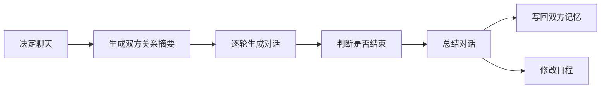
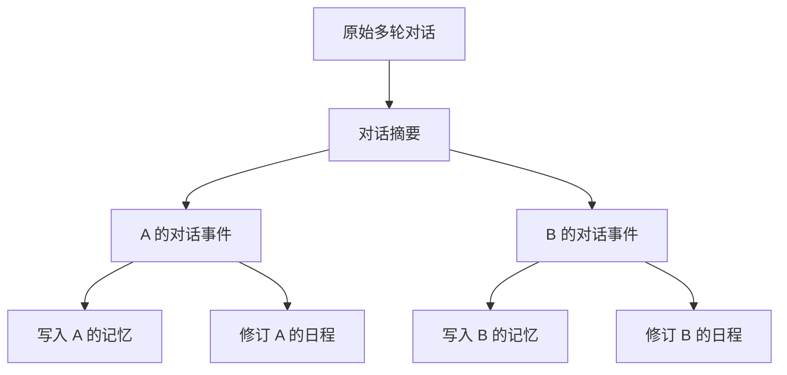

# 第 10 章 论文架构七：Dialogue

## 10.1 Dialogue 解决什么

Reacting 决定角色是否应该开口。Dialogue 解决开口以后发生什么。在 Generative Agents 中，对话不是一段孤立文本。它要回答五个问题：

| 问题 | 为什么重要 |
| --- | --- |
| 是否应该聊天 | 居民不会每次擦肩而过都长聊 |
| 双方是什么关系 | 朋友、陌生人、竞争者说话方式不同 |
| 这一轮该说什么 | 对话要符合场景、身份、记忆和当前任务 |
| 什么时候结束 | 对话不能无限循环 |
| 聊完以后怎么办 | 对话必须进入记忆和日程，否则只是装饰 |

Dialogue 的价值不只在“说得像人”。更重要的是，对话会改变双方记忆，进而影响后续计划、反应和社会信息传播。



*图 10-1：Dialogue 的完整链路。对话从是否开口开始，到写回记忆和日程才算结束。*

## 10.2 先决定是否聊天

对话不是遇见人就自动发生。`_chat_with()` 会先检索最近与对方的聊天记录：

```python
chats = self.associate.retrieve_chats(other.name)
if chats:
    delta = utils.get_timer().get_delta(chats[0].create)
    if delta < 60:
        return False
```

如果一小时内聊过，就不再聊天。这个限制很实际，否则居民会在短时间内反复寒暄。随后系统调用：

```python
if not self.completion("decide_chat", self, other, focus, chats):
    return False
```

`decide_chat.txt` 会基于以下信息判断是否应该主动对话：

| 输入 | 中文意思 | 判断作用 |
| --- | --- | --- |
| 当前上下文 | 眼前发生了什么 | 判断此时开口是否自然 |
| 当前时间 | 现在几点 | 判断是否适合聊天 |
| 上次聊天历史 | 最近是否聊过 | 避免重复对话 |
| 当前角色状态 | 自己在忙什么 | 判断是否有空开口 |
| 对方角色状态 | 对方在做什么 | 判断是否应该打扰 |

这一步把 Dialogue 从“生成文本”前移到“是否应该说话”。社会仿真里，这比文本本身更重要。

## 10.3 关系摘要不是全局关系表

如果决定聊天，系统会先总结双方关系：

```python
relations = [
    self.completion("summarize_relation", self, other.name),
    other.completion("summarize_relation", other, self.name),
]
```

这里生成的是两个关系摘要，不是一个全局关系标签。

| 关系摘要 | 含义 |
| --- | --- |
| A 对 B 的理解 | A 根据自己的记忆如何看待 B |
| B 对 A 的理解 | B 根据自己的记忆如何看待 A |

同一段关系在两个人心中可能不同。克劳斯对玛丽亚的理解，不一定等于玛丽亚对克劳斯的理解。山姆认为自己在积极竞选，汤姆可能认为山姆令人反感。`summarize_relation()` 会围绕对方名字检索记忆：

```python
nodes = agent.associate.retrieve_focus([other_name], 50)
```

然后生成一句关系描述。这样，对话不是只根据当前画面说话，而是带着历史感。

## 10.4 多轮对话如何生成

关系摘要生成后，系统开始多轮对话。

```python
for i in range(self.chat_iter):
    text = self.completion("generate_chat", self, other, relations[0], chats)
    ...
    text = other.completion("generate_chat", other, self, relations[1], chats)
```

`generate_chat.txt` 的输入包括：

| 输入 | 作用 |
| --- | --- |
| 角色基础描述 | 保持说话人身份一致 |
| 角色记忆 | 让对话能引用过去经历 |
| 当前位置 | 让话题贴合场景 |
| 当前时间 | 控制问候、活动和时间感 |
| 最近对话背景 | 避免重复寒暄 |
| 当前场景 | 说明为什么现在会开口 |
| 已有对话记录 | 让下一句接得上前文 |
| 对话原则 | 控制自然度、长度和不重复 |

对话原则要求输出 1 到 3 句话，不能重复已有内容，要符合性格和当前情境，并且直接输出角色要说的话。这比“把两个人的设定塞进 prompt 里让模型聊”要稳得多，因为它把身份、记忆、场景、关系和已有上下文都放进了生成链路。

## 10.5 避免复读和无限聊天

多轮对话必须有退出机制。Generative Agents 会检查重复：

```python
generate_chat_check_repeat
```

也会判断话题是否结束：

```python
decide_chat_terminate
```

这两个机制分别处理两个问题：

| 机制 | 解决的问题 |
| --- | --- |
| `generate_chat_check_repeat` | 防止角色重复说相同内容 |
| `decide_chat_terminate` | 防止对话无限继续 |

没有这两个判断，对话很容易出现两种失败：一是互相复读，二是明明话题已经结束还继续硬聊。

## 10.6 对话写回

对话结束后，系统不会只把文本打印出来。它会做三件事。第一，记录原始对话：

```python
self.conversation[key].append({f"{self.name} -> {other.name} @ ...": chats})
```

第二，生成对话摘要：

```python
chat_summary = self.completion("summarize_chats", chats)
```

第三，把聊天写入双方日程：

```python
self.schedule_chat(chats, chat_summary, start, duration, other)
other.schedule_chat(chats, chat_summary, start, duration, self)
```

`schedule_chat()` 会创建一个“对话”事件，并调用 `revise_schedule()`：

```python
event = memory.Event(
    self.name,
    "对话",
    other.name,
    describe=chats_summary,
    address=address or self.get_tile().get_address(),
    emoji=f"💬",
)
self.revise_schedule(event, start, duration)
```

这说明聊天会占用真实时间。对话不是免费的文本输出，它会改变当前 action，也会影响日程。



*图 10-2：对话写回。Dialogue 的结束点不是最后一句话，而是双方记忆和日程都被更新。*

## 10.7 对话如何影响 Planning

Planning 和 Dialogue 是双向关系。计划影响对话。一个人正在赶去上班，可能不会长聊；一个人正在准备派对，可能会主动邀请别人。对话也影响计划。伊莎贝拉邀请阿伊莎参加派对，阿伊莎可能把晚上计划改为去咖啡馆。克劳斯遇到玛丽亚后，可能把之后一段时间改为继续交流或参加相关活动。短期上，对话通过 `schedule_chat()` 和 `revise_schedule()` 占用当前时间。长期上，对话摘要进入记忆，后续 Reflection 可能把它升成 thought，再影响明天或之后的计划。

```text
当前计划
  -> 是否适合聊天
  -> 对话发生
  -> 摘要写入记忆
  -> 可能触发反思
  -> 后续 planning 读取这些记忆
```

这就是生成式智能体比普通 NPC 更有连续性的地方。一次聊天不只是一次文本交换，而是未来行为的材料。

## 10.8 情人节派对为什么依赖 Dialogue

论文中的情人节派对不是全局广播。它依赖一次次对话传播。首先，伊莎贝拉的 `currently` 中有派对目标。这个目标会影响她的计划，她可能安排采购、准备、邀请居民、布置咖啡馆。其次，当伊莎贝拉遇到其他居民时，Reacting 可能触发聊天。如果 `decide_chat` 判断当前场景适合，她会主动提到派对。然后，对话摘要进入双方记忆。被邀请者后续可能在计划中考虑是否参加，也可能在遇到别人时继续传播。最后，Reflection 可能把这些对话升为 thought：

```text
伊莎贝拉认为阿伊莎可能会参加情人节派对。
阿伊莎知道伊莎贝拉正在邀请居民参加派对。
```

派对传播依赖的是这条链路：


*图 10-3：情人节派对的对话传播链路。社会事件不是广播出来的，而是在对话、记忆和反思中扩散。*

## 10.9 有记忆的对话和无记忆的对话

如果对话只依赖当前场景，会出现很多问题。

| 问题 | 无记忆对话的表现 | 有记忆对话的表现 |
| --- | --- | --- |
| 重复寒暄 | 角色反复自我介绍 | 系统知道最近聊过什么 |
| 关系无差异 | 朋友、陌生人、竞争者说话一样 | 关系摘要影响语气和话题 |
| 信息传播断裂 | 听过派对的人后面像第一次听说 | 对话摘要进入后续检索 |
| 对话不改变未来 | 聊完就结束 | 后续计划和反思能读取这次对话 |

Generative Agents 的对话实现把当前场景、关系摘要、近期记忆、历史聊天和对话写回连在一起，所以对话才会成为社会仿真的一部分。

## 10.10 Dialogue 的真实 prompt

Dialogue 不是一个 prompt 完成的，而是一条 prompt 链。

| 阶段 | Prompt | 输出 |
| --- | --- | --- |
| 是否聊天 | `decide_chat.txt` | `res: bool`，是否主动对话。 |
| 关系摘要 | `summarize_relation.txt` | `res: str`，一句话关系描述。 |
| 生成发言 | `generate_chat.txt` | `res: str`，角色说出的 1 到 3 句话。 |
| 检查复读 | `generate_chat_check_repeat.txt` | `res: bool`，新发言是否重复。 |
| 判断结束 | `decide_chat_terminate.txt` | `res: bool`，对话是否告一段落。 |
| 总结对话 | `summarize_chats.txt` | `res: str`，不超过 100 字的摘要。 |

`decide_chat.txt` 的完整模板如下：

```text
背景：
"""
${context}

现在是 ${date}。${chat_history}

${agent_status}
${another_status}
"""

根据上述背景判断，${agent} 是否有可能主动与 ${another} 对话？只用“是”或“否”回答：
```

英文对照如下：

```text
Background:
"""
${context}

It is now ${date}. ${chat_history}

${agent_status}
${another_status}
"""

Based on the background above, is ${agent} likely to actively start a conversation with ${another}? Answer only "yes" or "no":
```

`summarize_relation.txt` 的完整模板如下：

```text
背景描述：
"""
${context}
"""

输出示例1：乔和汤姆是朋友
输出示例2：艾琳和约翰在玩游戏

参考上述背景描述和输出示例，用一句话总结 ${agent} 和 ${another} 之间的关系：
```

英文对照如下：

```text
Background description:
"""
${context}
"""

Output example 1: Joe and Tom are friends.
Output example 2: Irene and John are playing a game.

Using the background description and output examples above, summarize the relationship between ${agent} and ${another} in one sentence:
```

`generate_chat.txt` 的完整模板如下：

```text
以下是对 ${agent} 的简要描述：
${base_desc}

以下是 ${agent} 的记忆：
${memory}

当前位置：${address}
当前时间：${current_time}

${previous_context}${current_context}
${agent} 开始和 ${another} 对话。以下是他们的对话记录：
<对话记录>
${conversation}
</对话记录>

<对话原则>
- ${agent} 不会重复<对话记录>中已有的内容
- 对话内容要符合智能体的性格和当前情境
- 语言自然流畅，符合日常交流习惯
- 长度控制在1-3句话内
- 直接输出 ${agent} 的对话内容，不要补充其他信息
</对话原则>

基于以上<对话记录>和<对话原则>，现在 ${agent} 会对 ${another} 说：
```

英文对照如下：

```text
Here is a brief description of ${agent}:
${base_desc}

Here are ${agent}'s memories:
${memory}

Current location: ${address}
Current time: ${current_time}

${previous_context}${current_context}
${agent} starts a conversation with ${another}. Here is their conversation record:
<conversation record>
${conversation}
</conversation record>

<conversation principles>
- ${agent} will not repeat content that already appears in <conversation record>.
- The conversation content should fit the agent's personality and current situation.
- The language should be natural and fluent, matching everyday conversation.
- Keep the length within 1 to 3 sentences.
- Output only ${agent}'s dialogue content. Do not add any other information.
</conversation principles>

Based on the <conversation record> and <conversation principles> above, ${agent} will now say to ${another}:
```

`generate_chat_check_repeat.txt` 的完整模板如下：

```text
<对话记录>
${conversation}
</对话记录>

<新对话>
${content}
</新对话>

${agent} 在<新对话>中所说的内容，是否在<对话记录>中出现过？只用“是”或“否”回答：
```

英文对照如下：

```text
<conversation record>
${conversation}
</conversation record>

<new dialogue>
${content}
</new dialogue>

Did what ${agent} said in <new dialogue> already appear in <conversation record>? Answer only "yes" or "no":
```

`decide_chat_terminate.txt` 的完整模板如下：

```text
<对话记录>
${conversation}
</对话记录>

<判断逻辑>
如果最后一句话是疑问句，表明对话没有结束。
如果最后一句话是在请求对方帮助，表明对话没有结束。
如果最后一句话是想听对方的看法，表明对话没有结束。
如果最后一句话是期待与对方继续讨论，表明对话没有结束。
</判断逻辑>

根据以上<对话记录>和<判断逻辑>分析，${agent} 和 ${another} 的对话是否已经告一段落。只用“是”或“否”回答：
```

英文对照如下：

```text
<conversation record>
${conversation}
</conversation record>

<judgment logic>
If the last sentence is a question, the conversation has not ended.
If the last sentence asks the other person for help, the conversation has not ended.
If the last sentence asks for the other person's opinion, the conversation has not ended.
If the last sentence expects the other person to continue discussing, the conversation has not ended.
</judgment logic>

Based on the <conversation record> and <judgment logic> above, analyze whether the conversation between ${agent} and ${another} has come to an end. Answer only "yes" or "no":
```

`summarize_chats.txt` 的完整模板如下：

```text
对话：
"""
${conversation}
"""

用不超过100字的短句总结上述对话：
```

英文对照如下：

```text
Conversation:
"""
${conversation}
"""

Summarize the conversation above in a short sentence of no more than 100 Chinese characters:
```

这条 prompt 链的关键不在“模型会说话”，而在系统把每个风险点都拆开控制：先判断要不要说，再总结关系，再生成一句话，再检查重复，再判断是否结束，最后写成摘要进入记忆。

## 10.11 Dialogue 的常见失败

Dialogue 的失败不一定表现为“话说得不好”。很多时候，文本看起来还行，但系统链路已经断了。

| 失败现象 | 表现 | 检查位置 |
| --- | --- | --- |
| 频繁重复聊天 | 一小时内反复寒暄 | `retrieve_chats()`、60 分钟限制 |
| 关系不明显 | 所有人说话语气相同 | `summarize_relation`、相关记忆检索 |
| 对话复读 | 多轮中重复同一句 | `generate_chat_check_repeat` |
| 对话停不下来 | 场景已经结束还继续聊 | `decide_chat_terminate` |
| 对话不影响行为 | 聊完没有任何后续变化 | `summarize_chats`、`schedule_chat()`、memory 写回 |
| 信息无法传播 | 角色听过但后面想不起 | chat summary 重要性和检索链路 |

调试 Dialogue 时，不能只看生成文本是否自然。更重要的是看这段对话有没有进入双方记忆，并在之后被检索、反思和计划使用。

## 10.12 本章小结

Dialogue 把角色之间的相遇变成可持续的社会关系。它不是“让两个模型互相聊天”，而是从是否聊天、双方关系、多轮生成、重复检查、结束判断、摘要写回一路走完。

| 本章内容 | 核心结论 |
| --- | --- |
| 是否聊天 | 对话先经过 `decide_chat`，不是遇见人就自动发生。 |
| 双方关系 | 系统分别总结 A 对 B、B 对 A 的关系理解。 |
| 多轮生成 | `generate_chat` 同时读取身份、记忆、场景、时间和已有对话。 |
| 退出机制 | 重复检查和终止判断避免复读与无限聊天。 |
| 写回机制 | 对话摘要进入双方记忆，并通过 `schedule_chat()` 占用日程时间。 |
| 社会传播 | 情人节派对、关系形成和信息扩散都依赖对话写回。 |

下一章进入论文评价方法。论文的主要架构已经完整：persona 定义角色，memory 保存经历，retrieval 想起相关内容，reflection 形成高层理解，planning 生成生活，reacting 处理现场变化，dialogue 推动社会信息传播。

## 参考资料

- Joon Sung Park, Joseph C. O'Brien, Carrie J. Cai, Meredith Ringel Morris, Percy Liang, Michael S. Bernstein. *Generative Agents: Interactive Simulacra of Human Behavior*. arXiv: https://arxiv.org/abs/2304.03442
- ar5iv full text: https://ar5iv.labs.arxiv.org/html/2304.03442
- Generative Agents local source: `generative_agents/modules/agent.py`
- Generative Agents local prompts: `generative_agents/data/prompts/decide_chat.txt`, `generative_agents/data/prompts/summarize_relation.txt`, `generative_agents/data/prompts/generate_chat.txt`, `generative_agents/data/prompts/generate_chat_check_repeat.txt`, `generative_agents/data/prompts/decide_chat_terminate.txt`, `generative_agents/data/prompts/summarize_chats.txt`
