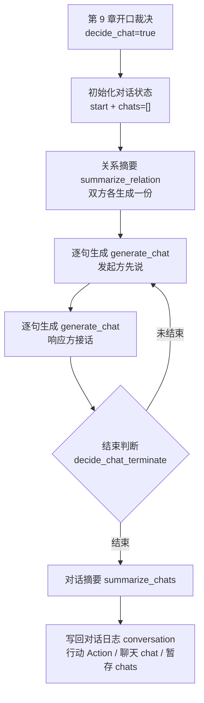
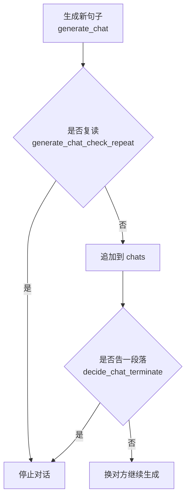

# 第 10 章 论文架构七：对话 Dialogue

反应 Reacting 已经把现场事件改写成“克劳斯 Klaus Mueller 要和阿伊莎 Ayesha Khan 说话”的行动 Action。对话 Dialogue 接住这个结果，继续完成五件事：生成双方关系摘要、逐句生成发言、检查复读、判断是否结束、把对话写回小镇状态。

对话 Dialogue 的输出不是一段聊天文本，而是一组可追溯证据：`conversation.json` 保存原始轮次，断点 checkpoint 保存当前行动 Action，双方本地记忆索引 `docstore.json` 保存聊天 chat 节点，`chats` 暂存区继续给后续反思 Reflection 使用。


*图 10-1：对话 Dialogue 的证据链工作台。左侧是克劳斯 Klaus Mueller 与阿伊莎 Ayesha Khan 的图书馆对话现场，右侧是 `conversation.json`、行动 Action、聊天 chat 记忆节点和反思 Reflection 输入。*

## 10.1 从克劳斯 Klaus Mueller 与阿伊莎 Ayesha Khan 的真实对话开始

第 10 章继续使用 `book-custom-discussion` 实验。`20240213-10:20`，克劳斯 Klaus Mueller 在图书馆搭建中产阶级化论文框架，阿伊莎 Ayesha Khan 刚讲到写作技巧。第 9 章已经说明这条现场事件如何触发反应 Reacting；这里直接看对话 Dialogue 的结果。

证据路径：

```text
generative_agents\results\checkpoints\book-custom-discussion\simulate-20240213-1020.json
generative_agents\results\checkpoints\book-custom-discussion\conversation.json
generative_agents\results\checkpoints\book-custom-discussion\storage\克劳斯\associate\docstore.json
generative_agents\results\checkpoints\book-custom-discussion\storage\阿伊莎\associate\docstore.json
generative_agents\results\checkpoints\book-custom-discussion\simulate-20240213-1030.json
```

断点 checkpoint 中，克劳斯 Klaus Mueller 的当前行动 Action 已经变成对话：

```json
{
  "event": {
    "subject": "克劳斯",
    "predicate": "对话",
    "object": "阿伊莎",
    "describe": "克劳斯向阿伊莎请教中产阶级化论文的写作开头，阿伊莎建议用调研中的真实场景或街巷改造前后对比来切入。",
    "address": ["the Ville", "奥克山学院", "图书馆", "图书馆桌子"],
    "emoji": "💬"
  },
  "obj_event": null,
  "start": "20240213-10:20:00",
  "duration": 0
}
```

同一时间点的 `conversation.json` 保存逐句原文：

```json
{
  "克劳斯 -> 阿伊莎 @ the Ville，奥克山学院，图书馆，图书馆桌子": [
    [
      "克劳斯",
      "阿伊莎老师，您刚才讲的写作技巧正好是我现在需要的——我正在搭建中产阶级化论文的框架，您觉得开头应该怎么切入比较吸引人？"
    ],
    [
      "阿伊莎",
      "老师刚提到，好的开头可以用一个具体场景或细节切入，引发读者的代入感。你可以从你调研中遇到的一个真实案例开始——比如某条街巷在改造前后的对比画面，这样比直接下定义更容易抓住读者。"
    ]
  ]
}
```

这次对话可以先按“输入 input / 处理 process / 输出 output”读：

| 层次 | 真实证据 | 工程含义 |
| --- | --- | --- |
| 输入 input | 克劳斯正在写论文，阿伊莎正在讲写作技巧，双方位于图书馆附近 | 反应 Reacting 命中后，把阿伊莎作为对话对象 other |
| 处理 process | `_chat_with()` 依次调用 `summarize_relation`、`generate_chat`、`decide_chat_terminate`、`summarize_chats` | 对话 Dialogue 逐句推进，而不是一次性生成整段剧本 |
| 输出 output | `conversation.json`、行动 Action、双方聊天 chat 节点、checkpoint `chats` | 原文可回放，摘要可检索，暂存聊天可进入反思 Reflection |

10:30 的断点 checkpoint 显示，克劳斯 Klaus Mueller 回到论文写作：

```json
{
  "event": {
    "subject": "克劳斯",
    "predicate": "此时",
    "object": "发展中产阶级化的主要论点（如置换效应、社区影响等）",
    "address": ["the Ville", "奥克山学院", "图书馆", "图书馆桌子"]
  },
  "start": "20240213-10:20:00",
  "duration": 15
}
```

对话 Dialogue 因此不是把角色拖进无限聊天，而是在当前行动中插入一次有摘要、有地址、有记忆落点的交流。

## 10.2 对话 Dialogue 解决什么问题

可信对话必须同时处理语言和状态。只生成自然语言，最多得到一段聊天记录；把聊天记录写回行动、记忆和后续反思输入，才会改变小镇。

| 问题 | 没有这个环节会怎样 | 项目中的处理 |
| --- | --- | --- |
| 双方是什么关系 | 所有人说话像第一次见面 | 关系摘要 `summarize_relation` 根据当前角色记忆生成对方画像 |
| 下一句说什么 | 只按当前场景临场编 | 逐句生成 `generate_chat` 读取人物设定、记忆、位置、时间和已有对话 |
| 是否重复 | 多轮对话容易复读上一句 | 复读检查 `generate_chat_check_repeat` 判断新句是否已经出现 |
| 是否结束 | 话题可能无限循环 | 结束判断 `decide_chat_terminate` 根据最后一句是否仍在提问或请求继续 |
| 聊完以后去哪 | 文本打印完就消失 | 摘要 `summarize_chats` 写入 Action、chat 记忆和 checkpoint `chats` |

第 9 章已经处理“是否开口”；第 10 章只处理“开口以后怎么说、怎么停、怎么写回”。

## 10.3 `_chat_with()`：从开口裁决进入对话循环

对话 Dialogue 的入口仍在 `generative_agents/modules/agent.py`。`_chat_with()` 前半段是第 9 章的聊天触发 chat trigger；真正进入对话循环，从 `decides chat with` 之后开始。

运行日志给出了真实调用顺序：

证据路径：

```text
generative_agents\results\checkpoints\book-custom-discussion\book-custom-discussion.log
```

```text
2026-06-29 01:06:52,322 agent.py[ln:526]<INFO> 克劳斯 decides chat with 阿伊莎
2026-06-29 01:06:53,033 agent.py[ln:100]<INFO> 克劳斯 -> summarize_relation
2026-06-29 01:06:57,949 agent.py[ln:100]<INFO> 阿伊莎 -> summarize_relation
2026-06-29 01:07:05,327 agent.py[ln:100]<INFO> 克劳斯 -> generate_chat
2026-06-29 01:07:09,613 agent.py[ln:100]<INFO> 阿伊莎 -> generate_chat
2026-06-29 01:07:35,755 agent.py[ln:100]<INFO> 阿伊莎 -> decide_chat_terminate
2026-06-29 01:07:37,726 agent.py[ln:581]<INFO> 克劳斯 and 阿伊莎 has chats
```

对应源码：

```python
self.logger.info("{} decides chat with {}".format(self.name, other.name))
start, chats = utils.get_timer().get_date(), []
relations = [
    self.completion("summarize_relation", self, other.name),
    other.completion("summarize_relation", other, self.name),
]

for i in range(self.chat_iter):
    text = self.completion(
        "generate_chat", self, other, relations[0], chats
    )
    ...
    text = other.completion(
        "generate_chat", other, self, relations[1], chats
    )
```


```mermaid
flowchart TD
    A["第 9 章开口裁决<br/>decide_chat=true"] --> B["初始化对话状态<br/>start + chats=[]"]
    B --> C["关系摘要 summarize_relation<br/>双方各生成一份"]
    C --> D["逐句生成 generate_chat<br/>发起方先说"]
    D --> E["逐句生成 generate_chat<br/>响应方接话"]
    E --> F{"结束判断<br/>decide_chat_terminate"}
    F -->|未结束| D
    F -->|结束| G["对话摘要 summarize_chats"]
    G --> H["写回对话日志 conversation<br/>行动 Action / 聊天 chat / 暂存 chats"]
```

*图 10-2：对话 Dialogue 的主循环。`chats` 从空列表开始，每生成一句就追加一句；结束后再统一摘要和写回。*

| 变量 | 中文含义 | 在本次对话中的值 |
| --- | --- | --- |
| `start` | 对话开始时间 | `20240213-10:20:00` |
| `chats` | 当前对话原文 | 从空列表开始，最后保存克劳斯和阿伊莎两句话 |
| `relations[0]` | 克劳斯 Klaus Mueller 视角的关系摘要 | 克劳斯如何理解阿伊莎 Ayesha Khan |
| `relations[1]` | 阿伊莎 Ayesha Khan 视角的关系摘要 | 阿伊莎如何理解克劳斯 |
| `chat_iter` | 最大对话轮数 | 防止对话生成循环失控 |

## 10.4 关系摘要 `summarize_relation`：先确定两个人怎么看彼此

关系摘要 summarize_relation 不是全局人物关系表，而是当前角色从自己的关联记忆 Associate 中检索对方姓名后形成的一句话判断。克劳斯 Klaus Mueller 和阿伊莎 Ayesha Khan 互相生成的关系摘要可以不同，因为二者的记忆集合不同。

源码入口：

```python
def prompt_summarize_relation(self, agent, other_name):
    nodes = agent.associate.retrieve_focus([other_name], 50)

    prompt = self.build_prompt(
        "summarize_relation",
        {
            "context": "\n".join(["{}. {}".format(idx, n.describe) for idx, n in enumerate(nodes)]),
            "agent": agent.name,
            "another": other_name,
        }
    )
```

提示词 prompt 路径：

```text
generative_agents/data/prompts/summarize_relation.txt
```

真实模板：

```text
背景描述：
"""
${context}
"""

输出示例1：乔和汤姆是朋友
输出示例2：艾琳和约翰在玩游戏

参考上述背景描述和输出示例，用一句话总结 ${agent} 和 ${another} 之间的关系：
```

英文含义：

```text
Given retrieved memory about the other person, summarize the relationship between ${agent} and ${another} in one sentence.
```

| 项目 | 内容 |
| --- | --- |
| 输入变量 | `${context}` 是检索到的相关记忆；`${agent}` 是当前说话者；`${another}` 是对方姓名 |
| 输出结构 schema | `res: str`，一句话关系摘要 |
| 回调 callback | `response.strip() or failsafe` |
| 兜底值 failsafe | `${agent} 正在看着 ${other_name}` |
| 输出流向 | 作为后续 `generate_chat` 的 `relation` 输入，决定发言时的关系背景 |

关系摘要让同一句话带上角色立场。克劳斯发问时不是“随机问一个人”，而是向一位与写作技巧相关的阿伊莎请教；阿伊莎回应时也不是泛泛聊天，而是把课堂中的写作建议转成论文开头建议。

## 10.5 逐句生成 `generate_chat`：一句一句推进

对话生成不是一次性让模型写完整段。项目每次只生成当前角色的一句话，再把这句话加入 `chats`，让下一次生成接住上下文。

```python
text = self.completion("generate_chat", self, other, relations[0], chats)
chats.append((self.name, text))

text = other.completion("generate_chat", other, self, relations[1], chats)
chats.append((other.name, text))
```

提示词 prompt 路径：

```text
generative_agents/data/prompts/generate_chat.txt
```

真实模板：

```text
以下是对 ${agent} 的简要描述：
${base_desc}

以下是 ${agent} 的记忆：
${memory}

当前位置：${address}
当前时间：${current_time}

${previous_context}${current_context}
${agent} 开始和 ${another} 对话。以下是他们的对话记录：
<对话记录>
${conversation}
</对话记录>

<对话原则>
- ${agent} 不会重复<对话记录>中已有的内容
- 对话内容要符合智能体的性格和当前情境
- 语言自然流畅，符合日常交流习惯
- 长度控制在1-3句话内
- 直接输出 ${agent} 的对话内容，不要补充其他信息
</对话原则>

基于以上<对话记录>和<对话原则>，现在 ${agent} 会对 ${another} 说：
```

英文含义：

```text
Use the agent profile, retrieved memory, location, current time, scene context, and conversation history to generate the next 1-3 natural sentences spoken by ${agent}.
```

| 输入变量 | 中文含义 | 本次对话中的作用 |
| --- | --- | --- |
| `${base_desc}` | 基础人物描述 | 约束克劳斯和阿伊莎的身份、目标与生活方式 |
| `${memory}` | 检索到的相关记忆 | 把论文写作、写作技巧、双方此前经历放进上下文 |
| `${address}` | 当前地址 | 图书馆桌子附近的具体空间 |
| `${current_time}` | 当前时间 | `10:20` 的小镇时间 |
| `${previous_context}` | 近期聊天背景 | 避免短时间内重复同类对话 |
| `${current_context}` | 当前现场 | “克劳斯正在写论文，看到阿伊莎正在讲写作技巧” |
| `${conversation}` | 已有对话记录 | 第一轮为空；第二句生成时已经包含克劳斯的问题 |

输出结构 schema、回调 callback 和兜底值 failsafe：

```python
class generate_chat(BaseModel):
    res: str = Field(description="角色说出的对话内容，1到3句话")

def _callback(response):
    response = response.strip()
    if response.startswith(agent.name + "：") or response.startswith(agent.name + ":"):
        response = response[len(agent.name) + 1:].strip()
    return response or failsafe

failsafe = "嗯"
```

本次真实输出就是 `conversation.json` 中的两句话。第一句由克劳斯 Klaus Mueller 生成，问题指向论文开头；第二句由阿伊莎 Ayesha Khan 生成，建议用真实场景或街巷改造前后对比切入。

## 10.6 复读检查与结束判断：让对话停在合适位置

从第二轮开始，发起方和响应方的新句子都要经过复读检查；每轮响应方发言后，还要判断话题是否已经告一段落。

```python
if i > 0:
    end = self.completion(
        "generate_chat_check_repeat", self, chats, text
    )
    if end:
        break

    chats.append((self.name, text))
    end = self.completion(
        "decide_chat_terminate", self, other, chats
    )
    if end:
        break
```


```mermaid
flowchart TD
    A["生成新句子<br/>generate_chat"] --> B{"是否复读<br/>generate_chat_check_repeat"}
    B -->|是| E["停止对话"]
    B -->|否| C["追加到 chats"]
    C --> D{"是否告一段落<br/>decide_chat_terminate"}
    D -->|是| E
    D -->|否| F["换对方继续生成"]
```

复读检查 prompt 路径：

```text
generative_agents/data/prompts/generate_chat_check_repeat.txt
```

真实模板：

```text
<对话记录>
${conversation}
</对话记录>

<新对话>
${content}
</新对话>

${agent} 在<新对话>中所说的内容，是否在<对话记录>中出现过？只用“是”或“否”回答：
```

结束判断 prompt 路径：

```text
generative_agents/data/prompts/decide_chat_terminate.txt
```

真实模板：

```text
<对话记录>
${conversation}
</对话记录>

<判断逻辑>
如果最后一句话是疑问句，表明对话没有结束。
如果最后一句话是在请求对方帮助，表明对话没有结束。
如果最后一句话是想听对方的看法，表明对话没有结束。
如果最后一句话是期待与对方继续讨论，表明对话没有结束。
</判断逻辑>

根据以上<对话记录>和<判断逻辑>分析，${agent} 和 ${another} 的对话是否已经告一段落。只用“是”或“否”回答：
```

| 判断 | 输入 | 输出结构 schema | 回调 callback | 兜底值 failsafe |
| --- | --- | --- | --- | --- |
| 复读检查 `generate_chat_check_repeat` | 已有对话 `${conversation}` 和新句 `${content}` | `res: bool`，`true` 表示重复 | `true / yes / 是 / 1` 转成 `True` | `False` |
| 结束判断 `decide_chat_terminate` | 已有对话 `${conversation}`、双方姓名 `${agent}` / `${another}` | `res: bool`，`true` 表示结束 | `true / yes / 是 / 1` 转成 `True` | `False` |

两个兜底值 failsafe 都是 `False`。模型判断失败时，系统默认不提前终止；真正的硬边界由最大轮数 `chat_iter` 控制。

## 10.7 对话摘要 `summarize_chats`：文本压成可保存事实

对话结束后，系统先保存逐句原文，再生成一句摘要 chat summary。原文适合回放，摘要适合记忆检索、行动描述和后续反思 Reflection。

```python
key = utils.get_timer().get_date("%Y%m%d-%H:%M")
if key not in self.conversation.keys():
    self.conversation[key] = []
self.conversation[key].append({
    f"{self.name} -> {other.name} @ {'，'.join(self.get_event().address)}": chats
})

chat_summary = self.completion("summarize_chats", chats)
duration = int(sum([len(c[1]) for c in chats]) / 240)
self.schedule_chat(chats, chat_summary, start, duration, other)
other.schedule_chat(chats, chat_summary, start, duration, self)
```

提示词 prompt 路径：

```text
generative_agents/data/prompts/summarize_chats.txt
```

真实模板：

```text
对话：
"""
${conversation}
"""

用不超过100字的短句总结上述对话：
```

英文含义：

```text
Summarize the conversation in one short Chinese sentence under 100 characters.
```

输出结构 schema、回调 callback 和兜底值 failsafe：

```python
class summarize_chatsResponse(BaseModel):
    res: str = Field(description="对话内容的简短摘要，一句话概括对话主题")

def _callback(response):
    return response.strip()

if len(chats) > 1:
    failsafe = "{} 和 {} 之间的普通对话".format(chats[0][0], chats[1][0])
else:
    failsafe = "{} 说的话没有得到回应".format(chats[0][0])
```

本次真实摘要：

```text
克劳斯向阿伊莎请教中产阶级化论文的写作开头，阿伊莎建议用调研中的真实场景或街巷改造前后对比来切入。
```

这句话同时出现在克劳斯 Klaus Mueller 的行动 Action、克劳斯自己的聊天 chat 记忆节点，以及阿伊莎 Ayesha Khan 的聊天 chat 记忆节点中。

## 10.8 写回边界：对话日志 conversation、行动 Action、聊天记忆 chat memory、反思输入 reflection input

`schedule_chat()` 是对话 Dialogue 的写回口。它做两件事：把原始对话追加到当前角色的 `chats` 暂存区；把摘要写成 `predicate="对话"` 的事件 event，再调用日程修订入口 `revise_schedule()`。

```python
def schedule_chat(self, chats, chats_summary, start, duration, other, address=None):
    self.chats.extend(chats)
    event = memory.Event(
        self.name,
        "对话",
        other.name,
        describe=chats_summary,
        address=address or self.get_tile().get_address(),
        emoji=f"💬",
    )
    self.revise_schedule(event, start, duration)
```

写回结果可以分成四层：

| 写回位置 | 保存内容 | 证据文件 | 下游用途 |
| --- | --- | --- | --- |
| 对话日志 conversation | 逐句原文、发起方、对象、地址 | `conversation.json` | 回放 replay、复盘、实验报告 |
| 当前行动 Action | `predicate="对话"`、对方姓名、摘要、地址、持续时间 | `simulate-20240213-1020.json` | 当前状态展示、移动回放、日程修订 |
| 聊天记忆 chat memory | 双方各自的 chat 节点 | `storage\<角色>\associate\docstore.json` | 后续检索 Retrieval、关系摘要 |
| 反思输入 reflection input | checkpoint 中的 `chats` 原文列表 | `simulate-20240213-1020.json` | `Agent.reflect()` 的对话后反思 Reflection |

克劳斯 Klaus Mueller 的聊天 chat 记忆节点：

```json
{
  "id_": "node_25",
  "text": "克劳斯向阿伊莎请教中产阶级化论文的写作开头，阿伊莎建议用调研中的真实场景或街巷改造前后对比来切入。",
  "metadata": {
    "node_type": "chat",
    "subject": "克劳斯",
    "predicate": "对话",
    "object": "阿伊莎",
    "address": "the Ville:奥克山学院:图书馆:图书馆桌子",
    "poignancy": 3,
    "create": "20240213-10:30:00"
  }
}
```

阿伊莎 Ayesha Khan 的聊天 chat 记忆节点：

```json
{
  "id_": "node_25",
  "text": "克劳斯向阿伊莎请教中产阶级化论文的写作开头，阿伊莎建议用调研中的真实场景或街巷改造前后对比来切入。",
  "metadata": {
    "node_type": "chat",
    "subject": "阿伊莎",
    "predicate": "对话",
    "object": "克劳斯",
    "address": "the Ville:奥克山学院:图书馆:图书馆桌子",
    "poignancy": 2,
    "create": "20240213-10:20:00"
  }
}
```

两条节点的 `text` 相同，`subject/object` 按各自视角反转，`poignancy` 和 `create` 可以不同。写回到记忆 Memory 后，这次对话就不再只是一次现场输出，而是双方未来可以检索 Retrieval 到的经验。

当前断点里还有一个工程边界：克劳斯 Klaus Mueller 的行动 Action 是对话；阿伊莎 Ayesha Khan 在同一断点仍保存自己的当前行动，但她的断点 checkpoint `chats` 和本地 `docstore.json` 已经记录了这次交流。单个字段不能替代完整证据链，判断对话是否写回，要同时看 `conversation.json`、发起方行动 Action、双方 `docstore.json` 和断点 checkpoint `chats`。

## 10.9 可运行脚本：观察一次对话 Dialogue

脚手架位置：

```text
docs\book\scaffolds\part_01\ch10_dialogue_demo.py
```

断点复查 checkpoint mode 读取对话断点、下一断点、`conversation.json` 和双方 `docstore.json`，不调用大语言模型 LLM：

```powershell
python docs/book/scaffolds/part_01/ch10_dialogue_demo.py --mode checkpoint --time 20240213-10:20 --agent 克劳斯 --other 阿伊莎
```

关键标准输出 stdout 摘录：

```text
第 10 章对话 Dialogue 脚本应用：断点复查
========================================================================
实验 experiment: book-custom-discussion
角色 agent: 克劳斯 Klaus Mueller
对象 other: 阿伊莎 Ayesha Khan
对话时间 dialogue_time: 20240213-10:20

对话行动 dialogue_action @ 20240213-10:20:
  predicate: 对话
  object: 阿伊莎
  describe: 克劳斯向阿伊莎请教中产阶级化论文的写作开头，阿伊莎建议用调研中的真实场景或街巷改造前后对比来切入。
  address: the Ville > 奥克山学院 > 图书馆 > 图书馆桌子

conversation_key: 克劳斯 -> 阿伊莎 @ the Ville，奥克山学院，图书馆，图书馆桌子
conversation:
  1. 克劳斯: 阿伊莎老师，您刚才讲的写作技巧正好是我现在需要的——我正在搭建中产阶级化论文的框架，您觉得开头应该怎么切入比较吸引人？
  2. 阿伊莎: 老师刚提到，好的开头可以用一个具体场景或细节切入，引发读者的代入感。你可以从你调研中遇到的一个真实案例开始——比如某条街巷在改造前后的对比画面，这样比直接下定义更容易抓住读者。

克劳斯 的 chat 记忆节点:
  node_id: node_25
  node_type: chat
  subject: 克劳斯
  object: 阿伊莎
  poignancy: 3
  create: 20240213-10:30:00

阿伊莎 的 chat 记忆节点:
  node_id: node_25
  node_type: chat
  subject: 阿伊莎
  object: 克劳斯
  poignancy: 2
  create: 20240213-10:20:00

对话后 after_action @ 20240213-10:30:
  predicate: 此时
  object: 发展中产阶级化的主要论点（如置换效应、社区影响等）
```

写回复查 writeback mode 只复查输出落点：

```powershell
python docs/book/scaffolds/part_01/ch10_dialogue_demo.py --mode writeback --time 20240213-10:20 --agent 克劳斯 --other 阿伊莎
```

关键标准输出 stdout 摘录：

```text
第 10 章对话 Dialogue 脚本应用：写回复查
========================================================================
实验 experiment: book-custom-discussion
对话 dialogue: 克劳斯 Klaus Mueller -> 阿伊莎 Ayesha Khan
时间 time: 20240213-10:20

写回位置 writeback:
  conversation.json: 命中 | key=克劳斯 -> 阿伊莎 @ the Ville，奥克山学院，图书馆，图书馆桌子 | turns=2
  Action: 命中 | predicate=对话 | object=阿伊莎
  克劳斯 docstore chat: 命中 | node_id=node_25
  阿伊莎 docstore chat: 命中 | node_id=node_25
  克劳斯 checkpoint chats: 命中 | turns=2
  阿伊莎 checkpoint chats: 命中 | turns=2

对话摘要 summary:
  克劳斯向阿伊莎请教中产阶级化论文的写作开头，阿伊莎建议用调研中的真实场景或街巷改造前后对比来切入。

反思输入 reflection_input:
  checkpoint 中的 chats 会被 Agent.reflect() 读取，用于生成对话后的 thought；本脚本只复查输入是否已经写入，不重跑反思。
```

| 脚本模式 | 证明什么 | 关键观察 |
| --- | --- | --- |
| `checkpoint` | 对话结果已经落成可读现场 | 行动 Action 是对话，原文在 `conversation.json`，双方聊天 chat 节点存在 |
| `writeback` | 对话写回链路完整 | `conversation.json`、行动 Action、双方 `docstore.json`、断点 checkpoint `chats` 全部命中 |

## 10.10 失败诊断与本章小结

对话 Dialogue 的失败通常不是“模型说得不够漂亮”，而是某个写回或终止环节断开。

| 输出症状 | 常见原因 | 检查位置 | 修正方向 |
| --- | --- | --- | --- |
| 对话像陌生人寒暄 | 关系摘要没有检索到相关记忆 | `summarize_relation`、`retrieve_focus([other_name], 50)` | 检查对方姓名、chat 节点和记忆索引 |
| 下一句不接上一句 | `${conversation}` 没有正确传入 | `generate_chat.txt`、`chats.append()` | 检查 `chats` 是否逐句追加 |
| 多轮复读 | 复读检查没有命中 | `generate_chat_check_repeat.txt` | 检查 `${content}` 是否包含新句子和说话人 |
| 对话停不下来 | 结束判断过宽或 `chat_iter` 太高 | `decide_chat_terminate.txt`、`chat_iter` | 检查最后一句是否仍是问题或请求 |
| 有原文但没有行动 | 摘要后没有调用 `schedule_chat()` | `_chat_with()`、`schedule_chat()` | 检查 `predicate="对话"` 的 Action 是否生成 |
| 有行动但未来想不起来 | chat 节点没有进入关联记忆 Associate | `docstore.json`、`Associate.memory["chat"]` | 检查双方 `node_type="chat"` 节点 |
| 对话没有进入反思 | checkpoint `chats` 为空或过早清空 | `schedule_chat()`、`Agent.reflect()` | 检查断点中的 `chats` 暂存区 |

对话 Dialogue 把“开口”变成小镇可继承的社会事实。关系摘要决定说话立场，逐句生成决定内容，复读检查和结束判断决定边界，摘要与写回决定这段话是否能被未来检索和反思。下一章进入评价 Evaluation：记忆、检索、反思、规划、反应和对话都已经出现，接下来要判断这些行为是否真的可信。

## 参考资料

- Joon Sung Park, Joseph C. O'Brien, Carrie J. Cai, Meredith Ringel Morris, Percy Liang, Michael S. Bernstein. *Generative Agents: Interactive Simulacra of Human Behavior*. arXiv: https://arxiv.org/abs/2304.03442
- ar5iv full text: https://ar5iv.labs.arxiv.org/html/2304.03442
- Generative Agents local source: `generative_agents/modules/agent.py`
- Generative Agents local source: `generative_agents/modules/prompt/scratch.py`
- Generative Agents local prompt: `generative_agents/data/prompts/summarize_relation.txt`
- Generative Agents local prompt: `generative_agents/data/prompts/generate_chat.txt`
- Generative Agents local prompt: `generative_agents/data/prompts/generate_chat_check_repeat.txt`
- Generative Agents local prompt: `generative_agents/data/prompts/decide_chat_terminate.txt`
- Generative Agents local prompt: `generative_agents/data/prompts/summarize_chats.txt`
- 本章脚手架 scaffold：`docs/book/scaffolds/part_01/ch10_dialogue_demo.py`
