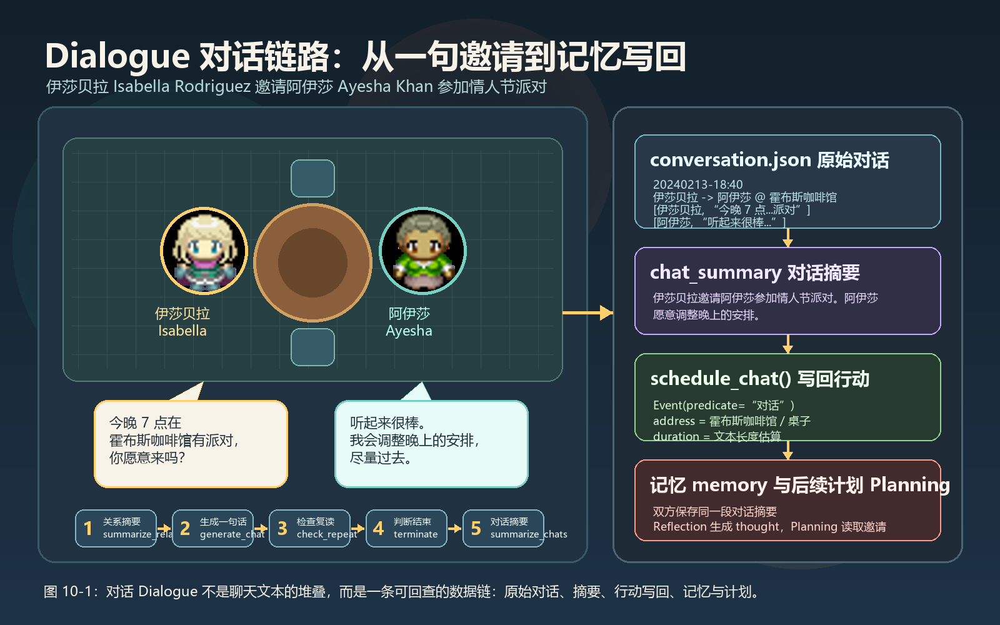
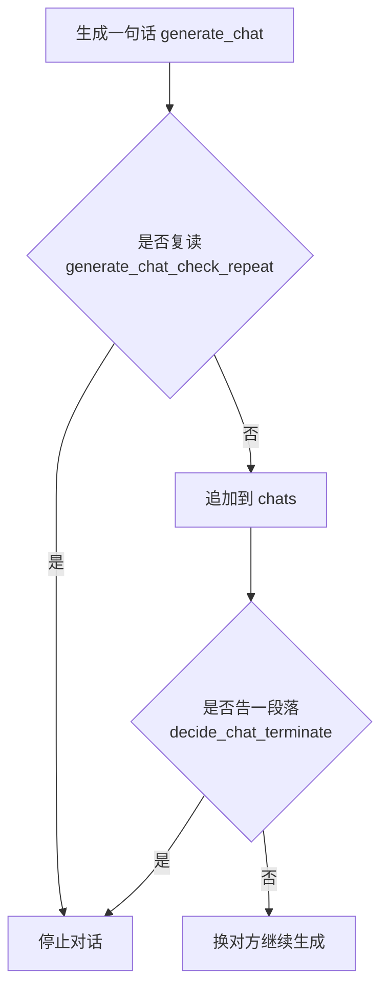

# 第 10 章 论文架构七：对话 Dialogue

反应 Reacting 决定角色是否开口；对话 Dialogue 处理开口以后发生什么。对话不是两段文本轮流生成，而是一条工程链路：关系摘要、逐句生成、复读检查、结束判断、对话摘要、记忆写回和日程占用。



## 10.1 对话 Dialogue 解决什么

一个可信对话系统至少要回答五个问题。

| 问题 | 没有这个环节会怎样 | 项目中的处理 |
| --- | --- | --- |
| 是否应该开口 | 角色一见面就聊天 | 第 9 章的聊天触发 chat trigger 判断 |
| 双方是什么关系 | 所有人说话像第一次见面 | `summarize_relation` 生成关系摘要 |
| 下一句说什么 | 只按当前场景临场编 | `generate_chat` 读取身份、记忆、场景和已有对话 |
| 什么时候结束 | 对话无限循环或突然断掉 | 复读检查和结束判断 |
| 聊完以后去哪 | 文本打印完就消失 | `conversation.json`、对话摘要、双方记忆和日程写回 |

第 10 章的核心不是“模型会说话”，而是“说过的话会改变小镇状态”。只有对话进入记忆 Memory、行动 Action 和日程 Schedule，它才是人工社会的一部分。

## 10.2 闭环案例：伊莎贝拉 Isabella Rodriguez 邀请阿伊莎 Ayesha Khan

情人节派对不是系统广播。伊莎贝拉 Isabella Rodriguez 需要在小镇里遇到别人，判断当前适合开口，然后把邀请说出来。阿伊莎 Ayesha Khan 听到以后，这段对话必须进入双方记忆，后续才可能影响她的计划。

本章用下面这段代表性对话贯穿源码链路。

```json
{
  "time": "20240213-18:40",
  "place": ["小镇", "霍布斯咖啡馆", "咖啡馆", "桌子"],
  "participants": ["伊莎贝拉", "阿伊莎"],
  "chats": [
    ["伊莎贝拉", "今晚 7 点在霍布斯咖啡馆有情人节派对，你愿意来吗？"],
    ["阿伊莎", "听起来很棒。我会调整晚上的安排，尽量过去。"]
  ],
  "chat_summary": "伊莎贝拉邀请阿伊莎参加情人节派对，阿伊莎表示愿意调整晚上的安排。"
}
```

这段 JSON 可以拆成四个工程对象。

| 对象 | 数据形状 | 作用 |
| --- | --- | --- |
| 原始对话 `chats` | `[(speaker, text), ...]` | 多轮生成和复读检查的上下文 |
| 对话日志 conversation | `time -> location -> chats` | 写入 `conversation.json`，方便回放和复盘 |
| 对话摘要 chat summary | 一句自然语言摘要 | 写入双方记忆和行动事件 |
| 对话行动 Action | `predicate="对话"` 的事件 event | 占用当前时间，并触发日程修订 |

后面的源码、prompt 和数据结构都围绕这条邀请链展开。

## 10.3 第 9 章交接：从开口裁决进入对话

第 9 章已经讲过 `_chat_with()` 如何判断是否开口。进入第 10 章时，可以把前置条件看成已经成立：双方日程已初始化，没有在睡觉，没有正在对话，60 分钟内没有重复聊天，`decide_chat` 返回 true。

真正的对话链从这里开始。

```python
self.logger.info("{} decides chat with {}".format(self.name, other.name))
start, chats = utils.get_timer().get_date(), []
relations = [
    self.completion("summarize_relation", self, other.name),
    other.completion("summarize_relation", other, self.name),
]

for i in range(self.chat_iter):
    text = self.completion(
        "generate_chat", self, other, relations[0], chats
    )
    ...
    text = other.completion(
        "generate_chat", other, self, relations[1], chats
    )
```

| 变量 | 中文含义 | 在案例中的含义 |
| --- | --- | --- |
| `start` | 对话开始时间 | `20240213-18:40` |
| `chats` | 当前对话记录 | 从空列表开始，逐句追加 |
| `relations[0]` | 伊莎贝拉 Isabella Rodriguez 视角的关系摘要 | 她如何理解阿伊莎 Ayesha Khan |
| `relations[1]` | 阿伊莎 Ayesha Khan 视角的关系摘要 | 她如何理解伊莎贝拉 Isabella Rodriguez |
| `chat_iter` | 最大对话轮数 | 防止对话无限生成 |

对话 Dialogue 因此不是单次 prompt，而是一条受控循环。每次生成一句话，系统都要决定这句话能不能留下，以及对话是否该结束。

## 10.4 关系摘要 summarize_relation：两个人的视角不同

关系摘要不是全局人物关系表，而是当前角色根据自己的记忆检索结果，对另一个人的一句话理解。伊莎贝拉 Isabella Rodriguez 可能把阿伊莎 Ayesha Khan 视为咖啡馆和社区活动里的熟人；阿伊莎 Ayesha Khan 可能把伊莎贝拉 Isabella Rodriguez 视为正在组织派对的人。

包装函数会围绕对方名字检索记忆。

```python
def prompt_summarize_relation(self, agent, other_name):
    nodes = agent.associate.retrieve_focus([other_name], 50)
    prompt = self.build_prompt(
        "summarize_relation",
        {
            "context": "\n".join(["{}. {}".format(idx, n.describe) for idx, n in enumerate(nodes)]),
            "agent": agent.name,
            "another": other_name,
        }
    )
```

提示词 prompt `generative_agents/data/prompts/summarize_relation.txt`：

```text
背景描述：
"""
${context}
"""

输出示例1：乔和汤姆是朋友
输出示例2：艾琳和约翰在玩游戏

参考上述背景描述和输出示例，用一句话总结 ${agent} 和 ${another} 之间的关系：
```

英文含义：

```text
Given the retrieved background, summarize the relationship between ${agent} and ${another} in one sentence.
```

输出结构 schema 和回调 callback：

```python
class summarize_relationResponse(BaseModel):
    res: str = Field(description="一句话描述两人之间的关系，以第三人称表述")

def _callback(response):
    return response.strip() or failsafe

failsafe = agent.name + " 正在看着 " + other_name
```

代表性输出可以是：

```json
{
  "isabella_view": "伊莎贝拉和阿伊莎在社区活动中相识，伊莎贝拉认为阿伊莎可能愿意参加咖啡馆派对。",
  "ayesha_view": "阿伊莎知道伊莎贝拉正在筹备情人节派对，并把她视为社区活动的组织者。"
}
```

这一步给后续发言提供语气和背景。没有关系摘要，模型只能按“两个陌生人在咖啡馆相遇”写；有了关系摘要，邀请就能自然落到派对和社区活动上。

## 10.5 生成一句话 generate_chat：逐句推进

每一轮对话只生成当前角色的一句话。项目没有把整段对话一次性交给模型写完，因为那样很难控制复读、终止和双方记忆视角。

```python
text = self.completion("generate_chat", self, other, relations[0], chats)
chats.append((self.name, text))

text = other.completion("generate_chat", other, self, relations[1], chats)
chats.append((other.name, text))
```

提示词 prompt `generative_agents/data/prompts/generate_chat.txt`：

```text
以下是对 ${agent} 的简要描述：
${base_desc}

以下是 ${agent} 的记忆：
${memory}

当前位置：${address}
当前时间：${current_time}

${previous_context}${current_context}
${agent} 开始和 ${another} 对话。以下是他们的对话记录：
<对话记录>
${conversation}
</对话记录>

<对话原则>
- ${agent} 不会重复<对话记录>中已有的内容
- 对话内容要符合智能体的性格和当前情境
- 语言自然流畅，符合日常交流习惯
- 长度控制在1-3句话内
- 直接输出 ${agent} 的对话内容，不要补充其他信息
</对话原则>

基于以上<对话记录>和<对话原则>，现在 ${agent} 会对 ${another} 说：
```

英文含义：

```text
Use the agent profile, retrieved memory, location, time, current situation, and existing conversation record to generate the next 1-3 natural sentences spoken by ${agent}. Do not repeat previous content.
```

关键变量如下。

| 变量 | 中文含义 | 在派对邀请案例中的作用 |
| --- | --- | --- |
| `${base_desc}` | 角色基础设定 | 伊莎贝拉 Isabella Rodriguez 的组织者身份、阿伊莎 Ayesha Khan 的生活背景 |
| `${memory}` | 检索出的相关记忆 | 派对准备、咖啡馆、与对方相关的记录 |
| `${address}` | 当前地点 | 霍布斯咖啡馆 |
| `${current_time}` | 当前时间 | 晚上派对临近时更适合邀请 |
| `${current_context}` | 当前场景 | 一方看到另一方正在做什么 |
| `${conversation}` | 已有对话记录 | 让下一句接住前文，不重复寒暄 |

代表性对话链如下。

```json
[
  ["伊莎贝拉", "今晚 7 点在霍布斯咖啡馆有情人节派对，你愿意来吗？"],
  ["阿伊莎", "听起来很棒。我会调整晚上的安排，尽量过去。"],
  ["伊莎贝拉", "太好了，我会在咖啡馆准备点心和音乐，见到你会很开心。"],
  ["阿伊莎", "那就这么说定了，我晚些时候过去看看。"]
]
```

这里的每一句都依赖已有对话记录。第一句负责发出邀请，第二句回应意愿，第三句补充派对信息，第四句形成轻量承诺。对话不是闲聊文本，而是派对信息从伊莎贝拉 Isabella Rodriguez 进入阿伊莎 Ayesha Khan 记忆的通道。

## 10.6 复读检查与结束判断

多轮对话必须有刹车。项目用了两个判断：复读检查防止重复同一句，结束判断防止话题已经结束还继续生成。

```python
if i > 0:
    end = self.completion(
        "generate_chat_check_repeat", self, chats, text
    )
    if end:
        break

    chats.append((self.name, text))
    end = self.completion(
        "decide_chat_terminate", self, other, chats
    )
    if end:
        break
```


```mermaid
flowchart TD
    A["生成一句话 generate_chat"] --> B{"是否复读<br/>generate_chat_check_repeat"}
    B -->|是| E["停止对话"]
    B -->|否| C["追加到 chats"]
    C --> D{"是否告一段落<br/>decide_chat_terminate"}
    D -->|是| E
    D -->|否| F["换对方继续生成"]
```

复读检查提示词 prompt `generative_agents/data/prompts/generate_chat_check_repeat.txt`：

```text
<对话记录>
${conversation}
</对话记录>

<新对话>
${content}
</新对话>

${agent} 在<新对话>中所说的内容，是否在<对话记录>中出现过？只用“是”或“否”回答：
```

结束判断提示词 prompt `generative_agents/data/prompts/decide_chat_terminate.txt`：

```text
<对话记录>
${conversation}
</对话记录>

<判断逻辑>
如果最后一句话是疑问句，表明对话没有结束。
如果最后一句话是在请求对方帮助，表明对话没有结束。
如果最后一句话是想听对方的看法，表明对话没有结束。
如果最后一句话是期待与对方继续讨论，表明对话没有结束。
</判断逻辑>

根据以上<对话记录>和<判断逻辑>分析，${agent} 和 ${another} 的对话是否已经告一段落。只用“是”或“否”回答：
```

两个判断的输出结构都很小。

| 判断 | 输出结构 schema | 回调 callback | 兜底值 failsafe |
| --- | --- | --- | --- |
| 复读检查 | `res: bool`，true 表示重复 | `true / yes / 是 / 1` 转成 true | `False` |
| 结束判断 | `res: bool`，true 表示结束 | `true / yes / 是 / 1` 转成 true | `False` |

这两个 failsafe 都是 `False`，表示模型判断失败时默认不提前终止。这个选择保守地保护对话完整性，但也要求 `chat_iter` 限制最大轮数。

## 10.7 对话写回：文本变成状态

对话结束后，系统先保存原始对话，再生成摘要，最后写回双方日程和记忆。

```python
key = utils.get_timer().get_date("%Y%m%d-%H:%M")
if key not in self.conversation.keys():
    self.conversation[key] = []
self.conversation[key].append({f"{self.name} -> {other.name} @ {'，'.join(self.get_event().address)}": chats})

chat_summary = self.completion("summarize_chats", chats)
duration = int(sum([len(c[1]) for c in chats]) / 240)
self.schedule_chat(chats, chat_summary, start, duration, other)
other.schedule_chat(chats, chat_summary, start, duration, self)
```

原始对话会进入 `conversation.json`。

```json
{
  "20240213-18:40": [
    {
      "伊莎贝拉 -> 阿伊莎 @ 小镇，霍布斯咖啡馆，咖啡馆，桌子": [
        ["伊莎贝拉", "今晚 7 点在霍布斯咖啡馆有情人节派对，你愿意来吗？"],
        ["阿伊莎", "听起来很棒。我会调整晚上的安排，尽量过去。"]
      ]
    }
  ]
}
```

摘要提示词 prompt `generative_agents/data/prompts/summarize_chats.txt`：

```text
对话：
"""
${conversation}
"""

用不超过100字的短句总结上述对话：
```

英文含义：

```text
Summarize the conversation in one short sentence of no more than 100 Chinese characters.
```

输出结构 schema 和兜底值 failsafe：

```python
class summarize_chatsResponse(BaseModel):
    res: str = Field(description="对话内容的简短摘要，一句话概括对话主题")

def _callback(response):
    return response.strip()

failsafe = "{} 和 {} 之间的普通对话".format(chats[0][0], chats[1][0])
```

`schedule_chat()` 把摘要变成双方当前行动。

```python
def schedule_chat(self, chats, chats_summary, start, duration, other, address=None):
    self.chats.extend(chats)
    event = memory.Event(
        self.name,
        "对话",
        other.name,
        describe=chats_summary,
        address=address or self.get_tile().get_address(),
        emoji=f"💬",
    )
    self.revise_schedule(event, start, duration)
```

写回后的行动事件可以这样读。

```json
{
  "event": {
    "subject": "阿伊莎",
    "predicate": "对话",
    "object": "伊莎贝拉",
    "describe": "伊莎贝拉邀请阿伊莎参加情人节派对，阿伊莎表示愿意调整晚上的安排。",
    "address": ["小镇", "霍布斯咖啡馆", "咖啡馆", "桌子"],
    "emoji": "💬"
  },
  "duration": 1
}
```

`self.chats.extend(chats)` 还会把原始对话暂存在角色状态中。第 7 章反思 Reflection 会读取 `self.chats`，生成“对计划的影响”和“对记忆的影响”两类想法 thought。对话 Dialogue 因此会继续影响未来计划，而不是停在当前这一轮文本。

## 10.8 对话如何影响后续规划 Planning

对话 Dialogue 和规划 Planning 的关系是双向的。计划影响角色是否愿意聊天，对话也会改变后续计划。

| 方向 | 数据来源 | 影响 |
| --- | --- | --- |
| 规划 Planning -> 对话 Dialogue | 当前行动、路径、时间、日程压力 | 决定是否适合开口、能聊多久 |
| 对话 Dialogue -> 行动 Action | `schedule_chat()` 写入对话事件 | 当前时间被对话占用 |
| 对话 Dialogue -> 记忆 Memory | `summarize_chats` 和 `self.chats` | 双方之后可以检索到这次邀请 |
| 记忆 Memory -> 反思 Reflection | 第 7 章的对话后反思 | 生成关于计划和关系的想法 thought |
| 反思 Reflection -> 规划 Planning | 次日或后续日程生成 | 角色可能把派对、约定或关系变化放进计划 |

伊莎贝拉 Isabella Rodriguez 的邀请要成为社会事件，必须走完这条链。她说出邀请只是第一步；阿伊莎 Ayesha Khan 的记忆能在后续被检索出来，才说明派对信息真正进入了小镇。

## 10.9 常见失败与检查位置

对话 Dialogue 的失败不一定表现为文本难看。很多时候，生成内容看起来正常，但工程链路已经断了。

| 表现 | 常见原因 | 检查位置 | 修正方向 |
| --- | --- | --- | --- |
| 角色频繁重复聊天 | 一小时限制或聊天历史检索失效 | `retrieve_chats()`、`delta < 60` | 检查第 9 章聊天触发条件 |
| 所有人语气相同 | 关系摘要或角色记忆太弱 | `summarize_relation`、`generate_chat` | 检查检索记忆和 `base_desc` |
| 多轮中复读 | 复读检查没有命中 | `generate_chat_check_repeat.txt` | 检查新句子是否被正确送入 `${content}` |
| 对话停不下来 | 结束判断过宽或 `chat_iter` 太高 | `decide_chat_terminate.txt`、`chat_iter` | 检查最后一句是否仍是问题或请求 |
| 对话不影响行为 | 对话没有写回行动和日程 | `schedule_chat()`、`revise_schedule()` | 检查 `predicate="对话"` 的事件是否生成 |
| 信息无法传播 | 摘要没有进入后续检索 | `summarize_chats`、关联记忆 Associate | 检查 chat 节点和摘要文本 |

调试顺序可以按本章链路走：是否开口已经成立，关系摘要是否有差异，逐句生成是否读取记忆，退出判断是否有效，摘要和行动是否写回。

## 10.10 本章小结

对话 Dialogue 把一次相遇变成可持续的社会关系。它不是“让两个模型互相聊天”，而是从关系摘要、逐句生成、复读检查、结束判断、摘要写回到日程占用一路闭合。

判断一个对话系统是否可信，可以看四件事：它是否有开口边界，是否带着关系和记忆说话，是否能自然结束，是否把对话写回双方记忆和日程。只有这四件事成立，情人节派对这类社会事件才有传播路径。

下一章进入论文架构的整体串联。记忆 Memory、反思 Reflection、规划 Planning、反应 Reacting 和对话 Dialogue 会合在一起，形成虚拟小镇的行为闭环。

## 参考资料

- Joon Sung Park, Joseph C. O'Brien, Carrie J. Cai, Meredith Ringel Morris, Percy Liang, Michael S. Bernstein. *Generative Agents: Interactive Simulacra of Human Behavior*. arXiv: https://arxiv.org/abs/2304.03442
- ar5iv full text: https://ar5iv.labs.arxiv.org/html/2304.03442
- Generative Agents local source: `generative_agents/modules/agent.py`
- Generative Agents local source: `generative_agents/modules/prompt/scratch.py`
- Generative Agents local prompts: `generative_agents/data/prompts/summarize_relation.txt`, `generative_agents/data/prompts/generate_chat.txt`, `generative_agents/data/prompts/generate_chat_check_repeat.txt`, `generative_agents/data/prompts/decide_chat_terminate.txt`, `generative_agents/data/prompts/summarize_chats.txt`
