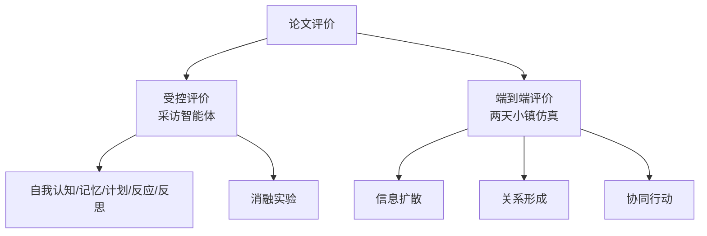
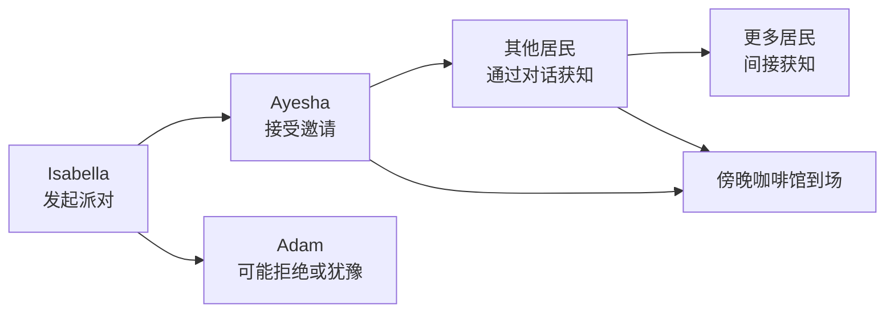

# 第 11 章 论文的评价方法

## 11.1 评价问题

Generative Agents 论文的核心架构已经形成闭环：

- Memory Stream 保存完整经验。
- Retrieval 从记忆中取回相关内容。
- Reflection 从经验中生成高层认知。
- Planning 把认知和环境转成计划。
- Reacting 与 Dialogue 让角色在现场中行动和交互。

评价要回答的问题更难：

```text
我们怎么知道这些智能体真的更可信？
```

很多开源项目会展示一个好看的 demo，然后说“看，智能体很真实”。Generative Agents 论文没有停在演示层面，而是设计了两类评价：

1. Controlled Evaluation：受控评价，单独考察智能体能力。
2. End-to-End Evaluation：端到端评价，观察 25 个智能体在小镇中连续互动两天后的社会行为。

这两类评价对应两个问题。

### Controlled Evaluation 问：

```text
单个智能体是否能可信地记住、计划、反应和反思？
```

### End-to-End Evaluation 问：

```text
一群智能体放在一起，是否会产生可信的社会现象？
```

这两个问题必须分开：单个智能体答得像人，不代表多个智能体能形成社会；多个智能体看起来热闹，也不代表每个个体能力扎实。后续复现实验也要保留这条分界线。



*图 11-1：Generative Agents 的两层评价结构。论文既评价单个智能体能力，也评价多个智能体在小镇中形成的社会现象。*

## 11.2 演示之外的评价

生成式智能体很容易被演示效果迷惑。一个可视化小镇、几个角色走来走去、偶尔对话，足以让观众觉得“很像真的”。这种直觉不可靠，因为演示会掩盖关键问题。

例如：

- 角色可能只是随机移动。
- 对话可能看似自然，但没有进入长期记忆。
- 角色可能知道信息，但其实是幻觉。
- 派对可能有人参加，但不是因为听到邀请。
- 关系可能看似形成，但只是 prompt 里说得亲密。
- 计划可能合理，但与过去经历无关。

评价 generative agents 时，核心问题不是“看起来像不像”，而是：

```text
行为背后有没有可追踪的记忆、计划、关系和因果链？
```

## 11.3 论文的两阶段评价

论文把评价分成两阶段。

### 第一阶段是受控评价。

研究者通过自然语言“采访”智能体，让它回答关于自身、记忆、计划、反应和反思的问题。然后让人类评估者比较不同架构条件下的回答，判断哪个更可信。

### 第二阶段是端到端评价。

研究者让 25 个智能体在 Smallville 中连续互动两个游戏日，观察是否出现信息扩散、关系形成和群体协同行动。

两类评价的价值不同：

| 评价方式 | 优势 | 局限 |
| --- | --- | --- |
| 受控评价 | 同一个问题可以交给不同架构版本回答，便于消融对比。 | 访谈回答不等于真实行动。 |
| 端到端评价 | 角色在开放环境中连续运行，能观察复杂社会行为。 | 变量复杂，单个现象不容易严格归因。 |

论文同时使用二者：先在窄问题上比较模块贡献，再在小镇运行中观察社会现象。

## 11.4 Controlled Evaluation：采访智能体

论文利用智能体的自然语言接口：直接采访它。研究者不是只看后台日志，而是向智能体提问：

```text
你是谁？
你记得某个人吗？
你明天 10 点会做什么？
早餐烧焦了你会怎么办？
你最近最想和谁相处，为什么？
```

这些问题分别对应架构中的核心能力。回答可信，说明智能体能从 memory stream 取回信息，并把信息综合成合理回答；回答失败，失败点也能回到记忆、计划、反思或反应模块中分析。

传统软件模块可以写单元测试。

生成式智能体的行为空间很大，无法简单断言“输出必须等于某个字符串”。但可以通过访谈和人类排序来评价“可信程度”。

传统机器学习里的 accuracy、F1、AUC 可以评价固定分类任务，却很难评价一个角色是否记得过去、是否保持身份、是否会在新情境下合理调整计划。Generative Agents 的评价重点不是“答案是否命中标签”，而是“回答和行动是否能被它自己的记忆、计划、关系和环境证据支撑”。

## 11.5 五类访谈能力

论文的访谈问题分为五类，每类五个问题。

总共 25 个问题。

### 11.5.1 Self-Knowledge

Self-knowledge 测试智能体是否保持对自身设定的理解。

典型问题包括：

```text
请介绍你自己。
你的职业是什么？
你的兴趣是什么？
你和谁住在一起？
概括描述你平常工作日的日程。
```

这类问题看似简单，但它测的是角色一致性。

如果克劳斯是社会学学生，却说自己是医生，说明 persona 没有稳定进入系统。

如果角色不能描述自己的日常作息，说明 planning 与 persona 的连接薄弱。

Self-knowledge 是可信行为的底座。一个连自己是谁都不稳定的角色，不可能在长期仿真中可信。

### 11.5.2 Memory

Memory 测试智能体能否记住过去经历。

论文中的问题包括：

```text
某某是谁？
谁正在竞选镇长？
是否有情人节派对？
```

这类问题考察的是 retrieval。

智能体需要从 memory stream 中找出相关事件或对话。

关键不是它能不能编出一个顺口回答，而是回答是否能追溯到真实记忆。

例如，一个角色说“我知道 Sam 在考虑竞选镇长”，必须能在它的记忆中找到对应信息来源。

否则就是幻觉。

### 11.5.3 Plans

Plans 测试智能体能否记住和维持计划。

典型问题包括：

```text
今天早上 6 点你会做什么？
今天下午 6 点你会做什么？
今天中午 1 点你刚刚做完什么？
今天晚上 10 点你会做什么？
```

这类问题考察日程系统。

如果角色已经有 schedule，它应该能回答具体时间段的计划。

如果回答与日程冲突，说明计划没有稳定进入可访问上下文。

这类评价对本项目尤其重要，因为 Generative Agents 的 `Schedule`、`make_schedule()`、`schedule_decompose()` 都是可观察的工程模块。

### 11.5.4 Reactions

Reactions 测试智能体遇到意外时是否反应合理。

论文中的示例问题包括：

```text
你的早餐烧焦了，你会怎么办？
浴室被占用了，你会怎么办？
你需要做晚饭，但冰箱是空的，你会怎么办？
你看到朋友从街上走过，会怎么做或说什么？
你看到街上有火，会怎么办？
```

这类问题考察的是常识、情境理解和计划调整能力。

它不一定要求智能体引用某条具体记忆，但要求行为符合人类常识和角色状态。

例如，早餐烧焦时应该关火，而不是继续吃饭。

浴室被占用时应该等待或找替代方案，而不是直接进入。

### 11.5.5 Reflections

Reflections 测试智能体是否能基于过去经历形成高层认知。

典型问题包括：

```text
你现在最受什么启发，为什么？
根据你对某人的了解，你觉得他会喜欢什么书？
如果给某人买生日礼物，你会买什么？
你会如何称赞某人？
如果你能和最近聊过的人共处，你会选谁，为什么？
```

这类问题最能体现 Reflection 的价值。

它要求智能体不只是记住事实，还要综合多条经历，形成对别人兴趣、关系和偏好的判断。

没有 Reflection 的智能体往往会说“我不确定”。有 Reflection 的智能体更可能结合过去互动给出具体判断。

| 访谈能力 | 典型问题 | 对应架构能力 | 如果失败会暴露什么 |
| --- | --- | --- | --- |
| 自我认知 | 你是谁？你今天通常会做什么？ | persona、scratch、currently | 角色身份不稳定，回答像临时编造。 |
| 记忆 | 刚才发生了什么？谁告诉过你这件事？ | memory stream、retrieval | 记不住经历，或把不存在的事件说成事实。 |
| 计划 | 你接下来准备做什么？为什么？ | planning、schedule | 行动没有节奏，计划和身份不匹配。 |
| 反应 | 如果某人邀请你参加活动，你会怎么做？ | reacting、dialogue | 对现场事件反应过度或完全无视。 |
| 反思 | 你怎么看某个人或某件事？ | reflection、thought memory | 只能复述事件，不能形成高层理解。 |

*表 11-1：五类访谈问题与对应架构能力。采访智能体不是为了听它“说得好不好”，而是看回答能否追溯到真实架构状态。*

### 11.5.6 访谈问题如何进入 prompt

评价不是只写几道问题。访谈回答仍然由 prompt 和检索链路驱动。

需要先分清三层文本：

| 层次 | 来源 | 作用 |
| --- | --- | --- |
| 论文访谈问题 | 论文 Appendix B 的 25 个问题 | 定义要评价的能力：自我认知、记忆、计划、反应、反思。 |
| 原始源码 prompt | Stanford 原始项目的 `summarize_ideas_v1.txt` | 把检索到的记忆片段压缩成与访谈问题相关的摘要。 |
| 当前项目状态 | 本项目的 `generative_agents/data/prompts/*.txt` | 有运行时 prompt，但没有把论文访谈评价单独做成内置评价脚本。 |

*表 11-2：访谈评价的三层文本。论文给问题，原始源码给访谈上下文压缩 prompt，当前项目需要在复现实验中补齐评价工程。*

Stanford 原始项目里，访谈模式的调用链在 `persona/cognitive_modules/converse.py` 中。用户输入一条访谈问题后，系统先用 `new_retrieve(persona, [line], 50)` 从记忆中取回相关节点，再调用 `generate_summarize_ideas(persona, retrieved, line)`，最后把摘要交给下一轮回答生成。


*图 11-2：原始 Stanford 项目的访谈回答链路。评价不是直接让模型凭空回答，而是先从角色记忆里取证，再围绕访谈问题整理相关信息。*

原始 prompt 文件是：

```text
persona/prompt_template/v3_ChatGPT/summarize_ideas_v1.txt
```

模板内容如下：

```text
summarize_ideas_v1.txt

Variables:
!<INPUT 0>! -- Statements
!<INPUT 1>! -- agent name
!<INPUT 2>! -- interviewer question

<commentblockmarker>###</commentblockmarker>
Statements:
!<INPUT 0>!

An interviewer said to !<INPUT 1>!:
"!<INPUT 2>!"

Summarize the Statements that are most relevant to the interviewer's line:
"
```

中文意思是：

```text
陈述：
!<INPUT 0>!

一名访谈者对 !<INPUT 1>! 说：
"!<INPUT 2>!"

请概括这些陈述中与访谈者这句话最相关的内容：
"
```

三个变量对应：

| 变量 | 中文意思 | 来自哪里 | 对回答的影响 |
| --- | --- | --- | --- |
| `!<INPUT 0>!` | 与问题相关的记忆陈述 | `new_retrieve()` 取回的 memory nodes | 决定回答能引用哪些经历。 |
| `!<INPUT 1>!` | 被采访的角色名 | `persona.scratch.name` | 让问题绑定到具体角色。 |
| `!<INPUT 2>!` | 访谈问题 | 研究者或用户输入的自然语言问题 | 决定本轮要从记忆里筛什么信息。 |

这个 prompt 的输出不是 JSON，也不是分类标签，而是一段短文本摘要。原始源码里的 `run_gpt_prompt_summarize_ideas()` 对它的要求是：

```text
The output should be a string that responds to the question.
```

原始项目的评价回答链路更接近“带证据的角色采访”，不是传统机器学习里的固定标签预测。

本项目当前没有把这条访谈评价链路完整搬成 `evaluation_prompt.txt` 或 `evaluate.py`。这不是说第 11 章没有 prompt，而是说：运行时行为 prompt 已经在前几章出现，论文评价 prompt 需要在复现实验阶段显式补成一个中文评价脚本。

## 11.6 消融条件：到底哪个模块有用

论文评价最重要的部分之一是消融实验。消融实验只问一个问题：

```text
如果我们去掉某个模块，行为可信度是否下降？
```

论文比较了完整架构与三个削弱版本，再加一个人类 crowdworker 编写的基线。

三个削弱版本是：

1. 无 Reflection：有 observation 和 planning，但不能使用 reflection memory。
2. 无 Reflection、无 Planning：只能访问 observation，不能访问计划和反思。
3. 无 Observation、无 Reflection、无 Planning：不能访问 memory stream 中的 observations、plans、reflections。

第三个条件相当于更接近早期“只用 LLM persona 临场回答”的方式。

论文还加入了 human crowdworker-authored condition。这个人类基线不是专家上限，而是基本行为能力参照。研究者不仅比较几个架构版本，还要确认完整架构是否达到基本可信水平。

## 11.7 消融设计的注意点

论文在消融设计上做了一个重要选择：

不同消融条件回答问题时，访问的是同一批仿真中积累的记忆。研究者没有为每个架构重新跑一次两天仿真。

如果每个架构重新仿真，小镇状态会分叉。不同角色可能遇到不同人、形成不同关系、听到不同信息，同一个问题下的回答就很难比较。因此，论文让所有条件在访谈时面对同一个 agent 历史，只是限制它能访问哪些类型的记忆。

这让比较更可控。但它也意味着结果是保守估计。

因为如果真的让没有 memory、planning、reflection 的架构从头运行两天，它可能根本不会走出同样丰富的经历。

复现消融实验时，需要先决定：

- 是复用同一条仿真轨迹，只限制访问记忆？
- 还是每个消融版本重新运行？

前者可比性强，后者更接近真实系统差异。

## 11.8 人类评估者如何比较

论文招募了 100 名人类评估者。每位评估者会看到同一个 agent 在不同条件下对问题的回答，并按可信度从高到低排序。他们不是凭空评估。论文让评估者观看某个 agent 的生活回放，并能够访问该 agent memory stream 中的信息。

评估者必须知道 agent 经历过什么，否则无法判断回答是否可信。

例如，一个角色说自己知道情人节派对，这句话本身看起来合理。但只有查看记忆，才能知道它是否真的听人说过派对。

论文把排序数据转为 TrueSkill 评分，再用统计检验分析条件差异。具体包括：

- TrueSkill：把排序结果转为可比较评分。
- Kruskal-Wallis test：检验总体排序差异。
- Dunn post-hoc test：做条件间两两比较。
- Holm-Bonferroni：校正多重比较的 p 值。
- 定性开放编码：分析不同条件回答的差异主题。

统计方法不需要死记，评价逻辑要抓住：

```text
不是研究者自己说完整架构更好，而是让外部评估者在相同问题和相同背景下比较多个条件。
```

## 11.9 受控评价的主要结论

论文结论很明确：完整架构最可信。

随着模块被移除，表现逐步下降。

大致排序是：

```text
完整架构
  > 无 Reflection
  > 无 Reflection + 无 Planning
  > 人类 crowdworker 基线
  > 无 Observation + 无 Reflection + 无 Planning
```

这里最值得注意的不是“完整架构赢了”，而是每个模块的贡献方向。

 - Memory 让智能体能回答与过去经历有关的问题。
 - Planning 让智能体能回答自己未来和当前日程。
 - Reflection 让智能体能基于经历做综合判断。

如果只用 LLM persona，不接入这些结构，回答可能语言流畅，但缺少与真实经历的连接。后续实验要沿用这个判断标准：

```text
语言流畅不是可信行为。
与经历、计划和关系一致的行动才是可信行为。
```

## 11.10 论文承认的记忆问题

论文没有把结果写成完美无缺。它明确指出，完整架构虽然能记住许多过去经历，但仍然会出错。

### 第一类错误是检索失败。

角色明明听过某个信息，但回答时没有检索到相关记忆，于是说自己不知道。

论文中提到，Rajiv 听过 Sam 的候选人信息，但回答地方选举问题时却表现得不清楚。

### 第二类错误是检索到不完整记忆。

角色可能只想起了一部分信息，于是回答含糊。

例如，Tom 被问到 Isabella 的情人节派对时，回答不确定，尽管记忆中可能有相关片段。

### 第三类错误是记忆修饰。

智能体可能在真实记忆基础上添加额外细节。这很危险，因为听起来更自然，但不一定真实。

论文中给了一个典型例子：角色把同名人物与历史上的 Adam Smith 混淆，产生了错误身份联想。

memory stream 不是万能的。保存记忆只是第一步，能否正确检索、正确引用、不过度补全，才是关键。

## 11.11 Reflection 的实验证据

论文特别指出，Reflection 对“综合经验”很关键。没有 Reflection 的角色，面对需要综合判断的问题时可能回答“不知道”。有 Reflection 的角色，则能基于过去互动推断对方兴趣。

例如，Maria 需要判断 Wolfgang 可能喜欢什么生日礼物。如果没有 Reflection，她可能不知道 Wolfgang 喜欢什么。加入 Reflection 后，她能根据过去形成的高层认知，推断他可能喜欢与数学音乐创作相关的礼物。

这个例子说明：

```text
Reflection 的价值不是让回答更长，而是让回答能跨越多条经历，形成对人的稳定理解。
```

在 Generative Agents 中，类似实验可以问：

```text
克劳斯最近更想和谁交流，为什么？
玛丽亚觉得克劳斯是什么样的人？
伊莎贝拉认为谁可能帮助她组织派对？
汤姆如何看待山姆竞选？
```

这些问题不是测事实记忆，而是测 thought 是否真正参与回答。

## 11.12 End-to-End Evaluation：两天小镇仿真

受控评价之后，论文做了端到端评价。

研究者让 25 个智能体在 Smallville 中连续互动两个完整游戏日。

他们关注的不是单个问答，而是社会层面的涌现行为。

论文重点观察三类结果：

1. 信息扩散。
2. 关系形成。
3. 群体协同行动。

这三类结果对应 Smallville 的经典社会现象。

 - 信息扩散看派对和竞选信息是否传播。
 - 关系形成看居民是否通过互动认识彼此。
 - 群体协同行动看被邀请者是否能在正确时间地点参加活动。

Generative Agents 不只是让一个 agent 表演，而是让多个 agent 在共享环境中产生社会行为。

## 11.13 信息扩散的测量

论文选择了两条信息：

- Sam 竞选镇长。
- Isabella 在 Hobbs Cafe 举办情人节派对。

仿真开始时，这两条信息只被各自源头角色知道：

- Sam 知道自己的竞选意向。
- Isabella 知道自己要办派对。

两天结束后，研究者采访 25 个智能体：

```text
你知道有情人节派对吗？
你知道谁在竞选镇长吗？
```

如果智能体回答知道，就标为 yes；如果不知道，就标为 no。

论文不只看回答，还会检查记忆流，确认回答 yes 的角色确实有信息来源。否则，agent 可能只是幻觉说“我知道”，并没有通过社会传播获得信息。

论文结果是：

- Sam 的竞选信息从 1 个智能体传播到 8 个智能体，即 4% 到 32%。
- Isabella 的派对信息从 1 个智能体传播到 13 个智能体，即 4% 到 52%。
- 对这两类信息，声称知道的智能体没有被发现是幻觉得知。

这说明信息确实通过小镇互动扩散了。



*图 11-3：情人节派对邀请扩散路径。端到端评价关心的是消息如何穿过多人记忆和对话，最后是否变成可观察行动。*

## 11.14 关系形成的测量

关系形成不能只看“谁和谁聊过天”。论文采用了访谈方法。

研究者问每个 agent：

```text
你知道某某吗？
```

然后在仿真前和仿真后分别测量。如果两个 agent 彼此都表示知道对方，就认为他们之间形成了关系边。这样可以构建一个无向关系图：

```text
节点：25 个智能体
边：双方都知道彼此
```

论文用 network density 衡量关系网络密度变化。结果是，网络密度从 0.167 增加到 0.74。这说明两天仿真后，居民之间的互相认识显著增加。但论文也指出，在 453 个关于是否知道其他人的回答中，有 6 个被发现是幻觉，占 1.3%。这个数字说明关系形成确实存在，但并非零错误。

一个严谨的系统评估不能只报成功扩散和关系增长，也要报幻觉率。

## 11.15 群体协同行动的测量

群体协同行动的评价围绕情人节派对。派对是很好的测试，因为它需要多个环节同时成功：

1. Isabella 有办派对的意图。
2. 她需要邀请别人。
3. 被邀请者需要记住时间和地点。
4. 被邀请者需要决定是否参加。
5. 被邀请者需要把计划调整到正确时间。
6. 被邀请者需要在正确地点出现。

只要其中某个环节断掉，最后就不会到场。论文结果是：

- 有 12 个 agent 被邀请。
- 情人节当天，5 个 agent 到达 Hobbs Cafe 参加派对。
- 另外 7 个未到场者中，3 个表示有计划冲突。
- 剩下 4 个表示有兴趣，但当天没有形成到场计划。

这个结果很有价值，因为它不是 100% 成功。如果所有人都被邀请后必然到场，反而像脚本。有的人参加，有的人因为冲突缺席，有的人有兴趣但没有计划成功，这更接近开放仿真系统。

这个结果也暴露了系统限制：有兴趣不等于能自动形成计划。

## 11.16 端到端评价的三个社会现象

把信息扩散、关系形成、协同行动放在一起看，论文要证明的是：

```text
多个局部可信行为可以累积成群体社会现象。
```

信息扩散来自局部对话。关系形成来自反复相遇、对话和记忆。协同行动来自记忆、计划、时间、地点和日程调整。

这些都不是一个中心控制器直接编排出来的。

Generative Agents 的核心价值不在手写社会规则，而在让每个 agent 根据自己的记忆和计划行动，再观察局部互动能否累积成宏观结果。复现派对和竞选时，不应只检查最终人数，还要检查路径：

```text
谁告诉了谁？
谁记住了？
谁改变了计划？
谁到达了地点？
谁声称知道但没有证据？
```

路径比结果更重要。

## 11.17 论文承认的端到端失败边界

论文第 7.2 节专门讨论了边界和错误。论文总结了三类常见问题。

### 第一类是记忆和空间选择问题。

随着 agent 学到的地点越来越多，系统不仅要检索相关记忆，还要选择正确地点执行动作。地点变多后，角色可能选择不典型地点。

论文举了午饭地点的例子：一些角色原本常去咖啡馆，但后来知道了酒吧，可能把午饭地点选到酒吧。这不一定完全不可能，但在小镇设定中显得不典型。

### 第二类是物理规范误判。

有些环境规范很难只靠自然语言传达。

例如，某个宿舍浴室虽然叫 dorm bathroom，但设定上只能容纳一个人。有些 agent 可能根据常识认为宿舍浴室可以多人同时使用，从而做出不合理行为。

再例如，商店下午 5 点关门，但 agent 可能仍然在关门后进入商店。

### 第三类是 instruction tuning 带来的过度礼貌和过度合作。

语言模型经过指令调优后，往往倾向于礼貌、配合、积极回应。这会让角色对话显得过于正式，也可能让角色不太会拒绝别人。

论文提到 Isabella 收到许多与自己兴趣不一致的派对建议，但她很少拒绝。这会使角色兴趣逐渐被别人带偏。

这些失败揭示了可信代理的另一条边界：不仅要会合作，也要会拒绝。不仅要会说话，也要遵守空间、时间和社会规范。

## 11.18 失败不是坏事，而是评价资产

失败案例是理解系统边界的入口。严肃的开源项目介绍不能只展示成功路径，还要列出可复查的失败类型：

- 检索会失败。
- 记忆会被修饰。
- 角色会过度礼貌。
- 地点选择会不合理。
- 计划不会总是兑现。
- 长期运行成本很高。
- 小模型可能更容易格式失控。

这些问题不是否定项目，而是给出使用和改进项目的边界。

Generative Agents 的价值也不在于它“完美复刻人类社会”，而在于它把一个可运行、可观察、可修改的生成式智能体社会框架带到中文环境中。

## 11.19 从论文评价到 Generative Agents 评价

论文评价方法可以直接转化为本项目的实验设计。

对 Generative Agents，可以建立两类评价。

第一类是中文 controlled evaluation。

例如对克劳斯提问：

```text
请介绍你自己。
你正在写什么论文？
你今天下午 6 点打算做什么？
你知道伊莎贝拉的情人节派对吗？
你最近更想和谁交流，为什么？
```

然后检查回答是否与 `agent.json`、memory stream、schedule、conversation 记录一致。

第二类是中文 end-to-end evaluation。

例如运行两天仿真后，统计：

- 有多少人知道派对。
- 有多少人知道山姆竞选。
- 谁和谁形成了双向关系。
- 被邀请者中有多少人到场。
- 哪些回答有记忆证据。
- 哪些回答是幻觉。

这些材料会成为第四部分复现实验的基础。

| 论文评价关注点 | Generative Agents 可观察证据 | 可记录指标 |
| --- | --- | --- |
| 自我认知 | `agent.json`、`currently`、访谈回答 | 身份一致性、当前状态正确率 |
| 记忆 | `associate.json`、conversation、simulation.md | 关键事件召回、来源是否正确 |
| 计划 | `schedule`、action、movement.json | 计划完成率、重规划合理性 |
| 反应 | `_reaction()` 结果、聊天/等待记录 | 反应触发率、误反应率 |
| 反思 | thought 记忆、reflect 输出 | 反思是否有证据、是否影响后续行为 |
| 社会传播 | 多人对话链、到场情况 | 扩散深度、到场人数、传播断点 |

*表 11-3：论文评价指标到 Generative Agents 评价指标的映射。本书后续实验要从“看起来像”推进到“有证据可复查”。*

## 11.20 Generative Agents 中可以观察哪些证据

本项目有一个教学优势：很多中间产物可以直接检查。

读者可以观察：

- `simulation.md`：压缩后的仿真叙事。
- `movement.json`：每一步角色位置、动作、表情。
- conversation 记录：角色之间的对话。
- checkpoint：角色状态、记忆、日程。
- 日志：LLM 调用、反思触发、感知数量等。

这些文件可以支撑论文式评价。

判断某个角色是否“知道派对”，不能只看它回答“知道”。还要查：

```text
它是否与伊莎贝拉或其他知情者对话？
对话摘要是否进入记忆？
该记忆是否在回答时被检索？
它是否据此改变计划？
```

如果链路完整，才算真正传播成功。

## 11.21 本书后续实验应遵守的原则

基于论文评价方法，后续实验要遵守五个原则。

### 第一，结果要有证据。

不能只说“看起来传播了”。要给出对话路径、记忆节点和到场记录。

### 第二，区分知道、记住、计划和行动。

一个角色知道派对，不代表它会参加。一个角色想参加，不代表它会把计划改对。

### 第三，记录失败。

如果角色忘记派对、错过时间、去了错误地点，这些都要写出来。

### 第四，做对照。

尽量设计无 reflection、低检索权重、本地小模型等对照组。

### 第五，避免把幻觉当涌现。

只要角色声称知道某事，就要回查 memory stream。

## 11.22 评价“可信”时要避免的误区

评价 believable behavior 很容易走偏。

### 第一个误区是把“像人说话”当成“像人行动”。

语言模型很擅长说出自然语言，但可信代理要求行动、记忆和计划一致。

### 第二个误区是把“成功完成任务”当成“可信”。

如果所有被邀请者都准时到场，这可能是任务成功，但未必可信。真实社会里会有人忘记、拒绝、冲突、迟到。

### 第三个误区是只看宏观统计。

派对信息传播到 13 个人只是结果；传播路径才说明机制是否成立。

### 第四个误区是忽略负样本。

不知道的人、没到场的人、拒绝的人、回答错误的人，都提供系统边界信息。

### 第五个误区是用一次运行下结论。

生成式系统随机性强，一次仿真只能作为案例。更严谨的评价需要多次运行、不同种子、不同模型和不同参数。

## 11.23 与 2023-2026 前沿评价的连接

论文的评价方法在 2023 年很有启发性。到了 2026 年，评价还需要覆盖更多工程维度。

后来的 agent 研究越来越强调：

- 可复现实验。
- 标准化 benchmark。
- 真实任务成功率。
- 成本与延迟。
- 多轮长期一致性。
- 工具调用正确性。
- 记忆污染与鲁棒性。
- 可审计日志。

第五部分会把 Generative Agents 的评价方法与 AgentBench、WebArena、GAIA、SWE-bench、AI Agents That Matter 等后续研究连接起来。

但这不意味着要否定原论文。

相反，原论文提供了一个非常好的起点：先把 believable behavior 拆成可观察能力，再把小镇社会行为拆成可测现象。

后续前沿评价是在这个基础上继续严谨化。

## 11.24 第一部分总结：论文到底贡献了什么

第一部分可以收束为四个结论。它不是“用 ChatGPT 做 NPC”。它提出的是一套让 LLM 代理长期运行的认知架构：

```text
Memory Stream
  -> Retrieval
  -> Reflection
  -> Planning
  -> Reaction
  -> Dialogue
  -> New Memory
```

它展示了一个可运行的小镇：

- 25 个智能体。
- The Sims 式沙盒环境。
- 用户可以观察和干预。
- 角色有日程、记忆、关系和对话。

它展示了三个典型社会现象：

- 信息扩散。
- 关系形成。
- 群体协同行动。

它也诚实地展示了失败边界：

- 检索失败。
- 记忆修饰。
- 空间规范误判。
- 语言过度正式。
- 过度合作。
- 成本高。
- 长期鲁棒性未知。

这篇论文是 Generative Agents 的思想源头，也是后面源码深读、复现实验和前沿升级的根。

## 11.25 评价 prompt 的工程边界

第 11 章有 prompt，只是位置不同。前几章的 prompt 是运行时 prompt，直接驱动角色做计划、反应、对话和反思；评价 prompt 更像工具，把角色经历转换成可采访、可比较、可审查的回答。

因此，评价章要区分三类文本：

| 文本类型 | 来源 | 用途 | 本项目现状 |
| --- | --- | --- | --- |
| 运行时 prompt | `generative_agents/data/prompts/*.txt` | 驱动角色生成计划、反应、对话和反思。 | 已经存在。 |
| 论文访谈问题 | 论文 Appendix B | 采访智能体，检查五类能力。 | 本章已按五类能力整理，后续实验要中文化。 |
| 访谈上下文 prompt | 原始 Stanford 项目的 `summarize_ideas_v1.txt` | 根据访谈问题，从记忆片段中整理相关信息。 | 当前项目未内置，需要复现实验时补齐。 |

复现实验应新建中文评价脚本和评价模板，而不是只让模型直接回答问题。合理的工程形态是：

```text
评价问题
  -> 检索该角色的 memory / schedule / conversation
  -> 用评价 prompt 压缩证据
  -> 生成角色回答
  -> 人类或 LLM-as-judge 按证据链评分
```

传统机器学习指标不够，单纯 demo 也不够；Generative Agents 需要的是可采访、可回查、可消融、可复现的评价链路。

## 11.26 本章小结

评价方法决定了这篇论文不是只靠 demo 说服读者。可信行为要能被采访、消融、回放和端到端现象共同验证。

| 本章内容 | 核心结论 |
| --- | --- |
| 两阶段评价 | 论文同时使用 controlled evaluation 和 end-to-end evaluation。 |
| 受控访谈 | 自我认知、记忆、计划、反应和反思五类能力，可以通过自然语言采访检查。 |
| 消融实验 | 去掉 memory、planning、reflection 后，可信行为会明显变差。 |
| 人类评估 | 外部评估者根据回放和 memory stream 比较回答可信度，而不是只听作者解释。 |
| 端到端仿真 | 25 个智能体连续运行两个游戏日，用来观察社会层面的结果。 |
| 关键结果 | 镇长竞选、派对传播、关系形成和协同行动都出现了，但并不完美。 |
| 失败边界 | 检索失败、记忆幻觉、空间规范问题、过度礼貌和过度合作，都被论文明确承认。 |
| 评价 prompt | 原始 Stanford 项目用访谈问题、记忆检索和 `summarize_ideas_v1.txt` 生成可评估回答。 |
| 对本书的影响 | 后续复现实验要把论文评价方法转成 Generative Agents 的证据链、中文评价 prompt 和指标。 |

下一部分进入“从论文到 Generative Agents”：先讲项目谱系：Stanford 原始项目、wounderland 重构、Generative Agents 的中文化与工程化。然后把论文概念逐一映射到源码模块。

## 参考资料

- Joon Sung Park, Joseph C. O'Brien, Carrie J. Cai, Meredith Ringel Morris, Percy Liang, Michael S. Bernstein. *Generative Agents: Interactive Simulacra of Human Behavior*. arXiv: https://arxiv.org/abs/2304.03442
- ar5iv full text, Controlled Evaluation and End-To-End Evaluation: https://ar5iv.labs.arxiv.org/html/2304.03442
- Stanford original repository: https://github.com/joonspk-research/generative_agents
- Stanford original source: `reverie/backend_server/persona/cognitive_modules/converse.py`
- Stanford original prompt: `reverie/backend_server/persona/prompt_template/v3_ChatGPT/summarize_ideas_v1.txt`
- Generative Agents local source: `generative_agents/results/compressed/*/simulation.md`
- Generative Agents local source: `generative_agents/results/compressed/*/movement.json`
