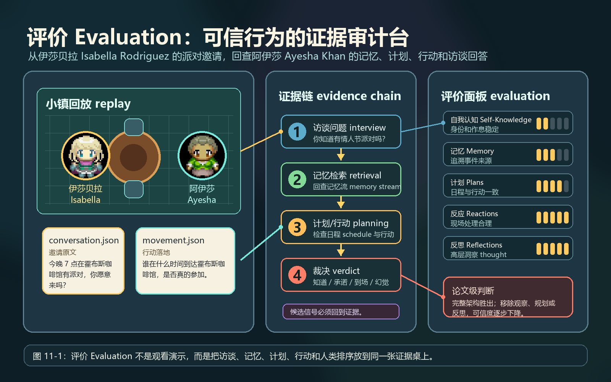
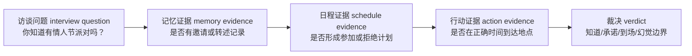
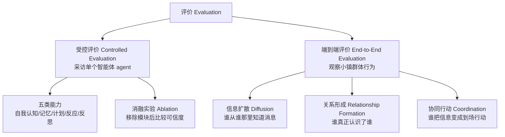

# 第 11 章 论文的评价方法 Evaluation



## 11.1 评价 Evaluation 解决什么

生成式智能体 generative agent 的演示 demo 很容易让人产生错觉。角色在地图上走动、互相打招呼、偶尔说出几句自然的话，看起来已经像一个小社会。但可信行为 believable behavior 不能只靠观看界面判断。

评价 Evaluation 要回答的是下面这个问题：

```text
一个角色的回答和行动，是否能被它自己的记忆、计划、关系和环境证据支撑？
```

第 5 章到第 10 章已经拆开了论文架构中的核心模块：

| 中文模块 | 英文概念 | 评价时要检查什么 |
| --- | --- | --- |
| 记忆流 | Memory Stream | 经历是否被保存，回答是否能回到真实事件。 |
| 检索 | Retrieval | 相关记忆是否能被取回，而不是被遗忘。 |
| 反思 | Reflection | 多条经历是否能合成更高层的想法 thought。 |
| 规划 | Planning | 当前行为是否来自稳定日程 schedule，而不是每步临场编造。 |
| 反应 | Reacting | 突发事件是否触发合理处理。 |
| 对话 | Dialogue | 对话是否被双方记住，并影响后续行为。 |

这些模块写在代码里不等于行为已经可信。评价必须把“看起来像”继续推进到“证据可回查”。

## 11.2 闭环案例：阿伊莎 Ayesha Khan 是否真的知道派对

沿用第 10 章的派对邀请案例：伊莎贝拉 Isabella Rodriguez 在霍布斯咖啡馆 Hobbs Cafe 邀请阿伊莎 Ayesha Khan 参加情人节派对。评价时不能只看阿伊莎 Ayesha Khan 回答“我知道派对”。这句话可能来自三种情况：

| 情况 | 表面回答 | 真实判断 |
| --- | --- | --- |
| 有证据知道 | 阿伊莎 Ayesha Khan 说自己听伊莎贝拉 Isabella Rodriguez 提到过派对。 | 对话记录、记忆和后续计划能互相支撑。 |
| 弱线索知道 | 阿伊莎 Ayesha Khan 说听说过派对，但找不到上游来源。 | 只能算候选线索，需要继续回查。 |
| 幻觉知道 | 阿伊莎 Ayesha Khan 没有任何相关对话或记忆，却回答自己知道。 | 这是幻觉 hallucination，不是信息传播。 |

一条严谨的评价链路至少包含四个检查点：


```mermaid
flowchart LR
    Q["访谈问题 interview question<br/>你知道有情人节派对吗？"] --> M["记忆证据 memory evidence<br/>是否有邀请或转述记录"]
    M --> S["日程证据 schedule evidence<br/>是否形成参加或拒绝计划"]
    S --> A["行动证据 action evidence<br/>是否在正确时间到达地点"]
    A --> V["裁决 verdict<br/>知道/承诺/到场/幻觉边界"]
```

*图 11-2：派对信息的评价链路。访谈回答只是入口，裁决要回到记忆、日程和行动证据。*

这个案例把评价问题压成了输入、处理和输出三层：

| 层次 | 内容 | 在派对案例中的形态 |
| --- | --- | --- |
| 输入 input | 访谈问题、角色历史、记忆流 memory stream、日程 schedule、对话 conversation、行动 movement | “你知道有情人节派对吗？”加上阿伊莎 Ayesha Khan 的运行记录。 |
| 处理 process | 检索相关记忆、压缩证据、生成回答、人工或模型裁决 | 查她是否听到邀请，是否记住，是否调整晚上安排。 |
| 输出 output | 评价结论、证据位置、失败边界 | “知道但未到场”“承诺并到场”“无证据幻觉知道”等。 |

后面所有评价方法都服务这条链路：可信行为不是一句漂亮回答，而是一组可回查的证据。

## 11.3 两层评价：受控评价 Controlled Evaluation 与端到端评价 End-to-End Evaluation

Generative Agents 论文把评价 Evaluation 分成两层。

| 评价层次 | 核心问题 | 评价对象 | 典型证据 |
| --- | --- | --- | --- |
| 受控评价 Controlled Evaluation | 单个智能体 agent 是否能可信地记住、计划、反应和反思。 | 同一个角色在不同架构条件下的访谈回答。 | 访谈问题、记忆流 memory stream、消融条件、人类排序。 |
| 端到端评价 End-to-End Evaluation | 多个智能体 agent 在小镇里连续互动后，是否形成社会现象。 | 25 个角色连续运行两个游戏日后的群体行为。 | 信息扩散、关系形成、群体协同行动。 |

这两层评价不能混在一起。一个角色回答得自然，不代表小镇会出现社会传播；小镇看起来热闹，也不代表每个角色的记忆和计划都可靠。


```mermaid
flowchart TD
    E["评价 Evaluation"] --> C["受控评价 Controlled Evaluation<br/>采访单个智能体 agent"]
    E --> T["端到端评价 End-to-End Evaluation<br/>观察小镇群体行为"]
    C --> F["五类能力<br/>自我认知/记忆/计划/反应/反思"]
    C --> AB["消融实验 Ablation<br/>移除模块后比较可信度"]
    T --> D["信息扩散 Diffusion<br/>谁从谁那里知道消息"]
    T --> R["关系形成 Relationship Formation<br/>谁真正认识了谁"]
    T --> CO["协同行动 Coordination<br/>谁把信息变成到场行动"]
```

*图 11-3：论文评价 Evaluation 的两层结构。上层检查单体能力，下层检查群体社会现象。*

## 11.4 受控评价 Controlled Evaluation：采访智能体

受控评价 Controlled Evaluation 利用智能体 agent 的自然语言接口，直接采访角色。论文不是只看后台日志，而是向角色提出一组问题，然后比较不同架构版本的回答可信度。

典型问题包括：

```text
请介绍你自己。
你记得某个人吗？
你明天 10 点会做什么？
早餐烧焦了你会怎么办？
你最近最想和谁相处，为什么？
```

这类问题看似普通，实际分别击中角色身份、记忆、日程、现场反应和反思能力。传统机器学习指标里的准确率 accuracy、F1 值 F1 score、曲线下面积 AUC 适合固定标签任务，却很难直接评价“一个角色是否记得过去、是否保持身份、是否能在新情境里调整计划”。Generative Agents 论文把评价中心放在“回答是否有角色自己的经历支撑”。

## 11.5 五类访谈能力

论文的访谈问题分为五类，每类五个问题，总共 25 个问题。

| 访谈能力 | 英文概念 | 典型问题 | 检查的系统能力 | 失败信号 |
| --- | --- | --- | --- | --- |
| 自我认知 | Self-Knowledge | 请介绍你自己；你的职业是什么；你的兴趣是什么。 | 角色设定 persona、草稿状态 scratch、当前状态 currently。 | 身份漂移，职业或作息与设定冲突。 |
| 记忆 | Memory | 某某是谁；是否有情人节派对；谁正在竞选镇长。 | 记忆流 memory stream、检索 retrieval。 | 编造知道，或忘记真实经历。 |
| 计划 | Plans | 今天早上 6 点会做什么；晚上 10 点会做什么。 | 规划 planning、日程 schedule。 | 回答与日程冲突，或者计划过于临场。 |
| 反应 | Reactions | 早餐烧焦怎么办；浴室被占用怎么办；街上有火怎么办。 | 反应 reacting、常识约束、现场状态。 | 过度反应、无视事件或违反物理规范。 |
| 反思 | Reflections | 你现在最受什么启发；会给某人买什么礼物；最近最想和谁相处。 | 反思 reflection、想法 thought、高层记忆。 | 只能复述事实，不能综合多条经历。 |

五类能力的价值不在“问题难不难”，而在每个问题都能回到架构中的一个支撑点。克劳斯 Klaus Mueller 如果说自己是医生，问题落在角色设定 persona；阿伊莎 Ayesha Khan 如果说知道派对，问题落在记忆流 memory stream；玛丽亚 Maria Lopez 如果能推断沃尔夫冈 Wolfgang Schulz 喜欢数学音乐创作，问题落在反思 Reflection。

## 11.6 访谈回答如何进入提示词 prompt

评价不是把 25 个问题直接丢给大语言模型 LLM。原始 Stanford 项目里的访谈回答链路更像“带证据的角色采访”。

原始源码调用链可以概括为：


```mermaid
flowchart LR
    Q["访谈问题 interview question"] --> R["记忆检索 new_retrieve()<br/>取回相关记忆节点"]
    R --> N["记忆片段 nodes<br/>转成 statements"]
    N --> P["摘要提示词 summarize_ideas_v1.txt<br/>压缩问题相关证据"]
    P --> S["证据摘要 summarized idea"]
    S --> A["下一句生成 generate_next_line()<br/>输出访谈回答"]
```

*图 11-4：原始 Stanford 项目的访谈回答链路。评价回答先检索记忆，再围绕访谈问题整理证据。*

原始提示词 prompt 文件位于 Stanford 原始仓库：

```text
reverie/backend_server/persona/prompt_template/v3_ChatGPT/summarize_ideas_v1.txt
```

它的作用是把检索出的记忆片段压缩成与访谈问题相关的摘要。原始模板中有一句核心指令：

```text
Summarize the Statements that are most relevant
```

中文含义是：

```text
概括这些陈述中与访谈者这句话最相关的内容。
```

模板变量可以按下面方式阅读：

| 变量 | 中文含义 | 来源 | 对评价的影响 |
| --- | --- | --- | --- |
| `!<INPUT 0>!` | 陈述 statements | 记忆检索 new_retrieve() 取回的记忆节点。 | 决定回答可使用哪些证据。 |
| `!<INPUT 1>!` | 角色名 agent name | 被采访智能体 agent 的名字。 | 让问题绑定到具体角色。 |
| `!<INPUT 2>!` | 访谈问题 interviewer question | 研究者输入的问题。 | 决定本轮要筛选哪类证据。 |

这个提示词 prompt 的输出不是 JSON，也不是固定标签，而是一段证据摘要。它没有输出结构 schema、回调 callback 或兜底值 failsafe 这类严格工程边界。当前中文项目保留了运行时提示词 prompt，例如规划 planning、反应 reacting、对话 dialogue、反思 reflection 的模板，但没有内置论文访谈评价脚本。复现实验需要把这条链路补成中文评价工具：先检索证据，再生成回答，再由人工或大模型裁判 LLM-as-judge 按证据链评分。

## 11.7 消融实验 Ablation：哪些模块真的有用

消融实验 Ablation 只问一个问题：

```text
如果去掉某个模块，可信度是否下降？
```

论文比较完整架构和多个削弱条件。关键不是让每个版本重新运行两天小镇，而是在相同角色历史上限制可访问的记忆类型，再比较访谈回答。

| 条件 | 英文名称 | 可访问内容 | 被移除内容 | 主要暴露的问题 |
| --- | --- | --- | --- | --- |
| 完整架构 | Full Architecture | 观察 observation、规划 planning、反思 reflection 等完整记忆。 | 无。 | 作为最强条件。 |
| 无反思 | No Reflection | 观察 observation 和规划 planning。 | 反思记忆 reflection memory。 | 难以综合多条经历形成高层判断。 |
| 无反思无规划 | No Reflection + No Planning | 观察 observation。 | 反思 reflection、规划 planning。 | 能记事实，但难以回答未来计划和目标连续性。 |
| 无观察无反思无规划 | No Observation + No Reflection + No Planning | 角色设定 persona 等静态背景。 | 观察 observation、反思 reflection、规划 planning。 | 回答接近临场编造，缺少真实经历支撑。 |
| 人类基线 | Human Crowdworker-Authored Condition | 人类写作的回答。 | 不是智能体架构条件。 | 提供基本行为可信度参照。 |

同一条仿真历史、同一组访谈问题、不同可访问信息，这样的设计能把模块贡献分离出来。如果每个削弱版本都重新跑两天，小镇事件会分叉，角色遇到的人、听到的信息、形成的关系都不同，回答就难以直接比较。

## 11.8 人类评估 Human Evaluation 如何比较回答

论文让 100 名人类评估者比较同一个智能体 agent 在不同条件下的回答。评估者不是凭空看答案，而是能查看角色生活回放和记忆流 memory stream。否则，一个角色说“我知道情人节派对”听起来合理，但无法判断它到底有没有听过邀请。

人类评估 Human Evaluation 的输入、处理和输出可以这样拆：

| 层次 | 内容 | 论文中的作用 |
| --- | --- | --- |
| 输入 input | 同一个访谈问题、同一个角色历史、多个架构条件的回答。 | 保证比较对象可控。 |
| 处理 process | 人类评估者查看回放和记忆，再按可信度排序。 | 把语言流畅度和证据一致性一起纳入判断。 |
| 输出 output | 排序结果、TrueSkill 评分、统计检验结果、开放编码主题。 | 得到不同架构条件的可信度差异。 |

论文使用了几类统计方法：

| 方法 | 中文说明 | 在评价中的作用 |
| --- | --- | --- |
| TrueSkill 评分 | TrueSkill rating | 把人类排序转成可比较的分数。 |
| Kruskal-Wallis 检验 | Kruskal-Wallis test | 检查多个条件之间是否存在总体差异。 |
| Dunn 事后检验 | Dunn post-hoc test | 做条件之间的两两比较。 |
| Holm-Bonferroni 校正 | Holm-Bonferroni correction | 修正多重比较带来的显著性膨胀。 |
| 开放编码 | Open coding | 总结不同条件回答的主题差异。 |

这些统计名称不需要在这里展开成数学教程。评价逻辑更重要：完整架构是否更可信，不由作者直接宣称，而由外部评估者在相同背景下比较回答。

## 11.9 受控评价 Controlled Evaluation 的结论和错误边界

论文的受控评价 Controlled Evaluation 得到一个清晰趋势：完整架构最可信，移除模块后表现逐步下降。

可以按下面顺序理解：

```text
完整架构
  > 无反思 Reflection
  > 无反思 Reflection + 无规划 Planning
  > 人类 crowdworker 基线
  > 无观察 Observation + 无反思 Reflection + 无规划 Planning
```

模块贡献可以写成一张诊断表：

| 模块 | 带来的评价收益 | 移除后的典型问题 |
| --- | --- | --- |
| 记忆 Memory | 能回答过去经历、人物关系和信息来源。 | 语言流畅但缺少真实事件支撑。 |
| 规划 Planning | 能回答未来计划和当前日程。 | 行动没有时间连续性。 |
| 反思 Reflection | 能把多条经历合成高层想法 thought。 | 只能说“不确定”，或只复述单条事实。 |

论文也保留了错误边界：

| 错误类型 | 表现 | 评价时的处理 |
| --- | --- | --- |
| 检索失败 | 角色明明听过某件事，回答时没有取回相关记忆。 | 标记为召回失败，不直接说角色从未知道。 |
| 记忆不完整 | 角色只取回部分信息，回答含糊或缺少关键来源。 | 回查检索结果和原始记忆节点。 |
| 记忆修饰 | 角色在真实记忆基础上添加不存在的细节。 | 把“听起来自然”与“证据真实”分开。 |

记忆流 memory stream 不是可信行为的终点。保存经历只是第一步，正确检索、正确引用、不过度补全，才构成可评价的记忆能力。

## 11.10 端到端评价 End-to-End Evaluation：两天小镇仿真

受控评价 Controlled Evaluation 检查单个智能体 agent，端到端评价 End-to-End Evaluation 检查 25 个智能体 agent 在 Smallville 中连续互动两个游戏日后的社会现象。

论文重点观察三类结果：

| 社会现象 | 英文概念 | 评价问题 |
| --- | --- | --- |
| 信息扩散 | Information Diffusion | 派对和竞选消息是否从源头角色传到更多角色。 |
| 关系形成 | Relationship Formation | 居民是否通过互动真正认识彼此。 |
| 群体协同行动 | Collective Coordination | 多个角色是否能把邀请、记忆、日程和到场行动连起来。 |

这三类结果都不能只看最终数字。派对有多少人到场只是输出 output；谁告诉了谁、谁记住了、谁调整了计划、谁错过了时间，才是机制证据。

## 11.11 三类社会现象如何测量

### 信息扩散 Information Diffusion

论文选择了两条初始信息：

| 信息 | 源头角色 | 初始状态 | 两天后的观察 |
| --- | --- | --- | --- |
| 镇长竞选 | 山姆 Sam Moore | 只有山姆 Sam Moore 知道自己的竞选意向。 | 信息从 1 个智能体 agent 扩散到 8 个智能体 agent，约 4% 到 32%。 |
| 情人节派对 | 伊莎贝拉 Isabella Rodriguez | 只有伊莎贝拉 Isabella Rodriguez 知道自己要办派对。 | 信息从 1 个智能体 agent 扩散到 13 个智能体 agent，约 4% 到 52%。 |

研究者在仿真结束后采访角色：

```text
你知道有情人节派对吗？
你知道谁在竞选镇长吗？
```

回答 yes 不是最终裁决。论文还检查记忆流 memory stream，确认声称知道的角色确实有信息来源。没有来源的 yes 只能算幻觉 hallucination。

### 关系形成 Relationship Formation

关系形成 Relationship Formation 通过互相认识来测量。研究者在仿真前后询问每个智能体 agent 是否知道其他人。如果两个智能体 agent 彼此都表示知道对方，就在关系图中形成一条无向边。

| 结构 | 含义 |
| --- | --- |
| 节点 node | 一个小镇居民。 |
| 边 edge | 两个居民都声称认识对方。 |
| 网络密度 network density | 已形成关系边占所有可能关系边的比例。 |

论文报告的网络密度 network density 从 0.167 增加到 0.74。这个增长说明两天仿真后，小镇居民之间的互相认识显著增加。论文同时报告了幻觉边界：453 个“是否认识某人”的回答中，有 6 个被发现是幻觉，占 1.3%。关系增长和错误率要一起看。

### 群体协同行动 Collective Coordination

群体协同行动 Collective Coordination 围绕情人节派对展开。派对是一个好评价对象，因为它要求多个环节同时成立：

1. 伊莎贝拉 Isabella Rodriguez 有办派对的意图。
2. 她向别人发出邀请。
3. 被邀请者记住时间和地点。
4. 被邀请者决定是否参加。
5. 被邀请者把计划调整到正确时间。
6. 被邀请者在正确地点出现。

论文结果显示：12 个智能体 agent 被邀请，5 个智能体 agent 到达霍布斯咖啡馆 Hobbs Cafe 参加派对；未到场者中，3 个表示有计划冲突，4 个表示感兴趣但没有形成到场计划。

这个结果的价值在于它不完美。全部到场会更像脚本；有人参加、有人冲突、有人有兴趣但计划没有落地，反而暴露出开放仿真系统的真实边界。

## 11.12 从论文评价到本项目证据链

本项目的教学价值在于中间产物可检查。论文评价方法可以直接转成项目里的证据链。

| 论文评价点 | 本项目可观察证据 | 可记录指标 |
| --- | --- | --- |
| 自我认知 Self-Knowledge | `agent.json`、当前状态 currently、访谈回答。 | 身份一致性、职业一致性、作息一致性。 |
| 记忆 Memory | 记忆存储、对话记录 conversation、仿真叙事 `simulation.md`。 | 关键事件召回、来源是否正确。 |
| 计划 Plans | 日程 schedule、行动 action、`movement.json`。 | 计划完成率、重规划合理性。 |
| 反应 Reactions | 反应函数输出、聊天/等待记录。 | 反应触发率、误反应率。 |
| 反思 Reflections | 想法 thought 记忆、反思输出。 | 反思是否有证据，是否影响后续行为。 |
| 社会传播 Social Diffusion | 多人对话链、到场记录、压缩结果。 | 扩散深度、传播断点、到场人数。 |

证据强弱也要分层：

| 证据层级 | 文件或材料 | 强度 | 用法 |
| --- | --- | --- | --- |
| 强证据 | 原始对话、`conversation.json`、`movement.json` | 高 | 判断谁告诉了谁，谁在什么时间到达哪里。 |
| 中证据 | checkpoint 中的行动 action、日程 schedule、记忆节点 | 中 | 判断计划、记忆和行动是否一致。 |
| 阅读入口 | `simulation.md` | 中低 | 快速理解时间线，不能单独作为最终裁决。 |
| 弱线索 | 关键词命中、角色静态设定、压缩摘要中的提及 | 低 | 只能作为候选，必须回到原始证据复核。 |

判断“阿伊莎 Ayesha Khan 是否知道派对”时，可以按下面顺序查：

```text
1. 是否存在伊莎贝拉 Isabella Rodriguez 或其他知情者的邀请对话。
2. 这段对话是否进入阿伊莎 Ayesha Khan 的记忆。
3. 后续访谈是否检索到这段记忆。
4. 阿伊莎 Ayesha Khan 是否调整日程 schedule 或到达霍布斯咖啡馆 Hobbs Cafe。
5. 如果回答知道但没有 1-3 的证据，标记为幻觉知道 hallucinated awareness。
```

这条证据链会在第四部分的复现实验中继续使用。

## 11.13 失败边界和常见误区

论文第 7.2 节明确讨论了失败边界。评价章节必须保留这些失败，因为失败决定系统能用到哪里。

| 失败边界 | 表现 | 检查位置 | 改进方向 |
| --- | --- | --- | --- |
| 检索失败 retrieval failure | 角色听过某事，但回答时说不知道。 | 记忆检索结果、访谈上下文摘要。 | 改进检索权重、时间衰减和相关性排序。 |
| 记忆修饰 memory embellishment | 回答加入不存在的细节。 | 原始记忆节点与回答对照。 | 引入引用证据、回答前校验和裁判模型。 |
| 空间选择错误 spatial error | 角色知道多个地点后，去到不典型地点。 | 地点选择、行动 action、`movement.json`。 | 加入空间约束、开放时间和偏好权重。 |
| 物理规范误判 physical norm error | 浴室容量、商店关门时间等被违反。 | 地图配置、对象容量、时间规则。 | 把环境规范显式写成约束。 |
| 过度礼貌 over-politeness | 角色不拒绝别人，兴趣被对话带偏。 | 对话记录、关系变化、后续计划。 | 增加拒绝能力、个人目标权重和社会边界。 |
| 一次运行下结论 single-run overclaim | 用一次仿真证明系统稳定有效。 | 实验设计和结果报告。 | 多次运行、不同模型、不同种子和对照组。 |

评价可信行为 believable behavior 最容易踩的误区也可以压成一张表：

| 误区 | 为什么不成立 | 正确做法 |
| --- | --- | --- |
| 把“像人说话”当成“像人行动”。 | 语言自然不代表记忆、计划和行动一致。 | 回查事件来源、日程和行动记录。 |
| 把“任务完成”当成“可信”。 | 所有人准时到场可能更像脚本。 | 同时记录拒绝、遗忘、冲突和迟到。 |
| 只看宏观统计。 | “13 人知道派对”不能说明传播路径。 | 写出谁告诉谁、谁记住、谁转述。 |
| 忽略负样本。 | 不知道、没到场、回答错误都是边界证据。 | 把失败样例和成功样例一起报告。 |
| 把候选信号当裁决。 | 关键词命中、摘要提及和高分指标都可能误判。 | 回到原始对话、记忆和位置证据。 |

## 11.14 评价视角下的论文贡献

从评价 Evaluation 的角度看，Generative Agents 论文的贡献不是“用 ChatGPT 做 NPC”。它给出了一个可以被检查的闭环：

```text
记忆流 Memory Stream
  -> 检索 Retrieval
  -> 反思 Reflection
  -> 规划 Planning
  -> 反应 Reacting
  -> 对话 Dialogue
  -> 新记忆 New Memory
```

这个闭环带来三类可评价结果：

| 结果 | 评价对象 | 证据 |
| --- | --- | --- |
| 单体可信行为 | 一个角色是否能记住、计划、反应和反思。 | 受控访谈、消融条件、人类排序。 |
| 小镇社会现象 | 多个角色是否形成信息扩散、关系和协同行动。 | 两天仿真、访谈、关系图、到场记录。 |
| 失败边界 | 系统哪里会忘记、幻觉、过度合作或违反环境规范。 | 错误案例、负样本、论文讨论和项目日志。 |

后续源码深读、复现实验和前沿升级都要沿用这套口径：不把演示 demo 写成结果，不把路线图写成能力，不把候选信号写成裁决。

## 11.15 本章小结

评价 Evaluation 把第一部分的论文架构收束成一个判断标准：可信行为 believable behavior 必须能被采访、消融、回放和端到端社会现象共同验证。

| 本章内容 | 关键结论 |
| --- | --- |
| 受控评价 Controlled Evaluation | 用访谈问题检查自我认知、记忆、计划、反应和反思。 |
| 提示词 prompt 链路 | 原始 Stanford 项目先检索记忆，再用摘要提示词 prompt 生成访谈上下文。 |
| 消融实验 Ablation | 移除反思 Reflection、规划 Planning 或观察 Observation 后，可信度逐步下降。 |
| 人类评估 Human Evaluation | 外部评估者根据回放和记忆流 memory stream 比较回答可信度。 |
| 端到端评价 End-to-End Evaluation | 小镇连续运行后观察信息扩散、关系形成和群体协同行动。 |
| 项目证据链 | 本项目可以用对话、记忆、日程、行动和压缩结果复查论文评价问题。 |
| 失败边界 | 检索失败、记忆修饰、空间错误、物理规范误判和过度礼貌都必须保留。 |

下一部分进入项目上手与功能体验。先把 Generative Agents 跑起来，看到现成回放和自己的最小仿真结果，再逐步进入配置、运行、回放和自定义场景。

## 参考资料

- Joon Sung Park, Joseph C. O'Brien, Carrie J. Cai, Meredith Ringel Morris, Percy Liang, Michael S. Bernstein. *Generative Agents: Interactive Simulacra of Human Behavior*. arXiv: https://arxiv.org/abs/2304.03442
- ar5iv full text, Controlled Evaluation and End-To-End Evaluation: https://ar5iv.labs.arxiv.org/html/2304.03442
- Stanford original repository: https://github.com/joonspk-research/generative_agents
- Stanford original source: `reverie/backend_server/persona/cognitive_modules/converse.py`
- Stanford original prompt: `reverie/backend_server/persona/prompt_template/v3_ChatGPT/summarize_ideas_v1.txt`
- Generative Agents local source: `generative_agents/results/compressed/*/simulation.md`
- Generative Agents local source: `generative_agents/results/compressed/*/movement.json`
