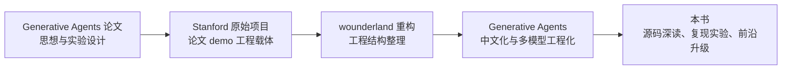

# 第 12 章 项目谱系：从 Stanford Generative Agents 到 Generative Agents

## 12.1 核心问题

第一部分已经完成论文思想的铺垫，第二部分开始进入项目。但不能一上来就钻源码。先要搞清楚这个项目从哪里来、继承了什么、改写了什么、为什么要这样改。Generative Agents 不是凭空出现的项目。它处在一条很清晰的谱系上：

```text
Generative Agents 论文
  -> Stanford 原始开源项目
  -> wounderland 重构项目
  -> Generative Agents 中文化与工程化版本
  -> 当前工作区 fork / 本书写作对象
```

理解这条谱系很重要。如果只看 Generative Agents，读者会看到很多工程选择，但不一定知道它们为什么存在。如果只看 Stanford 原项目，读者会理解论文 demo，但会低估中文化、本地模型、结构化输出和回放系统的重要性。如果只看 wounderland，读者会看到重构，但还没看到中文智能体社会的完整落地。本章聚焦六个问题：

1. Stanford 原始项目提供了什么？
2. 原始项目为什么不适合直接作为中文实验底座？
3. wounderland 重构解决了什么？
4. Generative Agents 在 wounderland 基础上做了什么？
5. 当前项目继承、改写和牺牲了哪些能力？
6. 为什么第二部分必须先讲项目谱系，再讲源码映射？



*图 12-1：Generative Agents 项目谱系。本书读的不是孤立仓库，而是一条从论文 demo 到中文工程版本的演化链。*

## 12.2 Stanford 原始项目：论文 demo 的工程载体

Stanford 原始项目是 Generative Agents 论文的官方代码仓库。仓库名是：

```text
joonspk-research/generative_agents
```

它的定位很清楚：配合论文展示 generative agents 的核心仿真模块和游戏环境。原项目包含两大部分：

- agent simulation backend。
- game environment / frontend。

前端用于展示 Smallville，小镇地图、角色位置、回放效果都在这里呈现。后端负责智能体仿真，包括角色状态、记忆、计划、对话、行动等。它的使用方式也体现了论文 demo 的特点：需要启动环境服务器，再启动 simulation server，通过命令行输入 forked simulation、新 simulation 名称和 step count 来运行。这套设计适合论文演示。它让研究者可以复现论文中的 Smallville，观察 Isabella、Maria、Klaus 等角色在地图上行动。但它并不一定适合作为长期维护的实验框架。

## 12.3 原始项目的价值

原始项目最重要的价值不是代码优雅，而是它把论文思想具体化了。论文讲 Memory Stream、Retrieval、Reflection、Planning、Reaction、Dialogue，但如果没有原始项目，很多细节会停留在抽象层。原始项目让这些机制变成可运行系统：

- 角色确实能在地图上移动。
- 角色确实有日程。
- 角色确实会感知附近事件。
- 角色确实能对话。
- 角色确实能保存记忆。
- 回放可以显示角色行为。

这就是研究代码的意义。论文给出思想，原始项目给出最初实现。Generative Agents 后续所有改造，都不是另起炉灶，而是在这个思想和 demo 基础上继续工程化。

## 12.4 原始项目的问题

原始项目的目标是支持论文，而不是做一个面向中文用户、可长期扩展的工程框架。因此，它有一些天然局限。第一，工程结构较重。原项目需要同时处理环境服务器、仿真服务器、存储、前端回放等多套结构。对初学者来说，启动链路和文件结构都比较复杂。第二，语言和 prompt 主要面向英文。对于中文智能体实验，这会带来两个问题：

- 角色说话容易切回英文语境。
- 地图、人物名、活动名中英混杂会影响中文模型稳定性。

第三，对本地中文模型不友好。2023 年论文发布时，主流方案主要围绕 ChatGPT / OpenAI API。到 2025-2026 年，中文本地模型和 OpenAI 兼容接口已经更成熟。直接使用原项目会增加改造成本。第四，结构化输出不够稳定。许多早期 agent 项目依赖自然语言或正则表达式解析模型输出。随着 prompt 数量增加，输出格式失控会成为主要工程风险。第五，实验成本高。如果所有 agent 思考、对话、反思都调用远端大模型，长时间仿真成本会很高。中文读者如果想做多次实验，需要更低成本的本地部署路径。这些问题不是原项目“错了”，而是它的目标不同。原项目完成的是论文 demo。Generative Agents 要完成的是中文用户可运行、可维护、可扩展的基础版本。

## 12.5 wounderland：对原项目的工程重构

在 Stanford 原项目和 Generative Agents 之间，还有一个重要中间项目：

```text
Archermmt/wounderland
```

wounderland 的 README 说明，它是对原 Generative Agents 项目的重构，使用 Vue、Phaser 和 Django，并默认使用 QIANFAN 平台的 Yi-34B-Chat。它的意义在于把原项目重新组织成更清晰的工程形态。Generative Agents README 也明确说明，本项目基于 wounderland 开发，因为 wounderland 结构更好，代码质量优于原版。对我们写书来说，wounderland 的角色可以这样理解：

```text
Stanford 原项目：论文 demo 的原始实现。
wounderland：把原实现重构成更适合维护的工程骨架。
Generative Agents：在 wounderland 基础上做中文化、本地模型适配和回放增强。
```

因此，Generative Agents 不是直接把论文代码翻译成中文，而是站在 wounderland 的重构基础上继续改造。

## 12.6 Generative Agents 的定位

Generative Agents 的 README 给出了自己的定位：

```text
生成式智能体（Generative Agents）深度汉化版
```

它的目标不是做一个全新论文，而是为中文用户提供一个利于维护的基础版本，以便后续实验和玩法扩展。这句话很关键。Generative Agents 的价值不在于“比论文更完整地模拟人类社会”，而在于把论文思想和重构代码带入中文工程环境。它面向的是这样一类读者：

- 想理解 Generative Agents 论文。
- 想运行一个中文 AI 小镇。
- 想用本地模型降低成本。
- 想修改 prompt、角色、地图和事件。
- 想观察记忆、对话、反思和回放。
- 想基于项目继续做实验。

这与论文作者面向 HCI / AI research audience 的目标不同。论文要证明一种 agent 架构可行。Generative Agents 要让中文开发者能把这种架构跑起来、改起来、看明白。

## 12.7 Generative Agents 的主要改造

根据 README 和源码，Generative Agents 的主要改造可以分为七类。

### 12.7.1 Prompt 全面中文化

项目重写了全部提示语，把智能体的“母语”切换为中文。这不是简单翻译。在多智能体仿真中，语言环境会影响角色行为。如果角色名、地图名、活动名、prompt 指令混合中英文，中文模型可能在对话中突然切换语境，甚至把地名和人名解释错。Generative Agents 不只中文化对话，还同步汉化地图和人物名称。README 明确说明，这样做是为了避免 LLM 在中英混杂上下文中切换到英文语境。这直接影响中文 agent 仿真的可运行性。

### 12.7.2 中文对话起止逻辑优化

项目针对中文特点和 Qwen2.5/3 系列模型能力，优化了中文 prompt 和智能体之间的对话起止逻辑。在源码中可以看到：

- `decide_chat`
- `generate_chat`
- `generate_chat_check_repeat`
- `decide_chat_terminate`

这些 prompt 和判断逻辑共同控制对话是否开始、如何生成、何时停止、是否复读。对话控制不是小问题。如果没有起止控制，智能体会频繁聊天、重复聊天、对话无法结束。中文模型在礼貌表达、重复句式和“继续补充”方面有自己的倾向，因此 prompt 必须适配。

### 12.7.3 Prompt 模板化

Generative Agents 把 prompt 放在：

```text
generative_agents/data/prompts/
```

并通过 `Scratch.build_prompt()` 统一填充。这比把 prompt 散落在代码字符串里更适合维护。读者后续想调整某个行为，不需要先改 Python 逻辑，可以直接定位 prompt 文件。例如：

- `wake_up.txt`
- `schedule_daily.txt`
- `reflect_focus.txt`
- `reflect_insights.txt`
- `generate_chat.txt`
- `decide_wait.txt`

这些 prompt 文件是理解项目行为的重要入口。本书第三部分会专门讲 prompt 与源码的关系。

### 12.7.4 支持本地 Ollama

Generative Agents 增加了对本地 Ollama API 的支持，并把 LlamaIndex embedding 也接入 Ollama。这解决两个问题。第一，降低成本。多智能体仿真需要大量模型调用。每个角色每一步都可能调用 LLM。远端 API 成本很容易累积。第二，降低实验门槛。中文用户可以用本地 Qwen、DeepSeek 等模型运行小镇，不必依赖单一远端供应商。这也使项目更适合教学和重复实验。

### 12.7.5 支持 OpenAI 兼容 API 与 MiniMax

除了 Ollama，项目也支持 OpenAI 兼容 API。README 还说明了 MiniMax-M 系列的特殊处理：由于其 OpenAI 兼容接口不支持 `response_format` 的 `json_schema` 严格模式，项目会把 JSON Schema 拼进 prompt，并启用 `json_object` 模式，同时过滤 `<think>` 思考过程。这说明 Generative Agents 并不是只绑定一个模型，而是在做多模型适配。多模型适配会影响第五部分的升级路线。不同模型的输出格式、推理风格、中文表达、遵循 schema 能力都不同。要让 agent 系统稳定运行，模型适配层必须足够现实。

### 12.7.6 使用 Pydantic 替代正则解析

README 记录了 2026.01.15 的更新：

```text
使用 pydantic 模型取代正则表达式解析。
```

这是非常关键的工程升级。agent 系统中有大量结构化输出：

- 起床时间。
- 日程表。
- 子计划。
- 是否聊天。
- 是否等待。
- 反思焦点问题。
- 反思洞察及证据。

如果这些输出靠正则表达式解析，系统很容易因为模型多输出一句话、换一种格式、加上解释而崩。Pydantic schema 把“模型应该输出什么结构”变成显式约束。这让项目更稳定，也更适合小模型。

### 12.7.7 断点恢复与回放增强

Generative Agents 增加了断点恢复，并把回放界面做了精简。它还把智能体活动时间线和对话内容保存为 Markdown 文档。这能直接支撑写书和实验。读者不仅可以看前端动画，还可以打开：

```text
generative_agents/results/compressed/<simulation-name>/simulation.md
generative_agents/results/compressed/<simulation-name>/movement.json
```

前者适合阅读行为叙事。后者适合做数据分析和指标统计。这让项目不只是 demo，而是可复盘、可分析的实验平台。

## 12.8 当前工作区与上游仓库的关系

本书写作所在工作区的 git remote 指向：

[tbkken fork](https://github.com/tbkken/Generative%41gentsCN.git)而 README 中的获取代码地址是：

[x-glacier upstream](https://github.com/x-glacier/Generative%41gentsCN.git)这说明当前工作区很可能是 Generative Agents 的一个 fork 或派生工作区。书中讲项目来源时，应以 README 与公开上游为准，同时把当前工作区视为本书实际分析的代码版本。这在写源码书时很重要。开源项目经常有 fork、PR、二次修改、本地实验分支。不能只凭仓库名判断来源，而要同时看：

- README。
- git remote。
- 本地源码。
- commit 历史。
- 实际运行方式。

本书后续所有源码分析，都以当前工作区文件为准。本书中的文件路径，应能在当前仓库中找到对应源码。

## 12.9 项目继承了什么

Generative Agents 继承了 Generative Agents 论文和原项目的核心思想。第一，继承了 Smallville 沙盒环境思想。智能体不是孤立聊天，而是在有地图、房间、对象、时间和其他人的世界中行动。第二，继承了 persona 驱动的角色设定。每个 agent 都有姓名、年龄、性格、经历、生活习惯、当前状态和空间记忆。第三，继承了 memory stream 思想。事件、对话、想法都可以被保存、检索和用于后续推理。第四，继承了 importance / poignancy 触发反思。重要事件积累到一定程度后，角色会生成高层 thought。第五，继承了 planning / reaction / dialogue 的行为生成链路。角色不是只回应用户，而是生成日程、执行行动、对现场事件反应、与其他角色对话。第六，继承了 replay 的可观察性。仿真结果不是只在后台运行，而是可以通过前端和文件回放。这些是项目的思想骨架。没有这些继承，Generative Agents 就不是 Generative Agents 的中文版本，而只是另一个聊天角色 demo。

## 12.10 项目改写了什么

Generative Agents 的改写集中在工程可用性和中文适配上。第一，改写 prompt 体系。英文 prompt 被重写为中文 prompt，并放入模板目录统一管理。第二，改写模型接入。项目支持 Ollama、OpenAI 兼容接口、MiniMax 等 provider，而不是只面向原始 OpenAI 调用方式。第三，改写结构化输出。项目使用 Pydantic response model，减少正则解析风险。第四，改写回放和压缩输出。`compress.py` 会生成 `movement.json` 和 `simulation.md`，使实验结果更易读、更易分析。第五，改写存储与检索。

项目使用 LlamaIndex 组织向量索引，`Associate` 和 `AssociateRetriever` 封装 memory stream 与三因素检索。第六，改写运行方式。当前项目用命令行参数启动仿真：

```text
python start.py --name sim-test --start "20250213-09:30" --step 10 --stride 10
```

相比原项目的交互式 simulation server，这种方式更适合脚本化实验和书中复现。

## 12.11 项目牺牲了什么

任何工程改写都有取舍。Generative Agents 也不是只增强，没有牺牲。第一，实时交互能力弱于论文愿景。论文强调用户可以自然语言干预小镇和智能体。当前项目主要聚焦仿真、断点、压缩、回放，没有把实时自然语言干预做成核心体验。第二，前端交互被精简。回放界面基于原前端代码精简，重点是观察结果，不是构建完整游戏编辑器。第三，地图编辑仍然不完整。README 中明确提到 wounderland 原作者没有提供 `maze.json` 生成代码，因此新增地图需要参考现有格式或使用外部工具。第四，多模型适配带来复杂性。不同模型对 JSON、中文 prompt、`<think>` 标签、response format 的支持不同。项目为了兼容多个模型，模型层和 prompt 层不可避免更复杂。第五，本地小模型会降低行为质量。本地模型降低成本，但未必达到论文中 ChatGPT 级别的稳定性。尤其是长对话、反思、复杂计划和结构化输出，小模型更容易失败。这些取舍不是缺点列表，而是读者使用项目时必须知道的边界。

## 12.12 中文化不是“翻译”

中文化很容易被误解成把英文 prompt 翻成中文。但 Generative Agents 做的事情更深。智能体系统中的语言不是 UI 文案，而是行为逻辑的一部分。一个 prompt 会决定：

- 角色如何理解自己。
- 角色如何安排日程。
- 角色如何判断是否聊天。
- 角色如何总结关系。
- 角色如何生成反思。
- 角色如何引用地点和对象。

所以，中文化其实是在重建 agent 的认知语言环境。例如，地图和人物名称也被汉化。这不是为了好看，而是为了减少中英混杂导致的语境切换。再例如，对话起止逻辑也被优化。这不是翻译能解决的，因为不同模型在中文对话中的重复、客套、收束方式不同。因此，本书后面讲 prompt 时，不能把 prompt 当配置文件随便带过。它是系统行为的一部分。

## 12.13 本地模型支持改变项目性质

原论文时代，运行 25 个智能体意味着大量 OpenAI API 调用。这对研究论文可以接受，但对普通读者和教学场景不友好。Generative Agents 支持 Ollama 后，项目性质发生了变化。它从“看别人论文 demo”变成“可以自己反复实验”。读者可以：

- 调整角色。
- 调整 prompt。
- 调整模型。
- 调整检索权重。
- 反复运行同一实验。
- 比较 Qwen、DeepSeek、MiniMax、OpenAI 等模型表现。

这对本书第五部分尤其重要。我们不只是讲 2023 年论文如何实现，还要讲 2026 年如何用更新模型和更先进理念改造这个项目。本地模型和 OpenAI 兼容 API 是这条升级路径的基础。

## 12.14 结构化输出是工程分水岭

早期 LLM 应用常见做法是：

```text
让模型按某种格式回答，再用正则解析。
```

这在小 demo 中可以工作，但在 agent 系统中很脆弱。因为 agent 系统需要解析太多类型：

- int
- bool
- dict
- list
- tuple
- evidence ids
- schedule items
- action descriptions

只要某一步解析失败，后续行为就会断裂。Generative Agents 使用 Pydantic schema，把输出结构显式化。例如：

```python
class schedule_dailyResponse(BaseModel):
    res: dict[str, str]
```

又如：

```python
class reflect_insightsResponse(BaseModel):
    res: List[Tuple[str, str]]
```

这让 prompt、模型调用和 Python 类型之间形成契约。这个契约是工程化 agent 系统的关键。后续第 20 章讲模型适配时，会把结构化输出作为重点。

## 12.15 回放系统对写书的价值

Generative Agents 的回放系统不只是展示动画。它是理解系统的证据层。写源码书时不能只讲：

```text
Agent 会对话。
Agent 会反思。
Agent 会传播信息。
```

我们要能拿出证据：

- 什么时间谁在哪里。
- 谁看到了谁。
- 谁和谁说了什么。
- 对话摘要是什么。
- 谁改变了日程。
- 谁最后到达派对。

`movement.json` 和 `simulation.md` 正好提供这些材料。第四部分复现实验会围绕这两个文件展开。如果没有回放和压缩输出，读者只能看日志，很难理解小镇发生了什么。

## 12.16 当前项目的核心目录

为了给下一章做铺垫，这里先给出 Generative Agents 的主要目录结构。

```text
generative_agents/
  start.py
  compress.py
  replay.py
  live.py
  data/
    config.json
    prompts/
  frontend/
    static/assets/village/
    templates/
  modules/
    agent.py
    game.py
    maze.py
    memory/
    model/
    prompt/
    storage/
  results/
```

这些目录大致对应五类职责。第一，运行入口：

```text
start.py
compress.py
replay.py
live.py
```

第二，世界与仿真：

```text
modules/game.py
modules/maze.py
frontend/static/assets/village/
```

第三，智能体核心：

```text
modules/agent.py
modules/memory/
modules/prompt/
```

第四，模型与存储：

```text
modules/model/
modules/storage/
data/config.json
```

第五，结果与回放：

```text
results/checkpoints/
results/compressed/
frontend/templates/
```

下一章会把论文概念逐一映射到这些源码模块。

## 12.17 读源码时应该带着谱系意识

理解项目谱系后，读源码会更清楚。看到 `Agent.reflect()` 时，要知道它来自论文 Reflection。看到 `AssociateRetriever` 时，要知道它对应论文 retrieval 的 recency、importance、relevance。看到中文 prompt 时，要知道这是 Generative Agents 对中文模型的适配，不是论文原文。看到 Pydantic schema 时，要知道这是工程化输出稳定性的增强。看到 `simulation.md` 时，要知道这是为了复盘和实验分析，不只是回放附属品。看到地图编辑困难时，也要知道这是继承链条中的现实限制，而不是某个单独模块的问题。谱系意识能帮助读者分辨：

```text
哪些是论文核心思想？
哪些是 Stanford 原项目的实现方式？
哪些是 wounderland 的重构结构？
哪些是 Generative Agents 的中文工程改造？
哪些是当前工作区的具体状态？
```

这会让后续源码深读不至于混乱。

## 12.18 本章小结

Generative Agents 不是凭空出现的中文项目。它站在论文、Stanford demo 和 wounderland 重构之上，同时又为了中文实验、本地模型和工程可运行性做了自己的取舍。

| 本章内容 | 核心结论 |
| --- | --- |
| 思想源头 | Generative Agents 的根来自 Generative Agents 论文，而不是普通角色扮演项目。 |
| Stanford 原始项目 | 原项目是论文 demo 的官方工程载体，价值在于把思想跑起来。 |
| wounderland 重构 | wounderland 让项目工程结构更清楚，为后续中文化提供了基础。 |
| 中文化与工程化 | Generative Agents 增加中文 prompt、本地 Ollama、多模型适配、结构化输出、断点恢复和回放增强。 |
| 当前工作区 | 书中源码分析以当前仓库为准，避免读者在不同上游仓库之间混淆。 |
| 继承内容 | 项目继承了 Smallville、persona、memory、retrieval、reflection、planning、reaction、dialogue 和 replay 思想。 |
| 改写内容 | prompt、模型接入、结构化输出、运行方式和结果复盘方式都已经被工程化改造。 |
| 取舍边界 | 实时自然语言干预、完整前端交互和地图编辑便利性有所弱化，读者使用时要知道这些边界。 |

下一章进入全书最重要的桥接章节：论文概念到源码模块的映射：把第一部分的思想和第二部分的项目结构一一对上，为第三部分源码深读建立索引。

## 参考资料

- Generative Agents paper: https://arxiv.org/abs/2304.03442
- Stanford original repository: https://github.com/joonspk-research/generative_agents
- wounderland repository: https://github.com/Archermmt/wounderland
- Generative Agents upstream README: [x-glacier upstream](https://github.com/x-glacier/Generative%41gentsCN)
- Current local README: `README.md`
- Current local source tree: `generative_agents/`
