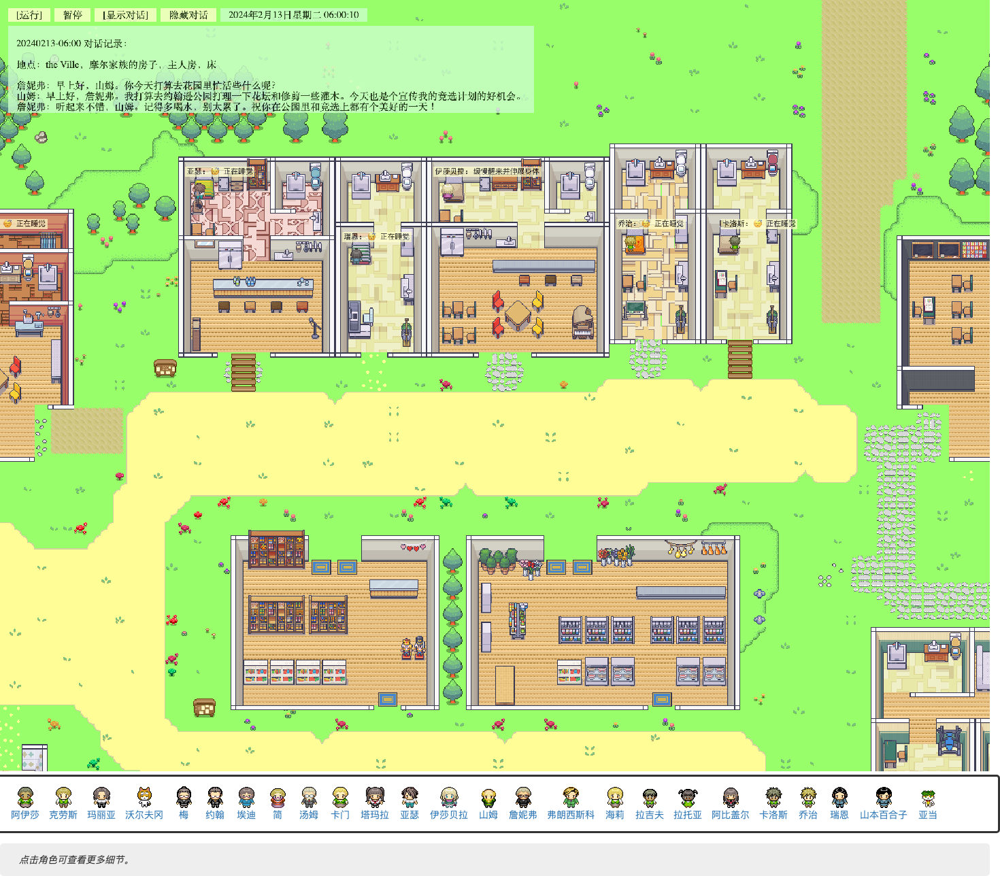
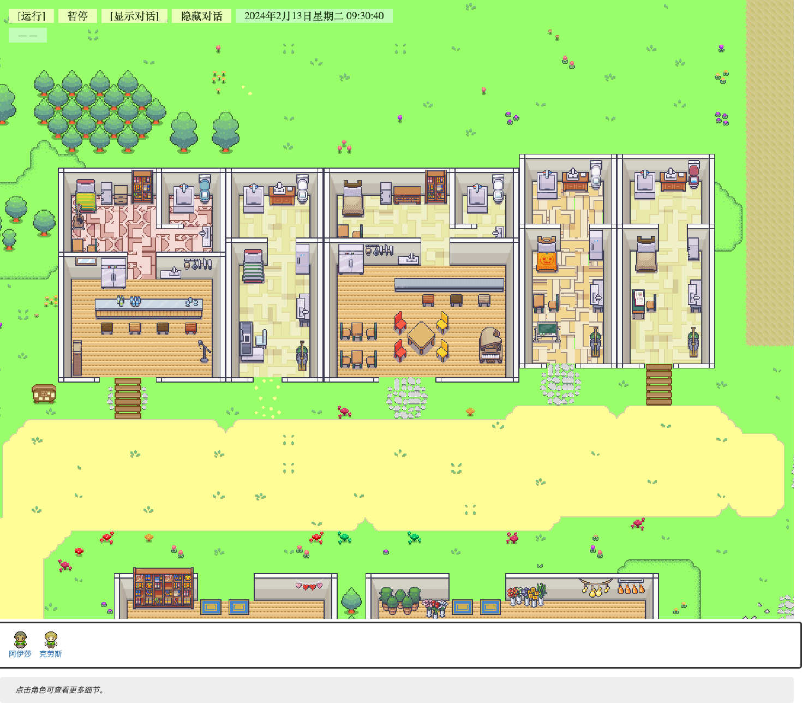

# 第 12 章 把 Generative Agents 跑起来

Generative Agents 是一个可以启动、观察和复盘的项目。第一次运行不要直接开 25 个智能体，先跑一个最小仿真，确认启动、模型调用、checkpoint、压缩和回放链路全部打通，有了手感之后，再把 25 个智能体启动起来。

推荐路径如下：


*图 12-1：第一次运行 Generative Agents 的推荐路径。先看现成结果，再跑小规模实验，最后再进入源码和功能拆解。*

## 12.1 先看一个现成回放

当前仓库已经包含一个示例回放：

```text
generative_agents/results/compressed/example/
```

这个目录里有两个最重要的文件：

| 文件 | 用途 | 重点观察 |
| --- | --- | --- |
| `movement.json` | 给前端回放使用的数据 | 角色位置、动作、对话、回放帧 |
| `simulation.md` | 给人阅读的仿真时间线 | 每个时间点谁在哪里、做了什么、说了什么 |

先不要急着打开网页。读者可以先看一小段真实数据。下面是从 `example/movement.json` 中节选并省略其他角色后的片段：

```json
{
  "start_datetime": "2024-02-13T06:00:00",
  "stride": 10,
  "sec_per_step": 10,
  "persona_init_pos": {
    "阿伊莎": [118, 61],
    "克劳斯": [126, 46],
    "伊莎贝拉": [72, 14],
    "山姆": [36, 65]
  },
  "all_movement": {
    "1": {
      "阿伊莎": {
        "location": "奥克山学院宿舍，阿伊莎的房间，床",
        "movement": [118, 61],
        "action": "起床并拉开窗帘"
      },
      "伊莎贝拉": {
        "location": "伊莎贝拉的公寓，主人房，床",
        "movement": [72, 14],
        "action": "缓慢醒来并伸展身体"
      }
    }
  }
}
```

这段数据可以这样读。`start_datetime` 是回放顶部显示的小镇起点。`stride: 10` 表示每个仿真 step 推进 10 分钟。`persona_init_pos` 保存角色进入地图时的初始坐标，例如阿伊莎在 `[118, 61]`，伊莎贝拉在 `[72, 14]`。`all_movement["1"]` 是第 1 帧，里面每个角色都有 `location`、`movement` 和 `action`。其中 `location` 是给人读的地点文本，`movement` 是给前端定位角色的坐标，`action` 是回放界面里可以显示的动作标签。

这就解释了前端为什么能播放小镇：它不是凭空生成动画，而是在逐帧读取 `movement.json`。如果角色没有出现在预期地点，先看 `movement` 和 `location`。如果动作标签不对，先看 `action`。但如果要解释“为什么模型选择了这个行动”，`movement.json` 不够用，还要回到 checkpoint、日程和 prompt。

同一份结果也会把对话压进 `movement.json`。例如 `example/movement.json` 中 `20240213-06:00` 的对话文本包含：

```text
地点：the Ville，摩尔家族的房子，主人房，床

詹妮弗：早上好，山姆。你今天打算去花园里忙活些什么呢？
山姆：早上好，詹妮弗。我打算去约翰逊公园打理一下花坛和修剪一些灌木。今天也是个宣传我的竞选计划的好机会。
詹妮弗：听起来不错，山姆。记得多喝水，别太累了。祝你在公园里和竞选上都有个美好的一天！
```

这段内容解释了左上角对话记录从哪里来。它也提醒读者：回放页面里的对话，不只是聊天气泡，而是后续做信息传播实验的证据。

再看 `simulation.md`。下面是 `example/simulation.md` 中同一时间点的代表性片段：

```markdown
# 20240213-06:00

## 活动记录：

### 阿伊莎
位置：the Ville，奥克山学院宿舍，阿伊莎的房间，床
活动：起床并拉开窗帘

### 伊莎贝拉
位置：the Ville，伊莎贝拉的公寓，主人房，床
活动：缓慢醒来并伸展身体

## 对话记录：

### 詹妮弗 -> 山姆 @ the Ville，摩尔家族的房子，主人房，床

`詹妮弗`
> 早上好，山姆。你今天打算去花园里忙活些什么呢？

`山姆`
> 早上好，詹妮弗。我打算去约翰逊公园打理一下花坛和修剪一些灌木。今天也是个宣传我的竞选计划的好机会。
```

这段 Markdown 比 JSON 更适合人读。`# 20240213-06:00` 是小镇时间，`位置` 是角色所在的空间地址，`活动` 是这一时刻压缩出来的行为描述，`对话记录` 则按“谁对谁说话、在哪说、说了什么”整理。读 `simulation.md` 时，第一步不是追源码，而是问三个问题：这个角色在哪里，正在做什么，有没有和别人交换信息。

理解了这两个文件分别如何承载“前端回放”和“人类复盘”之后，再打开浏览器看回放就不会只是看热闹了。现在先进入项目运行目录：

```bash
cd generative_agents
```

后续命令都在 `generative_agents/` 目录下执行。本机如果没有全局 `python` 命令，先激活项目虚拟环境，或者把下面命令中的 `python` 替换成 `../.venv/bin/python`。

先启动本地回放服务：

```bash
python replay.py
```

然后在浏览器中打开示例回放地址：

```text
http://127.0.0.1:5000/?name=example&step=0&speed=2&zoom=0.6
```



*图 12-2：内置 `example` 回放页面。页面已经加载出小镇地图、顶部控制按钮、对话记录和底部 25 个角色头像。*

这个页面展示的是 Phaser 前端回放。页面会呈现小镇地图、角色位置、移动路径和对话气泡。这里先建立一个直观印象：Generative Agents 不是聊天窗口，而是一个会随时间推进的虚拟小镇。

这张截图可以这样读：

| 界面区域 | 看到什么 | 说明什么 |
| --- | --- | --- |
| 顶部控制条 | 运行、暂停、显示对话、隐藏对话、当前小镇时间 | 回放不是静态图片，而是按仿真时间推进的动画 |
| 左上对话记录 | 角色之间的对话内容和地点 | 对话被压缩进回放数据，可以在前端展示 |
| 中央地图 | 房间、道路、树木、角色位置和行动标签 | 行动已经落到具体空间，不只是生成一句文本 |
| 底部角色栏 | 25 个角色头像和姓名 | `example` 是完整小镇回放，不是两三个角色的测试样例 |

同一份结果还可以直接读 Markdown：

```text
generative_agents/results/compressed/example/simulation.md
```

浏览器回放适合观察空间和移动，`simulation.md` 适合观察行为叙事和对话内容。两者合起来，构成最适合上手的入口。

## 12.2 确认环境和模型配置

看完现成回放后，再准备运行自己的小实验。项目的模型配置在：

```text
generative_agents/data/config.json
```

不要只确认这个文件存在。第一次打开它时，应该先读出它的层级。下面是当前 `config.json` 的代表性原文，省略了缩进之外的无关留白：

```json
{
  "agent": {
    "percept": {
      "mode": "box",
      "vision_r": 8,
      "att_bandwidth": 8
    },
    "schedule": {
      "max_try": 5,
      "diversity": 5
    },
    "think": {
      "llm": {
        "provider": "minimax",
        "model": "MiniMax-M3",
        "base_url": "https://api.minimaxi.com/v1",
        "api_key": "",
        "max_tokens": 8192
      },
      "interval": 1000,
      "poignancy_max": 150
    },
    "chat_iter": 4,
    "associate": {
      "embedding": {
        "provider": "minimax",
        "model": "embo-01",
        "base_url": "https://api.minimax.chat/v1",
        "api_key": "",
        "group_id": ""
      },
      "retention": 8
    }
  }
}
```

这段 JSON 最外层只有一个 `agent`。这说明它不是某一个角色的人设，而是所有角色共用的运行底座。阿伊莎、克劳斯、伊莎贝拉的性格、生活习惯和初始位置来自各自的 `agent.json`；但它们“看多远”“一次对话聊几轮”“用哪个模型思考”“用哪个 embedding 检索记忆”，都先从这里取得默认规则。

可以按六块来读这个文件：

| 配置块 | 当前原文 | 读法 |
| --- | --- | --- |
| `agent.percept` | `mode: "box"`、`vision_r: 8`、`att_bandwidth: 8` | 角色以方形视野观察附近 tile，半径是 8，每步最多关注 8 个事件。 |
| `agent.schedule` | `max_try: 5`、`diversity: 5` | 生成日程时允许多次尝试，并要求活动有一定多样性。 |
| `agent.think.llm` | `provider: "minimax"`、`model: "MiniMax-M3"` | 日程、地点选择、对话、重要性评分和反思等 LLM 调用都走这组配置。 |
| `agent.think` | `interval: 1000`、`poignancy_max: 150` | `interval` 是思考间隔参数，`poignancy_max` 是反思触发阈值，重要性累计到 150 才会进入 reflection。 |
| `agent.associate` | `embedding.model: "embo-01"`、`retention: 8` | 记忆写入和召回使用 MiniMax embedding，检索时保留有限数量的候选记忆。 |
| `agent.chat_iter` | `4` | 一次对话最多推进 4 轮，避免两个角色无限聊下去。 |

把这几块连起来看，就能理解一个关键事实：Generative Agents 的“人格”不只来自角色卡，也来自运行参数。`vision_r` 太小，角色可能看不见关键事件；`chat_iter` 太小，对话来不及交换信息；`poignancy_max` 太高，角色很久不反思；embedding 配错，记忆检索会失败。第一次运行前读 `config.json`，不是为了背字段，而是确认这套小镇的感知、思考、对话和记忆链路都能工作。

本次实跑使用 `MiniMax-M3` 作为 LLM，使用 `embo-01` 作为 embedding。`config.json` 中的 `api_key` 可以留空，运行时通过 `MINIMAX_API_KEY` 环境变量传入密钥；如果把密钥写进 `config.json`，也能运行，但不要把带密钥的配置提交到公开仓库。

常见模型配置方式可以这样判断：

| 场景 | 配置方式 | 适合情况 |
| --- | --- | --- |
| 本机有 Ollama | `provider: "ollama"`，`base_url` 指向本机服务 | 想低成本反复实验 |
| 使用 OpenAI 兼容接口 | `provider: "openai"`，填写 `base_url`、`api_key`、`model` | 想用云端模型获得更稳定输出 |
| 使用 MiniMax | `provider: "minimax"` | 想测试 MiniMax-M 系列模型，并接受 provider 特殊处理 |

在 Generative Agents 中，模型配置直接决定系统链路能否成立。起床时间、日程生成、地点选择、对话、重要性评分、反思和结构化输出都依赖 LLM；如果 provider、model、base_url 或 embedding 配错，问题首先是运行链路没有打通，而不是小镇行为本身不可信。

## 12.3 运行一个最小仿真

第一次自己跑，不要直接开 25 个角色。最小实验只需要 2 个角色、2 个 step，就能验证启动、模型调用、checkpoint 写入和压缩回放链路是否正常。

```bash
python start.py \
  --name book-smoke \
  --start "20240213-09:30" \
  --step 2 \
  --stride 10 \
  --agent-count 2 \
  --verbose info \
  --log book-smoke.log
```

这条命令里的参数含义如下：

| 参数 | 含义 | 建议 |
| --- | --- | --- |
| `--name book-smoke` | 本次仿真的名称 | 名称不能和已有结果重复 |
| `--start "20240213-09:30"` | 小镇起始时间 | 使用固定时间方便复现实验 |
| `--step 2` | 运行 2 个仿真步 | 第一次只验证链路，不追求故事丰富 |
| `--stride 10` | 每一步推进 10 分钟 | 2 步会覆盖 20 分钟小镇时间 |
| `--agent-count 2` | 只取前 2 个角色运行 | 降低模型调用成本和等待时间 |
| `--verbose info` | 日志级别 | 避免 debug 日志干扰第一次排查 |
| `--log book-smoke.log` | 把日志写入 checkpoint 目录 | 方便跑完后回看控制台输出 |

命令启动后，控制台输出不是普通流水账，而是 agent 仿真的第一份证据。下面节选本次 `book-smoke.log`，省略真实墙钟时间和部分重复行：

```text
---------- 阿伊莎.reset ----------
coord[118,61]: the Ville:奥克山学院宿舍:阿伊莎的房间:床
associate:
  nodes: 0
llm:
  total: S:0,F:0/R:0

========== Simulate Step[1/2, time: 2024-02-13 09:30:00] ==========
阿伊莎 is making schedule...
阿伊莎 -> wake_up
阿伊莎 -> schedule_init
阿伊莎 -> schedule_daily
阿伊莎 -> schedule_decompose
阿伊莎 percept 0/4 concepts
阿伊莎 is determining action...
阿伊莎 -> determine_sector
阿伊莎 -> determine_arena
阿伊莎 -> determine_object
阿伊莎 -> describe_object

---------- 阿伊莎.summary @ 20240213-09:30:00 ----------
action:
  event: 精读关于双关语与隐喻的分析 @ the Ville:奥克山学院宿舍:阿伊莎的房间:书桌
  object: 堆放着分析资料 @ the Ville:奥克山学院宿舍:阿伊莎的房间:书桌
associate:
  nodes: 1
llm:
  total: S:9,F:0/R:9
```

这段输出可以分四层读。`reset` 说明角色已经被放进地图：阿伊莎从宿舍床铺坐标 `[118,61]` 开始，记忆节点数是 0，LLM 调用次数也是 0。`Simulate Step[1/2]` 说明仿真进入第 1 步，小镇时间是 2024 年 2 月 13 日 09:30。`阿伊莎 -> wake_up`、`schedule_init`、`schedule_daily`、`schedule_decompose` 不是普通日志，而是一次次 prompt 调用：系统先生成起床时间和一天大纲，再生成小时级日程，最后把当前小时拆成更细的动作。`determine_sector`、`determine_arena`、`determine_object` 和 `describe_object` 则把抽象计划落到具体空间对象上。

`summary` 是本 step 最值得读的部分。它告诉读者，阿伊莎当前 action 已经从“学习莎士比亚”落到了“在宿舍书桌前精读关于双关语与隐喻的分析”，对象状态是“书桌堆放着分析资料”。`associate.nodes: 1` 表示记忆系统已经写入节点。`S:9,F:0/R:9` 表示 9 次 LLM completion 成功，0 次最终失败，共发起 9 次请求尝试。这个数字很适合第一次排查：如果 `F` 不为 0，或者控制台反复出现 JSON 解析失败，就不要急着看回放，先处理模型和结构化输出问题。

第 2 个 step 的输出会更像一个正在运转的 agent：

```text
========== Simulate Step[2/2, time: 2024-02-13 09:40:00] ==========
阿伊莎 percept 2/4 concepts
阿伊莎 is determining action...
阿伊莎 -> determine_sector
阿伊莎 -> determine_arena
阿伊莎 -> determine_object
阿伊莎 -> describe_object

---------- 阿伊莎.summary @ 20240213-09:40:00 ----------
action:
  event: 精读关于韵律与节奏的论述 @ the Ville:奥克山学院:图书馆:图书馆桌子
associate:
  nodes: 3
llm:
  total: S:15,F:0/R:15
```

这里的 `percept 2/4 concepts` 说明阿伊莎在当前视野中处理了 4 个候选概念，其中 2 个有效写入记忆。`associate.nodes` 从 1 增加到 3，说明第 2 步不只是生成了下一句动作，还把环境对象和自身行动写进了记忆系统。控制台读到这里，读者已经能判断：日程生成、感知、空间定位、动作生成和记忆写入都在工作。

运行成功后，会出现 checkpoint 目录：

```text
generative_agents/results/checkpoints/book-smoke/
```

本次运行生成了下面这些结果文件：

| 文件 | 作用 | 读法 |
| --- | --- | --- |
| `book-smoke.log` | 本次运行日志 | 回看 prompt 调用链、summary、LLM 成功/失败次数 |
| `simulate-20240213-0930.json` | 第 1 个 step 的完整仿真状态 | 检查 `time=20240213-09:30`、`step=1`、两个 agent 状态 |
| `simulate-20240213-0940.json` | 第 2 个 step 的完整仿真状态 | 检查 `time=20240213-09:40`、`step=2`、动作和记忆是否推进 |
| `conversation.json` | 仿真过程中产生的对话记录 | 本次没有触发对话，所以内容是 `{}` |
| `storage/阿伊莎/`、`storage/克劳斯/` | 两个角色各自的记忆索引和持久化存储 | 看 `associate/index_config.json` 和 `associate/docstore.json` |

先看 `simulate-20240213-0940.json` 的顶层结构。可以节选为：

```json
{
  "stride": 10,
  "time": "20240213-09:40",
  "step": 2,
  "agents": {
    "阿伊莎": { "...": "..." },
    "克劳斯": { "...": "..." }
  }
}
```

`stride: 10` 对应启动命令中的 `--stride 10`。`time` 是当前 checkpoint 的小镇时间。`step: 2` 表示这是第 2 个仿真步结束后的状态。`agents` 下面只有阿伊莎和克劳斯，说明 `--agent-count 2` 已经生效。如果这里出现 25 个角色，说明启动参数没有按预期限制 agent 数量。

再看阿伊莎的日程。`simulate-20240213-0930.json` 中，09:00 到 10:00 的小时计划被拆成更细的动作：

```json
{
  "idx": 9,
  "describe": "继续阅读文学评论文章，深入理解伊丽莎白时代戏剧的语言特征",
  "start": 540,
  "duration": 60,
  "decompose": [
    {
      "describe": "精读关于双关语与隐喻的分析",
      "start": 560,
      "duration": 15
    },
    {
      "describe": "精读关于韵律与节奏的论述",
      "start": 575,
      "duration": 15
    }
  ]
}
```

`start: 540` 表示当天第 540 分钟，也就是 09:00。`duration: 60` 表示这个小时计划持续 60 分钟。`decompose` 是 `schedule_decompose` 的结果，它把“继续阅读文学评论文章”拆成 10 到 15 分钟粒度的子任务。第 1 个 step 中，阿伊莎执行的是 09:20 到 09:35 的“精读关于双关语与隐喻的分析”；第 2 个 step 中，她推进到 09:35 到 09:50 的“精读关于韵律与节奏的论述”。这就是短期行为连续性的来源。

再看第 2 个 step 里的当前 action：

```json
{
  "coord": [119, 24],
  "action": {
    "describe": "精读关于韵律与节奏的论述",
    "address": ["the Ville", "奥克山学院", "图书馆", "图书馆桌子"],
    "start": "20240213-09:35:00",
    "duration": 15
  },
  "status": {
    "poignancy": 6
  },
  "associate": {
    "event": ["node_2", "node_1"],
    "thought": ["node_0"],
    "chat": []
  }
}
```

这里能看到三件事。第一，`coord` 已经从初始宿舍位置推进到 `[119,24]`，动作落在图书馆桌子上。第二，`action.start` 和 `duration` 与前面的 `decompose` 对上，说明 schedule 不是孤立文本，而是在驱动当前行为。第三，`associate` 中已经有 event 和 thought，没有 chat，说明这次最小仿真产生了行动记忆和计划记忆，但没有产生对话记忆。

`conversation.json` 也要读。它的完整内容是：

```json
{}
```

空对象不是错误。本次只跑两个角色、两个 step，而且两人没有触发对话，所以没有 conversation 记录。这个文件的价值在于排除误判：如果后续做派对传播实验，`conversation.json` 仍然是 `{}`，才需要怀疑角色没有相遇、没有触发聊天，或者 `decide_chat` 一直返回 false。

最后看 `storage`。本次两个角色的索引配置都是：

```json
{
  "max_nodes": 3
}
```

`index_config.json` 只告诉读者节点数量。真正的内容在 `docstore.json`。以阿伊莎为例，里面可以看到 3 个节点：

```text
node_0 thought: 这是 阿伊莎 在 2024年02月13日（星期二）09:30 的计划...
node_1 event: 书桌 堆放着分析资料
node_2 event: 阿伊莎 精读关于双关语与隐喻的分析
```

这三条说明 memory stream 已经启动。`thought` 保存当天计划，`event` 保存环境对象状态和角色行动。到这里，第一次运行要确认的就不是“两件事”，而是三件事：控制台日志走到 `Simulate Step[2/2]` 并输出 summary；两个 checkpoint JSON 能读出正确的 `time`、`step` 和 agent 状态；`conversation.json` 与 `storage` 的内容符合本次最小实验的预期。

## 12.4 压缩结果

checkpoint 适合系统恢复，不适合人类直接阅读。下一步要把 checkpoint 压缩成回放数据：

```bash
python compress.py --name book-smoke
```

命令成功时，控制台会输出：

```text
Compression completed.
```

压缩成功后，会生成：

```text
generative_agents/results/compressed/book-smoke/
```

压缩结果里重点看两个文件：

| 文件 | 适合谁看 | 说明 |
| --- | --- | --- |
| `movement.json` | 前端和数据分析脚本 | 保存角色位置、动作、对话和回放帧 |
| `simulation.md` | 文本阅读和审稿 | 按时间线呈现每个角色的行动和对话 |

第一次压缩后的 `book-smoke/movement.json` 可以节选成下面这样：

```json
{
  "start_datetime": "2024-02-13T09:30:00",
  "stride": 10,
  "persona_init_pos": {
    "阿伊莎": [118, 61],
    "克劳斯": [126, 46]
  },
  "all_movement": {
    "1": {
      "阿伊莎": {
        "location": "奥克山学院宿舍，阿伊莎的房间，书桌",
        "movement": [118, 61],
        "action": "前往 奥克山学院宿舍，阿伊莎的房间，书桌"
      },
      "克劳斯": {
        "location": "奥克山学院，图书馆，图书馆桌子",
        "movement": [126, 46],
        "action": "前往 奥克山学院，图书馆，图书馆桌子"
      }
    },
    "conversation": {
      "20240213-09:30": "",
      "20240213-09:40": ""
    }
  }
}
```

这段节选直接对应本次启动命令。`start_datetime` 是 `--start "20240213-09:30"` 转换后的 ISO 时间。`persona_init_pos` 只有阿伊莎和克劳斯，说明 `--agent-count 2` 生效。`all_movement["1"]` 说明第一个回放帧里，阿伊莎要去宿舍书桌，克劳斯要去图书馆桌子。`conversation` 里的两个时间点都是空字符串，说明这两个 step 没有产生对话。这不是坏结果，反而说明最小仿真的目标只是验证链路，不是强行制造社交。

第一次压缩后的完整 `movement.json` 包含 122 帧，角色列表只有阿伊莎和克劳斯，起始时间是 `2024-02-13T09:30:00`，步长是 10 分钟。这一步很关键。Generative Agents 的价值不只是“模型生成了文本”，而是仿真结果能被复盘。没有压缩结果，只能看零散日志；有了 `movement.json` 和 `simulation.md`，才能判断角色是否真的在小镇中持续行动。

## 12.5 回放仿真

如果 `replay.py` 已经在运行，可以直接打开：

```text
http://127.0.0.1:5000/?name=book-smoke&step=0&speed=2&zoom=0.8
```



*图 12-3：`book-smoke` 最小仿真的回放页面。底部只剩阿伊莎和克劳斯两个角色，说明 `--agent-count 2` 已经生效。*

如果服务还没启动，先运行：

```bash
python replay.py
```

回放页面有几个常用参数：

| 参数 | 含义 | 示例 |
| --- | --- | --- |
| `name` | 压缩结果名称 | `book-smoke` |
| `step` | 从第几个仿真步开始播放 | `0` 表示从头开始 |
| `speed` | 播放速度，0 最慢，5 最快 | `2` 适合观察 |
| `zoom` | 地图缩放比例 | `0.8` 适合初看 |

如果浏览器提示找不到数据文件，通常说明还没有执行 `compress.py --name book-smoke`，或者 `name` 参数和压缩目录不一致。

图 12-3 需要重点看三个地方。第一，顶部时间显示为 2024 年 2 月 13 日上午 9 点 30 分后的小镇时间，说明回放读取了 `movement.json` 中的仿真起点。第二，底部角色栏只有两个头像，说明本次不是完整小镇，而是最小仿真。第三，画面仍然是同一张 Smallville 地图，说明缩小 agent 数量不会改变世界模型，只是减少参与仿真的角色。

## 12.6 阅读行为

回放页面呈现空间，`simulation.md` 呈现行为，路径如下：

```text
generative_agents/results/compressed/book-smoke/simulation.md
```

本次 `simulation.md` 前面会先列出基础人设，时间线从 `# 20240213-09:30` 开始。原文片段如下：

```markdown
# 20240213-09:30

## 活动记录：

### 阿伊莎
位置：the Ville，奥克山学院宿舍，阿伊莎的房间，书桌
活动：精读关于双关语与隐喻的分析

### 克劳斯
位置：the Ville，奥克山学院，图书馆，图书馆桌子
活动：阅读并批注选中的学术文章

# 20240213-09:40

## 活动记录：

### 阿伊莎
位置：the Ville，奥克山学院，图书馆，图书馆桌子
活动：精读关于韵律与节奏的论述
```

这段比表格更接近读者实际会看到的文件。`# 20240213-09:30` 是 checkpoint 时间，不是现实世界时间。`位置` 说明行动落在小镇地址树上，不只是模型说“我在学习”。`活动` 是当前 action 的人类可读摘要。09:30 时阿伊莎和克劳斯都有活动；09:40 只出现阿伊莎，是因为 `generate_report()` 会跳过与上次完全相同的状态，Markdown 不是每个 step 的完整快照，而是更适合阅读的变化记录。

阅读 `simulation.md` 时，建议先按顺序看五类信息：

| 阅读顺序 | 观察点 | 判断问题 |
| --- | --- | --- |
| 1 | 时间线 | 仿真是否按 `start` 和 `stride` 正常推进 |
| 2 | 角色行动 | 每个角色是否有清楚的行动描述 |
| 3 | 地点变化 | 角色是否真的在地图上移动，而不是只生成文本 |
| 4 | 对话内容 | 对话是否符合角色身份和当前场景 |
| 5 | 前后连续性 | 后一个时间点是否承接前一个时间点的计划、地点或对话 |

前四项回答“这次仿真是否跑起来”，第五项才开始回答“这个 agent 是否可信”。例如，阿伊莎如果 09:30 在写论文，09:40 继续围绕莎士比亚语言做笔记，这说明角色的短期行为有连续性；如果她突然出现在不相关地点，并且行动与前文没有联系，就要回到 checkpoint、日程 prompt 或地点选择逻辑继续排查。

如果只跑 2 个 step，故事不会很精彩，这是正常的。最小仿真不用于复现论文里的派对传播，而是用于确认项目链路完整：启动、思考、保存、压缩、回放、阅读。

## 12.7 断点恢复

项目支持从已有 checkpoint 继续运行。假设 `book-smoke` 已经运行过，可以继续追加 2 个 step：

```bash
python start.py \
  --name book-smoke \
  --resume \
  --step 2 \
  --stride 10 \
  --verbose info
```

断点恢复会读取下面这个 checkpoint 目录：

```text
generative_agents/results/checkpoints/book-smoke/
```

恢复运行后，还需要重新压缩：

```bash
python compress.py --name book-smoke
```

重新压缩后，再打开从第 3 个 step 开始的回放地址：

```text
http://127.0.0.1:5000/?name=book-smoke&step=3&speed=2&zoom=0.8
```


*图 12-4：`book-smoke` 断点恢复后的回放页面。顶部时间已经推进到 2024 年 2 月 13 日 09:50 后，说明回放从追加后的第 3 个 step 开始。*

断点恢复后的 checkpoint 目录新增了两个文件：

| 新增文件 | 含义 |
| --- | --- |
| `simulate-20240213-0950.json` | 恢复运行后的第 3 个 step |
| `simulate-20240213-1000.json` | 恢复运行后的第 4 个 step |

重新压缩后，`movement.json` 从第一次压缩时的 122 帧扩展到 243 帧，`simulation.md` 也新增了 `20240213-09:50` 和 `20240213-10:00` 两段记录。

| 小镇时间 | 阿伊莎 | 克劳斯 |
| --- | --- | --- |
| `20240213-09:50` | 继续停留在前一段“精读关于韵律与节奏的论述”动作中，状态被 checkpoint 延续 | 开始撰写论文中关于中产阶级化影响的段落 |
| `20240213-10:00` | 整理书本和笔记本准备出门 | 继续围绕中产阶级化影响段落写作，记忆节点增加到 6 个 |

断点恢复的意义是让长时间实验可控：先跑很短的片段，确认效果，再逐步延长，而不是一次性跑完整天。图 12-4 的顶部时间和新增 checkpoint 文件，是判断恢复成功的两个最直接证据。

## 12.8 第一次运行的排错表

第一次启动项目时，问题通常集中在环境、模型、结果目录和回放数据四类。

| 现象 | 常见原因 | 处理方式 |
| --- | --- | --- |
| `name already exists` | 仿真名称已经有 checkpoint | 换一个 `--name`，或使用 `--resume` |
| LLM 调用失败 | `config.json` 中 provider、model、base_url 或 api_key 不正确 | 先确认模型服务能被访问，再跑最小仿真 |
| embedding 失败 | 本地 embedding 模型没有拉取或接口地址不对 | 检查 `agent.associate.embedding` 配置 |
| MiniMax 调用中出现临时 `SSLEOFError` | 远端连接偶发中断 | 如果最终 checkpoint 正常生成，可以忽略；如果反复出现，重新运行或检查网络 |
| 回放页面提示数据不存在 | 只运行了 `start.py`，还没执行 `compress.py` | 先运行 `python compress.py --name <name>` |
| 回放能打开但没有预期角色 | `--agent-count` 或 `--agents` 限制了运行角色 | 检查启动命令中的角色参数 |
| `simulation.md` 很短 | step 太少 | 先确认链路，再逐步增加 step |

这张表不覆盖所有异常，只处理第一轮启动最常见的问题。Generative Agents 是多模块系统，运行失败时不要立刻怀疑论文思想，先确认项目链路是否完整。

## 12.9 小结

到这里，项目已经完成一次最小闭环：看到示例回放，跑出自己的 checkpoint，再把结果压缩成可回放、可阅读的材料。

| 已完成动作 | 意义 |
| --- | --- |
| 打开 `example` 回放 | 不需要模型也能先看到项目效果 |
| 检查 `config.json` | 知道 LLM 和 embedding 是运行前提 |
| 运行 `book-smoke` 最小仿真 | 验证启动、模型调用和 checkpoint 链路 |
| 执行 `compress.py` | 把系统状态转成回放和阅读材料 |
| 打开 `replay.py` 页面 | 观察小镇地图、角色移动和对话 |
| 阅读 `simulation.md` | 用文本方式复盘角色行为 |
| 尝试 `--resume` | 理解长时间仿真如何分段运行 |

这些操作结果已经落到三个地方：`results/checkpoints/book-smoke/` 保存可恢复的系统状态，`results/compressed/book-smoke/movement.json` 支持浏览器回放，`results/compressed/book-smoke/simulation.md` 支持文本复盘。只要这三个产物同时存在，Generative Agents 的最小运行闭环就成立。

下一章沿着已经跑通的项目，一项项体验它提供的核心能力：角色定义、日程、感知、记忆、对话、反思、回放和模型适配。先知道每个功能长什么样，第三部分再深入看这些功能是怎么写出来的。

## 参考资料

- Local README: `README.md`
- Local config: `generative_agents/data/config.json`
- Run entry: `generative_agents/start.py`
- Compression entry: `generative_agents/compress.py`
- Replay entry: `generative_agents/replay.py`
- Example replay: `generative_agents/results/compressed/example/`
