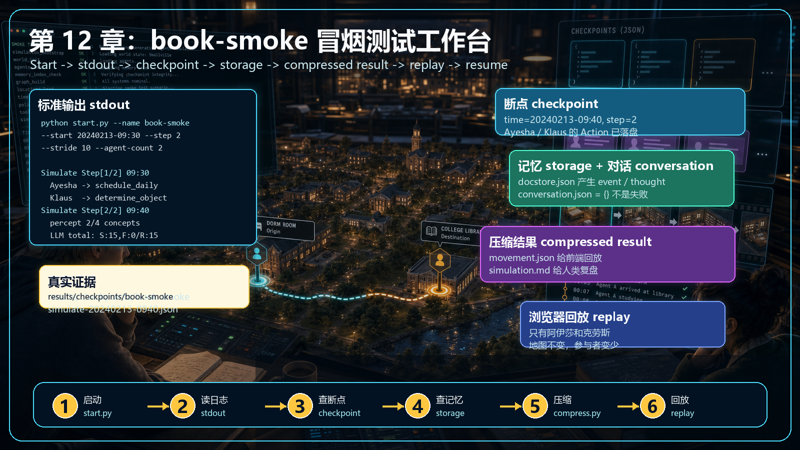
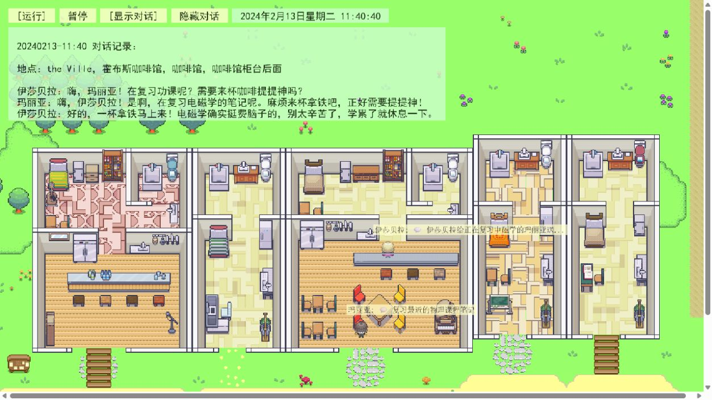
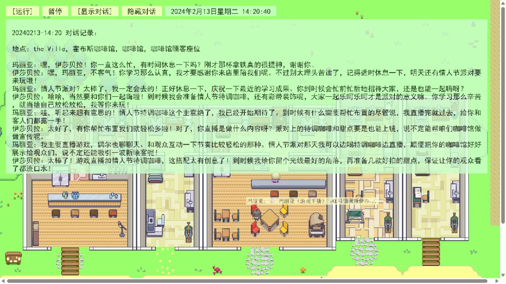

# 第 12 章 把 Generative Agents 跑起来

第一次运行 Generative Agents，不能只验证“程序没有报错”。如果冒烟测试 Smoke Test 太短，项目只会生成日程、行动和记忆，第一部分讲过的反应 Reacting、对话 Dialogue、记忆流 Memory Stream 和回放 replay 仍然不会进入同一条证据链。

本章使用同一场真实实验作为证据：

```text
book-smoke
```

`book-smoke` 从 `20240213-10:00` 开始，只运行玛丽亚 Maria Lopez 和伊莎贝拉 Isabella Rodriguez 两个角色，分三段推进到 `20240213-15:20`。这场实验足够小，日志还能读；又足够完整，能看到日程 Planning、空间行动 Action、感知 Perception、反应 Reacting、对话 Dialogue、聊天记忆 chat memory、压缩结果 compressed result、浏览器回放 replay 和断点恢复 resume。



*图 12-1：`book-smoke` 冒烟测试 Smoke Test 的证据工作台。左侧是启动命令和标准输出 stdout，右侧是断点 checkpoint、记忆 storage、压缩结果 compressed result 和浏览器回放 replay。*

## 12.1 综合冒烟测试 Smoke Test 要验证什么

`book-smoke` 的目标是把第一部分的核心能力压到一条可检查的运行链路里：

```text
角色设定 Persona
-> 日程 Planning
-> 空间行动 Action
-> 感知 Perception
-> 反应 Reacting
-> 对话 Dialogue
-> 记忆流 Memory Stream
-> 压缩结果 compressed result
-> 浏览器回放 replay
-> 断点恢复 resume
```

本章不把它写成大规模社会实验。它只回答一个工程问题：项目能不能从命令行启动，真实调用模型，把小镇时间推起来，让角色在咖啡馆里行动、相遇、对话、写入记忆，并把结果压缩成可回放、可复盘、可续跑的文件。

| 验证点 | 证据文件或输出 | 成功信号 |
| --- | --- | --- |
| 指定角色启动 | `book-smoke.log`、checkpoint 的 `agents` 字段 | 只出现玛丽亚 Maria Lopez 和伊莎贝拉 Isabella Rodriguez |
| 日程 Planning 生成 | 标准输出 stdout | 出现 `wake_up`、`schedule_init`、`schedule_daily`、`schedule_decompose` |
| 空间行动 Action 落地 | `simulate-*.json` | `action.event.address` 落到霍布斯咖啡馆、宿舍、供应店等空间 |
| 感知 Perception 发生 | 标准输出 stdout | 出现 `percept x/y concepts` |
| 反应 Reacting 命中 | `conversation.json`、`action.event.predicate="对话"` | 11:40 和 14:20 都产生真实对话 |
| 对话 Dialogue 写回 | `conversation.json` | 保存逐轮发言和对话地点 |
| 记忆流 Memory Stream 写入 | `storage/<角色>/associate/docstore.json` | 两个角色都出现 `node_type="chat"` 的记忆节点 |
| 压缩结果 compressed result | `movement.json`、`simulation.md` | 回放数据和人类可读时间线同时生成 |
| 浏览器回放 replay | `replay.py` 页面截图 | 地图上能看到咖啡馆对话 |
| 断点恢复 resume | `book-smoke-resume-1.log`、`book-smoke-resume-2.log` | 从已有 checkpoint 继续推进，而不是从头重跑 |

反思 Reflection 在这场冒烟测试中只验证边界。最终断点中，玛丽亚 Maria Lopez 的触动程度 poignancy 为 `87`，伊莎贝拉 Isabella Rodriguez 为 `111`，都没有达到当前配置的 `poignancy_max=150`。因此本章不声称触发了反思；它只证明对话、记忆和状态已经形成了后续反思可读取的输入。

## 12.2 运行前检查：目录、模型配置和环境变量

运行命令在项目运行目录执行：

```powershell
cd D:\code\GenerativeAgentsCN\generative_agents
```

模型配置文件：

```text
generative_agents/data/config.json
```

本章只需要关注这几组配置：

```json
{
  "agent": {
    "percept": {
      "mode": "box",
      "vision_r": 8,
      "att_bandwidth": 8
    },
    "think": {
      "llm": {
        "provider": "minimax",
        "model": "MiniMax-M3",
        "base_url": "https://api.minimaxi.com/v1",
        "api_key": "",
        "max_tokens": 8192
      },
      "poignancy_max": 150
    },
    "chat_iter": 4,
    "associate": {
      "embedding": {
        "provider": "minimax",
        "model": "embo-01",
        "base_url": "https://api.minimax.chat/v1",
        "api_key": "",
        "group_id": ""
      },
      "retention": 8
    }
  }
}
```

| 配置项 | 中文含义 | 对冒烟测试的影响 |
| --- | --- | --- |
| 感知半径 `vision_r` | 角色每一步能观察多大范围 | 决定 `percept x/y concepts` 的候选事件数量 |
| 对话轮数 `chat_iter` | 一次对话最多生成多少轮 | 本章 14:20 的对话展开到 8 句，受这个配置约束 |
| 思考模型 `think.llm` | 大语言模型 LLM 配置 | 起床、日程、地点选择、对话生成都依赖它 |
| 触动阈值 `poignancy_max` | 触发反思 Reflection 的累计阈值 | 本章最终没有达到 `150`，所以反思不触发 |
| 向量嵌入 `associate.embedding` | 记忆检索用的 embedding 配置 | 写入记忆和后续检索都需要它 |

`api_key` 留空不是错误。MiniMax 的密钥从环境变量 environment variable 读取：

```powershell
$env:MINIMAX_API_KEY
```

配置检查只回答一个问题：启动链路是否具备模型调用、向量嵌入 embedding、记忆写入和长时间续跑的基础条件。

## 12.3 启动 book-smoke：角色列表、命令和标准输出 stdout

`start.py` 同时支持两种角色选择方式：

```python
parser.add_argument("--agent-count", type=int, default=0, help="Limit the number of agents for a lightweight local run")
parser.add_argument("--agents", type=str, default="", help="Comma-separated agent names to run")

if args.agents:
    selected_personas = [a.strip() for a in args.agents.split(",") if a.strip()]
elif args.agent_count > 0:
    selected_personas = personas[:args.agent_count]
```

`--agent-count 2` 依赖源码里的角色列表顺序。综合冒烟测试必须稳定复现具体人物，因此本章直接使用 `--agents` 写明角色列表：

```powershell
python start.py --name book-smoke --start "20240213-10:00" --step 8 --stride 10 --agents "玛丽亚,伊莎贝拉" --verbose info --log book-smoke.log
```

如果本地已经存在同名实验，重新生成前可以删除旧结果：

```powershell
Remove-Item -Recurse -Force results/checkpoints/book-smoke, results/compressed/book-smoke
```

这条删除命令只在需要覆盖同名实验时执行。日常试跑可以换一个新名字，例如 `book-smoke-local`。

| 参数 | 中文含义 | 本章取值的作用 |
| --- | --- | --- |
| `--name book-smoke` | 实验名称 | 决定 checkpoint 和压缩结果目录名 |
| `--start "20240213-10:00"` | 小镇起始时间 | 从 2024 年 2 月 13 日 10:00 开始 |
| `--step 8` | 第一段仿真步数 | 先跑到 11:10，观察角色是否进入咖啡馆前的生活轨迹 |
| `--stride 10` | 每步推进分钟数 | 每个 step 推进 10 分钟 |
| `--agents "玛丽亚,伊莎贝拉"` | 指定角色列表 | 固定运行玛丽亚 Maria Lopez 和伊莎贝拉 Isabella Rodriguez |
| `--verbose info` | 日志级别 | 保留关键调用链，避免 debug 输出淹没证据 |
| `--log book-smoke.log` | 日志文件 | 写入 `results/checkpoints/book-smoke/book-smoke.log` |

日志路径：

```text
generative_agents/results/checkpoints/book-smoke/book-smoke.log
```

Windows 下日志文件按本地 GBK 编码保存。如果直接用 UTF-8 打开出现乱码，换成 GBK 或系统默认中文编码即可。

第一段日志的代表性原文：

```text
==========       Simulate Step[1/8, time: 2024-02-13 10:00:00]        ==========
玛丽亚 is making schedule...
玛丽亚 -> wake_up
玛丽亚 -> schedule_init
玛丽亚 -> schedule_daily
玛丽亚 -> poignancy_event
玛丽亚 -> schedule_decompose
玛丽亚 percept 0/5 concepts
玛丽亚 is determining action...
玛丽亚 -> determine_sector
玛丽亚 -> determine_object
玛丽亚 -> describe_object
```

这段输出已经把第一部分的多个模块串起来：日程 Planning 生成一天计划，触动程度 poignancy 计算记忆重要性，感知 Perception 读取附近概念，空间落地把计划变成具体行动 Action。

第 8 个 step 结束时：

```text
==========       Simulate Step[8/8, time: 2024-02-13 11:10:00]        ==========
玛丽亚 -> poignancy_event
玛丽亚 -> poignancy_event
玛丽亚 percept 2/5 concepts
玛丽亚 is determining action...
玛丽亚 -> determine_sector
玛丽亚 -> determine_object
玛丽亚 -> describe_object
```

第一段没有对话，这是正常的。此时玛丽亚 Maria Lopez 已经走到霍布斯咖啡馆，伊莎贝拉 Isabella Rodriguez 正在柜台招呼顾客，系统还需要继续推进，才会出现稳定的对话触发。

## 12.4 断点 checkpoint：从行动到首次对话

第一段运行结束后，checkpoint 目录已经生成：

```text
generative_agents/results/checkpoints/book-smoke/
```

代表性断点：

| 文件 | 小镇时间 | 观察重点 |
| --- | --- | --- |
| `simulate-20240213-1000.json` | `20240213-10:00` | 两个角色初始化日程和第一步行动 |
| `simulate-20240213-1110.json` | `20240213-11:10` | 玛丽亚到达咖啡馆，伊莎贝拉在柜台工作 |
| `simulate-20240213-1200.json` | `20240213-12:00` | 首次对话已经写入记忆 |
| `simulate-20240213-1420.json` | `20240213-14:20` | 第二次对话命中，行动被改写为对话 |
| `simulate-20240213-1520.json` | `20240213-15:20` | 长时间续跑后的最终状态 |

`simulate-20240213-1110.json` 中，两个角色已经进入同一个生活场景：

```json
{
  "time": "20240213-11:10",
  "step": 8,
  "agents": {
    "玛丽亚": {
      "coord": [76, 23],
      "status": {"poignancy": 13},
      "action": {
        "event": {
          "subject": "玛丽亚",
          "predicate": "此时",
          "object": "步行到霍布斯咖啡馆",
          "describe": "步行到霍布斯咖啡馆",
          "address": ["the Ville", "霍布斯咖啡馆", "咖啡馆", "咖啡馆顾客座位"]
        }
      },
      "associate": {"memory": {"event": 12, "thought": 1, "chat": 0}}
    },
    "伊莎贝拉": {
      "coord": [78, 19],
      "status": {"poignancy": 28},
      "action": {
        "event": {
          "subject": "伊莎贝拉",
          "predicate": "此时",
          "object": "招呼顾客并为顾客点单",
          "describe": "招呼顾客并为顾客点单",
          "address": ["the Ville", "霍布斯咖啡馆", "咖啡馆", "咖啡馆柜台后面"]
        }
      },
      "associate": {"memory": {"event": 12, "thought": 1, "chat": 0}}
    }
  }
}
```

这段断点可以按输入 input、处理 process、输出 output 读：

| 层次 | 字段 | 含义 |
| --- | --- | --- |
| 输入 input | `coord`、`time`、角色日程 | 两个角色在 11:10 已经接近霍布斯咖啡馆 |
| 处理 process | `action.event.address` | 计划被落到咖啡馆顾客座位和柜台后面 |
| 输出 output | `associate.memory`、`status.poignancy` | 行动和环境事件写入记忆，触动程度继续累计 |

继续推进后，`simulate-20240213-1200.json` 显示首次对话已经进入两个角色的记忆：

```json
{
  "time": "20240213-12:00",
  "step": 13,
  "agents": {
    "玛丽亚": {
      "status": {"poignancy": 26},
      "associate": {"memory": {"event": 20, "thought": 1, "chat": 1}},
      "action": {
        "event": {
          "describe": "在咖啡馆找座位坐下并放好随身物品",
          "address": ["the Ville", "霍布斯咖啡馆", "咖啡馆", "咖啡馆顾客座位"]
        }
      }
    },
    "伊莎贝拉": {
      "status": {"poignancy": 43},
      "associate": {"memory": {"event": 21, "thought": 1, "chat": 1}},
      "action": {
        "event": {
          "describe": "招待顾客，继续完善装饰品清单",
          "address": ["the Ville", "霍布斯咖啡馆", "咖啡馆", "社区公告板"]
        }
      }
    }
  }
}
```

`chat: 1` 是本章的第一个关键成功信号。它说明对话不只是写进全局 `conversation.json`，也进入了每个角色自己的关联记忆 Associate。

## 12.5 对话 conversation 与记忆 storage：Part 01 能力是否闭环

对话文件路径：

```text
generative_agents/results/checkpoints/book-smoke/conversation.json
```

`book-smoke` 产生了两次对话：

```json
{
  "20240213-11:40": [
    {
      "伊莎贝拉 -> 玛丽亚 @ the Ville，霍布斯咖啡馆，咖啡馆，咖啡馆柜台后面": [
        ["伊莎贝拉", "嗨，玛丽亚！在复习功课呢？需要来杯咖啡提提神吗？"],
        ["玛丽亚", "嗨，伊莎贝拉！是啊，在复习电磁学的笔记呢。麻烦来杯拿铁吧，正好需要提提神！"],
        ["伊莎贝拉", "好的，一杯拿铁马上来！电磁学确实挺费脑子的，别太辛苦了，学累了就休息一下。"]
      ]
    }
  ],
  "20240213-14:20": [
    {
      "玛丽亚 -> 伊莎贝拉 @ the Ville，霍布斯咖啡馆，咖啡馆，咖啡馆顾客座位": [
        ["玛丽亚", "嘿，伊莎贝拉！你一直这么忙，有时间休息一下吗？刚才那杯拿铁真的很提神，谢谢你。"],
        ["伊莎贝拉", "嘿，玛丽亚，不客气！你学习那么认真，我才要感谢你来店里陪我们呢。不过别太埋头苦读了，记得适时休息一下，明天还有情人节派对要来玩哦！"],
        ["玛丽亚", "情人节派对？太棒了，我一定会去的！正好休息一下，庆祝一下最近的学习成果。你到时候会忙前忙后地招待大家，还是也能一起嗨呀？"]
      ]
    }
  ]
}
```

这里保留了 14:20 对话的前三句。完整文件中，这次对话继续谈到玛丽亚 Maria Lopez 帮忙布置情人节派对、直播展示咖啡馆、伊莎贝拉 Isabella Rodriguez 准备特调咖啡和甜点。

14:20 的断点把对话写成了当前行动 Action：

```json
{
  "time": "20240213-14:20",
  "step": 27,
  "agents": {
    "玛丽亚": {
      "status": {"poignancy": 64},
      "associate": {"memory": {"event": 48, "thought": 1, "chat": 1}},
      "action": {
        "event": {
          "subject": "玛丽亚",
          "predicate": "对话",
          "object": "伊莎贝拉",
          "describe": "玛丽亚（游戏主播）与咖啡馆老板伊莎贝拉约定情人节派对，玛丽亚将帮忙布置并直播，伊莎贝拉准备特调咖啡和甜点。",
          "address": ["the Ville", "霍布斯咖啡馆", "咖啡馆", "咖啡馆顾客座位"]
        },
        "duration": 2
      }
    },
    "伊莎贝拉": {
      "status": {"poignancy": 84},
      "associate": {"memory": {"event": 49, "thought": 1, "chat": 2}},
      "action": {
        "event": {
          "subject": "伊莎贝拉",
          "predicate": "对话",
          "object": "玛丽亚",
          "describe": "玛丽亚（游戏主播）与咖啡馆老板伊莎贝拉约定情人节派对，玛丽亚将帮忙布置并直播，伊莎贝拉准备特调咖啡和甜点。",
          "address": ["the Ville", "霍布斯咖啡馆", "咖啡馆", "咖啡馆柜台后面"]
        },
        "duration": 2
      }
    }
  }
}
```

这就是反应 Reacting 的证据：角色原本有自己的日程和行动，现场相遇后，当前行动 Action 被改写成 `predicate="对话"` 的事件。

聊天记忆 chat memory 写在每个角色自己的本地索引里：

```text
generative_agents/results/checkpoints/book-smoke/storage/玛丽亚/associate/docstore.json
generative_agents/results/checkpoints/book-smoke/storage/伊莎贝拉/associate/docstore.json
```

代表性节点：

| 角色 | 节点 | `node_type` | 文本 `text` | `poignancy` |
| --- | --- | --- | --- | --- |
| 伊莎贝拉 Isabella Rodriguez | `node_19` | `chat` | 伊莎贝拉给正在复习电磁学的玛丽亚送上一杯拿铁咖啡，并提醒她注意休息。 | 2 |
| 玛丽亚 Maria Lopez | `node_19` | `chat` | 伊莎贝拉给正在复习电磁学的玛丽亚送上一杯拿铁咖啡，并提醒她注意休息。 | 2 |
| 伊莎贝拉 Isabella Rodriguez | `node_49` | `chat` | 玛丽亚（游戏主播）与咖啡馆老板伊莎贝拉约定情人节派对，玛丽亚将帮忙布置并直播，伊莎贝拉准备特调咖啡和甜点。 | 4 |
| 玛丽亚 Maria Lopez | `node_50` | `chat` | 玛丽亚（游戏主播）与咖啡馆老板伊莎贝拉约定情人节派对，玛丽亚将帮忙布置并直播，伊莎贝拉准备特调咖啡和甜点。 | 6 |

同一段对话会被双方各自保存。`subject` 和 `object` 会随角色视角变化，文本摘要基本一致，触动程度 poignancy 可能不同。这正是记忆流 Memory Stream 的工程含义：同一个世界事件进入不同角色的个人记忆后，会拥有各自的归属、重要性和后续检索入口。

最终断点 `simulate-20240213-1520.json` 给出长时间运行后的累计状态：

```json
{
  "time": "20240213-15:20",
  "step": 33,
  "agents": {
    "玛丽亚": {
      "status": {"poignancy": 87},
      "associate": {"memory": {"event": 60, "thought": 1, "chat": 2}},
      "action": {
        "event": {
          "describe": "阅读物理教材新章节",
          "address": ["the Ville", "霍布斯咖啡馆", "咖啡馆", "社区公告板"]
        }
      }
    },
    "伊莎贝拉": {
      "status": {"poignancy": 111},
      "associate": {"memory": {"event": 63, "thought": 1, "chat": 2}},
      "action": {
        "event": {
          "describe": "清点派对装饰材料（气球、彩带等）",
          "address": ["the Ville", "哈维奥克供应店", "供应店", "供应店产品货架"]
        }
      }
    }
  }
}
```

到这里，Part 01 的主链路已经出现：人物定义 Persona 进入运行，日程 Planning 生成生活节奏，空间行动 Action 落到具体地址，感知 Perception 让角色看见现场，反应 Reacting 触发对话 Dialogue，对话又写回记忆流 Memory Stream。

## 12.6 压缩结果 compressed result：movement.json 与 simulation.md

checkpoint 适合恢复运行，不适合直接阅读。压缩命令把断点结果转成前端回放和文本复盘材料：

```powershell
python compress.py --name book-smoke
```

压缩结果目录：

```text
generative_agents/results/compressed/book-smoke/
```

| 文件 | 用途 | 读法 |
| --- | --- | --- |
| `movement.json` | 前端回放 replay 数据 | 看角色坐标、动作、帧和对话气泡 |
| `simulation.md` | 人类阅读的仿真时间线 | 看每个小镇时间点谁在哪里、做什么、说什么 |

`movement.json` 的顶层结构：

```json
{
  "start_datetime": "2024-02-13T10:00:00",
  "stride": 10,
  "sec_per_step": 10,
  "persona_init_pos": {
    "玛丽亚": [123, 57],
    "伊莎贝拉": [72, 14]
  },
  "all_movement": {
    "1": {},
    "2": {},
    "conversation": {
      "20240213-11:40": "\n地点：the Ville，霍布斯咖啡馆，咖啡馆，咖啡馆柜台后面\n\n伊莎贝拉：嗨，玛丽亚！在复习功课呢？需要来杯咖啡提提神吗？\n...",
      "20240213-14:20": "\n地点：the Ville，霍布斯咖啡馆，咖啡馆，咖啡馆顾客座位\n\n玛丽亚：嘿，伊莎贝拉！你一直这么忙，有时间休息一下吗？刚才那杯拿铁真的很提神，谢谢你。\n..."
    }
  }
}
```

`start_datetime` 是回放起点。`persona_init_pos` 是角色初始坐标。数字键 `"1"`、`"2"` 一直延伸到后续帧，保存每一帧的角色位置和动作。对话不在顶层，而在 `all_movement["conversation"]` 里；如果查错路径，会误以为回放没有对话。

`simulation.md` 中 11:40 的片段：

```markdown
# 20240213-11:40

## 活动记录：

### 伊莎贝拉
位置：the Ville，霍布斯咖啡馆，咖啡馆，咖啡馆柜台后面
活动：伊莎贝拉给正在复习电磁学的玛丽亚送上一杯拿铁咖啡，并提醒她注意休息。

## 对话记录：

### 伊莎贝拉 -> 玛丽亚 @ the Ville，霍布斯咖啡馆，咖啡馆，咖啡馆柜台后面

`伊莎贝拉`
> 嗨，玛丽亚！在复习功课呢？需要来杯咖啡提提神吗？

`玛丽亚`
> 嗨，伊莎贝拉！是啊，在复习电磁学的笔记呢。麻烦来杯拿铁吧，正好需要提提神！
```

14:20 的片段：

```markdown
# 20240213-14:20

## 活动记录：

### 玛丽亚
位置：the Ville，霍布斯咖啡馆，咖啡馆，咖啡馆顾客座位
活动：玛丽亚（游戏主播）与咖啡馆老板伊莎贝拉约定情人节派对，玛丽亚将帮忙布置并直播，伊莎贝拉准备特调咖啡和甜点。

### 伊莎贝拉
位置：the Ville，霍布斯咖啡馆，咖啡馆，咖啡馆柜台后面
活动：玛丽亚（游戏主播）与咖啡馆老板伊莎贝拉约定情人节派对，玛丽亚将帮忙布置并直播，伊莎贝拉准备特调咖啡和甜点。
```

`movement.json` 面向前端，回答“角色如何移动和显示”。`simulation.md` 面向复盘，回答“这段仿真读起来发生了什么”。两者来自同一组 checkpoint，只是服务不同阅读场景。

## 12.7 浏览器回放 replay：确认咖啡馆对话真的出现

启动回放服务：

```powershell
python replay.py
```

打开首次对话附近的回放：

```text
http://127.0.0.1:5000/?name=book-smoke&step=11&speed=0&zoom=0.75
```



*图 12-2：`book-smoke` 在 11:40 的浏览器回放 replay。画面上方显示伊莎贝拉 Isabella Rodriguez 与玛丽亚 Maria Lopez 的拿铁对话，地图位置落在霍布斯咖啡馆。*

回放地址中的参数：

| 参数 | 中文含义 | 本章取值 |
| --- | --- | --- |
| `name` | 压缩结果名称 | `book-smoke` |
| `step` | 回放起始步 | `11`，对应 11:40 附近 |
| `speed` | 播放速度 | `0`，停住画面便于截图 |
| `zoom` | 地图缩放比例 | `0.75` |

打开第二次对话附近的回放：

```text
http://127.0.0.1:5000/?name=book-smoke&step=27&speed=0&zoom=0.75
```



*图 12-3：`book-smoke` 在 14:20 的浏览器回放 replay。玛丽亚 Maria Lopez 和伊莎贝拉 Isabella Rodriguez 讨论情人节派对、直播、特调咖啡和甜点，说明长时间续跑后的社交事件也进入了可视化结果。*

回放页面要确认三件事：第一，顶部小镇时间和 `simulation.md` 对得上；第二，地图上角色位置确实在霍布斯咖啡馆；第三，对话气泡来自 `movement.json` 的 `all_movement["conversation"]`，不是手工写在网页里的静态文本。

## 12.8 断点恢复 resume：继续跑到对话和长时间状态

第一段运行到 11:10，还没有产生对话。继续运行时，不需要从 10:00 重跑，直接使用断点恢复 resume：

```powershell
python start.py --name book-smoke --resume --step 5 --stride 10 --verbose info --log book-smoke-resume-1.log
```

这段从 11:20 推进到 12:00，产生了 11:40 的首次对话。日志中的关键链路：

```text
==========       Simulate Step[9/13, time: 2024-02-13 11:20:00]       ==========
玛丽亚 -> poignancy_event
玛丽亚 percept 1/5 concepts

----------              玛丽亚.summary @ 20240213-11:40:00               ----------
玛丽亚 -> decide_chat
status:
  poignancy: 21
concepts:
  node_15:
    event(P.1): 咖啡馆顾客座位 正被坐着使用 @ the Ville:霍布斯咖啡馆:咖啡馆:咖啡馆顾客座位

==========      Simulate Step[13/13, time: 2024-02-13 12:00:00]       ==========
玛丽亚 -> schedule_decompose
玛丽亚 -> poignancy_event
玛丽亚 percept 2/5 concepts
```

`decide_chat` 是反应 Reacting 链路中的开口裁决。它出现后，再去看 `conversation.json` 和 `storage/<角色>/associate/docstore.json`，就能看到对话和聊天记忆。

继续做第二次恢复：

```powershell
python start.py --name book-smoke --resume --step 20 --stride 10 --verbose info --log book-smoke-resume-2.log
```

这段从 12:10 推进到 15:20，并在 14:20 产生第二次对话。代表性日志：

```text
伊莎贝拉 -> schedule_revise

----------              玛丽亚.summary @ 20240213-14:20:00               ----------
name: 玛丽亚
tile:
  coord[76,23]: the Ville:霍布斯咖啡馆:咖啡馆:咖啡馆顾客座位
status:
  poignancy: 64
concepts:
  node_46:
    event(P.1): 咖啡馆顾客座位 正承载着读者阅读 @ the Ville:霍布斯咖啡馆:咖啡馆:咖啡馆顾客座位
```

长时间续跑的最后一个 step：

```text
==========      Simulate Step[33/33, time: 2024-02-13 15:20:00]       ==========
玛丽亚 percept 0/4 concepts
玛丽亚 is determining action...
玛丽亚 -> determine_sector
玛丽亚 -> determine_object
玛丽亚 -> describe_object

llm:
  model: MiniMax-M3
  summary:
    total: S:100,F:1/R:100
    llm_normal: S:100,F:1/R:100
```

最后的 `F:1` 说明长时间运行中有一次模型调用在重试后仍失败。这个实验仍然完成了 checkpoint、conversation、storage、compressed result 和 replay；如果要获得完全干净的模型统计，可以在模型服务压力较小时重新执行最后一段 resume。

恢复后重新压缩：

```powershell
python compress.py --name book-smoke
```

断点恢复 resume 的判断标准不是“日志里每一行都完美”，而是三个产物同时成立：

| 证据 | 成功信号 |
| --- | --- |
| `simulate-20240213-1520.json` | `step=33`，小镇时间继续推进到 15:20 |
| `conversation.json` | 存在 `20240213-11:40` 和 `20240213-14:20` 两次对话 |
| `compressed/book-smoke/` | `movement.json` 和 `simulation.md` 都包含这两次对话 |

## 12.9 排错表与本章小结

第一次启动失败时，先按结果链路排查，不要直接怀疑智能体设计。

| 现象 | 常见原因 | 处理方式 |
| --- | --- | --- |
| `name already exists` | 同名 checkpoint 已经存在 | 换一个 `--name`，或确认后删除旧目录再重跑 |
| `--agent-count 2` 跑出的角色不符合预期 | 依赖源码中的角色列表顺序 | 使用 `--agents "玛丽亚,伊莎贝拉"` 明确指定 |
| 第一段没有对话 | 角色还没有稳定相遇，或 `decide_chat` 未命中 | 使用 `--resume` 继续推进，不要把无对话直接判为失败 |
| `conversation.json` 为空 | 没有任何对话真正写回 | 查 `decide_chat` 日志、角色位置和 `action.event.predicate` |
| `movement.json` 顶层找不到对话 | 对话不在顶层字段 | 查看 `all_movement["conversation"]` |
| 日志乱码 | Windows 日志按 GBK 保存 | 用 GBK 或系统默认中文编码打开 |
| 日志里 `F` 不为 0 | 模型服务限流、过载或结构化输出失败 | 看失败发生在哪一步；必要时从最近 checkpoint 续跑 |
| 回放页面找不到数据 | 只运行了 `start.py`，没有压缩 | 执行 `python compress.py --name book-smoke` |
| 回放角色数量不对 | URL 的 `name` 指向旧压缩目录 | 重新压缩，确认打开的是 `book-smoke` |
| 没有反思 Reflection | `poignancy` 没达到 `poignancy_max` | 冒烟测试中这是正常边界；反思触发留给第 7 章脚本和后续源码章 |

`book-smoke` 跑通后，项目已经完成一条综合运行闭环：

```text
start.py
-> checkpoint
-> conversation.json
-> storage/<角色>/associate/docstore.json
-> compress.py
-> movement.json / simulation.md
-> replay.py
-> resume
```

本章最终确认三类证据：

| 目录或文件 | 证明什么 |
| --- | --- |
| `results/checkpoints/book-smoke/` | 系统状态可以落盘和恢复 |
| `results/checkpoints/book-smoke/conversation.json` | 角色相遇后能触发真实对话 |
| `results/checkpoints/book-smoke/storage/` | 对话、行动和想法写入角色自己的记忆索引 |
| `results/compressed/book-smoke/` | 仿真结果可以被回放和文本复盘 |

这四类证据同时存在，Generative Agents 的上手闭环就成立了。下一章继续在不改源码的前提下改配置：构造新的场景和角色，让项目从“能跑起来”进入“能适配自己的应用场景”。

## 参考资料

- Local README: `README.md`
- Local config: `generative_agents/data/config.json`
- Run entry: `generative_agents/start.py`
- Compression entry: `generative_agents/compress.py`
- Replay entry: `generative_agents/replay.py`
- Smoke checkpoint: `generative_agents/results/checkpoints/book-smoke/`
- Smoke compressed result: `generative_agents/results/compressed/book-smoke/`
