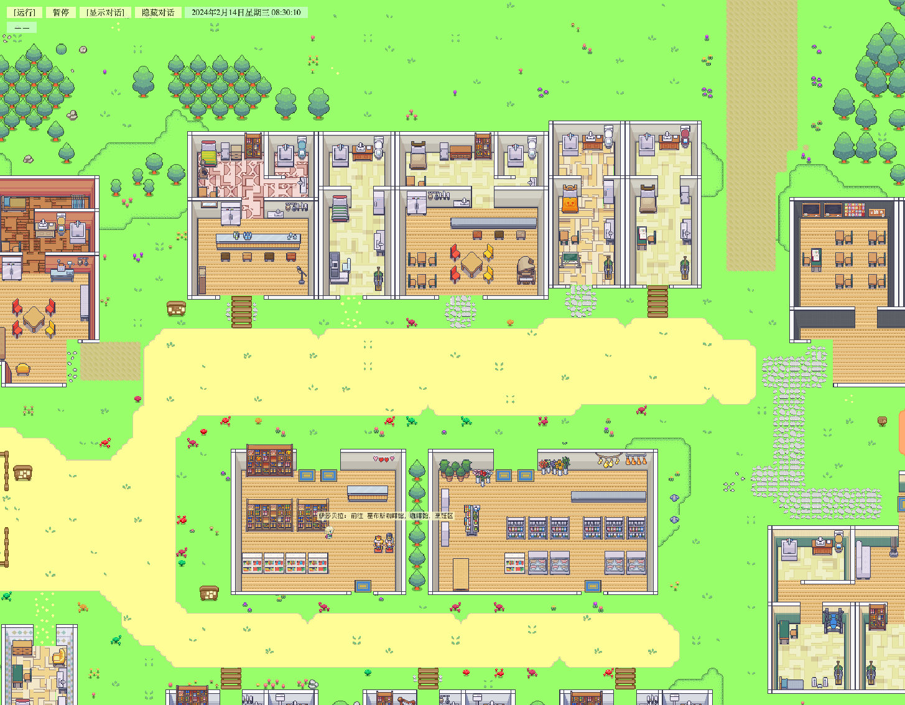

# 第 13 章 按功能体验 Generative Agents

项目跑通之后，最重要的是看清它到底提供了哪些能力。先看见功能，再理解功能背后的代码；先知道一个行为在项目中长什么样，再去第三部分追源码实现。

Generative Agents 的功能体验路线如下：


*图 13-1：Generative Agents 的功能体验路线。先从可见结果进入，再逐步理解角色、日程、感知、记忆、对话、反思和模型适配。*

## 13.1 先把项目当成一个产品体验

`AssociateRetriever`、`Agent.think()`、`poignancy` 这些源码名属于第三部分。功能体验阶段先把 Generative Agents 当成一个小型产品：它能播放一个虚拟小镇，能运行一段仿真，能保存角色活动，能把结果压缩成可回放和可阅读的材料。

体验路径如下。

| 体验顺序 | 要做什么 | 看什么结果 | 建立的直觉 |
| --- | --- | --- | --- |
| 1 | 打开 `example` 回放 | 地图上角色在移动、停留、对话 | 这不是聊天窗口，而是小镇仿真 |
| 2 | 阅读 `example/simulation.md` | 时间线、行动描述、对话内容 | 小镇行为可以被文本复盘 |
| 3 | 跑 `book-smoke` 最小仿真 | checkpoint 和 compressed 结果 | 项目能从配置生成新结果 |
| 4 | 查看一个角色的 `agent.json` | 身份、当前状态、生活习惯、空间记忆 | 角色不是临时 prompt，而是结构化对象 |
| 5 | 查看 `data/prompts/` | 日程、对话、反思等 prompt 文件 | 行为不是魔法，很多地方由 prompt 驱动 |
| 6 | 修改运行参数 | `--agent-count`、`--agents`、`--step`、`--stride` | 实验规模和成本可以控制 |
| 7 | 尝试 `--resume` | checkpoint 延续运行 | 长实验可以分段推进 |
| 8 | 查看 `config.json` | LLM、embedding、感知、反思阈值 | 模型和配置会改变小镇行为 |

第 12 章已经跑出 `book-smoke`，这里再增加一个 `book-party-pair` 实验。`book-party-pair` 只运行伊莎贝拉和阿伊莎，起始时间设为 2024 年 2 月 14 日 08:00，方便观察咖啡馆老板的派对准备和学生的学习日程如何在同一张地图上并行推进。

## 13.2 体验一：回放系统

回放系统是最适合入门的功能，因为它不要求先理解模型调用。只要有 compressed 结果，就能通过浏览器观看。

先启动本地回放服务：

```bash
cd generative_agents
python replay.py
```

本机如果没有全局 `python` 命令，可以使用项目虚拟环境执行：

```bash
../.venv/bin/python replay.py
```

浏览器打开项目内置示例：

```text
http://127.0.0.1:5000/?name=example&step=0&speed=2&zoom=0.6
```


*图 13-2：`example` 完整小镇回放。顶部显示 2024 年 2 月 13 日 06:00:10，底部列出 25 个角色，左上角显示对话记录。*

回放页面呈现三件事：

| 可见现象 | 背后的系统能力 |
| --- | --- |
| 角色在地图上移动 | 行动已经落到坐标和路径上 |
| 角色停留在某个地点 | 日程和空间 grounding 已经产生作用 |
| 角色出现对话气泡 | 对话被记录、压缩并进入前端回放 |

如果只看论文，Smallville 很容易停留在想象里；打开回放后可以立刻看出，“小镇”在项目里不是比喻，而是具体的地图、坐标、角色和时间线。

图 13-2 的重点不只是“有地图”。左上角对话记录显示地点、说话人和发言内容，底部角色栏显示完整角色集合，中间地图显示角色分布和行动标签。回放系统把 `movement.json` 中的时间、位置、行动和对话全部还原到同一个界面里。

## 13.3 体验二：Markdown 时间线

同一个示例结果还可以直接阅读：

```text
generative_agents/results/compressed/example/simulation.md
```

`simulation.md` 是理解项目行为的关键材料。它比前端动画更适合审稿、复盘和写实验报告。

| 阅读对象 | 关注问题 | 说明 |
| --- | --- | --- |
| 时间戳 | 小镇时间是否按 step 和 stride 推进 | 判断仿真节奏是否正常 |
| 角色行动 | 行动是否符合身份和地点 | 判断行为是否可信 |
| 对话内容 | 对话是否传播了信息 | 判断社交和信息扩散是否发生 |
| 地点描述 | 行动是否落在具体空间 | 判断计划是否完成 grounding |
| 长时间变化 | 角色是否持续保留目标 | 判断记忆、日程和反思是否起作用 |

`simulation.md` 的第一层判断是角色行为是否连续。如果一个角色上午说要参加活动，下午完全忘记；如果两个角色刚聊完，下一步像陌生人一样互动；如果角色不停输出空泛动作，这些都是后续源码和 prompt 需要排查的问题。

`book-party-pair` 的时间线给出了一个更小、更容易检查的样例：

| 小镇时间 | 伊莎贝拉 | 阿伊莎 |
| --- | --- | --- |
| `20240214-08:00` | 在霍布斯咖啡馆打开大门和照明设备 | 在宿舍书桌前准备《哈姆雷特》原文和笔记本 |
| `20240214-08:10` | 检查咖啡机和研磨设备 | 阅读《哈姆雷特》第一幕 |
| `20240214-08:20` | 到哈维奥克供应店准备烘焙面包的材料 | 继续在宿舍阅读和做笔记 |
| `20240214-08:30` | 回到霍布斯咖啡馆烘焙新鲜面包 | 标注第一幕中的经典独白与语言技巧 |
| `20240214-08:50` | 在咖啡馆顾客座位区清洁打扫 | 到奥克山学院图书馆标注第二幕中的双关语、隐喻与意象 |

这张表直接说明两个问题。第一，角色行为不是随机句子，而是贴着身份和日程推进；第二，`simulation.md` 比动画更适合做证据摘录，可以快速看到角色在什么时间、什么地点、做了什么。

## 13.4 体验三：角色定义

角色定义是 Generative Agents 的入口之一。每个角色都有自己的 `agent.json`，路径形如：

```text
generative_agents/frontend/static/assets/village/agents/伊莎贝拉/agent.json
```

以伊莎贝拉为例，先看这些字段：

| 字段 | 中文意思 | 体验时看什么 |
| --- | --- | --- |
| `name` | 角色姓名 | 行动、对话、记忆都以这个名字作为主体 |
| `coord` | 初始坐标 | 回放第 0 帧中的角色起点 |
| `currently` | 当前关注状态 | 伊莎贝拉一开始就关心情人节派对 |
| `scratch.innate` | 先天特质 | 影响角色说话和行动风格 |
| `scratch.learned` | 后天经历 | 定义职业、背景和长期身份 |
| `scratch.lifestyle` | 生活习惯 | 影响起床、睡觉和日程节奏 |
| `scratch.daily_plan` | 日常计划 | 给日程生成提供默认生活结构 |
| `spatial.address.living_area` | 居住地址 | 决定角色睡觉、回家和生活区域 |
| `spatial.tree` | 已知地点树 | 限制角色能选择哪些地点和对象 |

这里最重要的结论是：角色不是一段“你扮演某某”的 prompt，而是一组会进入多个系统模块的配置。`currently` 会影响日程和对话，`scratch` 会进入角色基础描述，`spatial` 会影响地点选择。后面读源码时，看到 `Scratch._base_desc()`、`Spatial`、`Schedule` 和 `Associate`，就能把它们和这个角色文件对上。

`book-party-pair` 的两个角色配置可以直接对照运行结果：

| 字段 | 伊莎贝拉 | 阿伊莎 | 行为影响 |
| --- | --- | --- | --- |
| `currently` | 计划 2 月 14 日 17:00 在霍布斯咖啡馆举办情人节派对 | 正在研究莎士比亚戏剧中的语言运用 | 伊莎贝拉的日程围绕咖啡馆和派对准备，阿伊莎的日程围绕文学研究 |
| `scratch.innate` | 友好、外向、好客 | 好奇、坚定、独立 | 影响后续对话和行动风格 |
| `scratch.learned` | 霍布斯咖啡馆老板 | 热爱文学探索的大学生 | 决定“在哪里活动”和“做什么事” |
| `scratch.lifestyle` | 晚上 11 点睡觉，早上 6 点醒来 | 晚上 10 点睡觉，早上 6 点醒来，下午 5 点吃晚饭 | 约束日程节奏 |
| `scratch.daily_plan` | 每天早上 8 点开放咖啡馆，站在柜台前直到晚上 8 点 | 10 点到 14 点去图书馆上课，14 点后在图书馆学习 | 直接影响 08:00 到 09:00 的细粒度计划 |
| `spatial.address.living_area` | 伊莎贝拉的公寓，主人房 | 奥克山学院宿舍，阿伊莎的房间 | 决定角色初始生活空间 |

## 13.5 体验四：日程和行动

跑完一个仿真后，可以在 `simulation.md` 中观察每个角色的行动节奏。日程结果先从行为文本里看，再进入 `Schedule` 源码。

| 观察点 | 好结果 | 有问题的结果 |
| --- | --- | --- |
| 起床和睡觉 | 符合角色生活习惯 | 深夜仍然随机社交，或白天长期睡觉 |
| 工作和生活 | 咖啡馆老板在咖啡馆，学生在校园或宿舍 | 角色经常出现在和身份无关的地点 |
| 行动粒度 | 行动有时间、地点和对象 | 行动只是“思考”“继续计划”这类空泛文本 |
| 计划连续性 | 前后行动有生活节奏 | 每一步像重新随机生成 |

控制日程体验的入口主要有三类：

| 体验入口 | 文件或参数 | 作用 |
| --- | --- | --- |
| 角色生活设定 | `agent.json` 中的 `scratch.lifestyle`、`scratch.daily_plan` | 决定日程生成的基础倾向 |
| 仿真时间 | `start.py --start`、`--step`、`--stride` | 决定能观察到哪段生活 |
| 日程 prompt | `data/prompts/wake_up.txt`、`schedule_init.txt`、`schedule_daily.txt`、`schedule_decompose.txt` | 决定 LLM 如何生成和拆解计划 |

下面的小实验只运行伊莎贝拉和阿伊莎，观察伊莎贝拉的行动是否围绕咖啡馆和派对展开。

```bash
python start.py \
  --name book-party-pair \
  --start "20240214-08:00" \
  --step 6 \
  --stride 10 \
  --agents "伊莎贝拉,阿伊莎" \
  --verbose info
```

本次实际运行使用 MiniMax 配置，生成了 6 个 checkpoint：

| 文件 | 对应小镇时间 |
| --- | --- |
| `simulate-20240214-0800.json` | 08:00 |
| `simulate-20240214-0810.json` | 08:10 |
| `simulate-20240214-0820.json` | 08:20 |
| `simulate-20240214-0830.json` | 08:30 |
| `simulate-20240214-0840.json` | 08:40 |
| `simulate-20240214-0850.json` | 08:50 |

运行结束后执行压缩：

```bash
python compress.py --name book-party-pair
```

压缩成功后，控制台输出：

```text
Compression completed.
```

压缩后阅读生成的时间线文件：

```text
generative_agents/results/compressed/book-party-pair/simulation.md
```


*图 13-3：`book-party-pair` 起始回放。顶部时间是 2024 年 2 月 14 日 08:00:10，底部只有伊莎贝拉和阿伊莎两个角色，伊莎贝拉已经前往霍布斯咖啡馆。*

压缩后的 `movement.json` 包含 363 帧，角色列表只有伊莎贝拉和阿伊莎。图 13-3 证明 `--agents "伊莎贝拉,阿伊莎"` 已经生效，也证明最小实验仍然使用完整小镇地图，只是参与仿真的角色变少。

这个小实验不一定立刻出现精彩故事，但它会展示日程、角色设定和对话机会之间的关系。

## 13.6 体验五：感知和空间

Generative Agents 不是让角色全知全能。角色能不能看到某个事件，取决于位置、视野、arena 和注意力带宽。感知体验主要看两个配置：

```text
generative_agents/data/config.json
```

| 配置 | 中文意思 | 体验影响 |
| --- | --- | --- |
| `agent.percept.vision_r` | 视野半径 | 数值越大，角色能看到的附近 tile 越多 |
| `agent.percept.att_bandwidth` | 注意力带宽 | 数值越大，每步能处理的附近事件越多 |

感知能力可以通过回放和 `simulation.md` 间接观察。两个角色距离很远时，通常不会立刻发生对话；两个角色进入同一场所后，才更可能互相感知并触发反应。这一点很关键，因为信息扩散只有在“角色不是全知”的前提下才有意义。



*图 13-4：`book-party-pair` 在 08:30:10 的回放。伊莎贝拉位于霍布斯咖啡馆附近，阿伊莎仍在学院生活区，两个角色没有进入同一场所。*

本次实验的 `conversation.json` 是空对象：

```json
{}
```

这不是运行失败，而是空间和感知限制的结果。伊莎贝拉的行动线在咖啡馆、供应店和咖啡馆烹饪区之间移动，阿伊莎的行动线在宿舍书桌和学院图书馆之间移动；两个人没有在同一场所近距离相遇，所以对话流程没有启动。

感知像一道门：


*图 13-5：感知不是读取全局世界，而是经过视野、场所和注意力带宽过滤后，才进入角色自己的记忆。*

## 13.7 体验六：记忆和检索

记忆体验的入口不是向量索引，而是两个现象：角色是否记得刚发生的事，角色是否能在后续对话或反思中引用这些事。

记忆相关结果主要出现在：

| 材料 | 能观察什么 |
| --- | --- |
| `simulation.md` | 角色后续行动和对话是否引用过去事件 |
| `conversation.json` | 对话是否被保存 |
| checkpoint JSON | agent 的 memory、schedule、action 和状态 |
| `results/checkpoints/<name>/` 下的存储目录 | 向量索引和 memory 状态 |

`book-party-pair` 运行结束后，两个角色都有独立记忆索引：

| 角色 | 记忆目录 | `index_config.json` 中的节点数 |
| --- | --- | --- |
| 伊莎贝拉 | `results/checkpoints/book-party-pair/storage/伊莎贝拉/associate/` | `max_nodes: 9` |
| 阿伊莎 | `results/checkpoints/book-party-pair/storage/阿伊莎/associate/` | `max_nodes: 9` |

项目中的记忆分三类：

| 记忆类型 | 中文意思 | 体验方式 |
| --- | --- | --- |
| `event` | 观察到或执行过的事件 | 看角色是否记住附近发生的事 |
| `chat` | 对话摘要 | 看角色后续是否延续谈过的话题 |
| `thought` | 计划、反思和高层想法 | 看角色是否形成更稳定的判断 |

检索细节留到第三部分；此处先确定一个事实：这个项目不是把聊天记录塞回 prompt，而是把事件、对话、想法保存成 memory stream，再按相关性、近期性和重要性检索。

从最终 checkpoint 也能看到记忆在增长。伊莎贝拉记住了“打开咖啡馆大门和照明设备”“检查咖啡机和研磨设备”“准备烘焙面包的材料”“烘焙新鲜面包”等事件；阿伊莎记住了“整理书桌”“阅读《哈姆雷特》第一幕”“标注第一幕”“阅读《哈姆雷特》第二幕”等事件。它们都是后续检索和反思的材料。

## 13.8 体验七：对话

对话是最容易被误解的功能。普通聊天应用通常是“一次用户输入，一次模型回答”；Generative Agents 的对话是一条流程，只有在角色感知到对方、判断有必要交流、生成对话、检查重复、判断结束、总结对话之后，才会写回记忆和日程。

对话结果主要看三个位置：

| 位置 | 能看到什么 |
| --- | --- |
| 回放页面 | 是否出现对话气泡 |
| `simulation.md` | 对话内容和发生地点 |
| `conversation.json` | 按时间保存的对话记录 |

`book-party-pair` 没有触发对话，`conversation.json` 保持为空。这个结果反而更容易说明对话的边界：对话不是每一步都强行生成，而是要先经过感知、距离、关系和 `decide_chat.txt` 判断。想观察真实对话，可以打开 `example` 回放；图 13-2 的左上角已经显示山姆和詹妮弗的对话记录。

对话相关 prompt 位于：

```text
generative_agents/data/prompts/
```

对话相关的重点 prompt 文件如下：

| Prompt | 作用 |
| --- | --- |
| `decide_chat.txt` | 判断是否主动发起对话 |
| `summarize_relation.txt` | 总结双方关系背景 |
| `generate_chat.txt` | 生成角色发言 |
| `generate_chat_check_repeat.txt` | 检查是否重复 |
| `decide_chat_terminate.txt` | 判断对话是否结束 |
| `summarize_chats.txt` | 总结对话并写入记忆 |

对话的关键判断不是“对话是不是好听”，而是“对话有没有改变后续行为”。如果角色聊完后没有记忆、没有日程影响、没有后续引用，那么对话只是展示文本，不是社会仿真的一部分。

## 13.9 体验八：反思

反思不是每一步都会发生。项目会累积事件和对话的重要性，达到阈值后才触发 reflection。相关配置是：

```text
agent.think.poignancy_max
```

当前配置中这个值是 `150`。这意味着小规模、短 step 的烟雾测试通常不容易触发反思，这是正常现象。想体验反思，需要更长仿真、更多事件，或者调低阈值做实验。

`book-party-pair` 只跑了 6 个 step，伊莎贝拉和阿伊莎的记忆节点都还没有达到 `poignancy_max: 150` 的反思阈值，因此没有生成新的 reflection thought。这个结果和配置一致，不是反思功能失效。

反思结果主要看三个位置：

| 观察对象 | 判断问题 |
| --- | --- |
| checkpoint 中的 `thought` memory | 是否生成了高层想法 |
| `simulation.md` 中的后续行动 | 反思是否影响后续计划 |
| 对话后的摘要和 thought | 对话是否被提炼成长期记忆 |

反思相关 prompt 如下：

| Prompt | 作用 |
| --- | --- |
| `reflect_focus.txt` | 从记忆中生成反思焦点问题 |
| `reflect_insights.txt` | 基于检索记忆生成洞察和证据 |
| `reflect_chat_planing.txt` | 从对话中提取对计划的影响 |
| `reflect_chat_memory.txt` | 从对话中提取值得记住的内容 |

源码文件名是 `reflect_chat_planing.txt`，不是 `planning`。书中后续引用会按真实文件名写。

## 13.10 体验九：模型适配

模型适配让这个项目比原始论文 demo 更贴近当前中文使用场景。可以通过 `config.json` 切换模型 provider，但不要把它理解成简单换模型名称。不同 provider 对结构化输出、中文指令、`<think>` 标签和 embedding 的支持都不同。

本次实验使用的实际配置如下：

| 能力 | 当前配置 |
| --- | --- |
| 思考模型 provider | `minimax` |
| 思考模型 | `MiniMax-M3` |
| LLM 接口 | `https://api.minimaxi.com/v1` |
| embedding provider | `minimax` |
| embedding 模型 | `embo-01` |
| embedding 接口 | `https://api.minimax.chat/v1` |
| 反思阈值 | `agent.think.poignancy_max = 150` |

| 能力 | 配置位置 | 体验方式 |
| --- | --- | --- |
| 思考模型 | `agent.think.llm` | 影响日程、对话、反思和地点选择 |
| embedding 模型 | `agent.associate.embedding` | 影响记忆检索质量 |
| 结构化输出 | `Scratch` 中的 Pydantic response model | 影响模型输出能否被系统解析 |
| provider 特殊处理 | `modules/model/llm_model.py` | 影响 OpenAI、Ollama、MiniMax 的调用差异 |

模型适配一次只改一项。先用默认配置跑通 `book-smoke`，再改模型名称或 provider。每次修改后记录：

| 记录项 | 示例 |
| --- | --- |
| provider | `minimax` |
| model | `MiniMax-M3` |
| embedding model | `embo-01` |
| step / stride / agents | `step=6, stride=10, agents=伊莎贝拉,阿伊莎` |
| 结果路径 | `results/compressed/book-party-pair/simulation.md` |
| 失败现象 | JSON 解析失败、对话重复、行动空泛、反思不触发 |

有记录，模型对比才有意义；没有记录，只能凭感觉说“这个模型好像更聪明”。

## 13.11 体验十：项目来源和源码入口

功能入口明确后，项目来源和源码入口会更容易对上。当前项目的演化链路可以压缩成一张表：

| 来源 | 给当前项目留下什么 |
| --- | --- |
| Generative Agents 论文 | 可信人类行为代理、Smallville、memory、reflection、planning、dialogue |
| Stanford 原始项目 | 论文 demo 的后端仿真、前端小镇和回放基础 |
| wounderland | 更清晰的工程重构基础 |
| Generative Agents 中文工程版 | 中文 prompt、本地模型、多 provider、Pydantic、断点和 Markdown 回放 |

源码入口对应关系如下：

| 体验到的功能 | 后续源码入口 | 深读章节 |
| --- | --- | --- |
| 地图和移动 | `modules/maze.py`、`modules/game.py` | 第 14、16 章 |
| 角色定义 | `agents/*/agent.json`、`modules/prompt/scratch.py` | 第 15 章 |
| 仿真循环 | `start.py`、`Agent.think()` | 第 16 章 |
| 感知 | `Agent.percept()` | 第 17 章 |
| 记忆 | `modules/memory/associate.py` | 第 18 章 |
| 日程 | `modules/memory/schedule.py`、`Agent.make_schedule()` | 第 19 章 |
| 对话和反应 | `Agent._reaction()`、`Agent._chat_with()`、`Agent._wait_other()` | 第 20 章 |
| 反思 | `Agent.reflect()` | 第 21 章 |
| 模型适配 | `modules/model/llm_model.py` | 第 22 章 |
| 回放 | `compress.py`、`replay.py`、`frontend/templates/` | 第 23 章 |

这张表用于给第三部分铺路。功能已经体验过，源码入口才有意义。

## 13.12 小结

到这里，Generative Agents 的主要功能已经体验过一遍：它能回放小镇、生成时间线、定义角色、安排日程、处理感知、保存记忆、触发对话、形成反思，并通过模型配置改变系统表现。

| 体验内容 | 核心结论 |
| --- | --- |
| 回放系统 | 项目不是聊天窗口，而是可以播放的小镇仿真 |
| Markdown 时间线 | 行为结果可以被人类阅读和复盘 |
| 角色定义 | 角色由 `agent.json`、`scratch` 和空间记忆共同定义 |
| 日程和行动 | 角色行为来自日程、时间、地点和对象约束 |
| 感知和空间 | 角色不是全知，只能看到有限范围内的事件 |
| 记忆和检索 | 事件、对话和想法会进入 memory stream |
| 对话 | 对话会被判断、生成、检查、总结并写回记忆 |
| 反思 | 重要经历累积后才会形成高层 thought |
| 模型适配 | LLM 和 embedding 配置会直接改变系统表现 |
| 源码入口 | 第三部分会把已经体验过的功能逐个拆开 |

第三部分开始进入源码。每个模块都已经在功能体验中对应到具体现象，再看 `Maze`、`Agent`、`Schedule`、`Associate` 和 `Scratch` 时，类名背后就有了地图、角色、日程、记忆和身份定义这些具体对象。

## 参考资料

- Example replay: `generative_agents/results/compressed/example/`
- Role config: `generative_agents/frontend/static/assets/village/agents/*/agent.json`
- Prompt directory: `generative_agents/data/prompts/`
- Runtime config: `generative_agents/data/config.json`
- Start entry: `generative_agents/start.py`
- Compress entry: `generative_agents/compress.py`
- Replay entry: `generative_agents/replay.py`
