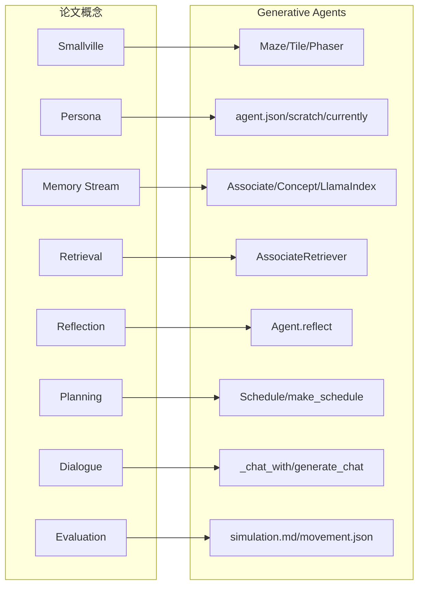
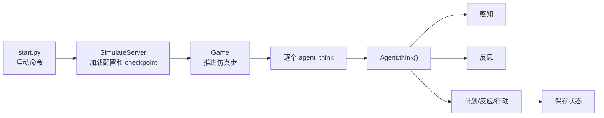
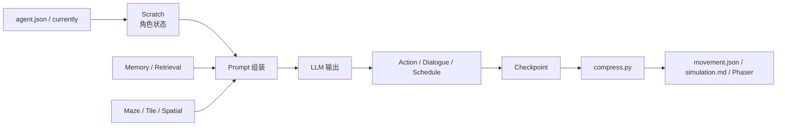

# 第 13 章 论文概念到源码模块的映射

## 13.1 核心问题

第 12 章讲清了项目谱系。本章把论文概念一一映射到 Generative Agents 的源码模块。这是一张源码深读索引。第三部分会进入源码深读。如果缺少这张映射表，读者很容易在文件树中迷路：

```text
论文说 memory stream，源码里为什么叫 Associate？
论文说 Smallville，源码里为什么有 Maze 和 Phaser 两套地图数据？
论文说 reflection，源码里为什么是 reflect_focus、reflect_insights、poignancy？
论文说 dialogue，源码里为什么要先 decide_chat，再 summarize_relation，再 generate_chat？
```

本章就是把这些对应关系讲清楚。它不是简单表格，而是一张“读源码地图”。本章需要建立四个映射：

1. 每个论文概念在本项目中对应哪些文件。
2. 核心类和函数在哪里。
3. 数据如何流动。
4. 项目实现与论文思想有哪些差异。
5. 后续源码深读应该从哪里进入。



*图 13-1：论文概念到 Generative Agents 模块的全局映射。读源码前先建立这张地图，后面看到类、函数和数据文件时才知道它们对应论文中的哪个概念。*

## 13.2 总览映射表

先用一张全局表建立论文概念和源码模块的对应关系。

| 论文概念 | Generative Agents 实现 | 后续深读章节 |
|---|---|---|
| Smallville / 沙盒世界 | `Maze`、`Tile`、`maze.json`、Phaser 前端 | 第 14、23 章 |
| Agent Persona | `agent.json`、`Scratch`、`base_desc.txt` | 第 4、15 章 |
| Simulation Loop | `start.py`、`Game`、`Agent.think()` | 第 16 章 |
| Observation / Perception | `Maze.get_scope()`、`Agent.percept()`、`Event` | 第 17 章 |
| Memory Stream | `Associate`、`Concept`、`Event`、`LlamaIndex` | 第 18 章 |
| Retrieval | `AssociateRetriever`、`retrieve_focus()` | 第 18 章 |
| Importance | `poignancy_event`、`poignancy_chat`、`status["poignancy"]` | 第 18、21 章 |
| Reflection | `Agent.reflect()`、`reflect_focus`、`reflect_insights` | 第 21 章 |
| Planning | `Schedule`、`make_schedule()`、schedule prompts | 第 19 章 |
| Reacting | `_reaction()`、`_chat_with()`、`_wait_other()` | 第 20 章 |
| Dialogue | `decide_chat`、`generate_chat`、`summarize_chats` | 第 20 章 |
| Spatial Grounding | `Spatial`、`determine_sector/arena/object` | 第 14、19 章 |
| LLM Interface | `LLMModel`、Ollama、OpenAI、MiniMax、Pydantic schema | 第 22 章 |
| Checkpoint | `SimulateServer.simulate()`、`agent.to_dict()` | 第 16、23 章 |
| Replay | `compress.py`、`replay.py`、`movement.json`、`simulation.md` | 第 23 章 |

这张表后面会反复用到。

## 13.3 从命令行到智能体行动：项目生命线

先看整个项目的运行生命线。当读者执行：

```bash
cd generative_agents
python start.py --name sim-test --start "20250213-09:30" --step 10 --stride 10
```

系统会经历下面的链路：

```text
start.py
  -> get_config()
  -> SimulateServer
  -> create_game()
  -> Game
  -> Agent
  -> SimulateServer.simulate()
  -> Game.agent_think()
  -> Agent.think()
  -> checkpoint
```

这个链路是全书后面所有模块的主干。`start.py` 解析命令行参数，决定仿真名称、起始时间、步数、步长、参与 agent。`get_config()` 读取 `data/config.json` 中的基础 agent 配置，再把每个角色的 `agent.json` 路径填入 simulation config。`SimulateServer` 创建游戏，并维护每个 agent 当前坐标和 path。`Game` 加载地图，创建所有 agent。`simulate()` 每一步调用每个 agent 的 `think()`。每个 step 结束后，系统写入 checkpoint 和 conversation。这个主链路对应论文中的“仿真环境驱动智能体连续行动”。不是用户问一句，智能体答一句。而是时间推进，世界推进，角色持续思考。



*图 13-2：从 start.py 到 Agent.think() 的运行链路。第三部分源码深读会沿着这条链路展开，而不是孤立解释函数。*

## 13.4 Smallville 对应 Maze、Tile 与前端地图

论文中的 Smallville 是一个沙盒小镇。在 Generative Agents 中，它被拆成两层。第一层是后端世界模型：

```text
generative_agents/modules/maze.py
generative_agents/frontend/static/assets/village/maze.json
```

第二层是前端回放地图：

```text
generative_agents/frontend/static/assets/village/tilemap/
generative_agents/frontend/templates/
```

这两层不要混淆。后端关心的是：

- 哪个坐标可以走。
- 哪个 tile 属于哪个 world/sector/arena/object。
- 某个地址对应哪些 tile。
- 某个 tile 上有哪些事件。
- 从一个坐标到另一个坐标怎么寻路。
- agent 能看到哪些附近 tile。

前端关心的是：

- 地图怎么渲染。
- 角色 sprite 怎么显示。
- 回放动画怎么播放。
- 对话和动作怎么展示。

`Maze` 和 `Tile` 是后端世界模型核心。`Tile` 保存坐标、地址、碰撞状态和事件。`Maze` 保存 tile 网格、地址索引、寻路和视野逻辑。论文中的 “environment” 在源码中不是一个单独对象，而是由 `Maze`、`Tile`、前端资源和 simulation loop 共同构成。

## 13.5 地址树：论文中的地点如何落到源码

论文会说角色在家、咖啡馆、学校、房间、对象附近行动。源码必须把这些地点变成可计算结构。Generative Agents 使用地址层级：

```text
world
  -> sector
    -> arena
      -> game_object
```

`Tile` 初始化时会构建：

```python
self.address_map = dict(zip(address_keys[: len(self.address)], self.address))
```

`Maze` 初始化时会构建 `address_tiles`：

```text
address string -> set of coordinates
```

这样，系统就能回答：

```text
霍布斯咖啡馆在哪里？
克劳斯的房间有哪些 tile？
某个书桌对应哪些坐标？
```

这就是 spatial grounding。如果没有这层地址树，计划只能停在文字层面。角色可以说“我要去咖啡馆”，但系统不知道地图上该走到哪里。

## 13.6 Agent Persona 对应 agent.json 与 Scratch

论文中的 persona 在源码中主要由两部分承载：

```text
generative_agents/frontend/static/assets/village/agents/*/agent.json
generative_agents/modules/prompt/scratch.py
```

`agent.json` 是角色种子。它包含：

- 姓名。
- 初始坐标。
- 当前状态。
- 年龄。
- 性格。
- 后天经历。
- 生活习惯。
- 日常计划。
- 空间记忆。

`Scratch` 是 prompt 状态管理器。它负责把角色信息拼进各种 prompt。最核心的是 `base_desc.txt`，它提供每次模型调用的角色基础上下文。可以这样理解：

```text
agent.json
  -> 静态角色配置
Scratch
  -> 把角色配置转成 LLM 可读上下文
prompt files
  -> 在具体任务中使用角色上下文
```

这对应论文中的“自然语言描述的 agent persona”。

## 13.7 currently：初始设定与仿真状态的连接

`currently` 是理解本项目角色行为的关键字段。它描述角色当前正在关注什么。例如，伊莎贝拉的 `currently` 中包含情人节派对计划，山姆的 `currently` 中包含竞选镇长意图。这类信息会影响：

- 日程生成。
- 对话主题。
- 行为优先级。
- 反思内容。

第 8 章讲过，Generative Agents 在新一天生成日程前，会根据记忆更新 `currently`：

```python
plan = self.completion("retrieve_plan", retrieved)
thought = self.completion("retrieve_thought", retrieved)
self.scratch.currently = self.completion("retrieve_currently", plan, thought)
```

这说明 `currently` 不只是初始字段，也可以被仿真经历刷新。它是 persona 和 memory stream 之间的桥。

## 13.8 Simulation Loop 对应 start.py、Game 和 Agent.think()

论文中智能体在时间中连续行动。源码中，这个循环由三层组成。第一层：`SimulateServer.simulate()`。它推进 step，调用每个 agent 的思考，并在每一步保存 checkpoint。第二层：`Game.agent_think()`。它调用具体 agent 的 `think()`，并整理 summary 信息，包括：

- currently。
- associate memory。
- concepts。
- chats。
- action。
- schedule。
- address。

第三层：`Agent.think()`。这是智能体每一步行为的核心入口。`think()` 的简化流程是：

```text
同步移动状态
  -> 生成或读取当前日程
  -> 判断睡眠
  -> 如果醒着：感知、计划/反应、反思
  -> 如果睡着：必要时确定睡眠动作
  -> 计算 path 和 emoji
  -> 返回 plan
```

这对应论文中的 agent architecture runtime。第三部分第 16 章会逐行拆这个流程。

## 13.9 Observation 对应 Agent.percept()

论文中的 observation，是 agent 对环境的感知。在 Generative Agents 中，感知入口是：

```text
Agent.percept()
```

它做四件事。第一，根据当前坐标和感知配置取得视野范围：

```python
scope = self.maze.get_scope(self.coord, self.percept_config)
```

第二，把范围内的空间地址加入 spatial memory。第三，收集同一 arena 内的事件，并按距离排序。第四，把未见过的新事件写入 associate memory。这里要注意，perception 不等于直接拿到全局状态。它受三个条件限制：

- 视野范围。
- 同一 arena。
- 注意力带宽 `att_bandwidth`。

这对应论文中的“有限观察”。如果 agent 能看到全局世界，信息扩散就没有意义。

## 13.10 Event：统一描述世界变化的结构

论文中的 observation、action、dialogue 都需要某种统一表示。Generative Agents 使用 `Event`。`Event` 位于：

```text
generative_agents/modules/memory/event.py
```

它通常包含：

- subject。
- predicate。
- object。
- describe。
- address。
- emoji。

例如：

```text
伊莎贝拉 对话 阿伊莎
克劳斯 此时 阅读研究资料
书桌 此时 被克劳斯使用
```

Event 的价值在于统一。角色观察到的事、自己正在做的事、对象状态、对话摘要，都可以被表示成 event-like structure。这让 memory、perception、action、replay 都能共享同一套表达。

## 13.11 Memory Stream 对应 Associate、Concept 与 LlamaIndex

论文中的 Memory Stream 在源码中主要对应：

```text
generative_agents/modules/memory/associate.py
generative_agents/modules/storage/index.py
```

`Concept` 是单条记忆记录的包装。它包含：

- node_id。
- node_type。
- event。
- poignancy。
- create。
- expire。
- access。

`Associate` 是 agent 的关联记忆系统。它维护三类 memory：

```python
self.memory = {"event": [], "thought": [], "chat": []}
```

这三类分别对应：

- event：观察和行为事件。
- thought：反思、计划等高层想法。
- chat：对话摘要。

底层索引由 `LlamaIndex` 封装。`LlamaIndex.add_node()` 把文本和 metadata 写入向量索引。`LlamaIndex.retrieve()` 根据文本检索相关 nodes。这就是论文 memory stream 在当前项目中的工程实现。

## 13.12 Importance 对应 poignancy

论文中每条记忆有 importance score。Generative Agents 使用 `poignancy` 表示记忆触动程度。当事件写入 associate memory 时，`Agent._add_concept()` 会评分：

```python
if e_type == "chat":
    poignancy = self.completion("poignancy_chat", event)
else:
    poignancy = self.completion("poignancy_event", event)
```

普通空闲事件直接给 1。非空闲事件和对话则调用模型评分。评分 prompt 要求在 1 到 10 之间输出整数。`poignancy` 有两个作用。第一，参与 Retrieval 排序。重要记忆更容易被想起。第二，触发 Reflection。`Agent.reflect()` 会检查：

```python
if self.status["poignancy"] < self.think_config["poignancy_max"]:
    return
```

这对应论文中“重要性累积达到阈值后反思”。

## 13.13 Retrieval 对应 AssociateRetriever

论文中的 Retrieval 综合三因素：

- recency。
- importance。
- relevance。

Generative Agents 对应实现是 `AssociateRetriever`。它先用向量检索取回节点，再按 access 时间排序，然后计算三类分数：

```python
recency_scores
relevance_scores
importance_scores
```

最终分数是三者加权和：

```python
final_scores = recency + relevance + importance
```

对应配置包括：

```text
recency_decay
recency_weight
relevance_weight
importance_weight
retrieve_max
```

这就是论文 retrieval 在源码中的直接落点。注意，普通向量数据库只解决 relevance。Generative Agents 的 retrieval 更接近“人会想起什么”，所以必须加入近期性和重要性。

## 13.14 Reflection 对应 Agent.reflect()

论文中的 Reflection 在源码中对应：

```text
Agent.reflect()
reflect_focus.txt
reflect_insights.txt
reflect_chat_planing.txt
reflect_chat_memory.txt
```

`Agent.reflect()` 的流程是：

```text
检查 poignancy 阈值
  -> 取近期 events + thoughts
  -> 生成反思焦点问题
  -> 围绕焦点问题检索相关记忆
  -> 生成 insights 和 evidence
  -> 写回 thought
  -> 处理对话反思
  -> 清空累计 poignancy 和 chats
```

这对应论文第 7 章讲过的：

```text
observation -> question -> retrieved memories -> insight -> memory stream
```

Generative Agents 的一个工程特点是，insight 会带 evidence node ids。这为后续审计和实验评价提供了基础。

## 13.15 Planning 对应 Schedule 与 make_schedule()

论文中的 Planning 在源码中主要对应：

```text
generative_agents/modules/memory/schedule.py
Agent.make_schedule()
schedule_* prompts
```

`Schedule` 保存每日计划。`make_schedule()` 生成新一天日程，或读取当前日程。流程包括：

```text
必要时根据记忆更新 currently
  -> wake_up
  -> schedule_init
  -> schedule_daily
  -> 写入 daily_schedule
  -> 把今天计划写入 thought
  -> 对当前 plan 做 decompose
```

这对应论文中从日计划到细粒度行为的递归规划。`Schedule.current_plan()` 根据当前时间返回当前 plan 和 de_plan。`Agent._determine_action()` 再把 de_plan 转成空间中的 action。

## 13.16 Spatial Grounding 对应 Spatial、Maze 与 determine prompts

计划要落地，就必须知道地点。Generative Agents 的空间落地由三部分完成：

```text
Spatial memory
Maze address index
determine_sector / determine_arena / determine_object prompts
```

`Spatial` 保存角色知道的地址树。`Maze` 保存全局地址到 tile 的映射。如果 `spatial.find_address()` 不能直接找到合适地点，系统会调用 LLM 逐层选择 sector、arena、object。这对应论文中的 sandbox grounding。没有这一步，planning 只是文字。有了这一步，planning 才能变成地图移动、对象占用和可观察事件。

## 13.17 Reacting 对应 _reaction()

论文中的 Reacting 对应：

```text
Agent._reaction()
Agent._chat_with()
Agent._wait_other()
decide_chat.txt
decide_wait.txt
```

`_reaction()` 从当前感知到的 concepts 中选择 focus。如果 focus 是另一个 agent，就尝试：

```text
聊天
等待
```

聊天处理社会交互。等待处理空间冲突。这对应论文中“智能体在计划执行过程中对意外事件作出反应”。源码中还有 `_skip_react()`，避免睡觉、深夜、待开始等不合适场景触发反应。这说明反应不是越多越好，而是要符合情境。

## 13.18 Dialogue 对应聊天决策、关系摘要与多轮生成

论文中的 Dialogue 在源码中不是一个单独 prompt，而是一组流程。核心函数是：

```text
Agent._chat_with()
```

它的步骤是：

```text
检查双方是否可聊天
  -> 检索最近聊天记录
  -> decide_chat 判断是否发起
  -> summarize_relation 生成双方关系摘要
  -> generate_chat 多轮生成
  -> generate_chat_check_repeat 检查复读
  -> decide_chat_terminate 判断结束
  -> summarize_chats 生成摘要
  -> schedule_chat 写回双方日程
```

这比“调用一次 LLM 生成对话”复杂得多。原因是对话在 Generative Agents 中承担三种功能：

1. 展示角色之间的自然社交。
2. 传播派对、竞选这类关键社会信息。
3. 改变双方后续的记忆和计划。

如果对话不写回日程和记忆，它就只是前端文本，不会成为社会仿真的组成部分。

## 13.19 Action 对应当前行为与对象事件

论文中的 action 在源码中对应：

```text
generative_agents/modules/memory/action.py
```

`Action` 保存：

- `event`
- `obj_event`
- `start`
- `duration`
- `end`

`event` 描述角色正在做什么。`obj_event` 描述对象发生了什么。例如，角色坐在书桌前学习时：

```text
角色 event：克劳斯此时阅读资料
对象 event：书桌此时被克劳斯用于阅读资料
```

这样，其他 agent 感知 nearby tile 时，可以看到角色和对象状态。这让行动进入共享世界。

## 13.20 Checkpoint 对应 SimulateServer.simulate()

论文中的仿真需要可回放。Generative Agents 每个 step 会写 checkpoint。`SimulateServer.simulate()` 中，每一步结束后写：

```text
results/checkpoints/<name>/simulate-<time>.json
results/checkpoints/<name>/conversation.json
```

checkpoint 保存：

- 当前时间。
- step。
- agents 状态。
- 每个 agent 的 memory。
- 每个 agent 的 action。
- schedule。
- 坐标。
- 存储路径。

conversation 保存对话日志。断点恢复也依赖 checkpoint。`get_config_from_log()` 会读取最后一个 checkpoint，恢复仿真配置，并把时间推进到下一步。这对应项目的工程化增强：长时间仿真可以中断、恢复和复盘。

## 13.21 Replay 对应 compress.py、movement.json 与 simulation.md

checkpoint 文件适合恢复系统，但不适合人阅读。因此项目提供 `compress.py`。它会把 checkpoint 压缩成更适合回放和阅读的结果：

```text
results/compressed/<name>/movement.json
results/compressed/<name>/simulation.md
```

`movement.json` 供 Phaser 前端回放。`simulation.md` 供人类阅读仿真时间线。`replay.py` 启动 Flask 服务，前端读取 compressed 结果并展示小镇回放。这对应论文中的 replay / sandbox visualization。但 Generative Agents 额外强化了 Markdown 输出，使读者不用打开浏览器也能审阅仿真行为。

## 13.22 LLM Interface 对应 llm_model.py

论文默认使用大语言模型生成行为。Generative Agents 将模型调用封装在：

```text
generative_agents/modules/model/llm_model.py
```

核心类包括：

| 类名 | 中文意思 | 负责什么 |
| --- | --- | --- |
| `LLMModel` | 模型调用基类。 | 提供统一的 completion 入口、重试、failsafe 和结果统计。 |
| `OpenAILLMModel` | OpenAI 兼容接口实现。 | 调用 OpenAI 或兼容 OpenAI 协议的模型服务。 |
| `OllamaLLMModel` | Ollama 本地模型实现。 | 调用本地模型，并支持用 Pydantic JSON schema 约束返回格式。 |
| `MiniMaxLLMModel` | MiniMax 模型实现。 | 适配 MiniMax 接口限制，处理 schema 拼接和 `<think>` 标签过滤。 |

`LLMModel.completion()` 负责：

- retry。
- callback。
- failsafe。
- 记录成功失败统计。

具体子类负责不同 provider 的调用方式。Ollama 支持把 Pydantic JSON schema 作为 response format。MiniMax 因为接口限制，会把 schema 拼接进 prompt，并过滤 `<think>` 标签。这对应第 22 章说的工程化模型适配。它也是第五部分前沿升级的基础。

## 13.23 Structured Output 对应 Scratch 的 response model

结构化输出的另一半在：

```text
generative_agents/modules/prompt/scratch.py
```

每个 `prompt_*` 方法通常返回一个 `Result`，其中包含：

- prompt。
- callback。
- failsafe。
- return_type。

例如，起床时间：

```python
class wakeupResponse(BaseModel):
    res: int
```

日程：

```python
class schedule_dailyResponse(BaseModel):
    res: dict[str, str]
```

反思洞察：

```python
class reflect_insightsResponse(BaseModel):
    res: List[Tuple[str, str]]
```

这让模型输出、解析、失败兜底形成统一模式。论文中没有强调这一点，因为它偏工程实现。但在真实项目中，这是 agent 稳定运行的关键。

## 13.24 Evaluation Material 对应结果文件

论文评价依赖 agent 回放、memory stream 和访谈。Generative Agents 中可用于评价的材料包括：

- checkpoint。
- conversation.json。
- movement.json。
- simulation.md。
- agent memory storage。
- 日志文件。

这些材料支持后续实验：

- 信息扩散路径追踪。
- 关系形成统计。
- 派对到场率统计。
- 消融对比。
- 记忆幻觉检查。
- 模型输出失败分析。

本项目已经具备论文式评价的基础材料。只是需要我们在第四部分把实验脚本、指标和观察方法系统化。

## 13.25 论文概念到源码的数据流

现在把所有模块串成一条数据流。

```text
agent.json
  -> Agent.__init__()
  -> Scratch / Spatial / Schedule / Associate
  -> Agent.think()
  -> make_schedule()
  -> percept()
  -> _reaction() / _determine_action()
  -> reflect()
  -> Action / Event / Concept
  -> Associate / LlamaIndex
  -> checkpoint
  -> compress.py
  -> movement.json / simulation.md
```

这条数据流说明三件事。第一，角色设定不是静态文本，它会通过 Scratch 进入每次 LLM 调用。第二，环境事件不是临时画面，它会通过 Event 和 Concept 进入 memory stream。第三，仿真结果不是黑盒，它会通过 checkpoint 和 compressed results 变成可复盘材料。掌握这条数据流，第三部分源码深读就有了方向。



*图 13-3：从 persona 到 replay 的数据流。角色设定不是只影响第一句话，而是一路参与计划、行动、保存和回放。*

## 13.26 当前实现与论文的主要差异

映射不等于完全一致。Generative Agents 与论文原始系统有一些差异。第一，实时用户干预不是当前重点。论文中用户可以用自然语言干预 agent 或环境。当前项目主要提供离线仿真、断点和回放。第二，prompt 全面中文化。这改变了语言环境，也使项目更依赖中文模型的稳定性。第三，结构化输出更工程化。Pydantic schema 是当前项目的重要增强。第四，模型 provider 更丰富。当前项目不仅考虑 OpenAI，也考虑 Ollama、MiniMax、本地 embedding。第五，回放输出更适合阅读。`simulation.md` 是非常适合教学和写作的增强。第六，部分地图编辑链路仍不完整。README 已说明新增地图需要额外工具或自己生成 `maze.json`。这些差异后续都会展开。

## 13.27 第三部分源码深读路线

基于本章映射，第三部分会按下面顺序展开。第 14 章：世界模型。讲 `Maze`、`Tile`、地址树、空间记忆、地图数据和前端地图关系。第 15 章：智能体初始化。讲 `agent.json`、`Agent.__init__()`、`Scratch`、`Spatial`、`Schedule`、`Associate`。第 16 章：仿真循环。讲 `start.py`、`Game`、`Agent.think()`、checkpoint。第 17 章：感知。讲 `Agent.percept()`、视野、事件去重、memory 写入。第 18 章：记忆。讲 `Associate`、`Concept`、`LlamaIndex`、retrieval 和 poignancy。第 19 章：日程。讲 `Schedule`、`make_schedule()`、日计划、拆解、重规划。第 20 章：社交。讲 `_reaction()`、`_chat_with()`、`_wait_other()`、对话传播。第 21 章：反思。讲 `reflect()`、focus、insights、evidence、thought 写回。

第 22 章：模型适配。讲 `LLMModel`、Ollama、MiniMax、OpenAI、Pydantic 输出。第 23 章：回放系统。讲 checkpoint、compress、movement、simulation.md 和 Phaser。这就是本书从论文进入源码的路线。

## 13.28 本章小结

这是源码深读前的地图。论文概念在项目中分别落到哪些模块上，比一次记住全部函数名更重要。

| 论文概念 | Generative Agents 中的落点 | 核心结论 |
| --- | --- | --- |
| Smallville | `Maze`、`Tile`、`maze.json`、Phaser 前端 | 小镇环境由后端地图和前端回放共同承接。 |
| Agent persona | `agent.json`、`Scratch`、`base_desc.txt` | 角色设定会进入 prompt、日程、行动和对话。 |
| Simulation loop | `start.py`、`Game`、`Agent.think()` | 仿真不是一次调用，而是持续推进的主循环。 |
| Observation | `Agent.percept()`、`Maze.get_scope()` | 感知把世界事件转成角色自己的观察。 |
| Memory Stream | `Associate`、`Concept`、`Event`、LlamaIndex | 记忆系统把事件、对话和想法保存为可检索经验。 |
| Retrieval | `AssociateRetriever`、`retrieve_focus()` | 当前行为依赖被选出的少量关键记忆。 |
| Reflection | `Agent.reflect()`、`reflect_focus`、`reflect_insights` | 反思把碎片经历转成长期 thought。 |
| Planning / Reacting / Dialogue | `Schedule`、`make_schedule()`、`_reaction()`、`_chat_with()` | 生活节奏、现场反应和对话共同产生可信行为。 |
| LLM Interface | `llm_model.py`、Pydantic schema、provider | 模型输出必须被约束成项目可执行的数据。 |
| Replay / Evaluation | checkpoint、`movement.json`、`simulation.md` | 回放和评价材料让行为结果可检查、可复盘。 |

下一章进入第三部分源码深读。我们先从世界模型开始，因为没有地图、tile、地址树和空间记忆，所有“智能体行动”都只是文字，不可能成为可观察的小镇生活。

## 参考资料

- Generative Agents paper: https://arxiv.org/abs/2304.03442
- Local source: `generative_agents/start.py`
- Local source: `generative_agents/modules/game.py`
- Local source: `generative_agents/modules/agent.py`
- Local source: `generative_agents/modules/maze.py`
- Local source: `generative_agents/modules/memory/associate.py`
- Local source: `generative_agents/modules/memory/schedule.py`
- Local source: `generative_agents/modules/model/llm_model.py`
- Local source: `generative_agents/modules/storage/index.py`
