# 第 14 章 世界模型：地图格子、地址树与空间记忆

## 14.1 核心问题

第 13 章把阿伊莎和克劳斯放到奥克山学院图书馆桌子旁。第 14 章沿着这次回放往下拆：回放移动文件 `movement.json` 里的 `[119, 24]` 如何被世界地图 Maze、地图格子 Tile、空间记忆 Spatial 和智能体 Agent 解释成地点、视野、记忆与行动。

Generative Agents 不是普通聊天系统。它的智能体必须生活在一个共享空间里。如果没有世界模型，下面这些问题都无法回答：

- 阿伊莎和克劳斯为什么都在图书馆桌子旁？
- `[119, 24]` 对应哪一个地图格子 Tile 和哪一段地址？
- 两人为什么在同一场所 arena 内可以看见彼此？
- 阿伊莎计划睡觉时会去哪个房间？
- 图书馆桌子这个语义地址 address 为什么会对应多个候选地图格子 Tile？
- 某个对象是否正在被占用？
- 两个角色是否会在同一地点相遇？

Generative Agents 中，Smallville 是一个实验小镇，这个小镇由四层组成：

 - 地图数据：后端地图数据 `maze.json`、前端瓦片地图 tile map `tilemap.json`
 - 后端模型：世界地图 Maze、地图格子 Tile
 - 角色空间记忆：空间记忆 Spatial
 - 前端回放：回放移动文件 movement `movement.json`

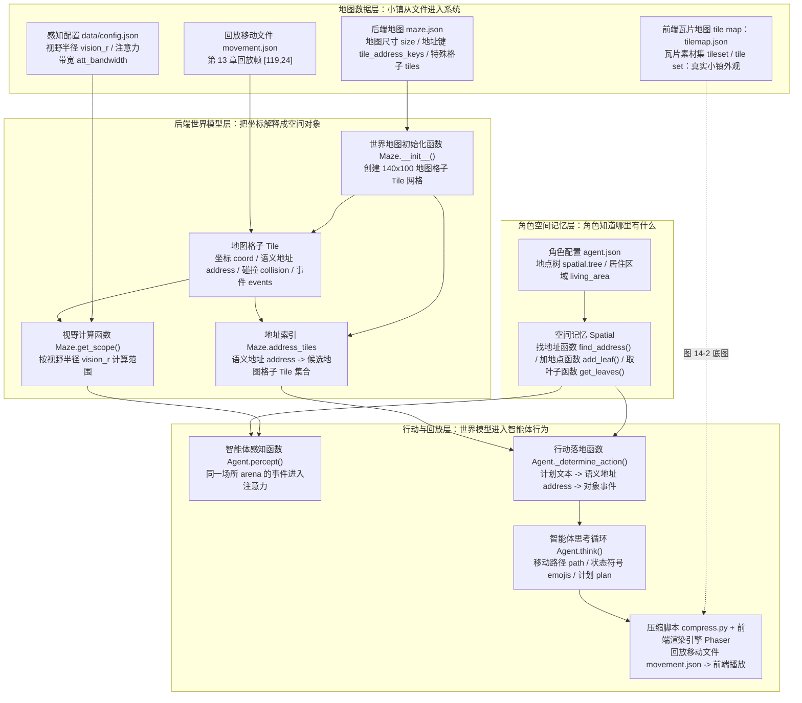

*图 14-1：世界模型的代码逻辑。第 14 章不是抽象谈“小镇地图”，而是沿着第 13 章的回放帧，把 `[119,24]` 依次交给地图数据、世界地图 Maze / 地图格子 Tile / 事件 Event、空间记忆 Spatial、智能体 Agent 和前端回放处理。四个大框对应本章后续的四组源码阅读对象，节点里的函数名都先用中文说明其角色，再接源码标识。*

图 14-1 中的术语可以先按下表对齐。概念列采用“中文概念 英文概念”的写法，先让意思落地，再让英文术语和源码标识接上。

| 概念 | 源码对应 | 中文解释 | 项目里的具体位置 | 对后文阅读的影响 |
| --- | --- | --- | --- | --- |
| 瓦片地图 tile map | `tilemap.json` | 前端用来绘制小镇画面的地图文件，记录每一层画面由哪些小瓦片拼出来。 | `frontend/static/assets/village/tilemap/tilemap.json` | 它决定浏览器里看到的道路、房间、树木和建筑外观，但不直接决定角色能不能走、能不能感知。 |
| 瓦片素材集 tileset / tile set | `tilesets` | 瓦片地图使用的图片素材集合。瓦片地图里保存的是瓦片编号，素材集决定这些编号对应哪张小图。 | `tilemap.json` 的 `tilesets` 字段，以及 `tilemap/map_assets/...` 下的图片 | 它负责“长什么样”，不负责“是什么意思”；语义地址和碰撞规则要看后端地图数据与地图格子。 |
| 前端渲染引擎 Phaser | `Phaser` | 浏览器端 2D 游戏引擎，负责加载瓦片地图、瓦片素材、角色贴图和回放数据，把后端结果画成可播放的小镇画面。 | `frontend/templates/main_script.html`、`frontend/templates/index.html` | 它只负责展示和交互，不负责模型推理；前端动画播放的是后端生成的回放文件。 |
| 世界地图 Maze | `Maze` | 后端世界地图的总控对象。它读取后端地图数据，创建整张小镇的地图格子网格，并提供地址索引、视野范围和寻路能力。 | `generative_agents/modules/maze.py`、`frontend/static/assets/village/maze.json` | 后文讲 `[119, 24]` 如何变成地点、角色如何找路、如何计算视野，都要先经过世界地图对象。 |
| 地图格子 Tile | `Tile` | 地图上的一个格子。每个格子都可以有坐标、语义地址、碰撞状态和当前事件。 | `generative_agents/modules/maze.py` 中的 `Tile` 类 | 角色不是站在抽象地点上，而是站在某个地图格子上；感知、对象占用和事件更新也都落在地图格子上。 |
| 坐标 coordinate / coord | `coord` | 网格坐标，格式通常是 `[x, y]` 或 `(x, y)`，例如 `[119, 24]`。 | `Tile.coord`、`Agent.coord`、`movement.json` 中的 `movement` 字段 | 坐标只说明几何位置，不说明“这是图书馆桌子”；要得到地点语义，还需要查对应地图格子的语义地址。 |
| 语义地址 address | `address` | 分层地点路径，通常按 `world -> sector -> arena -> game_object` 组织，例如 `the Ville -> 奥克山学院 -> 图书馆 -> 图书馆桌子`。 | 地图格子地址字段 `Tile.address`、事件地址字段 `Event.address`、空间记忆地址字段 `Spatial.address`、`maze.json` 的 `tile_address_keys` | 模型更适合生成“去图书馆桌子”这种语义地址；后端再把语义地址反查成候选地图格子。 |
| 场所 arena | `arena` | 地址层级中的“具体场所”，位于大区域和具体对象之间。例如“奥克山学院”是大区域，“图书馆”是场所。 | `tile_address_keys`、地图格子取地址函数 `Tile.get_address("arena")`、智能体感知函数 `Agent.percept()` | 场所是感知过滤的重要边界。同一视野内，不同场所的事件不会直接进入注意力，避免角色隔着房间乱感知。 |
| 碰撞标记 collision | `collision` | 表示这个地图格子是否阻挡移动。墙、封闭家具、不可通行区域通常会带有碰撞标记。 | `Tile.collision`、邻居取格函数 `Maze.get_around(no_collision=True)`、寻路函数 `Maze.find_path()` | 寻路会避开带碰撞标记的地图格子。没有它，角色就可能穿墙、走进家具或进入不可达区域。 |
| 视野范围 vision / vision radius | `vision_r` | 感知范围，不是前端视觉效果。项目用感知半径从角色当前位置向四周取一片地图格子。 | `data/config.json` 的 `agent.percept.vision_r`、视野计算函数 `Maze.get_scope()` | 后文看到 `vision_scope_count: 289` 时，要理解它来自感知半径 8 的 17x17 方形范围。 |
| 空间记忆 spatial memory | `Spatial` | 某个角色自己的地点知识，记录这个角色知道哪些地点，以及某些行为应该去哪里。 | `generative_agents/modules/memory/spatial.py`、每个角色 `agent.json` 里的 `spatial.tree` 和 `spatial.address` | 空间记忆不是全局地图。阿伊莎知道“睡觉”要去自己的床，靠的是她自己的空间记忆，不是世界地图自动推断。 |
| 地点树 spatial tree | `tree` | 空间记忆里的地点树，表示角色主观上知道哪些区域、场所和对象。它不是机器学习里的决策树，也不是向量索引树。 | `agent.json` 的 `spatial.tree`、空间记忆取叶子函数 `Spatial.get_leaves()`、空间记忆加叶子函数 `Spatial.add_leaf()` | 计划落地时，系统会从地点树中取候选大区域、场所和对象；感知到新对象时，也会把语义地址写回地点树。 |
| 当前行动 action | `action` | 智能体当前正在执行的行为封装，包含角色事件、对象事件、开始时间、持续时间和结束时间。 | `generative_agents/modules/memory/action.py`、智能体行动字段 `Agent.action` | 当前行动把“角色打算做什么”变成“在哪里做、做多久、对象状态如何变化”；后续断点 checkpoint 和回放都会读取它。 |
| 回放移动坐标 movement | `movement` | 回放数据中的移动坐标。压缩结果会把每个角色在每一帧的位置写成 `movement: [x, y]`。 | `generative_agents/results/compressed/*/movement.json`、压缩脚本 `generative_agents/compress.py` | 前端渲染引擎根据它播放角色移动；本章脚手架也用它把第 13 章回放帧重新交给世界地图对象解释。 |

世界模型源码要回答八个问题：

1. `maze.json` 存了什么？
2. 地址层级“世界 world / 大区域 sector / 场所 arena / 游戏对象 game_object”有什么作用？
3. 世界地图 Maze 如何从配置生成地图格子 Tile 网格？
4. 地图格子 Tile 和事件 Event 如何承载世界状态？
5. 语义地址 address 如何落到目标地图格子 Tile 和移动路径 path？
6. 空间记忆 Spatial 和世界地图 Maze 的区别是什么？
7. 世界模型如何服务感知、计划、社交、对象占用和回放？
8. 当前地图系统有哪些边界？

下面先把第 13 章的回放帧跑成可观察结果；再逐层解释这些结果背后的代码。

## 14.2 世界模型的优先位置

看源码时很容易先盯住智能体 Agent，因为智能体看起来是系统核心。但在 Generative Agents 中，智能体 Agent 离不开世界。它的每一步都要依赖世界模型。初始化时，智能体 Agent 要根据坐标找到自己所在的地图格子 Tile。计划行动时，智能体 Agent 要把文字计划落到语义地址 address。感知时，智能体 Agent 要从附近地图格子 Tile 获取事件。移动时，智能体 Agent 要通过寻路函数 `Maze.find_path()` 找路。对话时，智能体 Agent 要知道自己和对方是否在同一可交互空间。回放时，系统要把智能体 Agent 的坐标和动作转成前端可展示数据。世界模型不是背景资源，而是智能体 Agent 行为的地基。如果世界模型错了，大语言模型 LLM 再强也会表现奇怪。例如：

- 计划去咖啡馆，却走到宿舍。
- 在墙里穿行。
- 在不同房间却能看到对方。
- 睡觉时找不到床。
- 洗澡时去厨房水槽。

这些问题都不是提示词 prompt 能单独解决的。它们首先是空间落地 spatial grounding 问题。

### 可运行脚手架：先把世界模型跑出来

源码片段只有在运行结果旁边才有意义。第 14 章配套了一个最小脚手架，专门把第 13 章的 `book-config-ai-seminar` 回放结果放回世界模型中观察。它不调用大语言模型 LLM，也不依赖外部 API，只读取项目里的真实地图、真实感知配置、阿伊莎的真实角色配置，以及第 13 章生成的回放移动文件 `movement.json`。

从仓库根目录运行：

```bash
python docs/book/scaffolds/part_03/ch14_world_model_demo.py
```

这条命令执行的是下面这段脚手架主流程，我们来详细解读一下代码：

```python
from pathlib import Path
import argparse
import copy
import importlib.util
import json
import sys
import types

# 这份脚手架位于 docs/book/scaffolds/part_03/。
# parents[4] 会从脚本文件一路回到仓库根目录。
ROOT = Path(__file__).resolve().parents[4]
GENERATIVE_AGENTS = ROOT / "generative_agents"

# 运行后生成的书稿配图。图 14-2 就来自这个路径。
ASSET_PATH = ROOT / "docs" / "book" / "assets" / "chapter_14" / "ch14_world_model_demo.png"

# 前端真实小镇地图资源。脚手架不是另画抽象网格，而是复用前端渲染引擎 Phaser 使用的瓦片地图 tile map。
TILEMAP_DIR = GENERATIVE_AGENTS / "frontend" / "static" / "assets" / "village" / "tilemap"
TILEMAP_PATH = TILEMAP_DIR / "tilemap.json"

if hasattr(sys.stdout, "reconfigure"):
    # Windows 控制台默认编码容易把中文和 emoji 打坏，这里强制用 UTF-8。
    sys.stdout.reconfigure(encoding="utf-8")

# 让脚手架可以直接 import generative_agents/modules 下的源码。
sys.path.insert(0, str(GENERATIVE_AGENTS))


def load_repo_module(module_name: str, path: Path):
    spec = importlib.util.spec_from_file_location(module_name, path)
    if spec is None or spec.loader is None:
        raise ImportError(f"Cannot load {module_name} from {path}")
    module = importlib.util.module_from_spec(spec)
    sys.modules[module_name] = module
    spec.loader.exec_module(module)
    return module


# 本章只需要 Event 和 Spatial，不需要把整个 modules.memory 包连同向量记忆依赖一起加载。
memory_pkg = types.ModuleType("modules.memory")
memory_pkg.__path__ = [str(GENERATIVE_AGENTS / "modules" / "memory")]
memory_pkg = sys.modules.setdefault("modules.memory", memory_pkg)
event_module = load_repo_module("modules.memory.event", GENERATIVE_AGENTS / "modules" / "memory" / "event.py")
spatial_module = load_repo_module("modules.memory.spatial", GENERATIVE_AGENTS / "modules" / "memory" / "spatial.py")
setattr(memory_pkg, "event", event_module)
setattr(memory_pkg, "spatial", spatial_module)

from modules.maze import Maze
from modules.utils.log import create_io_logger

Spatial = spatial_module.Spatial


def load_json(path: Path) -> dict:
    with path.open("r", encoding="utf-8") as f:
        return json.load(f)


def find_first_active_frame(movement: dict) -> tuple[str, dict]:
    """跳过空帧，找到第一个真正包含角色动作的回放帧。"""
    all_movement = movement["all_movement"]
    frame_keys = sorted(
        (key for key in all_movement.keys() if key.isdigit()),
        key=lambda key: int(key),
    )
    for key in frame_keys:
        frame = all_movement[key]
        if frame and any("action" in agent for agent in frame.values()):
            return key, frame
    raise RuntimeError("No active replay frame found in movement.json")


def main() -> int:
    parser = argparse.ArgumentParser(description="Inspect the chapter 13 replay through the world model.")
    parser.add_argument("--output", type=Path, default=ASSET_PATH, help="PNG output path.")
    args = parser.parse_args()

    # 四个输入文件把第 13 章的回放和第 14 章的源码阅读连起来。
    maze_config_path = GENERATIVE_AGENTS / "frontend" / "static" / "assets" / "village" / "maze.json"
    movement_path = GENERATIVE_AGENTS / "results" / "compressed" / "book-config-ai-seminar" / "movement.json"
    data_config_path = GENERATIVE_AGENTS / "data" / "config.json"
    aisha_path = GENERATIVE_AGENTS / "frontend" / "static" / "assets" / "village" / "agents" / "阿伊莎" / "agent.json"

    maze_config = load_json(maze_config_path)      # 后端世界模型：地图格子 Tile、地址、碰撞。
    movement = load_json(movement_path)           # 第 13 章压缩后的真实回放。
    data_config = load_json(data_config_path)     # 默认感知参数：vision_r、att_bandwidth。
    aisha_config = load_json(aisha_path)          # 阿伊莎的主观空间记忆 Spatial。

    # 1. 用 maze.json 构造后端世界地图 Maze。
    maze = Maze(copy.deepcopy(maze_config), create_io_logger("error"))

    # 2. 从回放移动文件 movement.json 中取第一帧有动作的回放。
    frame_key, frame = find_first_active_frame(movement)
    agents = {
        name: {
            "coord": tuple(data["movement"]),
            "location": data["location"],
            "action": data.get("action", ""),
        }
        for name, data in frame.items()
    }

    # 3. 把回放坐标交给世界地图 Maze，解释它对应哪个地图格子 Tile 和哪个地址。
    first_coord = next(iter(agents.values()))["coord"]
    tile = maze.tile_at(first_coord)
    address_tiles = maze.get_address_tiles(tile.address)

    # 4. 使用项目默认感知配置，计算 vision_r=8 的视野范围。
    percept_config = data_config["agent"]["percept"]
    scope = maze.get_scope(first_coord, percept_config)

    # 5. 智能体感知函数 Agent.percept() 不会直接感知整个视野，只保留同一场所 arena 内的地图格子 Tile。
    same_arena_tiles = [
        scope_tile
        for scope_tile in scope
        if scope_tile.has_address("arena")
        and tile.has_address("arena")
        and scope_tile.get_address("arena") == tile.get_address("arena")
    ]

    # 6. 用阿伊莎自己的空间记忆 Spatial 解释“睡觉”和“图书馆里有什么”。
    spatial_config = aisha_config["spatial"]
    spatial = Spatial(copy.deepcopy(spatial_config["tree"]), copy.deepcopy(spatial_config["address"]))
    sleep_address = spatial.find_address("准备睡觉", as_list=False)
    library_leaves = spatial.get_leaves(["the Ville", "奥克山学院", "图书馆"])

    # 7. 生成真实小镇地图截图，并叠加角色位置、候选地址、视野和同一场所范围。
    draw_world_model_image(maze, agents, scope, same_arena_tiles, address_tiles, args.output)

    print("第 14 章世界模型脚手架")
    print("=" * 38)
    print(f"source_replay: {movement_path.relative_to(ROOT)}")
    print(f"maze_json: {maze_config_path.relative_to(ROOT)}")
    print(f"data_config: {data_config_path.relative_to(ROOT)}")
    print(f"agent_json: {aisha_path.relative_to(ROOT)}")
    print(f"world: {maze_config['world']}")
    print(f"size: width={maze.maze_width}, height={maze.maze_height}, tile_size={maze.tile_size}")
    print(f"address_keys: {' -> '.join(maze_config['tile_address_keys'])}")

    print("\n回放帧 -> 世界地图 Maze / 地图格子 Tile")
    print(f"frame: {frame_key}")
    for name, data in agents.items():
        print(f"{name}:")
        print(f"  coord: {data['coord']}")
        print(f"  replay_location: {data['location']}")
        print(f"  replay_action: {data['action']}")
    print(f"tile_at_coord: coord[{first_coord[0]},{first_coord[1]}]")
    print(f"tile_address: {' -> '.join(tile.address)}")
    print(f"tile_collision: {tile.collision}")
    print(f"address_tile_count: {len(address_tiles)}")
    print(f"address_tiles: {sorted(address_tiles)}")

    print("\n从当前地图格子 Tile 计算感知")
    print(
        "percept_config: "
        f"mode={percept_config['mode']}, "
        f"vision_r={percept_config['vision_r']}, "
        f"att_bandwidth={percept_config['att_bandwidth']}"
    )
    print(f"vision_scope_count: {len(scope)}")
    print(f"same_arena: {' -> '.join(tile.get_address('arena'))}")
    print(f"same_arena_tiles_in_scope: {len(same_arena_tiles)}")

    print("\n空间记忆 Spatial")
    print(f"阿伊莎.find_address('准备睡觉'): {sleep_address}")
    print(f"阿伊莎已知图书馆对象: {', '.join(library_leaves)}")
    print(f"\nimage: {args.output.relative_to(ROOT)}")
    return 0
```

这段脚手架的执行路径如下：

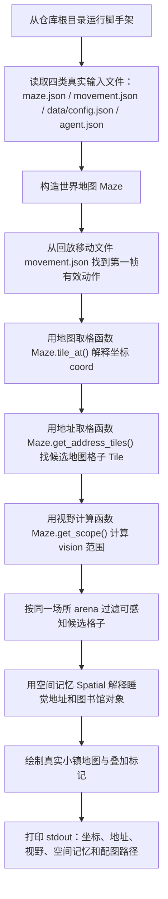

代码逻辑图把 `main()` 的主线压成一条可追踪路径：先把真实文件读进来，再让世界地图 Maze 解释第 13 章的回放坐标，最后把同一批证据同时输出成终端文本和图 14-2。

这段代码保留了脚手架的主线：定位文件、读取回放、构造世界地图 Maze、解释坐标、计算视野、读取空间记忆 Spatial、生成真实小镇地图。图像绘制辅助函数 `draw_world_model_image()` 负责把前端瓦片地图 tile map `tilemap.json` 和瓦片素材集 tileset / tile set 渲染成图 14-2；它不改变世界模型逻辑，只负责把同一批证据画出来。

输出结构如下：

```text
第 14 章世界模型脚手架
======================================
source_replay: generative_agents/results/compressed/book-config-ai-seminar/movement.json
maze_json: generative_agents/frontend/static/assets/village/maze.json
data_config: generative_agents/data/config.json
agent_json: generative_agents/frontend/static/assets/village/agents/阿伊莎/agent.json
world: the Ville
size: width=140, height=100, tile_size=32
address_keys: world -> sector -> arena -> game_object

回放帧 -> 世界地图 Maze / 地图格子 Tile
frame: 1
阿伊莎:
  coord: (119, 24)
  replay_location: 奥克山学院，图书馆，图书馆桌子
  replay_action: 💬 整理桌面资料，迎接克劳斯入座
克劳斯:
  coord: (119, 24)
  replay_location: 奥克山学院，图书馆，图书馆桌子
  replay_action: 💬 克劳斯与阿伊莎以奖学金分配中"参与度评分"为例，用细读方法拆解校园智能体的采集边界、价值偏向与权力预设，探讨是否应量化社区隐形互助活动。
tile_at_coord: coord[119,24]
tile_address: the Ville -> 奥克山学院 -> 图书馆 -> 图书馆桌子
tile_collision: False
address_tile_count: 4
address_tiles: [(119, 22), (119, 24), (122, 22), (122, 24)]

从当前地图格子 Tile 计算感知
percept_config: mode=box, vision_r=8, att_bandwidth=8
vision_scope_count: 289
same_arena: the Ville -> 奥克山学院 -> 图书馆
same_arena_tiles_in_scope: 67

空间记忆 Spatial
阿伊莎.find_address('准备睡觉'): the Ville:奥克山学院宿舍:阿伊莎的房间:床
阿伊莎已知图书馆对象: 图书馆沙发, 图书馆桌子, 书架

image: docs/book/assets/chapter_14/ch14_world_model_demo.png
```

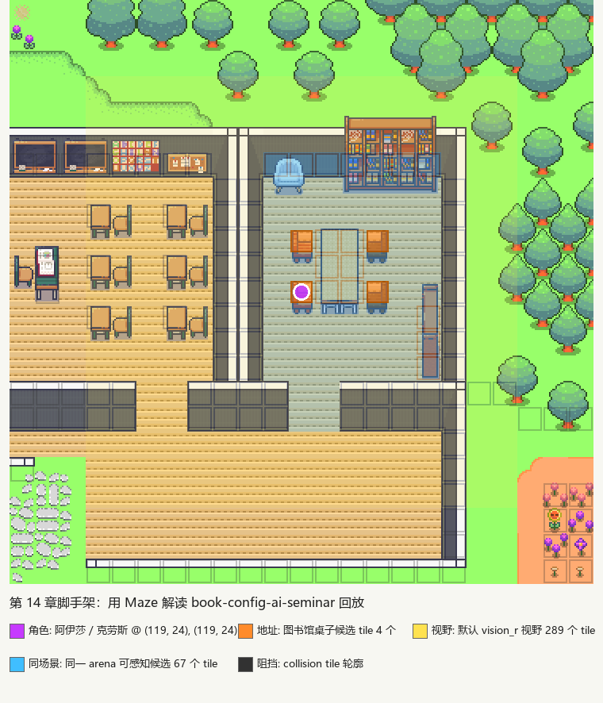

*图 14-2：第 14 章脚手架从第 13 章的 `book-config-ai-seminar` 回放结果下钻世界模型。底图来自前端真实的瓦片地图 tile map 和瓦片素材集 tileset / tile set；紫色是阿伊莎和克劳斯所在的地图格子 Tile，橙色是“图书馆桌子”这个语义地址 address 对应的 4 个候选地图格子，黄色是默认视野范围 vision，蓝色是同一场所 arena 内的可感知候选地图格子，深色轮廓是碰撞标记 collision 对应的不可通行地图格子。*

这段输出把后面的源码片段连成了一个完整链路。

| 输出结果 | 对应源码 | 说明 |
| --- | --- | --- |
| `size: width=140, height=100` | 世界地图初始化函数 `Maze.__init__()` | `maze.json` 中的地图尺寸被加载成后端二维地图格子 Tile 网格。 |
| `source_replay` 与 `frame: 1` | `movement.json` | 脚手架读取第 13 章压缩后的真实回放帧，而不是重新构造一个独立示例。 |
| `coord: (119, 24)` | `movement.json` 中的 `movement` | 回放坐标直接来自阿伊莎和克劳斯在第 13 章的仿真输出。 |
| `tile_address` | 地图取格函数 `Maze.tile_at()`、地图格子地址 `Tile.address` | `[119, 24]` 被后端解释为 `the Ville -> 奥克山学院 -> 图书馆 -> 图书馆桌子`。 |
| `address_tile_count: 4` | `Maze.address_tiles` | 一个语义地址 address 可以对应多个地图格子 Tile，“图书馆桌子”在地图上有 4 个候选格子。 |
| `percept_config` 与 `vision_scope_count: 289` | `data/config.json`、视野计算函数 `Maze.get_scope()` | 项目默认 `vision_r=8`，所以形成 17x17 的方形视野范围，共 289 个地图格子。 |
| `same_arena_tiles_in_scope: 67` | 智能体感知函数 `Agent.percept()` 的场所 arena 过滤 | 视野范围不是全部可感知事件，还要经过同一场所过滤。 |
| `阿伊莎.find_address('准备睡觉')` | 空间记忆找地址函数 `Spatial.find_address()` | 角色自己的空间记忆能把“睡觉”这类行为映射到自己的床。 |
| `阿伊莎已知图书馆对象` | 空间记忆地点树 `Spatial.tree` | 阿伊莎的主观空间记忆中已经知道图书馆沙发、图书馆桌子和书架。 |

这些输出值都有明确来源。`source_replay` 来自第 13 章生成的 `generative_agents/results/compressed/book-config-ai-seminar/movement.json`；`maze_json` 来自项目真实地图；`data_config` 来自项目默认感知配置；`agent_json` 来自阿伊莎的角色配置。脚手架把同一帧回放交给世界地图 Maze、地图格子 Tile 和空间记忆 Spatial 解释：坐标落在哪个地图格子，地图格子属于哪个语义地址，地址有多少候选格，默认视野覆盖多少地图格子，同一场所 arena 中还剩多少可感知候选。

有了这个脚手架，后面读地图格子 Tile、世界地图 Maze、空间记忆 Spatial 和智能体感知函数 `Agent.percept()` 时，就不是在背类名，而是在解释一个已经跑出来的现象。

## 14.3 地图数据入口：maze.json

Generative Agents 的后端地图数据在：

```text
generative_agents/frontend/static/assets/village/maze.json
```

这个文件同时包含三类信息：世界基本配置、前端地图显示配置、后端语义地图格子配置。真实顶层结构是：

```json
{
  "world": "the Ville",
  "tile_size": 32,
  "size": [100, 140],
  "map": {
    "asset": "map",
    "tileset_groups": { ... },
    "layers": [ ... ]
  },
  "camera": {
    "zoom_factor": 1,
    "zoom_range": [0.5, 10, 0.01]
  },
  "tile_address_keys": [
    "world",
    "sector",
    "arena",
    "game_object"
  ],
  "tiles": [...]
}
```

这不是普通地图配置。`map` 主要告诉前端如何画地图；`tiles` 才是后端世界模型真正关心的空间语义、碰撞和对象数据。可以先按这张表读：

| 字段 | 真实值或结构 | 作用 |
| --- | --- | --- |
| `world` | `"the Ville"` | 世界名称。运行时会被加到每个地图格子 Tile 的地址最前面。 |
| `tile_size` | `32` | 每个前端瓦片 tile 的像素大小。 |
| `size` | `[100, 140]` | 后端地图尺寸，含义是高度 100、宽度 140。 |
| `map.asset` | `"map"` | 前端地图资源名。 |
| `map.tileset_groups` | `group_1` 等素材组 | 前端瓦片素材集 tileset / tile set 分组。 |
| `map.layers` | `Bottom Ground`、`Wall`、`Collisions` 等图层 | 前端绘制哪些图层，以及碰撞层如何显示。 |
| `camera` | `zoom_factor`、`zoom_range` | 前端相机缩放配置。 |
| `tile_address_keys` | `world -> sector -> arena -> game_object` | 告诉后端如何解释地址层级。 |
| `tiles` | 4201 条特殊地图格子 Tile 配置 | 后端语义地图入口，包含坐标、地址和碰撞标记。 |

`map.layers` 不是抽象字段，它会列出前端真实图层，例如：

```json
[
  {
    "name": "Bottom Ground",
    "tileset_group": "group_1"
  },
  {
    "name": "Wall",
    "tileset_group": ["CuteRPG_Field_C", "Room_Builder_32x32"]
  },
  {
    "name": "Collisions",
    "tileset_group": ["blocks"],
    "depth": -1,
    "collision": {
      "exclusion": [-1]
    }
  }
]
```

这部分服务前端显示。读源码时更关键的是 `tiles`，它不是占位符，而是一组具体地图格子 Tile 的覆盖配置。文件中一共有 4201 条 `tiles`，其中 3584 条带地址，2064 条带碰撞标记。真实条目长这样：

```json
{
  "coord": [80, 12],
  "collision": true
}
```

```json
{
  "coord": [86, 12],
  "address": ["乔治的公寓", "浴室"],
  "collision": true
}
```

```json
{
  "coord": [119, 24],
  "address": ["奥克山学院", "图书馆", "图书馆桌子"]
}
```

第一条只说明 `[80, 12]` 这个地图格子 Tile 不可通行。第二条同时说明它属于“乔治的公寓 -> 浴室”，并且不可通行。第三条就是第 13 章回放中阿伊莎和克劳斯所在的图书馆桌子地图格子，它没有碰撞标记，因此角色可以站在这里。

几个基础字段要重点理解。`world` 是世界名称。当前项目里仍然是：

```text
the Ville
```

虽然很多地点和角色已经中文化，但世界名 world 仍然保留英文。这不影响后端逻辑，因为它只是地址层级中的根。瓦片尺寸 `tile_size` 表示每个前端瓦片 tile 的像素大小，当前是 32。`size` 表示地图尺寸。可以直接从 `maze.json` 验证这些值：

```bash
python -c "import json; m=json.load(open('generative_agents/frontend/static/assets/village/maze.json', encoding='utf-8')); print(m['world'], m['tile_size'], m['size'], m['tile_address_keys'])"
```

输出会显示：

```text
the Ville 32 [100, 140] ['world', 'sector', 'arena', 'game_object']
```

源码中：

```python
self.maze_height, self.maze_width = config["size"]
```

因此当前地图高度是 100，宽度是 140。脚手架输出里的 `width=140, height=100` 不是另写了一份配置，而是 `Maze.__init__()` 把 `size: [100, 140]` 拆成 `maze_height=100` 和 `maze_width=140` 后打印出来。`tile_address_keys` 定义地址层级，这是后端空间语义的核心。`tiles` 是所有特殊地图格子 Tile 的列表。每个地图格子 Tile 可能包含坐标、地址、碰撞信息等。

## 14.4 地址层级：世界 world、大区域 sector、场所 arena、游戏对象 game_object

`tile_address_keys` 定义了地址层级：

```json
[
  "world",
  "sector",
  "arena",
  "game_object"
]
```

这四层不是四个单独的配置表。`maze.json` 里没有一个叫 `sectors`、`arenas` 或 `game_objects` 的总清单；真正的地点内容写在每个特殊地图格子 Tile 的 `address` 数组里。`tile_address_keys` 只告诉系统如何解释这些数组：`address[0]` 是大区域 sector，`address[1]` 是场所 arena，`address[2]` 是游戏对象 game_object，世界 world 这一层由 `maze.json` 顶部的 `world` 字段统一提供。

当前世界 world 是：

```text
the Ville
```

真实配置可以直接看 `tiles` 里的条目。下面这些片段都来自 `generative_agents/frontend/static/assets/village/maze.json`：

```json
{
  "coord": [85, 12],
  "address": ["乔治的公寓"]
}
```

```json
{
  "coord": [86, 12],
  "address": ["乔治的公寓", "浴室"],
  "collision": true
}
```

```json
{
  "coord": [119, 24],
  "address": ["奥克山学院", "图书馆", "图书馆桌子"]
}
```

这三个例子说明同一个 `address` 数组可以有不同长度。只有一个值时，它只定义到大区域 sector；两个值时，它定义到场所 arena；三个值时，它定义到游戏对象 game_object。进入运行时以后，`Tile.__init__()` 会把世界 world 加到最前面，所以第三个例子最终会变成：

```text
the Ville -> 奥克山学院 -> 图书馆 -> 图书馆桌子
```

可以按下面这张表读配置：

| 配置片段 | 实际含义 | 运行时完整地址 |
| --- | --- | --- |
| `"address": ["乔治的公寓"]` | 大区域 sector 是“乔治的公寓”，没有细分到具体房间。 | `the Ville -> 乔治的公寓` |
| `"address": ["乔治的公寓", "浴室"]` | 大区域 sector 是“乔治的公寓”，场所 arena 是“浴室”。 | `the Ville -> 乔治的公寓 -> 浴室` |
| `"address": ["奥克山学院", "图书馆", "图书馆桌子"]` | 大区域 sector 是“奥克山学院”，场所 arena 是“图书馆”，游戏对象 game_object 是“图书馆桌子”。 | `the Ville -> 奥克山学院 -> 图书馆 -> 图书馆桌子` |

因此，大区域 sector、场所 arena 和游戏对象 game_object 的“清单”，本质上是从所有特殊地图格子 Tile 的 `address` 数组汇总出来的。第 13 章用到的奥克山学院相关配置可以这样看：

| 大区域 sector | 场所 arena | 游戏对象 game_object |
| --- | --- | --- |
| 奥克山学院 | 图书馆 | 书架、图书馆桌子、图书馆沙发 |
| 奥克山学院 | 教室 | 教室学生座位、教室讲台、黑板 |
| 奥克山学院宿舍 | 阿伊莎的房间 | 书桌、壁橱、床、架子 |
| 奥克山学院宿舍 | 克劳斯的房间 | 书桌、壁橱、床、游戏机 |
| 霍布斯咖啡馆 | 咖啡馆 | 冰箱、厨房水槽、咖啡馆柜台后面、咖啡馆顾客座位、烹饪区、钢琴 |

全图里能汇总出 19 个大区域 sector，例如：

```text
乔治的公寓
奥克山学院
奥克山学院宿舍
霍布斯咖啡馆
玫瑰酒吧
约翰逊公园
柳树市场和药店
艺术家共居空间
```

场所 arena 是大区域 sector 中的具体区域。例如：

```text
图书馆
教室
咖啡馆
克劳斯的房间
公共休息室
```

游戏对象 game_object 是可交互对象。例如：

```text
书桌
床
咖啡馆顾客座位
厨房水槽
钢琴
黑板
```

这个层级让系统能在不同粒度上推理。日程可能只说“去奥克山学院学习”。空间选择可以进一步落到“图书馆”。具体当前行动 action 可以落到“图书馆桌子”或“书架”。如果读者想确认某个地点是否真的存在，不要去找单独的 `sector` 配置表，而要去查 `maze.json` 的 `tiles[].address`。

## 14.5 多层级地址的作用

如果地址只有一个字符串，会很难推理。例如：

```text
奥克山学院图书馆图书馆桌子
```

这个字符串可以用，但系统无法轻易知道它属于哪个地点、哪个区域、哪个对象。分层地址能支持三类操作。第一，地点选择。模型可以先选大区域 sector，再选场所 arena，再选对象 object。这比一次性让模型选完整地址更稳定。第二，感知过滤。智能体感知函数 `Agent.percept()` 会限制同一场所 arena 内的事件：

```python
events, arena = {}, self.get_tile().get_address("arena")
for tile in scope:
    if not tile.events or tile.get_address("arena") != arena:
        continue
```

同一视野范围内，不同场所 arena 的事件不会被直接感知。这避免隔墙感知。第三，前端与后端对齐。前端显示的是地图，后端推理的是地址。层级地址让两者能保持语义联系。

## 14.6 世界地图 Maze：从配置生成地图格子网格

`Maze` 也是在：

```text
generative_agents/modules/maze.py
```

它负责组织全部地图格子 Tile。初始化代码一次完成三件事：

```python
class Maze:
    def __init__(self, config, logger):
        # define tiles
        self.maze_height, self.maze_width = config["size"]
        self.tile_size = config["tile_size"]
        address_keys = config["tile_address_keys"]
        self.tiles = [
            [
                Tile((x, y), config["world"], address_keys)
                for x in range(self.maze_width)
            ]
            for y in range(self.maze_height)
        ]
        for tile in config["tiles"]:
            x, y = tile.pop("coord")
            self.tiles[y][x] = Tile((x, y), config["world"], address_keys, **tile)

        # define address
        self.address_tiles = dict()
        for i in range(self.maze_height):
            for j in range(self.maze_width):
                for add in self.tile_at([j, i]).get_addresses():
                    self.address_tiles.setdefault(add, set()).add((j, i))

        self.logger = logger
```

这段初始化代码的执行路径如下：

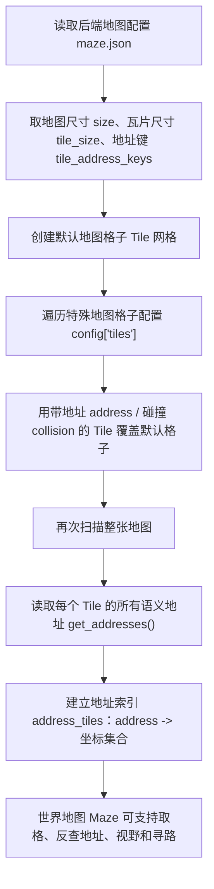

这张代码逻辑图对应 `Maze.__init__()` 的三段结构：先生成全图，再覆盖特殊格子，最后建立地址反向索引。读后面的地址反查和寻路时，要记住它们都依赖这个初始化结果。

第一段创建 140x100 的默认地图格子 Tile 网格。第二段用 `maze.json` 中的 4201 个特殊地图格子 Tile 覆盖默认格子，把地址、碰撞和对象写进去。第三段建立 `address_tiles` 反向索引。它让系统能够从地址反查坐标。例如：

```text
"the Ville:奥克山学院:图书馆"
  -> 一组地图格子 Tile 坐标
```

角色计划去图书馆讨论时，最终必须通过这个索引找到可走坐标。

第 14 章脚手架把“图书馆桌子”这个地址查出来后，结果是：

```text
address_tile_count: 4
address_tiles: [(119, 22), (119, 24), (122, 22), (122, 24)]
```

这就是地址索引 `address_tiles` 的作用。大语言模型 LLM 可以说“去图书馆桌子”，但后端必须把这句话落到真实坐标集合里。

## 14.7 地图格子 Tile：后端表示

`Tile` 定义在：

```text
generative_agents/modules/maze.py
```

它表示地图上的一个格子。先看真实源码，不要只看类名：

```python
class Tile:
    def __init__(
        self,
        coord,
        world,
        address_keys,
        address=None,
        collision=False,
    ):
        # in order: world, sector, arena, game_object
        self.coord = coord
        self.address = [world]
        if address:
            self.address += address
        self.address_keys = address_keys
        self.address_map = dict(zip(address_keys[: len(self.address)], self.address))
        self.collision = collision
        self.event_cnt = 0
        self._events = {}
        if len(self.address) == 4:
            self.add_event(Event(self.address[-1], address=self.address))
```

这段初始化代码的执行路径如下：

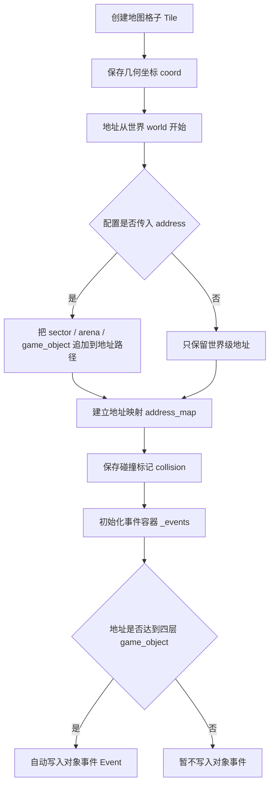

代码逻辑图显示了 `Tile` 的两个分支：没有详细地址的格子只是普通空间；有四层地址的格子会自动带上对象事件，后续才能被智能体感知为“图书馆桌子空闲”这类状态。

这段代码把一个地图格子 Tile 压成四类信息。`coord` 是几何位置；`address` 是语义地址；`address_map` 让代码能按世界 world、大区域 sector、场所 arena 和游戏对象 game_object 取地址；`collision` 决定这个格子能不能走；`_events` 存放这个格子当前能被感知到的状态。最后两行很关键：只要地图格子 Tile 绑定到了四层地址，它一出生就会有一个对象事件。图书馆桌子不是单纯背景，它会成为可感知对象。

核心字段可以这样读：

| 字段 | 中文意思 | 对系统行为的影响 |
| --- | --- | --- |
| `coord` | 地图坐标。 | 决定这个格子在二维小镇中的位置。 |
| `address` | 地址路径。 | 表示这个格子属于哪个世界、区域、房间或对象。 |
| `address_keys` | 地址层级名称。 | 说明 `address` 中每一层分别代表 `world`、`sector`、`arena` 还是 `game_object`。 |
| `address_map` | 地址层级映射。 | 方便代码直接按层级名取地址值，例如取当前 `arena`。 |
| `collision` | 是否阻挡移动。 | 控制角色能不能走过这个格子，避免穿墙或走进不可达区域。 |
| `_events` | 当前格子上的事件。 | 让感知系统知道这里发生了什么、谁在这里、对象是否被占用。 |

例如，第 13 章回放中的 `[119, 24]` 这个地图格子 Tile 地址是：

```text
["the Ville", "奥克山学院", "图书馆", "图书馆桌子"]
```

它的层级含义可以这样理解：

```text
world: the Ville
sector: 奥克山学院
arena: 图书馆
game_object: 图书馆桌子
```

如果一个地图格子 Tile 没有详细地址，它只有世界 world。如果它有四层地址，说明它绑定到具体游戏对象 game_object。第 14 章脚手架把第 13 章的 `[119, 24]` 交给地图取格函数 `Maze.tile_at()` 后，得到的效果是：

```text
tile_at_coord: coord[119,24]
tile_address: the Ville -> 奥克山学院 -> 图书馆 -> 图书馆桌子
tile_collision: False
```

这三行就是 `Tile.__init__()` 的运行结果：同一个坐标同时有几何位置、语义地址和碰撞状态。

## 14.8 事件 Event：让空间变成可感知状态

地图本身只是几何结构。事件 Event 让地图变成可感知世界。先看 `Event` 的真实结构：

```python
class Event:
    def __init__(
        self,
        subject,
        predicate=None,
        object=None,
        address=None,
        describe=None,
        emoji=None,
    ):
        self.subject = subject
        self.predicate = predicate or "此时"
        self.object = object or "空闲"
        self._describe = describe or ""
        self.address = address or []
        self.emoji = emoji or ""

    def __str__(self):
        if self._describe:
            des = "{}".format(self._describe)
        else:
            des = "{} {} {}".format(self.subject, self.predicate, self.object)
        if self.address:
            des += " @ " + ":".join(self.address)
        return des
```

事件主体 `subject` 表示“谁或什么在发生变化”，谓词 `predicate` 和对象 `object` 描述状态，语义地址 `address` 把事件绑定到世界位置，自然语言描述 `describe` 保存可读文本，表情符号 `emoji` 供回放显示状态。事件挂到地图格子 Tile 上以后，可能呈现为：

```text
图书馆桌子
阿伊莎此时整理桌面资料
克劳斯此时与阿伊莎讨论参与度评分
```

## 14.9 地图格子 Tile 如何保存事件 Event

地图格子 Tile 不只是空间位置。它还保存事件。事件相关源码集中在这几段：

```python
def get_events(self):
    return self.events.values()

def add_event(self, event):
    if isinstance(event, (tuple, list)):
        event = Event.from_list(event)
    if all(e != event for e in self._events.values()):
        self._events["e_" + str(self.event_cnt)] = event
        self.event_cnt += 1
    return event

def remove_events(self, subject=None, event=None):
    r_events = {}
    for tag, eve in self._events.items():
        if subject and eve.subject == subject:
            r_events[tag] = eve
        if event and eve == event:
            r_events[tag] = eve
    for r_eve in r_events:
        self._events.pop(r_eve)
    return r_events

def update_events(self, event, match="subject"):
    u_events = {}
    for tag, eve in self._events.items():
        if match == "subject" and eve.subject == event.subject:
            self._events[tag] = event
            u_events[tag] = event
    return u_events
```

这组事件方法的执行路径如下：

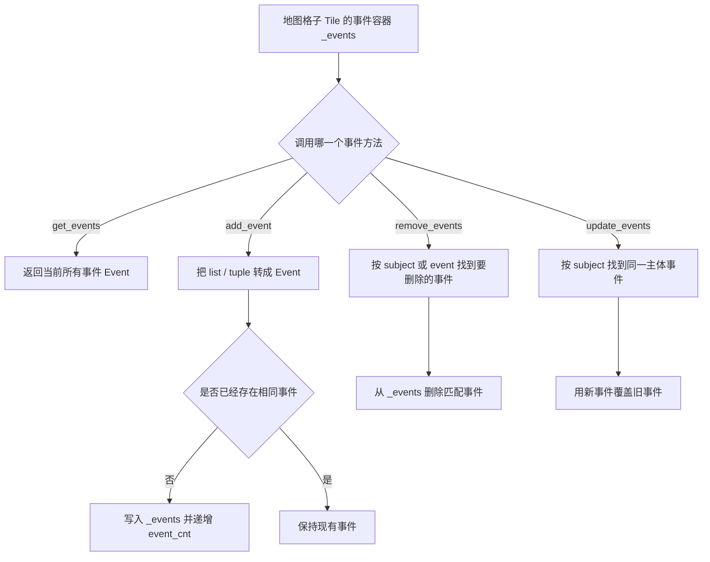

这张代码逻辑图把事件容器的四种操作分开：读取不改状态，添加会去重，删除会清理旧事件，更新会按主体 subject 覆盖对象或角色当前状态。

这让地图格子 Tile 成为世界状态的一部分。`add_event()` 往格子里放事件；`remove_events()` 在角色离开时清理旧事件；`update_events()` 按事件主体 subject 更新同一对象的状态；`get_events()` 供感知系统读取。角色在某个地图格子 Tile 上读书，地图格子 Tile 保存的是“角色正在读书”这个事件 event。对象被占用，地图格子 Tile 保存的是“桌子被谁使用”这个事件 event。

如果地图格子 Tile 上有游戏对象 game_object，初始化时也会给它添加一个默认事件：

```python
if len(self.address) == 4:
    self.add_event(Event(self.address[-1], address=self.address))
```

带对象的地图格子 Tile 一开始就有一个对象事件。其他智能体 Agent 感知附近时，不是直接读取抽象坐标，而是读取地图格子 Tile 上的事件 events。世界通过事件变得可观察。

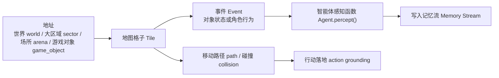

*图 14-3：地图格子 Tile、地址与事件 Event 的关系。地图格子 Tile 把空间地址、可感知事件和行动落地连接在一起。*

这些事件 event 会被智能体感知函数 `Agent.percept()` 收集。如果某个智能体 Agent 看到了它们，它会把新事件写入记忆流 memory stream。这条链路是：

```text
地图格子事件 Tile.events
  -> 视野计算函数 Maze.get_scope()
  -> 智能体感知函数 Agent.percept()
  -> 记忆节点 Concept
  -> 关联记忆加节点函数 Associate.add_node()
```

所以，世界模型不是只服务移动，也服务记忆。没有地图格子事件 tile event，智能体无法观察世界发生了什么。

## 14.10 从语义地址 address 到目标地图格子 Tile

当智能体 Agent 需要移动到某个地址时，系统会调用地址取格函数 `Maze.get_address_tiles()`：

```python
def get_address_tiles(self, address):
    addr = ":".join(address)
    if addr in self.address_tiles:
        return self.address_tiles[addr]
    return random.choice(self.address_tiles.values())
```

这段代码的执行路径如下：

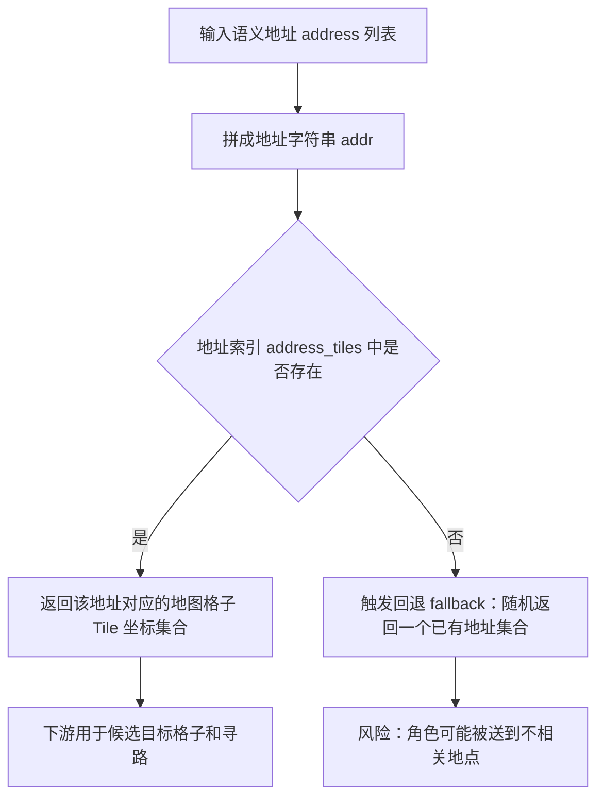

代码逻辑图把这个函数最重要的边界暴露出来：正常路径是语义地址反查坐标集合；异常路径不是报错，而是随机回退。调试世界模型时，这个回退必须重点检查。

它把地址列表 list 拼成字符串，再查 `address_tiles`。如果找到，返回这一地址对应的地图格子 Tile 集合。如果找不到，当前实现会随机返回一个地址集合。这个回退 fallback 很危险，也很现实。它能避免系统直接崩溃，但可能导致角色去到奇怪地点。后续如果要提升项目可靠性，可以把这里改成更可解释的失败策略：

- 记录错误日志。
- 回退到当前地图格子 Tile。
- 回退到角色已知随机地址。
- 让模型重新选择地址。
- 在实验中标记为空间落地失败 spatial grounding failure。

当前实现的好处是仿真能继续跑。坏处是错误可能被隐藏。

## 14.11 碰撞 collision 与寻路

地图中并不是所有地图格子 Tile 都能走。`Tile` 有：

```python
self.collision = collision
```

`Maze.get_around()` 默认会排除带碰撞标记的地图格子 collision tile：

```python
def get_around(self, coord, no_collision=True):
    coords = [
        (coord[0] - 1, coord[1]),
        (coord[0] + 1, coord[1]),
        (coord[0], coord[1] - 1),
        (coord[0], coord[1] + 1),
    ]
    if no_collision:
        coords = [c for c in coords if not self.tile_at(c).collision]
    return coords
```

寻路函数 `Maze.find_path()` 使用类似广度优先搜索的方式，从起点扩展到终点：

```python
def find_path(self, src_coord, dst_coord):
    map = [[0 for _ in range(self.maze_width)] for _ in range(self.maze_height)]
    frontier, visited = [src_coord], set()
    map[src_coord[1]][src_coord[0]] = 1
    while map[dst_coord[1]][dst_coord[0]] == 0:
        new_frontier = []
        for f in frontier:
            for c in self.get_around(f):
                if (
                    0 < c[0] < self.maze_width - 1
                    and 0 < c[1] < self.maze_height - 1
                    and map[c[1]][c[0]] == 0
                    and c not in visited
                ):
                    map[c[1]][c[0]] = map[f[1]][f[0]] + 1
                    new_frontier.append(c)
                    visited.add(c)
        if not new_frontier:
            return []
        frontier = new_frontier
    step = map[dst_coord[1]][dst_coord[0]]
    path = [dst_coord]
    while step > 1:
        for c in self.get_around(path[-1]):
            if map[c[1]][c[0]] == step - 1:
                path.append(c)
                break
        step -= 1
    return path[::-1]
```

这段寻路代码的执行路径如下：

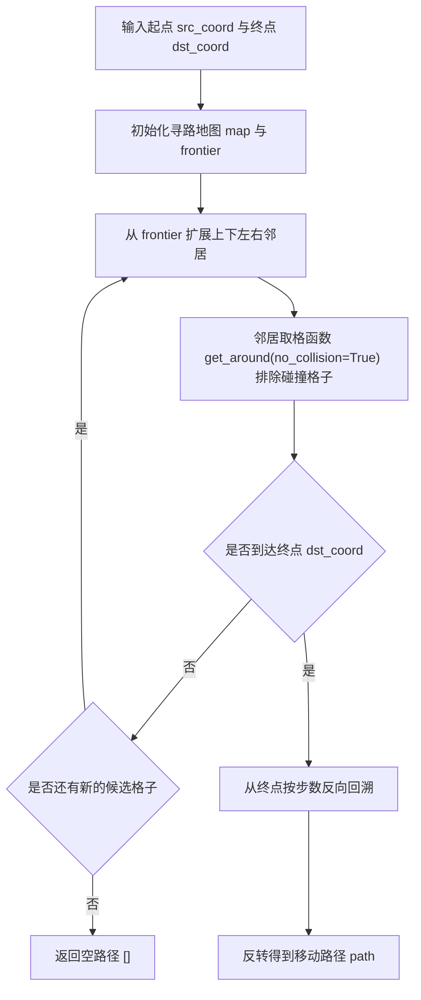

代码逻辑图可以帮助读者抓住两个关键判断：`get_around()` 决定能不能走过某个格子，`new_frontier` 为空则说明找不到路径。大语言模型 LLM 不参与这一步坐标级寻路。

这段代码只考虑上下左右四个方向，并且通过邻居取格函数 `get_around()` 避开带碰撞标记的地图格子 collision tile。如果找不到路径，返回空列表。这说明移动不是大语言模型 LLM 直接决定每一步坐标。大语言模型 LLM 决定的是目标行为和目标地址，寻路由后端确定。大模型适合决定“去哪儿做什么”，不适合每步规划像素级路径。

## 14.12 空间记忆 Spatial：角色自己的地点知识

世界地图 Maze 是全局地图。空间记忆 Spatial 是角色自己的空间记忆。它定义在：

```text
generative_agents/modules/memory/spatial.py
```

初始化代码很短，但信息密度很高：

```python
class Spatial:
    def __init__(self, tree, address=None):
        self.tree = tree
        self.address = address or {}
        if "sleeping" not in self.address and "睡觉" not in self.address and "living_area" in self.address:
            self.address["睡觉"] = self.address["living_area"] + ["床"]
```

`tree` 是角色知道的地点树。`address` 是一些常用行为到地址的快捷映射。第 13 章实验使用阿伊莎，她的 `agent.json` 中有这样的空间记忆：

```json
"spatial": {
  "address": {
    "living_area": ["the Ville", "奥克山学院宿舍", "阿伊莎的房间"]
  },
  "tree": {
    "the Ville": {
      "奥克山学院": {
        "图书馆": ["图书馆沙发", "图书馆桌子", "书架"],
        "教室": ["黑板", "教室讲台", "教室学生座位"]
      },
      "奥克山学院宿舍": {
        "阿伊莎的房间": ["架子", "壁橱", "书桌", "床"]
      }
    }
  }
}
```

空间记忆构造函数 `Spatial.__init__()` 会根据居住区域 `living_area` 自动补出“睡觉”地址，所以脚手架输出：

```text
阿伊莎.find_address('准备睡觉'): the Ville:奥克山学院宿舍:阿伊莎的房间:床
阿伊莎已知图书馆对象: 图书馆沙发, 图书馆桌子, 书架
```

这两行说明角色不只知道自己当前在哪，也知道“睡觉”这类常用行为应该落到哪里。

## 14.13 空间记忆 Spatial 与世界地图 Maze 的区别

世界地图 Maze 和空间记忆 Spatial 很容易混淆。它们都和地点有关，但职责不同。世界地图 Maze 是客观世界。它知道地图上所有地图格子 Tile、地址、碰撞和事件。空间记忆 Spatial 是主观记忆。它表示某个智能体 Agent 知道哪些地点，以及某些行为要去哪里。这对应现实世界中的差别：

```text
城市客观存在很多地方。
但某个人不一定知道所有地方。
```

代码中也体现了这一点。智能体感知函数 `Agent.percept()` 会把看到的对象地址加入空间记忆 spatial memory：

```python
if tile.has_address("game_object"):
    self.spatial.add_leaf(tile.address)
```

角色会通过探索逐步知道更多地点。这让空间记忆可以成长。

## 14.14 空间记忆找地址函数 Spatial.find_address()

当智能体 Agent 计划执行某个活动时，系统会先尝试用空间记忆找地址函数 `Spatial.find_address()` 找地址。代码很简单：

```python
def find_address(self, hint, as_list=True):
    address = []
    for key, path in self.address.items():
        if key in hint:
            address = path
            break
    if as_list:
        return address
    return ":".join(address)
```

这段代码的执行路径如下：

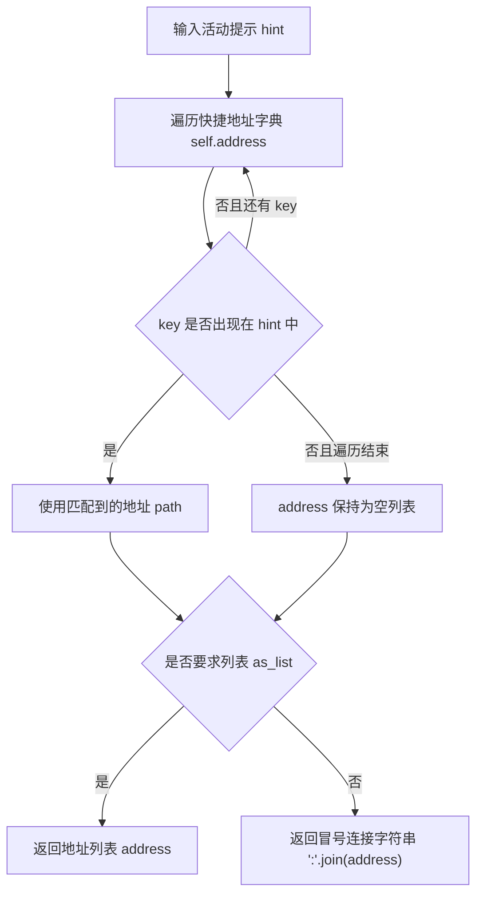

代码逻辑图说明了空间记忆找地址函数的能力边界：它只做关键词命中，不做复杂语义推理。没有命中时，后续才需要进入模型选择大区域、场所和对象的路径。

它不是复杂语义匹配，而是关键词匹配。例如，如果提示词 hint 包含“睡觉”，就会返回睡觉地址。这说明当前项目的空间落地 spatial grounding 分两级。第一，简单行为用规则映射。第二，找不到时再让大语言模型 LLM 从空间树中选择大区域 sector、场所 arena、对象 object。这种设计很务实。高频行为如睡觉不需要每次调用大语言模型 LLM。复杂行为再交给模型选择。

## 14.15 空间记忆加叶子函数 Spatial.add_leaf()

空间记忆加叶子函数 `Spatial.add_leaf()` 用来更新角色空间记忆。真实源码如下：

```python
def add_leaf(self, address):
    def _add_leaf(left_address, tree):
        if len(left_address) == 2:
            leaves = tree.setdefault(left_address[0], [])
            if left_address[1] not in leaves:
                leaves.append(left_address[1])
        elif len(left_address) > 2:
            _add_leaf(left_address[1:], tree.setdefault(left_address[0], {}))

    _add_leaf(address, self.tree)
```

这段递归代码的执行路径如下：

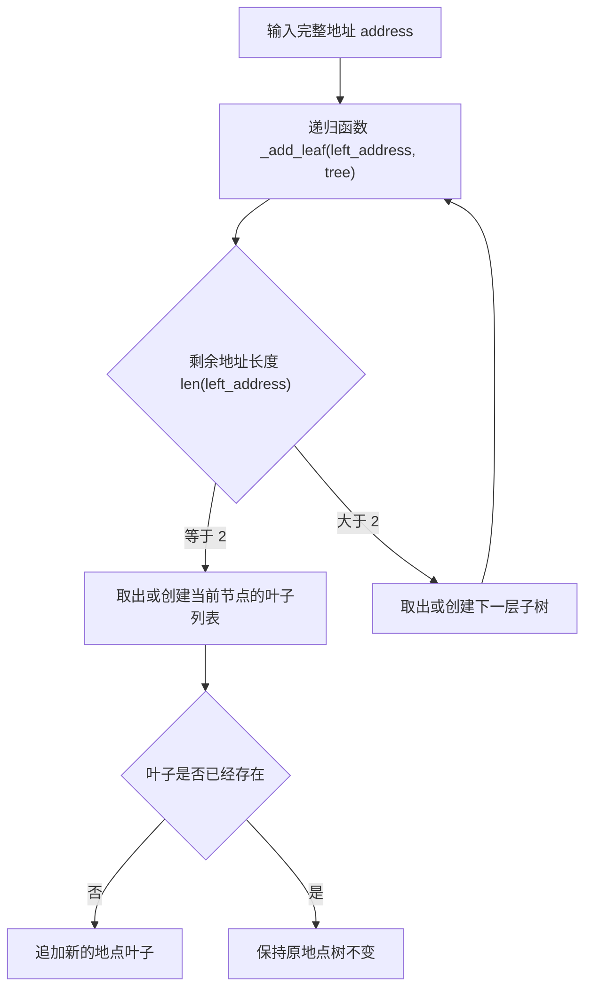

代码逻辑图把“加叶子”这个名字说清楚了：它不是直接把整条地址塞进列表，而是沿着地点树逐层向下走，直到最后两层时才把具体对象 object 加成叶子。

当角色感知到一个带游戏对象 game_object 的地图格子 Tile，会把这个地址加入自己的地点树 tree。这意味着角色“知道了”这个地方。例如，角色进入奥克山学院图书馆后，可能看到：

```text
the Ville -> 奥克山学院 -> 图书馆 -> 书架
```

于是它的空间记忆中加入这个叶子。这样，后续计划“查资料”或“去图书馆讨论”时，角色更可能选择正确地点。这与论文中的记忆流 memory stream 不同。空间记忆 Spatial memory 不是事件记忆，而是地点知识。它不回答“发生了什么”，而回答“哪里有什么”。

## 14.16 世界模型如何服务感知

感知链路从视野计算函数 `Maze.get_scope()` 开始。`get_scope()` 根据当前位置和感知配置返回附近地图格子 Tile。当前实现支持 `box` 模式：

```python
def get_scope(self, coord, config):
    coords = []
    vision_r = config["vision_r"]
    if config["mode"] == "box":
        x_range = [
            max(coord[0] - vision_r, 0),
            min(coord[0] + vision_r + 1, self.maze_width),
        ]
        y_range = [
            max(coord[1] - vision_r, 0),
            min(coord[1] + vision_r + 1, self.maze_height),
        ]
        coords = list(product(list(range(*x_range)), list(range(*y_range))))
    return [self.tile_at(c) for c in coords]
```

`vision_r` 来自感知配置。项目默认值在：

```text
generative_agents/data/config.json
```

对应片段是：

```json
"percept": {
  "mode": "box",
  "vision_r": 8,
  "att_bandwidth": 8
}
```

第 14 章脚手架直接读取这个默认配置，所以输出 `percept_config: mode=box, vision_r=8, att_bandwidth=8` 和 `vision_scope_count: 289`。289 来自 17x17 的方形视野。阿伊莎和克劳斯所在的 `[119, 24]` 附近虽然有 289 个地图格子 Tile 会先进入空间范围，但实际能进入注意力的事件还要继续受场所 arena 过滤和注意力带宽 `att_bandwidth` 限制。

然后智能体感知函数 `Agent.percept()` 在这些地图格子 Tile 中筛选同一场所 arena 的事件 events。真实源码可以分三段读：

```python
def percept(self):
    scope = self.maze.get_scope(self.coord, self.percept_config)
    # add spatial memory
    for tile in scope:
        if tile.has_address("game_object"):
            self.spatial.add_leaf(tile.address)
    events, arena = {}, self.get_tile().get_address("arena")
    # gather events in scope
    for tile in scope:
        if not tile.events or tile.get_address("arena") != arena:
            continue
        dist = math.dist(tile.coord, self.coord)
        for event in tile.get_events():
            if dist < events.get(event, float("inf")):
                events[event] = dist
    events = list(sorted(events.keys(), key=lambda k: events[k]))
```

第一段取视野范围；第二段把看到的游戏对象 game_object 写入空间记忆 Spatial；第三段只保留同一场所 arena 内的事件，并按距离排序。接下来才进入注意力带宽：

```python
for idx, event in enumerate(events[: self.percept_config["att_bandwidth"]]):
    recent_nodes = (
        self.associate.retrieve_events() + self.associate.retrieve_chats()
    )
    recent_nodes = set(n.describe for n in recent_nodes)
    if event.get_describe() not in recent_nodes:
        if event.object == "idle" or event.object == "空闲":
            node = Concept.from_event(
                "idle_" + str(idx), "event", event, poignancy=1
            )
        else:
            valid_num += 1
            node_type = "chat" if event.fit(self.name, "对话") else "event"
            node = self._add_concept(node_type, event)
            self.status["poignancy"] += node.poignancy
        self.concepts.append(node)
self.concepts = [c for c in self.concepts if c.event.subject != self.name]
```

这两段感知代码合起来的执行路径如下：

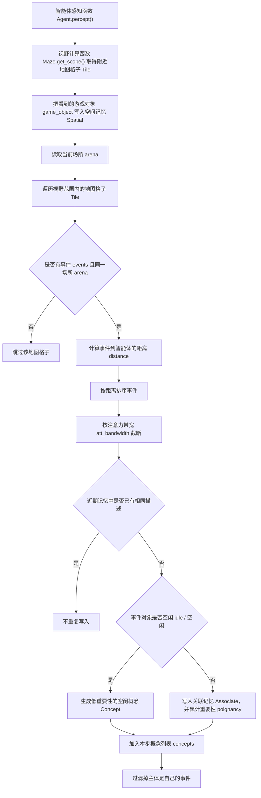

代码逻辑图把感知链路拆成几道门：空间范围、同一场所、注意力带宽和近期去重。地图上看见过的东西也会顺手写进空间记忆，这就是世界模型和角色主观记忆连接的地方。

这说明感知由三个条件共同决定：

```text
空间距离
  + 场所 arena 限制
  + attention bandwidth
```

这让角色不会拥有全知视角。信息扩散、关系形成和偶遇都依赖这种有限感知。

## 14.17 世界模型如何服务计划

计划是文字。世界模型把文字计划变成地点行动。在行动落地函数 `Agent._determine_action()` 中，系统先取当前计划，再尝试用空间记忆找地址函数 `Spatial.find_address()` 做规则映射：

```python
plan, de_plan = self.schedule.current_plan()
describes = [plan["describe"], de_plan["describe"]]
address = self.spatial.find_address(describes[0], as_list=True)
```

如果空间记忆 Spatial 找不到地址，系统会构造可选空间树，让模型选择：

```python
if not address:
    tile = self.get_tile()
    kwargs = {
        "describes": describes,
        "spatial": self.spatial,
        "address": tile.get_address("world", as_list=True),
    }
    kwargs["address"].append(
        self.completion("determine_sector", **kwargs, tile=tile)
    )
    arenas = self.spatial.get_leaves(kwargs["address"])
    if len(arenas) == 1:
        kwargs["address"].append(arenas[0])
    else:
        kwargs["address"].append(self.completion("determine_arena", **kwargs))
    objs = self.spatial.get_leaves(kwargs["address"])
    if len(objs) == 1:
        kwargs["address"].append(objs[0])
    elif len(objs) > 1:
        kwargs["address"].append(self.completion("determine_object", **kwargs))
    address = kwargs["address"]
```

最后生成角色事件和对象事件：

```python
event = self.make_event(self.name, describes[-1], address)
obj_describe = self.completion("describe_object", address[-1], describes[-1])
obj_event = self.make_event(address[-1], obj_describe, address)
```

行动落地函数的执行路径如下：

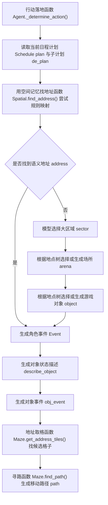

代码逻辑图说明了计划落地的核心：文字计划不会直接变成坐标，而是先变成语义地址 address，再变成候选地图格子 Tile，最后才变成移动路径 path。

然后地址取格函数 `Maze.get_address_tiles()` 把地址转成候选地图格子 Tile。寻路函数 `Maze.find_path()` 决定移动路径。这条链路是：

```text
plan text
  -> spatial hint
  -> address
  -> tiles
  -> 移动路径 path
  -> 当前行动 action
```

没有世界模型，Planning 无法变成行动。

### 空间落地提示词 prompt：世界模型和模型选择的交界处

这一段代码里有第 14 章最重要的提示词 prompt 边界：世界地图 Maze 和空间记忆 Spatial 先给出客观候选，模型只在候选列表里做选择。也就是说，大语言模型 LLM 不是凭空想一个地点，而是把“正在做什么”这句计划文字，落到项目已经知道的大区域 sector、场所 arena 和游戏对象 game_object 上。

这组提示词 prompt 的位置如下：

| 提示词 prompt | 读取的世界模型信息 | 模型输出 | 下游使用位置 |
| --- | --- | --- | --- |
| 大区域选择 `determine_sector` | 当前世界 world 下的候选大区域 sectors、角色居住区域、当前位置、当天计划 | 一个大区域 sector | 追加到语义地址 `address` |
| 场所选择 `determine_arena` | 目标大区域 sector 下的候选场所 arenas、当天计划、当前活动 | 一个场所 arena | 继续细化语义地址 `address` |
| 对象选择 `determine_object` | 当前场所 arena 下的候选游戏对象 game_objects、当前活动 | 一个游戏对象 game_object | 作为行动对象和寻路目标 |
| 物品状态 `describe_object` | 角色、行动描述、选中的游戏对象 game_object | 一个对象状态短句 | 生成对象事件 `obj_event`，写回地图格子 Tile |

**1. 大区域选择 determine_sector**

中文原文：

```text
在区域选项中，为当前任务选择一个合适的区域。

${agent} 住在 <${live_sector}>，里面有 ${live_arenas}。
${agent} 目前的位置是 <${current_sector}>，里面有 ${current_arenas}。
${daily_plan}
问题：
${agent} 正在 ${complete_plan}。为了 ${decomposed_plan}，${agent} 应该去哪里？

要求：
1. 必须在这个列表中选择一个区域，列表：[${areas}]。
2. 如果现在正位于列表中的区域，并且计划的活动可以在这里进行，最好留在当前区域。
3. 不要选择列表以外的区域。
4. 直接输出选中的结果。

${agent} 应该去：
```

英文版本 English version：

```text
Choose a suitable sector from the sector options for the current task.

${agent} lives in <${live_sector}>, which contains ${live_arenas}.
${agent} is currently in <${current_sector}>, which contains ${current_arenas}.
${daily_plan}
Question:
${agent} is currently ${complete_plan}. To ${decomposed_plan}, where should ${agent} go?

Requirements:
1. Choose one sector from this list: [${areas}].
2. If the agent is already in a listed sector and the planned activity can be done there, prefer staying in the current sector.
3. Do not choose anything outside the list.
4. Output only the selected result.

${agent} should go to:
```

大区域选择 `determine_sector` 的输入不是整张地图，而是空间记忆 Spatial 在当前世界 world 下能列出来的大区域 sectors。提示词 prompt 同时放入居住区域、当前位置和当天计划，是为了让模型在“就近完成”和“去专门场所完成”之间做选择。输出结构 schema 是字符串 `str`。回调函数 callback 会校验结果是否命中大区域列表；如果模型输出的是场所 arena 名，代码还会把它映射回所属大区域 sector。这个设计把模型限制在世界模型已经存在的地点里。

**2. 场所选择 determine_arena**

中文原文：

```text
在区域选项中，为当前任务选择一个合适的区域。

${agent} 正去往 <${target_sector}>，里面有 ${target_arenas}。
${daily_plan}
问题：
${agent} 正在 ${complete_plan}。为了 ${decomposed_plan}，${agent} 应该去 ${target_sector} 里面的哪个区域？

要求：
1. 必须在这个列表中选择一个区域，列表：[${target_arenas}]。
2. 如果现在正位于列表中的区域，并且计划的活动可以在这里进行，最好留在当前区域。
3. 不要选择列表以外的区域。
4. 直接输出选中的结果。

${agent} 应该去：
```

英文版本 English version：

```text
Choose a suitable arena from the arena options for the current task.

${agent} is going to <${target_sector}>, which contains ${target_arenas}.
${daily_plan}
Question:
${agent} is currently ${complete_plan}. To ${decomposed_plan}, which arena inside ${target_sector} should ${agent} go to?

Requirements:
1. Choose one arena from this list: [${target_arenas}].
2. If the agent is already in a listed arena and the planned activity can be done there, prefer staying in the current arena.
3. Do not choose anything outside the list.
4. Output only the selected result.

${agent} should go to:
```

场所选择 `determine_arena` 比大区域选择 `determine_sector` 更细一层。此时目标大区域 sector 已经确定，模型只需要在这个大区域下面的场所 arenas 中选择。真实模板中文里仍然写“区域”，但源码变量是 `target_arenas`，对应本章的场所 arena。输出如果不在候选列表里，回调函数 callback 会使用随机兜底值 failsafe。调试时如果看到角色去了不合适的场所，应该先检查候选场所列表，再检查模型输出是否被回调函数替换。

**3. 对象选择 determine_object**

中文原文：

```text
从选项列表中，为当前活动选择最相关的对象。

当前活动：${activity}

要求：
1. 必须在这个列表中选择一个对象：[${objects}]。
2. 不要选择列表以外的对象。
3. 直接输出选中的结果。

与当前活动最相关的对象是：
```

英文版本 English version：

```text
Choose the most relevant object for the current activity from the option list.

Current activity: ${activity}

Requirements:
1. Choose one object from this list: [${objects}].
2. Do not choose anything outside the list.
3. Output only the selected result.

The object most relevant to the current activity is:
```

对象选择 `determine_object` 的输入进一步收窄，只剩当前活动 activity 和候选对象 objects。它不再解释角色设定，也不再放入完整日程，因为目标场所 arena 已经确定。对克劳斯这类案例来说，如果当前活动是“阅读并批注选中的学术文章”，候选对象里有“图书馆桌子”，模型就应该返回“图书馆桌子”。这一步之后，语义地址 address 才真正到达第四层：

```text
the Ville -> 奥克山学院 -> 图书馆 -> 图书馆桌子
```

**4. 物品状态 describe_object**

中文原文：

```text
任务：用不超过10个字的短句，描述某人身边物品的状态。注意：只输出物品的状态描述，不要包含物品名称。

示例：

一步一步地思考 烤箱 的状态：
步骤1：山姆正在 烤箱 旁边吃早餐。
步骤2：描述 烤箱 的状态。
输出：正在加热以烹饪早餐

一步一步地思考 电脑 的状态：
步骤1：迈克正在用 电脑 写电子邮件。
步骤2：描述 电脑 的状态。
输出：正在用于编写电子邮件

一步一步地思考 水槽 的状态：
步骤1：汤姆正在用 水槽 洗脸。
步骤2：描述 水槽 的状态。
输出：正在进水

根据上述示例，一步一步思考 ${object} 的状态：
步骤1：${agent} 正在 ${action}，身边是 ${object}
步骤2：描述 ${object} 的状态。
输出：
```

英文版本 English version：

```text
Task: Describe the state of an object near a person in a short phrase of no more than 10 Chinese characters. Output only the object's state description, and do not include the object's name.

Examples:

Think step by step about the state of the oven:
Step 1: Sam is eating breakfast next to the oven.
Step 2: Describe the state of the oven.
Output: heating up to cook breakfast

Think step by step about the state of the computer:
Step 1: Mike is using the computer to write emails.
Step 2: Describe the state of the computer.
Output: being used to write emails

Think step by step about the state of the sink:
Step 1: Tom is using the sink to wash his face.
Step 2: Describe the state of the sink.
Output: filling with water

Based on the examples above, think step by step about the state of ${object}:
Step 1: ${agent} is ${action}, and ${object} is nearby.
Step 2: Describe the state of ${object}.
Output:
```

物品状态 `describe_object` 和前三个提示词 prompt 不同。前三个是在封闭候选列表 closed list 中选地点；它是在给对象事件 obj_event 补状态。源码里的连接点是：

```python
obj_describe = self.completion("describe_object", address[-1], describes[-1])
obj_event = self.make_event(address[-1], obj_describe, address)
```

如果当前行动落到“图书馆桌子”，对象状态可能变成：

```text
图书馆桌子 此时 正在用于阅读资料 @ the Ville:奥克山学院:图书馆:图书馆桌子
```

这条对象事件 obj_event 会写回地图格子 Tile。后续其他智能体 Agent 感知同一场所 arena 时，看到的就不只是“这里有一张桌子”，而是“这张桌子正在被用于阅读资料”。这就是世界模型和提示词 prompt 结合后产生的效果：地图负责位置，提示词负责把对象状态说成人能读、智能体也能继续处理的事件文本。

把四个提示词 prompt 合在一起看，14.17 的输入、处理和输出是：

| 阶段 | 输入 | 处理逻辑 | 输出 |
| --- | --- | --- | --- |
| 输入 | 当前计划 plan、子计划 de_plan、当前位置 Tile、空间记忆 Spatial、候选大区域/场所/对象列表 | 先用规则地址 `Spatial.find_address()` 命中；命不中再调用提示词 prompt | 待解析的行动语义 |
| 处理 | `determine_sector`、`determine_arena`、`determine_object`、`describe_object` | 逐层选择地址，并给对象生成状态短句 | 语义地址 address 和对象描述 obj_describe |
| 输出 | 选中的地址、角色事件、对象事件 | `Maze.get_address_tiles()` 找候选地图格子 Tile，`Maze.find_path()` 生成路径 | 当前行动 action、对象事件 obj_event、移动路径 path |

## 14.18 世界模型如何服务社交

社交也依赖空间。角色要先看见别人，才可能对话。智能体感知函数 `Agent.percept()` 会收集附近事件，其中事件主体 subject 是其他智能体 Agent 的事件优先级更高。反应函数 `_reaction()` 会优先选择与其他智能体 Agent 相关的概念 concept：

```python
def _reaction(self, agents=None, ignore_words=None):
    focus = None
    ignore_words = ignore_words or ["空闲"]

    def _focus(concept):
        return concept.event.subject in agents

    def _ignore(concept):
        return any(i in concept.describe for i in ignore_words)

    if agents:
        priority = [i for i in self.concepts if _focus(i)]
        if priority:
            focus = random.choice(priority)
    if not focus:
        priority = [i for i in self.concepts if not _ignore(i)]
        if priority:
            focus = random.choice(priority)
    if not focus or focus.event.subject not in agents:
        return
    other, focus = agents[focus.event.subject], self.associate.get_relation(focus)

    if self._chat_with(other, focus):
        return True
    if self._wait_other(other, focus):
        return True
    return False
```

这段社交反应代码的执行路径如下：

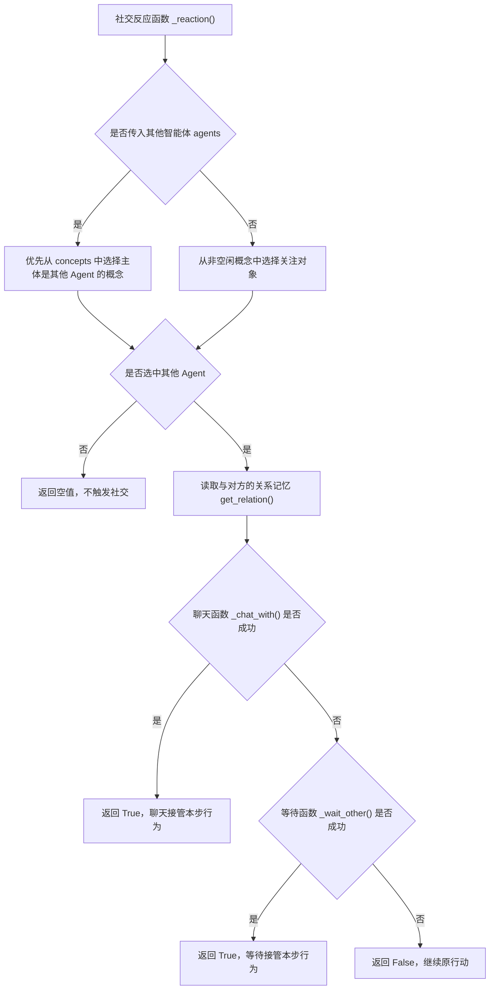

代码逻辑图显示：社交不是随机广播，而是先由世界模型和感知结果提供“附近有谁”的概念，再由聊天或等待分支决定是否改变当前行动。

如果选中另一个智能体 Agent，就可能进入聊天函数 `_chat_with()`。这意味着对话不是全局随机发生，而是由空间相遇触发。第 13 章中，阿伊莎和克劳斯能进入对话，第一层条件就是两人同在“奥克山学院 -> 图书馆 -> 图书馆桌子”这个地址附近；后面的反应函数 `_reaction()` 再决定是否真正聊天。如果世界模型不限制相遇，对话传播就会变成广播。

## 14.19 世界模型如何服务对象占用

当前行动 Action 不只包含角色事件，还可以包含对象事件 `obj_event`。在行动落地函数 `_determine_action()` 中：

```python
obj_describe = self.completion("describe_object", address[-1], describes[-1])
obj_event = self.make_event(address[-1], obj_describe, address)
```

之后移动函数 `move()` 会更新地图格子 Tile 上的对象事件：

```python
def move(self, coord, path=None):
    events = {}

    def _update_tile(coord):
        tile = self.maze.tile_at(coord)
        if not self.action:
            return {}
        if not tile.update_events(self.get_event()):
            tile.add_event(self.get_event())
        obj_event = self.get_event(False)
        if obj_event:
            self.maze.update_obj(coord, obj_event)
        return {e: coord for e in tile.get_events()}
```

对象更新函数 `Maze.update_obj()` 会找到同一游戏对象 game_object 地址对应的所有地图格子 Tile，并更新对象事件：

```python
def update_obj(self, coord, obj_event):
    tile = self.tile_at(coord)
    if not tile.has_address("game_object"):
        return
    if obj_event.address != tile.get_address("game_object"):
        return
    addr = ":".join(obj_event.address)
    if addr not in self.address_tiles:
        return
    for c in self.address_tiles[addr]:
        self.tile_at(c).update_events(obj_event)
```

对象占用更新的执行路径如下：

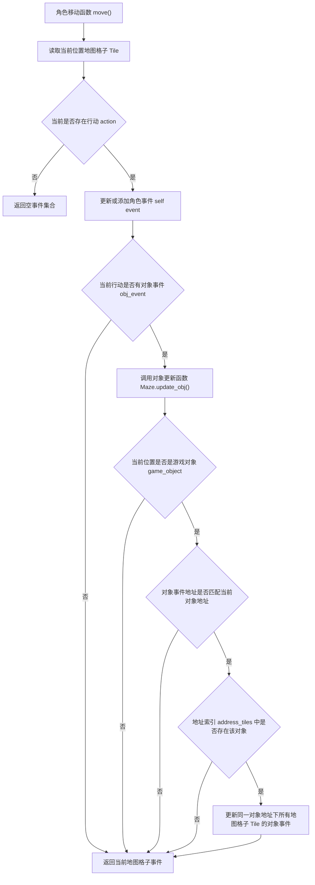

代码逻辑图把对象占用的传播范围说清楚了：一个游戏对象 game_object 可能占多个地图格子，更新时不能只改角色站着的那个格子，而要更新同一语义地址下的所有候选格子。

这让对象状态成为可感知内容。例如，床、书桌、厨房水槽、咖啡馆座位都可以显示正在被如何使用。这对等待机制也很重要。如果两个角色对同一对象产生冲突，等待函数 `_wait_other()` 才有依据判断是否等待。

## 14.20 世界模型如何服务回放

回放依赖坐标和动作。智能体思考函数 `Agent.think()` 每一步都会把角色当前状态打包成计划 `plan`：

```python
def think(self, status, agents):
    events = self.move(status["coord"], status.get("path"))
    plan, _ = self.make_schedule()

    if self.is_awake():
        self.percept()
        self.make_plan(agents)
        self.reflect()

    emojis = {}
    if self.action:
        emojis[self.name] = {"emoji": self.get_event().emoji, "coord": self.coord}
    for eve, coord in events.items():
        if eve.subject in agents:
            continue
        emojis[":".join(eve.address)] = {"emoji": eve.emoji, "coord": coord}
    self.plan = {
        "name": self.name,
        "path": self.find_path(agents),
        "emojis": emojis,
    }
    return self.plan
```

这段回放打包代码的执行路径如下：

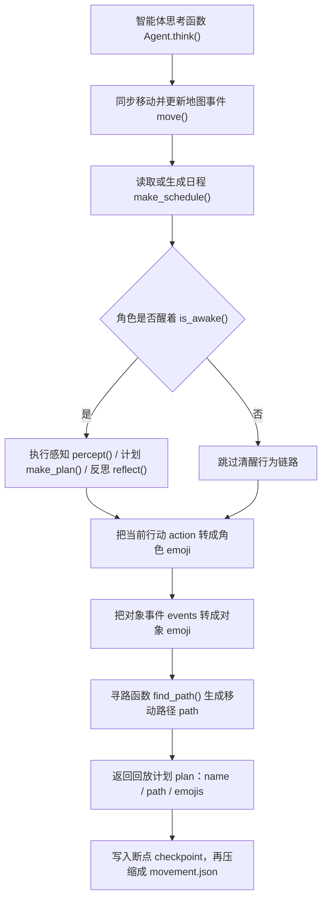

代码逻辑图说明了回放不是前端自造动画。后端每一步把行动、对象状态和移动路径打包成 `plan`，之后才进入断点 checkpoint 和移动回放文件 `movement.json`。

移动路径 `path` 是角色接下来要走的坐标序列。状态符号 `emojis` 描述角色或对象当前状态。这些信息进入断点 checkpoint，再被压缩脚本 `compress.py` 处理为回放移动文件 `movement.json`。第 13 章压缩后的回放帧就是这种结构：

```json
{
  "阿伊莎": {
    "location": "奥克山学院，图书馆，图书馆桌子",
    "movement": [119, 24],
    "action": "💬 整理桌面资料，迎接克劳斯入座"
  },
  "克劳斯": {
    "location": "奥克山学院，图书馆，图书馆桌子",
    "movement": [119, 24],
    "action": "💬 克劳斯与阿伊莎以奖学金分配中\"参与度评分\"为例..."
  }
}
```

前端渲染引擎 Phaser 根据回放移动文件 `movement.json` 播放角色移动和状态变化。所以，前端动画不是独立制作的，而是后端世界模型和智能体行动 agent action 的结果。这就是“可解释回放”的基础。

## 14.21 世界模型的边界：地图生成困难

README 中提到一个现实问题：

wounderland 原作者没有提供 `maze.json` 的生成代码。因此，如果要创建新地图，需要：

1. 参考原始项目 `maze.py` 逻辑，兼容 Tiled 导出的 JSON 和 CSV。
2. 参考现有 `maze.json` 格式，自行合并地图元数据和碰撞 collision、大区域 sector、场所 arena、对象 object 数据。
3. 使用外部工具，例如 `jiejieje/tiled_to_maze.json`。

这说明当前项目的地图系统可运行，但地图生产链路还不够完善。修改角色和事件比修改地图容易。如果要新增地点，需要特别小心：

- 前端瓦片地图 tile map 是否有视觉资源。
- 后端 `maze.json` 是否有地址。
- 空间记忆地点树 `Spatial.tree` 是否让角色知道新地点。
- 提示词 prompt 是否能理解新地点用途。
- 对象是否有合理名称。

新增或修改小镇地图时，可以把它看成一条“视觉地图 -> 后端语义 -> 角色认知 -> 回放验证”的链路：

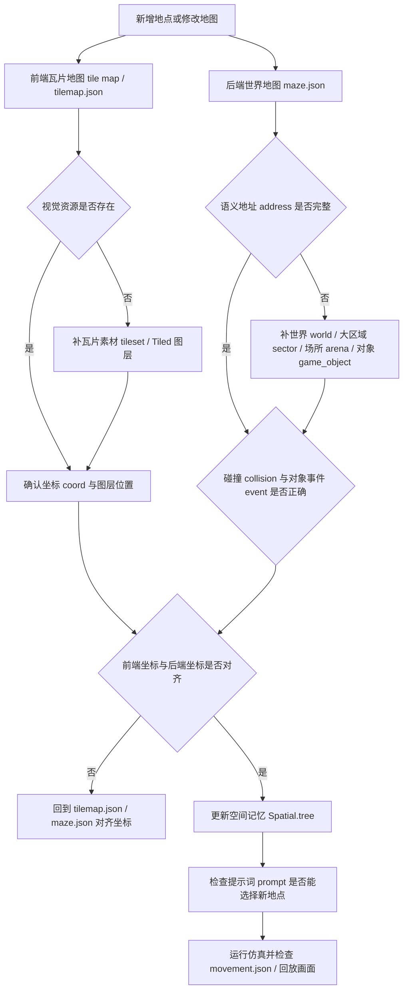

## 14.22 世界模型的边界：地址回退 fallback

前面讲过，地址取格函数 `Maze.get_address_tiles()` 找不到地址时会随机返回一个地址集合。这会隐藏空间错误。例如，模型输出了一个不存在的地址：

```text
the Ville:不存在的地点:大厅
```

系统不会立刻报错，而可能随机给一个可用地址。仿真会继续，但角色行为可能变奇怪。写实验时要注意这种情况。如果发现角色突然去不合理地点，要检查：

- 大语言模型 LLM 选择的地址是否存在。
- 空间记忆地点树 `Spatial.tree` 是否包含该地点。
- `maze.address_tiles` 是否有对应地址。
- 地址取格函数 `get_address_tiles()` 是否触发回退 fallback。

这类问题可以按下面的调试路径排查：

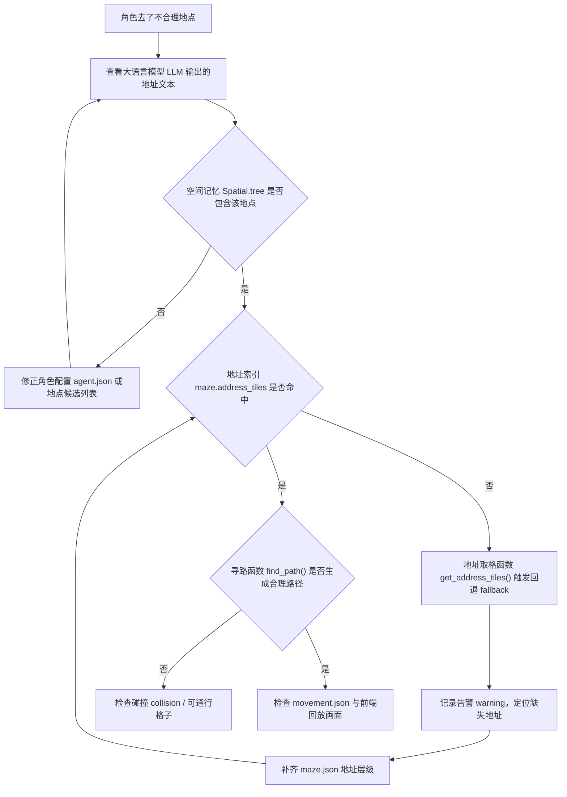

后续如果改进项目，可以把回退 fallback 改为显式记录告警 warning。

## 14.23 世界模型的边界：场所 arena 感知简化

当前感知限制使用同一场所 arena。这比完全基于距离更合理，但仍然是简化。现实中，视线、墙、门、声音、开放空间、遮挡都会影响感知。当前项目没有复杂视线模拟。例如：

- 同一场所 arena 中可能隔着家具。
- 不同场所 arena 中可能相邻但开门可见。
- 声音传播与视觉不同。

这些都没有细分。但对教学和实验来说，当前设计已经足够表达核心思想：

```text
智能体 Agent 只能看到附近、同一语义区域内的事件。
```

这比全局感知更接近社会仿真。

## 14.24 世界模型的边界：对象语义依赖提示词 prompt

地图知道对象名称，但不真正知道对象用途。例如：

```text
钢琴
厨房水槽
咖啡馆顾客座位
图书馆桌子
```

这些对象用途主要靠大语言模型 LLM 根据名称理解。系统没有一个显式本体 ontology 说明：

```text
钢琴可以演奏。
床可以睡觉。
厨房水槽可以洗东西。
咖啡馆顾客座位可以坐下喝咖啡。
```

这带来灵活性，也带来风险。灵活性是：新增对象时，只要名字清楚，模型可能理解。风险是：模型可能误解对象用途，或者做出不符合场所规范的行为。如果要做更严谨的智能体世界 agent world，可以考虑为对象增加可供性 affordance：

14.17 中的对象选择 `determine_object` 和物品状态 `describe_object` 就是这个边界的具体入口。世界模型 Maze 知道“图书馆桌子”这个名字和坐标，空间记忆 Spatial 知道它属于“奥克山学院 -> 图书馆”，但“桌子适合阅读、写论文、整理资料”这种用途语义，仍然主要来自提示词 prompt 和大语言模型 LLM 的常识。

```json
{
  "object": "床",
  "affordances": ["睡觉", "休息"],
  "capacity": 1
}
```

这属于第五部分前沿升级可以讨论的方向。

## 14.25 如何读世界模型源码

世界模型源码适合按运行顺序读。第一，先看后端地图文件 `maze.json`，理解世界名 world、瓦片尺寸 tile_size、地图尺寸 size、地址键 tile_address_keys 和特殊地图格子 tiles。第二，看地址层级，理解世界 world、大区域 sector、场所 arena 和游戏对象 game_object 如何把一个地点拆成可推理的结构。第三，看世界地图初始化函数 `Maze.__init__()`，理解地图格子 Tile 网格和地址索引 address_tiles 如何建立。第四，看地图格子 `Tile` 和事件 `Event`，理解坐标 coord、语义地址 address、碰撞 collision 和事件 events 如何组成世界状态。第五，看地址取格函数 `Maze.get_address_tiles()` 和寻路函数 `Maze.find_path()`，理解语义地址如何落到候选地图格子 Tile，再变成可移动路径。第六，看空间记忆 Spatial，理解角色主观地点知识和客观世界地图 Maze 的差别。第七，回到智能体感知函数 `Agent.percept()`、行动落地函数 `_determine_action()`、社交反应和回放压缩，看世界模型如何进入完整智能体 Agent 行为链路。按这个顺序读，世界模型就不是“地图文件”，而是感知、计划、行动和回放共同依赖的底层结构。

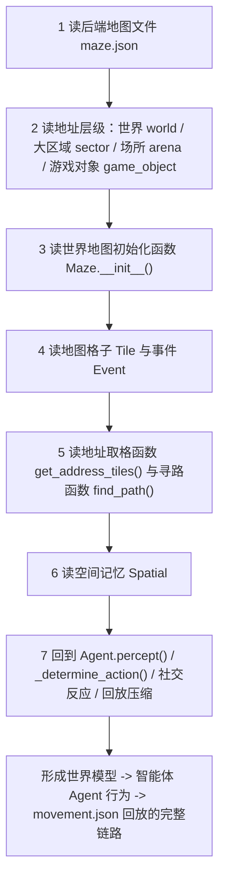

## 14.26 本章小结

世界模型是源码深读的第一站。地图不是前端背景，而是感知、计划、社交、对象占用和回放共同依赖的底层结构。

| 本章内容 | 核心结论 |
| --- | --- |
| 基础术语 | 前端显示由瓦片地图 tile map、瓦片素材集 tileset / tile set 和前端渲染引擎 Phaser 完成；后端空间由世界地图 Maze、地图格子 Tile、坐标 coord、语义地址 address、场所 arena、碰撞标记 collision 和视野范围 vision 组织；角色行为再通过空间记忆 Spatial、地点树 tree、当前行动 action 和回放移动坐标 movement 进入仿真与回放。 |
| `maze.json` | 它是后端世界数据入口，不只是地图资源文件。 |
| 地址层级 | 世界 world -> 大区域 sector -> 场所 arena -> 游戏对象 game_object，让行动可以落到具体地点和对象。 |
| 世界地图 Maze | 世界地图 Maze 组织所有地图格子 Tile，建立地址索引，并提供视野和寻路能力。 |
| 地图格子 Tile | 地图格子 Tile 保存坐标、地址、碰撞和事件，是世界状态的基本单位。 |
| 地图格子事件 tile events | 事件让世界状态可被智能体 Agent 感知，而不是只存在于画面上。 |
| 地址落地与寻路 | 语义地址 address 先通过地址取格函数 `Maze.get_address_tiles()` 找到候选地图格子 Tile，再通过寻路函数 `Maze.find_path()` 变成可移动路径。 |
| 空间记忆 Spatial | 空间记忆 Spatial 是角色自己的空间记忆，不等于全局地图。 |
| 感知和计划 | 智能体感知函数 `Agent.percept()` 用世界地图 Maze 读取附近事件，行动落地函数 `_determine_action()` 把计划落到地址和路径。 |
| 空间落地提示词 prompt | `determine_sector`、`determine_arena`、`determine_object` 和 `describe_object` 把计划文字绑定到大区域 sector、场所 arena、游戏对象 game_object 和对象事件 obj_event。 |
| 系统作用 | 世界模型同时服务感知、计划、社交、对象占用和回放。 |
| 当前边界 | 地图生成、地址回退 fallback、场所 arena 感知简化和对象语义依赖提示词 prompt，都是后续扩展风险。 |

下一章讲智能体初始化：从角色配置文件 `agent.json` 进入智能体构造函数 `Agent.__init__()`，看角色设定如何进入人格草稿 Scratch、空间记忆 Spatial、日程 Schedule、关联记忆 Associate 和当前行动 action。

## 参考资料

- Local source: `generative_agents/modules/maze.py`
- Local source: `generative_agents/modules/agent.py`
- Local source: `generative_agents/modules/memory/spatial.py`
- Local source: `generative_agents/modules/prompt/scratch.py`
- Local data: `generative_agents/frontend/static/assets/village/maze.json`
- Local data: `generative_agents/frontend/static/assets/village/agents/*/agent.json`
- Local prompts: `generative_agents/data/prompts/determine_sector.txt`
- Local prompts: `generative_agents/data/prompts/determine_arena.txt`
- Local prompts: `generative_agents/data/prompts/determine_object.txt`
- Local prompts: `generative_agents/data/prompts/describe_object.txt`
- Local README map notes: `README.md`
