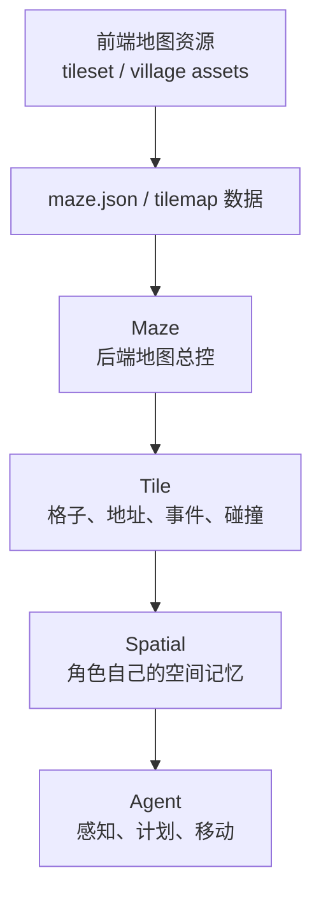
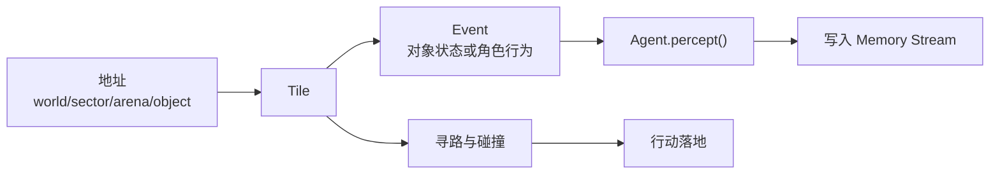

# 第 14 章 世界模型：地图、Tile、地址树与空间记忆

## 14.1 核心问题

第三部分进入源码深读。先不讲 LLM，也不讲记忆，先讲世界。Generative Agents 不是普通聊天系统。它的智能体必须生活在一个共享空间里。如果没有世界模型，下面这些问题都无法回答：

- 克劳斯现在在哪里？
- 玛丽亚能不能看到克劳斯？
- 伊莎贝拉说的霍布斯咖啡馆在地图上哪里？
- 角色计划睡觉时会去哪个房间？
- 角色准备吃饭时会选择哪个地点？
- 某个对象是否正在被占用？
- 两个角色是否会在同一地点相遇？

论文中的 Smallville 是一个实验小镇。Generative Agents 中，这个小镇由四层组成：

```text
地图数据：maze.json、tilemap 资源
后端模型：Maze、Tile
角色空间记忆：Spatial
前端回放：Phaser 读取 movement.json
```

这里先讲前三层，前端回放放到第 23 章。世界模型源码要回答七个问题：

1. `maze.json` 存了什么？
2. `Tile` 如何表示一个地图格子？
3. `Maze` 如何组织 tile、地址和寻路？
4. 地址树 `world/sector/arena/game_object` 有什么作用？
5. `Spatial` 和 `Maze` 的区别是什么？
6. 空间模型如何服务感知、计划、行动和回放？
7. 当前地图系统有哪些边界？



*图 14-1：世界模型四层结构。地图不是一张背景图，而是从资源、数据、后端对象到角色空间记忆的一整套约束。*

## 14.2 世界模型的优先位置

看源码时很容易先盯住 `Agent`，因为智能体看起来是系统核心。但在 Generative Agents 中，`Agent` 离不开世界。它的每一步都要依赖世界模型。初始化时，agent 要根据坐标找到自己所在 tile。计划行动时，agent 要把文字计划落到地址。感知时，agent 要从附近 tile 获取事件。移动时，agent 要通过 `Maze.find_path()` 找路。对话时，agent 要知道自己和对方是否在同一可交互空间。回放时，系统要把 agent 坐标和动作转成前端可展示数据。所以，世界模型不是背景资源，而是 agent 行为的地基。如果世界模型错了，LLM 再强也会表现奇怪。例如：

- 计划去咖啡馆，却走到宿舍。
- 在墙里穿行。
- 在不同房间却能看到对方。
- 睡觉时找不到床。
- 洗澡时去厨房水槽。

这些问题都不是 prompt 能单独解决的。它们首先是空间 grounding 问题。

### 可运行脚手架：先把世界模型跑出来

源码片段只有在运行结果旁边才有意义。第 14 章配套了一个最小脚手架，专门演示 `maze.json`、`Maze`、`Tile`、`Event` 和 `Spatial` 如何一起工作。它不调用 LLM，也不依赖外部 API，只读取项目里的真实地图和伊莎贝拉的真实角色配置。

从仓库根目录运行：

```bash
.venv/bin/python docs/book/scaffolds/part_03/ch14_world_model_demo.py
```

本机实际输出如下：

```text
Chapter 14 world-model scaffold
======================================
maze_json: generative_agents/frontend/static/assets/village/maze.json
world: the Ville
size: width=140, height=100, tile_size=32
address_keys: world -> sector -> arena -> game_object

Tile and address
target_address: the Ville -> 霍布斯咖啡馆 -> 咖啡馆 -> 咖啡馆顾客座位
address_tile_count: 11
chosen_tile: (72, 23)
tile_address: the Ville -> 霍布斯咖啡馆 -> 咖啡馆 -> 咖啡馆顾客座位
tile_collision: False
tile_events:
  - 咖啡馆顾客座位 此时 空闲 @ the Ville:霍布斯咖啡馆:咖啡馆:咖啡馆顾客座位
  - 伊莎贝拉此时检查咖啡机和研磨设备 @ the Ville:霍布斯咖啡馆:咖啡馆:咖啡馆顾客座位

Path and perception
src_coord: (72, 14)
path_length: 22
vision_scope_count: 81
same_arena_tiles_in_scope: 40

Spatial memory
find_address('准备睡觉'): the Ville:伊莎贝拉的公寓:主人房:床
after add_leaf cafe leaves: 冰箱, 咖啡馆顾客座位, 烹饪区, 厨房水槽, 咖啡馆柜台后面, 钢琴

image: docs/book/assets/chapter_14/ch14_world_model_demo.png
```


*图 14-2：第 14 章脚手架生成的可视化结果。绿色是伊莎贝拉初始坐标，红色是目标对象 tile，蓝色是 `Maze.find_path()` 算出的路径，黄色是 `vision_r=4` 的感知范围，橙色是同一地址对应的候选 tile。*

这段输出把后面的源码片段连成了一个完整链路。

| 输出结果 | 对应源码 | 说明 |
| --- | --- | --- |
| `size: width=140, height=100` | `Maze.__init__()` | `maze.json` 中的地图尺寸被加载成后端二维 tile 网格。 |
| `target_address` 与 `address_tile_count: 11` | `Maze.address_tiles` | 一个语义地址可以对应多个地图格子，角色行动需要在这些候选 tile 中落点。 |
| `tile_events` | `Tile.add_event()`、`Event.__str__()` | Tile 不只是坐标，还保存对象状态和角色事件，后续感知会读取这些事件。 |
| `path_length: 22` | `Maze.find_path()` | 从伊莎贝拉初始坐标到咖啡馆顾客座位，需要后端寻路，而不是 LLM 逐格决定移动。 |
| `vision_scope_count: 81` | `Maze.get_scope()` | `vision_r=4` 会形成 9x9 的方形视野，一共 81 个 tile。 |
| `same_arena_tiles_in_scope: 40` | `Agent.percept()` 的 arena 过滤 | 视野范围不是全部可感知事件，还要经过同一 arena 过滤。 |
| `find_address('准备睡觉')` | `Spatial.find_address()` | 角色自己的空间记忆能把“睡觉”这类行为映射到自己的床。 |
| `after add_leaf cafe leaves` | `Spatial.add_leaf()` | 角色感知到新对象后，空间记忆可以增加新的地点叶子。 |

有了这个脚手架，后面读 `Tile`、`Maze`、`Spatial` 和 `Agent.percept()` 时，就不是在背类名，而是在解释一个已经跑出来的现象。

## 14.3 地图数据入口：maze.json

Generative Agents 的后端地图数据在：

```text
generative_agents/frontend/static/assets/village/maze.json
```

这个文件同时包含视觉地图相关配置和后端空间信息。开头可以看到：

```json
{
  "world": "the Ville",
  "tile_size": 32,
  "size": [100, 140],
  "map": { ... },
  "tile_address_keys": [
    "world",
    "sector",
    "arena",
    "game_object"
  ],
  "tiles": [...]
}
```

几个字段要重点理解。`world` 是世界名称。当前项目里仍然是：

```text
the Ville
```

虽然很多地点和角色已经中文化，但 world 名称保留了英文。这不影响后端逻辑，因为它只是地址层级中的根。`tile_size` 是前端 tile 像素大小。当前是 32。`size` 表示地图尺寸。源码中：

```python
self.maze_height, self.maze_width = config["size"]
```

因此当前地图高度是 100，宽度是 140。`tile_address_keys` 定义地址层级。这是后端空间语义的核心。`tiles` 是所有特殊 tile 的列表。每个 tile 可能包含坐标、地址、碰撞信息等。

## 14.4 Tile：地图格子的后端表示

`Tile` 定义在：

```text
generative_agents/modules/maze.py
```

它表示地图上的一个格子。初始化参数包括：

```python
def __init__(
    self,
    coord,
    world,
    address_keys,
    address=None,
    collision=False,
):
```

核心字段主要包括，需要逐项查看：

| 字段 | 中文意思 | 对系统行为的影响 |
| --- | --- | --- |
| `coord` | 地图坐标。 | 决定这个格子在二维小镇中的位置。 |
| `address` | 地址路径。 | 表示这个格子属于哪个世界、区域、房间或对象。 |
| `address_keys` | 地址层级名称。 | 说明 `address` 中每一层分别代表 `world`、`sector`、`arena` 还是 `game_object`。 |
| `address_map` | 地址层级映射。 | 方便代码直接按层级名取地址值，例如取当前 `arena`。 |
| `collision` | 是否阻挡移动。 | 控制角色能不能走过这个格子，避免穿墙或走进不可达区域。 |
| `_events` | 当前格子上的事件。 | 让感知系统知道这里发生了什么、谁在这里、对象是否被占用。 |

例如，一个 tile 的地址可能是：

```text
["the Ville", "霍布斯咖啡馆", "咖啡馆", "咖啡馆顾客座位"]
```

它的层级含义可以这样理解：

```text
world: the Ville
sector: 霍布斯咖啡馆
arena: 咖啡馆
game_object: 咖啡馆顾客座位
```

如果一个 tile 没有详细地址，它只有 world。如果它有四层地址，说明它绑定到具体 game object。

## 14.5 Tile 上的事件

Tile 不只是地图格子。它还保存事件。`Tile` 中有：

```python
self._events = {}
```

以及这些相关方法，可以这样处理：

```python
add_event()
remove_events()
update_events()
get_events()
```

这让 tile 成为世界状态的一部分。例如，角色在某个 tile 上读书，tile 会保存这个角色的 event。如果 tile 上有 game object，初始化时也会给它添加一个默认事件：

```python
if len(self.address) == 4:
    self.add_event(Event(self.address[-1], address=self.address))
```

带对象的 tile 一开始就有一个对象事件。其他 agent 感知附近时，不是直接读取抽象坐标，而是读取 tile 上的 events。世界通过事件变得可观察。



*图 14-3：Tile、地址与事件关系。Tile 把空间地址、可感知事件和行动落地连接在一起。*

## 14.6 Event 让空间变成可感知状态

地图本身只是几何结构。Event 让地图变成可感知世界。一个 tile 可能包含：

```text
咖啡馆顾客座位
伊莎贝拉此时准备情人节派对材料
阿伊莎此时与伊莎贝拉对话
```

这些 event 会被 `Agent.percept()` 收集。如果某个 agent 看到了它们，它会把新事件写入 memory stream。这条链路是：

```text
Tile.events
  -> Maze.get_scope()
  -> Agent.percept()
  -> Concept
  -> Associate.add_node()
```

所以，世界模型不是只服务移动，也服务记忆。没有 tile event，智能体无法观察世界发生了什么。

## 14.7 Maze：地图总控对象

`Maze` 也是在：

```text
generative_agents/modules/maze.py
```

它负责组织全部 tile。初始化时，`Maze` 做三件关键事情。第一，创建默认 tile 网格：

```python
self.tiles = [
    [
        Tile((x, y), config["world"], address_keys)
        for x in range(self.maze_width)
    ]
    for y in range(self.maze_height)
]
```

第二，用 `maze.json` 中的特殊 tile 覆盖默认 tile：

```python
for tile in config["tiles"]:
    x, y = tile.pop("coord")
    self.tiles[y][x] = Tile((x, y), config["world"], address_keys, **tile)
```

第三，建立地址索引：

```python
self.address_tiles = dict()
for i in range(self.maze_height):
    for j in range(self.maze_width):
        for add in self.tile_at([j, i]).get_addresses():
            self.address_tiles.setdefault(add, set()).add((j, i))
```

它让系统能够从地址反查坐标。例如：

```text
"the Ville:霍布斯咖啡馆:咖啡馆"
  -> 一组 tile 坐标
```

角色计划去咖啡馆时，最终必须通过这个索引找到可走坐标。

## 14.8 地址层级：world、sector、arena、game_object

`tile_address_keys` 定义了地址层级：

```json
[
  "world",
  "sector",
  "arena",
  "game_object"
]
```

这四层分别解决不同粒度的问题。`world` 是根。当前是：

```text
the Ville
```

`sector` 是较大地点。例如：

```text
奥克山学院
奥克山学院宿舍
霍布斯咖啡馆
玫瑰酒吧
约翰逊公园
柳树市场和药店
```

`arena` 是 sector 中的具体区域。例如：

```text
图书馆
教室
咖啡馆
克劳斯的房间
公共休息室
```

`game_object` 是可交互对象。例如：

```text
书桌
床
咖啡馆顾客座位
厨房水槽
钢琴
黑板
```

这个层级让系统能在不同粒度上推理。日程可能只说“去奥克山学院学习”。空间选择可能进一步落到“图书馆”。具体 action 可能落到“图书馆桌子”或“书架”。

## 14.9 多层级地址的作用

如果地址只有一个字符串，会很难推理。例如：

```text
霍布斯咖啡馆咖啡馆顾客座位
```

这个字符串可以用，但系统无法轻易知道它属于哪个地点、哪个区域、哪个对象。分层地址能支持三类操作。第一，地点选择。模型可以先选 sector，再选 arena，再选 object。这比一次性让模型选完整地址更稳定。第二，感知过滤。`Agent.percept()` 会限制同一 arena 内的事件：

```python
events, arena = {}, self.get_tile().get_address("arena")
for tile in scope:
    if not tile.events or tile.get_address("arena") != arena:
        continue
```

同一视野范围内，不同 arena 的事件不会被直接感知。这避免隔墙感知。第三，前端与后端对齐。前端显示的是地图，后端推理的是地址。层级地址让两者能保持语义联系。

## 14.10 碰撞与寻路

地图中并不是所有 tile 都能走。`Tile` 有：

```python
self.collision = collision
```

`Maze.get_around()` 默认会排除 collision tile：

```python
if no_collision:
    coords = [c for c in coords if not self.tile_at(c).collision]
```

`Maze.find_path()` 使用类似广度优先搜索的方式，从起点扩展到终点。它只考虑上下左右四个方向：

```python
(x-1, y)
(x+1, y)
(x, y-1)
(x, y+1)
```

如果找不到路径，返回空列表。这说明移动不是 LLM 直接决定每一步坐标。LLM 决定的是目标行为和目标地址，寻路由后端确定。这是正确的职责划分。大模型适合决定“去哪儿做什么”，不适合每步规划像素级路径。

## 14.11 从地址到目标 tile

当 agent 需要移动到某个地址时，系统会调用：

```python
Maze.get_address_tiles(address)
```

它把地址 list 拼成字符串：

```python
addr = ":".join(address)
```

然后查 `address_tiles`。如果找到，返回这一地址对应的 tile 集合。如果找不到，当前实现会随机返回一个地址集合：

```python
return random.choice(self.address_tiles.values())
```

这个 fallback 很危险，也很现实。它能避免系统直接崩溃，但可能导致角色去到奇怪地点。后续如果要提升项目可靠性，可以把这里改成更可解释的失败策略：

- 记录错误日志。
- 回退到当前 tile。
- 回退到角色已知随机地址。
- 让模型重新选择地址。
- 在实验中标记为 spatial grounding failure。

当前实现的好处是仿真能继续跑。坏处是错误可能被隐藏。

## 14.12 Spatial：角色自己的空间记忆

`Maze` 是全局地图。`Spatial` 是角色自己的空间记忆。它定义在：

```text
generative_agents/modules/memory/spatial.py
```

初始化参数主要包括：

```python
def __init__(self, tree, address=None):
```

`tree` 是角色知道的地点树。`address` 是一些常用行为到地址的快捷映射。例如克劳斯的 `agent.json` 中：

```json
"spatial": {
  "address": {
    "living_area": [
      "the Ville",
      "奥克山学院宿舍",
      "克劳斯的房间"
    ]
  },
  "tree": {
    "the Ville": {
      "奥克山学院": { ... },
      "奥克山学院宿舍": { ... },
      "霍布斯咖啡馆": { ... }
    }
  }
}
```

`Spatial` 初始化时还会补一个睡觉地址：

```python
if "睡觉" not in self.address and "living_area" in self.address:
    self.address["睡觉"] = self.address["living_area"] + ["床"]
```

这让“睡觉”可以直接映射到角色房间里的床。

## 14.13 Spatial 与 Maze 的区别

`Maze` 和 `Spatial` 很容易混淆。它们都和地点有关，但职责不同。`Maze` 是客观世界。它知道地图上所有 tile、地址、碰撞和事件。`Spatial` 是主观记忆。它表示某个 agent 知道哪些地点，以及某些行为要去哪里。这对应现实世界中的差别：

```text
城市客观存在很多地方。
但某个人不一定知道所有地方。
```

代码中也体现了这一点。`Agent.percept()` 会把看到的对象地址加入 spatial memory：

```python
if tile.has_address("game_object"):
    self.spatial.add_leaf(tile.address)
```

角色会通过探索逐步知道更多地点。这让空间记忆可以成长。

## 14.14 Spatial.find_address()

当 agent 计划执行某个活动时，系统会先尝试用 `Spatial.find_address()` 找地址。代码很简单：

```python
def find_address(self, hint, as_list=True):
    address = []
    for key, path in self.address.items():
        if key in hint:
            address = path
            break
    if as_list:
        return address
    return ":".join(address)
```

它不是复杂语义匹配，而是关键词匹配。例如，如果 hint 包含“睡觉”，就会返回睡觉地址。这说明当前项目的空间 grounding 分两级。第一，简单行为用规则映射。第二，找不到时再让 LLM 从空间树中选择 sector、arena、object。这种设计很务实。高频行为如睡觉不需要每次调用 LLM。复杂行为再交给模型选择。

## 14.15 Spatial.add_leaf()

`Spatial.add_leaf()` 用来更新角色空间记忆。当角色感知到一个带 game_object 的 tile，会把这个地址加入自己的 tree。这意味着角色“知道了”这个地方。例如，角色进入霍布斯咖啡馆后，可能看到：

```text
the Ville -> 霍布斯咖啡馆 -> 咖啡馆 -> 钢琴
```

于是它的空间记忆中加入这个叶子。这样，后续计划“弹钢琴”或“去咖啡馆”时，角色更可能选择正确地点。这与论文中的 memory stream 不同。Spatial memory 不是事件记忆，而是地点知识。它不回答“发生了什么”，而回答“哪里有什么”。

## 14.16 世界模型如何服务感知

感知链路从 `Maze.get_scope()` 开始。`get_scope()` 根据当前位置和感知配置返回附近 tile。当前实现支持 `box` 模式：

```python
vision_r = config["vision_r"]
x_range = [
    max(coord[0] - vision_r, 0),
    min(coord[0] + vision_r + 1, self.maze_width),
]
y_range = [
    max(coord[1] - vision_r, 0),
    min(coord[1] + vision_r + 1, self.maze_height),
]
coords = product(x_range, y_range)
```

然后 `Agent.percept()` 在这些 tile 中筛选同一 arena 的 events。这说明感知由三个条件共同决定：

```text
空间距离
  + arena 限制
  + attention bandwidth
```

这让角色不会拥有全知视角。信息扩散、关系形成和偶遇都依赖这种有限感知。

## 14.17 世界模型如何服务计划

计划是文字。世界模型把文字计划变成地点行动。在 `Agent._determine_action()` 中：

```python
plan, de_plan = self.schedule.current_plan()
describes = [plan["describe"], de_plan["describe"]]
address = self.spatial.find_address(describes[0], as_list=True)
```

如果 `Spatial` 找不到地址，系统会构造可选空间树，让模型选择：

```text
determine_sector
determine_arena
determine_object
```

然后 `Maze.get_address_tiles()` 把地址转成候选 tile。`Maze.find_path()` 决定移动路径。这条链路是：

```text
plan text
  -> spatial hint
  -> address
  -> tiles
  -> path
  -> action
```

没有世界模型，Planning 无法变成行动。

## 14.18 世界模型如何服务社交

社交也依赖空间。角色要先看见别人，才可能对话。`Agent.percept()` 会收集附近事件，其中 subject 是其他 agent 的事件优先级更高。`_reaction()` 会优先选择与其他 agent 相关的 concept：

```python
priority = [i for i in self.concepts if concept.event.subject in agents]
```

如果选中另一个 agent，就可能进入 `_chat_with()`。这意味着对话不是全局随机发生，而是由空间相遇触发。情人节派对信息之所以会扩散，是因为居民在咖啡馆、学院、宿舍等空间中相遇并对话。如果世界模型不限制相遇，对话传播就会变成广播。

## 14.19 世界模型如何服务对象占用

`Action` 不只包含角色事件，还可以包含对象事件 `obj_event`。在 `_determine_action()` 中：

```python
obj_describe = self.completion("describe_object", address[-1], describes[-1])
obj_event = self.make_event(address[-1], obj_describe, address)
```

之后 `move()` 会更新 tile 上的对象事件：

```python
obj_event = self.get_event(False)
if obj_event:
    self.maze.update_obj(coord, obj_event)
```

`Maze.update_obj()` 会找到同一 game_object 地址对应的所有 tile，并更新对象事件。这让对象状态成为可感知内容。例如，床、书桌、厨房水槽、咖啡馆座位都可以显示正在被如何使用。这对等待机制也很重要。如果两个角色对同一对象产生冲突，`_wait_other()` 才有依据判断是否等待。

## 14.20 世界模型如何服务回放

回放依赖坐标和动作。`Agent.think()` 最终返回：

```python
self.plan = {
    "name": self.name,
    "path": self.find_path(agents),
    "emojis": emojis,
}
```

`path` 是角色接下来要走的坐标序列。`emojis` 描述角色或对象当前状态。这些信息进入 checkpoint，再被 `compress.py` 处理为 `movement.json`。前端 Phaser 根据 `movement.json` 播放角色移动和状态变化。所以，前端动画不是独立制作的，而是后端世界模型和 agent action 的结果。这就是“可解释回放”的基础。

## 14.21 世界模型的边界：地图生成困难

README 中提到一个现实问题：

wounderland 原作者没有提供 `maze.json` 的生成代码。因此，如果要创建新地图，需要：

1. 参考原始项目 `maze.py` 逻辑，兼容 Tiled 导出的 JSON 和 CSV。
2. 参考现有 `maze.json` 格式，自行合并地图元数据和 collision/sector/arena/object 数据。
3. 使用外部工具，例如 `jiejieje/tiled_to_maze.json`。

这说明当前项目的地图系统可运行，但地图生产链路还不够完善。修改角色和事件比修改地图容易。如果要新增地点，需要特别小心：

- 前端 tilemap 是否有视觉资源。
- 后端 `maze.json` 是否有地址。
- `Spatial.tree` 是否让角色知道新地点。
- prompt 是否能理解新地点用途。
- 对象是否有合理名称。

## 14.22 世界模型的边界：地址 fallback

前面讲过，`Maze.get_address_tiles()` 找不到地址时会随机返回一个地址集合。这会隐藏空间错误。例如，模型输出了一个不存在的地址：

```text
the Ville:不存在的地点:大厅
```

系统不会立刻报错，而可能随机给一个可用地址。仿真会继续，但角色行为可能变奇怪。写实验时要注意这种情况。如果发现角色突然去不合理地点，要检查：

- LLM 选择的地址是否存在。
- `Spatial.tree` 是否包含该地点。
- `maze.address_tiles` 是否有对应地址。
- `get_address_tiles()` 是否触发 fallback。

后续如果改进项目，可以把 fallback 改为显式记录 warning。

## 14.23 世界模型的边界：arena 感知简化

当前感知限制使用同一 arena。这比完全基于距离更合理，但仍然是简化。现实中，视线、墙、门、声音、开放空间、遮挡都会影响感知。当前项目没有复杂视线模拟。例如：

- 同一 arena 中可能隔着家具。
- 不同 arena 中可能相邻但开门可见。
- 声音传播与视觉不同。

这些都没有细分。但对教学和实验来说，当前设计已经足够表达核心思想：

```text
agent 只能看到附近、同一语义区域内的事件。
```

这比全局感知更接近社会仿真。

## 14.24 世界模型的边界：对象语义依赖 prompt

地图知道对象名称，但不真正知道对象用途。例如：

```text
钢琴
厨房水槽
咖啡馆顾客座位
图书馆桌子
```

这些对象用途主要靠 LLM 根据名称理解。系统没有一个显式 ontology 说明：

```text
钢琴可以演奏。
床可以睡觉。
厨房水槽可以洗东西。
咖啡馆顾客座位可以坐下喝咖啡。
```

这带来灵活性，也带来风险。灵活性是：新增对象时，只要名字清楚，模型可能理解。风险是：模型可能误解对象用途，或者做出不符合场所规范的行为。如果要做更严谨的 agent world，可以考虑为对象增加 affordance：

```json
{
  "object": "床",
  "affordances": ["睡觉", "休息"],
  "capacity": 1
}
```

这属于第五部分前沿升级可以讨论的方向。

## 14.25 如何读世界模型源码

世界模型源码适合按下面顺序读。第一，先看 `maze.json`，理解 world、tile_size、size、tile_address_keys 和 tiles。第二，看 `Tile`，理解 coord、address、collision、events。第三，看 `Maze.__init__()`，理解 tile 网格和 address_tiles 如何建立。第四，看 `Maze.get_scope()`，理解感知范围。第五，看 `Maze.find_path()`，理解移动路径。第六，看 `Spatial`，理解角色主观空间记忆。第七，回到 `Agent.percept()` 和 `_determine_action()`，看世界模型如何进入感知和计划。按这个顺序读，世界模型就不是“地图文件”，而是整个 agent 行为链路的一部分。

## 14.26 本章小结

世界模型是源码深读的第一站。地图不是前端背景，而是感知、计划、社交、对象占用和回放共同依赖的底层结构。

| 本章内容 | 核心结论 |
| --- | --- |
| `maze.json` | 它是后端世界数据入口，不只是地图资源文件。 |
| `Tile` | Tile 保存坐标、地址、碰撞和事件，是世界状态的基本单位。 |
| `Maze` | Maze 组织所有 tile，建立地址索引，并提供视野和寻路能力。 |
| 地址层级 | `world -> sector -> arena -> game_object` 让行动可以落到具体地点和对象。 |
| Tile events | 事件让世界状态可被 agent 感知，而不是只存在于画面上。 |
| `Spatial` | Spatial 是角色自己的空间记忆，不等于全局地图。 |
| 感知和计划 | `Agent.percept()` 用 Maze 读取附近事件，`_determine_action()` 把计划落到地址和路径。 |
| 系统作用 | 世界模型同时服务感知、计划、社交、对象占用和回放。 |
| 当前边界 | 地图生成、地址 fallback、arena 感知简化和对象语义依赖 prompt，都是后续扩展风险。 |

下一章讲智能体初始化：从 `agent.json` 进入 `Agent.__init__()`，看角色设定如何进入 `Scratch`、`Spatial`、`Schedule`、`Associate` 和当前 action。

## 参考资料

- Local source: `generative_agents/modules/maze.py`
- Local source: `generative_agents/modules/memory/spatial.py`
- Local data: `generative_agents/frontend/static/assets/village/maze.json`
- Local data: `generative_agents/frontend/static/assets/village/agents/*/agent.json`
- Local README map notes: `README.md`
