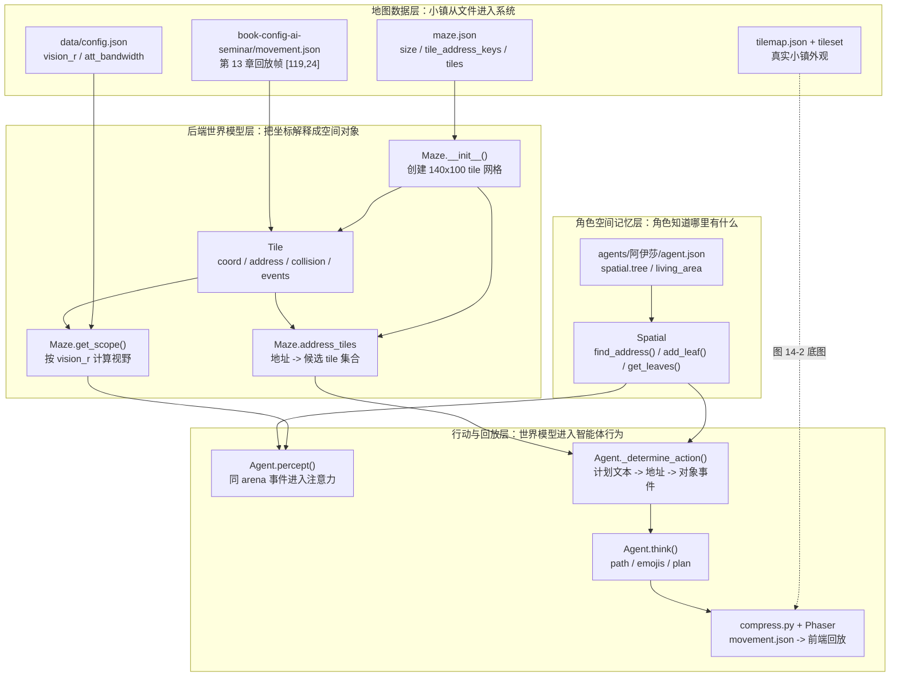
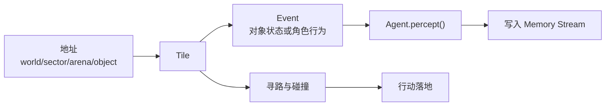

# 第 14 章 世界模型：地图、Tile、地址树与空间记忆

## 14.1 核心问题

第 13 章把阿伊莎和克劳斯放到奥克山学院图书馆桌子旁。第 14 章沿着这次回放往下拆：`movement.json` 里的 `[119, 24]` 如何被 `Maze`、`Tile`、`Spatial` 和 `Agent` 解释成地点、视野、记忆与行动。Generative Agents 不是普通聊天系统。它的智能体必须生活在一个共享空间里。如果没有世界模型，下面这些问题都无法回答：

- 阿伊莎和克劳斯为什么都在图书馆桌子旁？
- `[119, 24]` 对应哪一个 `Tile` 和哪一段地址？
- 两人为什么在同一 arena 内可以看见彼此？
- 阿伊莎计划睡觉时会去哪个房间？
- 图书馆桌子这个语义地址为什么会对应多个候选 tile？
- 某个对象是否正在被占用？
- 两个角色是否会在同一地点相遇？

Generative Agents 中，Smallville 是一个实验小镇，这个小镇由四层组成：

 - 地图数据：maze.json、tilemap
 - 后端模型：Maze、Tile
 - 角色空间记忆：Spatial
 - 前端回放：movement.json



*图 14-1：世界模型的代码逻辑。第 14 章不是抽象谈“小镇地图”，而是沿着第 13 章的回放帧，把 `[119,24]` 依次交给地图数据、`Maze/Tile/Event`、`Spatial`、`Agent` 和前端回放处理。四个大框对应本章后续的四组源码阅读对象。*

世界模型源码要回答七个问题：

1. `maze.json` 存了什么？
2. `Tile` 如何表示一个地图格子？
3. `Maze` 如何组织 tile、地址和寻路？
4. 地址树 `world/sector/arena/game_object` 有什么作用？
5. `Spatial` 和 `Maze` 的区别是什么？
6. 空间模型如何服务感知、计划、行动和回放？
7. 当前地图系统有哪些边界？

下面先把第 13 章的回放帧跑成可观察结果；再逐层解释这些结果背后的代码。

## 14.2 世界模型的优先位置

看源码时很容易先盯住 `Agent`，因为智能体看起来是系统核心。但在 Generative Agents 中，`Agent` 离不开世界。它的每一步都要依赖世界模型。初始化时，agent 要根据坐标找到自己所在 tile。计划行动时，agent 要把文字计划落到地址。感知时，agent 要从附近 tile 获取事件。移动时，agent 要通过 `Maze.find_path()` 找路。对话时，agent 要知道自己和对方是否在同一可交互空间。回放时，系统要把 agent 坐标和动作转成前端可展示数据。世界模型不是背景资源，而是 agent 行为的地基。如果世界模型错了，LLM 再强也会表现奇怪。例如：

- 计划去咖啡馆，却走到宿舍。
- 在墙里穿行。
- 在不同房间却能看到对方。
- 睡觉时找不到床。
- 洗澡时去厨房水槽。

这些问题都不是 prompt 能单独解决的。它们首先是空间 grounding 问题。

### 可运行脚手架：先把世界模型跑出来

源码片段只有在运行结果旁边才有意义。第 14 章配套了一个最小脚手架，专门把第 13 章的 `book-config-ai-seminar` 回放结果放回世界模型中观察。它不调用 LLM，也不依赖外部 API，只读取项目里的真实地图、真实感知配置、阿伊莎的真实角色配置，以及第 13 章生成的 `movement.json`。

从仓库根目录运行：

```bash
python docs/book/scaffolds/part_03/ch14_world_model_demo.py
```

这条命令执行的是下面这段脚手架主流程，我们来详细解读一下代码：

```python
from pathlib import Path
import argparse
import copy
import json
import sys

from modules.maze import Maze
from modules.memory.spatial import Spatial
from modules.utils.log import create_io_logger

# 这份脚手架位于 docs/book/scaffolds/part_03/。
# parents[4] 会从脚本文件一路回到仓库根目录。
ROOT = Path(__file__).resolve().parents[4]
GENERATIVE_AGENTS = ROOT / "generative_agents"

# 运行后生成的书稿配图。图 14-2 就来自这个路径。
ASSET_PATH = ROOT / "docs" / "book" / "assets" / "chapter_14" / "ch14_world_model_demo.png"

# 前端真实小镇地图资源。脚手架不是另画抽象网格，而是复用 Phaser 使用的 tilemap。
TILEMAP_DIR = GENERATIVE_AGENTS / "frontend" / "static" / "assets" / "village" / "tilemap"
TILEMAP_PATH = TILEMAP_DIR / "tilemap.json"

if hasattr(sys.stdout, "reconfigure"):
    # Windows 控制台默认编码容易把中文和 emoji 打坏，这里强制用 UTF-8。
    sys.stdout.reconfigure(encoding="utf-8")

# 让脚手架可以直接 import generative_agents/modules 下的源码。
sys.path.insert(0, str(GENERATIVE_AGENTS))


def load_json(path: Path) -> dict:
    with path.open("r", encoding="utf-8") as f:
        return json.load(f)


def find_first_active_frame(movement: dict) -> tuple[str, dict]:
    """跳过空帧，找到第一个真正包含角色动作的回放帧。"""
    all_movement = movement["all_movement"]
    frame_keys = sorted(
        (key for key in all_movement.keys() if key.isdigit()),
        key=lambda key: int(key),
    )
    for key in frame_keys:
        frame = all_movement[key]
        if frame and any("action" in agent for agent in frame.values()):
            return key, frame
    raise RuntimeError("No active replay frame found in movement.json")


def main() -> int:
    parser = argparse.ArgumentParser(description="Inspect the chapter 13 replay through the world model.")
    parser.add_argument("--output", type=Path, default=ASSET_PATH, help="PNG output path.")
    args = parser.parse_args()

    # 四个输入文件把第 13 章的回放和第 14 章的源码阅读连起来。
    maze_config_path = GENERATIVE_AGENTS / "frontend" / "static" / "assets" / "village" / "maze.json"
    movement_path = GENERATIVE_AGENTS / "results" / "compressed" / "book-config-ai-seminar" / "movement.json"
    data_config_path = GENERATIVE_AGENTS / "data" / "config.json"
    aisha_path = GENERATIVE_AGENTS / "frontend" / "static" / "assets" / "village" / "agents" / "阿伊莎" / "agent.json"

    maze_config = load_json(maze_config_path)      # 后端世界模型：Tile、地址、碰撞。
    movement = load_json(movement_path)           # 第 13 章压缩后的真实回放。
    data_config = load_json(data_config_path)     # 默认感知参数：vision_r、att_bandwidth。
    aisha_config = load_json(aisha_path)          # 阿伊莎的主观空间记忆 Spatial。

    # 1. 用 maze.json 构造后端 Maze。
    maze = Maze(copy.deepcopy(maze_config), create_io_logger("error"))

    # 2. 从 movement.json 中取第一帧有动作的回放。
    frame_key, frame = find_first_active_frame(movement)
    agents = {
        name: {
            "coord": tuple(data["movement"]),
            "location": data["location"],
            "action": data.get("action", ""),
        }
        for name, data in frame.items()
    }

    # 3. 把回放坐标交给 Maze，解释它对应哪个 Tile 和哪个地址。
    first_coord = next(iter(agents.values()))["coord"]
    tile = maze.tile_at(first_coord)
    address_tiles = maze.get_address_tiles(tile.address)

    # 4. 使用项目默认感知配置，计算 vision_r=8 的空间范围。
    percept_config = data_config["agent"]["percept"]
    scope = maze.get_scope(first_coord, percept_config)

    # 5. Agent.percept() 不会直接感知整个视野，只保留同一 arena 内的 tile。
    same_arena_tiles = [
        scope_tile
        for scope_tile in scope
        if scope_tile.has_address("arena")
        and tile.has_address("arena")
        and scope_tile.get_address("arena") == tile.get_address("arena")
    ]

    # 6. 用阿伊莎自己的 Spatial 记忆解释“睡觉”和“图书馆里有什么”。
    spatial_config = aisha_config["spatial"]
    spatial = Spatial(copy.deepcopy(spatial_config["tree"]), copy.deepcopy(spatial_config["address"]))
    sleep_address = spatial.find_address("准备睡觉", as_list=False)
    library_leaves = spatial.get_leaves(["the Ville", "奥克山学院", "图书馆"])

    # 7. 生成真实小镇地图截图，并叠加角色位置、候选地址、视野和同 arena 范围。
    draw_world_model_image(maze, agents, scope, same_arena_tiles, address_tiles, args.output)

    print("Chapter 14 world-model scaffold")
    print("=" * 38)
    print(f"source_replay: {movement_path.relative_to(ROOT)}")
    print(f"maze_json: {maze_config_path.relative_to(ROOT)}")
    print(f"data_config: {data_config_path.relative_to(ROOT)}")
    print(f"agent_json: {aisha_path.relative_to(ROOT)}")
    print(f"world: {maze_config['world']}")
    print(f"size: width={maze.maze_width}, height={maze.maze_height}, tile_size={maze.tile_size}")
    print(f"address_keys: {' -> '.join(maze_config['tile_address_keys'])}")

    print("\nReplay frame -> Maze tile")
    print(f"frame: {frame_key}")
    for name, data in agents.items():
        print(f"{name}:")
        print(f"  coord: {data['coord']}")
        print(f"  replay_location: {data['location']}")
        print(f"  replay_action: {data['action']}")
    print(f"tile_at_coord: coord[{first_coord[0]},{first_coord[1]}]")
    print(f"tile_address: {' -> '.join(tile.address)}")
    print(f"tile_collision: {tile.collision}")
    print(f"address_tile_count: {len(address_tiles)}")
    print(f"address_tiles: {sorted(address_tiles)}")

    print("\nPerception from this tile")
    print(
        "percept_config: "
        f"mode={percept_config['mode']}, "
        f"vision_r={percept_config['vision_r']}, "
        f"att_bandwidth={percept_config['att_bandwidth']}"
    )
    print(f"vision_scope_count: {len(scope)}")
    print(f"same_arena: {' -> '.join(tile.get_address('arena'))}")
    print(f"same_arena_tiles_in_scope: {len(same_arena_tiles)}")

    print("\nSpatial memory")
    print(f"阿伊莎.find_address('准备睡觉'): {sleep_address}")
    print(f"阿伊莎 known library leaves: {', '.join(library_leaves)}")
    print(f"\nimage: {args.output.relative_to(ROOT)}")
    return 0
```

这段代码保留了脚手架的主线：定位文件、读取回放、构造 `Maze`、解释坐标、计算视野、读取 `Spatial`、生成真实小镇地图。辅助函数 `draw_world_model_image()` 负责把 `tilemap.json` 和 tileset 渲染成图 14-2；它不改变世界模型逻辑，只负责把同一批证据画出来。

输出结构如下：

```text
Chapter 14 world-model scaffold
======================================
source_replay: generative_agents/results/compressed/book-config-ai-seminar/movement.json
maze_json: generative_agents/frontend/static/assets/village/maze.json
data_config: generative_agents/data/config.json
agent_json: generative_agents/frontend/static/assets/village/agents/阿伊莎/agent.json
world: the Ville
size: width=140, height=100, tile_size=32
address_keys: world -> sector -> arena -> game_object

Replay frame -> Maze tile
frame: 1
阿伊莎:
  coord: (119, 24)
  replay_location: 奥克山学院，图书馆，图书馆桌子
  replay_action: 💬 整理桌面资料，迎接克劳斯入座
克劳斯:
  coord: (119, 24)
  replay_location: 奥克山学院，图书馆，图书馆桌子
  replay_action: 💬 克劳斯与阿伊莎以奖学金分配中"参与度评分"为例，用细读方法拆解校园智能体的采集边界、价值偏向与权力预设，探讨是否应量化社区隐形互助活动。
tile_at_coord: coord[119,24]
tile_address: the Ville -> 奥克山学院 -> 图书馆 -> 图书馆桌子
tile_collision: False
address_tile_count: 4
address_tiles: [(119, 22), (119, 24), (122, 22), (122, 24)]

Perception from this tile
percept_config: mode=box, vision_r=8, att_bandwidth=8
vision_scope_count: 289
same_arena: the Ville -> 奥克山学院 -> 图书馆
same_arena_tiles_in_scope: 67

Spatial memory
阿伊莎.find_address('准备睡觉'): the Ville:奥克山学院宿舍:阿伊莎的房间:床
阿伊莎 known library leaves: 图书馆沙发, 图书馆桌子, 书架

image: docs/book/assets/chapter_14/ch14_world_model_demo.png
```


*图 14-2：第 14 章脚手架从第 13 章的 `book-config-ai-seminar` 回放结果下钻世界模型。底图来自前端真实的 `tilemap.json` 和 tileset 资源；紫色是阿伊莎和克劳斯所在 tile，橙色是“图书馆桌子”这个地址对应的 4 个候选 tile，黄色是默认 `vision_r=8` 的感知范围，蓝色是同一 arena 内的可感知候选 tile，深色轮廓是 collision tile。*

这段输出把后面的源码片段连成了一个完整链路。

| 输出结果 | 对应源码 | 说明 |
| --- | --- | --- |
| `size: width=140, height=100` | `Maze.__init__()` | `maze.json` 中的地图尺寸被加载成后端二维 tile 网格。 |
| `source_replay` 与 `frame: 1` | `movement.json` | 脚手架读取第 13 章压缩后的真实回放帧，而不是重新构造一个独立示例。 |
| `coord: (119, 24)` | `movement.json` 中的 `movement` | 回放坐标直接来自阿伊莎和克劳斯在第 13 章的仿真输出。 |
| `tile_address` | `Maze.tile_at()`、`Tile.address` | `[119, 24]` 被后端解释为 `the Ville -> 奥克山学院 -> 图书馆 -> 图书馆桌子`。 |
| `address_tile_count: 4` | `Maze.address_tiles` | 一个语义地址可以对应多个地图格子，“图书馆桌子”在地图上有 4 个候选 tile。 |
| `percept_config` 与 `vision_scope_count: 289` | `data/config.json`、`Maze.get_scope()` | 项目默认 `vision_r=8`，所以形成 17x17 的方形视野，共 289 个 tile。 |
| `same_arena_tiles_in_scope: 67` | `Agent.percept()` 的 arena 过滤 | 视野范围不是全部可感知事件，还要经过同一 arena 过滤。 |
| `阿伊莎.find_address('准备睡觉')` | `Spatial.find_address()` | 角色自己的空间记忆能把“睡觉”这类行为映射到自己的床。 |
| `阿伊莎 known library leaves` | `Spatial.tree` | 阿伊莎的主观空间记忆中已经知道图书馆沙发、图书馆桌子和书架。 |

这些输出值都有明确来源。`source_replay` 来自第 13 章生成的 `generative_agents/results/compressed/book-config-ai-seminar/movement.json`；`maze_json` 来自项目真实地图；`data_config` 来自项目默认感知配置；`agent_json` 来自阿伊莎的角色配置。脚手架把同一帧回放交给 `Maze`、`Tile` 和 `Spatial` 解释：坐标落在哪个 tile，tile 属于哪个地址，地址有多少候选格，默认视野覆盖多少 tile，同一 arena 中还剩多少可感知候选。

有了这个脚手架，后面读 `Tile`、`Maze`、`Spatial` 和 `Agent.percept()` 时，就不是在背类名，而是在解释一个已经跑出来的现象。

## 14.3 地图数据入口：maze.json

Generative Agents 的后端地图数据在：

```text
generative_agents/frontend/static/assets/village/maze.json
```

这个文件同时包含视觉地图相关配置和后端空间信息。开头可以看到：

```json
{
  "world": "the Ville",
  "tile_size": 32,
  "size": [100, 140],
  "map": { ... },
  "tile_address_keys": [
    "world",
    "sector",
    "arena",
    "game_object"
  ],
  "tiles": [...]
}
```

几个字段要重点理解。`world` 是世界名称。当前项目里仍然是：

```text
the Ville
```

虽然很多地点和角色已经中文化，但 world 名称保留了英文。这不影响后端逻辑，因为它只是地址层级中的根。`tile_size` 是前端 tile 像素大小。当前是 32。`size` 表示地图尺寸。可以直接从 `maze.json` 验证这些值：

```bash
python -c "import json; m=json.load(open('generative_agents/frontend/static/assets/village/maze.json', encoding='utf-8')); print(m['world'], m['tile_size'], m['size'], m['tile_address_keys'])"
```

输出会显示：

```text
the Ville 32 [100, 140] ['world', 'sector', 'arena', 'game_object']
```

源码中：

```python
self.maze_height, self.maze_width = config["size"]
```

因此当前地图高度是 100，宽度是 140。脚手架输出里的 `width=140, height=100` 不是另写了一份配置，而是 `Maze.__init__()` 把 `size: [100, 140]` 拆成 `maze_height=100` 和 `maze_width=140` 后打印出来。`tile_address_keys` 定义地址层级，这是后端空间语义的核心。`tiles` 是所有特殊 tile 的列表。每个 tile 可能包含坐标、地址、碰撞信息等。

## 14.4 Tile：地图格子的后端表示

`Tile` 定义在：

```text
generative_agents/modules/maze.py
```

它表示地图上的一个格子。先看真实源码，不要只看类名：

```python
class Tile:
    def __init__(
        self,
        coord,
        world,
        address_keys,
        address=None,
        collision=False,
    ):
        # in order: world, sector, arena, game_object
        self.coord = coord
        self.address = [world]
        if address:
            self.address += address
        self.address_keys = address_keys
        self.address_map = dict(zip(address_keys[: len(self.address)], self.address))
        self.collision = collision
        self.event_cnt = 0
        self._events = {}
        if len(self.address) == 4:
            self.add_event(Event(self.address[-1], address=self.address))
```

这段代码把一个地图格子压成四类信息。`coord` 是几何位置；`address` 是语义地址；`address_map` 让代码能按 `world`、`sector`、`arena`、`game_object` 取地址；`collision` 决定这个格子能不能走；`_events` 存放这个格子当前能被感知到的状态。最后两行很关键：只要 tile 绑定到了四层地址，它一出生就会有一个对象事件。图书馆桌子不是单纯背景，它会成为可感知对象。

核心字段可以这样读：

| 字段 | 中文意思 | 对系统行为的影响 |
| --- | --- | --- |
| `coord` | 地图坐标。 | 决定这个格子在二维小镇中的位置。 |
| `address` | 地址路径。 | 表示这个格子属于哪个世界、区域、房间或对象。 |
| `address_keys` | 地址层级名称。 | 说明 `address` 中每一层分别代表 `world`、`sector`、`arena` 还是 `game_object`。 |
| `address_map` | 地址层级映射。 | 方便代码直接按层级名取地址值，例如取当前 `arena`。 |
| `collision` | 是否阻挡移动。 | 控制角色能不能走过这个格子，避免穿墙或走进不可达区域。 |
| `_events` | 当前格子上的事件。 | 让感知系统知道这里发生了什么、谁在这里、对象是否被占用。 |

例如，第 13 章回放中的 `[119, 24]` 这个 tile 地址是：

```text
["the Ville", "奥克山学院", "图书馆", "图书馆桌子"]
```

它的层级含义可以这样理解：

```text
world: the Ville
sector: 奥克山学院
arena: 图书馆
game_object: 图书馆桌子
```

如果一个 tile 没有详细地址，它只有 world。如果它有四层地址，说明它绑定到具体 game object。第 14 章脚手架把第 13 章的 `[119, 24]` 交给 `Maze.tile_at()` 后，得到的效果是：

```text
tile_at_coord: coord[119,24]
tile_address: the Ville -> 奥克山学院 -> 图书馆 -> 图书馆桌子
tile_collision: False
```

这三行就是 `Tile.__init__()` 的运行结果：同一个坐标同时有几何位置、语义地址和碰撞状态。

## 14.5 Tile 上的事件

Tile 不只是地图格子。它还保存事件。事件相关源码集中在这几段：

```python
def get_events(self):
    return self.events.values()

def add_event(self, event):
    if isinstance(event, (tuple, list)):
        event = Event.from_list(event)
    if all(e != event for e in self._events.values()):
        self._events["e_" + str(self.event_cnt)] = event
        self.event_cnt += 1
    return event

def remove_events(self, subject=None, event=None):
    r_events = {}
    for tag, eve in self._events.items():
        if subject and eve.subject == subject:
            r_events[tag] = eve
        if event and eve == event:
            r_events[tag] = eve
    for r_eve in r_events:
        self._events.pop(r_eve)
    return r_events

def update_events(self, event, match="subject"):
    u_events = {}
    for tag, eve in self._events.items():
        if match == "subject" and eve.subject == event.subject:
            self._events[tag] = event
            u_events[tag] = event
    return u_events
```

这让 tile 成为世界状态的一部分。`add_event()` 往格子里放事件；`remove_events()` 在角色离开时清理旧事件；`update_events()` 按 subject 更新同一对象的状态；`get_events()` 供感知系统读取。角色在某个 tile 上读书，tile 保存的是“角色正在读书”这个 event。对象被占用，tile 保存的是“桌子被谁使用”这个 event。

如果 tile 上有 game object，初始化时也会给它添加一个默认事件：

```python
if len(self.address) == 4:
    self.add_event(Event(self.address[-1], address=self.address))
```

带对象的 tile 一开始就有一个对象事件。其他 agent 感知附近时，不是直接读取抽象坐标，而是读取 tile 上的 events。世界通过事件变得可观察。



*图 14-3：Tile、地址与事件关系。Tile 把空间地址、可感知事件和行动落地连接在一起。*

## 14.6 Event 让空间变成可感知状态

地图本身只是几何结构。Event 让地图变成可感知世界。先看 `Event` 的真实结构：

```python
class Event:
    def __init__(
        self,
        subject,
        predicate=None,
        object=None,
        address=None,
        describe=None,
        emoji=None,
    ):
        self.subject = subject
        self.predicate = predicate or "此时"
        self.object = object or "空闲"
        self._describe = describe or ""
        self.address = address or []
        self.emoji = emoji or ""

    def __str__(self):
        if self._describe:
            des = "{}".format(self._describe)
        else:
            des = "{} {} {}".format(self.subject, self.predicate, self.object)
        if self.address:
            des += " @ " + ":".join(self.address)
        return des
```

`subject` 是事件主体，`predicate` 和 `object` 描述状态，`address` 把事件绑定到世界位置，`describe` 保存自然语言描述，`emoji` 供回放显示状态。一个 tile 可能包含：

```text
图书馆桌子
阿伊莎此时整理桌面资料
克劳斯此时与阿伊莎讨论参与度评分
```

这些 event 会被 `Agent.percept()` 收集。如果某个 agent 看到了它们，它会把新事件写入 memory stream。这条链路是：

```text
Tile.events
  -> Maze.get_scope()
  -> Agent.percept()
  -> Concept
  -> Associate.add_node()
```

所以，世界模型不是只服务移动，也服务记忆。没有 tile event，智能体无法观察世界发生了什么。

## 14.7 Maze：地图总控对象

`Maze` 也是在：

```text
generative_agents/modules/maze.py
```

它负责组织全部 tile。初始化代码一次完成三件事：

```python
class Maze:
    def __init__(self, config, logger):
        # define tiles
        self.maze_height, self.maze_width = config["size"]
        self.tile_size = config["tile_size"]
        address_keys = config["tile_address_keys"]
        self.tiles = [
            [
                Tile((x, y), config["world"], address_keys)
                for x in range(self.maze_width)
            ]
            for y in range(self.maze_height)
        ]
        for tile in config["tiles"]:
            x, y = tile.pop("coord")
            self.tiles[y][x] = Tile((x, y), config["world"], address_keys, **tile)

        # define address
        self.address_tiles = dict()
        for i in range(self.maze_height):
            for j in range(self.maze_width):
                for add in self.tile_at([j, i]).get_addresses():
                    self.address_tiles.setdefault(add, set()).add((j, i))

        self.logger = logger
```

第一段创建 140x100 的默认 tile 网格。第二段用 `maze.json` 中的 4201 个特殊 tile 覆盖默认格子，把地址、碰撞和对象写进去。第三段建立 `address_tiles` 反向索引。它让系统能够从地址反查坐标。例如：

```text
"the Ville:奥克山学院:图书馆"
  -> 一组 tile 坐标
```

角色计划去图书馆讨论时，最终必须通过这个索引找到可走坐标。

第 14 章脚手架把“图书馆桌子”这个地址查出来后，结果是：

```text
address_tile_count: 4
address_tiles: [(119, 22), (119, 24), (122, 22), (122, 24)]
```

这就是 `address_tiles` 的作用。LLM 可以说“去图书馆桌子”，但后端必须把这句话落到真实坐标集合里。

## 14.8 地址层级：world、sector、arena、game_object

`tile_address_keys` 定义了地址层级：

```json
[
  "world",
  "sector",
  "arena",
  "game_object"
]
```

这四层分别解决不同粒度的问题。`world` 是根。当前是：

```text
the Ville
```

`sector` 是较大地点。例如：

```text
奥克山学院
奥克山学院宿舍
霍布斯咖啡馆
玫瑰酒吧
约翰逊公园
柳树市场和药店
```

`arena` 是 sector 中的具体区域。例如：

```text
图书馆
教室
咖啡馆
克劳斯的房间
公共休息室
```

`game_object` 是可交互对象。例如：

```text
书桌
床
咖啡馆顾客座位
厨房水槽
钢琴
黑板
```

这个层级让系统能在不同粒度上推理。日程可能只说“去奥克山学院学习”。空间选择可能进一步落到“图书馆”。具体 action 可能落到“图书馆桌子”或“书架”。

## 14.9 多层级地址的作用

如果地址只有一个字符串，会很难推理。例如：

```text
奥克山学院图书馆图书馆桌子
```

这个字符串可以用，但系统无法轻易知道它属于哪个地点、哪个区域、哪个对象。分层地址能支持三类操作。第一，地点选择。模型可以先选 sector，再选 arena，再选 object。这比一次性让模型选完整地址更稳定。第二，感知过滤。`Agent.percept()` 会限制同一 arena 内的事件：

```python
events, arena = {}, self.get_tile().get_address("arena")
for tile in scope:
    if not tile.events or tile.get_address("arena") != arena:
        continue
```

同一视野范围内，不同 arena 的事件不会被直接感知。这避免隔墙感知。第三，前端与后端对齐。前端显示的是地图，后端推理的是地址。层级地址让两者能保持语义联系。

## 14.10 碰撞与寻路

地图中并不是所有 tile 都能走。`Tile` 有：

```python
self.collision = collision
```

`Maze.get_around()` 默认会排除 collision tile：

```python
def get_around(self, coord, no_collision=True):
    coords = [
        (coord[0] - 1, coord[1]),
        (coord[0] + 1, coord[1]),
        (coord[0], coord[1] - 1),
        (coord[0], coord[1] + 1),
    ]
    if no_collision:
        coords = [c for c in coords if not self.tile_at(c).collision]
    return coords
```

`Maze.find_path()` 使用类似广度优先搜索的方式，从起点扩展到终点：

```python
def find_path(self, src_coord, dst_coord):
    map = [[0 for _ in range(self.maze_width)] for _ in range(self.maze_height)]
    frontier, visited = [src_coord], set()
    map[src_coord[1]][src_coord[0]] = 1
    while map[dst_coord[1]][dst_coord[0]] == 0:
        new_frontier = []
        for f in frontier:
            for c in self.get_around(f):
                if (
                    0 < c[0] < self.maze_width - 1
                    and 0 < c[1] < self.maze_height - 1
                    and map[c[1]][c[0]] == 0
                    and c not in visited
                ):
                    map[c[1]][c[0]] = map[f[1]][f[0]] + 1
                    new_frontier.append(c)
                    visited.add(c)
        if not new_frontier:
            return []
        frontier = new_frontier
    step = map[dst_coord[1]][dst_coord[0]]
    path = [dst_coord]
    while step > 1:
        for c in self.get_around(path[-1]):
            if map[c[1]][c[0]] == step - 1:
                path.append(c)
                break
        step -= 1
    return path[::-1]
```

这段代码只考虑上下左右四个方向，并且通过 `get_around()` 避开 collision tile。如果找不到路径，返回空列表。这说明移动不是 LLM 直接决定每一步坐标。LLM 决定的是目标行为和目标地址，寻路由后端确定。大模型适合决定“去哪儿做什么”，不适合每步规划像素级路径。

## 14.11 从地址到目标 tile

当 agent 需要移动到某个地址时，系统会调用 `Maze.get_address_tiles()`：

```python
def get_address_tiles(self, address):
    addr = ":".join(address)
    if addr in self.address_tiles:
        return self.address_tiles[addr]
    return random.choice(self.address_tiles.values())
```

它把地址 list 拼成字符串，再查 `address_tiles`。如果找到，返回这一地址对应的 tile 集合。如果找不到，当前实现会随机返回一个地址集合。这个 fallback 很危险，也很现实。它能避免系统直接崩溃，但可能导致角色去到奇怪地点。后续如果要提升项目可靠性，可以把这里改成更可解释的失败策略：

- 记录错误日志。
- 回退到当前 tile。
- 回退到角色已知随机地址。
- 让模型重新选择地址。
- 在实验中标记为 spatial grounding failure。

当前实现的好处是仿真能继续跑。坏处是错误可能被隐藏。

## 14.12 Spatial：角色自己的空间记忆

`Maze` 是全局地图。`Spatial` 是角色自己的空间记忆。它定义在：

```text
generative_agents/modules/memory/spatial.py
```

初始化代码很短，但信息密度很高：

```python
class Spatial:
    def __init__(self, tree, address=None):
        self.tree = tree
        self.address = address or {}
        if "sleeping" not in self.address and "睡觉" not in self.address and "living_area" in self.address:
            self.address["睡觉"] = self.address["living_area"] + ["床"]
```

`tree` 是角色知道的地点树。`address` 是一些常用行为到地址的快捷映射。第 13 章实验使用阿伊莎，她的 `agent.json` 中有这样的空间记忆：

```json
"spatial": {
  "address": {
    "living_area": ["the Ville", "奥克山学院宿舍", "阿伊莎的房间"]
  },
  "tree": {
    "the Ville": {
      "奥克山学院": {
        "图书馆": ["图书馆沙发", "图书馆桌子", "书架"],
        "教室": ["黑板", "教室讲台", "教室学生座位"]
      },
      "奥克山学院宿舍": {
        "阿伊莎的房间": ["架子", "壁橱", "书桌", "床"]
      }
    }
  }
}
```

`Spatial.__init__()` 会根据 `living_area` 自动补出“睡觉”地址，所以脚手架输出：

```text
阿伊莎.find_address('准备睡觉'): the Ville:奥克山学院宿舍:阿伊莎的房间:床
阿伊莎 known library leaves: 图书馆沙发, 图书馆桌子, 书架
```

这两行说明角色不只知道自己当前在哪，也知道“睡觉”这类常用行为应该落到哪里。

## 14.13 Spatial 与 Maze 的区别

`Maze` 和 `Spatial` 很容易混淆。它们都和地点有关，但职责不同。`Maze` 是客观世界。它知道地图上所有 tile、地址、碰撞和事件。`Spatial` 是主观记忆。它表示某个 agent 知道哪些地点，以及某些行为要去哪里。这对应现实世界中的差别：

```text
城市客观存在很多地方。
但某个人不一定知道所有地方。
```

代码中也体现了这一点。`Agent.percept()` 会把看到的对象地址加入 spatial memory：

```python
if tile.has_address("game_object"):
    self.spatial.add_leaf(tile.address)
```

角色会通过探索逐步知道更多地点。这让空间记忆可以成长。

## 14.14 Spatial.find_address()

当 agent 计划执行某个活动时，系统会先尝试用 `Spatial.find_address()` 找地址。代码很简单：

```python
def find_address(self, hint, as_list=True):
    address = []
    for key, path in self.address.items():
        if key in hint:
            address = path
            break
    if as_list:
        return address
    return ":".join(address)
```

它不是复杂语义匹配，而是关键词匹配。例如，如果 hint 包含“睡觉”，就会返回睡觉地址。这说明当前项目的空间 grounding 分两级。第一，简单行为用规则映射。第二，找不到时再让 LLM 从空间树中选择 sector、arena、object。这种设计很务实。高频行为如睡觉不需要每次调用 LLM。复杂行为再交给模型选择。

## 14.15 Spatial.add_leaf()

`Spatial.add_leaf()` 用来更新角色空间记忆。真实源码如下：

```python
def add_leaf(self, address):
    def _add_leaf(left_address, tree):
        if len(left_address) == 2:
            leaves = tree.setdefault(left_address[0], [])
            if left_address[1] not in leaves:
                leaves.append(left_address[1])
        elif len(left_address) > 2:
            _add_leaf(left_address[1:], tree.setdefault(left_address[0], {}))

    _add_leaf(address, self.tree)
```

当角色感知到一个带 game_object 的 tile，会把这个地址加入自己的 tree。这意味着角色“知道了”这个地方。例如，角色进入奥克山学院图书馆后，可能看到：

```text
the Ville -> 奥克山学院 -> 图书馆 -> 书架
```

于是它的空间记忆中加入这个叶子。这样，后续计划“查资料”或“去图书馆讨论”时，角色更可能选择正确地点。这与论文中的 memory stream 不同。Spatial memory 不是事件记忆，而是地点知识。它不回答“发生了什么”，而回答“哪里有什么”。

## 14.16 世界模型如何服务感知

感知链路从 `Maze.get_scope()` 开始。`get_scope()` 根据当前位置和感知配置返回附近 tile。当前实现支持 `box` 模式：

```python
def get_scope(self, coord, config):
    coords = []
    vision_r = config["vision_r"]
    if config["mode"] == "box":
        x_range = [
            max(coord[0] - vision_r, 0),
            min(coord[0] + vision_r + 1, self.maze_width),
        ]
        y_range = [
            max(coord[1] - vision_r, 0),
            min(coord[1] + vision_r + 1, self.maze_height),
        ]
        coords = list(product(list(range(*x_range)), list(range(*y_range))))
    return [self.tile_at(c) for c in coords]
```

`vision_r` 来自感知配置。项目默认值在：

```text
generative_agents/data/config.json
```

对应片段是：

```json
"percept": {
  "mode": "box",
  "vision_r": 8,
  "att_bandwidth": 8
}
```

第 14 章脚手架直接读取这个默认配置，所以输出 `percept_config: mode=box, vision_r=8, att_bandwidth=8` 和 `vision_scope_count: 289`。289 来自 17x17 的方形视野。阿伊莎和克劳斯所在的 `[119, 24]` 附近虽然有 289 个 tile 会先进入空间范围，但实际能进入注意力的事件还要继续受 arena 过滤和 `att_bandwidth` 限制。

然后 `Agent.percept()` 在这些 tile 中筛选同一 arena 的 events。真实源码可以分三段读：

```python
def percept(self):
    scope = self.maze.get_scope(self.coord, self.percept_config)
    # add spatial memory
    for tile in scope:
        if tile.has_address("game_object"):
            self.spatial.add_leaf(tile.address)
    events, arena = {}, self.get_tile().get_address("arena")
    # gather events in scope
    for tile in scope:
        if not tile.events or tile.get_address("arena") != arena:
            continue
        dist = math.dist(tile.coord, self.coord)
        for event in tile.get_events():
            if dist < events.get(event, float("inf")):
                events[event] = dist
    events = list(sorted(events.keys(), key=lambda k: events[k]))
```

第一段取视野范围；第二段把看到的 game object 写入 `Spatial`；第三段只保留同一 arena 内的事件，并按距离排序。接下来才进入注意力带宽：

```python
for idx, event in enumerate(events[: self.percept_config["att_bandwidth"]]):
    recent_nodes = (
        self.associate.retrieve_events() + self.associate.retrieve_chats()
    )
    recent_nodes = set(n.describe for n in recent_nodes)
    if event.get_describe() not in recent_nodes:
        if event.object == "idle" or event.object == "空闲":
            node = Concept.from_event(
                "idle_" + str(idx), "event", event, poignancy=1
            )
        else:
            valid_num += 1
            node_type = "chat" if event.fit(self.name, "对话") else "event"
            node = self._add_concept(node_type, event)
            self.status["poignancy"] += node.poignancy
        self.concepts.append(node)
self.concepts = [c for c in self.concepts if c.event.subject != self.name]
```

这说明感知由三个条件共同决定：

```text
空间距离
  + arena 限制
  + attention bandwidth
```

这让角色不会拥有全知视角。信息扩散、关系形成和偶遇都依赖这种有限感知。

## 14.17 世界模型如何服务计划

计划是文字。世界模型把文字计划变成地点行动。在 `Agent._determine_action()` 中，系统先取当前计划，再尝试用 `Spatial.find_address()` 做规则映射：

```python
plan, de_plan = self.schedule.current_plan()
describes = [plan["describe"], de_plan["describe"]]
address = self.spatial.find_address(describes[0], as_list=True)
```

如果 `Spatial` 找不到地址，系统会构造可选空间树，让模型选择：

```python
if not address:
    tile = self.get_tile()
    kwargs = {
        "describes": describes,
        "spatial": self.spatial,
        "address": tile.get_address("world", as_list=True),
    }
    kwargs["address"].append(
        self.completion("determine_sector", **kwargs, tile=tile)
    )
    arenas = self.spatial.get_leaves(kwargs["address"])
    if len(arenas) == 1:
        kwargs["address"].append(arenas[0])
    else:
        kwargs["address"].append(self.completion("determine_arena", **kwargs))
    objs = self.spatial.get_leaves(kwargs["address"])
    if len(objs) == 1:
        kwargs["address"].append(objs[0])
    elif len(objs) > 1:
        kwargs["address"].append(self.completion("determine_object", **kwargs))
    address = kwargs["address"]
```

最后生成角色事件和对象事件：

```python
event = self.make_event(self.name, describes[-1], address)
obj_describe = self.completion("describe_object", address[-1], describes[-1])
obj_event = self.make_event(address[-1], obj_describe, address)
```

然后 `Maze.get_address_tiles()` 把地址转成候选 tile。`Maze.find_path()` 决定移动路径。这条链路是：

```text
plan text
  -> spatial hint
  -> address
  -> tiles
  -> path
  -> action
```

没有世界模型，Planning 无法变成行动。

## 14.18 世界模型如何服务社交

社交也依赖空间。角色要先看见别人，才可能对话。`Agent.percept()` 会收集附近事件，其中 subject 是其他 agent 的事件优先级更高。`_reaction()` 会优先选择与其他 agent 相关的 concept：

```python
def _reaction(self, agents=None, ignore_words=None):
    focus = None
    ignore_words = ignore_words or ["空闲"]

    def _focus(concept):
        return concept.event.subject in agents

    def _ignore(concept):
        return any(i in concept.describe for i in ignore_words)

    if agents:
        priority = [i for i in self.concepts if _focus(i)]
        if priority:
            focus = random.choice(priority)
    if not focus:
        priority = [i for i in self.concepts if not _ignore(i)]
        if priority:
            focus = random.choice(priority)
    if not focus or focus.event.subject not in agents:
        return
    other, focus = agents[focus.event.subject], self.associate.get_relation(focus)

    if self._chat_with(other, focus):
        return True
    if self._wait_other(other, focus):
        return True
    return False
```

如果选中另一个 agent，就可能进入 `_chat_with()`。这意味着对话不是全局随机发生，而是由空间相遇触发。第 13 章中，阿伊莎和克劳斯能进入对话，第一层条件就是两人同在“奥克山学院 -> 图书馆 -> 图书馆桌子”这个地址附近；后面的 `_reaction()` 再决定是否真正聊天。如果世界模型不限制相遇，对话传播就会变成广播。

## 14.19 世界模型如何服务对象占用

`Action` 不只包含角色事件，还可以包含对象事件 `obj_event`。在 `_determine_action()` 中：

```python
obj_describe = self.completion("describe_object", address[-1], describes[-1])
obj_event = self.make_event(address[-1], obj_describe, address)
```

之后 `move()` 会更新 tile 上的对象事件：

```python
def move(self, coord, path=None):
    events = {}

    def _update_tile(coord):
        tile = self.maze.tile_at(coord)
        if not self.action:
            return {}
        if not tile.update_events(self.get_event()):
            tile.add_event(self.get_event())
        obj_event = self.get_event(False)
        if obj_event:
            self.maze.update_obj(coord, obj_event)
        return {e: coord for e in tile.get_events()}
```

`Maze.update_obj()` 会找到同一 game_object 地址对应的所有 tile，并更新对象事件：

```python
def update_obj(self, coord, obj_event):
    tile = self.tile_at(coord)
    if not tile.has_address("game_object"):
        return
    if obj_event.address != tile.get_address("game_object"):
        return
    addr = ":".join(obj_event.address)
    if addr not in self.address_tiles:
        return
    for c in self.address_tiles[addr]:
        self.tile_at(c).update_events(obj_event)
```

这让对象状态成为可感知内容。例如，床、书桌、厨房水槽、咖啡馆座位都可以显示正在被如何使用。这对等待机制也很重要。如果两个角色对同一对象产生冲突，`_wait_other()` 才有依据判断是否等待。

## 14.20 世界模型如何服务回放

回放依赖坐标和动作。`Agent.think()` 每一步都会把角色当前状态打包成 `plan`：

```python
def think(self, status, agents):
    events = self.move(status["coord"], status.get("path"))
    plan, _ = self.make_schedule()

    if self.is_awake():
        self.percept()
        self.make_plan(agents)
        self.reflect()

    emojis = {}
    if self.action:
        emojis[self.name] = {"emoji": self.get_event().emoji, "coord": self.coord}
    for eve, coord in events.items():
        if eve.subject in agents:
            continue
        emojis[":".join(eve.address)] = {"emoji": eve.emoji, "coord": coord}
    self.plan = {
        "name": self.name,
        "path": self.find_path(agents),
        "emojis": emojis,
    }
    return self.plan
```

`path` 是角色接下来要走的坐标序列。`emojis` 描述角色或对象当前状态。这些信息进入 checkpoint，再被 `compress.py` 处理为 `movement.json`。第 13 章压缩后的回放帧就是这种结构：

```json
{
  "阿伊莎": {
    "location": "奥克山学院，图书馆，图书馆桌子",
    "movement": [119, 24],
    "action": "💬 整理桌面资料，迎接克劳斯入座"
  },
  "克劳斯": {
    "location": "奥克山学院，图书馆，图书馆桌子",
    "movement": [119, 24],
    "action": "💬 克劳斯与阿伊莎以奖学金分配中\"参与度评分\"为例..."
  }
}
```

前端 Phaser 根据 `movement.json` 播放角色移动和状态变化。所以，前端动画不是独立制作的，而是后端世界模型和 agent action 的结果。这就是“可解释回放”的基础。

## 14.21 世界模型的边界：地图生成困难

README 中提到一个现实问题：

wounderland 原作者没有提供 `maze.json` 的生成代码。因此，如果要创建新地图，需要：

1. 参考原始项目 `maze.py` 逻辑，兼容 Tiled 导出的 JSON 和 CSV。
2. 参考现有 `maze.json` 格式，自行合并地图元数据和 collision/sector/arena/object 数据。
3. 使用外部工具，例如 `jiejieje/tiled_to_maze.json`。

这说明当前项目的地图系统可运行，但地图生产链路还不够完善。修改角色和事件比修改地图容易。如果要新增地点，需要特别小心：

- 前端 tilemap 是否有视觉资源。
- 后端 `maze.json` 是否有地址。
- `Spatial.tree` 是否让角色知道新地点。
- prompt 是否能理解新地点用途。
- 对象是否有合理名称。

## 14.22 世界模型的边界：地址 fallback

前面讲过，`Maze.get_address_tiles()` 找不到地址时会随机返回一个地址集合。这会隐藏空间错误。例如，模型输出了一个不存在的地址：

```text
the Ville:不存在的地点:大厅
```

系统不会立刻报错，而可能随机给一个可用地址。仿真会继续，但角色行为可能变奇怪。写实验时要注意这种情况。如果发现角色突然去不合理地点，要检查：

- LLM 选择的地址是否存在。
- `Spatial.tree` 是否包含该地点。
- `maze.address_tiles` 是否有对应地址。
- `get_address_tiles()` 是否触发 fallback。

后续如果改进项目，可以把 fallback 改为显式记录 warning。

## 14.23 世界模型的边界：arena 感知简化

当前感知限制使用同一 arena。这比完全基于距离更合理，但仍然是简化。现实中，视线、墙、门、声音、开放空间、遮挡都会影响感知。当前项目没有复杂视线模拟。例如：

- 同一 arena 中可能隔着家具。
- 不同 arena 中可能相邻但开门可见。
- 声音传播与视觉不同。

这些都没有细分。但对教学和实验来说，当前设计已经足够表达核心思想：

```text
agent 只能看到附近、同一语义区域内的事件。
```

这比全局感知更接近社会仿真。

## 14.24 世界模型的边界：对象语义依赖 prompt

地图知道对象名称，但不真正知道对象用途。例如：

```text
钢琴
厨房水槽
咖啡馆顾客座位
图书馆桌子
```

这些对象用途主要靠 LLM 根据名称理解。系统没有一个显式 ontology 说明：

```text
钢琴可以演奏。
床可以睡觉。
厨房水槽可以洗东西。
咖啡馆顾客座位可以坐下喝咖啡。
```

这带来灵活性，也带来风险。灵活性是：新增对象时，只要名字清楚，模型可能理解。风险是：模型可能误解对象用途，或者做出不符合场所规范的行为。如果要做更严谨的 agent world，可以考虑为对象增加 affordance：

```json
{
  "object": "床",
  "affordances": ["睡觉", "休息"],
  "capacity": 1
}
```

这属于第五部分前沿升级可以讨论的方向。

## 14.25 如何读世界模型源码

世界模型源码适合按下面顺序读。第一，先看 `maze.json`，理解 world、tile_size、size、tile_address_keys 和 tiles。第二，看 `Tile`，理解 coord、address、collision、events。第三，看 `Maze.__init__()`，理解 tile 网格和 address_tiles 如何建立。第四，看 `Maze.get_scope()`，理解感知范围。第五，看 `Maze.find_path()`，理解移动路径。第六，看 `Spatial`，理解角色主观空间记忆。第七，回到 `Agent.percept()` 和 `_determine_action()`，看世界模型如何进入感知和计划。按这个顺序读，世界模型就不是“地图文件”，而是整个 agent 行为链路的一部分。

## 14.26 本章小结

世界模型是源码深读的第一站。地图不是前端背景，而是感知、计划、社交、对象占用和回放共同依赖的底层结构。

| 本章内容 | 核心结论 |
| --- | --- |
| `maze.json` | 它是后端世界数据入口，不只是地图资源文件。 |
| `Tile` | Tile 保存坐标、地址、碰撞和事件，是世界状态的基本单位。 |
| `Maze` | Maze 组织所有 tile，建立地址索引，并提供视野和寻路能力。 |
| 地址层级 | `world -> sector -> arena -> game_object` 让行动可以落到具体地点和对象。 |
| Tile events | 事件让世界状态可被 agent 感知，而不是只存在于画面上。 |
| `Spatial` | Spatial 是角色自己的空间记忆，不等于全局地图。 |
| 感知和计划 | `Agent.percept()` 用 Maze 读取附近事件，`_determine_action()` 把计划落到地址和路径。 |
| 系统作用 | 世界模型同时服务感知、计划、社交、对象占用和回放。 |
| 当前边界 | 地图生成、地址 fallback、arena 感知简化和对象语义依赖 prompt，都是后续扩展风险。 |

下一章讲智能体初始化：从 `agent.json` 进入 `Agent.__init__()`，看角色设定如何进入 `Scratch`、`Spatial`、`Schedule`、`Associate` 和当前 action。

## 参考资料

- Local source: `generative_agents/modules/maze.py`
- Local source: `generative_agents/modules/memory/spatial.py`
- Local data: `generative_agents/frontend/static/assets/village/maze.json`
- Local data: `generative_agents/frontend/static/assets/village/agents/*/agent.json`
- Local README map notes: `README.md`
