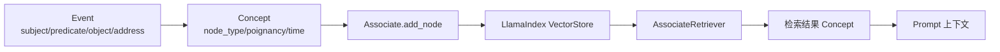

# 第 15 章 记忆：事件、对话、想法如何存储和检索

## 15.1 本章要解决的问题

第 14 章讲感知。

感知到的事件如果不存下来，只能影响当前 step。

Generative Agents 的关键是让经历进入长期行为链路。

在 GenerativeAgentsCN 中，这个长期记忆系统主要由四个对象组成：

```text
Event
  -> Concept
  -> Associate
  -> LlamaIndex
```

还有一个负责检索重排的对象：

```text
AssociateRetriever
```

本章要回答九个问题：

1. Event 与 Concept 有什么区别？
2. 记忆为什么分成 event、chat、thought 三类？
3. `Associate.add_node()` 如何写入记忆？
4. 记忆 metadata 中保存了哪些信息？
5. LlamaIndex 在项目中承担什么职责？
6. `retrieve_events()`、`retrieve_chats()`、`retrieve_thoughts()` 怎么工作？
7. `retrieve_focus()` 如何实现论文三因素检索？
8. 记忆如何过期、清理和持久化？
9. 当前记忆系统有哪些边界和升级方向？

[图 15-1：Event -> Concept -> Associate -> LlamaIndex 的记忆链路]



## 15.2 记忆模块的源码位置

本章主要涉及三个文件：

```text
generative_agents/modules/memory/event.py
generative_agents/modules/memory/associate.py
generative_agents/modules/storage/index.py
```

`event.py` 定义 Event。

`associate.py` 定义 Concept、AssociateRetriever 和 Associate。

`index.py` 封装 LlamaIndex 和 embedding provider。

它们的职责不同：

```text
Event：描述发生了什么。
Concept：把 Event 包装成记忆节点。
Associate：管理一个 agent 的记忆列表和检索。
LlamaIndex：底层向量索引与持久化。
AssociateRetriever：按 recency、importance、relevance 重新排序。
```

读记忆模块时，要先分清这几个层次。

否则很容易把“事件结构”“记忆节点”和“向量索引”混在一起。

## 15.3 Event：世界事实的最小表达

`Event` 在第 14 章已经出现过。

它保存：

```python
subject
predicate
object
address
describe
emoji
```

默认 predicate 是：

```text
此时
```

默认 object 是：

```text
空闲
```

Event 是世界事实的最小表达。

例如：

```text
克劳斯 此时 阅读研究资料
伊莎贝拉 对话 阿伊莎
咖啡馆顾客座位 此时 被占用
```

Event 本身还不是长期记忆。

它只是描述“发生了什么”。

要进入记忆系统，它还需要被包装成 Concept，并写入 Associate。

## 15.4 Concept：记忆节点包装

`Concept` 定义在 `associate.py`。

它包含：

```python
describe
node_id
node_type
subject
predicate
object
address
poignancy
create
expire
access
```

Concept 是 memory stream 中的一条记录。

它比 Event 多了几类信息。

第一，节点身份。

`node_id` 用于索引定位。

第二，节点类型。

`node_type` 可以是：

```text
event
chat
thought
```

第三，重要性。

`poignancy` 对应论文 importance。

第四，时间。

`create` 是创建时间。

`expire` 是过期时间。

`access` 是最近访问时间。

这些字段让记忆不只是文本，而是带元数据的可检索节点。

## 15.5 Concept 与 Event 的关系

Concept 内部仍然包含 Event。

初始化时：

```python
self.event = Event(
    subject, predicate, object, describe=describe, address=address.split(":")
)
```

也就是说，Concept 是 Event 的带元数据版本。

可以这样理解：

```text
Event：发生了什么。
Concept：这个事件作为记忆节点，何时发生、重要性多少、何时过期、最近何时被访问。
```

这也是为什么 `Concept.describe` 会返回：

```python
self.event.get_describe()
```

后续 prompt 和检索主要使用自然语言 describe。

metadata 则用于过滤、排序和持久化。

## 15.6 三类记忆：event、chat、thought

`Associate` 初始化时：

```python
self.memory = memory or {"event": [], "thought": [], "chat": []}
```

这三类记忆对应不同来源。

`event` 是普通观察和行为事件。

例如：

```text
克劳斯在图书馆写论文。
伊莎贝拉正在准备派对。
山姆在咖啡馆谈竞选。
```

`chat` 是对话摘要。

例如：

```text
伊莎贝拉邀请阿伊莎参加情人节派对。
```

`thought` 是反思、计划或高层想法。

例如：

```text
克劳斯认为玛丽亚愿意讨论开放性问题。
```

这三类记忆都进入同一个向量索引，但在 `memory` 字典中分别维护 node id 列表。

这样做兼顾统一检索和类型过滤。

## 15.7 Associate：一个 agent 的记忆管理器

每个 agent 有自己的 `Associate`。

初始化：

```python
self.associate = memory.Associate(
    os.path.join(config["storage_root"], "associate"), **config["associate"]
)
```

`Associate.__init__()` 中：

```python
self._index = LlamaIndex(embedding, path)
self.memory = memory or {"event": [], "thought": [], "chat": []}
self.cleanup_index()
```

也就是说，Associate 包含两个层面。

第一，Python 层 memory 列表。

它保存每类记忆的 node_id 顺序。

第二，底层 LlamaIndex。

它保存节点文本、metadata、embedding 和向量索引。

这两个层面必须保持一致。

因此初始化时会调用 `cleanup_index()`，删除过期或无效节点，并同步 memory 列表。

## 15.8 add_node()：写入记忆

记忆写入入口是：

```python
Associate.add_node()
```

参数包括：

```python
node_type
event
poignancy
create
expire
filling
```

写入时会创建 metadata：

```python
metadata = {
    "node_type": node_type,
    "subject": event.subject,
    "predicate": event.predicate,
    "object": event.object,
    "address": ":".join(event.address),
    "poignancy": poignancy,
    "create": create.strftime("%Y%m%d-%H:%M:%S"),
    "expire": expire.strftime("%Y%m%d-%H:%M:%S"),
    "access": create.strftime("%Y%m%d-%H:%M:%S"),
}
```

然后写入 index：

```python
node = self._index.add_node(event.get_describe(), metadata)
```

最后把 node id 插入对应 memory 列表头部：

```python
memory = self.memory[node_type]
memory.insert(0, node.id_)
```

注意是插入头部。

因此 memory 列表天然按新到旧排列。

## 15.9 记忆过期

Concept 默认过期时间是创建后 30 天：

```python
self.expire = self.create + datetime.timedelta(days=30)
```

`Associate.add_node()` 中也默认：

```python
expire = expire or (create + datetime.timedelta(days=30))
```

这说明项目并不无限保留所有记忆。

过期机制有两个目的。

第一，限制索引规模。

第二，模拟记忆遗忘。

不过，当前过期策略比较简单。

它是统一 30 天，而不是根据重要性动态决定。

例如，普通早餐和重要承诺都默认 30 天。

这在小规模仿真中可以接受，但如果要长时间运行，可能需要更精细的生命周期管理。

## 15.10 max_memory：记忆数量限制

`Associate` 支持 `max_memory`。

如果设置了正数，`add_node()` 会限制某类记忆数量：

```python
if len(memory) >= self.max_memory > 0:
    self._index.remove_nodes(memory[self.max_memory:])
    self.memory[node_type] = memory[: self.max_memory - 1]
```

当前配置中默认没有显式设置 `max_memory`，构造函数默认是 -1，代表不按数量限制。

但这个参数为后续实验提供了入口。

例如，我们可以设计短记忆 agent：

```text
max_memory = 20
```

观察派对传播和关系形成是否下降。

这也是第四部分消融实验可以使用的参数。

## 15.11 cleanup_index()

`cleanup_index()` 用于清理过期或未来时间节点。

底层 `LlamaIndex.cleanup()` 会遍历 docstore：

```python
if create > now or expire < now:
    remove_ids.append(node_id)
```

然后删除这些节点。

`Associate.cleanup_index()` 再同步 memory 列表：

```python
self.memory = {
    n_type: [n for n in nodes if n not in node_ids]
    for n_type, nodes in self.memory.items()
}
```

这保证 Python memory 列表不会引用已经删除的 index nodes。

这一步很重要。

否则 `find_concept()` 可能找不到 node，导致运行错误。

## 15.12 LlamaIndex：底层向量索引

`LlamaIndex` 封装在：

```text
generative_agents/modules/storage/index.py
```

它不是论文概念，而是当前项目的存储实现。

它负责：

- 创建 embedding model。
- 创建或加载 VectorStoreIndex。
- 添加节点。
- 删除节点。
- 检索节点。
- 保存索引。

支持的 embedding provider 包括：

- HuggingFace。
- Ollama。
- OpenAI。

当前 `data/config.json` 默认是 Ollama embedding。

这意味着记忆检索可以完全本地化。

## 15.13 add_node() 的索引写入

`LlamaIndex.add_node()` 会创建 `TextNode`：

```python
node = TextNode(
    text=text,
    id_=id,
    metadata=metadata,
    excluded_llm_metadata_keys=exclude_llm_keys,
    excluded_embed_metadata_keys=exclude_embedding_keys,
)
```

注意这里：

```python
exclude_embedding_keys = list(metadata.keys())
```

也就是说，默认 metadata 不进入 embedding。

embedding 主要基于 `text`，也就是 event describe。

metadata 用于过滤和排序，而不是语义向量。

这是合理的。

因为 address、create、expire 等字段不应该污染语义向量。

## 15.14 retrieve_events()、retrieve_thoughts()、retrieve_chats()

`Associate` 提供三类基础检索：

```python
retrieve_events(text=None)
retrieve_thoughts(text=None)
retrieve_chats(name=None)
```

它们都调用 `_retrieve_nodes()`。

如果传入 text，会使用向量检索并按 node_type 过滤。

如果不传 text，就按 memory 列表顺序取最近节点。

代码逻辑：

```python
if text:
    filters = MetadataFilters(
        filters=[ExactMatchFilter(key="node_type", value=node_type)]
    )
    nodes = self._index.retrieve(text, filters=filters, node_ids=self.memory[node_type])
else:
    nodes = [self._index.find_node(n) for n in self.memory[node_type]]
return [self.to_concept(n) for n in nodes[: self.retention]]
```

`retention` 默认来自配置：

```json
"retention": 8
```

也就是说，不传 query 时只取最近 8 条。

这常用于近期记忆和去重。

## 15.15 retrieve_chats() 的特殊查询

`retrieve_chats(name=None)` 如果传入 name，会构造：

```python
text = ("对话 " + name) if name else None
```

这让检索更偏向与某人相关的对话。

例如：

```python
self.associate.retrieve_chats("玛丽亚")
```

会检索关于“对话 玛丽亚”的 chat nodes。

这个设计简单，但有效。

对话记忆通常包含双方名字和摘要，使用“对话 + 人名”可以取回相关对话。

不过，它依赖中文摘要中包含对方信息。

如果摘要生成质量差，检索也会受影响。

## 15.16 retrieve_focus()：多焦点检索

Reflection 和很多 prompt 需要围绕多个问题检索记忆。

`retrieve_focus()` 用于这个场景。

参数：

```python
retrieve_focus(focus, retrieve_max=30, reduce_all=True)
```

`focus` 是一个问题或关键词列表。

例如：

```text
克劳斯今天的计划
克劳斯与玛丽亚的关系
近期重要事件
```

函数会对每个 focus text 检索 event 和 thought：

```python
node_ids = self.memory["event"] + self.memory["thought"]
```

注意，它不检索 chat。

chat 通常通过 `retrieve_chats()` 单独处理。

检索时使用自定义 retriever：

```python
retriever_creator=_create_retriever
```

也就是 `AssociateRetriever`。

## 15.17 reduce_all 参数

`retrieve_focus()` 有一个关键参数：

```python
reduce_all=True
```

如果为 True，所有 focus 的结果会合并去重：

```python
retrieved.update({n.id_: n for n in nodes})
return [self.to_concept(v) for v in retrieved.values()]
```

如果为 False，会保留每个 focus 对应的结果：

```python
return {
    text: [self.to_concept(n) for n in nodes]
    for text, nodes in retrieved.items()
}
```

Reflection 中使用：

```python
reduce_all=False
```

因为它需要知道每个反思问题对应哪些证据。

计划更新中常用合并结果，因为只需要一组相关记忆。

这个参数体现了不同场景的检索需求。

## 15.18 AssociateRetriever：三因素重排

`AssociateRetriever` 是论文 Retrieval 的核心实现。

它先调用向量检索：

```python
nodes = self._vector_retriever.retrieve(query_bundle)
```

然后按 access 时间倒序排序：

```python
nodes = sorted(nodes, key=lambda n: utils.to_date(n.metadata["access"]), reverse=True)
```

接着计算三类分数：

```python
recency_scores
relevance_scores
importance_scores
```

最终分数：

```python
final_scores = r1 + r2 + i
```

然后按 final score 重新排序，取前 `retrieve_max`。

这就是论文三因素：

```text
recency + relevance + importance
```

在项目中的直接实现。

## 15.19 recency 分数

recency 使用指数衰减：

```python
fac = self._config["recency_decay"]
recency_scores = self._normalize(
    [fac**i for i in range(1, len(nodes) + 1)],
    self._config["recency_weight"]
)
```

越靠前的节点越新。

`recency_decay` 默认 0.995。

`recency_weight` 默认 0.5。

这让新近访问的记忆更容易被想起。

注意这里使用的是 access 排序，而不只是 create。

这意味着被检索过的记忆会更新 access，之后更可能再次被想起。

这类似人类记忆中的“最近想起过”效应。

## 15.20 relevance 分数

relevance 来自向量检索 score：

```python
relevance_scores = self._normalize(
    [n.score for n in nodes], self._config["relevance_weight"]
)
```

默认权重是 3。

这说明语义相关性是最重要的分量。

如果查询是“玛丽亚”，与玛丽亚相关的记忆应该优先。

但 relevance 不是唯一标准。

一个非常相关但很普通、很久远的记忆，可能不如一个稍微相关但重要且新近的记忆。

这就是三因素检索的意义。

## 15.21 importance 分数

importance 对应 metadata 中的 `poignancy`：

```python
importance_scores = self._normalize(
    [n.metadata["poignancy"] for n in nodes],
    self._config["importance_weight"]
)
```

默认权重是 2。

重要事件更容易被想起。

例如，普通早餐、走路、整理床铺，即使语义相关，也不应该总是压过派对邀请、竞选对话、关系冲突。

`poignancy` 让记忆检索更接近“人会想起什么”。

## 15.22 更新 access

检索后，`AssociateRetriever` 会更新 access：

```python
for n in nodes:
    n.metadata["access"] = utils.get_timer().get_date("%Y%m%d-%H:%M:%S")
```

这一步很关键。

被检索出来的记忆，未来会因为 recency 更容易再次被检索。

这可能带来正向效果：

```text
近期持续关注的事情，会在记忆中保持活跃。
```

也可能带来风险：

```text
某些记忆被反复检索后，过度主导角色行为。
```

这就是记忆系统中常见的“注意力回音室”问题。

后续高级升级可以考虑 access decay 或检索多样性约束。

## 15.23 to_dict()：记忆持久化

`Associate.to_dict()` 很短：

```python
def to_dict(self):
    self._index.save()
    return {"memory": self.memory}
```

它做两件事。

第一，保存 LlamaIndex。

第二，返回 memory 列表。

checkpoint JSON 中保存的是：

```json
"associate": {
  "memory": {
    "event": [...],
    "thought": [...],
    "chat": [...]
  }
}
```

具体 node 文本和 embedding 存在 storage 目录。

这解释了为什么 checkpoint 不是单文件完整状态。

它还依赖：

```text
results/checkpoints/<sim>/storage/<agent>/associate/
```

如果只复制 checkpoint JSON，不复制 storage，记忆索引会丢。

## 15.24 记忆系统如何影响行为

记忆系统影响几乎所有行为。

日程生成前，`make_schedule()` 检索近期重要事件，更新 currently。

感知去重时，`percept()` 检索近期 event 和 chat。

对话前，`_chat_with()` 检索与对方的聊天记录。

关系摘要时，`summarize_relation()` 围绕对方名字检索记忆。

对话生成时，`generate_chat()` 检索当前关系和相关记忆。

反思时，`reflect()` 检索 event 和 thought。

计划、对话、反应和反思都依赖 memory。

因此，记忆模块不是附属功能。

它是 agent 行为连续性的核心。

## 15.25 记忆失败模式

记忆系统常见失败模式有六类。

第一，写入失败。

事件没有进入 Associate，后续无法检索。

第二，评分失败。

重要事件被打低分，后续不容易被想起，也不容易触发反思。

第三，检索失败。

记忆存在，但 query 没有取回。

第四，重排偏差。

recency、importance、relevance 权重不合适，导致不该想起的记忆排前面。

第五，过期或清理过早。

关键记忆被删除。

第六，记忆污染。

错误 reflection 或幻觉对话摘要写入 memory stream，之后被当成事实使用。

调试 agent 行为时，要按这六类排查。

## 15.26 如何检查一个 agent 的记忆

检查记忆可以从三个层次入手。

第一，看 `agent.associate.abstract()`。

它会列出每类记忆的 describe。

第二，看 checkpoint JSON。

检查 `associate.memory` 中 node ids 是否存在。

第三，看 storage index。

确认底层 LlamaIndex 是否保存了节点。

如果要快速理解仿真结果，先看 `simulation.md`。

如果要查具体记忆是否存在，就看 checkpoint 和 storage。

如果要查某条记忆是否被检索，就看日志中的 prompt 和 retrieved concepts。

## 15.27 可改进方向

当前记忆系统已经能支撑论文式实验，但还有升级空间。

第一，动态记忆生命周期。

重要记忆保留更久，普通记忆更快过期。

第二，分层记忆。

把 episodic memory、semantic memory、procedural memory 分开。

第三，证据链增强。

为 thought 保存更完整 evidence graph。

第四，记忆写入审计。

记录每条记忆来源于感知、对话、反思还是计划。

第五，检索多样性。

避免同一主题记忆过度占据上下文。

第六，记忆压缩。

长时间仿真中，需要把大量低层事件压缩成稳定知识。

这些方向会在第五部分前沿演进中结合 MemGPT、Mem0、Reflexion 等研究再讲。

## 15.28 本章小结

本章讲清了 GenerativeAgentsCN 的记忆系统：

1. Event 描述事实，Concept 是带元数据的记忆节点。
2. Associate 管理每个 agent 的 event、chat、thought 三类记忆。
3. LlamaIndex 负责底层向量索引、节点存储和持久化。
4. 记忆 metadata 包括 node_type、subject、predicate、object、address、poignancy、create、expire、access。
5. `add_node()` 把事件文本和 metadata 写入索引，并把 node id 插入对应 memory 列表。
6. `retrieve_events()`、`retrieve_chats()`、`retrieve_thoughts()` 支持按类型取近期或语义相关记忆。
7. `retrieve_focus()` 支持多焦点检索，是 planning 和 reflection 的重要入口。
8. `AssociateRetriever` 实现 recency、relevance、importance 三因素重排。
9. 检索后会更新 access，影响未来 recency。
10. `to_dict()` 会保存 index 并返回 memory 列表，是 checkpoint 的一部分。
11. 记忆系统影响日程、对话、关系、反思和社会传播。

下一章讲日程。我们会深入 `Schedule`、`make_schedule()`、`schedule_init`、`schedule_daily`、`schedule_decompose` 和 `schedule_revise`，看一天计划如何生成、拆解和被对话打断。

## 参考资料

- Local source: `generative_agents/modules/memory/event.py`
- Local source: `generative_agents/modules/memory/associate.py`
- Local source: `generative_agents/modules/storage/index.py`
- Local source: `generative_agents/modules/agent.py`
- Local config: `generative_agents/data/config.json`
