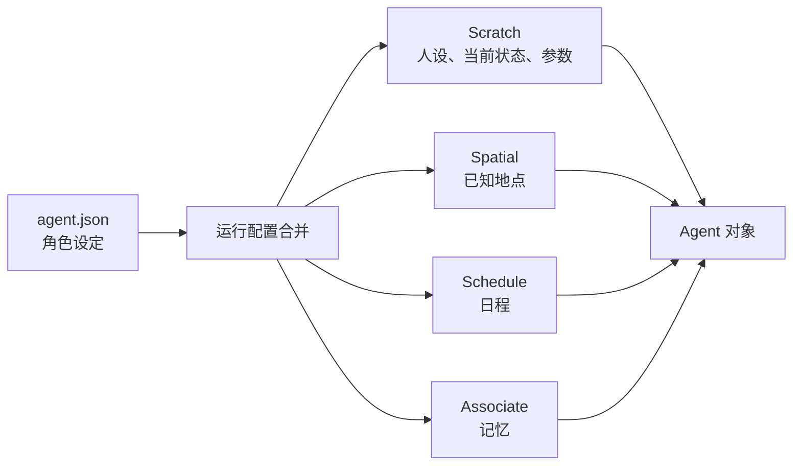

# 第 15 章 智能体初始化：角色设定如何进入系统

## 15.1 核心问题

世界模型解释了小镇如何承载角色行动。角色进入世界之前，需要先被装配成可运行的智能体状态。在 Generative Agents 中，一个智能体不是只靠一份 `agent.json` 就能运行。`agent.json` 只是角色种子。真正可运行的 `Agent` 要把多类信息装配在一起：

```text
角色设定
  + 全局 agent 基础配置
  + 地图对象
  + 对话日志
  + 空间记忆
  + 日程系统
  + 关联记忆
  + prompt scratch
  + 当前状态
  + 当前 action
  + 坐标与 tile event
```

这个装配过程发生在：

```text
start.py
  -> get_config()
  -> Game.__init__()
  -> Agent.__init__()
```

本章聚焦八个问题：

1. `agent.json` 里有哪些角色设定？
2. `data/config.json` 提供哪些公共配置？
3. `Game` 如何合并公共配置和角色配置？
4. `Agent.__init__()` 如何装配智能体？
5. `Scratch` 如何把角色设定变成 prompt 上下文？
6. 初始 action 和坐标如何进入 Maze？
7. checkpoint 恢复时初始化有什么不同？
8. 初始化阶段有哪些容易踩坑的地方？



*图 15-1：从 agent.json 到 Agent 对象的装配流程。初始化不是简单读取角色卡，而是把角色设定拆进状态、空间、日程和记忆四条链路。*

## 15.2 角色配置不是单一来源

读源码前要先明确一点：

Generative Agents 中的 agent 配置来自两个地方。第一，公共配置：

```text
generative_agents/data/config.json
```

第二，角色配置：

```text
generative_agents/frontend/static/assets/village/agents/<角色名>/agent.json
```

公共配置描述所有 agent 共用的运行参数。角色配置描述某个 agent 的身份、生活和初始空间记忆。在 `Game.__init__()` 中，两者会合并：

```python
agent_config = utils.update_dict(
    copy.deepcopy(agent_base), self.load_static(agent["config_path"])
)
agent_config = utils.update_dict(agent_config, agent)
```

装配顺序是：

```text
agent_base
  -> agent.json
  -> checkpoint/resume 中的 agent 状态
```

后面的配置会覆盖前面的配置。这对断点恢复非常关键。如果从 checkpoint 恢复，角色不能回到初始 `agent.json` 状态，而要带着已有记忆、日程、action 和 currently 继续运行。

## 15.3 data/config.json：所有 agent 的运行底座

`data/config.json` 中的核心结构是：

```json
{
  "agent": {
    "percept": { ... },
    "schedule": { ... },
    "think": { ... },
    "chat_iter": 4,
    "associate": { ... }
  }
}
```

它不是角色个性，而是运行参数。`percept` 控制感知：

```json
{
  "mode": "box",
  "vision_r": 8,
  "att_bandwidth": 8
}
```

含义是：

- 使用 box 视野。
- 视野半径为 8。
- 每次最多关注 8 个事件。

`schedule` 控制日程生成：

```json
{
  "max_try": 5,
  "diversity": 5
}
```

含义是：

- 最多尝试 5 次生成日程。
- 至少要求一定活动多样性。

`think` 控制思考相关配置：

```json
{
  "llm": { ... },
  "interval": 1000,
  "poignancy_max": 150
}
```

其中 `llm` 是模型配置，`poignancy_max` 是反思触发阈值。`chat_iter` 控制每次对话最大轮数。`associate` 控制记忆系统和 embedding。这些公共配置决定所有智能体的底层行为边界。

## 15.4 agent.json：角色种子

每个角色目录下都有 `agent.json`。以克劳斯为例：

```text
generative_agents/frontend/static/assets/village/agents/克劳斯/agent.json
```

它包含：

```json
{
  "name": "克劳斯",
  "portrait": "...",
  "coord": [126, 46],
  "currently": "克劳斯正在撰写一篇关于低收入社区中产阶级化影响的研究论文。",
  "scratch": {
    "age": 20,
    "innate": "善良、好奇、热情",
    "learned": "...",
    "lifestyle": "...",
    "daily_plan": "..."
  },
  "spatial": {
    "address": { ... },
    "tree": { ... }
  }
}
```

这里有三类信息。第一，前端和初始位置：

- `portrait`
- `coord`

第二，角色自然语言设定：

- `currently`
- `scratch.age`
- `scratch.innate`
- `scratch.learned`
- `scratch.lifestyle`
- `scratch.daily_plan`

第三，角色空间知识：

- `spatial.address`
- `spatial.tree`

这些信息共同定义一个角色的初始状态。

## 15.5 scratch 字段：人格与生活习惯

`scratch` 是角色自然语言设定的主要来源。字段包括：

| 字段 | 中文意思 | 对角色行为的影响 |
| --- | --- | --- |
| `age` | 年龄。 | 影响角色身份、生活阶段和说话方式。 |
| `innate` | 先天特质，例如善良、好奇、热情。 | 决定角色比较稳定的性格底色。 |
| `learned` | 后天经历，例如克劳斯是社会学专业学生，关注社会正义。 | 让角色的知识、职业和价值判断有背景来源。 |
| `lifestyle` | 生活习惯，例如晚上 11 点睡觉，早上 7 点醒来。 | 影响日程生成和日常行动节奏。 |
| `daily_plan` | 通常一天的计划，例如去图书馆写作、在咖啡馆吃饭。 | 给每天的具体日程生成提供初始参考。 |

这些字段不是仅用于展示。它们会进入 `Scratch._base_desc()`，成为几乎所有 prompt 的共同基础。角色个性不是硬编码在 Python 逻辑里，而是通过自然语言进入 LLM 调用。

## 15.6 currently：角色当前关注点

`currently` 表示角色当前正在关注或推进的事情。例如，克劳斯：

```text
克劳斯正在撰写一篇关于低收入社区中产阶级化影响的研究论文。
```

伊莎贝拉的 `currently` 包含情人节派对。山姆的 `currently` 包含竞选镇长。`currently` 对行为影响很大。它会进入基础描述：

```text
今天是 ${date}。${currently}
```

因此它会影响：

- 起床和日程生成。
- 对话主题。
- 行动地点选择。
- 反思焦点。
- 新一天计划更新。

`currently` 不是固定不变的。`Agent.make_schedule()` 在新一天开始时，会基于 memory 更新 `self.scratch.currently`。所以它是角色初始设定与仿真记忆之间的动态连接点。

## 15.7 spatial 字段：角色知道哪里

`agent.json` 中的 `spatial` 包含两个部分。第一，快捷地址映射：

```json
"address": {
  "living_area": [
    "the Ville",
    "奥克山学院宿舍",
    "克劳斯的房间"
  ]
}
```

第二，地点树：

```json
"tree": {
  "the Ville": {
    "奥克山学院": {
      "图书馆": ["图书馆沙发", "图书馆桌子", "书架"],
      "教室": ["黑板", "教室讲台", "教室学生座位"]
    },
    ...
  }
}
```

快捷地址用于高频行为匹配。地点树用于模型选择地点。例如，角色要“睡觉”，`Spatial` 会把它映射到 living area + 床。角色要“写论文”，系统可能让模型在空间树中选择奥克山学院、图书馆、桌子。这就是角色自己的空间知识。不同角色可以知道不同地点。这使得空间不是全知的，而是带有角色视角。

## 15.8 start.py 如何创建配置

新仿真从 `start.py` 开始。核心函数是：

```python
get_config(start_time="20240213-09:30", stride=15, agents=None)
```

它读取：

```text
data/config.json
```

取出：

```python
agent_config = json_data["agent"]
```

然后生成 simulation config：

```python
config = {
    "stride": stride,
    "time": {"start": start_time},
    "maze": {"path": os.path.join(assets_root, "maze.json")},
    "agent_base": agent_config,
    "agents": {},
}
```

每个 agent 只先放入 `config_path`：

```python
config["agents"][a] = {
    "config_path": os.path.join(
        assets_root, "agents", a.replace(" ", "_"), "agent.json"
    ),
}
```

注意，这里还没有加载完整角色配置。真正加载发生在 `Game.__init__()`。`start.py` 只负责组装仿真配置骨架。

## 15.9 Game 如何创建 Agent

`Game.__init__()` 位于：

```text
generative_agents/modules/game.py
```

它先加载地图：

```python
self.maze = Maze(self.load_static(config["maze"]["path"]), self.logger)
```

然后创建 agent 存储根目录：

```python
storage_root = os.path.join(f"results/checkpoints/{name}", "storage")
```

接着遍历所有 agent：

```python
for name, agent in config["agents"].items():
    agent_config = utils.update_dict(
        copy.deepcopy(agent_base), self.load_static(agent["config_path"])
    )
    agent_config = utils.update_dict(agent_config, agent)
    agent_config["storage_root"] = os.path.join(storage_root, name)
    self.agents[name] = Agent(agent_config, self.maze, self.conversation, self.logger)
```

这段代码做了四件事。第一，合并公共配置和角色配置。第二，再合并 checkpoint 或命令行选择产生的 agent 状态。第三，为每个 agent 设置独立 storage root。第四，创建 `Agent` 对象。因此，`Agent.__init__()` 收到的 config 已经不是纯 `agent.json`，而是完整运行配置。

## 15.10 Agent.__init__() 的输入

`Agent.__init__()` 签名是：

```python
def __init__(self, config, maze, conversation, logger):
```

四个输入分别是：

- `config`：完整 agent 配置。
- `maze`：共享世界地图。
- `conversation`：全局对话记录。
- `logger`：日志对象。

这说明 agent 初始化不是孤立的。它一开始就拿到共享世界、共享对话日志和日志系统。`maze` 是所有 agent 共用的。`conversation` 也是所有 agent 共用的。但每个 agent 的 memory、schedule、scratch、status 是自己的。多智能体系统的基本结构是：

```text
共享环境
  + 个体状态
  + 共享互动记录
```

## 15.11 第一组字段：身份与环境引用

`Agent.__init__()` 首先设置：

```python
self.name = config["name"]
self.maze = maze
self.conversation = conversation
self._llm = None
self.logger = logger
```

`name` 是角色名。`maze` 是共享世界。`conversation` 是共享对话日志。`_llm` 初始化为 None，后面在 `reset()` 中创建。`logger` 用于记录 prompt、状态和仿真信息。这里有个细节：LLM 不是在 `__init__()` 中立刻创建。创建 agent 对象和初始化 LLM 是分开的。`Game.reset_game()` 会调用每个 agent 的 `reset()`：

```python
agent.reset()
```

而 `reset()` 中才会：

```python
self._llm = create_llm_model(self.think_config["llm"])
```

这样做可以让对象装配和模型连接分离。

## 15.12 第二组字段：运行配置

接着设置：

```python
self.percept_config = config["percept"]
self.think_config = config["think"]
self.chat_iter = config["chat_iter"]
```

这三项来自 `data/config.json`。`percept_config` 决定视野和注意力带宽。`think_config` 决定 LLM、interval、poignancy threshold。`chat_iter` 决定每次对话最大轮次。这些不是角色个性，而是运行机制参数。如果所有 agent 共用同一套参数，小镇整体行为更一致。如果未来想让不同角色具有不同感知半径或聊天倾向，也可以在某个 `agent.json` 或 checkpoint 中覆盖这些配置。

## 15.13 第三组字段：记忆系统

Agent 初始化记忆系统：

```python
self.spatial = memory.Spatial(**config["spatial"])
self.schedule = memory.Schedule(**config["schedule"])
self.associate = memory.Associate(
    os.path.join(config["storage_root"], "associate"), **config["associate"]
)
self.concepts, self.chats = [], config.get("chats", [])
```

这里有三种记忆或状态。第一，`Spatial`。角色知道哪些地点。第二，`Schedule`。角色今天的日程。第三，`Associate`。角色的事件、对话和想法记忆。`concepts` 是本 step 感知到的新 concepts。`chats` 是待反思的近期聊天内容。这说明“记忆”在项目中不是一个单一模块，而是多层结构。空间知识、日程、关联记忆、当前感知、对话暂存各自负责不同部分。

## 15.14 Associate 的 storage_root

每个 agent 的 `Associate` 都有独立存储目录。`Game.__init__()` 设置：

```python
agent_config["storage_root"] = os.path.join(storage_root, name)
```

`Agent.__init__()` 再传给：

```python
os.path.join(config["storage_root"], "associate")
```

最终路径类似：

```text
results/checkpoints/<sim-name>/storage/克劳斯/associate
```

每个 agent 的 memory index 是分开的。克劳斯的记忆不会直接写进玛丽亚的向量索引。信息传播必须通过对话、感知和记忆写入发生，而不是共享一个全局 memory。这符合论文中的个体记忆设定。

## 15.15 第四组字段：prompt Scratch

Prompt 状态由 `Scratch` 管理：

```python
self.scratch = prompt.Scratch(self.name, config["currently"], config["scratch"])
```

`Scratch` 保存：

- `name`
- `currently`
- `config`
- `template_path`

其中 `config` 就是 `agent.json` 中的 scratch 字段。`Scratch._base_desc()` 会填充 `base_desc.txt`：

```text
姓名: ${name}
年龄：${age}
先天特质：${innate}
后天特质：${learned}
生活习惯：${lifestyle}
日常计划：${daily_plan}

今天是 ${date}。${currently}
```

这段基础描述会进入许多 prompt。例如：

- 起床时间。
- 日程生成。
- 重要性评分。
- 对话生成。
- 反思。

`Scratch` 是角色设定进入 LLM 的主要通道。

## 15.16 Scratch.build_prompt()

`Scratch.build_prompt()` 很简单：

```python
with open(f"{self.template_path}/{template}.txt", "r", encoding="utf-8") as file:
    file_content = file.read()

template = Template(file_content)
filled_content = template.substitute(data)
```

它从 `data/prompts` 读取模板，并使用 `string.Template` 替换变量。这带来两个好处。第一，prompt 可维护。修改 prompt 不需要改 Python 主逻辑。第二，prompt 可审计。读者可以直接打开 `.txt` 文件，看模型到底收到什么任务。但也有一个风险。`Template.substitute()` 要求变量必须齐全，否则会报错。所以每个 `prompt_*` 方法都必须提供模板需要的字段。prompt 与 Python 方法必须成对维护。

## 15.17 第五组字段：状态与 plan

Agent 初始化状态：

```python
status = {"poignancy": 0}
self.status = utils.update_dict(status, config.get("status", {}))
self.plan = config.get("plan", {})
```

`poignancy` 是反思触发计数。新 agent 从 0 开始。从 checkpoint 恢复时，会用已有 `status` 覆盖默认值。`plan` 是前端或上一步返回的移动计划缓存。这两个字段虽然小，但很关键。如果断点恢复丢失 `status["poignancy"]`，反思触发时机会改变。如果丢失 `plan` 或 action，角色的当前位置和行为连续性会断。

## 15.18 第六组字段：record 时间

初始化中还有：

```python
self.last_record = utils.get_timer().daily_duration()
```

这个字段用于控制记录频率。`Game.agent_think()` 中会判断：

```python
if (utils.get_timer().daily_duration() - agent.last_record) > self.record_iterval:
    info["record"] = True
    agent.last_record = utils.get_timer().daily_duration()
else:
    info["record"] = False
```

这影响哪些 step 会被标记为记录点。虽然它不是 agent 认知核心，但它影响回放和结果压缩。

## 15.19 第七组字段：初始 action

Agent 初始化必须给角色一个当前 action。有两种情况。第一，从 checkpoint 恢复。如果 config 中有 `action`：

```python
self.action = memory.Action.from_dict(config["action"])
tiles = self.maze.get_address_tiles(self.get_event().address)
config["coord"] = random.choice(list(tiles))
```

恢复时会使用保存的 action，并根据 action 地址重新选择坐标。第二，新仿真初始化。如果没有 action：

```python
tile = self.maze.tile_at(config["coord"])
address = tile.get_address("game_object", as_list=True)
self.action = memory.Action(
    memory.Event(self.name, address=address),
    memory.Event(address[-1], address=address),
)
```

系统根据初始坐标所在 tile 的 game_object 地址创建默认 action。这里的 action 还没有具体 predicate/object，更多是占位状态。随后 `move()` 会把它更新到地图上。

## 15.20 初始化时更新 Maze

Agent 初始化最后做：

```python
self.coord, self.path = None, None
self.move(config["coord"], config.get("path"))
if self.coord is None:
    self.coord = config["coord"]
```

`move()` 会更新 tile 上的事件。如果角色从一个坐标移动到另一个坐标，会移除旧 tile 上该角色事件，并在新 tile 更新事件。初始化时 `self.coord` 是 None，所以主要是把角色当前 action 放到初始 tile。这一步使角色真正进入世界。否则 `Agent` 只是 Python 对象，地图上还没有它的事件。

## 15.21 reset()：创建模型连接

`Agent.__init__()` 不创建 LLM。LLM 创建发生在：

```python
def reset(self):
    if not self._llm:
        self._llm = create_llm_model(self.think_config["llm"])
```

`Game.reset_game()` 会遍历所有 agent 调用 reset。这一步根据 `think_config["llm"]` 创建具体模型。例如：

- Ollama。
- OpenAI。
- MiniMax。

模型创建与 agent 初始化分离，有助于：

- 先完成对象装配。
- 再统一初始化模型。
- 断点恢复时复用同一逻辑。

第 20 章会详细讲模型适配。

## 15.22 completion()：prompt 调用入口

`Agent.completion()` 是所有 LLM prompt 调用的统一入口。它根据 `func_hint` 找 `Scratch` 中对应方法：

```python
func = getattr(self.scratch, "prompt_" + func_hint)
res = func(*args, **kwargs)._asdict()
```

例如：

```python
self.completion("wake_up")
```

会调用：

```python
self.scratch.prompt_wake_up()
```

`prompt_wake_up()` 返回 `Result`：

```text
prompt
callback
failsafe
return_type
```

然后 `LLMModel.completion()` 根据这些信息调用模型、解析结果、执行 callback、失败时返回 failsafe。这条链路是：

```text
Agent.completion("xxx")
  -> Scratch.prompt_xxx()
  -> prompt template
  -> return_type schema
  -> LLMModel.completion()
  -> callback/failsafe
```

这就是角色设定、prompt 和模型之间的桥。

## 15.23 abstract()：初始化后怎么看 agent 状态

`Agent.abstract()` 用于生成 agent 当前状态摘要。它包含：

```python
{
    "name": self.name,
    "currently": self.scratch.currently,
    "tile": self.maze.tile_at(self.coord).abstract(),
    "status": self.status,
    "concepts": ...,
    "chats": self.chats,
    "action": self.action.abstract(),
    "associate": self.associate.abstract(),
}
```

如果已有 schedule，也会加入 schedule。如果 LLM 可用，也会加入 llm summary。这对调试很有用。`Game.agent_think()` 会在日志中输出 agent 摘要。读者要理解 agent 当前状态时，可以看：

- currently。
- tile。
- status。
- action。
- schedule。
- associate。

这些字段比只看前端动画更可靠。

## 15.24 to_dict()：保存状态

`Agent.to_dict()` 用于 checkpoint。它保存：

```python
info = {
    "status": self.status,
    "schedule": self.schedule.to_dict(),
    "associate": self.associate.to_dict(),
    "chats": self.chats,
    "currently": self.scratch.currently,
}
if with_action:
    info.update({"action": self.action.to_dict()})
```

注意，它会调用：

```python
self.associate.to_dict()
```

而 `Associate.to_dict()` 会保存索引：

```python
self._index.save()
```

这意味着 checkpoint 不只是 JSON，也伴随向量索引持久化。断点恢复时，`Associate` 会从 storage path 加载已有 index。这就是角色长期记忆能跨运行保存的原因。

## 15.25 断点恢复时发生什么

如果使用：

```bash
python start.py --name sim-test --resume --step 10
```

`start.py` 会调用：

```python
get_config_from_log(checkpoints_folder)
```

它读取最后一个 checkpoint JSON，恢复 config。然后把时间推进一个 stride：

```python
start_time += datetime.timedelta(minutes=config["stride"])
```

并为每个 agent 重新设置 `config_path`。之后进入与新仿真相同的 `SimulateServer` 和 `Game` 初始化流程。差别在于，此时 agent config 中已经包含：

- status。
- schedule。
- associate。
- chats。
- currently。
- action。
- coord。

这些会覆盖初始 `agent.json`。所以恢复后的角色不是重新开始，而是继续过去状态。

## 15.26 初始化阶段的常见问题

初始化阶段常见问题有六类。第一，角色名不在 `personas` 列表里。如果命令行 `--agents` 传入未知角色，`start.py` 会报错。第二，`agent.json` 坐标不对应有效 game_object。新 agent 初始化时会从初始 tile 取 game_object 地址。如果坐标位置不合理，初始 action 可能异常。第三，`spatial.tree` 不包含角色需要的地点。角色知道的地点不足，计划落地时更依赖模型随机选择。第四，`currently` 太弱。如果 `currently` 没有明确目标，角色日程可能过于普通。第五，模型配置不可用。Ollama 没启动、模型名不对、embedding 模型不存在，都会导致运行失败。第六，断点恢复时 storage 不一致。如果 checkpoint JSON 和 storage index 不匹配，记忆可能恢复异常。这些问题很多看起来像 agent 行为问题，其实源自初始化。

## 15.27 如何检查一个 agent 是否初始化正确

建议按下面顺序检查。第一，看 `agent.json`。确认：

- name。
- coord。
- currently。
- scratch。
- spatial。

第二，看 `data/config.json`。确认：

- LLM provider。
- embedding provider。
- percept。
- schedule。
- associate。

第三，运行短仿真。例如：

```bash
python start.py --name init-check --start "20250213-09:30" --step 1 --stride 10 --agents "克劳斯"
```

第四，看日志中的 agent summary。检查：

- tile 地址是否正确。
- action 是否合理。
- associate 是否初始化。
- schedule 是否生成。

第五，看 checkpoint。确认结果写入：

```text
results/checkpoints/init-check/
```

如果这些都正常，说明 agent 初始化链路基本没问题。

## 15.28 本章小结

智能体初始化决定了角色后续能不能稳定行动。一个角色不是从 `agent.json` 直接变成一句 prompt，而是被装配成 Scratch、Spatial、Schedule、Associate 和当前 Action 的组合。

| 本章内容 | 核心结论 |
| --- | --- |
| 配置来源 | Agent 配置来自 `data/config.json`、角色 `agent.json` 和 checkpoint。 |
| 配置合并 | `Game.__init__()` 会合并公共配置、角色配置和恢复状态。 |
| `agent.json` | 它是角色种子，包含身份、currently、scratch 和 spatial。 |
| `Scratch` | Scratch 把角色设定转成 prompt 基础上下文。 |
| 三类子系统 | Spatial、Schedule、Associate 分别管理空间记忆、日程和关联记忆。 |
| 独立记忆 | 每个 agent 有自己的 associate storage，记忆不会自动全局共享。 |
| Action 恢复 | 初始化会创建或恢复当前 action，并通过 `move()` 写入 Maze。 |
| 模型入口 | LLM 在 `reset()` 中创建，`Agent.completion()` 是 prompt 调用统一入口。 |
| checkpoint | `to_dict()` 和 checkpoint 让角色状态可以跨运行恢复。 |
| 调试重点 | 初始化问题会影响后续行为，不能只盯 prompt。 |

下一章讲仿真循环：从 `start.py`、`SimulateServer.simulate()`、`Game.agent_think()` 到 `Agent.think()`，把每一步时间推进和 agent 思考过程讲清楚。

## 参考资料

- Local source: `generative_agents/start.py`
- Local source: `generative_agents/modules/game.py`
- Local source: `generative_agents/modules/agent.py`
- Local source: `generative_agents/modules/prompt/scratch.py`
- Local source: `generative_agents/data/config.json`
- Local prompt: `generative_agents/data/prompts/base_desc.txt`
- Local data: `generative_agents/frontend/static/assets/village/agents/*/agent.json`
