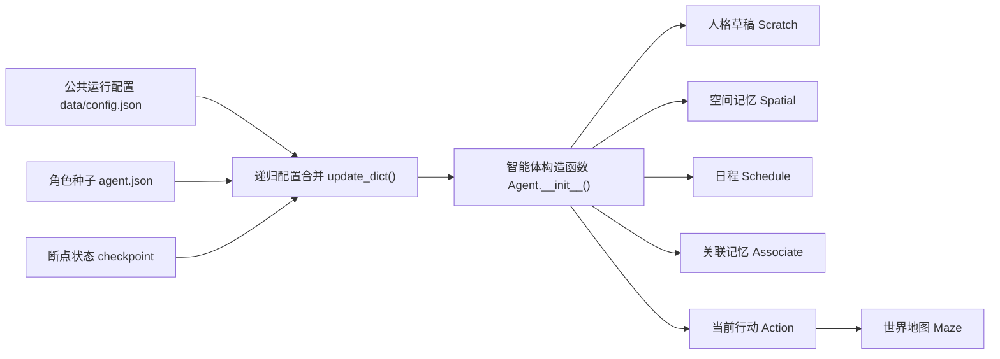
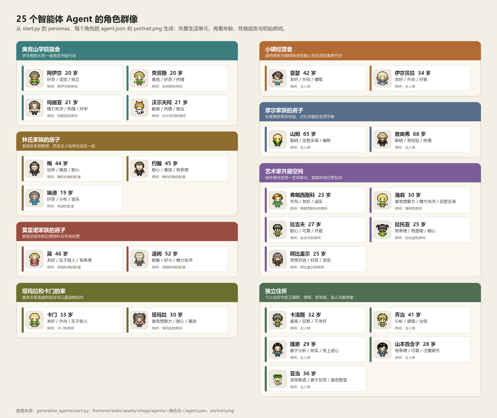
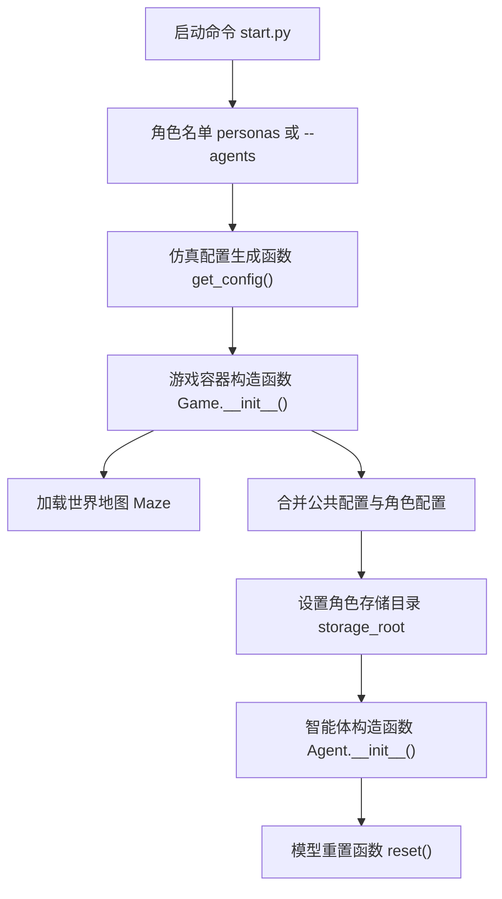

# 第 15 章 智能体初始化：角色设定如何进入系统

## 15.1 智能体初始化解决什么

世界地图 Maze 决定小镇有什么空间，角色配置决定谁住在这个空间里、知道哪些地点、带着什么身份和目标开始行动。一个可运行的智能体 Agent 不是一张角色卡，也不是一次提示词 prompt 调用，而是公共运行配置、角色种子、空间记忆、日程系统、关联记忆、当前行动和地图事件装配出来的运行对象。

| 初始化要解决的问题 | 没处理好会怎样 | 初始化完成后 |
| --- | --- | --- |
| 角色身份从哪里来 | 模型只看到临时任务，角色没有稳定个性 | 人格草稿 Scratch 持有年龄、性格、经历、生活习惯和当前关注点 |
| 角色住在哪里 | 角色有名字但没有空间落点 | 初始坐标 coord 落到地图格子 Tile，并生成当前行动 Action |
| 角色知道哪些地点 | 后续计划无法稳定选择地点 | 空间记忆 Spatial 保存角色视角下的地点树 tree 和快捷地址 address |
| 角色如何记住事件 | 每次运行都像重新开始 | 关联记忆 Associate 为每个角色建立独立存储目录 |
| 角色如何调用模型 | 提示词 prompt 找不到身份上下文 | 人格基础描述函数 `Scratch._base_desc()` 把角色设定写进多类提示词 prompt |
| 角色如何恢复运行 | 断点 checkpoint 之后状态断裂 | 已保存的 `status`、`schedule`、`associate`、`currently`、`action` 覆盖初始种子 |



*图 15-1：智能体 Agent 的初始化来源。角色配置先与公共配置合并，断点恢复时再叠加断点 checkpoint 状态，最后由智能体构造函数 `Agent.__init__()` 装配成运行对象。*

初始化的核心结论很简单：`agent.json` 负责给角色一个起点，`data/config.json` 负责给所有角色一套运行机制，游戏容器构造函数 `Game.__init__()` 负责合并配置，智能体构造函数 `Agent.__init__()` 负责把合并后的配置拆进各个运行模块。

## 15.2 角色从哪里定义

角色定义来自三个层次，后面的层次可以覆盖前面的层次。这个覆盖关系非常重要，因为它解释了新仿真和断点恢复为什么能走同一套创建流程。

| 层次 | 文件或字段 | 中文含义 | 对系统行为的影响 |
| --- | --- | --- | --- |
| 公共运行配置 | `generative_agents/data/config.json` 的 `agent` | 所有智能体 Agent 共用的感知、日程、模型、记忆参数 | 决定视野半径、对话轮数、模型提供方、记忆保留数量等运行边界 |
| 角色种子 | `frontend/static/assets/village/agents/<角色名>/agent.json` | 某个角色的身份、当前位置、当前关注、空间知识 | 决定角色是谁、住在哪里、知道哪些地点、带着什么目标开始 |
| 断点状态 | `results/checkpoints/<sim>/simulate-*.json` 中的 `agents` | 已运行仿真的角色状态 | 恢复日程 `schedule`、关联记忆 `associate`、当前关注 `currently`、行动 `action` 和坐标 `coord`，让角色继续而不是重生 |

`start.py` 中的新仿真配置只先保存每个角色的配置路径：

```python
config = {
    "stride": stride,
    "time": {"start": start_time},
    "maze": {"path": os.path.join(assets_root, "maze.json")},
    "agent_base": agent_config,
    "agents": {},
}
for a in agents:
    config["agents"][a] = {
        "config_path": os.path.join(
            assets_root, "agents", a.replace(" ", "_"), "agent.json"
        ),
    }
```

真正的合并发生在游戏容器构造函数 `Game.__init__()`：

```python
agent_config = utils.update_dict(
    copy.deepcopy(agent_base), self.load_static(agent["config_path"])
)
agent_config = utils.update_dict(agent_config, agent)
agent_config["storage_root"] = os.path.join(storage_root, name)
self.agents[name] = Agent(agent_config, self.maze, self.conversation, self.logger)
```

递归配置合并函数 `utils.update_dict()` 是递归合并。先把公共配置 `agent_base` 与角色的 `agent.json` 合并，再把断点 checkpoint 或命令行选择产生的状态合并进去，因此新仿真会使用初始角色种子，断点恢复会使用已经保存过的角色状态。

## 15.3 公共运行配置

`generative_agents/data/config.json` 的 `agent` 字段是所有角色的运行底座。当前项目中的真实配置如下，接口密钥 API key 字段为空，运行时可由环境变量或本地配置补入：

```json
{
  "percept": {
    "mode": "box",
    "vision_r": 8,
    "att_bandwidth": 8
  },
  "schedule": {
    "max_try": 5,
    "diversity": 5
  },
  "think": {
    "llm": {
      "provider": "minimax",
      "model": "MiniMax-M3",
      "base_url": "https://api.minimaxi.com/v1",
      "api_key": "",
      "max_tokens": 8192
    },
    "interval": 1000,
    "poignancy_max": 150
  },
  "chat_iter": 4,
  "associate": {
    "embedding": {
      "provider": "minimax",
      "model": "embo-01",
      "base_url": "https://api.minimax.chat/v1",
      "api_key": "",
      "group_id": ""
    },
    "retention": 8
  }
}
```

| 配置字段 | 中文意思 | 运行时作用 |
| --- | --- | --- |
| `percept.mode` | 感知模式 | 当前为盒状视野 box，感知章节会继续展开 |
| `percept.vision_r` | 视野半径 | 角色每次感知附近 8 格范围内的地图格子 Tile |
| `percept.att_bandwidth` | 注意力带宽 | 一次最多挑选 8 个事件进入后续判断 |
| `schedule.max_try` | 日程生成最大尝试次数 | 日程不满足多样性时，最多重新生成 5 次 |
| `schedule.diversity` | 日程多样性要求 | 避免一天计划只有少数重复活动 |
| `think.llm` | 思考模型配置 | 决定模型重置函数 `reset()` 创建哪个大语言模型 LLM 连接 |
| `think.interval` | 思考间隔 | 用于计算小镇中最短的模型思考周期 |
| `think.poignancy_max` | 反思触发阈值 | 重要性累积达到阈值后触发反思 Reflection |
| `chat_iter` | 对话轮数上限 | 控制一次聊天最多持续几轮 |
| `associate.embedding` | 关联记忆向量模型 | `Associate` 用它创建或加载每个角色的记忆索引 |
| `associate.retention` | 记忆保留条数 | 检索事件、想法、对话时默认保留最近 8 条 |

这些字段不是角色个性，而是系统对所有智能体 Agent 的统一约束。某个角色如果需要不同的感知半径、对话轮数或模型配置，也可以在自己的 `agent.json` 或断点 checkpoint 状态中覆盖同名字段。

## 15.4 25 个角色配置清单

项目固定提供 25 个角色。`start.py` 用 `personas` 列表控制默认角色集合，每个角色再对应一个 `agent.json` 文件。这个清单不是背景设定附录，而是初始化系统的入口：命令行 `--agents` 传入的名字必须出现在这里，否则 `start.py` 会直接报错。

先读图，再读表。图中的每张卡片对应一个角色目录，头像来自 `portrait.png`，年龄和性格底色来自 `agent.json.scratch`，初始房间来自 `agent.json.spatial.address.living_area`。25 个角色不是零散地摆在小镇里，而是按宿舍、家庭、室友、公寓、共居空间和独立住所组成生活单元。

```bash
python docs/book/scaffolds/part_03/ch15_agent_roster_figure.py
```

这个脚手架读取 `start.py` 的 `personas` 顺序，再读取每个角色的 `agent.json` 与 `portrait.png`，生成书稿中的角色群像图。



*图 15-2：25 个智能体 Agent 的角色群像。读这张图时，先看角色属于哪个生活单元，再看年龄、性格底色和初始房间；这些字段随后会进入人格草稿 Scratch、空间记忆 Spatial 和初始行动 Action。*

| 角色 | 年龄 | 性格底色 innate | 居住地址 living_area |
| --- | --- | --- | --- |
| 阿伊莎 | 20 | 好奇、坚定、独立 | the Ville / 奥克山学院宿舍 / 阿伊莎的房间 |
| 克劳斯 | 20 | 善良、好奇、热情 | the Ville / 奥克山学院宿舍 / 克劳斯的房间 |
| 玛丽亚 | 21 | 精力充沛、热情、好学 | the Ville / 奥克山学院宿舍 / 玛丽亚的房间 |
| 沃尔夫冈 | 21 | 勤奋、热情、敬业 | the Ville / 奥克山学院宿舍 / 沃尔夫冈的房间 |
| 梅 | 44 | 培养、善良、耐心 | the Ville / 林氏家族的房子 / 梅和约翰的卧室 |
| 约翰 | 45 | 耐心、善良、有条理 | the Ville / 林氏家族的房子 / 梅和约翰的卧室 |
| 埃迪 | 19 | 好奇、分析、音乐 | the Ville / 林氏家族的房子 / 埃迪的卧室 |
| 简 | 46 | 友好、乐于助人、有条理 | the Ville / 莫雷诺家族的房子 / 汤姆和简的卧室 |
| 汤姆 | 52 | 粗鲁、好斗、精力充沛 | the Ville / 莫雷诺家族的房子 / 汤姆和简的卧室 |
| 卡门 | 33 | 友好、外向、乐于助人 | the Ville / 塔玛拉和卡门的家 / 卡门的房间 |
| 塔玛拉 | 30 | 富有想象力，耐心，善良 | the Ville / 塔玛拉和卡门的家 / 塔玛拉的房间 |
| 亚瑟 | 42 | 友好、外向、慷慨 | the Ville / 亚瑟的公寓 / 主人房 |
| 伊莎贝拉 | 34 | 友好、外向、好客 | the Ville / 伊莎贝拉的公寓 / 主人房 |
| 山姆 | 65 | 聪明、足智多谋、幽默 | the Ville / 摩尔家族的房子 / 主人房 |
| 詹妮弗 | 68 | 聪明、有经验、热情 | the Ville / 摩尔家族的房子 / 主人房 |
| 弗朗西斯科 | 23 | 外向、友好、诚实 | the Ville / 艺术家共居空间 / 弗朗西斯科的房间 |
| 海莉 | 30 | 富有想象力、精力充沛、足智多谋 | the Ville / 艺术家共居空间 / 海莉的房间 |
| 拉吉夫 | 27 | 耐心、可靠、开朗 | the Ville / 艺术家共居空间 / 拉吉夫的房间 |
| 拉托亚 | 25 | 有条理、有逻辑、细心 | the Ville / 艺术家共居空间 / 拉托亚的房间 |
| 阿比盖尔 | 25 | 思想开放、好奇、坚定 | the Ville / 艺术家共居空间 / 阿比盖尔的房间 |
| 卡洛斯 | 32 | 直率、狂野、不友好 | the Ville / 卡洛斯的公寓 / 主人房 |
| 乔治 | 41 | 分析、逻辑、古怪 | the Ville / 乔治的公寓 / 主人房 |
| 瑞恩 | 29 | 善于分析、务实、有上进心 | the Ville / 瑞恩的公寓 / 主人房 |
| 山本百合子 | 28 | 有条理、可靠、注重细节 | the Ville / 山本百合子的房子 / 主人房 |
| 亚当 | 36 | 深思熟虑、善于反思、富有智慧 | the Ville / 亚当的家 / 主人房 |

表中只列了最适合快速对照的字段。每个角色的完整设定还包括 `currently`、`learned`、`lifestyle`、`daily_plan` 和空间地点树 `spatial.tree`，这些字段决定角色进入提示词 prompt 和空间系统后的具体行为。

## 15.5 agent.json 的真实结构

以伊莎贝拉为例，角色配置文件位于：

```text
generative_agents/frontend/static/assets/village/agents/伊莎贝拉/agent.json
```

这个文件的核心字段如下：

```json
{
  "name": "伊莎贝拉",
  "portrait": "assets/village/agents/伊莎贝拉/portrait.png",
  "coord": [72, 14],
  "currently": "伊莎贝拉计划于2月14日下午5点在霍布斯咖啡馆与她的顾客举行情人节派对。她正在收集聚会材料，并告诉大家在2月14日下午5点至7点在霍布斯咖啡馆参加聚会。",
  "scratch": {
    "age": 34,
    "innate": "友好、外向、好客",
    "learned": "伊莎贝拉是霍布斯咖啡馆的老板，她总是想办法让咖啡馆成为人们放松和享受的地方。",
    "lifestyle": "伊莎贝拉晚上11点左右上床睡觉，早上6点左右醒来。",
    "daily_plan": "伊莎贝拉每天早上8点开放霍布斯咖啡馆，站在柜台前直到晚上8点，然后关闭咖啡馆。"
  },
  "spatial": {
    "address": {
      "living_area": [
        "the Ville",
        "伊莎贝拉的公寓",
        "主人房"
      ]
    },
    "tree": {
      "the Ville": {
        "伊莎贝拉的公寓": {
          "主人房": ["床", "书桌", "冰箱", "壁橱", "架子"]
        },
        "霍布斯咖啡馆": {
          "咖啡馆": ["冰箱", "咖啡馆顾客座位", "烹饪区", "厨房水槽", "咖啡馆柜台后面", "钢琴"]
        }
      }
    }
  }
}
```

| 字段 | 中文意思 | 进入哪个模块 | 对行为的影响 |
| --- | --- | --- | --- |
| `name` | 角色名 | 智能体 Agent、人格草稿 Scratch、事件 Event | 决定日志、事件主体、提示词 prompt 中的角色名称 |
| `portrait` | 角色头像路径 | 前端 Phaser | 决定回放或前端展示时使用哪个角色图像 |
| `coord` | 初始坐标 | 世界地图 Maze、地图格子 Tile、行动 Action | 决定角色初始化时站在哪个地点 |
| `currently` | 当前关注点 | 人格草稿 Scratch | 影响日程、对话、反思和下一步行动的主题 |
| `scratch.age` | 年龄 | 人格草稿 Scratch | 影响身份阶段、作息和语言风格 |
| `scratch.innate` | 先天特质 | 人格草稿 Scratch | 给角色稳定的性格底色 |
| `scratch.learned` | 后天经历 | 人格草稿 Scratch | 给角色职业、知识和价值判断提供背景 |
| `scratch.lifestyle` | 生活习惯 | 人格草稿 Scratch、日程提示词 prompt | 影响起床、睡觉、工作和休息节奏 |
| `scratch.daily_plan` | 通常一天安排 | 人格草稿 Scratch、日程提示词 prompt | 给当天计划生成提供默认骨架 |
| `spatial.address.living_area` | 居住地址 | 空间记忆 Spatial | 初始化时自动派生睡觉地址 `睡觉` |
| `spatial.tree` | 角色知道的地点树 | 空间记忆 Spatial | 让角色在计划落地时拥有自己的空间视角 |

`agent.json` 的关键不是“写得像人物小传”，而是字段最终都要进入运行模块。`currently` 进入人格草稿 Scratch，`coord` 进入世界地图 Maze 和行动 Action，`spatial` 进入空间记忆 Spatial，`scratch` 进入几乎所有大语言模型 LLM 提示词 prompt 的基础上下文。

## 15.6 角色设定如何进入提示词 prompt

角色设定进入大语言模型 LLM 的主入口是人格草稿 Scratch。智能体构造函数 `Agent.__init__()` 中的代码非常短：

```python
self.scratch = prompt.Scratch(self.name, config["currently"], config["scratch"])
```

人格草稿 Scratch 保存三类信息：

| 代码名 | 中文意思 | 来源 |
| --- | --- | --- |
| `name` | 角色名 | `agent.json.name` |
| `currently` | 当前关注点 | `agent.json.currently` 或断点 checkpoint |
| `config` | 人格字段集合 | `agent.json.scratch` |

基础提示词模板位于：

```text
generative_agents/data/prompts/base_desc.txt
```

真实模板如下：

```text
姓名: ${name}
年龄：${age}
先天特质：${innate}
后天特质：${learned}
生活习惯：${lifestyle}
日常计划：${daily_plan}

今天是 ${date}。${currently}
```

英文含义可以对应成：

```text
Name: ${name}
Age: ${age}
Innate traits: ${innate}
Learned traits: ${learned}
Lifestyle: ${lifestyle}
Daily plan: ${daily_plan}

Today is ${date}. ${currently}
```

人格基础描述函数 `Scratch._base_desc()` 负责填充模板：

```python
def _base_desc(self):
    return self.build_prompt(
        "base_desc",
        {
            "name": self.name,
            "age": self.config["age"],
            "innate": self.config["innate"],
            "learned": self.config["learned"],
            "lifestyle": self.config["lifestyle"],
            "daily_plan": self.config["daily_plan"],
            "date": utils.get_timer().daily_format_cn(),
            "currently": self.currently,
        }
    )
```

伊莎贝拉在 `2024-02-14` 早上初始化后，基础提示词会被填成：

```text
姓名: 伊莎贝拉
年龄：34
先天特质：友好、外向、好客
后天特质：伊莎贝拉是霍布斯咖啡馆的老板，她总是想办法让咖啡馆成为人们放松和享受的地方。
生活习惯：伊莎贝拉晚上11点左右上床睡觉，早上6点左右醒来。
日常计划：伊莎贝拉每天早上8点开放霍布斯咖啡馆，站在柜台前直到晚上8点，然后关闭咖啡馆。

今天是 2024年02月14日（星期三）。伊莎贝拉计划于2月14日下午5点在霍布斯咖啡馆与她的顾客举行情人节派对。她正在收集聚会材料，并告诉大家在2月14日下午5点至7点在霍布斯咖啡馆参加聚会。
```

这段文字会被多个提示词 prompt 复用，例如：
 - 起床时间 `wake_up`
 - 日程初始化 `schedule_init`
 - 小时级日程 `schedule_daily`
 - 重要性评分 `poignancy_event`
 - 对话生成和反思相关提示词 prompt

角色身份连续性主要就来自这里：模型每次被要求生成行为时，都会先看到同一套人物身份、生活习惯和当前关注点。

## 15.7 初始化链路

从命令行启动新仿真时，角色对象按下面的顺序创建：



*图 15-3：新仿真的智能体创建顺序。入口脚本 `start.py` 只生成配置骨架，真正读取 `agent.json` 并构造智能体 Agent 的位置在游戏容器构造函数 `Game.__init__()`。*

| 步骤 | 代码位置 | 输入 | 输出 |
| --- | --- | --- | --- |
| 选择角色 | `start.py` 的 `personas`、`--agents`、`--agent-count` | 默认 25 人或命令行指定名单 | `selected_personas` |
| 生成配置 | 仿真配置生成函数 `get_config()` | 起始时间、步长、角色名单 | 包含 `agent_base` 和 `config_path` 的仿真配置 |
| 加载地图 | 游戏容器构造函数 `Game.__init__()` | `assets/village/maze.json` | 共享世界地图 Maze |
| 合并配置 | 游戏容器构造函数 `Game.__init__()` | 公共配置、角色配置、恢复状态 | 完整角色配置 `agent_config` |
| 创建存储 | 游戏容器构造函数 `Game.__init__()` | 仿真名称、角色名 | `results/checkpoints/<name>/storage/<角色名>` |
| 构造对象 | 智能体构造函数 `Agent.__init__()` | 完整角色配置 `agent_config`、世界地图 Maze、对话记录 conversation、日志 logger | 可运行的智能体 Agent |
| 初始化模型 | 游戏重置函数 `Game.reset_game()` 调用角色重置函数 `agent.reset()` | `think.llm` | 大语言模型 LLM 连接对象 |

这个顺序解释了一个常见误会：入口脚本 `start.py` 不是直接创建角色，`agent.json` 也不是直接变成提示词 prompt。它们先进入统一配置，再由游戏容器 Game 和智能体 Agent 分层装配。

## 15.8 智能体构造函数 Agent.__init__ 装配了什么

智能体构造函数 `Agent.__init__()` 的签名是：

```python
def __init__(self, config, maze, conversation, logger):
```

四个参数分别是完整角色配置、共享世界地图 Maze、共享对话日志 conversation 和日志对象 logger。初始化时先保存身份与共享环境：

```python
self.name = config["name"]
self.maze = maze
self.conversation = conversation
self._llm = None
self.logger = logger
```

随后读取公共运行参数：

```python
self.percept_config = config["percept"]
self.think_config = config["think"]
self.chat_iter = config["chat_iter"]
```

再创建三类长期运行模块：

```python
self.spatial = memory.Spatial(**config["spatial"])
self.schedule = memory.Schedule(**config["schedule"])
self.associate = memory.Associate(
    os.path.join(config["storage_root"], "associate"), **config["associate"]
)
self.concepts, self.chats = [], config.get("chats", [])
```

最后装配提示词 prompt 状态、反思计数、行动状态和地图位置：

```python
self.scratch = prompt.Scratch(self.name, config["currently"], config["scratch"])

status = {"poignancy": 0}
self.status = utils.update_dict(status, config.get("status", {}))
self.plan = config.get("plan", {})
self.last_record = utils.get_timer().daily_duration()
```

把这些代码合起来看，初始化后的智能体 Agent 已经有了七组状态。

| 状态组 | 代码字段 | 中文意思 | 后续影响 |
| --- | --- | --- | --- |
| 身份与环境 | `name`、`maze`、`conversation`、`logger` | 角色名、共享地图、共享对话日志、日志系统 | 决定角色在哪里行动，以及如何与全局系统交互 |
| 运行配置 | `percept_config`、`think_config`、`chat_iter` | 感知、模型、聊天轮数配置 | 控制感知半径、模型连接和对话长度 |
| 空间记忆 | `spatial` | 角色知道的地点树和快捷地址 | 计划落地、睡觉、随机选址都依赖它 |
| 日程系统 | `schedule` | 一天计划与细粒度分解 | 决定当前时段应该做什么 |
| 关联记忆 | `associate`、`concepts`、`chats` | 事件、想法、对话及当前感知缓存 | 支撑检索、反思和关系记忆 |
| 人格草稿 | `scratch` | 角色设定和当前关注点 | 构造各类大语言模型 LLM 提示词 prompt 的基础上下文 |
| 当前状态 | `status`、`plan`、`last_record`、`action`、`coord`、`path` | 反思计数、前端移动计划、记录时间、当前行动、坐标、移动路径 | 支撑连续仿真、回放和断点 checkpoint |

空间记忆 Spatial 初始化时还有一个小动作：如果角色有居住地址 `living_area`，但没有显式配置睡觉地址，系统会自动补出中文键 `睡觉`。

```python
if "sleeping" not in self.address and "睡觉" not in self.address and "living_area" in self.address:
    self.address["睡觉"] = self.address["living_area"] + ["床"]
```

伊莎贝拉的居住地址是 `the Ville -> 伊莎贝拉的公寓 -> 主人房`，所以睡觉地址会自动变成 `the Ville -> 伊莎贝拉的公寓 -> 主人房 -> 床`。这个细节会在后续 `think()` 判断角色睡觉时发挥作用。

## 15.9 初始行动 Action 如何写入世界地图 Maze

角色如果只存在于 Python 对象里，还没有真正进入小镇。进入小镇发生在当前行动 Action 和地图事件 Event 被写入世界地图 Maze 的时候。

新仿真没有断点 checkpoint 中保存的当前行动 action，系统会根据初始坐标读取地图格子 Tile 的游戏对象 game_object 地址：

```python
tile = self.maze.tile_at(config["coord"])
address = tile.get_address("game_object", as_list=True)
self.action = memory.Action(
    memory.Event(self.name, address=address),
    memory.Event(address[-1], address=address),
)
```

如果是断点恢复，配置中已经有保存过的行动 action：

```python
if "action" in config:
    self.action = memory.Action.from_dict(config["action"])
    tiles = self.maze.get_address_tiles(self.get_event().address)
    config["coord"] = random.choice(list(tiles))
```

无论新建还是恢复，最后都会调用移动函数 `move()`：

```python
self.coord, self.path = None, None
self.move(config["coord"], config.get("path"))
if self.coord is None:
    self.coord = config["coord"]
```

移动函数 `move()` 会把角色事件写进当前地图格子 Tile，也会把对象事件写到对应的游戏对象 game_object 上：

```python
if not tile.update_events(self.get_event()):
    tile.add_event(self.get_event())
obj_event = self.get_event(False)
if obj_event:
    self.maze.update_obj(coord, obj_event)
```

| 场景 | 初始化动作 | 地图效果 |
| --- | --- | --- |
| 新仿真 | 根据初始 `coord` 找到游戏对象 game_object，创建默认行动 Action | 角色以“此时 空闲”的事件出现在初始地点 |
| 断点恢复 | 从断点 checkpoint 读取已保存行动 Action，并按当前行动 Action 地址重新选坐标 | 角色延续上一轮正在做的事情，而不是回到初始床位 |
| 移动更新 | 移动函数 `move()` 更新地图格子 Tile 事件和对象事件 | 周围角色后续感知时能看到这个角色或对象状态 |

这就是初始化和世界模型之间的接口。上一章讲的地图格子 Tile、语义地址 address、碰撞 collision 和事件 Event，到这里开始承载具体角色。

## 15.10 可运行脚手架

第 15 章配套脚手架位于：

```text
docs/book/scaffolds/part_03/ch15_agent_init_demo.py
```

脚手架加载真实的伊莎贝拉 `agent.json`、公共 `data/config.json` 和真实 `maze.json`，然后实际构造一个智能体 Agent 对象。它不会调用模型重置函数 `reset()`、智能体思考函数 `think()` 或智能体补全函数 `completion()`，因此不会触发大语言模型 LLM 或向量嵌入 embedding 请求；脚手架只演示初始化阶段已经完成的对象装配。为了避免读取私密接口密钥 API key，脚手架把关联记忆 Associate 的向量嵌入 embedding 配置改成本地 Ollama 形式，但不插入记忆节点，因此不会发起向量请求。

从仓库根目录运行：

```bash
.venv/bin/python docs/book/scaffolds/part_03/ch15_agent_init_demo.py
```

本机实际输出如下：

```text
第 15 章智能体初始化脚手架 agent-initialization scaffold
==============================================
角色配置 agent_config: generative_agents/frontend/static/assets/village/agents/伊莎贝拉/agent.json
运行配置 runtime_config: generative_agents/data/config.json

已加载身份 loaded identity
角色名 name: 伊莎贝拉
初始坐标 coord: [72, 14]
地图地址 tile_address: the Ville:伊莎贝拉的公寓:主人房:床
当前关注 currently: 伊莎贝拉计划于2月14日下午5点在霍布斯咖啡馆与她的顾客举行情人节派对。她正在收集聚会材料，并告诉大家在2月14日下午5点至7点在霍布斯咖啡馆参加聚会。

人格草稿字段 Scratch fields
age: 34
innate: 友好、外向、好客
learned: 伊莎贝拉是霍布斯咖啡馆的老板，她总是想办法让咖啡馆成为人们放松和享受的地方。
lifestyle: 伊莎贝拉晚上11点左右上床睡觉，早上6点左右醒来。
daily_plan: 伊莎贝拉每天早上8点开放霍布斯咖啡馆，站在柜台前直到晚上8点，然后关闭咖啡馆。

空间记忆 Spatial memory
居住地址 living_area: the Ville -> 伊莎贝拉的公寓 -> 主人房
睡觉地址 sleep_address: the Ville -> 伊莎贝拉的公寓 -> 主人房 -> 床
已知世界根节点 known_world_roots: the Ville

运行模块 Runtime modules
感知配置 percept_config: {'mode': 'box', 'vision_r': 8, 'att_bandwidth': 8}
思考模型提供方 think_provider: minimax
关联记忆节点数 associate_nodes: 0
日程创建时间 schedule_created: None
日程条目数 schedule_items: 0

初始行动 Initial action
角色事件 event: 伊莎贝拉 此时 空闲 @ the Ville:伊莎贝拉的公寓:主人房:床
对象事件 object: 床 此时 空闲 @ the Ville:伊莎贝拉的公寓:主人房:床

基础提示词预览 Base prompt preview
姓名: 伊莎贝拉
年龄：34
先天特质：友好、外向、好客
后天特质：伊莎贝拉是霍布斯咖啡馆的老板，她总是想办法让咖啡馆成为人们放松和享受的地方。
生活习惯：伊莎贝拉晚上11点左右上床睡觉，早上6点左右醒来。
日常计划：伊莎贝拉每天早上8点开放霍布斯咖啡馆，站在柜台前直到晚上8点，然后关闭咖啡馆。

今天是 2024年02月14日（星期三）。伊莎贝拉计划于2月14日下午5点在霍布斯咖啡馆与她的顾客举行情人节派对。她正在收集聚会材料，并告诉大家在2月14日下午5点至7点在霍布斯咖啡馆参加聚会。
```

| 输出区域 | 对应源码 | 说明 |
| --- | --- | --- |
| `角色配置 agent_config` | `frontend/static/assets/village/agents/伊莎贝拉/agent.json` | 脚手架使用真实角色种子，不是手写样例 |
| `运行配置 runtime_config` | `generative_agents/data/config.json` | 公共感知、模型、日程和记忆配置来自项目文件 |
| `初始坐标 coord` | 智能体构造函数 `Agent.__init__()`、地图取格函数 `Maze.tile_at()` | `[72, 14]` 落在伊莎贝拉公寓主人房的床上 |
| `当前关注 currently` | 人格草稿 `Scratch(self.name, currently, scratch)` | 情人节派对目标进入人格草稿 Scratch |
| `人格草稿字段 Scratch fields` | `agent.scratch.config` | 年龄、性格、经历、生活习惯和日常计划已进入提示词 prompt 上下文 |
| `睡觉地址 sleep_address` | 空间记忆构造函数 `Spatial.__init__()` | `living_area + ["床"]` 自动派生睡觉地址 |
| `关联记忆节点数 associate_nodes` | 关联记忆索引 `Associate.index.nodes_num` | 关联记忆系统已初始化，新角色暂时没有记忆节点 |
| `日程条目数 schedule_items` | 日程列表 `Schedule.daily_schedule` | 日程对象已创建，但还没有调用大语言模型 LLM 生成当天计划 |
| `初始行动 Initial action` | 行动类 `memory.Action`、事件类 `memory.Event`、智能体移动函数 `Agent.move()` | 角色事件和床的对象事件已经写入地图格子 Tile |
| `基础提示词预览` | 人格基础描述函数 `Scratch._base_desc()` | 可以直接看到 `agent.json` 如何变成提示词 prompt 文本 |

这段脚手架输出比单独看源码片段更重要。它证明智能体构造函数 `Agent.__init__()` 执行完成后，角色已经同时具有身份、坐标、空间记忆、运行配置、关联记忆容器、日程容器、当前行动和基础提示词 prompt。

## 15.11 模型重置函数 reset、智能体补全函数 completion 与断点 checkpoint

智能体构造函数 `Agent.__init__()` 不创建大语言模型 LLM 连接，模型初始化被放在模型重置函数 `reset()`：

```python
def reset(self):
    if not self._llm:
        self._llm = create_llm_model(self.think_config["llm"])
```

游戏重置函数 `Game.reset_game()` 会遍历所有角色并调用角色重置函数 `agent.reset()`。这样设计有两个好处：对象装配和外部模型连接分开，断点恢复与新仿真可以复用同一条对象创建路径。

大语言模型 LLM 调用统一经过智能体补全函数 `Agent.completion()`：

```python
func = getattr(self.scratch, "prompt_" + func_hint)
res = func(*args, **kwargs)._asdict()
output = self._llm.completion(**res)
```

例如：

```python
self.completion("wake_up")
```

这会调用：

```python
self.scratch.prompt_wake_up()
```

提示词 prompt 调用链可以表示为：


*图 15-4：从智能体补全函数 `Agent.completion()` 到行为结果的提示词 prompt 调用链。初始化提供人格草稿 Scratch 和模型配置，真正的行为生成发生在后续智能体思考循环函数 `think()` 中。*

断点 checkpoint 保存由智能体序列化函数 `Agent.to_dict()` 负责：

```python
info = {
    "status": self.status,
    "schedule": self.schedule.to_dict(),
    "associate": self.associate.to_dict(),
    "chats": self.chats,
    "currently": self.scratch.currently,
}
if with_action:
    info.update({"action": self.action.to_dict()})
```

这里最关键的是当前关注 `currently`、日程 `schedule`、关联记忆 `associate` 和行动 `action`。当前关注 `currently` 可能已经被新一天计划更新，日程 `schedule` 保存当天日程，关联记忆序列化函数 `associate.to_dict()` 会持久化记忆索引，行动 `action` 保存角色正在做的事情。恢复运行时，这些字段会覆盖初始 `agent.json`，角色才会继续过去状态。

## 15.12 初始化检查

初始化问题经常在后面的计划、对话、反思阶段才暴露出来，但根因往往出在角色配置、坐标、空间树或模型配置上。检查时按运行顺序看，效率最高。

| 检查项 | 正常信号 | 常见问题 | 检查位置 |
| --- | --- | --- | --- |
| 角色名 | 命令行角色名能在 `personas` 中找到 | `--agents` 传入未知角色 | `generative_agents/start.py` |
| 角色配置 | `agent.json` 有 `name`、`coord`、`currently`、`scratch`、`spatial` | 字段缺失或路径错误 | `frontend/static/assets/village/agents/<角色名>/agent.json` |
| 初始坐标 | `coord` 对应有效游戏对象 game_object 地址 | 坐标落在没有对象地址的地图格子 Tile 上 | `maze.json`、地图取格函数 `Maze.tile_at()` |
| 空间记忆 | `living_area` 能派生 `睡觉` 地址 | 睡觉、回家、工作地点无法匹配 | `spatial.address`、空间记忆找地址函数 `Spatial.find_address()` |
| 公共配置 | `percept`、`schedule`、`think`、`associate` 都存在 | 大语言模型 LLM 或向量嵌入 embedding 提供方 provider 配置不完整 | `generative_agents/data/config.json` |
| 关联记忆 | 新角色 `associate_nodes` 为 0，恢复角色能加载已有节点 | 断点 checkpoint JSON 与存储索引 storage index 不一致 | `results/checkpoints/<sim>/storage/<角色名>/associate` |
| 当前行动 | 初始化后能看到角色事件和对象事件 | 地图上没有角色状态，周围角色感知不到它 | 智能体移动函数 `Agent.move()`、地图格子事件 `Tile.events` |
| 基础提示词 prompt | 人格基础描述函数 `_base_desc()` 能看到角色身份和当前关注 | 模型行为泛化、缺少目标感 | `data/prompts/base_desc.txt`、人格基础描述函数 `Scratch._base_desc()` |

最短检查命令可以先跑脚手架。脚手架不调用模型，适合确认角色是否能装配成对象：

```bash
.venv/bin/python docs/book/scaffolds/part_03/ch15_agent_init_demo.py
```

需要检查大语言模型 LLM、日程生成和行动落地时，再跑一个单角色、单步仿真：

```bash
cd generative_agents
python start.py --name init-check --start "20240213-09:30" --step 1 --stride 10 --agents "克劳斯" --verbose info --log init-check.log
```

这类运行会真实调用模型。正常日志中应能看到模型重置 `克劳斯.reset`、初始地址、起床提示 `克劳斯 -> wake_up`、日程初始化 `克劳斯 -> schedule_init`、日程生成 `克劳斯 -> schedule_daily`、日程分解 `克劳斯 -> schedule_decompose`，以及最后生成的行动 action 摘要。如果这些信号齐全，说明角色已经从配置、提示词 prompt、日程到行动完成了最短闭环。

## 15.13 本章小结

| 本章内容 | 核心结论 |
| --- | --- |
| 初始化目标 | 智能体 Agent 不是一份角色卡，而是公共配置、角色种子、记忆、日程、行动和地图事件的组合 |
| 配置来源 | `data/config.json` 提供公共运行参数，`agent.json` 提供角色种子，断点 checkpoint 提供恢复状态 |
| 角色清单 | 项目固定提供 25 个角色，`start.py` 的 `personas` 是默认角色入口 |
| 角色字段 | `currently`、`scratch`、`spatial` 和 `coord` 分别进入提示词 prompt、空间记忆和地图状态 |
| 基础提示词 | `base_desc.txt` 是角色设定进入大语言模型 LLM 的核心模板，人格草稿 Scratch 会把真实角色字段填进去 |
| 装配链路 | 入口脚本 `start.py` 生成配置骨架，游戏容器构造函数 `Game.__init__()` 合并配置，智能体构造函数 `Agent.__init__()` 创建运行模块 |
| 当前行动 | 初始行动 Action 会写入世界地图 Maze，让角色真正出现在世界里 |
| 断点恢复 | 断点 checkpoint 中的 `status`、`schedule`、`associate`、`currently`、`action` 会覆盖初始种子 |
| 调试方式 | 先跑无模型脚手架检查对象装配，再跑单角色单步仿真检查模型、日程和行动 |

下一章进入仿真循环。角色已经被装配出来，接下来要看时间如何推进，角色思考包装函数 `Game.agent_think()` 如何调用智能体思考函数 `Agent.think()`，以及一个时间步里感知、计划、行动、反思如何串成完整循环。

## 参考资料

- Local source: `generative_agents/start.py`
- Local source: `generative_agents/modules/game.py`
- Local source: `generative_agents/modules/agent.py`
- Local source: `generative_agents/modules/prompt/scratch.py`
- Local source: `generative_agents/modules/memory/spatial.py`
- Local source: `generative_agents/modules/memory/schedule.py`
- Local source: `generative_agents/modules/memory/associate.py`
- Local source: `generative_agents/modules/memory/action.py`
- Local source: `generative_agents/modules/memory/event.py`
- Local source: `generative_agents/modules/maze.py`
- Local source: `generative_agents/data/config.json`
- Local prompt: `generative_agents/data/prompts/base_desc.txt`
- Local data: `generative_agents/frontend/static/assets/village/agents/*/agent.json`
- Scaffold: `docs/book/scaffolds/part_03/ch15_agent_init_demo.py`
