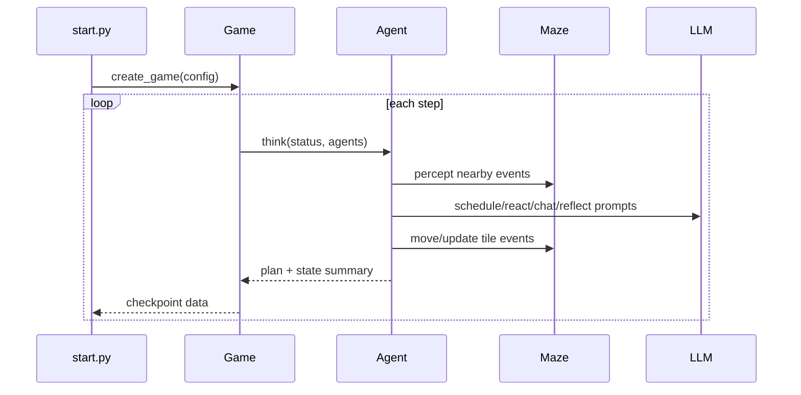
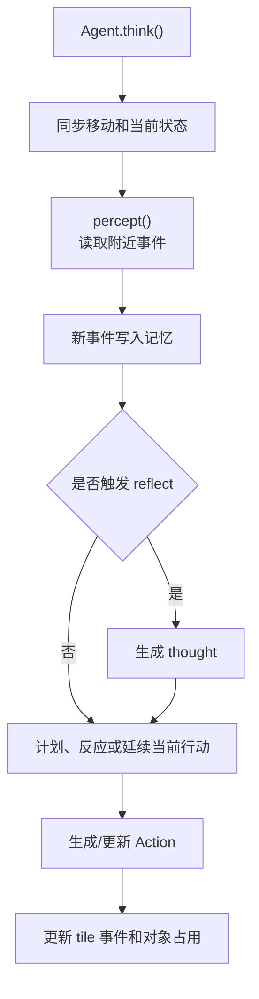

# 第 16 章 仿真循环：start.py、Game 与 Agent.think()

## 16.1 核心问题

前两章讲了世界模型和智能体初始化。现在要把它们跑起来。Generative Agents 的仿真不是“调用一次 agent，得到一次回答”。它是一个时间推进系统。每一步，系统会：

```text
读取当前时间
  -> 让每个 agent 思考
  -> 更新 agent 状态
  -> 写 checkpoint
  -> 保存对话
  -> 推进时间
```

这就是仿真循环。本章聚焦八个问题：

1. `start.py` 如何解析命令行并创建仿真？
2. 全局时间如何设置和推进？
3. `SimulateServer.simulate()` 每一步做什么？
4. `Game.agent_think()` 如何包装 agent 思考结果？
5. `Agent.think()` 内部执行顺序是什么？
6. agent 的移动、睡眠、感知、计划、反思如何串起来？
7. checkpoint 和 conversation 如何保存？
8. 这个仿真循环有哪些工程边界？



*图 16-1：Generative Agents 仿真主循环。一次仿真由时间推进、逐个智能体思考、状态保存和结果回放共同组成。*

## 16.2 运行入口：start.py

运行虚拟小镇的入口是：

```text
generative_agents/start.py
```

README 中的典型命令是：

```bash
cd generative_agents
python start.py --name sim-test --start "20250213-09:30" --step 10 --stride 10
```

几个参数决定仿真如何启动和推进。`--name` 是仿真名称。它决定 checkpoint 和 compressed results 的目录名。`--start` 是仿真起始时间。例如：

```text
20250213-09:30
```

`--step` 是要推进多少个仿真 step。`--stride` 是每个 step 对应多少分钟。例如 `stride=10`，时间会按：

```text
09:30 -> 09:40 -> 09:50 -> ...
```

推进。还有两个适合本地实验的参数：

```text
--agent-count
--agents
```

前者限制 agent 数量。后者指定逗号分隔的角色名。这对本书实验很有用。25 个 agent 全量运行成本较高，前期调试可以只运行 2 到 6 个角色。

## 16.3 start.py 的角色名单

`start.py` 中有一个 `personas` 列表。它列出了默认可运行的 25 个角色：

```text
阿伊莎、克劳斯、玛丽亚、沃尔夫冈、梅、约翰、埃迪、
简、汤姆、卡门、塔玛拉、亚瑟、伊莎贝拉、山姆、詹妮弗、
弗朗西斯科、海莉、拉吉夫、拉托亚、阿比盖尔、卡洛斯、
乔治、瑞恩、山本百合子、亚当
```

命令行指定 `--agents` 时，代码会检查角色名是否在这个列表中：

```python
unknown_agents = [a for a in selected_personas if a not in personas]
if unknown_agents:
    raise ValueError("Unknown agents: " + ", ".join(unknown_agents))
```

这避免因为拼错角色名导致找不到 `agent.json`。读者做实验时要注意，角色名是中文。例如：

```bash
python start.py --name party-small --agents "伊莎贝拉,阿伊莎,克劳斯,玛丽亚"
```

## 16.4 新仿真与断点恢复

`start.py` 支持两种模式。第一，新仿真。如果不加 `--resume`，系统会要求 `--name` 对应目录不存在。否则会要求换一个名字，避免覆盖旧结果。第二，断点恢复。如果加 `--resume`，系统会要求 checkpoint 目录存在。然后调用：

```python
get_config_from_log(checkpoints_folder)
```

读取最后一个 checkpoint。新仿真使用：

```python
get_config(start_time, args.stride, selected_personas)
```

恢复仿真使用 checkpoint 中的 config，并从上次 step 继续。这两条路径最终都会进入：

```python
server = SimulateServer(...)
server.simulate(args.step, args.stride)
```

这说明新运行和恢复运行共用同一个仿真循环。

## 16.5 全局 Timer

Generative Agents 使用全局 Timer 管理仿真时间。Timer 位于：

```text
generative_agents/modules/utils/timer.py
```

创建游戏时，`create_game()` 会设置 Timer：

```python
utils.set_timer(**config.get("time", {}))
```

`Timer` 保存一个 `_offset`。如果传入 start，就从 start 开始。如果没有传入，就用当前真实时间。推进时间使用：

```python
timer.forward(stride)
```

获取时间时使用下面方法：

```python
utils.get_timer().get_date()
```

所有模块共用这个 Timer。日程判断、action 开始结束、checkpoint 文件名、对话时间、反思日期都依赖它。这保证整个仿真中“现在几点”是一致的。

## 16.6 时间格式与日程

Timer 提供几个重要方法。`daily_duration()` 返回当天已经过去的分钟数。例如 09:30 是：

```text
9 * 60 + 30 = 570
```

`daily_time(duration)` 把分钟数转回当天具体时间。日程系统大量使用这两个函数。例如 `Schedule.current_plan()` 会用当前 `daily_duration()` 找正在执行的 plan。`Action` 的 start 和 end 则是 datetime。这说明项目中有两类时间表示：

```text
datetime：绝对时间，用于日志、checkpoint、action start/end。
minute-of-day：当天分钟数，用于 schedule plan。
```

读源码时要分清这两种时间表示。

## 16.7 SimulateServer 的初始化

`SimulateServer.__init__()` 做几件重要事情。第一，保存仿真名称和路径：

```python
self.name = name
self.static_root = static_root
self.checkpoints_folder = checkpoints_folder
```

第二，创建 checkpoint 目录：

```python
os.makedirs(checkpoints_folder, exist_ok=True)
```

第三，读取历史 conversation。如果 `conversation.json` 已存在，就加载它。否则使用空 dict。第四，创建 logger。如果指定 `--log`，写文件日志。否则输出到终端。第五，创建 Game：

```python
game = create_game(name, static_root, config, conversation, logger=self.logger)
game.reset_game()
self.game = get_game()
```

`reset_game()` 会为每个 agent 创建模型连接。第六，初始化 `agent_status`。它保存每个 agent 当前坐标和 path。这些状态会在每一步传给 agent。

## 16.8 agent_status 的作用

`agent_status` 是仿真循环和 agent 内部状态之间的桥。初始化时：

```python
self.agent_status[agent_name] = {
    "coord": agent_config["coord"],
    "path": [],
}
```

每一步模拟时，传给：

```python
plan = self.game.agent_think(name, status)["plan"]
```

agent 会根据 status 同步自己的移动状态：

```python
events = self.move(status["coord"], status.get("path"))
```

然后返回新的 path。`SimulateServer.simulate()` 再更新 status：

```python
if plan.get("path"):
    status["coord"], status["path"] = plan["path"][-1], []
```

这里有一个简化：如果 agent 返回 path，server 直接把坐标更新到 path 的最后一个点。后端仿真 step 粒度不是每个 tile 移动一步，而是每个 step 计算一个目标路径，状态更新到路径终点。前端回放可以用 path 表现移动过程。

## 16.9 SimulateServer.simulate()

核心仿真循环可以这样概括：

```python
for i in range(self.start_step, self.start_step + step):
    for name, status in self.agent_status.items():
        plan = self.game.agent_think(name, status)["plan"]
        agent = self.game.get_agent(name)
        self.config["agents"][name].update(agent.to_dict())
        ...
    write checkpoint
    write conversation
    timer.forward(stride)
```

每个 step 对所有 agent 依次调用 `agent_think()`。调用顺序是 `agent_status` 字典顺序。在 Python 当前版本中，字典保持插入顺序，因此顺序通常与 `personas` 或指定 `--agents` 顺序一致。这意味着同一个 step 中，前面 agent 的行为可能先更新世界，后面 agent 感知时可能看到更新后的事件。这是一个顺序仿真，而不是所有 agent 完全同时决策。这个细节很重要。如果要做严格同步仿真，需要把感知、决策、更新拆成多个阶段。当前实现更简单，也更容易理解和回放。

## 16.10 Game.agent_think()

`Game.agent_think()` 是 game 层对 agent 思考的包装。它做三件事。第一，调用 agent：

```python
plan = agent.think(status, self.agents)
```

第二，整理 info：

```python
info = {
    "currently": agent.scratch.currently,
    "associate": agent.associate.abstract(),
    "concepts": ...,
    "chats": ...,
    "action": agent.action.abstract(),
    "schedule": agent.schedule.abstract(),
    "address": agent.get_tile().get_address(as_list=False),
}
```

第三，记录日志并返回：

```python
return {"plan": plan, "info": info}
```

从架构上看，`Game` 不替 agent 做决策。它只是提供世界、agent 集合、日志和摘要。真正的行为逻辑在 `Agent.think()`。

## 16.11 Agent.think() 总览

`Agent.think()` 是单个 agent 每一步的主函数。核心流程如下：

```text
move(status.coord, status.path)
  -> make_schedule()
  -> 如果当前计划是睡觉且还醒着：进入睡眠 action
  -> 如果醒着：
       percept()
       make_plan()
       reflect()
     否则：
       如果睡眠 action 结束，确定新 action
  -> 整理 emoji
  -> find_path()
  -> 返回 plan
```

这条链路说明 agent 每一步不是只生成 action。它先同步移动状态，再确保日程存在，再处理睡眠，然后感知、计划、反思，最后返回前端需要的 path 和 emoji。



*图 16-2：Agent.think() 执行顺序。一次思考不是一次 LLM 调用，而是感知、记忆、反思、计划和世界状态更新的组合。*

## 16.12 第一步：同步移动状态

`Agent.think()` 开头：

```python
events = self.move(status["coord"], status.get("path"))
```

这一步把 server 维护的坐标同步给 agent。`move()` 会：

- 如果离开旧 tile，移除旧 tile 上该 agent 的事件。
- 恢复旧对象事件。
- 如果不是沿 path 移动，则更新新 tile 上的 agent event。
- 更新对象事件。
- 设置 `self.coord` 和 `self.path`。

返回的 `events` 是移动前后受到影响的 tile events。这些 events 后面会进入 emojis，用于前端显示对象或状态变化。这个设计说明，移动不是单纯改坐标。移动会改变世界事件。

## 16.13 第二步：生成或读取日程

接下来执行下面步骤：

```python
plan, _ = self.make_schedule()
```

`make_schedule()` 会确保当天有 schedule。如果还没有日程，就生成：

- currently 更新。
- wake up。
- init schedule。
- daily schedule。
- schedule thought。

如果已有日程，则直接取当前 plan。同时，如果当前 plan 还没有 decompose，会拆解。因此，`Agent.think()` 每一步都可以假设当前有可用计划。这让后续睡眠、行动和反应都有依据。

## 16.14 第三步：处理睡眠

`Agent.think()` 中有睡眠判断：

```python
if (plan["describe"] == "sleeping" or "睡" in plan["describe"]) and self.is_awake():
```

如果当前计划是睡眠，并且 agent 还醒着，就进入睡觉 action。它会：

1. 根据空间记忆找到睡觉地址。
2. 从对应 tiles 中选择一个可用坐标。
3. 将角色移动到该睡眠坐标。
4. 设置 sleep action 和对象占用事件。

sleep action 包含角色事件：

```text
角色 正在 睡觉
```

以及对应的对象事件：

```text
床 被占用 角色
```

对应的 emoji 表示如下：

```text
😴
🛌
```

这说明睡觉不是一个普通文本 plan，而是会被落到床和对象占用上。

## 16.15 第四步：醒着时的三件事

如果 agent 醒着：

```python
if self.is_awake():
    self.percept()
    self.make_plan(agents)
    self.reflect()
```

执行顺序可以这样理解：

1. 先感知当前环境中的事件。
2. 再根据感知结果制定计划或作出反应。
3. 最后检查是否需要触发反思。

这个顺序很合理。先感知当前环境，才能对新事件作出反应。先做计划或反应，再做反思，意味着刚刚感知到的新事件可以累积 poignancy，并可能触发 reflection。注意，反思不是每步都真正执行。`reflect()` 内部会检查 poignancy 阈值。

## 16.16 第五步：睡着时的处理

如果 agent 不醒着：

```python
else:
    if self.action.finished():
        self.action = self._determine_action()
```

睡着时不会感知、不会聊天、不会反思。如果当前睡眠 action 结束，才确定新 action。这避免角色睡觉时继续感知和社交。但也说明当前睡眠逻辑比较简单。它依赖 schedule 和 action duration 判断，不模拟梦境、被叫醒或夜间事件。对当前项目来说，这已经足够支撑日常作息。

## 16.17 第六步：整理 emojis

`Agent.think()` 会整理 emojis：

```python
emojis = {}
if self.action:
    emojis[self.name] = {"emoji": self.get_event().emoji, "coord": self.coord}
for eve, coord in events.items():
    if eve.subject in agents:
        continue
    emojis[":".join(eve.address)] = {"emoji": eve.emoji, "coord": coord}
```

角色自己的 emoji 来自当前 action。对象 emoji 来自移动过程中受影响的 events。这些数据会进入前端回放。`Action` 和 `Event` 中的 emoji 字段服务于可视化。它不影响推理核心，但影响可视化。

## 16.18 第七步：寻找路径并返回 plan

最后执行下面步骤，可以按顺序阅读：

```python
self.plan = {
    "name": self.name,
    "path": self.find_path(agents),
    "emojis": emojis,
}
return self.plan
```

`find_path()` 会根据当前 action 的地址决定下一步路径。如果已经在目标地址，返回空列表。如果 action address 是 `<waiting>` 或 `<persona>` 等特殊地址，会特殊处理。否则通过 `Maze.get_address_tiles()` 和 `Maze.find_path()` 找到目标路径。返回的 `plan` 是给 server 和前端用的。它不是 agent 的内部 schedule。这一点要分清：

```text
Schedule plan：角色一天要做什么。
Agent.plan：当前 step 返回给仿真/回放的移动与 emoji 信息。
```

## 16.19 make_plan()：反应优先于新 action

`make_plan()` 很短：

```python
def make_plan(self, agents):
    if self._reaction(agents):
        return
    if self.path:
        return
    if self.action.finished():
        self.action = self._determine_action()
```

这三行体现了行为优先级。第一，先 reaction。如果遇到别人并决定聊天或等待，当前 step 行为被 reaction 接管。第二，如果还在 path 上，就继续移动。不频繁重新决定 action。第三，如果当前 action 结束，才根据 schedule 确定新 action。这让行为不会抖动。角色不是每个 step 都重新问模型“我现在干什么”，而是保持 action 直到结束或被合理打断。

## 16.20 checkpoint 写入

每个 step 结束后，`SimulateServer.simulate()` 会保存 config。文件名是：

```python
simulate-{sim_time.replace(':', '')}.json
```

对应的调用路径如下：

```text
results/checkpoints/<name>/simulate-<time>.json
```

保存前，server 会把每个 agent 状态写回 config：

```python
self.config["agents"][name].update(agent.to_dict())
self.config["agents"][name].update({"coord": status["coord"]})
```

`agent.to_dict()` 保存：

- status。
- schedule。
- associate。
- chats。
- currently。
- action。

同时，associate index 会持久化到底层 storage。这就是断点恢复的基础。

## 16.21 conversation 写入

同一步还会保存下面内容：

```python
conversation.json
```

对应的调用路径如下：

```text
results/checkpoints/<name>/conversation.json
```

对话在 `_chat_with()` 中写入：

```python
self.conversation[key].append({ ... : chats})
```

然后 server 每 step 把全局 conversation 写盘。这使对话不会只存在于 agent memory 里。它也可以被 `compress.py` 用来生成 `simulation.md`。

## 16.22 时间推进位置

时间推进发生在每个 step 最后：

```python
if stride > 0:
    timer.forward(stride)
```

这意味着同一个 step 内，所有 agent 使用同一个当前时间。等全部 agent 思考完，时间才进入下一 step。这是合理的。但要注意，由于 agent 是按顺序思考，同一步内前面 agent 更新的世界状态，后面 agent 可以看到。所以它不是完全同步决策。更准确地说，当前实现是：

```text
同一时间戳下的顺序更新仿真
```

这对大多数教学实验没问题，但如果研究严格同步多智能体行为，需要改造。

## 16.23 record_iterval 与记录点

`Game` 中有：

```python
self.record_iterval = config.get("record_iterval", 30)
```

`Game.agent_think()` 会判断是否超过记录间隔：

```python
if (utils.get_timer().daily_duration() - agent.last_record) > self.record_iterval:
    info["record"] = True
    agent.last_record = utils.get_timer().daily_duration()
else:
    info["record"] = False
```

这个字段主要影响输出记录和回放摘要。注意拼写是 `record_iterval`，不是 `record_interval`。这是源码中的实际字段。写书引用时要按源码写，不要擅自改正。

## 16.24 仿真循环的工程边界

当前仿真循环有几个边界。第一，agent 顺序执行。这简化实现，但不是严格同步。第二，step 粒度较粗。server 会把坐标更新到 path 最后一个点，而不是每个 tile 一步计算一次认知。第三，模型调用是阻塞的。每个 agent 的 LLM 调用会按顺序等待完成。25 个 agent 时运行较慢。第四，checkpoint 每步写完整 config。这有利于恢复和审计，但会产生较多文件。第五，conversation 是全局共享结构。这方便记录，但后续如果并行化 agent，需要考虑并发写入问题。第六，错误恢复以 failsafe 为主。某些模型输出失败后会使用 failsafe，让仿真继续，但也可能隐藏行为质量问题。这些边界不是问题本身，而是后续优化方向。

## 16.25 如何调试仿真循环

调试仿真循环时，建议按下面顺序。第一，用少量 agent。例如：

```bash
python start.py --name debug-loop --start "20250213-09:30" --step 3 --stride 10 --agents "克劳斯,玛丽亚"
```

第二，打开 debug 日志。默认 verbose 是 debug。可以观察：

- 每个 step 时间。
- 每个 agent 的 prompt 调用。
- 感知数量。
- action summary。
- schedule summary。

第三，检查 checkpoint。看每个 step 的 JSON 是否写入。第四，检查 conversation。如果期望有对话，确认是否写入。第五，运行 compress。

```bash
python compress.py --name debug-loop
```

第六，看 `simulation.md`。如果前面都正常，压缩结果应该能读出时间线。这条调试链路比直接盯前端更可靠。

## 16.26 本章小结

仿真循环把所有模块串起来。一次 step 可以串起命令行启动、Game 推进时间、Agent 思考和结果保存。

| 本章内容 | 核心结论 |
| --- | --- |
| 运行入口 | `start.py` 解析 name、start、step、stride、agents 等参数。 |
| 配置模式 | 新仿真用 `get_config()`，断点恢复用 `get_config_from_log()`。 |
| Game 创建 | `create_game()` 设置全局 Timer 并创建 Game。 |
| SimulateServer | 它维护 checkpoint、conversation、agent_status 和 Game。 |
| step 推进 | `simulate()` 每一步依次调用所有 agent 的 `Game.agent_think()`。 |
| 思考入口 | `Game.agent_think()` 调用 `Agent.think()` 并整理 summary。 |
| think 顺序 | 移动同步、日程、睡眠、感知、计划/反应、反思、寻路共同组成一次思考。 |
| reaction 优先级 | `make_plan()` 中 reaction 优先于继续移动和新 action。 |
| 状态保存 | 每步结束保存 checkpoint 和 conversation，时间再按 stride 推进。 |
| 实现边界 | 当前是同一时间戳下的顺序更新仿真，不是严格同步并行仿真。 |

下一章讲感知：深入 `Agent.percept()`，看智能体如何从周围 tile 中看到事件、去重、写入记忆，并为 reaction 和 reflection 提供输入。

## 参考资料

- Local source: `generative_agents/start.py`
- Local source: `generative_agents/modules/game.py`
- Local source: `generative_agents/modules/agent.py`
- Local source: `generative_agents/modules/utils/timer.py`
- Local source: `generative_agents/modules/memory/action.py`
