# 第 16 章 仿真循环：入口脚本 start.py、游戏容器 Game 与智能体思考函数 Agent.think()

## 16.1 仿真循环解决什么

世界地图 Maze 让角色有地方可去，角色初始化让智能体 Agent 有身份和状态。仿真循环把这两件事放进时间里：同一个当前时间下，系统按顺序让每个智能体 Agent 思考、更新世界、保存状态，然后推进到下一个时间点。

| 没有仿真循环 | 有了仿真循环 |
| --- | --- |
| 智能体 Agent 只是一次提示词 prompt 调用 | 智能体 Agent 在连续时间中行动、移动、睡眠、感知和反思 |
| 坐标只是 `agent.json` 里的初始值 | 坐标会随着移动路径 `path` 和行动结果持续更新 |
| 行动只存在于内存对象里 | 每个仿真步 step 都写入断点 checkpoint，可恢复、可压缩、可回放 |
| 多角色只是一个列表 | 多角色按顺序进入同一个世界状态中更新 |
| 日程、感知、反应、路径分散在不同类里 | 智能体思考函数 `Agent.think()` 把它们串成一次仿真步 step 的行为结果 |

源码链路可以从四层读：

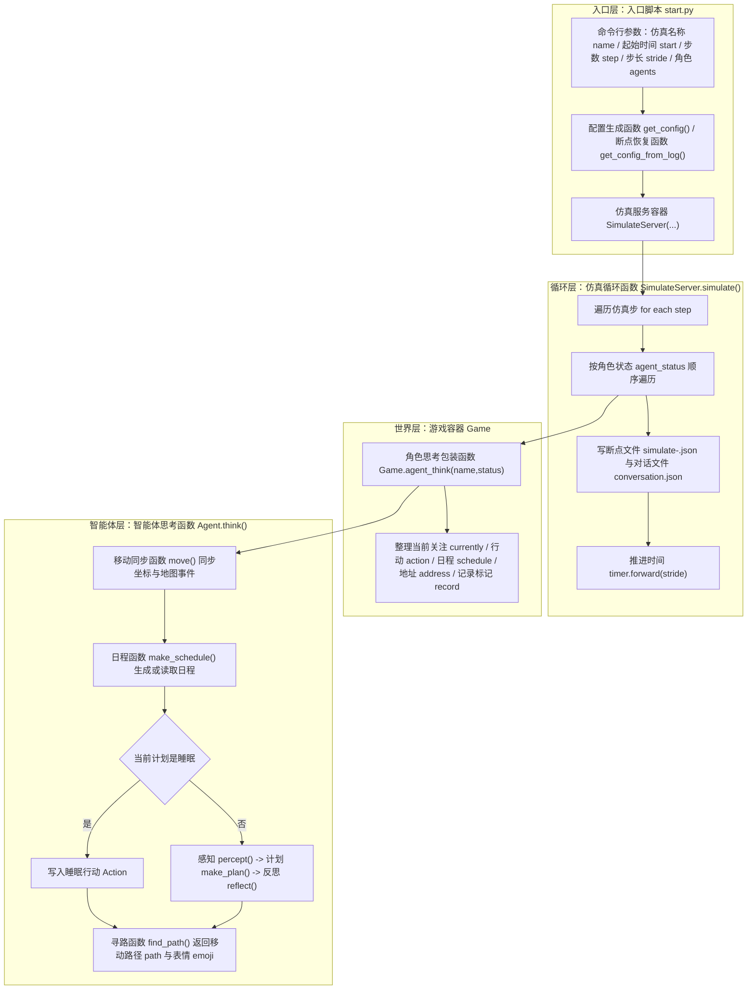

*图 16-1：第 16 章的仿真循环代码链路。入口层决定运行哪批角色，循环层按仿真步 step 推进，世界层包装每个智能体 Agent 的结果，智能体层真正执行移动、日程、感知、计划、反思和寻路。*

仿真循环层关注调用时机和结果流向；日程生成、感知、反应、对话和反思的提示词 prompt，会在对应机制进入时继续拆开。

## 16.2 入口命令与配置骨架

运行入口仍然是项目根目录下的：

```text
generative_agents/start.py
```

典型命令如下：

```bash
cd generative_agents
python start.py --name debug-loop --start "20240213-09:30" --step 3 --stride 10 --agents "克劳斯,玛丽亚" --verbose info --log debug-loop.log
```

| 参数 | 进入代码后的含义 | 下游影响 |
| --- | --- | --- |
| `--name debug-loop` | 仿真名称 | 决定 `results/checkpoints/debug-loop/` 目录 |
| `--start "20240213-09:30"` | 起始仿真时间 | 进入时间配置 `config["time"]["start"]`，再进入全局计时器 Timer |
| `--step 3` | 推进 3 个仿真步 step | 仿真循环函数 `SimulateServer.simulate(step=3)` 的循环次数 |
| `--stride 10` | 每个仿真步 step 推进 10 分钟 | 每步结束后执行时间推进函数 `timer.forward(10)` |
| `--agents "克劳斯,玛丽亚"` | 只运行两个角色 | `config["agents"]` 只生成这两个角色的配置入口 |
| `--log debug-loop.log` | 写文件日志 | 日志保存到断点 checkpoint 目录下 |

新仿真的配置由配置生成函数 `get_config()` 创建：

```python
def get_config(start_time="20240213-09:30", stride=15, agents=None):
    with open("data/config.json", "r", encoding="utf-8") as f:
        json_data = json.load(f)
        agent_config = json_data["agent"]

    assets_root = os.path.join("assets", "village")
    config = {
        "stride": stride,
        "time": {"start": start_time},
        "maze": {"path": os.path.join(assets_root, "maze.json")},
        "agent_base": agent_config,
        "agents": {},
    }
    for a in agents:
        config["agents"][a] = {
            "config_path": os.path.join(
                assets_root, "agents", a.replace(" ", "_"), "agent.json"
            ),
        }
    return config
```

这段代码把命令行参数变成运行时配置：

| 配置 config 字段 | 来自哪里 | 含义 | 进入哪里 |
| --- | --- | --- | --- |
| `stride` | `--stride` | 每步推进多少分钟 | `SimulateServer.simulate()` 末尾 |
| `time.start` | `--start` | 仿真起始时间 | 游戏创建函数 `create_game()` 设置全局计时器 Timer |
| `maze.path` | 固定为 `assets/village/maze.json` | 小镇世界地图 | 游戏容器构造函数 `Game.__init__()` 构造世界地图 Maze |
| `agent_base` | `data/config.json` 的 `agent` | 所有角色共用运行参数 | 游戏容器构造函数 `Game.__init__()` 与角色配置合并 |
| `agents.<name>.config_path` | `--agents` 或默认角色列表 | 角色种子文件路径 | 智能体构造函数 `Agent.__init__()` 的配置来源 |

配置里还没有真正的智能体 Agent 对象。它只是告诉游戏容器 Game：地图在哪里，公共运行参数是什么，哪些角色要从哪些 `agent.json` 加载。

## 16.3 角色集合决定循环顺序

入口脚本 `start.py` 用角色列表 `personas` 定义默认角色集合。第 15 章已经完整展开 25 个角色，这里只看它在循环里的作用：

```python
if args.agents:
    selected_personas = [a.strip() for a in args.agents.split(",") if a.strip()]
    unknown_agents = [a for a in selected_personas if a not in personas]
    if unknown_agents:
        raise ValueError("Unknown agents: " + ", ".join(unknown_agents))
elif args.agent_count > 0:
    selected_personas = personas[:args.agent_count]
```

角色参数 `--agents` 手动指定角色时，顺序来自命令行字符串。角色数量参数 `--agent-count` 截取角色时，顺序来自角色列表 `personas`。这个顺序会继续进入角色配置 `config["agents"]`，再进入仿真服务的角色状态 `SimulateServer.agent_status`，最后影响同一个仿真步 step 内哪个角色先思考。

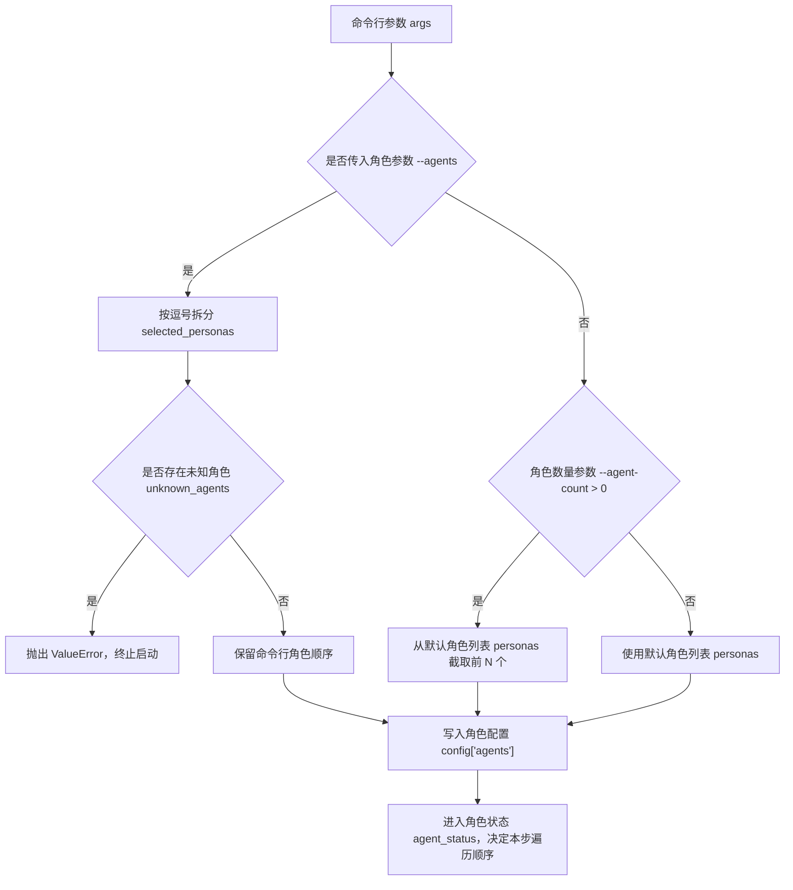

*图 16-2：角色集合选择分支。手动角色参数 `--agents`、角色数量参数 `--agent-count` 和默认角色列表 `personas` 会走不同路径，但最终都会汇入角色配置 `config["agents"]`。*

这不是小细节。当前项目是同一时间戳下的顺序更新仿真：克劳斯先行动，玛丽亚后行动；如果克劳斯的行动改变了地图事件，玛丽亚在同一个时间点内可能感知到更新后的世界。

## 16.4 新仿真与断点恢复

入口层只有两条路：新仿真和断点恢复。

```python
if resume:
    sim_config = get_config_from_log(checkpoints_folder)
    if sim_config is None:
        print("No checkpoint file found to resume running.")
        exit(0)
    start_step = sim_config["step"]
else:
    sim_config = get_config(start_time, args.stride, selected_personas)
    start_step = 0

server = SimulateServer(name, static_root, checkpoints_folder, sim_config, start_step, args.verbose, args.log)
server.simulate(args.step, args.stride)
```

断点恢复读取最后一个断点 checkpoint：

```python
json_files = list()
for file_name in files:
    if file_name.endswith(".json") and file_name != "conversation.json":
        json_files.append(os.path.join(checkpoints_folder, file_name))

with open(json_files[-1], "r", encoding="utf-8") as f:
    config = json.load(f)

start_time = datetime.datetime.strptime(config["time"], "%Y%m%d-%H:%M")
start_time += datetime.timedelta(minutes=config["stride"])
config["time"] = {"start": start_time.strftime("%Y%m%d-%H:%M")}
```

恢复运行不是回到旧仿真步 step 重跑，而是读取上一个断点 checkpoint，然后把新起点设成“上一个断点 checkpoint 时间 + 步长 stride”。角色状态 `status`、日程 `schedule`、关联记忆 `associate`、当前关注 `currently` 和行动 `action` 已经写在断点 checkpoint 里，后续会覆盖初始 `agent.json`。

| 模式 | 配置来源 | `start_step` | 时间来源 | 角色状态 |
| --- | --- | --- | --- | --- |
| 新仿真 | 配置生成函数 `get_config(start, stride, agents)` | `0` | 命令行 `--start` | 初始 `agent.json` |
| 断点恢复 | 断点恢复函数 `get_config_from_log(checkpoints_folder)` | 断点 checkpoint 的 `step` | 最后断点 checkpoint 时间 + 步长 `stride` | 断点 checkpoint 中保存的状态 |

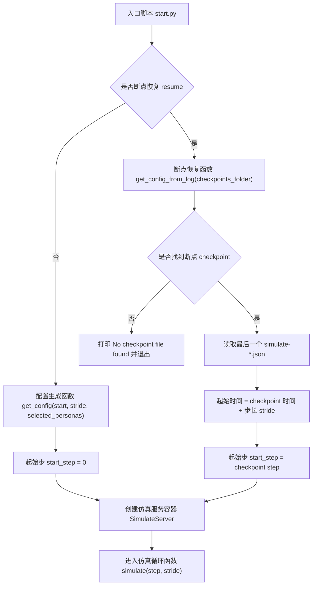

*图 16-3：新仿真与断点恢复分支。新仿真从角色配置文件 `agent.json` 出发，断点恢复从最近的 `simulate-*.json` 出发，但两条路径都会进入同一个仿真循环函数 `SimulateServer.simulate()`。*

这两条路径最终都会进入同一个仿真循环函数 `SimulateServer.simulate()`。循环层不关心角色是新建的，还是从断点恢复的。

## 16.5 全局计时器 Timer：同一个仿真步 step 的共同时间

全局时间由 `generative_agents/modules/utils/timer.py` 管理。游戏容器 Game 创建时设置全局计时器 Timer：

```python
def create_game(name, static_root, config, conversation, logger=None):
    utils.set_timer(**config.get("time", {}))
    GenerativeAgentsMap.set(
        GenerativeAgentsKey.GAME,
        Game(name, static_root, config, conversation, logger=logger),
    )
    return GenerativeAgentsMap.get(GenerativeAgentsKey.GAME)
```

全局计时器 Timer 本身很小：

```python
class Timer:
    def __init__(self, start=None):
        self._mode = "on_time"
        if start:
            d_format = "%Y%m%d-%H:%M" if "-" in start else "%H:%M"
            self._offset = to_date(start, d_format)
        else:
            self._offset = datetime.datetime.now()

    def forward(self, offset):
        self._offset += datetime.timedelta(minutes=offset)

    def daily_duration(self, mode="minute"):
        return daily_duration(self.get_date(), mode)

    def daily_time(self, duration):
        base = self.get_date().replace(hour=0, minute=0, second=0, microsecond=0)
        return base + datetime.timedelta(minutes=duration)
```

项目里同时使用两类时间：

| 时间形式 | 示例 | 使用位置 |
| --- | --- | --- |
| 绝对时间 `datetime` | `2024-02-13 09:30:00` | 断点 checkpoint 文件名、行动 Action 开始结束、日志、对话时间 |
| 当天分钟数 `minute-of-day` | `570` | 日程 Schedule 查找当前计划 plan、日程分解、记录间隔判断 |

09:30 对应的当天分钟数是：

```text
9 * 60 + 30 = 570
```

日程当前计划函数 `Schedule.current_plan()` 用当天分钟数判断现在落在哪个计划段；行动结束判断函数 `Action.finished()` 用绝对时间判断行动是否结束。两种时间都来自同一个全局计时器 Timer，所以同一个仿真步 step 内所有角色看到的“当前时间”一致。

## 16.6 仿真服务容器 SimulateServer 初始化了什么

仿真服务构造函数 `SimulateServer.__init__()` 是循环层的容器。它不直接决定角色行为，但它持有仿真名称、断点 checkpoint 目录、对话记录 conversation、游戏容器 Game 和角色状态 `agent_status`：

```python
class SimulateServer:
    def __init__(self, name, static_root, checkpoints_folder, config, start_step=0, verbose="info", log_file=""):
        self.name = name
        self.static_root = static_root
        self.checkpoints_folder = checkpoints_folder
        self.config = config

        os.makedirs(checkpoints_folder, exist_ok=True)

        self.conversation_log = f"{checkpoints_folder}/conversation.json"
        if os.path.exists(self.conversation_log):
            with open(self.conversation_log, "r", encoding="utf-8") as f:
                conversation = json.load(f)
        else:
            conversation = {}

        game = create_game(name, static_root, config, conversation, logger=self.logger)
        game.reset_game()
        self.game = get_game()
```

初始化后，它还会构造角色状态 `agent_status`：

```python
for agent_name, agent in config["agents"].items():
    agent_config = copy.deepcopy(agent_base)
    agent_config.update(self.load_static(agent["config_path"]))
    self.agent_status[agent_name] = {
        "coord": agent_config["coord"],
        "path": [],
    }
```

角色状态 `agent_status` 是仿真服务 server 维护的外部状态，不等同于智能体坐标 `Agent.coord`。每个仿真步 step 开始时，仿真服务 server 把状态 `status` 传给智能体 Agent；每个智能体 Agent 返回移动路径 `path` 后，仿真服务 server 再更新自己的状态 `status`。这个设计让后端循环和前端回放共享同一套移动结果。

代码逻辑图：

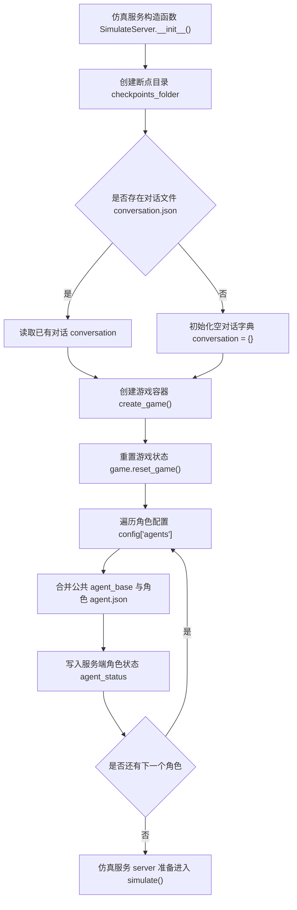

这张图说明初始化阶段做了两类准备。第一类是全局准备：断点目录、对话文件 conversation 和游戏容器 Game。第二类是角色准备：逐个加载角色配置，建立仿真服务 server 自己维护的 `agent_status`。循环开始后，`agent_status` 才会成为每个角色的输入状态 status。

## 16.7 仿真循环函数 SimulateServer.simulate() 的真实循环

核心循环在仿真循环函数 `simulate()`：

```python
def simulate(self, step, stride=0):
    timer = utils.get_timer()
    for i in range(self.start_step, self.start_step + step):
        title = "Simulate Step[{}/{}, time: {}]".format(
            i+1, self.start_step + step, timer.get_date()
        )
        self.logger.info("\n" + utils.split_line(title, "="))
        for name, status in self.agent_status.items():
            plan = self.game.agent_think(name, status)["plan"]
            agent = self.game.get_agent(name)
            if name not in self.config["agents"]:
                self.config["agents"][name] = {}
            self.config["agents"][name].update(agent.to_dict())
            if plan.get("path"):
                status["coord"], status["path"] = plan["path"][-1], []
            self.config["agents"][name].update({"coord": status["coord"]})

        sim_time = timer.get_date("%Y%m%d-%H:%M")
        self.config.update({"time": sim_time, "step": i + 1})
        with open(f"{self.checkpoints_folder}/simulate-{sim_time.replace(':', '')}.json", "w", encoding="utf-8") as f:
            f.write(json.dumps(self.config, indent=2, ensure_ascii=False))
        with open(f"{self.checkpoints_folder}/conversation.json", "w", encoding="utf-8") as f:
            f.write(json.dumps(self.game.conversation, indent=2, ensure_ascii=False))

        if stride > 0:
            timer.forward(stride)
```

按执行顺序看，仿真循环函数 `simulate()` 做了六件事：

| 顺序 | 代码 | 行为含义 |
| --- | --- | --- |
| 1 | `timer = utils.get_timer()` | 取全局计时器 Timer，本仿真步 step 内共用这一时间 |
| 2 | `for name, status in self.agent_status.items()` | 按角色顺序逐个思考 |
| 3 | `self.game.agent_think(name, status)` | 进入游戏容器 Game，再进入智能体思考函数 `Agent.think()` |
| 4 | `agent.to_dict()` | 把智能体 Agent 内部状态写回配置 config |
| 5 | `status["coord"] = plan["path"][-1]` | 如果返回移动路径 path，仿真服务 server 坐标直接更新到路径终点 |
| 6 | 写 `simulate-<time>.json` 与 `conversation.json` | 保存断点和对话，供恢复、压缩、回放使用 |

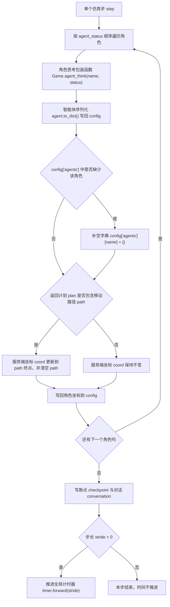

*图 16-4：仿真循环函数 `SimulateServer.simulate()` 的分支写回。真正影响状态的是两个判断：是否返回移动路径 `path`，以及本步结束后步长 `stride` 是否推进时间。*

这里的移动粒度要说清楚：后端每个仿真步 step 不是一格一格移动，而是让智能体寻路函数 `Agent.find_path()` 返回一条移动路径 path；仿真服务 server 把坐标更新到路径终点；前端回放再用这条移动路径 `path` 表现移动过程。

## 16.8 角色思考包装函数 Game.agent_think() 包装了什么

角色思考包装函数 `Game.agent_think()` 不替智能体 Agent 决策。它负责调用智能体 Agent，并把结果整理成日志、摘要和回放可读的信息：

```python
def agent_think(self, name, status):
    agent = self.get_agent(name)
    plan = agent.think(status, self.agents)
    info = {
        "currently": agent.scratch.currently,
        "associate": agent.associate.abstract(),
        "concepts": {c.node_id: c.abstract() for c in agent.concepts},
        "chats": [
            {"name": "self" if n == agent.name else n, "chat": c}
            for n, c in agent.chats
        ],
        "action": agent.action.abstract(),
        "schedule": agent.schedule.abstract(),
        "address": agent.get_tile().get_address(as_list=False),
    }
    if (utils.get_timer().daily_duration() - agent.last_record) > self.record_iterval:
        info["record"] = True
        agent.last_record = utils.get_timer().daily_duration()
    else:
        info["record"] = False
    return {"plan": plan, "info": info}
```

| 字段 | 来源 | 作用 |
| --- | --- | --- |
| 返回计划 `plan` | 智能体思考函数 `Agent.think()` 返回 | 给仿真服务 server 更新角色状态 `agent_status`，给前端回放移动路径 `path` 和表情 `emoji` |
| 当前关注 `currently` | `agent.scratch.currently` | 当前关注点摘要 |
| 关联记忆 `associate` | `agent.associate.abstract()` | 关联记忆摘要 |
| 概念 `concepts` | `agent.concepts` | 本仿真步 step 感知到的新事件或聊天概念 |
| 对话 `chats` | `agent.chats` | 本仿真步 step 或近期对话内容 |
| 行动 `action` | `agent.action.abstract()` | 当前行动的事件、对象事件、开始结束时间 |
| 日程 `schedule` | `agent.schedule.abstract()` | 当前日程 |
| 地址 `address` | `agent.get_tile().get_address()` | 当前地图格子对应的语义地址 |
| 记录标记 `record` | 记录间隔字段 `record_iterval` 判断 | 是否到了需要记录摘要的间隔 |

这一层是观察窗口。调试仿真循环时，摘要 `info` 能告诉我们智能体 Agent 现在在哪里、正在做什么、是否记录、是否对话、是否产生新感知。

## 16.9 智能体思考函数 Agent.think() 的真实执行顺序

单个智能体 Agent 的行为主线在智能体思考函数 `Agent.think()`：

```python
def think(self, status, agents):
    events = self.move(status["coord"], status.get("path"))
    plan, _ = self.make_schedule()

    if (plan["describe"] == "sleeping" or "睡" in plan["describe"]) and self.is_awake():
        self.logger.info("{} is going to sleep...".format(self.name))
        address = self.spatial.find_address("睡觉", as_list=True)
        tiles = self.maze.get_address_tiles(address)
        coord = random.choice(list(tiles))
        events = self.move(coord)
        self.action = memory.Action(
            memory.Event(self.name, "正在", "睡觉", address=address, emoji="😴"),
            memory.Event(address[-1], "被占用", self.name, address=address, emoji="🛌"),
            duration=plan["duration"],
            start=utils.get_timer().daily_time(plan["start"]),
        )
    if self.is_awake():
        self.percept()
        self.make_plan(agents)
        self.reflect()
    else:
        if self.action.finished():
            self.action = self._determine_action()

    emojis = {}
    if self.action:
        emojis[self.name] = {"emoji": self.get_event().emoji, "coord": self.coord}
    for eve, coord in events.items():
        if eve.subject in agents:
            continue
        emojis[":".join(eve.address)] = {"emoji": eve.emoji, "coord": coord}
    self.plan = {
        "name": self.name,
        "path": self.find_path(agents),
        "emojis": emojis,
    }
    return self.plan
```

这段代码可以拆成七步：

| 步骤 | 源码动作 | 结果 |
| --- | --- | --- |
| 1 | 移动同步函数 `move(status["coord"], status.get("path"))` | 同步仿真服务 server 坐标，同时更新地图格子 Tile 上的事件 |
| 2 | 日程函数 `make_schedule()` | 没有日程就生成日程，有日程就取当前计划 plan |
| 3 | 判断睡眠计划 | 如果当前计划 plan 是睡觉，写入睡眠行动 Action 和床的对象事件 |
| 4 | 感知函数 `percept()` | 醒着时读取视野范围内的事件，写入本仿真步 step 的概念 concepts |
| 5 | 计划函数 `make_plan(agents)` | 先处理反应 reaction，再判断是否继续移动，再决定新行动 Action |
| 6 | 反思函数 `reflect()` | 累计重要性达到阈值后生成想法 thought |
| 7 | 寻路函数 `find_path(agents)` | 把当前行动 Action 的语义地址落成移动路径 |

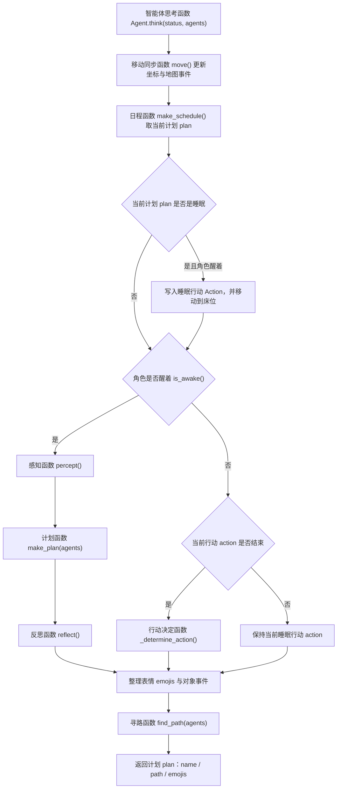

*图 16-5：智能体思考函数 `Agent.think()` 的清醒与睡眠分支。醒着时进入感知、计划和反思；睡着时只在行动结束后重新决定下一步行动。*

计划函数 `make_plan()` 的优先级很短，但很关键：

```python
def make_plan(self, agents):
    if self._reaction(agents):
        return
    if self.path:
        return
    if self.action.finished():
        self.action = self._determine_action()
```

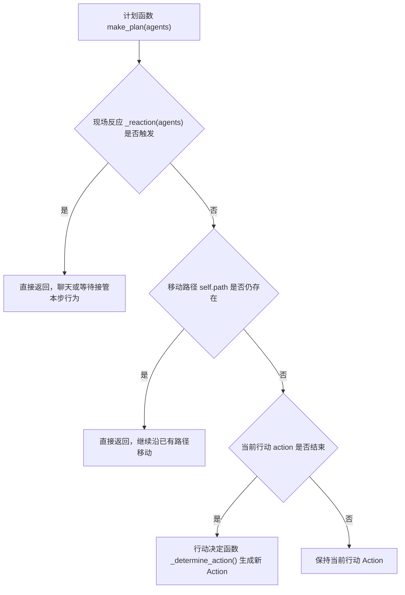

*图 16-6：计划函数 `make_plan()` 的优先级分支。反应 reaction 优先级最高，其次是继续移动，最后才是在行动结束时生成新行动。*

行为不会每个仿真步 step 都重新生成。先处理反应 reaction；如果还在路上，就继续走；只有当前行动 Action 结束时，才根据日程和空间记忆决定新行动 Action。这就是角色行为不抖动的原因。

### 仿真循环里的 prompt 调用边界

仿真循环函数 `SimulateServer.simulate()` 不直接拼提示词 prompt。角色思考包装函数 `Game.agent_think()` 也不直接拼提示词 prompt。真正的提示词 prompt 发生在智能体思考函数 `Agent.think()` 进入各个机制时：

| 触发位置 | 可能调用的提示词 prompt | 本章读法 |
| --- | --- | --- |
| 日程函数 `make_schedule()` | 起床时间 wake_up、日程大纲 schedule_init、小时日程 schedule_daily、日程拆解 schedule_decompose | 第 16 章只看它们被循环触发；第 19 章专门展开日程 prompt。 |
| 感知函数 `percept()` | 重要性评分 poignancy_event / poignancy_chat | 第 16 章只看感知被调度；第 17、18 章展开感知与记忆评分 prompt。 |
| 计划函数 `make_plan()` | 决定聊天 decide_chat、决定等待 decide_wait、对话生成 generate_chat、对话摘要 summarize_chats | 第 16 章只看反应 reaction 的入口；第 20 章展开社交 prompt。 |
| 行动决定函数 `_determine_action()` | 区域选择 determine_sector、场所选择 determine_arena、对象选择 determine_object、物品状态 describe_object | 这是第 16 章需要就地展开的 prompt，因为它直接解释返回路径 path 为什么落到某个地点。 |
| 反思函数 `reflect()` | 反思焦点 reflect_focus、反思洞察 reflect_insights、聊天反思 reflect_chat_planing / reflect_chat_memory | 第 16 章只看反思被循环触发；第 18 章展开反思 prompt。 |

这张表的读法很简单：循环层不生产语义，它只安排调用顺序；智能体层进入日程、感知、反应、行动和反思时，才会调用提示词 prompt。调试时看到日志里的 `克劳斯 -> schedule_daily` 或脚手架里的 `completion_calls`，不要把它理解成 `simulate()` 直接调用模型，而要沿着 `simulate() -> Game.agent_think() -> Agent.think() -> 具体机制` 往下追。

## 16.10 日程计划 Schedule plan、行动 Action 和返回计划 plan

第 16 章里最容易混淆的是三个“计划”：

| 名称 | 所在对象 | 示例 | 用途 |
| --- | --- | --- | --- |
| 日程计划 Schedule plan | `agent.schedule.daily_schedule` | `09:00~10:00 阅读并整理文献综述` | 描述一天中某段时间要做什么 |
| 行动 Action | `agent.action` | `起草论文开头段落 @ the Ville:奥克山学院:图书馆:图书馆桌子` | 当前正在执行的行为，包含地点、对象事件、时间范围 |
| 返回计划 plan | 智能体思考函数 `Agent.think()` 的返回值 | `{"name": ..., "path": ..., "emojis": ...}` | 给仿真服务容器 `SimulateServer` 和前端回放使用 |

行动决定函数 `_determine_action()` 把日程计划 Schedule plan 落成行动 Action：

```python
plan, de_plan = self.schedule.current_plan()
describes = [plan["describe"], de_plan["describe"]]
address = self.spatial.find_address(describes[0], as_list=True)
if not address:
    tile = self.get_tile()
    kwargs = {
        "describes": describes,
        "spatial": self.spatial,
        "address": tile.get_address("world", as_list=True),
    }
    kwargs["address"].append(self.completion("determine_sector", **kwargs, tile=tile))
    arenas = self.spatial.get_leaves(kwargs["address"])
    if len(arenas) == 1:
        kwargs["address"].append(arenas[0])
    else:
        kwargs["address"].append(self.completion("determine_arena", **kwargs))
    objs = self.spatial.get_leaves(kwargs["address"])
    if len(objs) == 1:
        kwargs["address"].append(objs[0])
    elif len(objs) > 1:
        kwargs["address"].append(self.completion("determine_object", **kwargs))
    address = kwargs["address"]
```

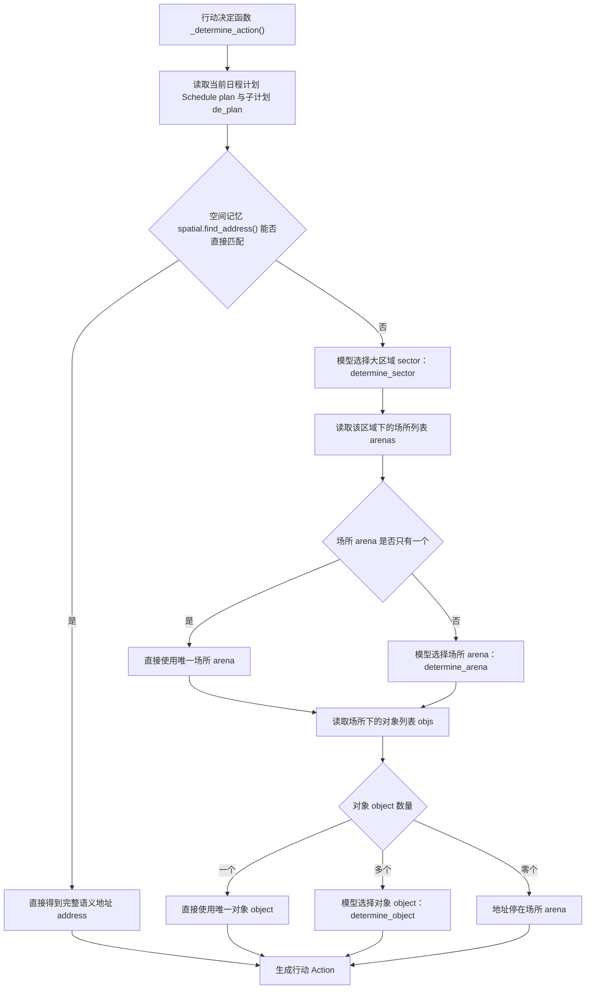

*图 16-7：行动决定函数 `_determine_action()` 的地址解析分支。空间记忆能直接匹配时不调用模型；匹配不到时，才逐层选择大区域 sector、场所 arena 和对象 object。*

如果空间记忆地址 `spatial.address` 能直接匹配，例如“睡觉”，就直接得到床的地址。匹配不到时，模型依次选择大区域 sector、场所 arena 和对象 object。行动 Action 不是一句自由文本，而是被落到了世界模型的语义地址上。

### 空间落地 prompt：循环视角只看状态变化

第 16 章脚手架输出里，克劳斯和玛丽亚都有一组提示词调用 completion calls：

```text
wake_up, schedule_init, schedule_daily, schedule_decompose,
determine_sector, determine_arena, determine_object, describe_object
```

前四个属于日程 Schedule，后四个属于行动落地 Action grounding。日程告诉角色“要做什么”，空间落地 prompt 决定“去哪里做、使用哪个对象、对象呈现什么状态”。完整模板原文已经在 14.17 展开；本节只看它们怎样进入仿真循环的状态闭环。

这四个提示词 prompt 在 `_determine_action()` 中按地址层级依次工作：

| 调用 | 输入 | 输出 | 仿真循环里改变了什么 |
| --- | --- | --- | --- |
| 大区域选择 determine_sector | 当前计划、子计划、当前大区域 sector、候选大区域列表 | 目标大区域 sector | 语义地址 address 增加第二层。 |
| 场所选择 determine_arena | 目标大区域、候选场所 arena、当前计划 | 目标场所 arena | 语义地址 address 增加第三层。 |
| 对象选择 determine_object | 当前活动、候选游戏对象 game object | 目标对象 object | 语义地址 address 增加第四层，后续可寻路到对象。 |
| 物品状态 describe_object | 角色、行动、对象 | 对象状态短句 | 生成对象事件 obj_event，写回地图格子 Tile。 |

因此，克劳斯的“起草论文开头段落”不会停留在自然语言里，而会落成下面这类地址：

```text
the Ville:奥克山学院:图书馆:图书馆桌子
```

循环视角下，这条链路可以这样读：

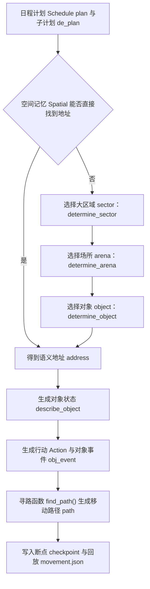

这张图要抓住的是状态传递，而不是模板细节。空间落地 prompt 的输出先改变行动 Action 的地址，再改变对象事件 obj_event，最后通过移动路径 path 和断点 checkpoint 进入回放文件。调试仿真循环时，如果角色走错地点，要沿着 `Schedule plan -> address -> Action -> path -> checkpoint` 查；如果对象状态怪异，要沿着 `describe_object -> obj_event -> tile events` 查。

## 16.11 断点 checkpoint 与对话 conversation 写入

每个仿真步 step 结束，仿真服务 server 会把角色状态写回配置 `self.config`：

```python
self.config["agents"][name].update(agent.to_dict())
if plan.get("path"):
    status["coord"], status["path"] = plan["path"][-1], []
self.config["agents"][name].update({"coord": status["coord"]})
```

智能体序列化函数 `Agent.to_dict()` 保存的不是完整 Python 对象，而是可 JSON 化的恢复状态：

```python
def to_dict(self, with_action=True):
    info = {
        "status": self.status,
        "schedule": self.schedule.to_dict(),
        "associate": self.associate.to_dict(),
        "chats": self.chats,
        "currently": self.scratch.currently,
    }
    if with_action:
        info.update({"action": self.action.to_dict()})
    return info
```

随后写入两个结果文件：

```python
sim_time = timer.get_date("%Y%m%d-%H:%M")
with open(f"{self.checkpoints_folder}/simulate-{sim_time.replace(':', '')}.json", "w", encoding="utf-8") as f:
    f.write(json.dumps(self.config, indent=2, ensure_ascii=False))

with open(f"{self.checkpoints_folder}/conversation.json", "w", encoding="utf-8") as f:
    f.write(json.dumps(self.game.conversation, indent=2, ensure_ascii=False))
```

| 文件 | 内容 | 后续用途 |
| --- | --- | --- |
| `simulate-20240213-0930.json` | 当前时间、仿真步 step、所有角色状态、日程、行动、记忆索引引用、坐标 | 断点恢复、状态审计、压缩时间线 |
| `conversation.json` | 仿真过程中发生的对话 conversation | 压缩脚本 `compress.py` 生成 `simulation.md` 和对话摘要 |
| `storage/<角色名>/associate/` | 角色关联记忆 associate 的底层索引 | 恢复运行和后续检索 |

代码逻辑图：

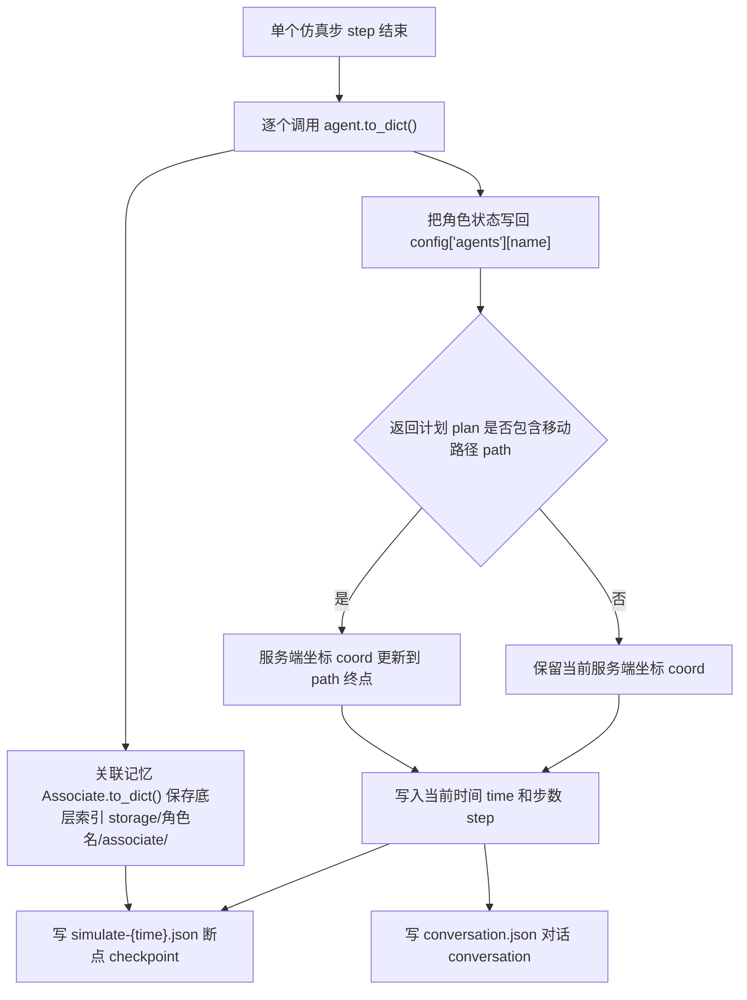

这张图把三个保存位置分开：断点 checkpoint 保存可 JSON 化的角色状态；`conversation.json` 保存全局对话；`storage/<角色名>/associate/` 保存关联记忆 Associate 的底层索引。只看 `simulate-*.json` 会看到节点编号 node id，但完整记忆文本、元数据 metadata 和向量嵌入 embedding 还在存储目录里。

断点 checkpoint 是仿真循环的黑匣子记录。只要断点 checkpoint 连续生成，且对话文件 `conversation.json` 能被正常写盘，循环层就已经完成了自己的保存职责。

## 16.12 记录间隔字段 record_iterval 与记录点

`Game` 里有一个源码字段：

```python
self.record_iterval = config.get("record_iterval", 30)
```

拼写是 `record_iterval`，不是 `record_interval`。后面的判断也使用这个字段：

```python
if (utils.get_timer().daily_duration() - agent.last_record) > self.record_iterval:
    info["record"] = True
    agent.last_record = utils.get_timer().daily_duration()
else:
    info["record"] = False
```

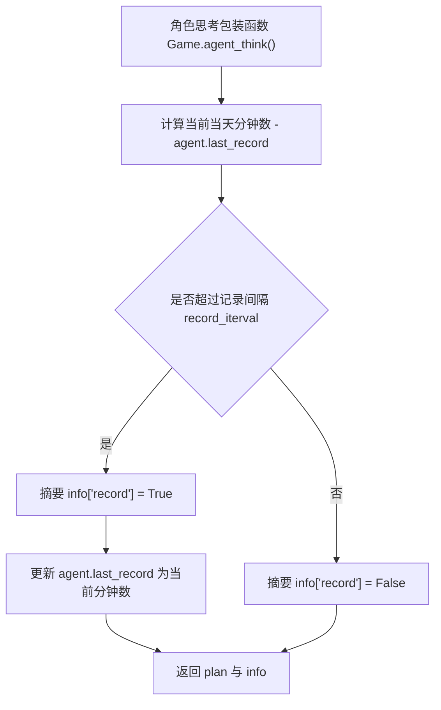

*图 16-8：记录间隔字段 `record_iterval` 的分支。这个判断只控制摘要字段 `record`，不控制智能体是否思考，也不控制断点 checkpoint 是否写入。*

这个字段不控制智能体 Agent 是否思考，也不控制断点 checkpoint 是否写入。它控制角色思考包装函数 `Game.agent_think()` 返回的摘要里是否带记录标记 `record=True`，用于较低频地标记需要记录的时刻。调试时看到记录标记 `record_flag: False`，不代表循环没有运行，只代表还没超过记录间隔。

## 16.13 可运行脚手架

第 16 章脚手架位于：

```text
docs/book/scaffolds/part_03/ch16_simulation_loop_demo.py
```

它加载真实地图配置 `maze.json`、真实克劳斯和玛丽亚的角色配置 `agent.json`，实际构造智能体 Agent 对象，并用真实角色思考包装函数 `Game.agent_think()` 调用智能体思考函数 `Agent.think()`。为了让输出稳定，脚手架把智能体补全函数 `Agent.completion()` 替换成确定性替身 deterministic stub，把关联记忆写入替换成轻量概念对象；它不调用外部大语言模型 LLM，也不写入仓库内断点 checkpoint。脚手架展示的是循环顺序，不是模型生成质量。

核心替换代码如下：

```python
def stub_completion(self: Agent, func_hint: str, *args, **kwargs):
    if not hasattr(self, "_ch16_completion_calls"):
        self._ch16_completion_calls = []
    self._ch16_completion_calls.append(func_hint)

    daily = {
        "8:00": "起床并完成早晨的例行工作",
        "9:00": "阅读并整理文献综述" if self.name == "克劳斯" else "准备课程笔记",
        "10:00": "继续推进上午的学习任务",
        "11:00": "整理资料",
        "12:00": "吃午饭",
        "13:00": "休息",
        "14:00": "继续学习",
        "15:00": "参加小组讨论",
        "16:00": "完成当天任务",
        "17:00": "回到宿舍",
        "18:00": "吃晚饭",
        "19:00": "放松",
        "20:00": "阅读",
        "21:00": "整理明天计划",
        "22:00": "准备睡觉",
        "23:00": "睡觉",
    }

    if func_hint == "wake_up":
        return 8
    if func_hint == "schedule_init":
        return [
            "早上8点起床",
            "上午在奥克山学院学习",
            "中午吃午饭",
            "下午继续完成学习任务",
            "晚上回宿舍休息",
        ]
    if func_hint == "schedule_daily":
        return daily
    if func_hint == "schedule_decompose":
        if self.name == "克劳斯":
            return [("阅读论文资料", 30), ("起草论文开头段落", 30)]
        return [("整理课堂资料", 30), ("准备课程讨论问题", 30)]
    if func_hint == "determine_sector":
        return "奥克山学院"
    if func_hint == "determine_arena":
        return "图书馆" if self.name == "克劳斯" else "教室"
    if func_hint == "determine_object":
        return "图书馆桌子" if self.name == "克劳斯" else "教室学生座位"
```

从仓库根目录运行：

```bash
python docs/book/scaffolds/part_03/ch16_simulation_loop_demo.py
```

本机实际输出如下：

```text
第 16 章仿真循环脚手架 simulation-loop scaffold
========================================================
选中角色 selected_agents: 克劳斯, 玛丽亚
起始时间 start_time: 20240213-09:30
步长分钟 stride_minutes: 10
配置角色顺序 config_agents_order: 克劳斯, 玛丽亚

初始角色状态 agent_status
- 克劳斯: 坐标 coord=[126, 46] 地址 address=the Ville:奥克山学院宿舍:克劳斯的房间:床 路径 path=[]
- 玛丽亚: 坐标 coord=[123, 57] 地址 address=the Ville:奥克山学院宿舍:玛丽亚的房间:床 路径 path=[]

仿真步 Simulate Step[1/1, time: 2024-02-13 09:30:00]
[1] 克劳斯
    输入状态 status_before: 坐标 coord=[126, 46]
    当前地址 current_address: the Ville:奥克山学院宿舍:克劳斯的房间:床
    提示词调用 completion_calls: wake_up, schedule_init, schedule_daily, schedule_decompose, determine_sector, determine_arena, determine_object, describe_object
    行动结果 action_after: 起草论文开头段落 @ the Ville:奥克山学院:图书馆:图书馆桌子
    返回路径长度 returned_path_len: 69
    返回路径终点 returned_path_target: [119, 24]
    服务端状态 server_status_after: 坐标 coord=[119, 24] 路径 path=[]
    记录标记 record_flag: False
[2] 玛丽亚
    输入状态 status_before: 坐标 coord=[123, 57]
    当前地址 current_address: the Ville:奥克山学院宿舍:玛丽亚的房间:床
    提示词调用 completion_calls: wake_up, schedule_init, schedule_daily, schedule_decompose, determine_sector, determine_arena, determine_object, describe_object
    行动结果 action_after: 准备课程讨论问题 @ the Ville:奥克山学院:教室:教室学生座位
    返回路径长度 returned_path_len: 55
    返回路径终点 returned_path_target: [112, 25]
    服务端状态 server_status_after: 坐标 coord=[112, 25] 路径 path=[]
    记录标记 record_flag: False

本仿真步 step 会写入的结果文件
- simulate-20240213-0930.json
- conversation.json

时间推进 timer.forward()
- before_forward: 20240213-09:30
- after_forward: 20240213-09:40
```

这段终端输出的信息量很大，适合再转成一张总览图。配图脚手架位于：

```bash
python docs/book/scaffolds/part_03/ch16_simulation_step_figure.py
```

它复用同一套仿真循环脚手架数据，再读取真实小镇地图、克劳斯和玛丽亚的角色头像与角色配置，生成图 16-9。

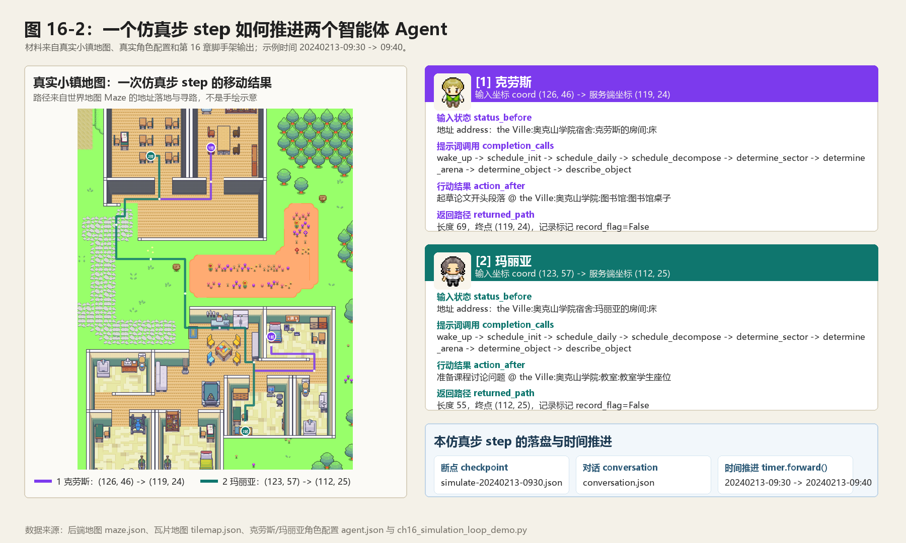

*图 16-9：一个仿真步 step 如何推进两个智能体 Agent。左侧是真实小镇地图上的移动路径：克劳斯从宿舍床位走向图书馆桌子，玛丽亚从宿舍床位走向教室学生座位。右侧是同一仿真步 step 中每个角色的输入状态 status、提示词调用 completion calls、行动结果 action、返回路径 path 和服务端状态 server status。底部显示本步会写入的断点 checkpoint、对话 conversation，以及全局计时器 Timer 如何从 09:30 推进到 09:40。*

图 16-9 的价值不在于多画一张流程图，而在于把终端输出放回小镇世界中。左侧说明移动路径 path 是世界地图 Maze 寻路的结果；右侧说明仿真循环函数 `SimulateServer.simulate()` 并不直接生成行为，而是按角色顺序调用角色思考包装函数 `Game.agent_think()`，再把智能体思考函数 `Agent.think()` 返回的路径、行动和摘要写回服务端状态。

这段输出可以逐行映射回源码：

| 输出行 | 对应源码 | 说明 |
| --- | --- | --- |
| `配置角色顺序 config_agents_order: 克劳斯, 玛丽亚` | 配置生成函数 `get_config()` 的 `for a in agents` | 角色顺序进入角色配置 `config["agents"]` |
| `初始角色状态 agent_status` | 仿真服务构造函数 `SimulateServer.__init__()` | 仿真服务 server 先保存角色初始坐标和空移动路径 path |
| `仿真步 Simulate Step[1/1, time: ...]` | 仿真循环函数 `simulate()` 取 `timer.get_date()` | 本仿真步 step 内两个角色共享 09:30 |
| `[1] 克劳斯`、`[2] 玛丽亚` | `for name, status in self.agent_status.items()` | 当前实现是按顺序更新，不是并行同步决策 |
| `提示词调用 completion_calls` | 智能体思考函数 `Agent.think()` -> 日程函数 `make_schedule()` -> 行动决定函数 `_determine_action()` | 第一次仿真步 step 先生成日程，再把当前子任务落到地点 |
| `行动结果 action_after` | 行动类 `memory.Action`、事件类 `memory.Event` | 日程子任务已经变成带地址的行动 |
| `返回路径长度 returned_path_len` | 智能体寻路函数 `Agent.find_path()` | 行动地址被世界地图 Maze 转成移动路径 |
| `服务端状态 server_status_after` | `status["coord"] = plan["path"][-1]` | 仿真服务 server 把坐标更新到路径终点 |
| `simulate-20240213-0930.json` | 断点 checkpoint 写入代码 | 文件名来自当前全局计时器 Timer |
| `after_forward: 20240213-09:40` | 时间推进函数 `timer.forward(stride)` | 仿真步 step 完成后时间才推进 |

脚手架里克劳斯从宿舍床位 `[126,46]` 出发，当前行动落到 `the Ville:奥克山学院:图书馆:图书馆桌子`，路径终点是 `[119,24]`。这个坐标不是手写解释出来的，它来自真实世界地图 Maze 的地址取格函数 `get_address_tiles()` 和寻路函数 `find_path()`。玛丽亚同理，从宿舍床位走向教室学生座位。看到这里，就能把“日程文字 -> 行动地址 -> 移动路径 path -> 仿真服务 server 坐标更新”这条链路连起来。

## 16.14 完整仿真的调试顺序

脚手架验证循环骨架；完整调试仍然要跑入口脚本 `start.py`。先用少量角色：

```bash
cd generative_agents
python start.py --name debug-loop --start "20240213-09:30" --step 3 --stride 10 --agents "克劳斯,玛丽亚" --verbose info --log debug-loop.log
```

运行后先看日志，再看文件。

| 检查对象 | 路径 | 要确认什么 |
| --- | --- | --- |
| 日志 log | `results/checkpoints/debug-loop/debug-loop.log` | 是否出现模型重置 `reset`、仿真步 `Simulate Step`、日程生成 `schedule_daily`、状态摘要 `summary` |
| 断点 checkpoint | `results/checkpoints/debug-loop/simulate-*.json` | 每个仿真步 step 是否写入角色状态、坐标、日程和行动 |
| 对话 conversation | `results/checkpoints/debug-loop/conversation.json` | 如果为空，先检查角色是否同场景、是否醒着、是否有反应 reaction 机会 |
| 记忆索引 associate index | `results/checkpoints/debug-loop/storage/<角色名>/associate/` | 关联记忆 associate 是否持久化 |

完整调试路径可以画成下面这张图：

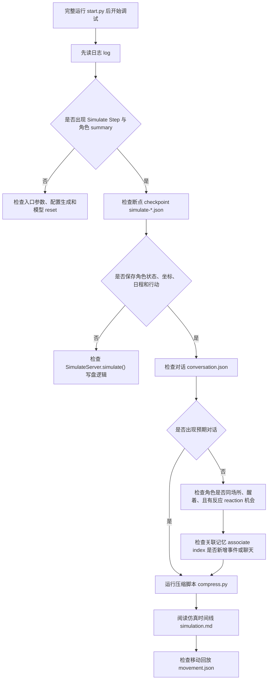

日志片段可以这样读：

```text
克劳斯.reset
玛丽亚.reset
Simulate Step[1/3, time: 2024-02-13 09:30:00]
克劳斯 -> wake_up
克劳斯 -> schedule_init
克劳斯 -> schedule_daily
克劳斯 -> schedule_decompose
克劳斯 percept 0/4 concepts
克劳斯 is determining action...
克劳斯.summary @ 20240213-09:30:00
  action: 阅读并整理文献综述 @ the Ville:奥克山学院:图书馆:图书馆桌子

玛丽亚 -> wake_up
玛丽亚 -> schedule_init
玛丽亚 -> schedule_daily
玛丽亚 -> schedule_decompose
玛丽亚 is going to sleep...
玛丽亚.summary @ 20240213-09:30:00
  action: 玛丽亚 正在 睡觉 @ the Ville:奥克山学院宿舍:玛丽亚的房间:床
```

这不是普通日志 log。模型重置 `reset` 表示模型连接已创建；日程生成 `schedule_daily` 表示当天日程已生成；感知摘要 `percept 0/4 concepts` 表示智能体 Agent 已经读取视野事件；行动决定日志 `is determining action...` 表示当前行动 Action 已结束，需要把日程落到行动地址；睡眠日志 `is going to sleep...` 表示当前日程段被睡眠逻辑接管。

压缩结果用：

```bash
python compress.py --name debug-loop
```

压缩后读：

```text
results/compressed/debug-loop/simulation.md
results/compressed/debug-loop/movement.json
```

仿真时间线 `simulation.md` 负责给人读时间线，移动回放文件 `movement.json` 负责给前端回放。调试顺序是：日志 log 确认模块运行，断点 checkpoint 确认状态保存，对话 conversation 确认社交是否发生，仿真时间线 `simulation.md` 确认时间线可读，移动回放文件 `movement.json` 再交给前端。

## 16.15 工程边界

当前仿真循环清晰，但不是研究级严格同步系统。

| 边界 | 当前实现 | 影响 |
| --- | --- | --- |
| 多智能体 Agent 顺序 | 同一时间戳下按字典顺序逐个更新 | 前面的智能体 Agent 会先改变世界状态 |
| 移动粒度 | 每个仿真步 step 返回完整移动路径 path，仿真服务 server 坐标更新到终点 | 认知更新不是每个地图格子一步 |
| 模型调用 | 每个智能体 Agent 内部顺序调用大语言模型 LLM | 25 个角色全量运行会慢 |
| 断点 checkpoint | 每步写完整配置 config | 易恢复、易审计，但文件较多 |
| 对话 conversation | 全局字典 dict 共享 | 串行运行简单，并行化时需要处理写入冲突 |
| 兜底输出 failsafe | 提示词 prompt 输出异常时可能使用默认值 | 仿真不中断，但行为质量需要额外检查 |

这些边界决定了后续优化方向：要做严格同步，需要把感知、决策、世界更新拆成多个阶段；要提速，需要并行化模型调用和存储写入；要做更细粒度移动，需要缩短仿真步 step 或把路径上的中间点纳入认知更新。

## 16.16 本章小结

仿真循环是第三部分的主干。入口脚本 `start.py` 负责把命令行参数变成配置，仿真服务容器 `SimulateServer` 负责逐仿真步 step 调用和保存状态，角色思考包装函数 `Game.agent_think()` 负责包装单个智能体 Agent 的结果，智能体思考函数 `Agent.think()` 负责把移动、日程、睡眠、感知、计划、反思和寻路串成一次行为。

| 本章对象 | 核心结论 |
| --- | --- |
| 配置生成函数 `get_config()` | 把起始时间、地图、公共配置和角色配置路径组织成运行配置 |
| 角色列表 `personas` / 角色参数 `--agents` | 决定本次运行有哪些角色，也决定循环顺序 |
| 全局计时器 Timer | 让所有模块共享同一个仿真时间 |
| 角色状态 `SimulateServer.agent_status` | 保存仿真服务 server 视角下的坐标和路径 |
| 仿真循环函数 `SimulateServer.simulate()` | 按仿真步 step 遍历角色、写断点 checkpoint、保存对话 conversation、推进时间 |
| 角色思考包装函数 `Game.agent_think()` | 调用智能体思考函数 `Agent.think()`，并整理行动 action、日程 schedule、地址 address、记录标记 record 等摘要 |
| 智能体思考函数 `Agent.think()` | 一次思考包含移动同步、日程、睡眠、感知、计划/反应、反思和寻路 |
| 提示词 prompt 边界 | 循环层不直接调用模型；日程、感知、社交、反思和行动落地在 `Agent.think()` 的具体机制中触发 prompt |
| 空间落地 prompt | `determine_sector`、`determine_arena`、`determine_object` 和 `describe_object` 把日程文字落到语义地址、对象和对象状态 |
| 断点 checkpoint | 让仿真可以恢复、压缩和回放 |
| 工程边界 | 当前是同一时间戳下的顺序更新仿真，不是严格同步并行仿真 |

下一章进入感知机制：智能体感知函数 `Agent.percept()` 如何从周围地图格子 Tile 中读取事件、去重、写入关联记忆，并为反应 reaction 和反思 reflection 提供输入。

## 参考资料

- Local source: `generative_agents/start.py`
- Local source: `generative_agents/modules/game.py`
- Local source: `generative_agents/modules/agent.py`
- Local source: `generative_agents/modules/prompt/scratch.py`
- Local source: `generative_agents/modules/utils/timer.py`
- Local source: `generative_agents/modules/memory/schedule.py`
- Local source: `generative_agents/modules/memory/action.py`
- Local prompts: `generative_agents/data/prompts/determine_sector.txt`
- Local prompts: `generative_agents/data/prompts/determine_arena.txt`
- Local prompts: `generative_agents/data/prompts/determine_object.txt`
- Local prompts: `generative_agents/data/prompts/describe_object.txt`
- Local scaffold: `docs/book/scaffolds/part_03/ch16_simulation_loop_demo.py`
- Local scaffold: `docs/book/scaffolds/part_03/ch16_simulation_step_figure.py`
