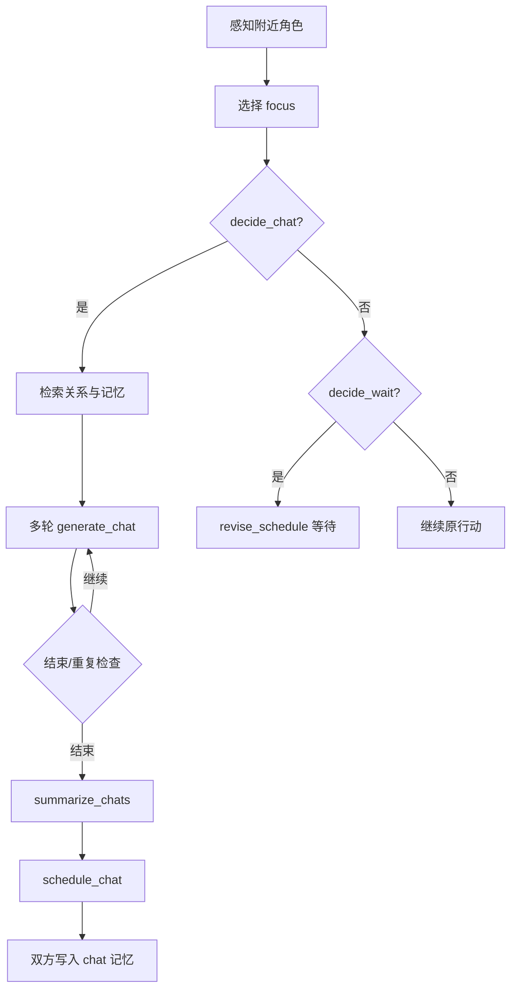

# 第 17 章 社交：聊天、等待与关系传播

## 17.1 本章要解决的问题

前面几章讲了世界、初始化、仿真循环、感知、记忆和日程。

这一章讲社交。

在 GenerativeAgentsCN 中，社交不是“两个角色随机聊天”。它是由感知触发、记忆约束、模型判断、对话生成、日程改写和记忆写回共同组成的行为闭环。

核心源码在：

```text
generative_agents/modules/agent.py
```

主要函数：

```text
_reaction()
_chat_with()
_wait_other()
schedule_chat()
revise_schedule()
```

相关 prompt：

```text
decide_chat
summarize_relation
generate_chat
generate_chat_check_repeat
decide_chat_terminate
summarize_chats
decide_wait
reflect_chat_planing
reflect_chat_memory
```

本章要回答八个问题：

1. 社交行为如何从感知触发？
2. `_reaction()` 如何选择关注对象？
3. `_chat_with()` 如何决定是否聊天？
4. 对话为什么需要双方关系摘要？
5. 多轮对话如何生成、终止和防复读？
6. 对话如何写回双方日程和记忆？
7. `_wait_other()` 如何处理空间冲突？
8. 社交模块如何支撑信息扩散和关系形成？

[图 17-1：社交行为闭环]



## 17.2 社交从 reaction 开始

`Agent.think()` 中，醒着的 agent 会执行：

```python
self.percept()
self.make_plan(agents)
self.reflect()
```

`make_plan()` 首先尝试 reaction：

```python
if self._reaction(agents):
    return
```

所以社交行为不是无条件发生。

它必须先由感知产生 `self.concepts`，再由 `_reaction()` 判断。

这条链路是：

```text
看到附近事件
  -> self.concepts
  -> _reaction()
  -> _chat_with() 或 _wait_other()
```

如果没有看到其他角色或重要事件，agent 会继续执行原计划。

这让社交建立在空间相遇之上。

## 17.3 _reaction() 如何选择 focus

`_reaction()` 的第一步是从 `self.concepts` 中选 focus。

如果有其他 agent 相关 concept，优先选择：

```python
priority = [i for i in self.concepts if _focus(i)]
if priority:
    focus = random.choice(priority)
```

`_focus()` 判断：

```python
concept.event.subject in agents
```

也就是说，看到人优先于看到物。

如果没有看到 agent，就从非空闲事件中选：

```python
priority = [i for i in self.concepts if not _ignore(i)]
```

默认忽略词是：

```text
空闲
```

这避免角色对空闲对象过度反应。

如果最终 focus 不是另一个 agent，`_reaction()` 返回 None。

当前项目的 reaction 主要围绕 agent-agent 互动。

## 17.4 关系上下文：get_relation()

选中 focus 后：

```python
other, focus = agents[focus.event.subject], self.associate.get_relation(focus)
```

`get_relation()` 会返回：

```python
{
    "node": node,
    "events": self.retrieve_events(node.describe),
    "thoughts": self.retrieve_thoughts(node.describe),
}
```

这说明当前 focus 会触发一次关系检索。

例如，克劳斯看到玛丽亚，系统不会只把“玛丽亚在这里”交给聊天 prompt。

它还会检索：

- 与玛丽亚相关的事件。
- 与玛丽亚相关的想法。

社交行为因此具有历史感。

角色是否聊天、说什么、如何称呼对方，都可以受过往关系影响。

## 17.5 reaction 的两条路径

`_reaction()` 尝试两条路径：

```python
if self._chat_with(other, focus):
    return True
if self._wait_other(other, focus):
    return True
return False
```

第一条是聊天。

第二条是等待。

聊天处理社会信息交换。

等待处理空间资源冲突。

这两种 reaction 都可能打断原日程。

如果聊天成功，当前计划被对话 action 替代。

如果等待成功，当前计划被等待 action 替代。

如果都不成功，agent 继续原计划。

## 17.6 _skip_react()：何时不反应

社交不应该随时发生。

`_skip_react()` 过滤不合适场景。

它会跳过：

- 深夜 23 点后。
- 自己或对方正在睡觉。
- 事件处于待开始状态。

代码中：

```python
if utils.get_timer().daily_duration(mode="hour") >= 23:
    return True
if _skip(self.get_event()) or _skip(other.get_event()):
    return True
```

这让角色不会半夜频繁社交，也不会和睡觉的人聊天。

可信社交不仅要会说话，也要知道什么时候不说话。

## 17.7 _chat_with() 的前置条件

`_chat_with()` 先做多项检查。

第一，双方日程必须已初始化：

```python
if len(self.schedule.daily_schedule) < 1 or len(other.schedule.daily_schedule) < 1:
    return False
```

第二，不适合 reaction 时返回 False。

第三，对方不能正在移动：

```python
if other.path:
    return False
```

第四，双方不能已经在对话：

```python
if self.get_event().fit(predicate="对话") or other.get_event().fit(predicate="对话"):
    return False
```

这些检查防止社交过度触发。

它们让对话发生在更稳定的场景中。

## 17.8 最近聊天冷却

`_chat_with()` 会检索最近与对方的聊天记录：

```python
chats = self.associate.retrieve_chats(other.name)
```

如果有聊天记录，会计算距离现在多久：

```python
delta = utils.get_timer().get_delta(chats[0].create)
if delta < 60:
    return False
```

也就是说，一小时内聊过就不再聊。

这很重要。

否则两个角色在同一个地点可能每个 step 都重新对话。

冷却机制让对话更像真实社交，而不是循环触发器。

## 17.9 decide_chat：是否应该主动聊天

通过前置条件后，系统调用：

```python
if not self.completion("decide_chat", self, other, focus, chats):
    return False
```

`decide_chat` prompt 会基于：

- 上下文事件。
- 关系 thoughts。
- 当前时间。
- 上次聊天历史。
- 自己当前状态。
- 对方当前状态。

判断是否主动聊天。

输出是 bool。

这一步把“是否聊天”从“看见人就聊”升级为情境判断。

例如：

- 正在赶去睡觉，不一定聊天。
- 刚刚聊过，不聊天。
- 对方正在做重要事情，不一定打扰。
- 有共同活动或邀请事项，可能聊天。

这就是 believable behavior。

## 17.10 summarize_relation：双方视角不同

决定聊天后，系统生成双方关系摘要：

```python
relations = [
    self.completion("summarize_relation", self, other.name),
    other.completion("summarize_relation", other, self.name),
]
```

这里生成两个摘要，而不是一个全局关系。

这很关键。

克劳斯怎么看玛丽亚，不一定等于玛丽亚怎么看克劳斯。

山姆怎么看汤姆，也不等于汤姆怎么看山姆。

对话生成时，双方各用自己的关系摘要。

这让对话具有不对称性。

如果所有角色共享一份关系状态，对话会更像剧本，而不是个体社会互动。

## 17.11 summarize_relation 如何检索

`prompt_summarize_relation()` 会围绕对方名字检索记忆：

```python
nodes = agent.associate.retrieve_focus([other_name], 50)
```

然后把检索结果放进 prompt。

如果没有有效结果，failsafe 是：

```text
<agent> 正在看着 <other_name>
```

这说明关系摘要来自记忆，而不是全局关系表。

角色越多次与某人互动，关系摘要越可能具体。

这支撑关系形成。

## 17.12 generate_chat：生成一句话

多轮对话核心是：

```python
text = self.completion("generate_chat", self, other, relations[0], chats)
```

`generate_chat` prompt 包含：

- 角色基础描述。
- 当前检索记忆。
- 当前地点。
- 当前时间。
- 最近对话背景。
- 当前场景。
- 已有对话记录。
- 对话原则。

对话原则包括：

- 不重复已有内容。
- 符合性格和当前情境。
- 语言自然。
- 1 到 3 句话。
- 直接输出角色对话内容。

这比单纯“让 A 和 B 对话”要稳得多。

因为每次生成都带上关系、记忆和当前场景。

## 17.13 对话记忆检索

`prompt_generate_chat()` 内部还会检索相关记忆：

```python
focus = [relation, other.get_event().get_describe()]
if len(chats) > 4:
    focus.append("; ".join("{}: {}".format(n, t) for n, t in chats[-4:]))
nodes = agent.associate.retrieve_focus(focus, 15)
```

也就是说，生成一句话时会围绕：

- 双方关系。
- 对方当前行为。
- 最近对话内容。

检索记忆。

此外，它还检索最近 480 分钟内与对方的聊天：

```python
chat_nodes = agent.associate.retrieve_chats(other.name)
```

这让角色能避免重复，也能延续近期话题。

## 17.14 多轮对话循环

`_chat_with()` 中：

```python
for i in range(self.chat_iter):
    text = self.completion("generate_chat", self, other, relations[0], chats)
    ...
    text = other.completion("generate_chat", other, self, relations[1], chats)
```

`chat_iter` 默认是 4。

一轮中，发起者说一句，对方说一句。

每次说话后，内容加入：

```python
chats.append((name, text))
```

这使下一句生成能看到已有对话。

对话不是一次性生成整段，而是逐轮生成。

这更像真实互动，也更容易在中途结束。

## 17.15 防复读

从第二轮开始，系统检查复读：

```python
generate_chat_check_repeat
```

如果判断重复，就结束。

这针对 LLM 常见问题：

- 重复上一轮意思。
- 客套话循环。
- 继续确认同一件事。

多智能体长对话很容易陷入复读。

防复读 prompt 是工程上非常实用的补丁。

它不属于论文核心模块，但对项目可运行性很关键。

## 17.16 decide_chat_terminate：判断话题结束

系统还会调用：

```python
decide_chat_terminate
```

判断对话是否已告一段落。

如果结束，就 break。

这让对话长度由内容决定，而不是固定轮数。

例如，简单问候可能一两轮结束。

派对邀请可能需要多轮。

争论或协商可能更长。

当前项目仍然有最大轮数 `chat_iter`，避免无限对话。

## 17.17 保存 conversation

对话结束后，系统写入全局 conversation：

```python
key = utils.get_timer().get_date("%Y%m%d-%H:%M")
self.conversation[key].append({
    f"{self.name} -> {other.name} @ {'，'.join(self.get_event().address)}": chats
})
```

这个结构记录：

- 时间。
- 发起者。
- 接收者。
- 地点。
- 对话内容。

它会被 `SimulateServer.simulate()` 每步写入 `conversation.json`。

后续 `compress.py` 会用它生成 `simulation.md`。

这让社交行为可复盘。

## 17.18 summarize_chats：对话摘要

系统不会把完整对话直接作为当前 action。

它会先生成摘要：

```python
chat_summary = self.completion("summarize_chats", chats)
```

摘要用于：

- 对话事件 describe。
- chat memory。
- 日程修订。
- 后续 reflection。

这很重要。

完整对话适合日志。

摘要适合记忆和检索。

如果摘要质量差，后续社交记忆会变差。

例如，派对邀请摘要必须包含时间、地点和邀请意图，否则后续无法传播。

## 17.19 schedule_chat：写回双方

对话摘要生成后：

```python
self.schedule_chat(chats, chat_summary, start, duration, other)
other.schedule_chat(chats, chat_summary, start, duration, self)
```

也就是说，对话会写回双方。

这符合现实。

聊天不是只有发起者记得。

双方都要：

- 把对话加入 `chats`。
- 创建对话 event。
- 修订当前 schedule。

这也是信息传播的关键。

如果只有发起者记录对话，被邀请者就不会知道派对。

## 17.20 对话时长如何估算

对话 duration 由文本长度估算：

```python
duration = int(sum([len(c[1]) for c in chats]) / 240)
```

这是一种简单估计。

对话越长，占用时间越久。

但它有边界。

中文字符长度与真实说话时间不是严格线性。

短对话可能 duration 为 0。

更精细的系统可以设置最小时长，或按词速估算。

当前实现足够支持日程占用的基本效果。

## 17.21 对话如何进入反思

`schedule_chat()` 会把 chats 加入：

```python
self.chats.extend(chats)
```

之后 `Agent.reflect()` 会处理 `self.chats`：

```python
thought = self.completion("reflect_chat_planing", self.chats)
_add_thought(f"对于 {self.name} 的计划：{thought}", evidence)
thought = self.completion("reflect_chat_memory", self.chats)
_add_thought(f"{self.name} {thought}", evidence)
```

所以对话不仅影响当前日程，也会影响高层 thought。

例如：

```text
阿伊莎知道伊莎贝拉邀请她参加情人节派对。
克劳斯觉得玛丽亚愿意讨论开放性问题。
山姆发现汤姆对竞选保持怀疑。
```

这些 thought 会影响后续行为。

## 17.22 _wait_other()：等待机制

社交章节还要讲等待，因为它也是 reaction 的一部分。

`_wait_other()` 处理空间冲突。

前置条件包括：

- 不跳过 reaction。
- 自己必须在 path 上。
- 自己 action 地址必须等于对方当前 tile 地址。
- `decide_wait` 判断应该等待。

如果决定等待，会创建 event：

```python
memory.Event(
    self.name,
    "waiting to start",
    self.get_event().get_describe(False),
    address=self.get_event().address,
    emoji=f"⌛",
)
```

然后调用：

```python
self.revise_schedule(event, start, duration)
```

等待是社交的边界场景。

它不是对话，但它处理人与人之间的空间协调。

## 17.23 decide_wait 的常识示例

`decide_wait` prompt 中有示例。

一个例子是两人都要使用浴室。

如果浴室已被占用，后到者应该等待。

另一个例子是一人吃午饭，一人洗衣服。

两者不冲突，继续行动。

这些例子告诉模型：

```text
不是看到别人就等待。
要判断行动是否争用同一空间或对象。
```

这让等待机制更接近常识。

## 17.24 社交如何支撑信息扩散

情人节派对信息扩散依赖社交闭环。

流程：

```text
伊莎贝拉 currently 有派对目标
  -> 计划中可能安排邀请居民
  -> 遇到阿伊莎
  -> decide_chat 成功
  -> generate_chat 提到派对
  -> summarize_chats 保存派对摘要
  -> schedule_chat 写入双方
  -> 阿伊莎后续检索到派对
  -> 阿伊莎可能告诉别人
```

这个传播不是全局变量。

它需要每一步都成功。

如果 decide_chat 返回 False，传播断。

如果 generate_chat 没提派对，传播断。

如果 summarize_chats 丢了时间地点，传播质量下降。

如果 chat memory 后续检索失败，传播不会继续。

这就是为什么社交模块是复现实验核心。

## 17.25 社交如何支撑关系形成

关系形成也依赖社交闭环。

以克劳斯和玛丽亚为例：

```text
相遇
  -> 触发聊天
  -> 对话中交换兴趣
  -> 摘要写入双方记忆
  -> reflection 生成高层 thought
  -> 下一次 summarize_relation 更具体
  -> 后续对话更有历史感
```

关系不是固定字段。

它是多次对话、记忆检索和反思积累出来的。

这也是 Generative Agents 区别于传统 NPC 关系表的地方。

传统 NPC 可能有：

```text
friendship_score = 70
```

GenerativeAgentsCN 更接近：

```text
我记得我们聊过什么。
我对这些经历有什么理解。
我下次见你时会基于这些理解说话。
```

## 17.26 社交失败模式

社交模块常见失败有七类。

第一，触发不足。

角色看到了人，但 decide_chat 经常返回 False，信息无法传播。

第二，触发过度。

角色频繁聊天，日程被打断，小镇像聊天大厅。

第三，对话泛化。

角色只是寒暄，没有提到当前目标或记忆。

第四，摘要丢失关键信息。

派对时间、地点、承诺没有进入 chat summary。

第五，关系摘要错误。

检索到无关记忆，导致对话语气不合理。

第六，复读或过度礼貌。

模型反复客套，缺少真实推进。

第七，对话不改变后续行为。

虽然生成了文本，但没有影响日程、记忆或反思。

调试社交时，要沿闭环逐步检查。

## 17.27 如何调试一次对话

建议按下面顺序。

第一，确认两人是否同一 arena 且互相可感知。

第二，看 `percept` 日志，确认 concept 数量。

第三，看 `_reaction()` 是否选中对方。

第四，看最近聊天记录，是否因 60 分钟冷却跳过。

第五，看 `decide_chat` prompt 和输出。

第六，看 `summarize_relation` 是否合理。

第七，看每轮 `generate_chat`。

第八，看是否被 repeat check 或 terminate 提前结束。

第九，看 `summarize_chats` 是否保留关键内容。

第十，看双方 schedule 和 chat memory 是否写入。

这条调试链路能定位大多数社交问题。

## 17.28 可改进方向

社交模块可以从几个方向升级。

第一，增加社交意图。

区分寒暄、邀请、询问、争论、求助、协商。

第二，增加关系状态结构化表示。

把自然语言关系摘要与结构化关系图结合。

第三，增加承诺系统。

如果对话中承诺参加派对，应自动生成候选计划。

第四，增加拒绝能力。

减少模型过度合作，让角色能合理拒绝不符合兴趣或时间的请求。

第五，增加对话事件抽取。

从对话中抽取 facts、commitments、preferences，分别写入不同记忆。

第六，增加群聊。

当前 `_chat_with()` 是两人对话。派对、会议、课堂更适合多人对话。

这些升级会让小镇社会更复杂，也更接近 2026 年多智能体协作研究。

## 17.29 本章小结

本章讲清了 GenerativeAgentsCN 的社交机制：

1. 社交从 `percept()` 后的 `_reaction()` 开始。
2. `_reaction()` 优先选择其他 agent 作为 focus。
3. `get_relation()` 会检索与 focus 相关的 events 和 thoughts。
4. reaction 主要有聊天和等待两条路径。
5. `_chat_with()` 有日程、睡眠、移动、已有对话和冷却时间等前置条件。
6. `decide_chat` 判断是否应该主动聊天。
7. `summarize_relation` 为双方分别生成关系摘要。
8. `generate_chat` 逐轮生成对话，并使用记忆、地点、时间和已有对话。
9. `generate_chat_check_repeat` 与 `decide_chat_terminate` 控制复读和结束。
10. `summarize_chats` 把完整对话变成可存储摘要。
11. `schedule_chat` 会把对话写回双方日程和待反思聊天。
12. `_wait_other()` 处理空间冲突下的等待。
13. 社交闭环支撑信息扩散、关系形成和协同行动。

下一章讲反思。我们会深入 `Agent.reflect()`，看重要事件如何触发高层 thought，聊天如何变成计划影响和关系记忆，以及这些 thought 如何重新进入 memory stream。

## 参考资料

- Local source: `generative_agents/modules/agent.py`
- Local source: `generative_agents/modules/prompt/scratch.py`
- Local prompts: `generative_agents/data/prompts/decide_chat.txt`
- Local prompts: `generative_agents/data/prompts/generate_chat.txt`
- Local prompts: `generative_agents/data/prompts/summarize_relation.txt`
- Local prompts: `generative_agents/data/prompts/summarize_chats.txt`
- Local prompts: `generative_agents/data/prompts/decide_wait.txt`
