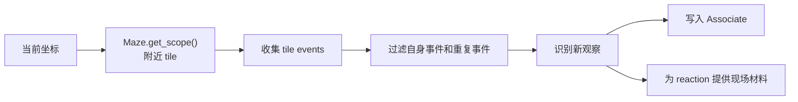

# 第 17 章 感知：智能体如何看见附近事件

## 17.1 核心问题

仿真循环解释了时间如何推进、智能体如何逐步思考。在 `Agent.think()` 中，醒着的智能体每一步会执行：

```python
self.percept()
self.make_plan(agents)
self.reflect()
```

本章专门讲第一步：`percept()`。感知是整个生成式智能体系统的入口。如果 agent 看不到世界，它就无法形成记忆。如果看到了错误事件，后续计划和对话也会错。如果它能看到全局世界，信息扩散和偶遇就失去意义。所以，感知机制的目标不是“看得越多越好”，而是“在合理限制下看到当前附近发生的事”。Generative Agents 的感知链路是：

```text
当前坐标
  -> Maze.get_scope()
  -> 附近 tiles
  -> 同 arena 过滤
  -> 收集 tile events
  -> 距离排序
  -> attention bandwidth 截断
  -> 去重
  -> 写入 memory stream
  -> 更新 poignancy
  -> 得到 self.concepts
```

本章聚焦七个问题：

1. `Agent.percept()` 在整体循环中处于什么位置？
2. 视野范围如何计算？
3. 为什么要限制同一 arena？
4. tile events 如何变成 concepts？
5. 哪些事件会写入长期记忆？
6. 感知结果如何影响 reaction 和 reflection？
7. 当前感知机制有哪些边界？



*图 17-1：Agent.percept() 数据流。感知不是读取全局世界，而是在空间范围内把附近事件转成角色自己的观察。*

## 17.2 感知不是全局读取

在多智能体仿真中，感知必须受限。如果每个 agent 都能读取全局状态，那么：

- 伊莎贝拉不用邀请别人，所有人都能知道派对。
- 山姆不用竞选传播，所有人都能知道他参选。
- 克劳斯和玛丽亚不用相遇，也能知道彼此状态。
- 信息扩散不再是社会现象，而是全局共享变量。

因此，Generative Agents 让 agent 只感知附近区域。这一点对应论文中的观察机制：agent 只能根据自身所在环境观察到局部事件。局部感知是社会涌现的前提。信息之所以能扩散，是因为它一开始不在每个人那里。关系之所以能形成，是因为角色需要相遇、对话和记忆。

## 17.3 percept() 的入口

`Agent.percept()` 位于：

```text
generative_agents/modules/agent.py
```

源码结构如下：

```python
def percept(self):
    scope = self.maze.get_scope(self.coord, self.percept_config)
    # add spatial memory
    for tile in scope:
        if tile.has_address("game_object"):
            self.spatial.add_leaf(tile.address)
    events, arena = {}, self.get_tile().get_address("arena")
    # gather events in scope
    for tile in scope:
        ...
    events = list(sorted(events.keys(), key=lambda k: events[k]))
    # get concepts
    self.concepts, valid_num = [], 0
    for idx, event in enumerate(events[: self.percept_config["att_bandwidth"]]):
        ...
    self.concepts = [c for c in self.concepts if c.event.subject != self.name]
```

可以分成五段：

1. 获取视野范围。
2. 更新空间记忆。
3. 收集附近事件。
4. 转成 concepts。
5. 过滤自身事件。

每一段都影响后续行为。

## 17.4 视野范围：Maze.get_scope()

感知第一步：

```python
scope = self.maze.get_scope(self.coord, self.percept_config)
```

`percept_config` 来自 `data/config.json`：

```json
{
  "mode": "box",
  "vision_r": 8,
  "att_bandwidth": 8
}
```

当前实现支持 `box` 模式。`Maze.get_scope()` 会取当前坐标周围一个方形区域。如果 `vision_r = 8`，理论上视野是：

```text
(2 * 8 + 1) x (2 * 8 + 1)
```

也就是 17 x 17 个 tile。同时会裁剪地图边界，避免坐标越界。这只是候选范围。后面还会根据 arena 和 attention bandwidth 继续过滤。

## 17.5 方形视野的工程取舍

当前视野是 box，不是圆形。这是一种工程简化。方形视野实现简单，计算成本低，也足够支持小镇仿真。但它并不等于真实视觉。真实视觉会受方向、遮挡、墙、距离衰减、光线等影响。当前项目没有模拟这些。这意味着：

- agent 可能看到方形边角处的事件。
- agent 不区分正前方和身后。
- agent 不做视线遮挡。

这些都是可接受的简化。因为项目重点不是物理感知，而是记忆、计划、反思和社会互动。

## 17.6 感知顺便更新空间记忆

拿到 scope 后，`percept()` 会先更新 `Spatial`：

```python
for tile in scope:
    if tile.has_address("game_object"):
        self.spatial.add_leaf(tile.address)
```

这一步很容易被忽略。它说明感知不仅产生事件记忆，也会扩展空间记忆。如果 agent 看到某个 game object，它就把该对象地址加入自己的 spatial tree。例如，角色进入霍布斯咖啡馆附近，看到：

```text
the Ville -> 霍布斯咖啡馆 -> 咖啡馆 -> 钢琴
```

它后续就知道咖啡馆里有钢琴。这类空间学习不进入 `Associate`，而是进入 `Spatial`。这再次说明项目中的“记忆”有多层：

```text
Spatial：哪里有什么。
Associate：发生了什么、聊了什么、想到了什么。
Schedule：今天要做什么。
```

## 17.7 arena 过滤

收集事件前，代码先取当前 arena：

```python
events, arena = {}, self.get_tile().get_address("arena")
```

然后遍历 scope：

```python
for tile in scope:
    if not tile.events or tile.get_address("arena") != arena:
        continue
```

这意味着，即使某个 tile 在视野方框内，如果它不属于当前 arena，也不会被感知。它避免隔墙感知。例如，角色站在宿舍房间里，方形视野可能覆盖隔壁房间或走廊。如果只按距离，角色可能看到墙后的人。arena 过滤用语义区域限制感知。它不是完美视线模拟，但比单纯距离更合理。

## 17.8 收集 tile events

通过 arena 过滤后，系统读取 tile events：

```python
dist = math.dist(tile.coord, self.coord)
for event in tile.get_events():
    if dist < events.get(event, float("inf")):
        events[event] = dist
```

这里 `events` 是一个 dict：

```text
Event -> 最近距离
```

如果同一个 event 出现在多个 tile 上，只保留最近距离。这很合理。例如，同一个 game object 可能对应多个 tile，同一个对象事件可能出现在多个坐标上。agent 只需要知道这个事件存在，不需要重复记录多次。使用 Event 作为 dict key，依赖 `Event.__hash__()` 和 `Event.__eq__()`。`Event.__hash__()` 包含：

```python
self.subject
self.predicate
self.object
self._describe
":".join(self.address)
```

subject、predicate、object、describe、address 都相同，才认为是同一事件。

## 17.9 距离排序与注意力带宽

收集完成后：

```python
events = list(sorted(events.keys(), key=lambda k: events[k]))
```

事件按距离排序。越近越先处理。然后只处理前 `att_bandwidth` 个：

```python
for idx, event in enumerate(events[: self.percept_config["att_bandwidth"]]):
```

当前默认 `att_bandwidth = 8`。这代表 agent 的注意力有限。即使附近有很多事件，它也只能关注一部分。这很符合论文思想。如果 agent 每一步都记住视野中所有事件，记忆流会膨胀，角色也会过度敏感。注意力带宽让感知更接近人类有限注意。

## 17.10 去重：避免重复写入记忆

对每个候选 event，代码先取近期记忆：

```python
recent_nodes = (
    self.associate.retrieve_events() + self.associate.retrieve_chats()
)
recent_nodes = set(n.describe for n in recent_nodes)
```

然后判断：

```python
if event.get_describe() not in recent_nodes:
```

如果近期已经有同样描述，就不重复处理。这避免 agent 每一步都把同一个附近事件重复写入 memory stream。例如，克劳斯连续几步坐在书桌前读书。玛丽亚每一步都看到同一事件，如果不去重，她的记忆里会塞满重复记录：

```text
克劳斯正在读书。
克劳斯正在读书。
克劳斯正在读书。
```

去重让记忆更干净。不过，这里是基于 `describe` 文本去重，不是基于 event id。如果同一事件描述略有变化，仍然可能重复。这是一个工程边界。

## 17.11 空闲事件如何处理

如果 event 是空闲：

```python
if event.object == "idle" or event.object == "空闲":
    node = Concept.from_event(
        "idle_" + str(idx), "event", event, poignancy=1
    )
```

这类 event 会被转成临时 Concept，但不会写入 `Associate`。它仍然可以出现在 `self.concepts` 中，供当前 step 使用。但它不会成为长期记忆。这很合理。空闲状态通常没有长期记忆价值。如果每个空闲对象都写入 memory stream，记忆会迅速膨胀。因此，项目区分了：

```text
临时感知 concept
长期 memory concept
```

空闲事件属于临时感知 concept。

## 17.12 非空闲事件如何写入记忆

非空闲事件会进入 `_add_concept()`：

```python
valid_num += 1
node_type = "chat" if event.fit(self.name, "对话") else "event"
node = self._add_concept(node_type, event)
self.status["poignancy"] += node.poignancy
```

这里有三个动作。第一，判断 node_type。如果事件是当前 agent 与别人对话，类型是 chat。否则是 event。第二，写入 associate memory。`_add_concept()` 会调用：

```python
self.associate.add_node(...)
```

第三，累积 poignancy。重要事件会推动 reflection 触发。这就是感知与反思之间的连接。agent 不是凭空反思，而是因为看到、听到、经历了一些重要事件。

## 17.13 _add_concept() 与重要性评分

`_add_concept()` 根据事件类型给 poignancy。空闲事件给 1。chat 使用：

```python
poignancy_chat
```

其他事件使用：

```python
poignancy_event
```

代码：

```python
elif e_type == "chat":
    poignancy = self.completion("poignancy_chat", event)
else:
    poignancy = self.completion("poignancy_event", event)
```

然后写入 Associate：

```python
return self.associate.add_node(
    e_type,
    event,
    poignancy,
    create=create,
    expire=expire,
    filling=filling,
)
```

这说明感知不是简单记录。每条进入 memory stream 的事件都会带重要性分数。这个分数后续影响：

- retrieval 排序。
- reflection 触发。
- 记忆解释。

## 17.14 self.concepts 的作用

处理完事件后，concept 会加入：

```python
self.concepts.append(node)
```

最后过滤自身事件：

```python
self.concepts = [c for c in self.concepts if c.event.subject != self.name]
```

`self.concepts` 是当前 step 感知结果。它不是长期记忆本身。长期记忆在 `Associate` 中。`self.concepts` 主要服务当前 step 的 reaction。例如 `_reaction()` 会从 `self.concepts` 中选 focus：

```python
priority = [i for i in self.concepts if i.event.subject in agents]
```

因此，感知结果马上影响当前行为。如果看到别人，可能聊天。如果看到对象占用，可能等待。如果没看到重要事件，就继续按计划行动。

## 17.15 过滤自身事件

最后过滤：

```python
c.event.subject != self.name
```

因为 agent 自己的事件也在 tile 上。如果不滤掉，它可能把自己当前行为当成外部事件来反应。例如，克劳斯正在读书。他的 tile 上有：

```text
克劳斯此时读书
```

如果不排除，克劳斯可能“感知到克劳斯正在读书”，再把它作为 reaction focus。这没有意义。过滤自身事件让 reaction 主要面向外部世界。

## 17.16 感知日志

`percept()` 最后记录：

```python
self.logger.info(
    "{} percept {}/{} concepts".format(self.name, valid_num, len(self.concepts))
)
```

这里有两个数字。`valid_num` 是写入长期记忆的非空闲事件数量。`len(self.concepts)` 是当前 step 可用于反应的 concepts 数量。两者可能不同。例如，空闲事件不会写入长期记忆，但可能进入 `self.concepts`。调试时，如果看到：

```text
克劳斯 percept 0/3 concepts
```

说明他看到 3 个 concepts，但没有新的非空闲事件写入长期记忆。如果看到：

```text
玛丽亚 percept 2/2 concepts
```

说明她看到并写入了 2 个新事件。

## 17.17 感知如何驱动信息扩散

信息扩散依赖感知。以情人节派对为例。伊莎贝拉与阿伊莎对话后，tile 上可能出现对话事件。附近角色如果在同一 arena 且注意力范围内，就可能感知到：

```text
伊莎贝拉 对话 阿伊莎
```

该事件进入 memory stream 后，角色可能在后续对话中提到派对。这条链路是：

```text
对话发生
  -> tile event
  -> nearby agent percept
  -> chat/event memory
  -> retrieval
  -> later dialogue
  -> further spread
```

如果感知失败，传播链就会断。因此，复现实验时，不只要看谁说了什么，还要看旁观者是否在正确时间和地点感知到事件。

## 17.18 感知如何驱动关系形成

关系形成也依赖感知。克劳斯和玛丽亚形成关系，首先必须相遇或互相观察。如果克劳斯看到了玛丽亚：

```text
玛丽亚此时在咖啡馆学习
```

这个 event 可能进入克劳斯的 memory。如果随后触发对话，对话摘要会进入 chat memory。之后 reflection 可能生成 thought：

```text
克劳斯认为玛丽亚喜欢探索新想法。
```

这一切的入口是感知。没有感知，就没有 shared experience。没有 shared experience，关系只能来自初始设定，而不是仿真涌现。

## 17.19 感知如何驱动反思

反思触发依赖 `status["poignancy"]`。而 `poignancy` 的主要来源之一就是感知到的新事件。`percept()` 中：

```python
self.status["poignancy"] += node.poignancy
```

`reflect()` 中：

```python
if self.status["poignancy"] < self.think_config["poignancy_max"]:
    return
```

这说明：

```text
重要事件积累
  -> poignancy 上升
  -> 达到阈值
  -> reflection
```

如果 agent 一直只看到空闲事件，就不会触发深层反思。如果 agent 经历密集社交、冲突、邀请、计划变化，poignancy 会更快累积。这让反思与经历强度相关。

## 17.20 当前感知机制的边界

当前感知机制有几个边界。第一，视野是方形。它不模拟方向、遮挡和真实视线。第二，arena 过滤是语义近似。它避免隔墙感知，但不处理门、窗、开放空间和声音传播。第三，事件去重基于 describe。描述变化会导致重复，描述相同但语义时间不同也可能被忽略。第四，attention bandwidth 固定。不同角色没有不同注意力能力。第五，感知写入缺少显式证据链。虽然 memory node 有 metadata，但当前没有单独记录“我是在哪个 tile、以什么距离感知到的”。第六，旁观对话的语义有限。如果 tile 上只有对话摘要，旁观者不一定能得到完整对话内容。这些边界会影响实验解释。

## 17.21 可改进方向

如果要升级感知模块，可以考虑五个方向。第一，加入视线遮挡。根据 collision、墙体和房间边界计算 line-of-sight。第二，区分视觉和听觉。对话可以在一定距离内被听到，但对象动作可能只能看到。第三，记录感知证据。为每条 memory 增加 source：

```text
seen_at_coord
distance
arena
step
```

第四，角色差异化感知。不同角色可以有不同 vision_r、att_bandwidth 或社交注意力。第五，事件摘要层次化。旁观者看到“有人在聊天”与参与者记录完整对话，应有不同记忆粒度。这些方向会在第五部分前沿升级中再次出现。

## 17.22 如何调试感知

调试感知时建议按下面步骤。第一，确认 agent 坐标。看 checkpoint 中 `coord`。第二，确认当前 tile 地址。看 `Game.agent_think()` 的 summary 中 `address`。第三，检查 `percept_config`。特别是：

```text
vision_r
att_bandwidth
mode
```

第四，查看日志：

```text
<agent> percept <valid>/<concepts> concepts
```

第五，查看 agent memory。看 `associate.event` 和 `associate.chat` 是否新增。第六，确认 events 是否在同一 arena。如果两个角色很近但不在同一 arena，当前实现不会感知对方。第七，检查是否被去重。如果事件已经存在于 recent memory，就不会重复写入。

## 17.23 本章小结

感知是智能体和世界发生关系的入口。agent 不是全知地读取所有状态，而是在有限空间范围内看到附近事件，并把有意义的观察写入记忆。

| 本章内容 | 核心结论 |
| --- | --- |
| 调用位置 | 感知发生在 `Agent.think()` 中，先于计划和反思。 |
| 视野范围 | `Maze.get_scope()` 根据坐标和 `percept_config` 取得方形视野。 |
| 空间学习 | 感知会把 game object 地址加入 `Spatial`。 |
| arena 限制 | 系统只收集同一 arena 内的 tile events。 |
| 注意力带宽 | 事件按距离排序，并受 `att_bandwidth` 限制。 |
| 去重机制 | Event 通过 hash 去重，同一事件只保留最近距离。 |
| 写入规则 | 空闲事件只生成临时 Concept，非空闲事件才写入 `Associate`。 |
| 反思触发 | 新事件会累积 `status["poignancy"]`，推动 reflection。 |
| reaction 材料 | `self.concepts` 保存当前 step 的感知结果，主要服务现场反应。 |
| 工程边界 | 当前感知是简化模型，不是完整物理视觉系统。 |

下一章讲记忆：深入 `Associate`、`Concept`、`LlamaIndex`、`AssociateRetriever`，看事件、对话、想法如何存储、检索、过期和参与行为生成。

## 参考资料

- Local source: `generative_agents/modules/agent.py`
- Local source: `generative_agents/modules/maze.py`
- Local source: `generative_agents/modules/memory/event.py`
- Local source: `generative_agents/modules/memory/associate.py`
- Local config: `generative_agents/data/config.json`
