# 第 17 章 感知：智能体如何看见附近事件

## 17.1 核心问题

仿真循环解释了时间如何推进、智能体如何逐步思考。在 `Agent.think()` 中，醒着的智能体每一步会执行：

```python
self.percept()
self.make_plan(agents)
self.reflect()
```

本章专门讲第一步：智能体感知函数 `Agent.percept()`。感知是整个生成式智能体系统的入口。如果智能体 agent 看不到世界，它就无法形成记忆。如果看到了错误事件，后续计划和对话也会错。如果它能看到全局世界，信息扩散和偶遇就失去意义。所以，感知机制的目标不是“看得越多越好”，而是“在合理限制下看到当前附近发生的事”。

先看一个真实业务案例。`book-smoke` 断点里，克劳斯位于坐标 `coord = [119, 24]`，位置是奥克山学院图书馆桌子附近；本章证据 trace 也用同一个坐标还原这一帧的空间感知结果。业务上，这一步不是“读取地图 JSON”，而是回答一个更直观的问题：克劳斯站在图书馆桌子旁时，附近有什么东西值得他注意？

输入状态可以这样读：

```json
{
  "agent": "克劳斯",
  "coord": [119, 24],
  "current_arena": ["the Ville", "奥克山学院", "图书馆"],
  "percept_config": {
    "mode": "box",
    "vision_r": 8,
    "att_bandwidth": 8
  }
}
```

这次感知的业务处理过程如下：

| 业务环节 | 项目里的结果 | 读法 |
| --- | --- | --- |
| 确认角色位置 | 当前坐标 coord 为 `[119, 24]`。 | 克劳斯不是从全局地图开始看，而是从自己脚下的位置开始看。 |
| 划出候选视野 | 视野半径 vision_r 为 8，得到 `17 x 17 = 289` 个地图格子 tile。 | 这一步回答“附近有哪些格子可能看得到”。 |
| 保留同一场所 | 同一图书馆场所 arena 内剩下 67 个地图格子 tile。 | 这一步避免克劳斯隔墙看到别的房间。 |
| 收集附近事件 | 同场所内读到 3 个地图格子事件 tile events。 | 感知不是直接读角色设定，而是读格子上暴露出来的事件 Event。 |
| 注意力处理 | 按距离排序，再受注意力带宽 attention bandwidth 限制。 | 如果附近事件很多，角色也只能关注一部分。 |
| 写入当前感知 | 形成本步概念缓存 `self.concepts`。 | 这些是当前仿真步 step 能用于反应 reaction 的观察材料。 |

这一次同场所内可见的事件 Event 是：

```json
[
  "书架 此时 空闲",
  "图书馆桌子 此时 空闲",
  "图书馆沙发 此时 空闲"
]
```

输出结果要从业务角度读。克劳斯这一步主要看到的是图书馆里的对象空闲状态：书架、桌子、沙发都处于空闲。它们可以进入当前感知缓存 `self.concepts`，帮助角色判断现场环境；但这些都是空闲事件，通常不会写入长期关联记忆 Associate。换句话说，第 17 章的感知输出不是“必然生成记忆”，而是先生成“我此刻看见了什么”。第 18 章再讲其中有价值的事件如何变成长期记忆。

带着这个案例，再看 Generative Agents 的感知链路：

```text
当前坐标 coord
  -> 视野范围函数 Maze.get_scope()
  -> 附近地图格子 tiles
  -> 同一场所 arena 过滤
  -> 收集地图格子事件 tile events
  -> 距离 distance 排序
  -> 注意力带宽 attention bandwidth 截断
  -> 近期记忆 recent memory 去重
  -> 非空闲新事件写入记忆流 memory stream
  -> 写入时更新重要性 poignancy
  -> 得到本步概念缓存 self.concepts
```

本章重点聚焦以下九个问题：

1. 智能体感知函数 `Agent.percept()` 在整体循环中处于什么位置？
2. 感知得到的事件 Event 数据结构是什么？
3. 视野范围如何计算？
4. 为什么要限制同一场所 arena？
5. 地图格子事件 tile events 如何变成概念节点 Concept 和概念缓存 concepts？
6. 哪些事件会写入长期记忆？
7. 感知链路中哪些提示词 prompt 真实参与了事件生成和重要性评分？
8. 感知结果如何影响现场反应 reaction 和反思 reflection？
9. 当前感知机制有哪些边界？

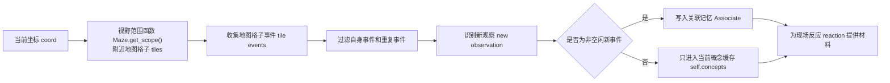

*图 17-1：智能体感知函数 `Agent.percept()` 数据流。感知不是读取全局世界，而是在空间范围内把附近事件转成角色自己的观察。*

为了把这条链路落回真实项目材料，第 17-23 章共用一个证据脚手架。它不调用大语言模型 LLM，也不发起向量嵌入 embedding 请求，只读取本地配置、源码、已有回放结果和压缩结果：

```bash
python docs/book/scaffolds/part_03/ch17_23_part03_evidence.py
```

本章相关输出如下：

```text
chapter17 percept: coord=(119, 24), scope_count=289, same_arena_tiles=67, events_in_same_arena=3
trace: docs/book/assets/chapter_17/ch17_perception_trace.json
figure: docs/book/assets/chapter_17/ch17_perception_funnel.png
```

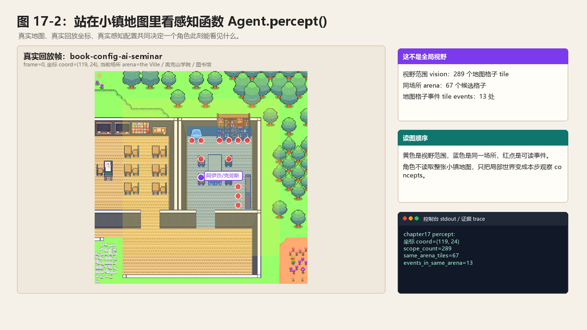

*图 17-2：站在小镇地图里看智能体感知函数 `Agent.percept()`。图中的坐标来自第 13 章移动回放文件 `movement.json`，黄色区域是视野范围 vision，蓝色区域是同一场所 arena，红点是可读地图格子事件 tile events。*

这行输出可以直接映射回源码：

| 输出片段 | 对应源码或文件 | 读法 |
| --- | --- | --- |
| `coord=(119, 24)` | 回放移动文件 `movement.json` | 这是阿伊莎和克劳斯在第 13 章实验中出现过的真实回放坐标，不是另造的示例坐标。 |
| `scope_count=289` | 视野范围函数 `Maze.get_scope()` 与 `vision_r=8` | `17 x 17` 个地图格子 tiles 先进入候选范围。 |
| `same_arena_tiles=67` | 智能体感知函数 `Agent.percept()` 的场所 arena 过滤 | 289 个候选格子里，只有同一图书馆场所的 67 个格子继续参与事件收集。 |
| `events_in_same_arena=3` | 地图格子事件 `tile.get_events()` | 这一帧同场所内有书架、图书馆桌子、图书馆沙发三个对象事件进入后续排序与截断。 |

## 17.2 感知不是全局读取

在多智能体仿真中，感知必须受限。如果每个智能体 agent 都能读取全局状态，那么：

- 伊莎贝拉不用邀请别人，所有人都能知道派对。
- 山姆不用竞选传播，所有人都能知道他参选。
- 克劳斯和玛丽亚不用相遇，也能知道彼此状态。
- 信息扩散不再是社会现象，而是全局共享变量。

因此，Generative Agents 让智能体 agent 只感知附近区域。这一点对应论文中的观察机制：智能体 agent 只能根据自身所在环境观察到局部事件。局部感知是社会涌现的前提。信息之所以能扩散，是因为它一开始不在每个人那里。关系之所以能形成，是因为角色需要相遇、对话和记忆。

## 17.3 智能体感知函数 Agent.percept() 的入口

`Agent.percept()` 位于：

```text
generative_agents/modules/agent.py
```

对应的源码结构如下：

```python
def percept(self):
    scope = self.maze.get_scope(self.coord, self.percept_config)
    # add spatial memory
    for tile in scope:
        if tile.has_address("game_object"):
            self.spatial.add_leaf(tile.address)
    events, arena = {}, self.get_tile().get_address("arena")
    # gather events in scope
    for tile in scope:
        ...
    events = list(sorted(events.keys(), key=lambda k: events[k]))
    # get concepts
    self.concepts, valid_num = [], 0
    for idx, event in enumerate(events[: self.percept_config["att_bandwidth"]]):
        ...
    self.concepts = [c for c in self.concepts if c.event.subject != self.name]
```

代码逻辑图：

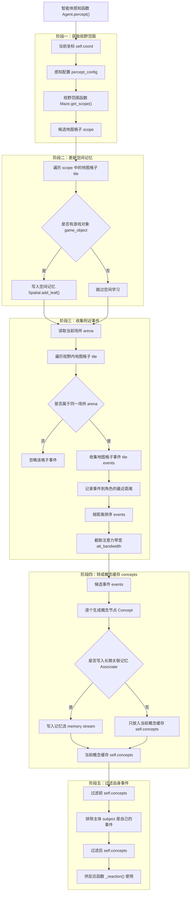

这段源码可以分成五段读：

1. 获取视野范围。
2. 更新空间记忆。
3. 收集附近事件。
4. 转成概念缓存 concepts。
5. 过滤自身事件。

每一段都影响后续行为。

## 17.4 感知数据结构：事件 Event

感知阶段处理的原始数据不是一段普通字符串，而是事件对象 `Event`。地图格子 tile 里保存的也是事件 Event；`percept()` 收集、排序、去重的也是事件 Event。源码位置在：

```text
generative_agents/modules/memory/event.py
```

代表性源码如下：

```python
class Event:
    def __init__(
        self,
        subject,
        predicate=None,
        object=None,
        address=None,
        describe=None,
        emoji=None,
    ):
        self.subject = subject
        self.predicate = predicate or "此时"
        self.object = object or "空闲"
        self._describe = describe or ""
        self.address = address or []
        self.emoji = emoji or ""

    def to_dict(self):
        return {
            "subject": self.subject,
            "predicate": self.predicate,
            "object": self.object,
            "describe": self._describe,
            "address": self.address,
            "emoji": self.emoji,
        }
```

这段代码说明，事件 Event 是一个主谓宾结构，同时带空间地址和展示符号。一个真实可读的事件可以写成：

```json
{
  "subject": "克劳斯",
  "predicate": "此时",
  "object": "阅读研究资料",
  "describe": "克劳斯此时阅读研究资料",
  "address": ["the Ville", "奥克山学院", "图书馆", "图书馆桌子"],
  "emoji": ""
}
```

字段含义如下：

| 字段 | 中文含义 | 读法 | 运行作用 |
| --- | --- | --- | --- |
| `subject` | 主体 subject | 谁或什么对象发生了状态变化。 | 感知过滤自身事件、判断是否看到其他智能体 agent。 |
| `predicate` | 谓词 predicate | 发生关系，例如 `此时`、`对话`、`正在`、`被占用`。 | 区分普通状态、对话和等待等行为。 |
| `object` | 宾语 object | 状态或对象，例如 `空闲`、`睡觉`、`阿伊莎`。 | 判断空闲事件，构造主谓宾描述。 |
| `describe` | 描述 describe | 更自然的一句话。 | 去重、检索和提示词 prompt 上下文主要使用它。 |
| `address` | 地址 address | 世界 world、区域 sector、场所 arena、游戏对象 game_object 组成的地址链。 | 场所 arena 过滤、回放和行动落地都依赖它。 |
| `emoji` | 表情符号 emoji | 前端显示用的动作或状态符号。 | 回放时展示角色或对象状态。 |

这里要特别区分两个 `object`。事件 Event 里的 `object` 是主谓宾里的宾语 object；地图地址里的 `game_object` 是空间层级里的游戏对象 game object。例如，“图书馆桌子 此时 空闲”中，`object="空闲"`，而 `game_object="图书馆桌子"`。

项目没有为事件 Event 单独定义一个枚举类型。事件的语义类型主要由 `predicate`、`object` 和后续记忆类型 `node_type` 共同判断。常见模式如下：

| 事件模式 | 典型来源 | 示例 | 感知阶段如何处理 |
| --- | --- | --- | --- |
| 空闲对象事件 | 地图初始化 `Tile.__init__()` | `图书馆沙发 此时 空闲` | 转成临时概念节点 Concept，通常不写入长期关联记忆 Associate。 |
| 角色行动事件 | 行动生成函数 `Agent.make_event()` | `克劳斯 此时 阅读研究资料` | 非空闲时写入关联记忆 Associate，类型通常是事件 event。 |
| 对象状态事件 | 行动对象事件 `obj_event` | `图书馆桌子 此时 被占用` | 让其他角色感知对象被使用或占用。 |
| 对话事件 | 对话写回函数 `schedule_chat()` | `伊莎贝拉 对话 阿伊莎` | 当前角色自己的对话写入聊天 chat；旁观他人对话时通常按事件 event 处理。 |
| 等待事件 | 等待函数 `_wait_other()` | `克劳斯 waiting to start 阅读资料` | 表示空间冲突下的等待行为。 |
| 计划或想法事件 | 日程初始化、反思函数 `reflect()` | `克劳斯 计划 20240213` | 通常在记忆章节中作为想法 thought 进入长期记忆。 |

感知阶段的数据流可以这样看：

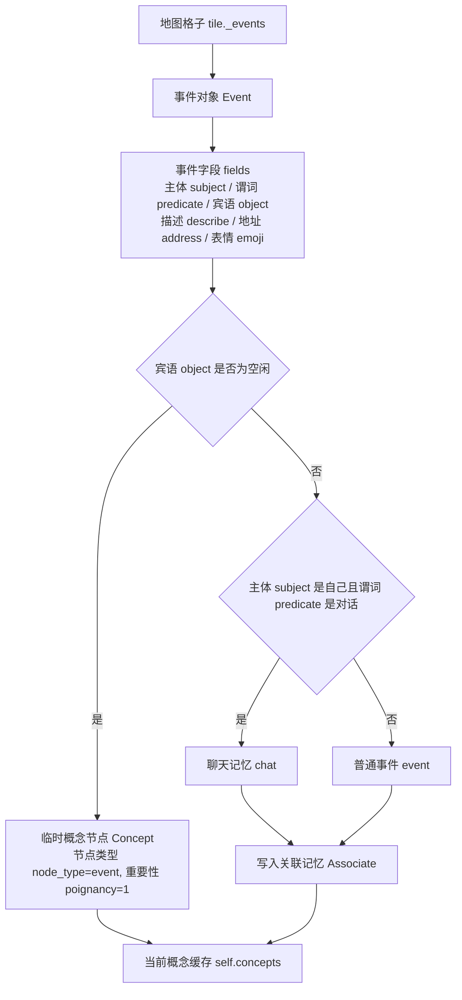

这张图是理解第 17 章的关键。`percept()` 从地图格子 tile 里拿到事件 Event，但当前行动真正使用的是概念节点 Concept。空闲事件只进入本步概念缓存 `self.concepts`，非空闲事件通常还会写入长期关联记忆 Associate。第 18 章继续展开的，就是这个 Concept 和 Associate 如何把一次感知变成长期记忆。

### 感知前的事件生成 prompt：看见的事件从哪里来

严格说，智能体感知函数 `Agent.percept()` 本身不调用大语言模型 LLM。它做的是空间过滤、事件收集、距离排序、去重和写入。可是它感知到的事件 Event 并不是凭空出现的。角色行动结束后，动作生成 `_determine_action()` 会把当前日程计划变成角色事件 event 和对象事件 obj_event：

```python
event = self.make_event(self.name, describes[-1], address)
obj_describe = self.completion("describe_object", address[-1], describes[-1])
obj_event = self.make_event(address[-1], obj_describe, address)
```

这段代码说明，当前项目里有两类事件生成方式。角色事件 event 由 `make_event()` 用代码解析生成；对象事件 obj_event 的状态描述由物品状态提示词 `describe_object` 生成。旁边的智能体 agent 后续在 `percept()` 中看到的，往往就是这些事件。

**物品状态 describe_object**

中文原版：

```text
任务：用不超过10个字的短句，描述某人身边物品的状态。注意：只输出物品的状态描述，不要包含物品名称。

示例：

一步一步地思考 烤箱 的状态：
步骤1：山姆正在 烤箱 旁边吃早餐。
步骤2：描述 烤箱 的状态。
输出：正在加热以烹饪早餐

一步一步地思考 电脑 的状态：
步骤1：迈克正在用 电脑 写电子邮件。
步骤2：描述 电脑 的状态。
输出：正在用于编写电子邮件

一步一步地思考 水槽 的状态：
步骤1：汤姆正在用 水槽 洗脸。
步骤2：描述 水槽 的状态。
输出：正在进水

根据上述示例，一步一步思考 ${object} 的状态：
步骤1：${agent} 正在 ${action}，身边是 ${object}
步骤2：描述 ${object} 的状态。
输出：
```

英文版本 English version：

```text
Task: Describe the state of an object near a person in a short phrase of no more than 10 Chinese characters. Output only the object's state description, and do not include the object's name.

Examples:

Think step by step about the state of the oven:
Step 1: Sam is eating breakfast next to the oven.
Step 2: Describe the state of the oven.
Output: heating up to cook breakfast

Think step by step about the state of the computer:
Step 1: Mike is using the computer to write emails.
Step 2: Describe the state of the computer.
Output: being used to write emails

Think step by step about the state of the sink:
Step 1: Tom is using the sink to wash his face.
Step 2: Describe the state of the sink.
Output: filling with water

Based on the examples above, think step by step about the state of ${object}:
Step 1: ${agent} is ${action}, and ${object} is nearby
Step 2: Describe the state of ${object}.
Output:
```

这个提示词 prompt 的输入是物品 object、角色 agent 和动作 action，输出结构 schema 是一个短字符串 `str`。它的作用不是让角色“看见”物品，而是把角色行动转成别人能看见的对象状态。例如克劳斯在图书馆桌子前写论文时，物品状态 prompt 可以生成：

```text
上面放着写作用的纸笔
```

于是世界里会出现对象事件：

```json
{
  "subject": "图书馆桌子",
  "predicate": "此时",
  "object": "上面放着写作用的纸笔",
  "address": ["the Ville", "奥克山学院", "图书馆", "图书馆桌子"]
}
```

其他角色感知到这条对象事件时，并不知道背后调用过 prompt；它们只会把它当成地图格子 tile 暴露出来的事件 Event。这样，提示词 prompt 的输出就进入了可被感知的世界状态。

项目里还保留了动作三元组提示词 `describe_event` 和表情提示词 `describe_emoji`，但当前 `Agent.make_event()` 中这两段调用是注释状态：

```python
# emoji = self.completion("describe_emoji", describe)
# return self.completion(
#     "describe_event", subject, subject + describe, address, emoji
# )
```

所以读第 17 章时要抓住边界：当前真实感知链路不是“每条 Event 都由 prompt 生成”。真实运行中，感知函数本体不调模型；对象状态 obj_event 会用 `describe_object`；非空闲事件写入长期记忆前，还会用重要性评分 prompt。

## 17.5 视野范围函数 Maze.get_scope()

感知流程的第一步如下：

```python
scope = self.maze.get_scope(self.coord, self.percept_config)
```

`percept_config` 来自 `data/config.json`：

```json
{
  "mode": "box",
  "vision_r": 8,
  "att_bandwidth": 8
}
```

当前实现支持方形 `box` 模式。`Maze.get_scope()` 会取当前坐标周围一个方形区域。如果 `vision_r = 8`，理论上视野是：

```text
(2 * 8 + 1) x (2 * 8 + 1)
```

也就是 17 x 17 个地图格子 tile。同时会裁剪地图边界，避免坐标越界。这只是候选范围。后面还会根据场所 arena 和注意力带宽 attention bandwidth 继续过滤。

代码逻辑图：

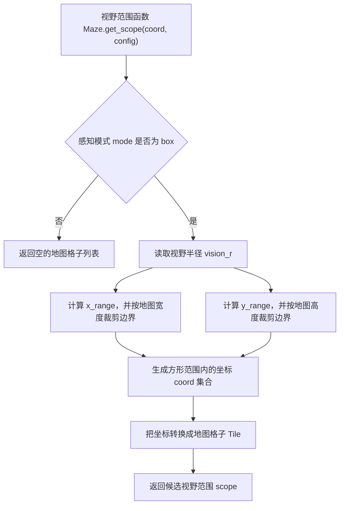

这张图要注意两个点。第一，当前项目只实现方形视野 box；如果感知模式 mode 不是 `box`，候选坐标会保持为空。第二，`x_range` 和 `y_range` 会用地图边界裁剪，角色站在地图边缘时不会访问越界坐标。

## 17.6 方形视野的工程取舍

当前视野是方形 box，不是圆形。这是一种工程简化。方形视野实现简单，计算成本低，也足够支持小镇仿真。但它并不等于真实视觉。真实视觉会受方向、遮挡、墙、距离衰减、光线等影响。当前项目没有模拟这些。这意味着：

- 智能体 agent 可能看到方形边角处的事件。
- 智能体 agent 不区分正前方和身后。
- 智能体 agent 不做视线遮挡。

这些都是可接受的简化。因为项目重点不是物理感知，而是记忆、计划、反思和社会互动。

## 17.7 感知顺便更新空间记忆

拿到视野范围 scope 后，`percept()` 会先更新空间记忆 `Spatial`：

```python
for tile in scope:
    if tile.has_address("game_object"):
        self.spatial.add_leaf(tile.address)
```

代码逻辑图：

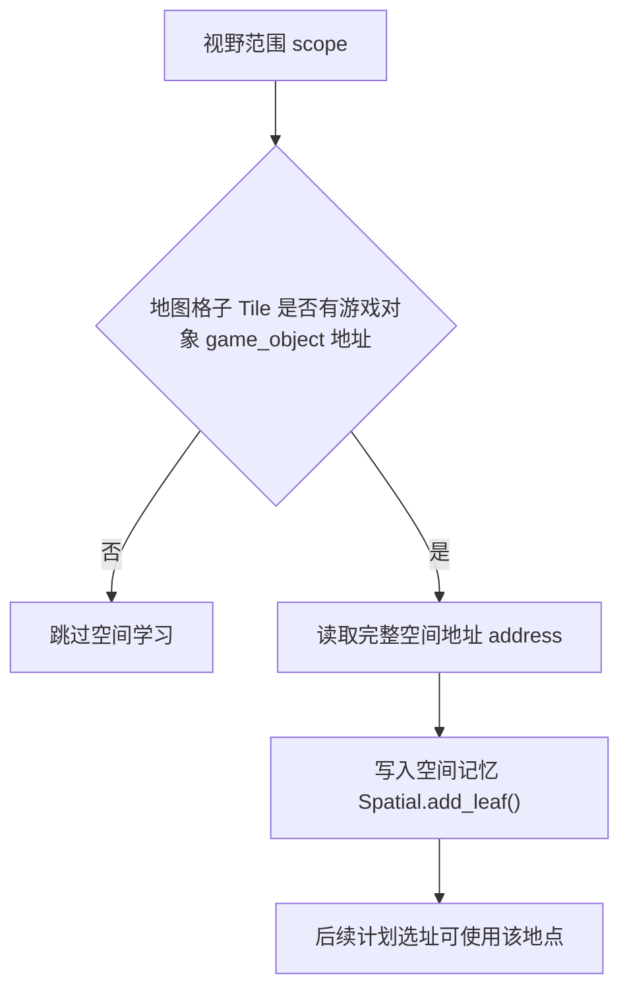

这一步很容易被忽略。它说明感知不仅产生事件记忆，也会扩展空间记忆。如果智能体 agent 看到某个游戏对象 game object，它就把该对象地址加入自己的空间树 spatial tree。例如，角色进入霍布斯咖啡馆附近，看到：

```text
the Ville -> 霍布斯咖啡馆 -> 咖啡馆 -> 钢琴
```

它后续就知道咖啡馆里有钢琴。这类空间学习不进入关联记忆 `Associate`，而是进入空间记忆 `Spatial`。这再次说明项目中的“记忆”有多层：

```text
空间记忆 Spatial：哪里有什么。
关联记忆 Associate：发生了什么、聊了什么、想到了什么。
日程 Schedule：今天要做什么。
```

## 17.8 场所 arena 过滤

收集事件前，代码先取当前场所 arena：

```python
events, arena = {}, self.get_tile().get_address("arena")
```

然后遍历视野范围 scope：

```python
for tile in scope:
    if not tile.events or tile.get_address("arena") != arena:
        continue
```

代码逻辑图：

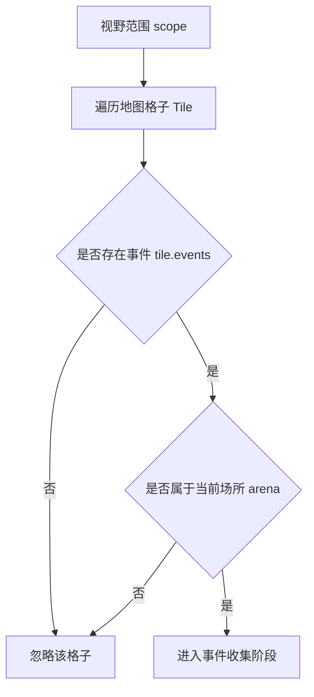

这意味着，即使某个地图格子 tile 在视野方框内，如果它不属于当前场所 arena，也不会被感知。它避免隔墙感知。例如，角色站在宿舍房间里，方形视野可能覆盖隔壁房间或走廊。如果只按距离，角色可能看到墙后的人。场所 arena 过滤用语义区域限制感知。它不是完美视线模拟，但比单纯距离更合理。

## 17.9 收集地图格子事件 tile events

通过场所 arena 过滤后，系统读取地图格子事件 tile events：

```python
dist = math.dist(tile.coord, self.coord)
for event in tile.get_events():
    if dist < events.get(event, float("inf")):
        events[event] = dist
```

这里 `events` 是一个字典 dict：

```text
Event -> 最近距离
```

代码逻辑图：

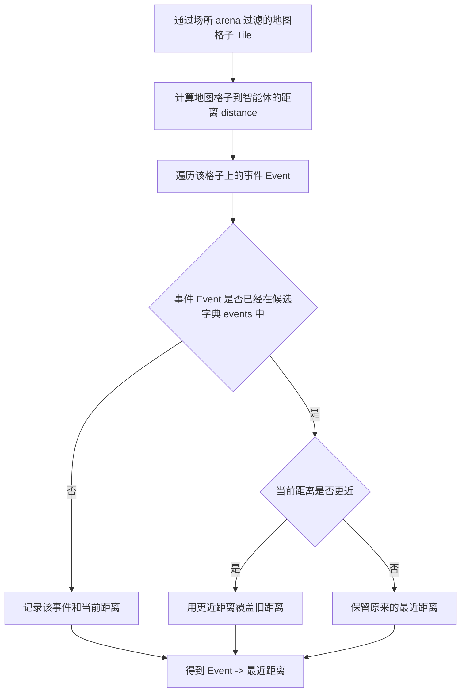

如果同一个事件 event 出现在多个地图格子 tile 上，只保留最近距离。这很合理。例如，同一个游戏对象 game object 可能对应多个地图格子 tile，同一个对象事件可能出现在多个坐标上。智能体 agent 只需要知道这个事件存在，不需要重复记录多次。使用事件对象 Event 作为字典键 dict key，依赖 `Event.__hash__()` 和 `Event.__eq__()`。`Event.__hash__()` 包含：

```python
self.subject
self.predicate
self.object
self._describe
":".join(self.address)
```

主体 subject、谓词 predicate、宾语 object、描述 describe、地址 address 都相同，才认为是同一事件。

## 17.10 距离排序与注意力带宽

收集完成后会继续处理：

```python
events = list(sorted(events.keys(), key=lambda k: events[k]))
```

事件按距离排序。越近越先处理。然后只处理前 `att_bandwidth` 个：

```python
for idx, event in enumerate(events[: self.percept_config["att_bandwidth"]]):
```

代码逻辑图：

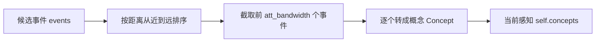

当前默认 `att_bandwidth = 8`。这代表智能体 agent 的注意力有限。即使附近有很多事件，它也只能关注一部分。这很符合论文思想。如果智能体 agent 每一步都记住视野中所有事件，记忆流会膨胀，角色也会过度敏感。注意力带宽 attention bandwidth 让感知更接近人类有限注意。

## 17.11 去重：避免重复写入记忆

对每个候选事件 event，代码先取近期记忆：

```python
recent_nodes = (
    self.associate.retrieve_events() + self.associate.retrieve_chats()
)
recent_nodes = set(n.describe for n in recent_nodes)
```

然后判断这条事件描述是否已经在近期记忆里：

```python
if event.get_describe() not in recent_nodes:
```

如果近期已经有同样描述，就不重复处理。这避免智能体 agent 每一步都把同一个附近事件重复写入记忆流 memory stream。例如，克劳斯连续几步坐在书桌前读书。玛丽亚每一步都看到同一事件，如果不去重，她的记忆里会塞满重复记录：

```text
克劳斯正在读书。
克劳斯正在读书。
克劳斯正在读书。
```

去重让记忆更干净。不过，这里是基于描述字段 `describe` 文本去重，不是基于事件 ID event id。如果同一事件描述略有变化，仍然可能重复。这是一个工程边界。

## 17.12 空闲事件如何处理

如果事件 event 是空闲：

```python
if event.object == "idle" or event.object == "空闲":
    node = Concept.from_event(
        "idle_" + str(idx), "event", event, poignancy=1
    )
```

代码逻辑图：

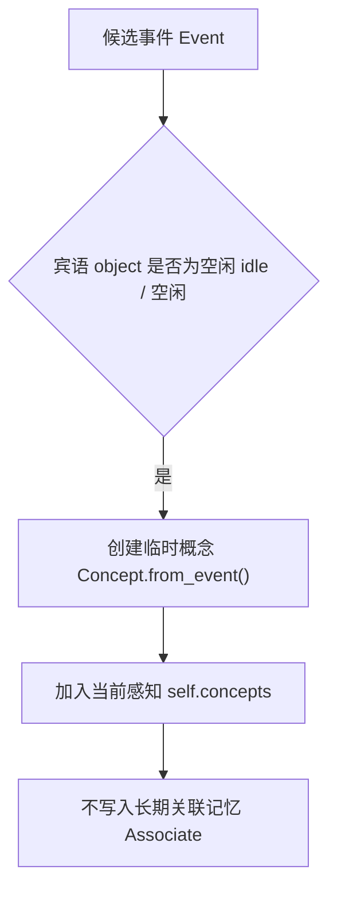

这类事件 event 会被转成临时概念节点 Concept，但不会写入关联记忆 `Associate`。它仍然可以出现在 `self.concepts` 中，供当前仿真步 step 使用。但它不会成为长期记忆。这很合理。空闲状态通常没有长期记忆价值。如果每个空闲对象都写入记忆流 memory stream，记忆会迅速膨胀。因此，项目区分了：

```text
临时感知概念 temporary concept
长期记忆概念 memory concept
```

空闲事件属于临时感知概念 temporary concept。

## 17.13 非空闲事件如何写入记忆

非空闲事件会进入 `_add_concept()`：

```python
valid_num += 1
node_type = "chat" if event.fit(self.name, "对话") else "event"
node = self._add_concept(node_type, event)
self.status["poignancy"] += node.poignancy
```

代码逻辑图：

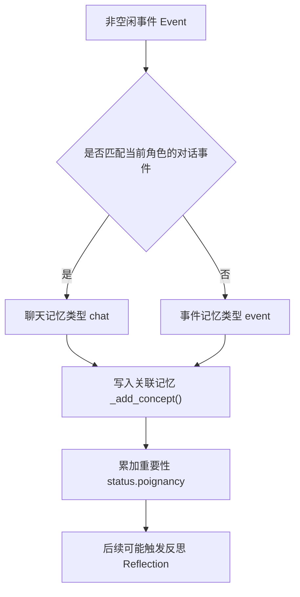

这里有三个动作。第一，判断节点类型 node_type。如果事件是当前智能体 agent 与别人对话，类型是聊天 chat。否则是普通事件 event。第二，写入关联记忆 Associate。`_add_concept()` 会调用：

```python
self.associate.add_node(...)
```

第三，累积重要性 poignancy。重要事件会推动反思 reflection 触发。这就是感知与反思之间的连接。智能体 agent 不是凭空反思，而是因为看到、听到、经历了一些重要事件。

## 17.14 概念写入函数 _add_concept() 与重要性评分

`_add_concept()` 根据事件类型给重要性 poignancy。空闲事件给 1。聊天 chat 使用：

```python
poignancy_chat
```

其他事件使用下面方法：

```python
poignancy_event
```

对应代码可以这样定位：

```python
elif e_type == "chat":
    poignancy = self.completion("poignancy_chat", event)
else:
    poignancy = self.completion("poignancy_event", event)
```

然后写入关联记忆 Associate：

```python
return self.associate.add_node(
    e_type,
    event,
    poignancy,
    create=create,
    expire=expire,
    filling=filling,
)
```

代码逻辑图：

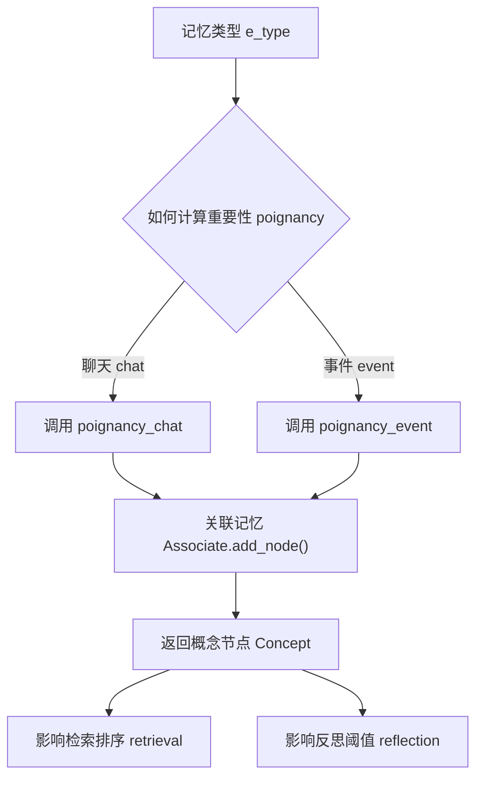

这说明感知不是简单记录。每条进入记忆流 memory stream 的事件都会带重要性分数。这个分数后续影响：

- 检索 retrieval 排序。
- 反思 reflection 触发。
- 记忆解释。

### 感知写入前的评分 prompt：poignancy 如何决定反思强度

第 17 章讲感知，重要性评分 prompt 必须放在这里看。原因很直接：`percept()` 看到非空闲新事件后，会立刻调用 `_add_concept()`；而 `_add_concept()` 会先给事件打重要性字段 poignancy，再写入关联记忆 Associate。也就是说，感知输出不是“看见了就完了”，而是会被压成一个带强度的记忆节点。

**事件重要性 poignancy_event**

中文原版：

```text
${base_desc}

在1到10的范围内评分，评分原则：
1代表极其平常，例如刷牙、整理床铺等普通事件；
10代表极其特殊或强烈，令人印象深刻，例如分手、大学录取等特殊事件。
每个事件只能用1到10的整数表示。例如：
事件：刷牙。评分：1
事件：整理床铺。评分：1
事件：分手。评分：10
事件：大学录取。评分：10

以下是 ${agent} 需要评分的一个完整事件：
"""
${event}
"""
评分：<分数>

根据完整事件填写<分数>。
格式要求：只在1到10范围内输出1个数字，不要输出数字以外的任何内容。
```

英文版本 English version：

```text
${base_desc}

Rate the event on a scale from 1 to 10:
1 means extremely ordinary, such as brushing teeth or making the bed;
10 means extremely special or emotionally intense, such as a breakup or college admission.
Each event must be represented by one integer from 1 to 10. For example:
Event: brushing teeth. Rating: 1
Event: making the bed. Rating: 1
Event: breakup. Rating: 10
Event: college admission. Rating: 10

Here is the complete event that ${agent} needs to rate:
"""
${event}
"""
Rating: <score>

Fill in <score> based on the complete event.
Format requirement: output only one number from 1 to 10, with no extra text.
```

这个提示词 prompt 的输入是角色基础描述 base_desc、智能体 agent 和完整事件 event，输出结构 schema 是整数 `int`。设计重点是“只输出一个数字”。这样后续代码能直接把分数写入元数据 metadata：

```text
poignancy -> metadata["poignancy"] -> importance -> retrieval ranking
```

它同时影响反思阈值：

```text
poignancy -> status["poignancy"] -> reflect()
```

所以第 17 章里的感知强度，最终会在第 18 章的检索 ranking 和第 18 章的反思 reflection 中继续发挥作用。

**对话重要性 poignancy_chat**

中文原版：

```text
${base_desc}

在1到10的范围内评分，评分原则：
1代表极其平常，例如早上的日常问候；
10代表极其特殊或强烈，令人印象深刻，例如关于分手、争吵的对话。
每个对话只能用1到10的整数表示。例如：
对话：早上的日常问候。评分：1
对话：关于分手、争吵的对话。评分：10

以下是 ${agent} 需要评分的一场完整对话：
"""
${event}
"""
评分：<分数>

根据完整事件填写<分数>。
格式要求：只在1到10范围内输出1个数字，不要输出数字以外的任何内容。
```

英文版本 English version：

```text
${base_desc}

Rate the conversation on a scale from 1 to 10:
1 means extremely ordinary, such as a routine morning greeting;
10 means extremely special or emotionally intense, such as a conversation about a breakup or argument.
Each conversation must be represented by one integer from 1 to 10. For example:
Conversation: routine morning greeting. Rating: 1
Conversation: conversation about a breakup or argument. Rating: 10

Here is the complete conversation that ${agent} needs to rate:
"""
${event}
"""
Rating: <score>

Fill in <score> based on the complete event.
Format requirement: output only one number from 1 to 10, with no extra text.
```

对话重要性 poignancy_chat 用于聊天 chat 记忆。它解释了为什么一次普通寒暄和一次派对邀请不会在记忆系统里拥有同样权重。感知到的对话越重要，越容易被检索出来，也越容易推动角色反思。

这一段的输入、处理、输出闭环如下：

| 环节 | 内容 |
| --- | --- |
| 输入 | 非空闲事件 Event，或当前角色参与的对话事件 chat。 |
| 处理逻辑 | 调用重要性评分 prompt，只让模型输出 1-10 的整数。 |
| 输出 | 带 `poignancy` 的概念节点 Concept；分数写入关联记忆 Associate，并累加到 `status["poignancy"]`。 |

## 17.15 概念缓存 self.concepts 的作用

处理完事件后，概念节点 Concept 会加入：

```python
self.concepts.append(node)
```

最后会过滤自身事件：

```python
self.concepts = [c for c in self.concepts if c.event.subject != self.name]
```

`self.concepts` 是当前仿真步 step 感知结果。它不是长期记忆本身。长期记忆在关联记忆 `Associate` 中。`self.concepts` 主要服务当前仿真步 step 的现场反应 reaction。例如 `_reaction()` 会从 `self.concepts` 中选焦点 focus：

```python
priority = [i for i in self.concepts if i.event.subject in agents]
```

因此，感知结果马上影响当前行为。如果看到别人，可能聊天。如果看到对象占用，可能等待。如果没看到重要事件，就继续按计划行动。

## 17.16 过滤自身事件

最后会执行下面过滤：

```python
c.event.subject != self.name
```

因为智能体 agent 自己的事件也在地图格子 tile 上。如果不滤掉，它可能把自己当前行为当成外部事件来反应。例如，克劳斯正在读书。他的地图格子 tile 上有：

```text
克劳斯此时读书
```

如果不排除，克劳斯可能“感知到克劳斯正在读书”，再把它作为反应焦点 reaction focus。这没有意义。过滤自身事件让现场反应 reaction 主要面向外部世界。

## 17.17 感知日志

`percept()` 最后记录：

```python
self.logger.info(
    "{} percept {}/{} concepts".format(self.name, valid_num, len(self.concepts))
)
```

这里有两个数字。`valid_num` 是写入长期记忆的非空闲事件数量。`len(self.concepts)` 是当前仿真步 step 可用于反应的概念缓存 concepts 数量。两者可能不同。例如，空闲事件不会写入长期记忆，但可能进入 `self.concepts`。调试时，如果看到：

```text
克劳斯 percept 0/3 concepts
```

说明他看到 3 个概念缓存项 concepts，但没有新的非空闲事件写入长期记忆。如果看到：

```text
玛丽亚 percept 2/2 concepts
```

说明她看到并写入了 2 个新事件。

## 17.18 感知如何驱动信息扩散

信息扩散依赖感知。以情人节派对为例。伊莎贝拉与阿伊莎对话后，地图格子 tile 上可能出现对话事件。附近角色如果在同一场所 arena 且注意力范围内，就可能感知到：

```text
伊莎贝拉 对话 阿伊莎
```

该事件进入记忆流 memory stream 后，角色可能在后续对话中提到派对。这条链路是：

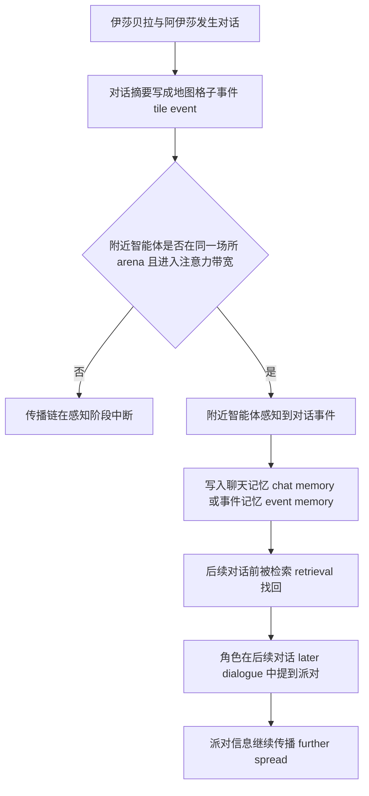

如果感知失败，传播链就会断。因此，复现实验时，不只要看谁说了什么，还要看旁观者是否在正确时间和地点感知到事件。

## 17.19 感知如何驱动关系形成

关系形成也依赖感知。克劳斯和玛丽亚形成关系，首先必须相遇或互相观察。如果克劳斯看到了玛丽亚：

```text
玛丽亚此时在咖啡馆学习
```

这个事件 event 可能进入克劳斯的记忆 memory。如果随后触发对话，对话摘要会进入聊天记忆 chat memory。之后反思 reflection 可能生成想法 thought：

```text
克劳斯认为玛丽亚喜欢探索新想法。
```

这一切的入口是感知。没有感知，就没有共享经历 shared experience。没有共享经历 shared experience，关系只能来自初始设定，而不是仿真涌现。

## 17.20 感知如何驱动反思

反思触发依赖 `status["poignancy"]`。而 `poignancy` 的主要来源之一就是感知到的新事件。`percept()` 中：

```python
self.status["poignancy"] += node.poignancy
```

`reflect()` 中：

```python
if self.status["poignancy"] < self.think_config["poignancy_max"]:
    return
```

代码逻辑图：

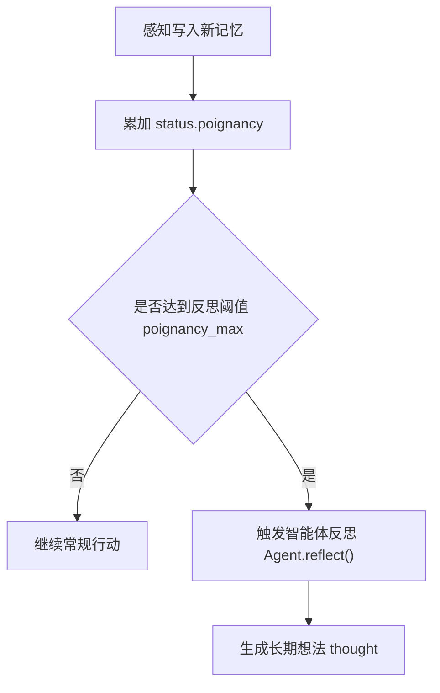

这说明下面这个问题：

```text
重要事件积累
  -> poignancy 上升
  -> 达到阈值
  -> 反思 reflection
```

如果智能体 agent 一直只看到空闲事件，就不会触发深层反思。如果智能体 agent 经历密集社交、冲突、邀请、计划变化，重要性 poignancy 会更快累积。这让反思与经历强度相关。

## 17.21 当前感知机制的边界

当前感知机制有几个边界。第一，视野是方形。它不模拟方向、遮挡和真实视线。第二，场所 arena 过滤是语义近似。它避免隔墙感知，但不处理门、窗、开放空间和声音传播。第三，事件去重基于描述 describe。描述变化会导致重复，描述相同但语义时间不同也可能被忽略。第四，注意力带宽 attention bandwidth 固定。不同角色没有不同注意力能力。第五，感知写入缺少显式证据链。虽然记忆节点 memory node 有元数据 metadata，但当前没有单独记录“我是在哪个地图格子 tile、以什么距离感知到的”。第六，旁观对话的语义有限。如果地图格子 tile 上只有对话摘要，旁观者不一定能得到完整对话内容。这些边界会影响实验解释。

## 17.22 可改进方向

如果要升级感知模块，可以考虑五个方向。第一，加入视线遮挡。根据碰撞信息 collision、墙体和房间边界计算视线 line-of-sight。第二，区分视觉和听觉。对话可以在一定距离内被听到，但对象动作可能只能看到。第三，记录感知证据。为每条记忆 memory 增加来源 source：

```text
seen_at_coord
distance
arena
step
```

第四，角色差异化感知。不同角色可以有不同视野半径 vision_r、注意力带宽 att_bandwidth 或社交注意力。第五，事件摘要层次化。旁观者看到“有人在聊天”与参与者记录完整对话，应有不同记忆粒度。这些方向会在第五部分前沿升级中再次出现。

## 17.23 如何调试感知

调试感知时建议按下面步骤。第一，确认智能体 agent 坐标。看断点 checkpoint 中 `coord`。第二，确认当前地图格子 tile 地址。看 `Game.agent_think()` 的摘要 summary 中 `address`。第三，检查 `percept_config`。特别是：

```text
vision_r
att_bandwidth
mode
```

第四步看感知日志：

```text
<agent> percept <valid>/<concepts> concepts
```

第五，查看智能体记忆 agent memory。看 `associate.event` 和 `associate.chat` 是否新增。第六，确认候选事件 events 是否在同一场所 arena。如果两个角色很近但不在同一场所 arena，当前实现不会感知对方。第七，检查是否被去重。如果事件已经存在于近期记忆 recent memory，就不会重复写入。

调试路径可以画成下面这张图：

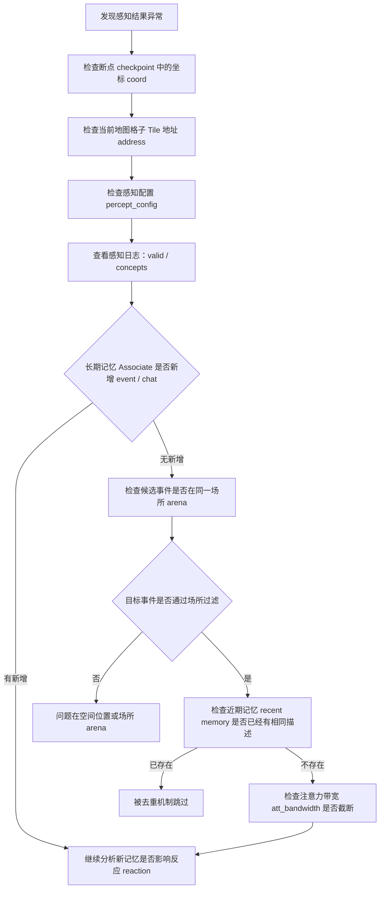

## 17.24 本章小结

感知是智能体和世界发生关系的入口。智能体 agent 不是全知地读取所有状态，而是在有限空间范围内看到附近事件，并把有意义的观察写入记忆。

| 本章内容 | 核心结论 |
| --- | --- |
| 调用位置 | 感知发生在 `Agent.think()` 中，先于计划和反思。 |
| 感知数据 | 地图格子 tile 中保存事件 Event，事件由主体 subject、谓词 predicate、宾语 object、描述 describe、地址 address 和表情 emoji 组成。 |
| 视野范围 | `Maze.get_scope()` 根据坐标和 `percept_config` 取得方形视野。 |
| 空间学习 | 感知会把游戏对象 game object 地址加入空间记忆 `Spatial`。 |
| 场所 arena 限制 | 系统只收集同一场所 arena 内的地图格子事件 tile events。 |
| 注意力带宽 | 事件按距离排序，并受 `att_bandwidth` 限制。 |
| 去重机制 | 事件对象 Event 通过哈希 hash 去重，同一事件只保留最近距离。 |
| 写入规则 | 空闲事件只生成临时概念节点 Concept，非空闲事件才写入关联记忆 `Associate`。 |
| 感知相关 prompt | 感知函数本体不调大语言模型 LLM；对象状态事件可由 `describe_object` 生成，非空闲事件写入前会调用 `poignancy_event` 或 `poignancy_chat` 评分。 |
| 反思触发 | 新事件会累积 `status["poignancy"]`，推动反思 reflection。 |
| 反应材料 | `self.concepts` 保存当前仿真步 step 的感知结果，主要服务现场反应 reaction。 |
| 工程边界 | 当前感知是简化模型，不是完整物理视觉系统。 |

下一章讲记忆：深入关联记忆 `Associate`、概念节点 `Concept`、向量索引 `LlamaIndex`、关联记忆检索器 `AssociateRetriever`，看事件、对话和想法 thought 如何存储、检索、过期并参与行为生成。

## 参考资料

- Local source: `generative_agents/modules/agent.py`
- Local source: `generative_agents/modules/prompt/scratch.py`
- Local source: `generative_agents/modules/maze.py`
- Local source: `generative_agents/modules/memory/event.py`
- Local source: `generative_agents/modules/memory/associate.py`
- Local prompts: `generative_agents/data/prompts/describe_object.txt`
- Local prompts: `generative_agents/data/prompts/describe_event.txt`
- Local prompts: `generative_agents/data/prompts/describe_emoji.txt`
- Local prompts: `generative_agents/data/prompts/poignancy_event.txt`
- Local prompts: `generative_agents/data/prompts/poignancy_chat.txt`
- Local config: `generative_agents/data/config.json`
- Local checkpoint: `generative_agents/results/checkpoints/book-smoke/simulate-20240213-1000.json`
- Local scaffold: `docs/book/scaffolds/part_03/ch17_23_part03_evidence.py`
- Local trace: `docs/book/assets/chapter_17/ch17_perception_trace.json`
