# 第 18 章 记忆：事件、对话、想法如何存储和检索

## 18.1 核心问题

第 17 章讲感知，并把感知侧的数据结构落到事件 Event：地图格子 tile 暴露事件 Event，智能体感知函数 `percept()` 再把事件 Event 包装成概念节点 Concept，放入当前概念缓存 `self.concepts`。如果这些感知结果不存下来，它们只能影响当前仿真步 step。生成式智能体 Generative Agents 的关键是让经历进入长期行为链路。

先看一个真实案例。`book-smoke` 这次仿真运行到 2024-02-13 09:40 时，克劳斯在奥克山学院图书馆桌子旁阅读并批注学术文章。业务上，这不是一条“日志”，而是一段经历：克劳斯在什么地方，做了什么，这件事后来能不能被他想起来。

输入事件 Event 可以这样读：

```json
{
  "subject": "克劳斯",
  "predicate": "此时",
  "object": "阅读并批注选中的学术文章",
  "describe": "克劳斯 阅读并批注选中的学术文章",
  "address": ["the Ville", "奥克山学院", "图书馆", "图书馆桌子"]
}
```

这条输入事件 Event 进入记忆系统后，业务处理过程如下：

| 业务环节 | 项目里的结果 | 读法 |
| --- | --- | --- |
| 识别经历 | 克劳斯正在图书馆桌子旁阅读并批注文章。 | 这是一条关于克劳斯自己的行动经历。 |
| 归入记忆类型 | 节点类型 `node_type = event`。 | 它不是对话 chat，也不是想法 thought，而是事件 event。 |
| 补充地点 | 地址 address 为 `the Ville:奥克山学院:图书馆:图书馆桌子`。 | 后续能知道这件事发生在图书馆桌子旁。 |
| 补充时间 | 创建时间 create 和访问时间 access 都是 `20240213-09:40:00`。 | 这条经历从 09:40 开始进入克劳斯记忆。 |
| 补充重要性 | 重要性字段 poignancy 为 `2`。 | 它有一定重要性，但不是强烈人生事件。 |
| 生成记忆身份 | 节点编号 node id 为 `node_2`。 | 后续断点 checkpoint 不重复保存整段文本，只保存这个编号。 |

输出记忆不是一句裸文本，而是一条可检索的记忆节点：

```json
{
  "node_id": "node_2",
  "text": "克劳斯 阅读并批注选中的学术文章",
  "metadata": {
    "node_type": "event",
    "subject": "克劳斯",
    "predicate": "此时",
    "object": "阅读并批注选中的学术文章",
    "address": "the Ville:奥克山学院:图书馆:图书馆桌子",
    "poignancy": 2,
    "create": "20240213-09:40:00",
    "expire": "20240314-09:40:00",
    "access": "20240213-09:40:00"
  }
}
```

到 10:00 断点 checkpoint 中，克劳斯的事件 event 记忆列表已经变成：

```json
{
  "event": ["node_5", "node_4", "node_3", "node_2", "node_1"],
  "thought": ["node_0"],
  "chat": []
}
```

这组结果要从业务角度读。`node_2` 代表“克劳斯在 09:40 阅读并批注学术文章”这段经历；`node_5`、`node_4`、`node_3` 是后来 10:00 左右新增的经历，所以排在它前面。后续如果系统需要回答“克劳斯上午在图书馆做过什么”“他为什么会继续写论文”，记忆检索就可以把这些节点找回来，变成提示词 prompt 上下文。

带着这个案例，再看生成式智能体 Generative Agents 的长期记忆系统，就不只是看类名了。它主要由四个对象组成：

```text
事件 Event
  -> 概念节点 Concept
  -> 关联记忆 Associate
  -> 向量索引 LlamaIndex
```

还有一个负责检索重排的对象：

```text
关联记忆检索器 AssociateRetriever
```

本章重点聚焦以下十个问题：

1. 事件 Event 与概念节点 Concept 有什么区别？
2. 记忆为什么分成事件 event、聊天 chat、想法 thought 三类？
3. 关联记忆写入函数 `Associate.add_node()` 如何写入记忆？
4. 记忆元数据 metadata 中保存了哪些信息？
5. 向量索引 LlamaIndex 在项目中承担什么职责？
6. 基础检索函数 `retrieve_events()`、`retrieve_chats()`、`retrieve_thoughts()` 怎么工作？
7. 多焦点检索函数 `retrieve_focus()` 如何实现论文三因素检索？
8. 记忆摘要、重要性评分、反思和状态更新提示词 prompt 如何参与记忆链路？
9. 记忆如何过期、清理和持久化？
10. 当前记忆系统有哪些边界和升级方向？

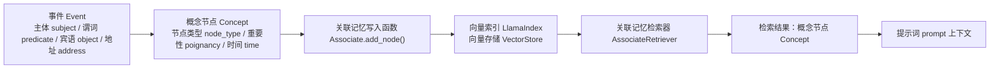

*图 18-1：事件 Event -> 概念节点 Concept -> 关联记忆 Associate -> 向量索引 LlamaIndex 的记忆链路。世界事件先被包装成带元数据的记忆节点，再进入每个角色自己的可检索记忆库。*

继续运行第 17-23 章共用证据脚手架，可以得到本章的记忆 trace：

```bash
python docs/book/scaffolds/part_03/ch17_23_part03_evidence.py
```

本章相关输出如下：

```text
chapter18 memory: memory_types=event,thought,chat, metadata_keys=node_type,subject,predicate,object,address,poignancy,create,expire,access, retrieval=final_score = recency + relevance + importance
trace: docs/book/assets/chapter_18/ch18_memory_trace.json
figure: docs/book/assets/chapter_18/ch18_memory_retrieval_chain.png
```

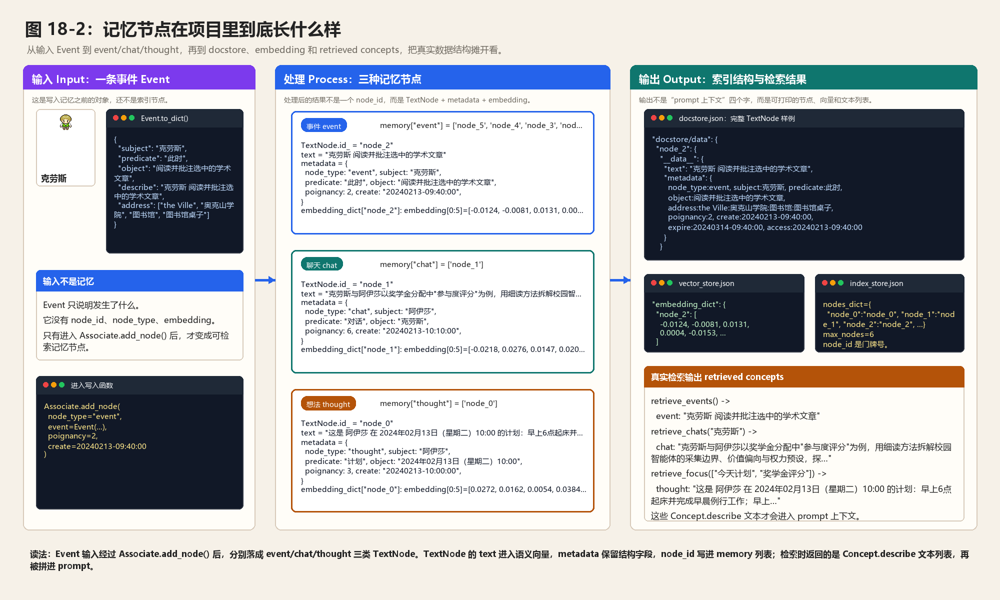

*图 18-2：记忆节点在项目里的真实数据剖面。左侧是输入事件 Event，中间展示事件 event、聊天 chat、想法 thought 三类记忆如何变成文本节点 TextNode、元数据 metadata 和向量嵌入 embedding，右侧展示文档存储 docstore、向量存储 vector store、索引存储 index store 的保存形态，以及检索后返回的概念描述 `Concept.describe`。*

图中的事件 event 样例来自 `book-smoke` 断点中克劳斯的关联记忆 Associate；聊天 chat 和想法 thought 样例来自 `book-config-ai-seminar` 断点中阿伊莎的关联记忆 Associate。右侧的 `docstore.json`、`default__vector_store.json` 和 `index_store.json` 都是对应角色存储目录里的真实索引文件。

这行输出可以这样读：

| 输出片段 | 对应源码或文件 | 读法 |
| --- | --- | --- |
| `memory_types=event,thought,chat` | `Associate.__init__()` | 每个角色自己的记忆按事件、想法、对话三类维护节点 node id 列表。 |
| `metadata_keys=...` | 关联记忆写入函数 `Associate.add_node()` | 真正写进向量索引的元数据 metadata 的字段是类型、主谓宾、地址、重要性和时间戳。 |
| `retrieval=final_score = recency + relevance + importance` | 关联记忆检索器 `AssociateRetriever._retrieve()` | 检索结果不是只按向量相似度返回，而是同时考虑新近性 recency、相关性 relevance 和重要性 importance。 |
| `ch18_memory_trace.json` | 证据跟踪 trace JSON | 证据跟踪 trace 里还记录了一个源码边界：反思证据 evidence 会传入 `_add_concept()`，但当前 `Associate.add_node()` 没把填充内容 `filling` 持久化到元数据 metadata。 |

## 18.2 记忆模块的源码位置

本章主要涉及三个文件：

```text
generative_agents/modules/memory/event.py
generative_agents/modules/memory/associate.py
generative_agents/modules/storage/index.py
generative_agents/modules/prompt/scratch.py
generative_agents/data/prompts/poignancy_*.txt
generative_agents/data/prompts/summarize_*.txt
generative_agents/data/prompts/reflect_*.txt
generative_agents/data/prompts/retrieve_*.txt
```

`event.py` 定义事件 Event。`associate.py` 定义概念节点 Concept、关联记忆检索器 AssociateRetriever 和关联记忆 Associate。`index.py` 封装向量索引 LlamaIndex 和向量嵌入提供方 embedding provider。`scratch.py` 和提示词 prompt 模板负责把记忆节点压缩成重要性评分、对话摘要、关系摘要、反思问题、反思洞察和新的当前状态 currently。它们的职责不同：

```text
事件 Event：描述发生了什么。
概念节点 Concept：把事件 Event 包装成记忆节点。
关联记忆 Associate：管理一个智能体 agent 的记忆列表和检索。
向量索引 LlamaIndex：底层向量索引与持久化。
关联记忆检索器 AssociateRetriever：按新近性 recency、重要性 importance、相关性 relevance 重新排序。
记忆提示词 prompt：把检索出的节点进一步压缩成评分、摘要、洞察和行为上下文。
```

读记忆模块时，要先分清这几个层次。否则很容易把“事件结构”“记忆节点”“向量索引”和“提示词摘要”混在一起。向量嵌入 embedding 负责把文本找回来，提示词 prompt 负责把找回来的文本变成角色能继续行动的理解。

本章高频术语先统一放在这里：

| 英文概念 | 中文锚点 | 在本章里的读法 |
| --- | --- | --- |
| `TextNode` | 文本节点 TextNode | 向量索引 LlamaIndex 保存一条记忆文本和元数据 metadata 的节点对象。 |
| `metadata` | 元数据 metadata | 记忆节点上的结构化字段，例如节点类型、地址、重要性和时间。 |
| `embedding` | 向量嵌入 embedding | 把记忆文本转换成向量，用于语义相似度检索。 |
| `docstore` | 文档存储 docstore | 本地保存文本节点 TextNode 的 JSON 文件。 |
| `vector store` | 向量存储 vector store | 本地保存节点编号到向量嵌入 embedding 的映射。 |
| `index store` | 索引存储 index store | 本地保存向量索引 LlamaIndex 的索引结构。 |
| `retriever` | 检索器 retriever | 根据查询文本 query 找回候选节点的组件。 |
| `query` | 查询文本 query | 用来检索记忆的一句话或关键词。 |
| `retention` | 保留数量 retention | 不传查询文本时最多取回的近期记忆条数。 |
| `focus` | 检索焦点 focus | 反思或计划阶段提出的检索问题。 |
| `reduce_all` | 结果合并参数 reduce_all | 控制多焦点检索结果是合并，还是按焦点分组返回。 |
| `access` | 访问时间 access | 记忆最近一次被检索出来的时间。 |
| `recency` | 新近性 recency | 越近期访问过的记忆分数越高。 |
| `relevance` | 相关性 relevance | 查询文本 query 与记忆文本的语义相似度。 |
| `importance` | 重要性 importance | 由重要性字段 poignancy 转换出来的检索分数。 |
| `poignancy` | 重要性字段 poignancy | 写入记忆时保存的主观重要程度。 |
| `summarize_chats` | 对话摘要 summarize chats | 把多轮对话压成一条聊天 chat 记忆。 |
| `summarize_relation` | 关系摘要 summarize relation | 根据相关记忆总结两个人之间的关系。 |
| `reflect_focus` | 反思焦点 reflect focus | 根据近期记忆生成需要思考的问题。 |
| `reflect_insights` | 反思洞察 reflect insights | 根据证据节点生成新的想法 thought。 |
| `retrieve_plan` | 计划提取 retrieve plan | 从检索记忆中提取会影响日程的计划描述。 |
| `retrieve_thought` | 想法提取 retrieve thought | 从检索记忆中压缩出当前想法。 |
| `retrieve_currently` | 当前状态更新 retrieve currently | 用计划和想法更新角色当前状态 currently。 |

本章后面的关键机制都按同一个闭环阅读：输入是什么，处理逻辑如何改变它，输出最终落到哪里。记忆系统最容易读散，原因就在于它的输出不只是一段文本，还包括节点编号 node id、元数据 metadata、向量嵌入 embedding、断点 checkpoint 和后续提示词 prompt 上下文。

## 18.3 事件 Event：进入记忆系统的输入

第 17 章已经把事件 Event 的结构讲清楚了。放到记忆章节里，事件 Event 的角色更明确：它是写入记忆前的输入数据。源码位置仍然是：

```text
generative_agents/modules/memory/event.py
```

代表性源码如下：

```python
class Event:
    def __init__(
        self,
        subject,
        predicate=None,
        object=None,
        address=None,
        describe=None,
        emoji=None,
    ):
        self.subject = subject
        self.predicate = predicate or "此时"
        self.object = object or "空闲"
        self._describe = describe or ""
        self.address = address or []
        self.emoji = emoji or ""
```

一个准备进入记忆系统的事件 Event 可以写成：

```json
{
  "subject": "克劳斯",
  "predicate": "此时",
  "object": "阅读研究资料",
  "describe": "克劳斯此时阅读研究资料",
  "address": ["the Ville", "奥克山学院", "图书馆", "图书馆桌子"],
  "emoji": ""
}
```

字段读法如下：

| 字段 | 中文含义 | 读法 | 在记忆写入中的作用 |
| --- | --- | --- | --- |
| `subject` | 主体 subject | 谁或什么对象发生了状态变化。 | 写入元数据 metadata，后续可用于检索过滤和关系判断。 |
| `predicate` | 谓词 predicate | 发生关系，例如 `此时`、`对话`、`计划`。 | 与主体 subject、宾语 object 一起构成事件语义。 |
| `object` | 宾语 object | 状态、对象或内容，例如 `阅读研究资料`。 | 判断空闲事件，也参与构造事件描述。 |
| `describe` | 描述 describe | 一句自然语言事实。 | 作为索引节点文本 text，进入向量嵌入 embedding。 |
| `address` | 地址 address | 世界 world、区域 sector、场所 arena、游戏对象 game_object 组成的地址链。 | 写入元数据 metadata，用于还原事件发生位置。 |
| `emoji` | 表情符号 emoji | 前端显示用的状态符号。 | 主要服务回放展示，不是记忆检索的核心字段。 |

事件 Event 本身还不是长期记忆。它只回答“发生了什么”。进入记忆系统之后，项目会给它补上节点编号、类型、重要性和时间信息，形成概念节点 Concept。

这一小节的输入-处理-输出闭环如下：

| 环节 | 内容 |
| --- | --- |
| 输入 | 地图、行动、对话或反思产生的事件 Event。 |
| 处理逻辑 | 保留主体 subject、谓词 predicate、宾语 object、描述 describe、地址 address 和表情 emoji。 |
| 输出 | 一条可被写入记忆系统的世界事实，但还没有节点编号 node id、节点类型 node type 和时间元数据 metadata。 |

## 18.4 记忆数据结构：概念节点 Concept

概念节点 Concept 是项目里的记忆节点。它定义在：

```text
generative_agents/modules/memory/associate.py
```

代表性源码如下：

```python
class Concept:
    def __init__(
        self,
        describe,
        node_id,
        node_type,
        subject,
        predicate,
        object,
        address,
        poignancy,
        create=None,
        expire=None,
        access=None,
    ):
        self.node_id = node_id
        self.node_type = node_type
        self.event = Event(
            subject, predicate, object, describe=describe, address=address.split(":")
        )
        self.poignancy = poignancy
        self.create = utils.to_date(create) if create else utils.get_timer().get_date()
        if expire:
            self.expire = utils.to_date(expire)
        else:
            self.expire = self.create + datetime.timedelta(days=30)
        self.access = utils.to_date(access) if access else self.create

    @property
    def describe(self):
        return self.event.get_describe()
```

这段代码说明，概念节点 Concept 不是一条裸文本。它由两部分组成：一部分是事件 Event，一部分是记忆元数据 metadata。一个真实可读的记忆节点可以写成：

```json
{
  "node_id": "<node-id-event-1>",
  "node_type": "event",
  "describe": "克劳斯此时阅读研究资料",
  "subject": "克劳斯",
  "predicate": "此时",
  "object": "阅读研究资料",
  "address": "the Ville:奥克山学院:图书馆:图书馆桌子",
  "poignancy": 3,
  "create": "20240213-09:30:00",
  "expire": "20240314-09:30:00",
  "access": "20240213-09:30:00"
}
```

字段含义如下：

| 字段 | 中文含义 | 读法 | 运行作用 |
| --- | --- | --- | --- |
| `node_id` | 节点编号 node id | 记忆节点在向量索引 LlamaIndex 里的身份。 | `Associate.memory` 只保存它，用它再找回完整节点。 |
| `node_type` | 节点类型 node type | 取值为事件 event、聊天 chat、想法 thought。 | 类型检索和提示词 prompt 组装依赖它。 |
| `describe` | 描述 describe | 记忆的自然语言文本。 | 写入向量索引，生成向量嵌入 embedding，也是提示词上下文的主要文本。 |
| `subject` | 主体 subject | 事件的主体。 | 作为元数据 metadata 保存，支持后续过滤和关系推断。 |
| `predicate` | 谓词 predicate | 主体和宾语之间的关系。 | 保留事件 Event 的主谓宾结构。 |
| `object` | 宾语 object | 事件的对象、状态或内容。 | 保留事件语义，也用于空闲事件判断。 |
| `address` | 地址 address | 用冒号连接的空间地址字符串。 | 从事件 Event 的地址列表转换而来，重建 Concept 时再拆回地址列表。 |
| `poignancy` | 重要性字段 poignancy | 事件的主观重要程度。 | 对应论文中的重要性 importance，参与检索重排。 |
| `create` | 创建时间 create | 记忆写入时间。 | 参与过期判断和新近性 recency 计算。 |
| `expire` | 过期时间 expire | 默认创建后 30 天。 | 清理记忆时使用。 |
| `access` | 访问时间 access | 最近一次被检索出来的时间。 | 被检索后会更新，影响未来新近性 recency。 |

概念节点 Concept 是记忆流 memory stream 的基本单位。提示词 prompt 主要读取 `describe`，检索器 retriever 主要读取元数据 metadata，长期保存则依赖向量索引 LlamaIndex 和节点编号 node id。

这一小节的输入-处理-输出闭环如下：

| 环节 | 内容 |
| --- | --- |
| 输入 | 事件描述 describe、节点编号 node id、节点类型 node type、主谓宾字段、地址 address、重要性字段 poignancy 和时间字段。 |
| 处理逻辑 | `Concept.__init__()` 把主谓宾字段重新包装为事件 Event，并把重要性、创建时间、过期时间和访问时间挂到记忆节点上。 |
| 输出 | 一个可被提示词 prompt、检索器 retriever 和调试工具共同读取的概念节点 Concept。 |

## 18.5 记忆在 Associate 中的保存格式

写入记忆时，`Associate.add_node()` 会把事件 Event 拆成两份材料：自然语言文本 text 和元数据 metadata。

```python
metadata = {
    "node_type": node_type,
    "subject": event.subject,
    "predicate": event.predicate,
    "object": event.object,
    "address": ":".join(event.address),
    "poignancy": poignancy,
    "create": create.strftime("%Y%m%d-%H:%M:%S"),
    "expire": expire.strftime("%Y%m%d-%H:%M:%S"),
    "access": create.strftime("%Y%m%d-%H:%M:%S"),
}
node = self._index.add_node(event.get_describe(), metadata)
```

真正进入向量索引 LlamaIndex 的文本节点 TextNode 格式可以这样读：

```json
{
  "text": "克劳斯此时阅读研究资料",
  "metadata": {
    "node_type": "event",
    "subject": "克劳斯",
    "predicate": "此时",
    "object": "阅读研究资料",
    "address": "the Ville:奥克山学院:图书馆:图书馆桌子",
    "poignancy": 3,
    "create": "20240213-09:30:00",
    "expire": "20240314-09:30:00",
    "access": "20240213-09:30:00"
  }
}
```

与此同时，`Associate.memory` 只保存三类记忆的节点编号 node id 列表：

```python
self.memory = memory or {"event": [], "thought": [], "chat": []}
```

断点 checkpoint 里的记忆格式接近下面这样：

```json
{
  "associate": {
    "memory": {
      "event": ["<node-id-event-1>", "<node-id-event-2>"],
      "thought": ["<node-id-thought-1>"],
      "chat": ["<node-id-chat-1>"]
    }
  }
}
```

这就是读者调试时最容易混淆的地方：断点 checkpoint 中的 `memory` 不是完整记忆文本，而是节点编号 node id 列表。完整文本、元数据 metadata 和向量嵌入 embedding 存在角色自己的向量索引 LlamaIndex 存储目录里。恢复记忆时，项目先用节点编号 node id 找回索引节点，再通过 `Concept.from_node()` 还原成概念节点 Concept。

代码逻辑图：

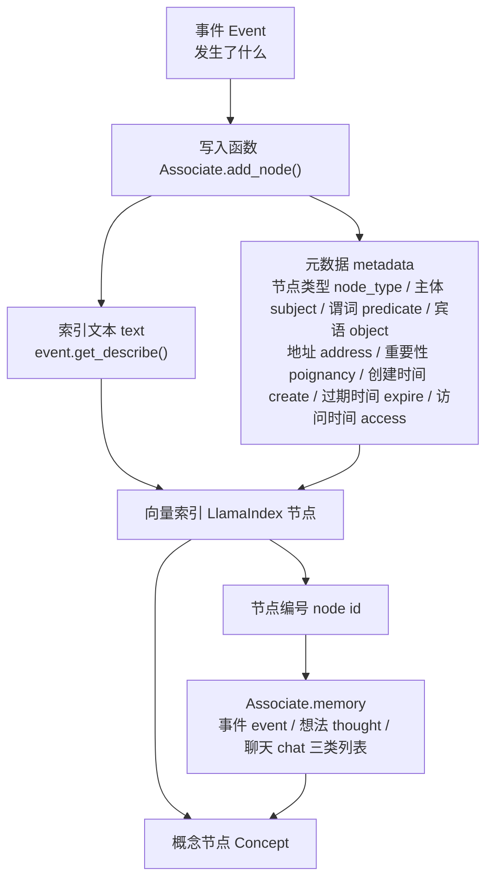

概念节点 Concept 是事件 Event 的带元数据版本。可以这样理解：

```text
事件 Event：发生了什么。
概念节点 Concept：这个事件作为记忆节点，何时发生、重要性多少、何时过期、最近何时被访问。
记忆列表 Associate.memory：每类记忆有哪些节点编号 node id。
向量索引 LlamaIndex：节点文本、元数据 metadata 和向量嵌入 embedding 的真实存储。
```

这一小节的输入-处理-输出闭环如下：

| 环节 | 内容 |
| --- | --- |
| 输入 | 事件 Event、节点类型 node type、重要性字段 poignancy、创建时间 create、过期时间 expire。 |
| 处理逻辑 | `Associate.add_node()` 把事件描述写成索引文本 text，把结构化字段写成元数据 metadata，再把生成的节点编号 node id 放入 `Associate.memory`。 |
| 输出 | 向量索引 LlamaIndex 中的一条完整节点，以及 `Associate.memory[event/thought/chat]` 中按新到旧排列的节点编号 node id。 |

## 18.6 三类记忆：事件 event、聊天 chat、想法 thought

`Associate` 初始化时：

```python
self.memory = memory or {"event": [], "thought": [], "chat": []}
```

这三类记忆对应不同来源。事件 event 是普通观察和行为事件。例如：

```text
克劳斯在图书馆写论文。
伊莎贝拉正在准备派对。
山姆在咖啡馆谈竞选。
```

聊天 chat 是对话摘要。例如：

```text
伊莎贝拉邀请阿伊莎参加情人节派对。
```

想法 thought 是反思、计划或高层想法。例如：

```text
克劳斯认为玛丽亚愿意讨论开放性问题。
```

这三类记忆都进入同一个向量索引，但在记忆字典 `memory` 中分别维护节点编号 node id 列表。这样做兼顾统一检索和类型过滤。

三类记忆的输入-处理-输出如下：

| 记忆类型 | 输入 | 处理逻辑 | 输出 |
| --- | --- | --- | --- |
| 事件 event | 感知到的非空闲事件、角色行动事件。 | 写入 `memory["event"]`，用于近期事件、去重、反思和行为上下文。 | 事件节点编号 node id 列表。 |
| 聊天 chat | 角色对话摘要。 | 写入 `memory["chat"]`，检索时可按对方名字构造查询。 | 对话节点编号 node id 列表。 |
| 想法 thought | 计划、反思或高层总结。 | 写入 `memory["thought"]`，与事件 event 一起参与多焦点检索。 | 想法节点编号 node id 列表。 |

## 18.7 关联记忆 Associate：一个智能体 agent 的记忆管理器

每个智能体 agent 有自己的 `Associate`。初始化：

```python
self.associate = memory.Associate(
    os.path.join(config["storage_root"], "associate"), **config["associate"]
)
```

`Associate.__init__()` 中：

```python
self._index = LlamaIndex(embedding, path)
self.memory = memory or {"event": [], "thought": [], "chat": []}
self.cleanup_index()
```

代码逻辑图：

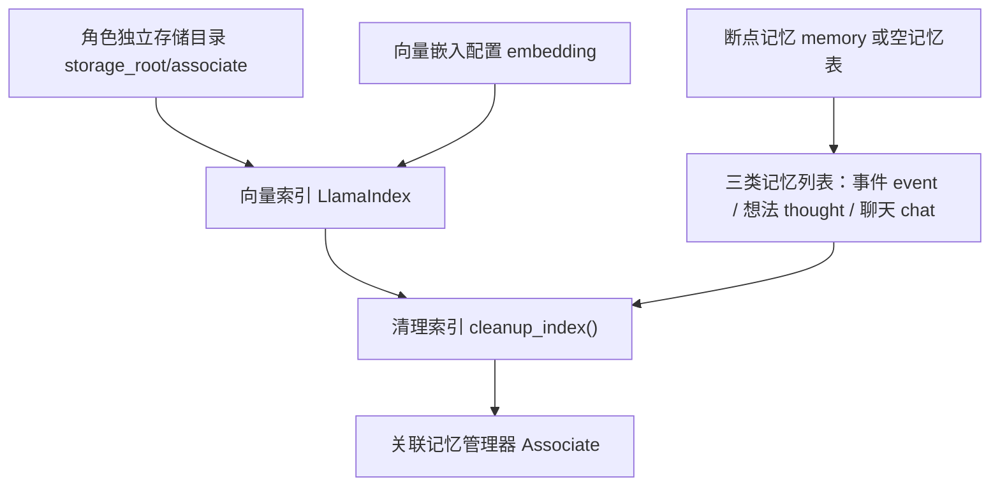

关联记忆 Associate 包含两个层面。第一，Python 层记忆 memory 列表。它保存每类记忆的节点编号 node id 顺序。第二，底层向量索引 LlamaIndex。它保存节点文本、元数据 metadata、向量嵌入 embedding 和向量索引。这两个层面必须保持一致。因此初始化时会调用索引清理函数 `cleanup_index()`，删除过期或无效节点，并同步记忆 memory 列表。

初始化过程的输入-处理-输出如下：

| 环节 | 内容 |
| --- | --- |
| 输入 | 角色独立存储目录、向量嵌入 embedding 配置、断点 checkpoint 中恢复出来的 `memory` 字典。 |
| 处理逻辑 | 创建或加载向量索引 LlamaIndex，恢复三类节点编号 node id 列表，并调用 `cleanup_index()` 清理失效节点。 |
| 输出 | 一个可写入、可检索、索引和节点编号列表保持一致的关联记忆 Associate。 |

## 18.8 写入函数 add_node()：写入记忆

记忆写入入口可以定位到：

```python
Associate.add_node()
```

参数主要包括这些内容：

| 参数 | 中文锚点 | 读法 |
| --- | --- | --- |
| `node_type` | 节点类型 node type | 决定这条记忆进入事件 event、聊天 chat 还是想法 thought 列表。 |
| `event` | 事件 Event | 这条记忆的原始事实来源。 |
| `poignancy` | 重要性字段 poignancy | 这条记忆的主观重要程度，后续会参与重要性 importance 评分。 |
| `create` | 创建时间 create | 记忆写入时间。 |
| `expire` | 过期时间 expire | 记忆失效时间。 |
| `filling` | 填充内容 filling | 反思等场景传入的补充材料，当前主链路没有持久化到元数据 metadata。 |

写入时会创建元数据 metadata：

```python
metadata = {
    "node_type": node_type,
    "subject": event.subject,
    "predicate": event.predicate,
    "object": event.object,
    "address": ":".join(event.address),
    "poignancy": poignancy,
    "create": create.strftime("%Y%m%d-%H:%M:%S"),
    "expire": expire.strftime("%Y%m%d-%H:%M:%S"),
    "access": create.strftime("%Y%m%d-%H:%M:%S"),
}
```

然后写入索引 index：

```python
node = self._index.add_node(event.get_describe(), metadata)
```

最后把节点编号 node id 插入对应记忆 memory 列表头部：

```python
memory = self.memory[node_type]
memory.insert(0, node.id_)
```

代码逻辑图：

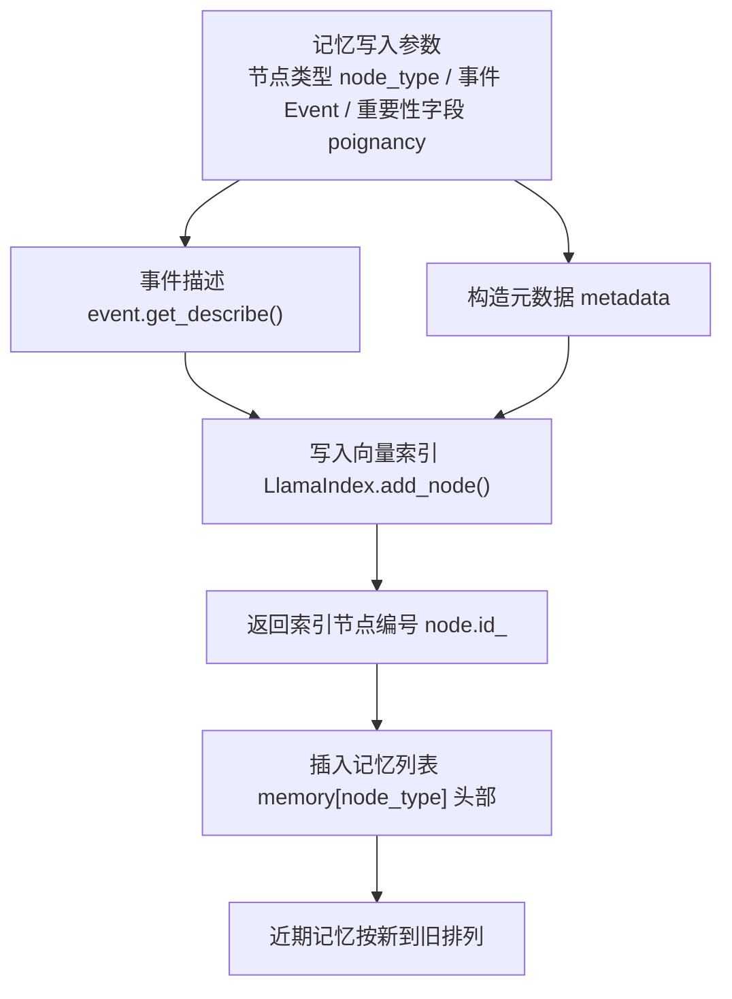

注意是插入头部。因此记忆 memory 列表天然按新到旧排列。

写入记忆的输入-处理-输出如下：

| 环节 | 内容 |
| --- | --- |
| 输入 | 节点类型 node type、事件 Event、重要性字段 poignancy、可选创建时间 create、可选过期时间 expire。 |
| 处理逻辑 | 构造元数据 metadata，把事件描述写入向量索引 LlamaIndex，拿到新节点编号 node id。 |
| 输出 | 返回概念节点 Concept；同时更新底层索引和记忆列表 `memory[node_type]` 的头部节点编号列表。 |

### 写入前的评分提示词 prompt：重要性字段 poignancy 从哪里来

`Associate.add_node()` 接收的 `poignancy` 不是固定常量。除了空闲 idle 事件外，智能体 agent 会在 `_add_concept()` 中调用重要性评分提示词 prompt：

```python
elif e_type == "chat":
    poignancy = self.completion("poignancy_chat", event)
else:
    poignancy = self.completion("poignancy_event", event)
```

这一层非常关键。向量嵌入 embedding 决定“语义上像不像”，重要性字段 poignancy 决定“这件事值不值得想起”。如果评分 prompt 把普通寒暄打成 10，后续检索和反思都会被噪声带偏；如果把重要承诺打成 1，角色会像没记住一样继续生活。

**事件重要性 poignancy_event**

中文原版：

```text
${base_desc}

在1到10的范围内评分，评分原则：
1代表极其平常，例如刷牙、整理床铺等普通事件；
10代表极其特殊或强烈，令人印象深刻，例如分手、大学录取等特殊事件。
每个事件只能用1到10的整数表示。例如：
事件：刷牙。评分：1
事件：整理床铺。评分：1
事件：分手。评分：10
事件：大学录取。评分：10

以下是 ${agent} 需要评分的一个完整事件：
"""
${event}
"""
评分：<分数>

根据完整事件填写<分数>。
格式要求：只在1到10范围内输出1个数字，不要输出数字以外的任何内容。
```

英文版本 English version：

```text
${base_desc}

Rate the event on a scale from 1 to 10:
1 means extremely ordinary, such as brushing teeth or making the bed;
10 means extremely special or emotionally intense, such as a breakup or college admission.
Each event must be represented by one integer from 1 to 10. For example:
Event: brushing teeth. Rating: 1
Event: making the bed. Rating: 1
Event: breakup. Rating: 10
Event: college admission. Rating: 10

Here is the complete event that ${agent} needs to rate:
"""
${event}
"""
Rating: <score>

Fill in <score> based on the complete event.
Format requirement: output only one number from 1 to 10, with no extra text.
```

这段提示词 prompt 的设计是“少输出、强约束”。输出结构 schema 是一个整数 `int`，回调函数 callback 不做复杂解析，失败兜底 failsafe 会随机给 1 到 10 的整数。它牺牲了一部分稳定性，但保住了写入链路不断掉。

**对话重要性 poignancy_chat**

中文原版与事件版几乎相同，只是评分对象改成完整对话：

```text
${base_desc}

在1到10的范围内评分，评分原则：
1代表极其平常，例如早上的日常问候；
10代表极其特殊或强烈，令人印象深刻，例如关于分手、争吵的对话。
每个对话只能用1到10的整数表示。

以下是 ${agent} 需要评分的一场完整对话：
"""
${event}
"""
评分：<分数>

根据完整事件填写<分数>。
格式要求：只在1到10范围内输出1个数字，不要输出数字以外的任何内容。
```

英文版本 English version：

```text
${base_desc}

Rate the conversation on a scale from 1 to 10:
1 means extremely ordinary, such as a routine morning greeting;
10 means extremely special or emotionally intense, such as a conversation about a breakup or argument.
Each conversation must be represented by one integer from 1 to 10.

Here is the complete conversation that ${agent} needs to rate:
"""
${event}
"""
Rating: <score>

Fill in <score> based on the complete event.
Format requirement: output only one number from 1 to 10, with no extra text.
```

对话重要性 poignancy_chat 的输出会写入聊天 chat 节点的元数据 metadata。后续三因素检索中的重要性 importance，读的就是这个字段。这里能看到记忆模块的第一层 prompt 设计：它不是摘要，而是给未来检索排序打底。

## 18.9 记忆过期

概念节点 Concept 默认过期时间是创建后 30 天：

```python
self.expire = self.create + datetime.timedelta(days=30)
```

`Associate.add_node()` 中也默认：

```python
expire = expire or (create + datetime.timedelta(days=30))
```

这说明项目并不无限保留所有记忆。过期机制有两个目的。第一，限制索引规模。第二，模拟记忆遗忘。不过，当前过期策略比较简单。它是统一 30 天，而不是根据重要性动态决定。例如，普通早餐和重要承诺都默认 30 天。这在小规模仿真中可以接受，但如果要长时间运行，可能需要更精细的生命周期管理。

过期机制的输入-处理-输出如下：

| 环节 | 内容 |
| --- | --- |
| 输入 | 记忆创建时间 create，以及可选传入的过期时间 expire。 |
| 处理逻辑 | 没有显式过期时间 expire 时，默认生成 `create + 30 天`。 |
| 输出 | 每个记忆节点都带有过期时间 expire，后续清理函数可以判断它是否仍然有效。 |

## 18.10 最大记忆数 max_memory：记忆数量限制

`Associate` 支持 `max_memory`。如果设置了正数，`add_node()` 会限制某类记忆数量：

```python
if len(memory) >= self.max_memory > 0:
    self._index.remove_nodes(memory[self.max_memory:])
    self.memory[node_type] = memory[: self.max_memory - 1]
```

代码逻辑图：

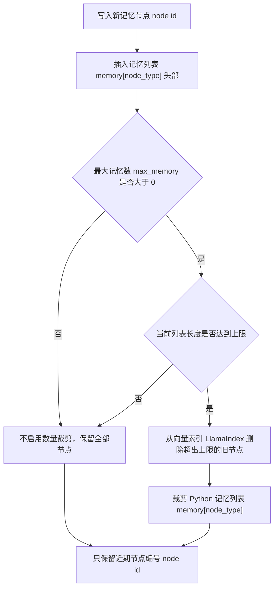

当前配置中默认没有显式设置最大记忆数 `max_memory`，构造函数默认是 -1，代表不按数量限制。但这个参数为后续实验提供了入口。例如，可以设计短记忆智能体 agent：

```text
max_memory = 20
```

观察派对传播和关系形成是否下降。这也是第四部分消融实验可以使用的参数。

数量限制的输入-处理-输出如下：

| 环节 | 内容 |
| --- | --- |
| 输入 | 某一类记忆 memory 列表、新写入的节点编号 node id、最大记忆数配置项 `max_memory`。 |
| 处理逻辑 | 如果列表长度达到上限，删除超出部分在向量索引中的节点，并裁剪 Python 层记忆 memory 列表。 |
| 输出 | 每类记忆最多保留指定数量的近期节点；超过上限的旧节点不再可检索。 |

## 18.11 索引清理函数 cleanup_index()

索引清理函数 `cleanup_index()` 用于清理过期或未来时间节点。底层 `LlamaIndex.cleanup()` 会遍历文档存储 docstore：

```python
if create > now or expire < now:
    remove_ids.append(node_id)
```

然后删除这些节点。关联记忆清理函数 `Associate.cleanup_index()` 再同步记忆 memory 列表：

```python
self.memory = {
    n_type: [n for n in nodes if n not in node_ids]
    for n_type, nodes in self.memory.items()
}
```

代码逻辑图：

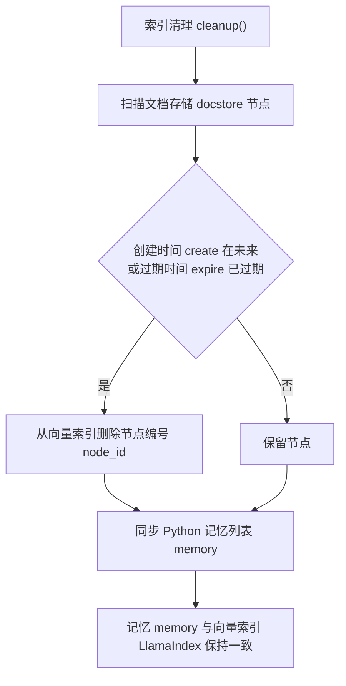

这保证 Python 记忆 memory 列表不会引用已经删除的索引节点 index nodes。这一步很重要。否则 `find_concept()` 可能找不到节点 node，导致运行错误。

清理过程的输入-处理-输出如下：

| 环节 | 内容 |
| --- | --- |
| 输入 | 向量索引 LlamaIndex 的文档存储 docstore，以及当前 `memory[event/thought/chat]` 节点编号列表。 |
| 处理逻辑 | 扫描每个节点的创建时间 create 和过期时间 expire，删除未来节点或过期节点，再从记忆 memory 列表中移除这些编号。 |
| 输出 | 索引中的节点和 Python 层节点编号列表重新对齐。 |

## 18.12 向量索引 LlamaIndex：底层向量索引

`LlamaIndex` 封装在：

```text
generative_agents/modules/storage/index.py
```

先解释名字。`Index` 是索引；`Llama` 在这里是 LlamaIndex 这个开源项目的品牌名，不表示当前项目必须使用 Meta LLaMA 模型。本章里的 LlamaIndex 不是一种新的记忆理论，也不是论文里的专有概念，而是当前项目选用的底层索引实现。

LlamaIndex 官方把它定位为面向大语言模型 LLM 应用的数据框架 data framework。它负责把外部数据接入大语言模型 LLM 应用，包括数据接入、切分、索引、检索、查询 query 和与智能体 agent 工作流集成。放到本项目里，它承担的角色更具体：把一条记忆文本变成可检索的节点 node，再让节点 node 进入向量存储索引 VectorStoreIndex。

项目真正用到的是 LlamaIndex 里的四个能力：

| 能力 | 在 LlamaIndex 里的名字 | 在本项目里的作用 |
| --- | --- | --- |
| 文本节点 | 文本节点 TextNode | 保存一条事件 event、聊天 chat 或想法 thought 的文本、节点编号 node id 和元数据 metadata。 |
| 向量索引 | 向量存储索引 VectorStoreIndex | 把记忆文本转换成向量嵌入 embedding 后建立语义检索入口。 |
| 检索器 | 向量索引检索器 VectorIndexRetriever | 根据查询文本 query 找回候选记忆节点，再交给关联记忆检索器 AssociateRetriever 重排。 |
| 持久化 | 存储上下文 StorageContext | 把文档存储 docstore、索引存储 index store、向量存储 vector store 保存到本地文件。 |

当前封装类叫：

```python
class LlamaIndex:
```

这个类名容易让人误会，以为它“选择了 Llama”。更准确的读法是：项目写了一个名为 `LlamaIndex` 的本地包装器，用它统一封装向量嵌入 embedding、向量索引、节点写入、节点检索和本地持久化。代表性代码如下：

```python
if path and os.path.exists(path):
    self._index = index_core.load_index_from_storage(
        index_core.StorageContext.from_defaults(persist_dir=path),
        show_progress=True,
    )
else:
    self._index = index_core.VectorStoreIndex([], show_progress=True)

node = TextNode(text=text, id_=id, metadata=metadata)
self._index.insert_nodes([node])

retriever_creator = retriever_creator or VectorIndexRetriever
nodes = retriever_creator(self._index, similarity_top_k=similarity_top_k).retrieve(text)

self._index.storage_context.persist(path)
```

代码逻辑图：

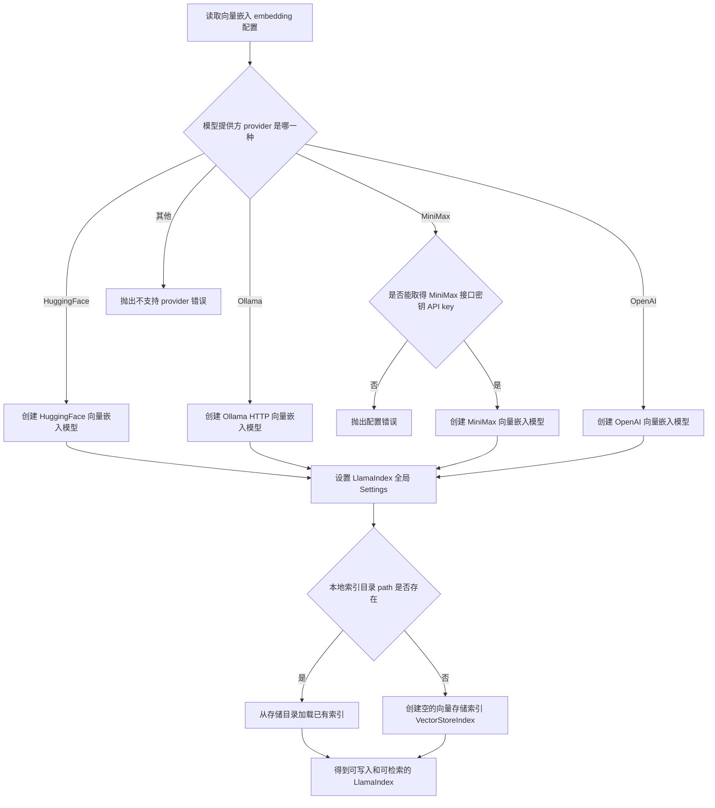

这段代码已经把 LlamaIndex 在本项目里的职责讲透了。索引目录存在时，加载本地索引；索引目录不存在时，创建空的向量存储索引 VectorStoreIndex；写入记忆时，把文本和元数据 metadata 包装成文本节点 TextNode；检索记忆时，调用向量索引检索器 VectorIndexRetriever；保存记忆时，通过存储上下文 StorageContext 写回磁盘。

可以不用 LlamaIndex 吗？可以。记忆检索至少有几种实现方式：

| 方案 | 做法 | 优点 | 代价 |
| --- | --- | --- | --- |
| Python 列表 + 手写相似度 | 自己保存文本、向量和元数据 metadata，用余弦相似度检索。 | 最透明，适合教学最小实现。 | 持久化、过滤、删除、批量插入都要自己写。 |
| FAISS / hnswlib | 只把向量交给专门的近邻检索库。 | 检索快，依赖少。 | 文本、元数据 metadata、节点编号 node id、删除和恢复仍要自己维护。 |
| Chroma / Qdrant / Milvus / Pinecone | 使用专门的向量数据库 vector database。 | 更适合线上服务和大规模数据。 | 部署、配置和运维成本更高。 |
| Elasticsearch / OpenSearch / BM25 | 使用关键词或混合检索。 | 对精确词匹配友好。 | 语义相似度要额外接向量嵌入 embedding 或混合检索。 |
| LlamaIndex | 用文本节点 TextNode、向量存储索引 VectorStoreIndex、存储上下文 StorageContext 和检索器 retriever 组织文本、元数据 metadata 和向量。 | 少写胶水代码，直接获得节点抽象、元数据 metadata 过滤、持久化和多后端集成。 | 引入框架抽象，读源码时要理解 LlamaIndex 的文件结构。 |

当前项目选择 LlamaIndex，主要不是因为它“更智能”，而是因为它刚好覆盖了生成式智能体 Generative Agents 记忆流 memory stream 所需要的几个工程动作：把一段记忆文本变成节点 node，给节点挂元数据 metadata，生成向量嵌入 embedding，按语义检索，再把索引保存到本地。官方文档也说明，节点 Node 是 LlamaIndex 的一等数据对象，向量存储索引 VectorStoreIndex 可以直接管理节点 node，存储上下文 StorageContext 则负责保存节点、索引和向量。

换成一句工程化的话：如果不用 LlamaIndex，本项目就要自己实现“文本节点 + 元数据 + 向量 + 过滤 + 删除 + 本地恢复”这一整套索引层。使用 LlamaIndex 后，项目可以把精力放回生成式智能体 Generative Agents 更核心的地方：事件 Event 如何进入记忆，检索结果如何按新近性 recency、相关性 relevance、重要性 importance 重排，以及这些记忆如何影响行动和对话。

支持的向量嵌入提供方 embedding provider 包括：

- HuggingFace。
- Ollama。
- MiniMax。
- OpenAI。

当前 `data/config.json` 使用 MiniMax 向量嵌入 embedding：

```json
{
  "provider": "minimax",
  "model": "embo-01",
  "base_url": "https://api.minimax.chat/v1"
}
```

这意味着当前工作区的记忆检索依赖远端向量嵌入 embedding 服务。如果读者要做完全本地化实验，可以把模型提供方 provider 切换到 Ollama 或 HuggingFace，但要同步确认模型名称、接口地址和向量维度是否能被 LlamaIndex 正常加载。

底层索引初始化的输入-处理-输出如下：

| 环节 | 内容 |
| --- | --- |
| 输入 | 向量嵌入 embedding 配置、索引持久化目录 path。 |
| 处理逻辑 | 根据模型提供方 provider 创建嵌入模型；如果目录已存在就加载已有索引，否则创建空的向量存储索引 VectorStoreIndex。 |
| 输出 | 一个可以添加节点、删除节点、检索节点和保存到磁盘的向量索引 LlamaIndex。 |

## 18.13 索引写入函数 add_node()

索引写入函数 `LlamaIndex.add_node()` 会创建文本节点 TextNode：

```python
node = TextNode(
    text=text,
    id_=id,
    metadata=metadata,
    excluded_llm_metadata_keys=exclude_llm_keys,
    excluded_embed_metadata_keys=exclude_embedding_keys,
)
```

这里需要注意下面细节：

```python
exclude_embedding_keys = list(metadata.keys())
```

默认元数据 metadata 不进入向量嵌入 embedding。向量嵌入 embedding 主要基于索引文本 `text`，也就是事件描述 event describe。元数据 metadata 用于过滤和排序，而不是语义向量。这是合理的。因为地址 address、创建时间 create、过期时间 expire 等字段不应该污染语义向量。

索引写入的输入-处理-输出如下：

| 环节 | 内容 |
| --- | --- |
| 输入 | 索引文本 text、元数据 metadata、可选节点编号 id。 |
| 处理逻辑 | 创建文本节点 TextNode，把元数据 metadata 排除在大语言模型 LLM 上下文和向量嵌入 embedding 之外，再插入向量索引。 |
| 输出 | 一个带节点编号 node id 的文本节点 TextNode，文本进入语义向量，元数据 metadata 保留给过滤、排序和恢复。 |

## 18.14 基础检索函数 retrieve_events()、retrieve_thoughts()、retrieve_chats()

`Associate` 提供三类基础检索：

```python
retrieve_events(text=None)
retrieve_thoughts(text=None)
retrieve_chats(name=None)
```

它们都调用底层检索函数 `_retrieve_nodes()`。如果传入查询文本 text，会使用向量检索并按节点类型 node_type 过滤。如果不传查询文本 text，就按记忆 memory 列表顺序取最近节点。代码逻辑：

```python
if text:
    filters = MetadataFilters(
        filters=[ExactMatchFilter(key="node_type", value=node_type)]
    )
    nodes = self._index.retrieve(text, filters=filters, node_ids=self.memory[node_type])
else:
    nodes = [self._index.find_node(n) for n in self.memory[node_type]]
return [self.to_concept(n) for n in nodes[: self.retention]]
```

代码逻辑图：

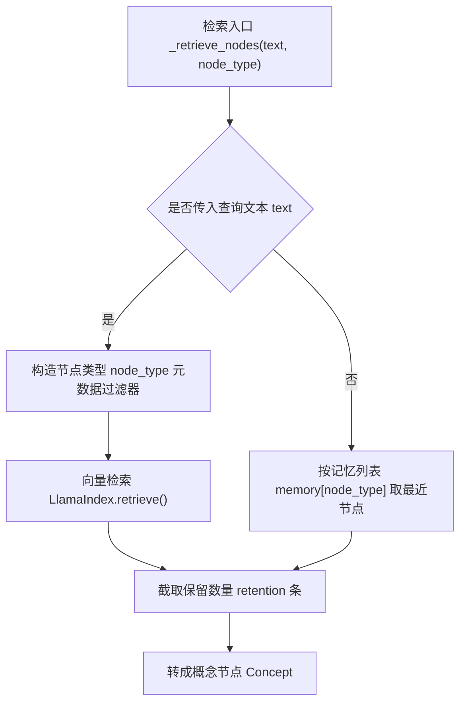

保留数量 `retention` 默认来自配置：

```json
"retention": 8
```

不传查询文本 query 时只取最近 8 条。这常用于近期记忆和去重。

基础检索的输入-处理-输出如下：

| 场景 | 输入 | 处理逻辑 | 输出 |
| --- | --- | --- | --- |
| 无查询文本 | 节点类型 node type。 | 直接按 `memory[node_type]` 的新到旧顺序找节点。 | 最近的概念节点 Concept 列表。 |
| 有查询文本 | 查询文本 text、节点类型 node type。 | 构造节点类型 node type 过滤器，并在对应节点编号范围内做向量检索。 | 与查询语义相关的概念节点 Concept 列表。 |

## 18.15 对话检索函数 retrieve_chats() 的特殊查询

对话检索函数 `retrieve_chats(name=None)` 如果传入角色名 name，会构造：

```python
text = ("对话 " + name) if name else None
```

代码逻辑图：

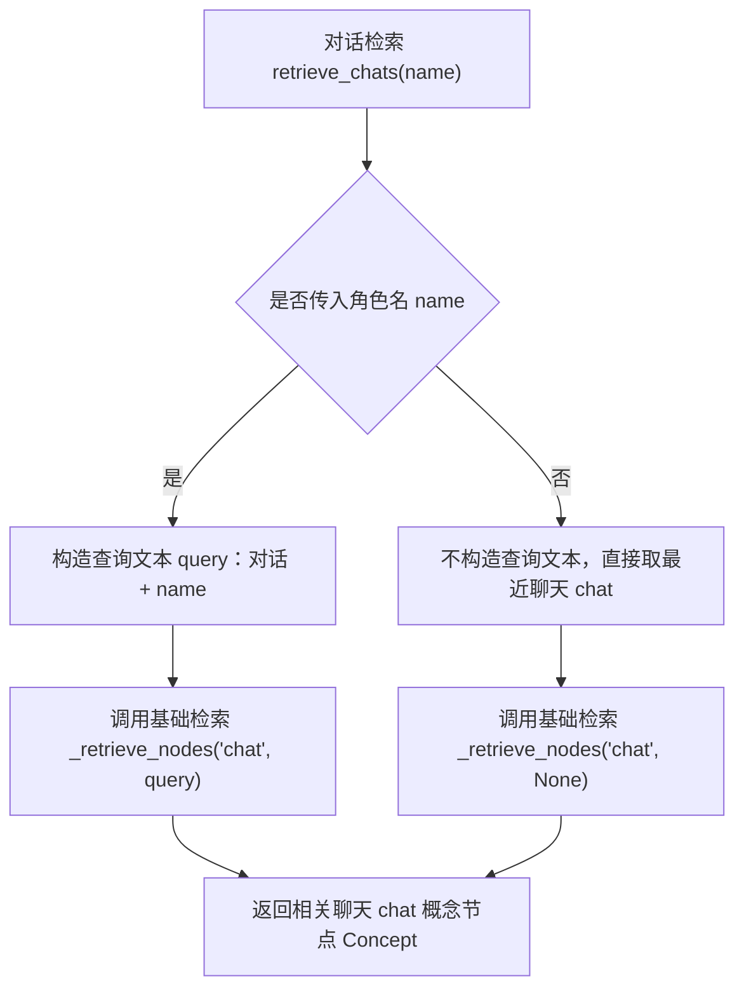

这让检索更偏向与某人相关的对话。例如：

```python
self.associate.retrieve_chats("玛丽亚")
```

会检索关于“对话 玛丽亚”的聊天 chat 节点 nodes。这个设计简单，但有效。对话记忆通常包含双方名字和摘要，使用“对话 + 人名”可以取回相关对话。不过，它依赖中文摘要中包含对方信息。如果摘要生成质量差，检索也会受影响。

对话检索的输入-处理-输出如下：

| 环节 | 内容 |
| --- | --- |
| 输入 | 可选角色名字 name，例如 `玛丽亚`。 |
| 处理逻辑 | 有角色名 name 时构造查询文本 `对话 + name`；没有角色名 name 时直接取最近聊天 chat 记忆。 |
| 输出 | 与某个角色相关，或最近发生的聊天 chat 概念节点 Concept 列表。 |

### 对话摘要 prompt：聊天 chat 记忆不是原始逐字稿

对话结束后，项目不会把每一句话都直接写成长期记忆。`_chat_with()` 会先调用对话摘要 `summarize_chats`，把多轮聊天压成一句聊天 chat 记忆：

```python
chat_summary = self.completion("summarize_chats", chats)
self.schedule_chat(chats, chat_summary, start, duration, other)
```

中文原版：

```text
对话：
"""
${conversation}
"""

用不超过100字的短句总结上述对话：
```

英文版本 English version：

```text
Conversation:
"""
${conversation}
"""

Summarize the conversation above in a short sentence of no more than 100 Chinese characters:
```

这个提示词 prompt 的输入是完整对话 conversation，输出结构 schema 是字符串 `str`。它的任务不是生成新的观点，而是压缩事实。压缩后的摘要会被包装成对话事件 Event，写入聊天 chat 记忆。后续 `retrieve_chats("玛丽亚")` 能不能找到这段对话，很大程度取决于摘要里是否保留了对方名字、主题和关系变化。

这里可以把链路完整读出来：

| 环节 | 输入 | 处理逻辑 | 输出 |
| --- | --- | --- | --- |
| 对话生成 | 多轮 `[(speaker, content)]`。 | 智能体 agent 轮流说话。 | 原始对话 transcript。 |
| 对话摘要 summarize_chats | 原始对话 conversation。 | 压缩成一句自然语言摘要。 | 聊天 chat 事件的 `describe`。 |
| 写入记忆 | 聊天 chat 事件 Event、重要性字段 poignancy。 | 写入关联记忆 Associate。 | 可被 `retrieve_chats()` 找回的聊天 chat 记忆。 |

### 关系摘要 prompt：从记忆节点生成两人关系

对话前，项目还会用关系摘要 `summarize_relation` 给双方各自生成一条关系描述：

```python
relations = (
    self.completion("summarize_relation", self, other.name),
    other.completion("summarize_relation", other, self.name),
)
```

它先围绕对方名字做多焦点检索：

```python
nodes = agent.associate.retrieve_focus([other_name], 50)
```

再把检索出的记忆节点放进提示词 prompt。

中文原版：

```text
背景描述：
"""
${context}
"""

输出示例1：乔和汤姆是朋友
输出示例2：艾琳和约翰在玩游戏

参考上述背景描述和输出示例，用一句话总结 ${agent} 和 ${another} 之间的关系：
```

英文版本 English version：

```text
Background:
"""
${context}
"""

Example 1: Joe and Tom are friends
Example 2: Erin and John are playing a game

Using the background and examples above, summarize the relationship between ${agent} and ${another} in one sentence:
```

关系摘要 summarize_relation 说明了记忆模块不只是“取回文本”。它会把一组概念节点 Concept 重新压缩成社交状态：两个人是朋友、陌生人、合作对象，还是刚刚发生过某个共同事件。这个摘要会进入后续对话生成 prompt，直接影响角色开口时的语气和内容。

## 18.16 多焦点检索函数 retrieve_focus()

反思 Reflection 和很多提示词 prompt 需要围绕多个问题检索记忆。多焦点检索函数 `retrieve_focus()` 用于这个场景。参数：

```python
retrieve_focus(focus, retrieve_max=30, reduce_all=True)
```

检索焦点 `focus` 是一个问题或关键词列表。例如：

```text
克劳斯今天的计划
克劳斯与玛丽亚的关系
近期重要事件
```

函数会对每个焦点文本 focus text 检索事件 event 和想法 thought：

```python
node_ids = self.memory["event"] + self.memory["thought"]
```

注意，它不检索聊天 chat。聊天 chat 通常通过 `retrieve_chats()` 单独处理。检索时使用自定义检索器 retriever：

```python
retriever_creator=_create_retriever
```

也就是关联记忆检索器 `AssociateRetriever`。

多焦点检索的输入-处理-输出如下：

| 环节 | 内容 |
| --- | --- |
| 输入 | 多个焦点文本 focus text、事件 event 和想法 thought 的节点编号列表、检索数量 retrieve_max。 |
| 处理逻辑 | 对每个焦点分别调用向量检索，并使用关联记忆检索器 AssociateRetriever 进行三因素重排。 |
| 输出 | 一组与多个问题相关的概念节点 Concept；聊天 chat 记忆不在这里自动参与。 |

## 18.17 结果合并参数 reduce_all

多焦点检索函数 `retrieve_focus()` 有一个关键参数：

```python
reduce_all=True
```

如果结果合并参数 `reduce_all` 为 True，所有检索焦点 focus 的结果会合并去重：

```python
retrieved.update({n.id_: n for n in nodes})
return [self.to_concept(v) for v in retrieved.values()]
```

如果结果合并参数 `reduce_all` 为 False，会保留每个检索焦点 focus 对应的结果：

```python
return {
    text: [self.to_concept(n) for n in nodes]
    for text, nodes in retrieved.items()
}
```

代码逻辑图：

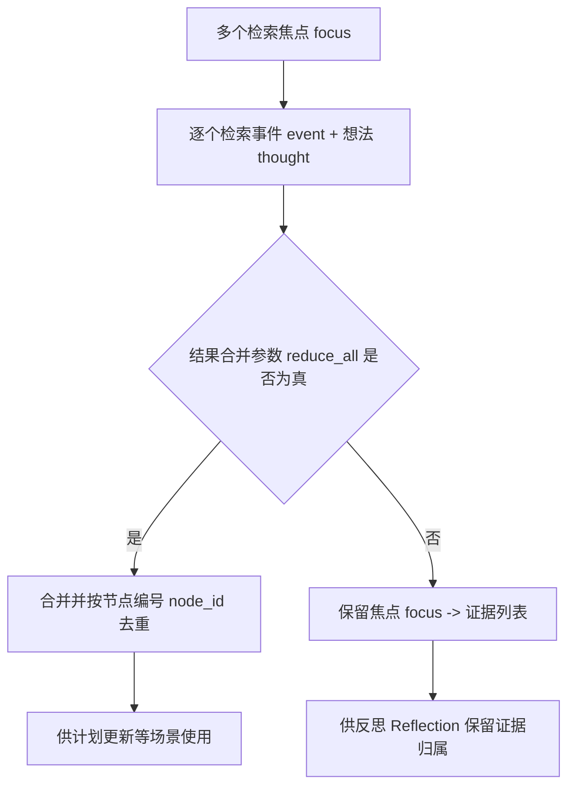

反思 Reflection 中使用：

```python
reduce_all=False
```

因为它需要知道每个反思问题对应哪些证据。计划更新中常用合并结果，因为只需要一组相关记忆。这个参数体现了不同场景的检索需求。

结果合并参数 `reduce_all` 的输入-处理-输出如下：

| 参数取值 | 输入 | 处理逻辑 | 输出 |
| --- | --- | --- | --- |
| `True` | 多个检索焦点 focus 的检索结果。 | 按节点编号 node id 合并去重。 | 一个统一的概念节点 Concept 列表。 |
| `False` | 多个检索焦点 focus 的检索结果。 | 保留每个检索焦点到证据节点的映射。 | `focus -> Concept 列表` 的证据字典。 |

### 反思 prompt：从记忆节点生成问题与洞察

反思 Reflection 是记忆模块里最容易被低估的 prompt 链路。它不是简单检索，而是把近期事件 event 和想法 thought 压缩成新的想法 thought。`Agent.reflect()` 的关键链路如下：

```python
nodes = self.associate.retrieve_events() + self.associate.retrieve_thoughts()
focus = self.completion("reflect_focus", nodes, 3)
retrieved = self.associate.retrieve_focus(focus, reduce_all=False)
for r_nodes in retrieved.values():
    thoughts = self.completion("reflect_insights", r_nodes, 5)
```

代码逻辑图：

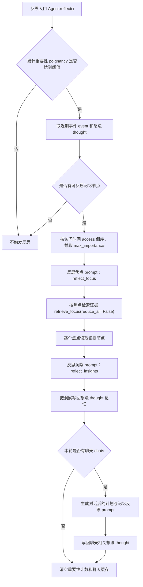

这段链路包含两个主提示词 prompt 和两个聊天补充提示词 prompt。第一步用反思焦点 reflect_focus 生成“该想什么问题”，第二步用反思洞察 reflect_insights 根据证据生成“想到了什么”。如果本轮有聊天 chat，还会继续生成计划反思 reflect_chat_planing 和记忆反思 reflect_chat_memory。反思结束后，重要性累计和聊天缓存会被清空，下一轮重新积累。

**反思焦点 reflect_focus**

中文原版：

```text
根据给定的记忆节点，生成反思的焦点问题。

参考示例，为以下记忆节点生成反思焦点问题：
"""
记忆节点：
${reference}

生成${number}个反思焦点问题：
"""

确保返回的数据格式遵守schema：
[
  "焦点问题1",
  "焦点问题2",
  "焦点问题3",
  ...
]

要求：
- 问题要基于给定的记忆节点
- 问题要简洁明了，便于引导反思
- 确保遵守返回的格式schema
```

英文版本 English version：

```text
Generate reflection focus questions based on the given memory nodes.

Following the example, generate reflection focus questions for the memory nodes below:
"""
Memory nodes:
${reference}

Generate ${number} reflection focus questions:
"""

Make sure the returned data follows the schema:
[
  "Focus question 1",
  "Focus question 2",
  "Focus question 3",
  ...
]

Requirements:
- The questions must be based on the given memory nodes
- Keep the questions concise and clear, so they can guide reflection
- Make sure the returned data follows the schema
```

反思焦点 reflect_focus 的输入是近期记忆节点的 `describe` 列表，输出结构 schema 是 `List[str]`。它把“最近发生了什么”变成“现在值得思考什么”。这一步决定后续检索焦点 focus，所以它会影响反思抓住哪些证据。

**反思洞察 reflect_insights**

中文原版：

```text
根据给定的记忆节点，生成反思洞察。

参考示例，为以下记忆节点生成反思洞察：
"""
记忆节点：
${reference}

生成${number}个反思洞察：
"""

确保返回的数据格式遵守schema：
[
  ("洞察内容", "相关节点编号"),
  ("洞察内容", "相关节点编号"),
  ...
]

要求：
- 洞察要基于给定的记忆节点
- 洞察要深刻且有启发性
- 节点编号用逗号分隔，如"1,2,3"
- 确保返回的数据格式遵守schema
```

英文版本 English version：

```text
Generate reflection insights based on the given memory nodes.

Following the example, generate reflection insights for the memory nodes below:
"""
Memory nodes:
${reference}

Generate ${number} reflection insights:
"""

Make sure the returned data follows the schema:
[
  ("Insight content", "related node numbers"),
  ("Insight content", "related node numbers"),
  ...
]

Requirements:
- The insights must be based on the given memory nodes
- The insights should be meaningful and thought-provoking
- Separate node numbers with commas, such as "1,2,3"
- Make sure the returned data follows the schema
```

反思洞察 reflect_insights 的输出不是普通字符串，而是 `(洞察内容, 相关节点编号)`。回调函数 callback 会把提示词里返回的局部编号转换成真实节点编号 node id：

```python
indices = [int(i.strip()) for i in node_ids_str.split(",")]
node_ids = [nodes[i].node_id for i in indices if i < len(nodes)]
insights.append([insight.strip(), node_ids])
```

这就是反思 thought 和证据 evidence 的连接点。洞察内容会作为新的想法 thought 写回记忆流 memory stream；相关节点编号 node id 则说明这个想法来自哪些经历。当前项目后续没有完整持久化 filling/evidence，但这个 prompt 已经显露出“证据驱动反思”的工程设计。

## 18.18 关联记忆检索器 AssociateRetriever：三因素重排

关联记忆检索器 `AssociateRetriever` 是论文检索 Retrieval 的核心实现。它先调用向量检索：

```python
nodes = self._vector_retriever.retrieve(query_bundle)
```

然后按访问时间 access 倒序排序：

```python
nodes = sorted(nodes, key=lambda n: utils.to_date(n.metadata["access"]), reverse=True)
```

接着计算下面三类分数：

```python
recency_scores
relevance_scores
importance_scores
```

最终分数计算方式如下：

```python
final_scores = r1 + r2 + i
```

然后按最终分数 final score 重新排序，取前 `retrieve_max`。这就是论文三因素：

```text
recency + relevance + importance
```

代码逻辑图：

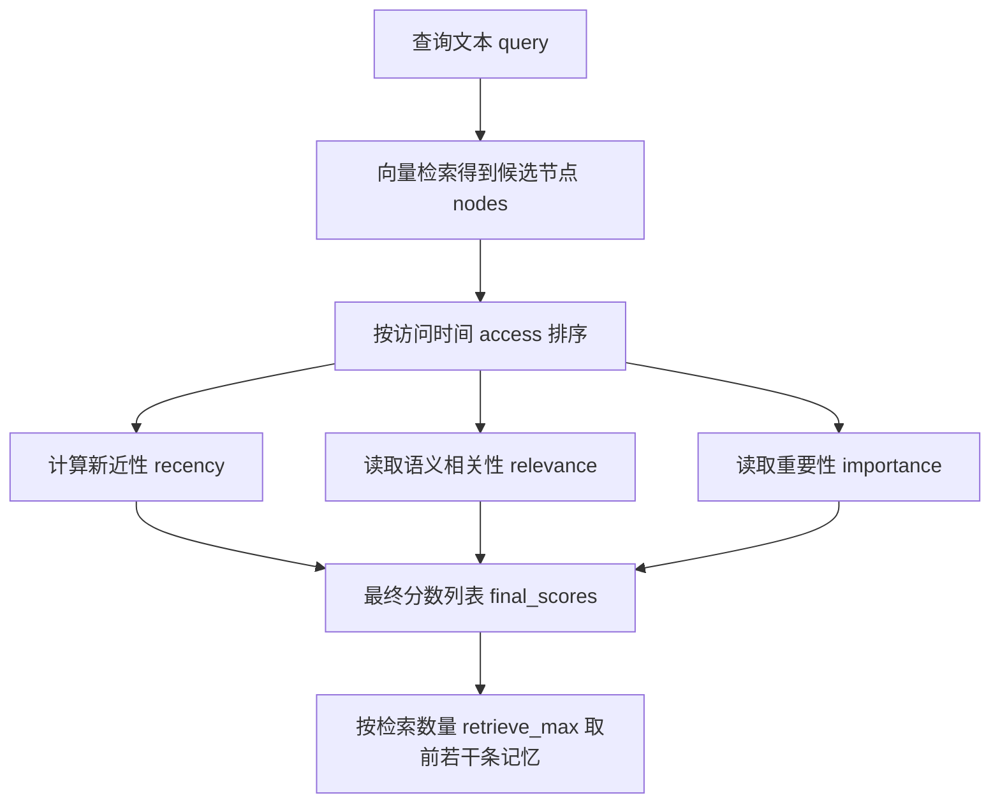

这是三因素检索在项目中的直接实现。

三因素重排的输入-处理-输出如下：

| 环节 | 内容 |
| --- | --- |
| 输入 | 向量检索返回的候选节点 nodes，以及每个节点的语义分数 score、访问时间 access、重要性字段 poignancy。 |
| 处理逻辑 | 先按访问时间 access 排序计算新近性 recency，再读取语义相关性 relevance 和重要性 importance，最后加权求最终分数 final score。 |
| 输出 | 按综合分排序后的前 `retrieve_max` 条记忆节点，并更新这些节点的访问时间 access。 |

## 18.19 新近性 recency 分数

新近性 recency 使用指数衰减：

```python
fac = self._config["recency_decay"]
recency_scores = self._normalize(
    [fac**i for i in range(1, len(nodes) + 1)],
    self._config["recency_weight"]
)
```

越靠前的节点越新。新近性衰减系数 `recency_decay` 默认 0.995。新近性权重 `recency_weight` 默认 0.5。这让新近访问的记忆更容易被想起。注意这里使用的是访问时间 access 排序，而不只是创建时间 create。这意味着被检索过的记忆会更新访问时间 access，之后更可能再次被想起。这类似人类记忆中的“最近想起过”效应。

## 18.20 相关性 relevance 分数

相关性 relevance 来自向量检索分数 score：

```python
relevance_scores = self._normalize(
    [n.score for n in nodes], self._config["relevance_weight"]
)
```

默认权重是 3。这说明语义相关性是最重要的分量。如果查询文本 query 是“玛丽亚”，与玛丽亚相关的记忆应该优先。但相关性 relevance 不是唯一标准。一个非常相关但很普通、很久远的记忆，可能不如一个稍微相关但重要且新近的记忆。这就是三因素检索的意义。

## 18.21 重要性 importance 分数

重要性 importance 对应元数据 metadata 中的重要性字段 `poignancy`：

```python
importance_scores = self._normalize(
    [n.metadata["poignancy"] for n in nodes],
    self._config["importance_weight"]
)
```

默认权重是 2。重要事件更容易被想起。例如，普通早餐、走路、整理床铺，即使语义相关，也不应该总是压过派对邀请、竞选对话、关系冲突。重要性字段 `poignancy` 让记忆检索更接近“人会想起什么”。

## 18.22 更新访问时间 access

检索后，关联记忆检索器 `AssociateRetriever` 会更新访问时间 access：

```python
for n in nodes:
    n.metadata["access"] = utils.get_timer().get_date("%Y%m%d-%H:%M:%S")
```

代码逻辑图：

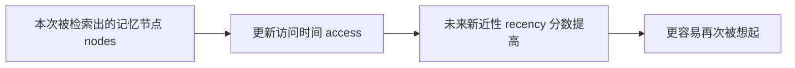

这一步很关键。被检索出来的记忆，未来会因为新近性 recency 更容易再次被检索。这可能带来正向效果：

```text
近期持续关注的事情，会在记忆中保持活跃。
```

它也可能带来下面这些风险：

```text
某些记忆被反复检索后，过度主导角色行为。
```

这就是记忆系统中常见的“注意力回音室”问题。后续高级升级可以考虑访问衰减 access decay 或检索多样性约束。

访问时间更新的输入-处理-输出如下：

| 环节 | 内容 |
| --- | --- |
| 输入 | 本次被检索出来的记忆节点 nodes。 |
| 处理逻辑 | 把每个节点的 `metadata["access"]` 改成当前仿真时间。 |
| 输出 | 这些节点在后续检索中的新近性 recency 分数提高，更容易再次进入上下文。 |

## 18.23 持久化函数 to_dict()：记忆持久化

`Associate.to_dict()` 很短：

```python
def to_dict(self):
    self._index.save()
    return {"memory": self.memory}
```

代码逻辑图：

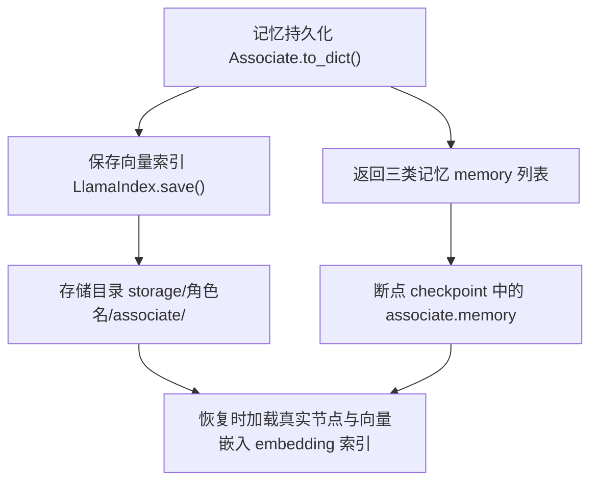

它做两件事。第一，保存 LlamaIndex。第二，返回记忆 memory 列表。断点 checkpoint JSON 中保存的是：

```json
"associate": {
  "memory": {
    "event": [...],
    "thought": [...],
    "chat": [...]
  }
}
```

本地保存单位不是全局记忆库，而是“仿真运行 run -> 智能体 agent -> 关联记忆目录 associate”。创建游戏时，`Game.__init__()` 会先为当前仿真建立存储根目录：

```python
storage_root = os.path.join(f"results/checkpoints/{name}", "storage")
```

然后给每个智能体 agent 单独分配一个目录：

```python
agent_config["storage_root"] = os.path.join(storage_root, name)
```

进入 `Agent.__init__()` 后，关联记忆 Associate 再把自己的索引放到该角色目录下的 `associate/`：

```python
self.associate = memory.Associate(
    os.path.join(config["storage_root"], "associate"), **config["associate"]
)
```

因此，一次真实运行的本地记忆结构长这样：

```text
results/checkpoints/<sim>/
  simulate-20240213-1000.json
  conversation.json
  storage/
    克劳斯/
      associate/
        docstore.json
        default__vector_store.json
        index_store.json
        index_config.json
        graph_store.json
        image__vector_store.json
    阿伊莎/
      associate/
        docstore.json
        default__vector_store.json
        index_store.json
        index_config.json
```

也就是说，记忆按智能体 agent 隔离保存。克劳斯有自己的 `storage/克劳斯/associate/`，阿伊莎有自己的 `storage/阿伊莎/associate/`。事件 event、聊天 chat、想法 thought 不是三个文件夹，而是同一个关联记忆 Associate 里的三类节点编号 node id 列表：

```json
{
  "memory": {
    "event": ["node_5", "node_4", "node_3", "node_2", "node_1"],
    "thought": ["node_0"],
    "chat": []
  }
}
```

本地文件的作用如下：

| 文件 | 文件格式 | 保存内容 | 读法 |
| --- | --- | --- | --- |
| `simulate-*.json` | JSON | 每个智能体 agent 的 `associate.memory` 节点编号 node id 列表。 | 这是断点 checkpoint 中的轻量索引，不含完整文本和向量。 |
| `docstore.json` | JSON | 文本节点 TextNode 的 `text`、元数据 metadata、排除向量嵌入字段等。 | 记忆文本和结构化字段主要在这里。 |
| `default__vector_store.json` | JSON | `embedding_dict`，也就是每个节点编号 node id 对应的向量嵌入 embedding 数组。 | 这是语义检索要用的向量。 |
| `index_store.json` | JSON | LlamaIndex 的索引结构，例如 `nodes_dict`。 | 记录索引里有哪些节点。 |
| `index_config.json` | JSON | 当前索引配置，例如 `max_nodes`。 | 用来生成下一个节点编号。 |
| `graph_store.json`、`image__vector_store.json` | JSON | LlamaIndex 存储上下文的辅助文件。 | 当前记忆主链路通常不直接读它们。 |

这解释了为什么断点 checkpoint 不是单文件完整状态。如果只复制 `simulate-*.json`，不复制 `storage/<agent>/associate/`，恢复时只能看到节点编号 node id，找不到完整文本节点 TextNode、元数据 metadata 和向量嵌入 embedding，记忆检索会丢失。

持久化的输入-处理-输出如下：

| 环节 | 内容 |
| --- | --- |
| 输入 | 当前关联记忆 Associate，包括向量索引 LlamaIndex 和 `memory[event/thought/chat]` 节点编号列表。 |
| 处理逻辑 | `self._index.save()` 把完整索引写入 `storage/<agent>/associate/`，持久化函数 `to_dict()` 返回 Python 层记忆 memory 列表给断点 checkpoint。 |
| 输出 | 每个智能体 agent 独立的本地索引文件，以及断点 checkpoint JSON 中的节点编号 node id 列表。 |

## 18.24 记忆系统如何影响行为

记忆系统影响几乎所有行为。日程生成前，`make_schedule()` 检索近期重要事件，更新当前状态 currently。感知去重时，`percept()` 检索近期事件 event 和聊天 chat。对话前，`_chat_with()` 检索与对方的聊天记录。关系摘要时，`summarize_relation()` 围绕对方名字检索记忆。对话生成时，`generate_chat()` 检索当前关系和相关记忆。反思时，`reflect()` 检索事件 event 和想法 thought。计划、对话、反应和反思都依赖记忆 memory。因此，记忆模块不是附属功能。它是智能体 agent 行为连续性的核心。

行为链路中的输入-处理-输出如下：

| 调用场景 | 输入 | 处理逻辑 | 输出 |
| --- | --- | --- | --- |
| 日程生成 `make_schedule()` | 近期事件 event 和想法 thought。 | 围绕当前计划焦点检索记忆。 | 更新角色当前状态 currently 和当天计划。 |
| 感知去重 `percept()` | 最近事件 event 和聊天 chat。 | 判断新看到的事件是否已经存在于近期记忆。 | 避免重复写入相同事件。 |
| 对话 `_chat_with()` | 与对方相关的聊天 chat 记忆。 | 生成关系摘要和对话上下文。 | 影响下一句对话内容。 |
| 反思 `reflect()` | 近期事件 event 和想法 thought。 | 累积重要性并按焦点检索证据。 | 生成新的想法 thought，重新写入记忆流 memory stream。 |

### 检索重组 prompt：记忆如何变成新的 currently

日程生成前，项目会先检索近期记忆，再用三段提示词 prompt 把记忆重组成新的当前状态 currently：

```python
retrieved = self.associate.retrieve_focus(focus)
plan = self.completion("retrieve_plan", retrieved)
thought = self.completion("retrieve_thought", retrieved)
self.scratch.currently = self.completion("retrieve_currently", plan, thought)
```

这说明检索 retrieval 只是第一步。检索结果还要经过计划提取 retrieve_plan、想法提取 retrieve_thought 和当前状态更新 retrieve_currently，才会真正影响角色第二天怎么行动。

**计划提取 retrieve_plan**

中文原版：

```text
根据给定的记忆节点，生成智能体的计划描述。

参考示例，为以下记忆节点生成计划描述：
"""
记忆节点：
${description}

智能体：${agent}
当前日期：${date}
"""

确保返回的数据格式遵守schema：
[
  "计划描述1",
  "计划描述2",
  "计划描述3",
  ...
]

要求：
- 计划描述要基于给定的记忆节点
- 描述要简洁明了，符合智能体的生活习惯
- 确保返回的数据格式遵守schema
```

英文版本 English version：

```text
Generate plan descriptions for the agent based on the given memory nodes.

Following the example, generate plan descriptions for the memory nodes below:
"""
Memory nodes:
${description}

Agent: ${agent}
Current date: ${date}
"""

Make sure the returned data follows the schema:
[
  "Plan description 1",
  "Plan description 2",
  "Plan description 3",
  ...
]

Requirements:
- The plan descriptions must be based on the given memory nodes
- Keep the descriptions concise and consistent with the agent's lifestyle
- Make sure the returned data follows the schema
```

计划提取 retrieve_plan 的输入是带时间戳的记忆节点描述，输出结构 schema 是 `List[str]`。它把“记忆里发生过什么”转换成“今天可能要延续什么计划”。第 19 章的日程 Schedule 就会读取这些结果。

**想法提取 retrieve_thought**

中文原版：

```text
"""
${description}
"""

根据以上内容，以 ${agent} 的视角，用一句话总结 ${agent} 此刻的想法和感受：
```

英文版本 English version：

```text
"""
${description}
"""

Based on the content above, summarize ${agent}'s current thoughts and feelings in one sentence from ${agent}'s perspective:
```

想法提取 retrieve_thought 的输出结构 schema 是字符串 `str`。它不生成计划列表，而是生成一条角色视角的心理状态。计划提取 retrieve_plan 更偏外部安排，想法提取 retrieve_thought 更偏内部状态。

**当前状态更新 retrieve_currently**

中文原版：

```text
${agent} 在 ${time} 的状态：
${currently}

${agent} 在 ${time} 结束时记得这些事情：
${plan}

${agent} 在 ${time} 结束时的想法和感受：
${thought}

现在是 ${current_time}。根据上述情况，以第三人称，用一句话描述 ${agent} 在 ${current_time} 的状态，以反映 ${agent} 在 ${time} 结束时的想法和感受。
```

英文版本 English version：

```text
${agent}'s state on ${time}:
${currently}

Things ${agent} remembered at the end of ${time}:
${plan}

${agent}'s thoughts and feelings at the end of ${time}:
${thought}

It is now ${current_time}. Based on the situation above, describe ${agent}'s state at ${current_time} in one third-person sentence, reflecting ${agent}'s thoughts and feelings at the end of ${time}.
```

当前状态更新 retrieve_currently 是记忆影响行为的出口。它把上一天的 currently、检索出的计划 plan、压缩出的想法 thought 合成新的 currently。读者调试“为什么角色今天突然改变目标”时，不能只看向量检索结果，还要看这三个提示词 prompt 的输入和输出。

### 聊天后的记忆 prompt：对话如何沉淀为计划和记忆

反思 Reflection 处理聊天 chat 时，还会使用两个短 prompt：

```python
thought = self.completion("reflect_chat_planing", self.chats)
self._add_concept("thought", Event(... thought ...))

thought = self.completion("reflect_chat_memory", self.chats)
self._add_concept("thought", Event(... thought ...))
```

`reflect_chat_planing` 关注对话是否改变自己的计划。中文原版：

```text
对话记录：
"""
${conversation}
"""

根据以上对话记录，以 ${agent} 的视角，用一句话描述 ${agent} 是否需要记住自己的计划。
```

英文版本 English version：

```text
Conversation record:
"""
${conversation}
"""

Based on the conversation above, describe in one sentence from ${agent}'s perspective whether ${agent} needs to remember anything about their own plan.
```

`reflect_chat_memory` 关注对话里最值得记住的内容。中文原版：

```text
对话记录：
"""
${conversation}
"""

以 ${agent} 的视角，用一句话描述对话中最有趣的地方。
```

英文版本 English version：

```text
Conversation record:
"""
${conversation}
"""

From ${agent}'s perspective, describe the most interesting part of the conversation in one sentence.
```

这两个 prompt 都会生成想法 thought，而不是聊天 chat。它们把“我刚才和别人说了什么”进一步沉淀为“我接下来要不要调整计划”和“这场对话有什么值得记住”。这也是记忆模块的第二层压缩：第一次压缩是对话摘要 summarize_chats，第二次压缩是反思聊天计划 reflect_chat_planing 和反思聊天记忆 reflect_chat_memory。

## 18.25 记忆失败模式

记忆系统常见失败模式有六类。第一，写入失败。事件没有进入关联记忆 Associate，后续无法检索。第二，评分失败。重要事件被打低分，后续不容易被想起，也不容易触发反思。第三，检索失败。记忆存在，但查询文本 query 没有取回。第四，重排偏差。新近性 recency、重要性 importance、相关性 relevance 权重不合适，导致不该想起的记忆排前面。第五，过期或清理过早。关键记忆被删除。第六，记忆污染。错误反思 reflection 或幻觉对话摘要写入记忆流 memory stream，之后被当成事实使用。调试智能体 agent 行为时，要按这六类排查。

## 18.26 如何检查一个智能体 agent 的记忆

检查记忆可以从三个层次入手：

| 检查目标 | 输入 | 处理逻辑 | 输出判断 |
| --- | --- | --- | --- |
| 快速看记忆内容 | `agent.associate.abstract()`。 | 按事件 event、聊天 chat、想法 thought 展开每类记忆的描述 describe。 | 能看到角色最近记住了什么。 |
| 检查断点 | 断点 checkpoint JSON。 | 查看 `associate.memory` 中节点编号 node id 是否存在。 | 能判断 Python 层记忆列表是否保存成功。 |
| 检查底层索引 | 存储索引 storage index。 | 确认底层向量索引 LlamaIndex 是否保存了节点文本、元数据 metadata 和向量嵌入 embedding。 | 能判断完整记忆是否可以恢复和检索。 |

如果要快速理解仿真结果，先看 `simulation.md`。如果要查具体记忆是否存在，就看断点 checkpoint 和存储 storage。如果要查某条记忆是否被检索，就看日志中的提示词 prompt 和检索概念 retrieved concepts。

## 18.27 可改进方向

当前记忆系统已经能支撑论文式实验，但还有升级空间。第一，动态记忆生命周期。重要记忆保留更久，普通记忆更快过期。第二，分层记忆。把情景记忆 episodic memory、语义记忆 semantic memory、程序性记忆 procedural memory 分开。第三，证据链增强。为想法 thought 保存更完整证据图 evidence graph。第四，记忆写入审计。记录每条记忆来源于感知、对话、反思还是计划。第五，检索多样性。避免同一主题记忆过度占据上下文。第六，记忆压缩。长时间仿真中，需要把大量低层事件压缩成稳定知识。这些方向会在第五部分前沿演进中结合 MemGPT、Mem0、反思式学习 Reflexion 等研究再讲。

## 18.28 本章小结

记忆系统是生成式智能体 Generative Agents 最重要的基础设施之一。事件 Event、概念节点 Concept、关联记忆 Associate、向量索引 LlamaIndex 和关联记忆检索器 AssociateRetriever 必须放到同一条链路里理解。

| 本章内容 | 核心结论 |
| --- | --- |
| 事件 Event 与概念节点 Concept | 事件 Event 描述事实，概念节点 Concept 是带元数据 metadata 的记忆节点。 |
| 关联记忆 Associate | 关联记忆 Associate 管理每个智能体 agent 的事件 event、对话 chat、想法 thought 三类记忆。 |
| 向量索引 LlamaIndex | 向量索引 LlamaIndex 负责底层向量索引、节点存储和持久化。 |
| 元数据 metadata | 节点类型 `node_type`、主体 `subject`、谓词 `predicate`、宾语 `object`、地址 `address`、重要性字段 `poignancy`、创建时间 `create`、过期时间 `expire`、访问时间 `access` 共同定义记忆属性。 |
| 写入流程 | 写入函数 `add_node()` 把文本和元数据 metadata 写入索引，并把节点编号 node id 插入对应记忆 memory 列表。 |
| 类型检索 | `retrieve_events()`、`retrieve_chats()`、`retrieve_thoughts()` 支持按类型取记忆。 |
| 焦点检索 | `retrieve_focus()` 支持多焦点检索，是规划 planning 和反思 reflection 的重要入口。 |
| 记忆提示词 prompt | 重要性评分 poignancy、对话摘要 summarize_chats、关系摘要 summarize_relation、反思焦点 reflect_focus、反思洞察 reflect_insights、计划提取 retrieve_plan、想法提取 retrieve_thought 和当前状态更新 retrieve_currently 共同把记忆转成行为上下文。 |
| 三因素重排 | 关联记忆检索器 `AssociateRetriever` 实现新近性 recency、相关性 relevance、重要性 importance 的组合。 |
| 访问时间 access 更新 | 检索后会更新访问时间 access，进而影响未来新近性 recency。 |
| 本地保存 | 记忆按仿真运行 run 和智能体 agent 分目录保存，完整索引位于 `results/checkpoints/<sim>/storage/<agent>/associate/`。 |
| 断点 checkpoint | 持久化函数 `to_dict()` 会保存索引 index 和记忆 memory 列表，让记忆进入断点恢复。 |
| 输入-处理-输出闭环 | 记忆机制的输入是事件 Event 或查询文本，处理逻辑是写入、检索、重排和持久化，输出是概念节点 Concept、节点编号 node id、索引文件和行为上下文。 |
| 行为影响 | 记忆系统直接影响日程、对话、关系、反思和社会传播。 |

下一章讲日程：深入 `Schedule`、`make_schedule()`、`schedule_init`、`schedule_daily`、`schedule_decompose` 和 `schedule_revise`，看一天计划如何生成、拆解和被对话打断。

## 参考资料

- Local source: `generative_agents/modules/memory/event.py`
- Local source: `generative_agents/modules/memory/associate.py`
- Local source: `generative_agents/modules/storage/index.py`
- Local source: `generative_agents/modules/agent.py`
- Local source: `generative_agents/modules/prompt/scratch.py`
- Local config: `generative_agents/data/config.json`
- Local prompts: `generative_agents/data/prompts/poignancy_event.txt`
- Local prompts: `generative_agents/data/prompts/poignancy_chat.txt`
- Local prompts: `generative_agents/data/prompts/summarize_chats.txt`
- Local prompts: `generative_agents/data/prompts/summarize_relation.txt`
- Local prompts: `generative_agents/data/prompts/reflect_focus.txt`
- Local prompts: `generative_agents/data/prompts/reflect_insights.txt`
- Local prompts: `generative_agents/data/prompts/reflect_chat_planing.txt`
- Local prompts: `generative_agents/data/prompts/reflect_chat_memory.txt`
- Local prompts: `generative_agents/data/prompts/retrieve_plan.txt`
- Local prompts: `generative_agents/data/prompts/retrieve_thought.txt`
- Local prompts: `generative_agents/data/prompts/retrieve_currently.txt`
- Local checkpoint: `generative_agents/results/checkpoints/book-smoke/simulate-20240213-1000.json`
- Local memory store: `generative_agents/results/checkpoints/book-smoke/storage/克劳斯/associate/docstore.json`
- Local scaffold: `docs/book/scaffolds/part_03/ch17_23_part03_evidence.py`
- Local trace: `docs/book/assets/chapter_18/ch18_memory_trace.json`
- LlamaIndex official documentation: https://docs.llamaindex.ai/en/stable/
- LlamaIndex VectorStoreIndex guide: https://docs.llamaindex.ai/en/stable/module_guides/indexing/vector_store_index/
- LlamaIndex storing guide: https://docs.llamaindex.ai/en/stable/module_guides/storing/save_load/
- LlamaIndex official repository: https://github.com/run-llama/llama_index
