# 第 19 章 日程：从一天计划到具体动作

## 19.1 核心问题

记忆让智能体有过去。日程让智能体有未来。生成式智能体 Generative Agents 中，角色不是每一步都临时决定“现在做什么”。它会先生成一天计划，再把当前计划拆成细粒度动作，并在对话、等待等意外发生时修改计划。日程系统会牵涉四类源码。先把名字翻译成人话：

| 代码位置 | 中文意思 | 本章关注点 |
| --- | --- | --- |
| `generative_agents/modules/memory/schedule.py` | 日程表数据结构。 | 一天计划如何保存、追加、拆解和读取。 |
| `generative_agents/modules/agent.py` | 智能体行为调度。 | 智能体 `Agent` 如何在每一步选择当前计划，并在聊天、等待后修改日程。 |
| `generative_agents/modules/prompt/scratch.py` | 提示词 prompt 组装器。 | 如何把角色设定、当前状态和日程需求整理成模型可读的输入。 |
| `generative_agents/data/prompts/schedule_*.txt` | 日程相关提示词模板。 | 让模型生成起床时间、一天计划、细粒度子计划和修订计划。 |

本章重点聚焦以下八个问题：

1. 日程 `Schedule` 数据结构如何表示一天计划？
2. 日程生成 `make_schedule()` 如何生成新一天日程？
3. 日程生成前为什么要更新当前目标 `currently`？
4. 起床时间 `wake_up`、日程大纲 `schedule_init`、小时日程 `schedule_daily` 分别负责什么？
5. 粗粒度计划如何拆成子计划？
6. 当前计划 `current_plan()` 如何决定当前动作？
7. 对话和等待如何改写日程？
8. 当前日程系统有哪些失败模式和升级方向？

先看一个真实业务案例：为什么克劳斯会在 09:50 坐到奥克山学院图书馆的桌子前，开始写“低收入社区中产阶级化影响”的论文段落。这个结果不是地图随机刷出来的，也不是感知 percept 临时决定的，而是日程 Schedule 一层一层落下来的。

```json
{
  "agent": "克劳斯",
  "time": "2024-02-13 09:50",
  "currently": "克劳斯正在撰写一篇关于低收入社区中产阶级化影响的研究论文。",
  "rough_plan": {
    "idx": 9,
    "describe": "开始在图书馆安静角落撰写关于中产阶级化的研究论文，查阅相关文献",
    "start": 540,
    "duration": 60
  }
}
```

这段输入已经给出三层约束。第一层是当前目标 currently：克劳斯今天围绕研究论文行动。第二层是粗粒度计划 rough plan：09:00 到 10:00，他应该在图书馆安静角落写论文和查文献。第三层是当前时间 time：09:50 已经落在这一小时的后半段。日程系统接下来要做的事情，就是把“这一小时做研究”压到“此刻做什么、在哪里做、持续多久”。

| 业务步骤 | 项目里的数据 | 读者要看到的含义 |
| --- | --- | --- |
| 生成日计划 | 日程生成 `make_schedule()` 调用五个日程提示词 prompt | 模型先生成起床时间、日程大纲、小时级日程，再处理拆解和修订。 |
| 保存粗计划 | `Schedule.daily_schedule[9]` | 09:00-10:00 是克劳斯写论文和查文献的时间段。 |
| 拆成子计划 | `rough_plan["decompose"]` | 一小时被拆成整理桌面、回顾笔记、检索文献、阅读批注、列提纲、开始写段落等动作。 |
| 选择当前子计划 | 当前计划 `Schedule.current_plan()` | 09:50 命中最后一个子计划：开始撰写论文中关于中产阶级化影响的段落。 |
| 落到世界动作 | 动作生成 `_determine_action()` | 子计划被转成行动 Action、角色事件 event 和对象事件 obj_event。 |
| 写入回放状态 | `simulate-20240213-1000.json` | 前端回放程序看到克劳斯在图书馆桌子前写论文。 |

输出结果长这样：

```json
{
  "event": {
    "subject": "克劳斯",
    "predicate": "此时",
    "object": "开始撰写论文中关于中产阶级化影响的段落",
    "address": ["the Ville", "奥克山学院", "图书馆", "图书馆桌子"]
  },
  "obj_event": {
    "subject": "图书馆桌子",
    "predicate": "此时",
    "object": "上面放着写作用的纸笔",
    "address": ["the Ville", "奥克山学院", "图书馆", "图书馆桌子"]
  },
  "start": "20240213-09:50:00",
  "duration": 10
}
```

用业务语言读，这就是一句话：克劳斯今天的目标是写论文，09:00-10:00 的日程把他安排到图书馆，09:50 的子计划把他推到写作段落，动作生成模块再把这件事绑定到图书馆桌子。日程 Schedule 是时间上的骨架，动作 Action 是世界里的落点。

高频术语先统一一下。本章后面会反复出现这些概念：

| 中文 English | 在项目里的形态 | 一句话读法 |
| --- | --- | --- |
| 日程 Schedule | `generative_agents/modules/memory/schedule.py` | 保存一天计划的时间结构。 |
| 日计划 daily schedule | `Schedule.daily_schedule` | 当天所有粗粒度计划的列表。 |
| 粗计划 plan | `daily_schedule` 中的一条 dict | 一段连续时间内要做的事。 |
| 子计划 decompose | `plan["decompose"]` | 把粗计划拆成更细的分钟级动作。 |
| 当前计划 current plan | `Schedule.current_plan()` | 按当前时间取出的粗计划和子计划。 |
| 起床时间 wake_up | `wake_up.txt` | 决定一天从几点开始活跃。 |
| 日程大纲 schedule_init | `schedule_init.txt` | 生成自然语言的一天大纲。 |
| 小时日程 schedule_daily | `schedule_daily.txt` | 把一天大纲填成 24 小时结构。 |
| 日程拆解 schedule_decompose | `schedule_decompose.txt` | 把某一段计划拆成若干子任务。 |
| 日程修订 schedule_revise | `schedule_revise.txt` | 对话或等待发生后，重写剩余计划。 |
| 当前目标 currently | `scratch.currently` | 角色眼下最重要的生活目标。 |
| 行动 Action | `memory.Action` | 可以写入世界、驱动前端回放的当前动作。 |

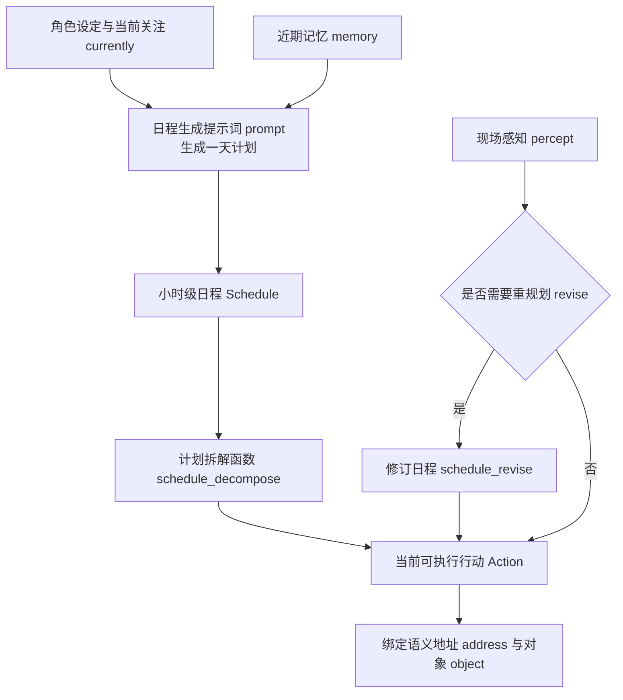

*图 19-1：日程生成、拆解与重规划流程。日程既提供稳定生活节奏，也必须能被现场事件打断和修订。*

本章继续使用 Part 03 证据脚手架。它不会调用模型，而是读取真实提示词 prompt 模板大小、源码路径和一个可解释的样例日程结构：

```bash
python docs/book/scaffolds/part_03/ch17_23_part03_evidence.py
```

本章相关输出如下：

```text
chapter19 schedule: prompt_count=5, sample_plan=阅读并整理文献综述, decompose_items=2
trace: docs/book/assets/chapter_19/ch19_schedule_trace.json
figure: docs/book/assets/chapter_19/ch19_schedule_pipeline.png
```

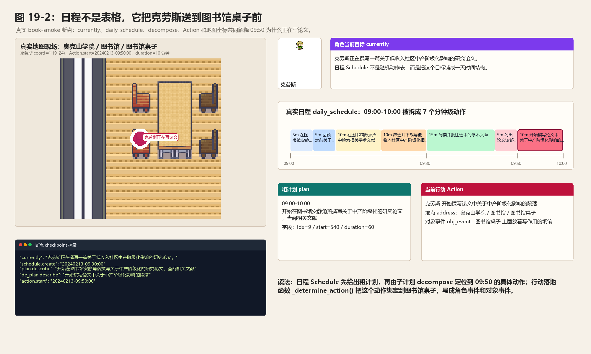

*图 19-2：真实日程 Schedule 如何把克劳斯送到图书馆桌子前。图中读取的是 `book-smoke` 断点 checkpoint：左侧是真实地图切片与克劳斯坐标，中间是角色画像和当前目标 currently，右侧是 09:00-10:00 的粗计划 plan、09:50 命中的子计划 decompose，以及最终写入回放文件的行动 Action。*

这行输出可以这样读：

| 输出片段 | 对应源码或文件 | 读法 |
| --- | --- | --- |
| `prompt_count=5` | `data/prompts/wake_up.txt` 等五个日程提示词 prompt | 日程不是一次模型调用，而是由起床时间、粗计划、小时计划、计划拆解和计划修订组成的链。 |
| `sample_plan=阅读并整理文献综述` | `ch19_schedule_trace.json` | 追踪文件 trace 用一个确定性样例展示日计划 `daily_schedule` 中粗计划 plan 的字段形状：`idx`、`describe`、`start`、`duration` 和 `decompose`。 |
| `decompose_items=2` | 计划拆解函数 `schedule_decompose` 与当前计划 `Schedule.current_plan()` | 粗粒度一小时计划可以拆成两个 30 分钟子计划，当前行动会从子计划中读取。 |

### 日程提示词 prompt 路线图

日程 Schedule 是这一章的机制主线，提示词 prompt 是这一章的设计主线。读源码时不能只看 `self.completion("schedule_daily")` 这种调用名，要继续往前一步，看模型到底读到了什么、输出结构 schema 被约束成什么样、失败兜底 callback 又把哪些风险压住了。

| 阶段 | 中文 English | 模板文件 | 输入 | 输出结构 schema | 设计重点 |
| --- | --- | --- | --- | --- | --- |
| 1 | 起床时间 wake_up | `wake_up.txt` | 角色设定 base_desc、生活方式 lifestyle、角色名 agent | 起床小时 `res: int`，范围 0-11 | 先固定一天开始时间，避免所有角色同时醒来。 |
| 2 | 日程大纲 schedule_init | `schedule_init.txt` | 角色设定 base_desc、生活方式 lifestyle、角色名 agent、起床时间 wake_up | 活动列表 `res: list[str]` | 先生成自然语言大纲，让一天有整体方向。 |
| 3 | 小时日程 schedule_daily | `schedule_daily.txt` | 角色设定 base_desc、角色名 agent、日程大纲 daily_schedule、小时模板 hourly_schedule | 小时活动表 `res: dict[str, str]` | 把大纲压成可计算的小时级结构。 |
| 4 | 日程拆解 schedule_decompose | `schedule_decompose.txt` | 角色设定 base_desc、角色名 agent、相邻粗计划 plan、时间粒度 increment、开始时间 start、结束时间 end | 子任务列表 `res: List[Tuple[str, int]]` | 把一小时活动拆成可执行的分钟级动作。 |
| 5 | 日程修订 schedule_revise | `schedule_revise.txt` | 角色名 agent、粗计划边界 start/end、原始计划 original_plan、新事件 event、持续时间 duration、已调整计划 new_plan | 修订时间段 `res: List[Tuple[str, str, str]]` | 把对话、等待等意外事件插入当前计划。 |

完整的中英文提示词模板不在这里集中展开。下面按源码运行顺序讲到哪个补全函数，就在对应小节拆开它的输入、模板、输出结构 schema、回调函数 callback 和失败兜底 failsafe。

## 19.2 日程的核心地位

如果没有日程，智能体 agent 会变成即时反应系统。它看到什么就回应什么。这种系统可以聊天，但不像一个在小镇里生活的人。人类生活通常有日程结构：

- 早上起床。
- 吃早餐。
- 上学或上班。
- 中午吃饭。
- 下午工作。
- 晚上社交或休息。
- 睡觉。

这个结构让行为连续、稳定、可预期。在多智能体系统里，日程还有一个重要作用：制造相遇。如果伊莎贝拉常在咖啡馆，克劳斯和玛丽亚也常去咖啡馆，他们就有机会相遇。如果山姆在公共地点谈竞选，居民就可能听到。所以，日程不是装饰。它是社会互动发生的时间骨架。

## 19.3 日程 Schedule 数据结构

日程 `Schedule` 定义在：

```text
generative_agents/modules/memory/schedule.py
```

初始化逻辑可以这样读：

```python
class Schedule:
    def __init__(self, create=None, daily_schedule=None, diversity=5, max_try=5):
        ...
```

核心字段可以定位到：

| 字段 | 中文意思 | 对系统行为的影响 |
| --- | --- | --- |
| `create` | 日程创建日期。 | 判断这份日程属于哪一天，避免新旧计划混在一起。 |
| `daily_schedule` | 当天计划列表。 | 保存一天中每段活动的描述、开始时间、持续时间和子计划。 |
| `diversity` | 活动多样性要求。 | 约束模型不要生成过于单调的全天安排。 |
| `max_try` | 最大重试次数。 | 日程生成失败或格式不对时，控制最多尝试几次。 |

日计划 `daily_schedule` 中每个粗计划 plan 是字典 dict：

```python
{
    "idx": 0,
    "describe": "睡觉",
    "start": 0,
    "duration": 420,
    "decompose": {}
}
```

开始时间 `start` 和持续时间 `duration` 都是分钟数。子计划 `decompose` 保存拆解结果。这说明日程 Schedule 是时间表，不是自然语言段落。

在 `book-smoke` 断点 checkpoint 里，克劳斯 09:00-10:00 的真实日计划 daily schedule 是下面这样：

```json
{
  "idx": 9,
  "describe": "开始在图书馆安静角落撰写关于中产阶级化的研究论文，查阅相关文献",
  "start": 540,
  "duration": 60,
  "decompose": [
    {
      "idx": 0,
      "describe": "在图书馆安静角落找好位置并整理桌面",
      "start": 540,
      "duration": 5
    },
    {
      "idx": 1,
      "describe": "回顾之前关于中产阶级化的研究笔记",
      "start": 545,
      "duration": 5
    },
    {
      "idx": 2,
      "describe": "在图书馆数据库中检索相关学术文献",
      "start": 550,
      "duration": 10
    },
    {
      "idx": 3,
      "describe": "筛选并下载与低收入社区中产阶级化相关的论文",
      "start": 560,
      "duration": 10
    },
    {
      "idx": 4,
      "describe": "阅读并批注选中的学术文章",
      "start": 570,
      "duration": 15
    },
    {
      "idx": 5,
      "describe": "列出论文该部分的写作提纲",
      "start": 585,
      "duration": 5
    },
    {
      "idx": 6,
      "describe": "开始撰写论文中关于中产阶级化影响的段落",
      "start": 590,
      "duration": 10
    }
  ]
}
```

这段数据要按分钟读。`start=540` 表示当天第 540 分钟，也就是 09:00。`duration=60` 表示这段粗计划 plan 持续一小时。子计划 decompose 里的 `start` 不是相对偏移，而是当天绝对分钟数，所以 `start=590` 表示 09:50。仿真走到 09:50 时，当前计划 `current_plan()` 会同时返回外层粗计划 plan 和最后一个子计划 de_plan，后续动作生成只需要读 `de_plan["describe"]` 和 `de_plan["duration"]`。

## 19.4 追加计划 add_plan()

添加计划时使用下面方法：

```python
add_plan(describe, duration, decompose=None)
```

它会根据上一条计划自动计算 start：

```python
if self.daily_schedule:
    last_plan = self.daily_schedule[-1]
    start = last_plan["start"] + last_plan["duration"]
else:
    start = 0
```

代码逻辑图：

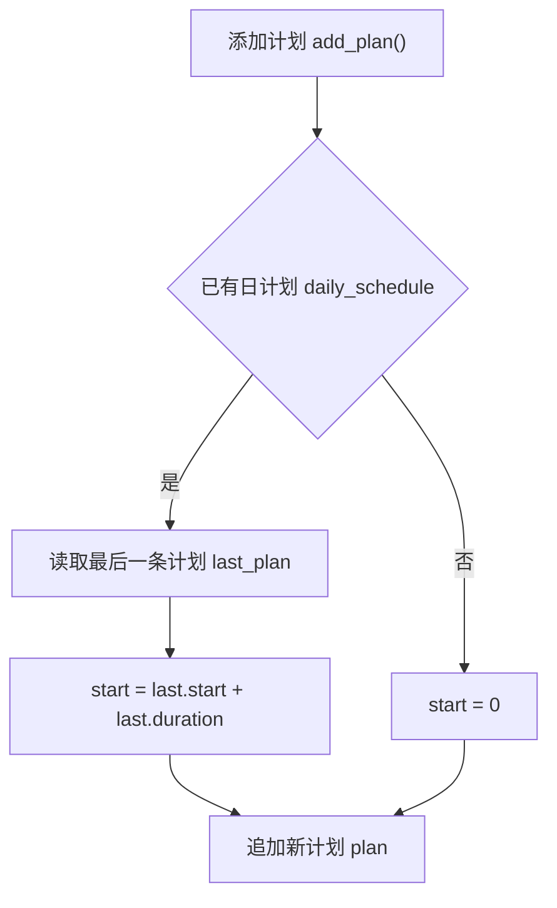

因此，日计划 daily_schedule 是连续排列的。第一条从 0 分钟开始。后一条从上一条结束时间开始。这比每条粗计划 plan 都由模型生成开始/结束时间 start/end 更稳定。模型只需要提供每个小时活动，代码负责把它转成持续时间。

## 19.5 日程检查 scheduled()：当天是否已有日程

日程检查 `Schedule.scheduled()` 用来判断今天是否已经有日程：

```python
if not self.daily_schedule:
    return False
return utils.get_timer().daily_format() == self.create.strftime("%A %B %d")
```

代码逻辑图：

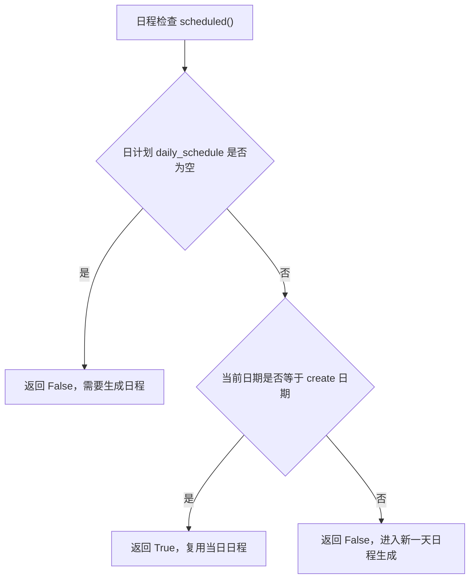

如果日程为空，返回 False。如果当前日期与 create 日期一致，返回 True。这意味着到了新的一天，系统会重新生成日程。角色不是整个仿真只生成一次计划，而是每天都可以基于记忆更新当天安排。

## 19.6 日程生成 make_schedule() 总览

智能体 `Agent.make_schedule()` 是日程生成主入口。代码逻辑图如下：

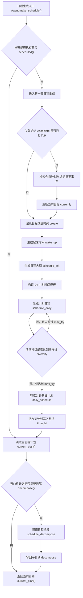

这张图把 `make_schedule()` 分成两段。第一段只在当天没有日程时执行：它把角色设定、近期记忆 memory 和五个日程提示词 prompt 组合成一份新日计划 daily schedule。第二段每次都会执行：它读取当前粗计划 plan，必要时拆成子计划 decompose，最后返回当前计划 current plan。日程不是静态表格，它会受过去记忆影响，也会在当前时刻被拆成可执行动作。

用输入、处理、输出的方式看，`make_schedule()` 的工程闭环如下：

| 环节 | 内容 | 在克劳斯案例里的对应物 |
| --- | --- | --- |
| 输入 | 角色设定 base_desc、生活方式 lifestyle、当前目标 currently、近期记忆 memory、当前日期 | 克劳斯正在写低收入社区中产阶级化影响论文。 |
| 处理 | 依次调用起床时间 wake_up、日程大纲 schedule_init、小时日程 schedule_daily，并在需要时调用日程拆解 schedule_decompose | 先生成一天计划，再把 09:00-10:00 的论文写作拆成 7 个子任务。 |
| 输出 | 日计划 `Schedule.daily_schedule`、写入记忆的计划想法 thought、当前可执行计划 current plan | 09:50 命中“开始撰写论文中关于中产阶级化影响的段落”。 |

这个闭环也是调试顺序。日程看起来奇怪时，先看输入当前目标 currently 是否准确，再看提示词 prompt 返回的小时日程 schedule_daily，最后看子计划 decompose 是否把粗计划拆得合理。

## 19.7 新一天前更新当前目标 currently

如果已有记忆，日程生成 `make_schedule()` 会先更新当前目标 `currently`：

```python
focus = [
    f"{self.name} 在 {utils.get_timer().daily_format_cn()} 的计划。",
    f"在 {self.name} 的生活中，重要的近期事件。",
]
retrieved = self.associate.retrieve_focus(focus)
```

然后继续执行下面步骤：

```python
plan = self.completion("retrieve_plan", retrieved)
thought = self.completion("retrieve_thought", retrieved)
self.scratch.currently = self.completion("retrieve_currently", plan, thought)
```

这三个补全不是同一种输出：

| 调用 | 输入 | 输出结构 schema | 输出含义 |
| --- | --- | --- | --- |
| 计划检索提示词 retrieve_plan | 关联记忆节点 retrieved、角色名 agent、当前日期 date | `res: List[str]` | 从记忆里整理出若干条和今天计划相关的描述。 |
| 想法检索提示词 retrieve_thought | 关联记忆节点 retrieved、角色名 agent | `res: str` | 用一句话概括角色此刻的想法和感受。 |
| 当前状态更新提示词 retrieve_currently | 昨天状态 currently、计划线索 plan、想法总结 thought、当前日期 current_time | `res: str` | 生成新的当前目标 currently，写回人格草稿 Scratch。 |

这里的 `plan` 不是 `Schedule.daily_schedule` 里的粗计划 plan，而是一组从记忆中抽出来的计划线索。`thought` 也不是长期记忆里的想法节点 thought，而是一句用于更新当前状态的临时总结。最后写回的 `self.scratch.currently`，才会进入后面的起床时间 wake_up、日程大纲 schedule_init 和小时日程 schedule_daily。

代码逻辑图：

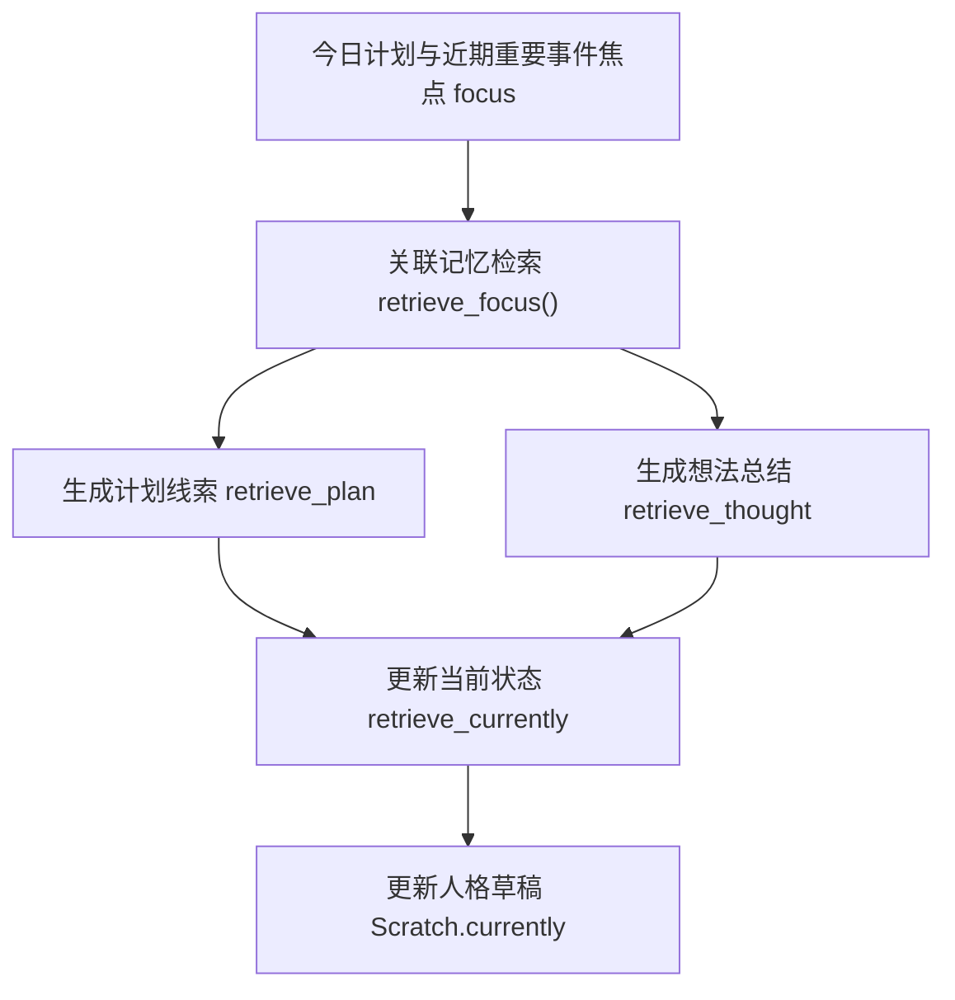

这是日程系统最容易被忽略的设计。它让角色的新一天不是从原始 `agent.json` 重新开始，而是从过去经历接续。例如：

- 伊莎贝拉昨天邀请了很多人，今天可能继续准备派对。
- 山姆昨天和居民谈过竞选，今天可能继续拜访居民。
- 克劳斯昨天遇到玛丽亚，今天可能有新的社交倾向。

如果没有这一步，仿真会每天重启人格状态。

## 19.8 起床时间 wake_up：生成起床时间

接下来执行下面步骤：

```python
wake_up = self.completion("wake_up")
```

起床提示词 `prompt_wake_up()` 使用：

中文原版：

```text
${base_desc}

通常，${lifestyle}

根据上述提示，输出 ${agent} 的起床时间。只输出小时（24小时制），不要包含其他内容。
```

英文版本 English version:

```text
${base_desc}

Usually, ${lifestyle}

Based on the information above, output the wake-up hour for ${agent}. Output only the hour in 24-hour format, without any extra text.
```

这一段提示词 prompt 的关键是“只输出小时”。它不让模型解释理由，也不让模型输出完整句子，因为后面的回调函数 callback 会把结果直接解析成整数。这里设计的是最小输出面：模型只负责根据生活方式 lifestyle 选一个小时。

| 输入 | 来源 | 含义 |
| --- | --- | --- |
| 角色设定 base_desc | `Scratch._base_desc()` 读取 `agent.json` 后拼出的完整角色画像 | 包含姓名、年龄、先天特质、后天经历、生活习惯、日常计划、当前日期和当前目标。它让模型先知道“这个人是谁”。 |
| 生活方式 lifestyle | `agent.json` 中 `scratch.lifestyle` 字段 | 只抽出作息习惯，例如几点睡、几点醒、几点吃饭。起床提示词 prompt 会把它再强调一遍，因为这里最关键的信息就是作息。 |
| 角色名 agent | `self.name` | 只是角色名字符串，例如“克劳斯”，不是完整的智能体 Agent 对象。它被放进“输出某某的起床时间”这句话里。 |

输出结构 schema 是：

```python
res: int
```

这里的结果字段 `res` 表示“起床小时”，不是持续时间，也不是日程列表下标。它使用 24 小时制，范围 0 到 11：

| `res` | 含义 |
| --- | --- |
| `0` | 00:00 起床，也就是午夜醒来。 |
| `6` | 06:00 起床。 |
| `7` | 07:00 起床。 |
| `11` | 11:00 起床，这是代码允许的最晚起床小时。 |

以克劳斯为例，`wake_up.txt` 填充后接近下面这样：

```text
姓名: 克劳斯
年龄：20
先天特质：善良、好奇、热情
后天特质：克劳斯是奥克山学院社会学专业的学生。他对社会正义充满热情，喜欢探索不同的观点。
生活习惯：克劳斯晚上11点左右睡觉，早上7点左右醒来，下午5点左右吃晚饭。
日常计划：克劳斯一大早就去奥克山学院的图书馆，整日写作，在霍布斯咖啡馆吃饭。

今天是 2024年02月13日。克劳斯正在撰写一篇关于低收入社区中产阶级化影响的研究论文。

通常，克劳斯晚上11点左右睡觉，早上7点左右醒来，下午5点左右吃晚饭。

根据上述提示，输出 克劳斯 的起床时间。只输出小时（24小时制），不要包含其他内容。
```

模型如果返回：

```json
{"res": 7}
```

底层结构化输出 structured output 会取出 `res`，业务代码拿到的就是整数 `7`。随后 `make_schedule()` 会把 `0:00` 到 `6:00` 填成“睡觉”，从 `7:00` 开始交给小时日程 `schedule_daily` 生成白天活动。回调函数 callback 还会做一次保护：如果模型给出 `12`、`13` 这类过晚时间，就截断为 `11`。如果模型调用失败，失败兜底 failsafe 使用 `8`，也就是默认 08:00 起床。

起床时间来自角色生活习惯。这使不同角色一天开始时间不同。如果所有角色都同一时间醒来，小镇会显得机械。

## 19.9 日程大纲 schedule_init：生成日程大纲

起床时间之后会生成下面内容：

```python
init_schedule = self.completion("schedule_init", wake_up)
```

日程大纲模板 `schedule_init.txt` 的内容如下。

中文原版：

```text
请根据以下信息生成一个初始日程列表：

"""
${base_desc}
生活方式：${lifestyle}
智能体：${agent}
起床时间：${wake_up}点
"""

确保返回的数据格式遵守schema：
示例：
[
  "早上6点起床并完成早餐的例行工作",
  "早上7点吃早餐",
  "早上8点看书",
  "中午12点吃午饭",
  "下午1点小睡一会儿",
  "晚上7点放松一下，看电视",
  "晚上11点睡觉"
]

要求：
- 每个活动简洁明了
- 按时间顺序排列
- 确保返回的数据格式遵守schema
```

英文版本 English version:

```text
Generate an initial schedule list based on the following information:

"""
${base_desc}
Lifestyle: ${lifestyle}
Agent: ${agent}
Wake-up time: ${wake_up}:00
"""

Make sure the returned data follows the schema:
Example:
[
  "Wake up at 6 AM and complete the breakfast routine",
  "Eat breakfast at 7 AM",
  "Read at 8 AM",
  "Have lunch at 12 PM",
  "Take a short nap at 1 PM",
  "Relax and watch TV at 7 PM",
  "Go to sleep at 11 PM"
]

Requirements:
- Keep each activity concise and clear
- Arrange activities in chronological order
- Make sure the returned data follows the schema
```

这个调用只显式传入 `wake_up`，但提示词组装器 `prompt_schedule_init()` 会同时读取角色设定 base_desc、生活方式 lifestyle 和角色名 agent。日程大纲 `schedule_init` 输出的是按时间顺序排列的活动列表。它不是严格 24 小时时间表，而是一天大纲。例如：

```text
早上起床并吃早餐。
上午去图书馆写论文。
中午在咖啡馆吃饭。
下午继续研究。
晚上回宿舍休息。
```

这一段的变量含义如下：

| 变量 | 来源 | 进入提示词 prompt 后的作用 |
| --- | --- | --- |
| 角色设定 base_desc | `Scratch._base_desc()` | 给出完整人物画像和当前目标 currently，让日程不是通用作息模板。 |
| 生活方式 lifestyle | `agent.json` 的 `scratch.lifestyle` | 明确睡觉、起床、吃饭等作息线索。 |
| 角色名 agent | `self.name` | 标明要生成哪个角色的一天计划。 |
| 起床时间 wake_up | 上一步起床提示词 wake_up 的整数结果 | 限定一天从几点开始，不让日程大纲和起床时间互相冲突。 |

模型可以返回：

```json
{
  "res": [
    "早上7点起床并完成早餐的例行工作",
    "早上8点前往奥克山学院图书馆",
    "上午9点开始撰写关于中产阶级化的研究论文"
  ]
}
```

这里的结构化输出 schema 是 `res: list[str]`。`res` 里的每一项是一句自然语言活动，不包含机器可直接计算的 `start` 和 `duration`。底层结构化输出 structured output 取出 `res` 后，业务代码拿到的是 Python 列表 `list[str]`。回调函数 callback 会检查列表至少有 3 项；失败兜底 failsafe 会返回一组默认日程大纲。这个大纲会传给小时日程 `schedule_daily`，作用是让小时级日程有整体方向。

## 19.10 小时日程 schedule_daily：生成小时级日程

`make_schedule()` 构造小时模板：

```python
hours = [f"{i}:00" for i in range(24)]
seed = [(h, "睡觉") for h in hours[:wake_up]]
seed += [(h, "") for h in hours[wake_up:]]
```

起床前填睡觉。起床后让模型填活动。然后调用：

```python
self.completion("schedule_daily", wake_up, init_schedule)
```

小时日程模板 `schedule_daily.txt` 的内容如下。

中文原版：

```text
请根据以下信息生成详细的24小时日程表：

"""
${base_desc}
智能体：${agent}
初始日程：${daily_schedule}
时间模板：
${hourly_schedule}
"""

确保返回的数据格式遵守schema：
示例：
{
  "6:00": "起床并完成早晨的例行工作",
  "7:00": "吃早餐",
  "8:00": "读书",
  "9:00": "读书",
  "10:00": "读书",
  "11:00": "读书",
  "12:00": "吃午饭",
  "13:00": "小睡一会儿",
  "14:00": "小睡一会儿",
  "15:00": "小睡一会儿",
  "16:00": "继续工作",
  "17:00": "继续工作",
  "18:00": "回家",
  "19:00": "放松，看电视",
  "20:00": "放松，看电视",
  "21:00": "睡前看书",
  "22:00": "准备睡觉",
  "23:00": "睡觉"
}

要求：
- 为每个小时填写具体活动
- 活动描述要具体且符合人物设定
- 至少包含5个不同的活动类型
- 确保返回的数据格式遵守schema
```

英文版本 English version:

```text
Generate a detailed 24-hour schedule based on the following information:

"""
${base_desc}
Agent: ${agent}
Initial schedule: ${daily_schedule}
Hourly template:
${hourly_schedule}
"""

Make sure the returned data follows the schema:
Example:
{
  "6:00": "Wake up and complete the morning routine",
  "7:00": "Eat breakfast",
  "8:00": "Read",
  "9:00": "Read",
  "10:00": "Read",
  "11:00": "Read",
  "12:00": "Have lunch",
  "13:00": "Take a short nap",
  "14:00": "Take a short nap",
  "15:00": "Take a short nap",
  "16:00": "Continue working",
  "17:00": "Continue working",
  "18:00": "Go home",
  "19:00": "Relax and watch TV",
  "20:00": "Relax and watch TV",
  "21:00": "Read before bed",
  "22:00": "Get ready for sleep",
  "23:00": "Sleep"
}

Requirements:
- Fill in a concrete activity for each hour
- Make each activity specific and consistent with the character profile
- Include at least 5 different activity types
- Make sure the returned data follows the schema
```

这个调用传入两个关键值。起床时间 wake_up 决定哪些小时已经固定为睡觉；日程大纲 init_schedule 决定起床后要围绕哪些事情展开。

这一段的变量含义如下：

| 变量 | 来源 | 进入提示词 prompt 后的作用 |
| --- | --- | --- |
| 角色设定 base_desc | `Scratch._base_desc()` | 约束活动要符合角色身份、目标和生活习惯。 |
| 角色名 agent | `self.name` | 标明小时日程属于哪个角色。 |
| 日程大纲 daily_schedule | 上一步 `schedule_init` 返回的活动列表，用分号拼接 | 提供“一天大概做什么”的自然语言骨架。 |
| 小时模板 hourly_schedule | `prompt_schedule_daily()` 根据 wake_up 生成 | 给出 24 小时槽位；起床前已经写成“睡觉”，起床后等待模型补活动。 |

如果克劳斯的起床时间 wake_up 是 `7`，小时模板 hourly_schedule 会接近下面这样：

```text
[0:00] 睡觉
[1:00] 睡觉
...
[6:00] 睡觉
[7:00] <活动>
[8:00] <活动>
...
[23:00] <活动>
```

小时日程模板 `schedule_daily.txt` 要求返回小时活动表。下面省略外层 `res` 字段，只看业务代码拿到的字典内容：

```json
{
  "6:00": "起床并完成早晨的例行工作",
  "7:00": "吃早餐",
  "8:00": "读书"
}
```

这里的结构化输出 schema 是 `res: dict[str, str]`。键 `"6:00"` 是小时字符串，值 `"起床并完成早晨的例行工作"` 是这一小时的活动描述。回调函数 callback 会检查返回结果至少有 5 个时间段；失败兜底 failsafe 会返回一份默认小时日程。这一步把自然语言大纲转成小时级结构。代码还检查活动多样性：

```python
if len(set(schedule.values())) >= self.schedule.diversity:
    break
```

代码逻辑图：

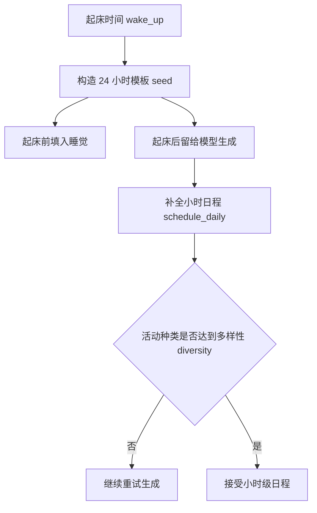

避免模型生成一整天重复同一活动。

## 19.11 转成分钟制粗计划 plan

模型返回的是时间字符串。代码把它转成分钟数：

```python
def _to_duration(date_str):
    return utils.daily_duration(utils.to_date(date_str, "%H:%M"))
```

然后继续执行下面步骤：

```python
schedule = {_to_duration(k): v for k, v in schedule.items()}
starts = list(sorted(schedule.keys()))
for idx, start in enumerate(starts):
    end = starts[idx + 1] if idx + 1 < len(starts) else 24 * 60
    self.schedule.add_plan(schedule[start], end - start)
```

代码逻辑图：

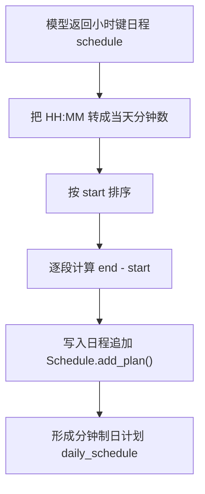

如果时间点写成下面这样：

```text
8:00 -> 读书
12:00 -> 吃午饭
13:00 -> 小睡
```

就会转换成下面结果：

```text
8:00-12:00 读书
12:00-13:00 吃午饭
13:00-下一个时间点 小睡
```

模型负责活动，代码负责持续时间。

## 19.12 把当天计划写入想法 thought

日程生成后，系统会写入记忆：

```python
thought = "这是 {} 在 {} 的计划：{}".format(
    self.name, schedule_time, "；".join(init_schedule)
)
event = memory.Event(
    self.name,
    "计划",
    schedule_time,
    describe=thought,
    address=self.get_tile().get_address(),
)
self._add_concept("thought", event, expire=self.schedule.create + datetime.timedelta(days=30))
```

代码逻辑图：

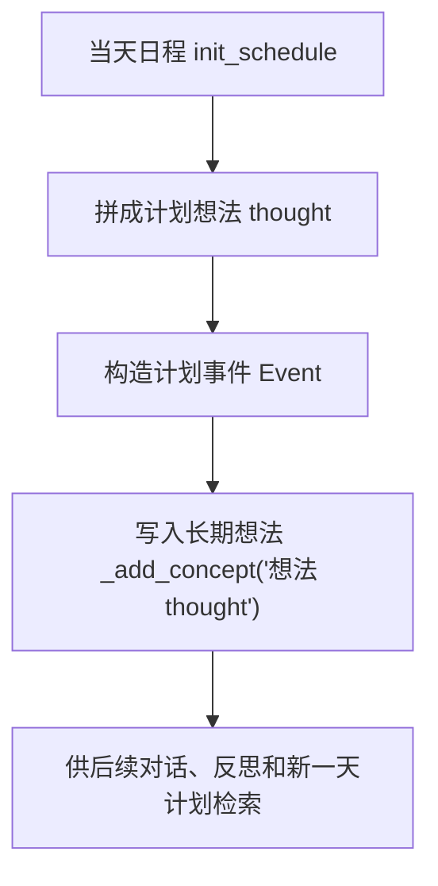

这一步让角色知道自己的计划。计划不仅存在于 `Schedule`，也成为记忆流 memory stream 中的想法 thought。后续对话、反思和新一天计划都可能检索到它。这体现了论文思想：计划也是智能体经验的一部分。

克劳斯的断点 checkpoint 里可以看到真实写入的想法 thought：

```text
这是 克劳斯 在 2024年02月13日（星期二）09:30 的计划：
早上7点起床并完成早餐的例行工作；
早上8点前往奥克山学院图书馆；
上午9点开始撰写关于中产阶级化的研究论文；
中午12点在霍布斯咖啡馆吃午餐；
下午1点继续在图书馆写作论文；
下午3点查阅关于低收入社区的相关资料；
下午5点吃晚饭；
晚上6点整理论文的参考文献；
晚上8点撰写论文的结论部分；
晚上9点返回宿舍休息；
晚上11点睡觉
```

这个想法 thought 不是展示文本，而是会进入关联记忆 Associate。下一次生成新日程或对话时，克劳斯可以检索到“自己今天原本打算怎么安排”。日程 Schedule 解决“现在该做什么”，记忆 memory 解决“为什么我会这么安排”。

## 19.13 当前计划 current_plan()

日程 `Schedule.current_plan()` 根据当前时间找计划。代码逻辑图如下：

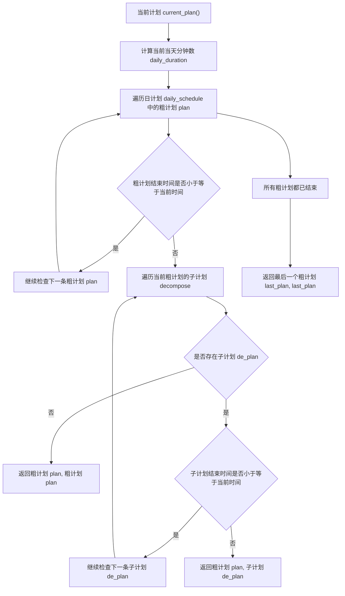

这张图要抓住两个返回层级。第一层返回粗计划 plan，它告诉系统当前大时间段在做什么。第二层返回子计划 de_plan，它告诉系统此刻具体执行什么。如果粗计划没有子计划，或者子计划都已经结束，函数会回退到粗计划本身。如果所有粗计划都结束，返回最后一个计划，避免仿真没有当前行动。

这个函数返回两个值：

```text
粗计划 plan：粗粒度计划。
子计划 de_plan：当前细粒度子计划。
```

后续动作生成 `_determine_action()` 会同时使用两者。粗计划 plan 提供场景方向。子计划 de_plan 提供具体动作。

## 19.14 拆解判断 decompose()：是否需要拆解

日程 `Schedule.decompose(plan)` 判断当前粗计划 plan 是否要拆成子计划。如果已有子计划 decompose，返回 False。如果是睡眠或床相关活动，通常不拆。其他活动一般会拆。这里源码逻辑有一些中英文兼容判断：

```python
if "sleep" not in describe and "bed" not in describe:
    return True
if "睡" not in describe and "床" not in describe:
    return True
...
```

代码逻辑图：

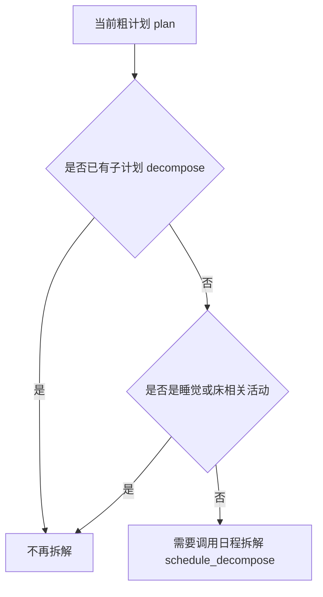

本质目标可以概括为：

```text
睡觉不必细拆，其他长活动需要细拆。
```

可以看一个具体例子：

```text
上午写论文
```

可以拆成下面几类来理解：

```text
整理资料
阅读文献
写段落
修改草稿
```

## 19.15 日程拆解 schedule_decompose：粗计划变子计划

需要拆解计划时，智能体 agent 调用日程拆解提示词 prompt：

```python
decompose_schedule = self.completion(
    "schedule_decompose", plan, self.schedule
)
```

日程拆解提示词 `prompt_schedule_decompose()` 会把当前粗计划 plan 前后相邻计划也传入提示词 prompt。这样模型知道上下文：

```text
上一段做什么
当前段做什么
下一段做什么
```

它还计算一个 increment：

```python
increment = max(int(plan["duration"] / 100) * 5, 5)
```

日程拆解模板 `schedule_decompose.txt` 的内容如下。

中文原版：

```text
参考示例，为以下计划列出子任务。
"""
${base_desc}
${agent} 现在的计划是：${plan}
"""

子任务总数不超过10个，确保返回的数据格式遵守schema：
[
  ("活动描述", 时长分钟数),
  ("活动描述", 时长分钟数),
  ...
]

以 ${increment} 分钟为增量，列出 ${agent} 在 ${start} 至 ${end} 期间的所有子任务（总时长为60分钟）：
```

英文版本 English version:

```text
Following the example, list the subtasks for the plan below.
"""
${base_desc}
${agent}'s current plan is: ${plan}
"""

Use no more than 10 subtasks, and make sure the returned data follows the schema:
[
  ("Activity description", duration in minutes),
  ("Activity description", duration in minutes),
  ...
]

Using ${increment}-minute increments, list all subtasks for ${agent} from ${start} to ${end} (total duration: 60 minutes):
```

这一段的变量含义如下：

| 变量 | 来源 | 进入提示词 prompt 后的作用 |
| --- | --- | --- |
| 角色设定 base_desc | `Scratch._base_desc()` | 让拆出来的子任务符合角色身份和当前目标。 |
| 角色名 agent | `self.name` | 标明正在拆解哪个角色的计划。 |
| 相邻粗计划 plan | 当前粗计划 plan 加上前后一段计划，拼成自然语言 | 给模型上下文，避免拆出来的子任务和前后活动断裂。 |
| 时间粒度 increment | `max(int(plan["duration"] / 100) * 5, 5)` | 给模型一个拆分步长，通常至少 5 分钟。 |
| 开始时间 start / 结束时间 end | `schedule.plan_stamps(plan)` | 限定当前粗计划的时间边界，例如 09:00 至 10:00。 |

时间粒度 increment 用于控制子任务时间粒度。返回结构是：

```python
List[Tuple[str, int]]
```

每一项可以理解为下面这种形式：

```text
活动描述 + 持续分钟数
```

这里的 `str` 是子任务描述，`int` 是持续分钟数。它不是开始时间，也不是结束时间；开始时间由代码从粗计划 plan 的 `start` 开始累加出来。回调函数 callback 会把模型可能返回的字典、列表或元组统一清洗成 `(describe, duration)`；如果模型结果不可用，失败兜底 failsafe 会用粗计划 plan 的原始描述按 10 分钟粒度补出一组子任务。

克劳斯的写论文任务就是这种输出被代码写回后的结果。模型不需要输出 `start`，只需要输出每段子任务的描述和时长：

```text
("在图书馆安静角落找好位置并整理桌面", 5)
("回顾之前关于中产阶级化的研究笔记", 5)
("在图书馆数据库中检索相关学术文献", 10)
("筛选并下载与低收入社区中产阶级化相关的论文", 10)
("阅读并批注选中的学术文章", 15)
("列出论文该部分的写作提纲", 5)
("开始撰写论文中关于中产阶级化影响的段落", 10)
```

代码接手之后，会从粗计划 plan 的 `start=540` 开始累加时长，得到 540、545、550、560、570、585、590 这些绝对分钟数。提示词 prompt 负责“把事情拆细”，代码负责“把拆细后的事情放回时间轴”。

代码会补足剩余时间：

```python
left = plan["duration"] - sum([s[1] for s in response])
if left > 0:
    response.append((plan["describe"], left))
```

代码逻辑图：

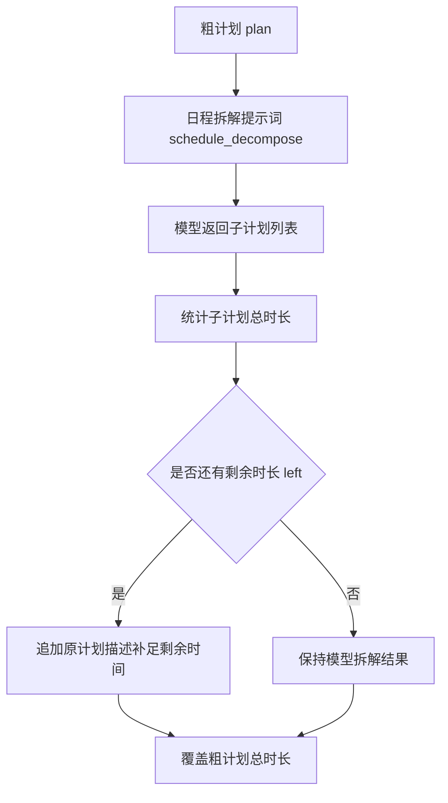

确保子计划总时长覆盖粗计划。

## 19.16 子计划如何写回粗计划 plan

日程生成 `make_schedule()` 把模型返回的子计划转成字典 dict：

```python
decompose, start = [], plan["start"]
for describe, duration in decompose_schedule:
    decompose.append(
        {
            "idx": len(decompose),
            "describe": describe,
            "start": start,
            "duration": duration,
        }
    )
    start += duration
plan["decompose"] = decompose
```

代码逻辑图：

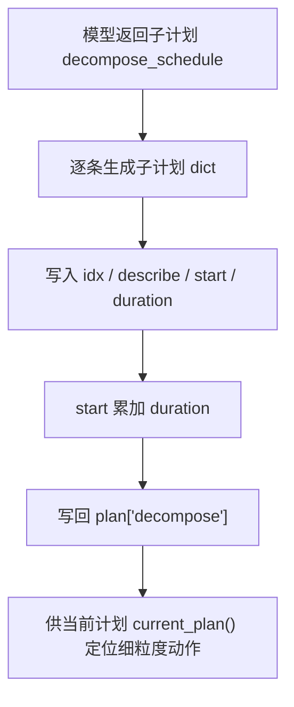

每个子计划也包含四个字段，需要逐项查看：

| 字段 | 含义 | 克劳斯 09:50 子计划示例 |
| --- | --- | --- |
| `idx` | 子计划在当前粗计划里的序号。 | `6`，表示第 7 个子任务。 |
| `describe` | 当前子任务的自然语言描述。 | `开始撰写论文中关于中产阶级化影响的段落`。 |
| `start` | 当天绝对分钟数，不是相对偏移。 | `590`，表示 09:50。 |
| `duration` | 子任务持续分钟数。 | `10`，表示持续到 10:00。 |

注意，子计划的开始时间 start 是当天分钟数，不是相对粗计划的偏移。这使当前计划 `current_plan()` 可以直接用当前当天分钟数 daily_duration 判断子计划是否结束。

## 19.17 动作生成 _determine_action()：日程落到动作

日程本身还不是行动 action。当当前行动 action 结束时，计划生成 `make_plan()` 会调用：

```python
self.action = self._determine_action()
```

`_determine_action()` 取：

```python
plan, de_plan = self.schedule.current_plan()
describes = [plan["describe"], de_plan["describe"]]
```

然后决定地点、对象、角色事件和对象事件。最终返回：

```python
memory.Action(
    event,
    obj_event,
    duration=de_plan["duration"],
    start=utils.get_timer().daily_time(de_plan["start"]),
)
```

克劳斯 09:50 的真实行动 Action 可以按下面方式读：

```json
{
  "input": {
    "plan": "开始在图书馆安静角落撰写关于中产阶级化的研究论文，查阅相关文献",
    "de_plan": "开始撰写论文中关于中产阶级化影响的段落",
    "start": 590,
    "duration": 10
  },
  "process": {
    "action_place": "the Ville / 奥克山学院 / 图书馆 / 图书馆桌子",
    "action_object": "图书馆桌子"
  },
  "output": {
    "event": "克劳斯 此时 开始撰写论文中关于中产阶级化影响的段落",
    "obj_event": "图书馆桌子 此时 上面放着写作用的纸笔",
    "start": "2024-02-13 09:50",
    "duration": 10
  }
}
```

这也是日程系统和世界模型的分界线。日程 Schedule 不直接知道地图坐标，它只知道 09:50 应该写论文。动作生成 `_determine_action()` 再把这个意图绑定到空间地址 address、对象 object 和世界事件 Event。

代码逻辑图：

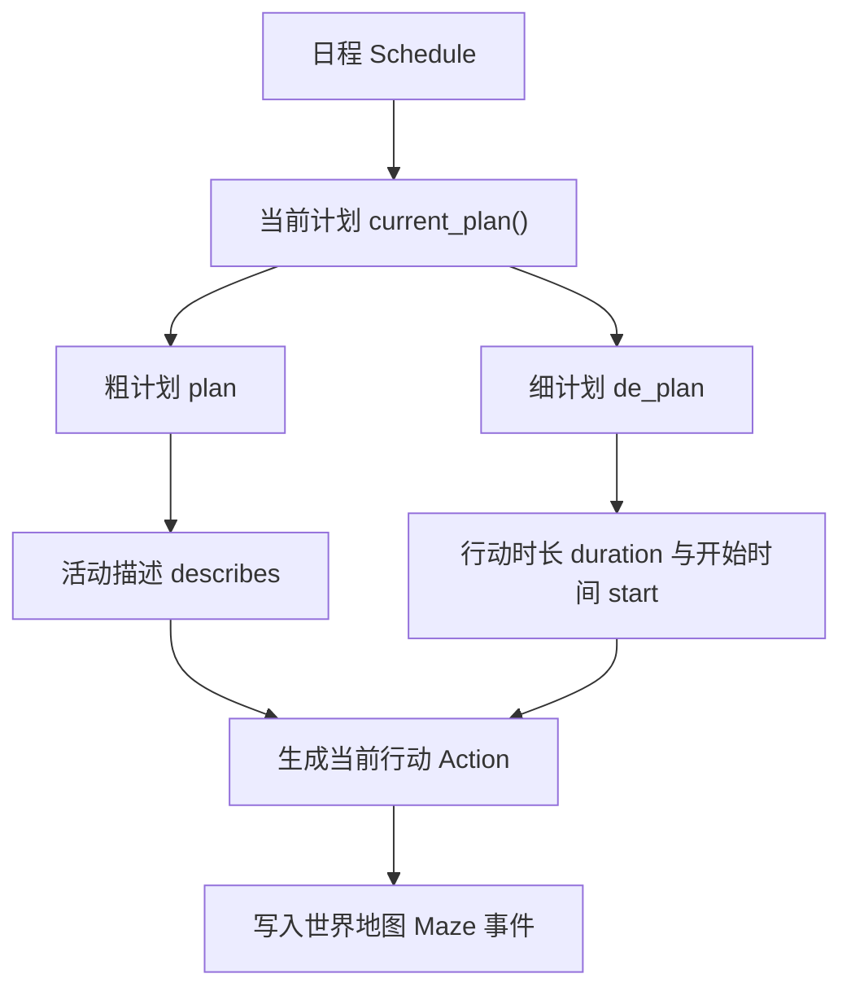

职责分工可以这样理解：

```text
日程 Schedule 决定做什么和持续多久。
动作生成 _determine_action() 决定在哪里做，并生成可写入世界的事件。
```

## 19.18 日程修订 revise_schedule()：意外插入当前计划

日程不是不能改。当聊天或等待发生时，系统会调用：

```python
revise_schedule(event, start, duration)
```

它先把当前行动 action 改为意外事件：

```python
self.action = memory.Action(event, start=start, duration=duration)
```

然后取当前粗计划 plan：

```python
plan, _ = self.schedule.current_plan()
```

如果该粗计划 plan 有子计划 decompose，就调用：

```python
plan["decompose"] = self.completion(
    "schedule_revise", self.action, self.schedule
)
```

日程修订模板 `schedule_revise.txt` 的内容如下。

中文原版：

```text
根据新的活动调整日程安排。

参考示例，为以下情况调整日程：
"""
智能体：${agent}
原始计划：
${original_plan}

新活动：${event}（持续${duration}分钟）
调整后的计划：
${new_plan}
"""

确保返回的数据格式遵守schema：
[
  ("开始时间", "结束时间", "活动描述"),
  ("开始时间", "结束时间", "活动描述"),
  ...
]

续写时间表中剩余的部分（必须在 ${end} 前结束）：
```

英文版本 English version:

```text
Adjust the schedule according to the new activity.

Following the example, adjust the schedule for the situation below:
"""
Agent: ${agent}
Original plan:
${original_plan}

New activity: ${event} (lasting ${duration} minutes)
Adjusted plan:
${new_plan}
"""

Make sure the returned data follows the schema:
[
  ("Start time", "End time", "Activity description"),
  ("Start time", "End time", "Activity description"),
  ...
]

Continue the remaining part of the timetable (it must end before ${end}):
```

这一段的变量含义如下：

| 变量 | 来源 | 进入提示词 prompt 后的作用 |
| --- | --- | --- |
| 角色名 agent | `self.name` | 标明要修订哪个角色的当前计划。 |
| 粗计划开始时间 start / 结束时间 end | 当前粗计划 plan 的时间边界 | 限定修订结果必须留在这一段粗计划内部。 |
| 原始计划 original_plan | 当前粗计划 plan 里的全部子计划 decompose | 让模型看到被打断前的完整安排。 |
| 新事件 event | 当前行动 Action 的事件描述 | 表示插入进来的聊天、等待或其他意外活动。 |
| 持续时间 duration | 当前行动 Action 的持续分钟数 | 告诉模型新事件占用多长时间。 |
| 已调整计划 new_plan | 已经发生的子计划片段，加上新事件片段 | 固定已经发生的部分，让模型只续写剩余时间。 |

代码逻辑图：

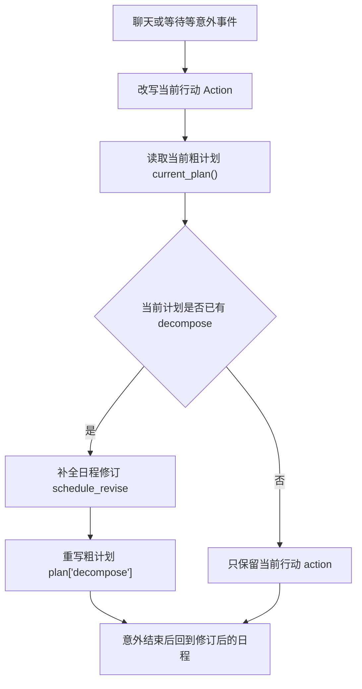

这会重写当前计划的子计划。例如，本来 10:00-11:00 写论文。10:20-10:35 和玛丽亚聊天。修订后可能是：

```text
10:00-10:20 写论文
10:20-10:35 与玛丽亚对话
10:35-11:00 继续写论文
```

日程修订 schedule_revise 的输入、处理、输出可以这样读：

| 环节 | 内容 | 调试时看什么 |
| --- | --- | --- |
| 输入 | 当前行动 action、新事件 event、开始时间 start、持续时间 duration、当前粗计划 plan | 新事件是否真的占用了当前时间段。 |
| 处理 | 把新事件写成当前行动 Action，再调用日程修订提示词 prompt | 提示词 prompt 是否拿到了原始计划 original_plan 和新活动 event。 |
| 输出 | 重写后的 `plan["decompose"]` | 子计划是否保留原计划、插入新事件，并且没有超过结束时间 end。 |

日程修订提示词 prompt 里最容易混淆的是 `original_plan` 和 `new_plan`。`original_plan` 是被打断前的完整子计划；`new_plan` 是已经确定发生的片段，包括意外事件本身。模型要做的不是重新发明一整天，而是在粗计划结束时间 end 之前，把剩余部分续写完整。返回结构是 `res: List[Tuple[str, str, str]]`，每项依次表示开始时间、结束时间和活动描述。代码随后把这些时间字符串转成分钟数，重建 `plan["decompose"]`。如果修订失败，失败兜底 failsafe 会保留原来的 `plan["decompose"]`。

这就是对话和计划的闭环。

## 19.19 对话日程 schedule_chat()

对话结束后会调用下面这些材料：

```python
self.schedule_chat(chats, chat_summary, start, duration, other)
```

它会继续执行下面动作：

1. 把 chats 加入 `self.chats`。
2. 创建对话事件 Event。
3. 调用 `revise_schedule()`。

对话事件 Event 的内容如下：

```python
memory.Event(
    self.name,
    "对话",
    other.name,
    describe=chats_summary,
    address=address or self.get_tile().get_address(),
    emoji=f"💬",
)
```

代码逻辑图：

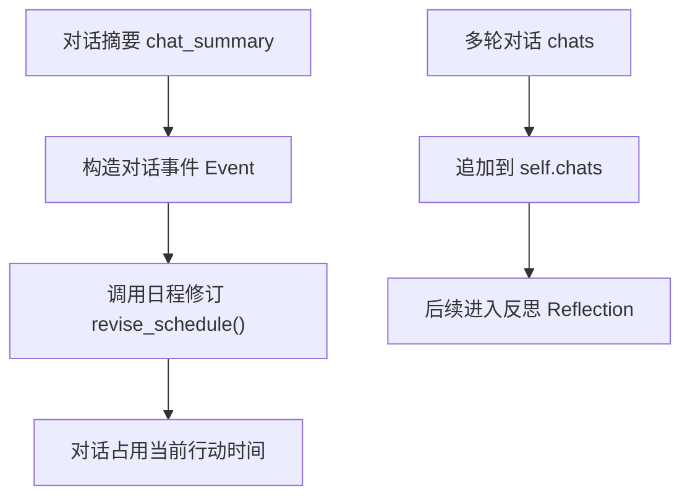

这说明对话不是只写日志。它会变成当前行动 action，并占用日程时间。同时，`self.chats` 后续会进入反思 reflection，用于生成对话后的计划影响和记忆影响。

## 19.20 等待也会改写日程

`_wait_other()` 决定等待后，也调用：

```python
self.revise_schedule(event, start, duration)
```

等待事件的内容如下：

```python
memory.Event(
    self.name,
    "waiting to start",
    self.get_event().get_describe(False),
    address=self.get_event().address,
    emoji=f"⌛",
)
```

代码逻辑图：

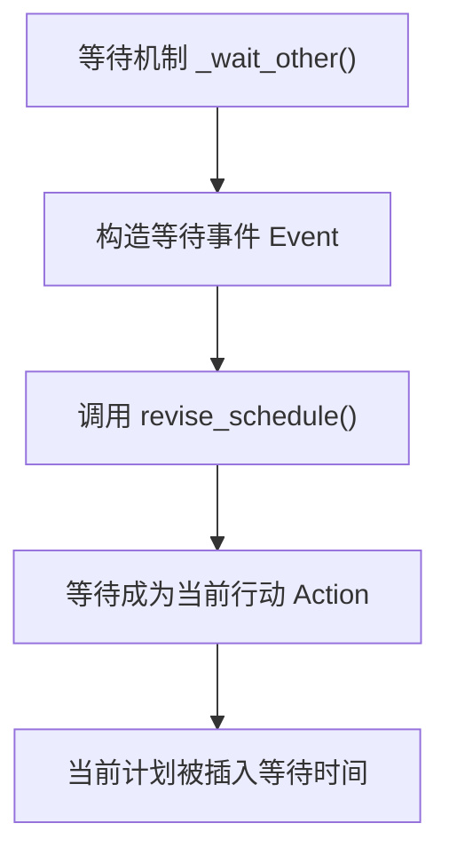

等待的持续时间 duration 取决于对方行动 action 剩余时间。这让空间冲突也进入日程。例如，浴室被占用，角色等待 10 分钟。原计划会被切开，等待占用其中一段。

## 19.21 日程如何影响可信行为

日程系统让行为更可信，不是因为它让角色“更聪明”，而是因为它给行为加了时间骨架。一个可信角色不应该每 10 分钟随机换目标，也不应该上午写论文、下一步突然去厨房做饭而没有任何解释。日程 Schedule 提供的就是这种连续性。

| 可信性来源 | 项目里的机制 | 读者可以观察什么 | 克劳斯案例 |
| --- | --- | --- | --- |
| 作息规律 | 起床时间 wake_up、小时日程 schedule_daily | 角色不会全天随机活动，睡眠、吃饭、工作有稳定节奏。 | 克劳斯早上 7 点起床，上午进入图书馆写论文。 |
| 目标连续性 | 当前目标 currently、日程大纲 schedule_init、日计划 daily_schedule | 当前行动来自当天计划，不是每个仿真步 step 临时生成。 | “写中产阶级化论文”从 currently 延续到 09:00-10:00 的粗计划 plan。 |
| 时间约束 | 粗计划 plan 的 `start` / `duration`，子计划 decompose 的分钟切分 | 行动会占用时间；对话、等待也会切开原计划。 | 09:50 的子计划只持续 10 分钟，不会无限写下去。 |
| 空间落地 | 动作生成 `_determine_action()`、语义地址 address、行动 Action | 计划最终要落到地点和对象，而不是只停留在文字。 | 写论文被落到 `奥克山学院 -> 图书馆 -> 图书馆桌子`。 |
| 可解释性 | `Schedule.daily_schedule`、`plan["decompose"]`、断点 checkpoint | 打开日程和断点，就能解释“为什么此刻在这里做这件事”。 | `simulate-*.json` 里能看到克劳斯的计划、行动、地址和持续时间。 |

所以，论文中的规划 planning 模块不是一个抽象概念。它在项目里对应一组能被打开、检查、修改的数据结构：`currently` 决定今天围绕什么行动，`daily_schedule` 决定一天怎么分段，`decompose` 决定当前分钟做什么，行动 Action 决定这件事落到哪里。

## 19.22 日程失败模式

日程失败时，不要只看最后角色去了哪里。先判断问题发生在“生成日程”“拆解日程”“修订日程”，还是“空间落地”。下面这张表可以作为排查清单。

| 失败模式 | 典型表现 | 常见原因 | 优先检查位置 | 修正方向 |
| --- | --- | --- | --- | --- |
| 日程过于普通 | 角色明明有明确目标，但一天安排像通用模板。 | 当前目标 currently 太弱；日程大纲 schedule_init 没抓住关键任务。 | `agent.scratch.currently`、`schedule_init` 输出、`daily_schedule`。 | 强化 currently，把角色当天目标写得更具体；检查 `base_desc` 是否包含关键背景。 |
| 时间不合理 | 缺失时间点、重复时间点、顺序混乱，或者上午活动跑到深夜。 | 小时日程 schedule_daily 的结构化输出 schema 只能约束格式，不能完全约束语义。 | `schedule_daily` 返回的 `res: dict[str, str]`，以及转分钟后的粗计划 plan。 | 增加时间校验；发现缺口时用默认小时模板补齐。 |
| 活动多样性不足 | 一整天都在“读书”“工作”“休息”，生活感很弱。 | 模型输出安全但单调；多样性 diversity 只能做粗检查。 | `Schedule.diversity`、`len(set(schedule.values()))`、最终 `daily_schedule`。 | 提高提示词对具体活动的要求；为角色配置更具体的 `daily_plan`。 |
| 拆解过细 | 子计划每几分钟变一次，角色行为看起来抖动。 | 日程拆解 schedule_decompose 生成太多短任务。 | `plan["decompose"]` 中每个子计划的 `duration`。 | 设置最小时长；把相邻同类子任务合并。 |
| 拆解过粗 | 一小时只有一个模糊任务，当前行动缺少细节。 | 拆解 prompt 没把粗计划 plan 变成可执行动作。 | `decompose_schedule` 返回值、`plan["decompose"]`。 | 在 prompt 中强调“可观察动作”，并要求覆盖完整时间段。 |
| 重规划失败 | 对话或等待插入后，剩余计划丢失、重复或越界。 | 日程修订 schedule_revise 没守住粗计划结束时间 end。 | `original_plan`、`new_plan`、`schedule_revise` 输出。 | 检查已发生片段是否固定；增加结束时间 end 的硬校验。 |
| 计划与空间不匹配 | 计划合理，但角色去了奇怪地点。 | 日程 schedule 没问题，空间落地 spatial grounding 选错了地址。 | `_determine_action()`、`determine_sector`、`determine_arena`、`determine_object`。 | 分开调试日程和空间：先确认 plan 合理，再确认 address 是否命中候选地点。 |

调试顺序可以压成一句话：

```text
currently -> schedule_init -> schedule_daily -> decompose -> schedule_revise -> _determine_action()
```

前五步属于日程 schedule，最后一步属于空间落地 spatial grounding。两类问题不要混在一起修。

## 19.23 日程实验怎么设计

日程实验要控制变量。一次只改一个输入，观察一个输出，否则很难判断问题来自角色配置、提示词 prompt、模型稳定性，还是空间落地。

| 实验 | 修改变量 | 运行方式 | 观察对象 | 预期现象 |
| --- | --- | --- | --- | --- |
| 不同角色作息 | 不同角色的生活方式 lifestyle | 同时运行多个角色 | 起床时间 wake_up、日计划 daily_schedule | 早睡早起角色更早进入白天活动；夜猫子角色起床更晚。 |
| 当前目标影响日程 | `agent.json.currently` | 修改伊莎贝拉的当前目标 currently，再重新生成日程 | `schedule_init`、`schedule_daily` | 如果 currently 写成筹备派对，日程中应该出现邀请、准备、布置等活动。 |
| 日程拆解粒度 | 粗计划 plan 的活动描述和持续时间 | 选择一个 60 分钟任务，触发 schedule_decompose | `plan["decompose"]` | 子计划应该覆盖完整 60 分钟，且每项是可观察动作。 |
| 对话插入日程 | 让两个角色在同一场所相遇并聊天 | 运行到触发 `_chat_with()` | `schedule_revise` 输出、修订后的 `plan["decompose"]` | 对话时间段应该插入当前计划，剩余计划继续向后排列。 |
| 等待插入日程 | 让两个角色竞争同一对象或等待对方行动结束 | 运行到触发 `_wait_other()` | 当前行动 Action、修订后的 decompose | 等待应占用一段时间，而不是只写日志。 |
| 反思后第二天日程 | 运行跨天仿真，积累重要事件 | 观察第二天 `currently` 和新日程 | `retrieve_currently`、`make_schedule()` | 新一天日程应受前一天记忆影响，而不是回到原始模板。 |
| 模型稳定性 | 切换不同大语言模型 LLM 或不同温度 temperature | 重复同一角色、同一时间运行 | prompt 输出格式、活动合理性、失败兜底次数 | 稳定模型应更少触发 failsafe，活动更符合角色设定。 |

实验记录建议至少保留四类证据：

| 证据 | 文件或字段 | 用途 |
| --- | --- | --- |
| 输入配置 | `agent.json`、`data/config.json` | 证明实验改了什么。 |
| 提示词输出 | 日志中的 `completion_calls` 或模型响应 | 判断模型是否按 schema 返回。 |
| 日程结果 | `Schedule.daily_schedule`、`plan["decompose"]` | 判断计划是否合理。 |
| 仿真结果 | `simulate-*.json`、`movement.json`、回放画面 | 判断计划是否真的变成可见行为。 |

这些实验会在第四部分复现实验中继续展开。这里先建立一个原则：日程实验不要只看“角色最后在哪里”，要同时保存输入、过程和输出。

## 19.24 可改进方向

当前项目的日程 Schedule 已经能表达一天计划、当前行动和意外修订，但还不是完整的规划 planning 系统。可以沿着下面几条线升级。

| 升级方向 | 当前限制 | 可以怎么做 | 读者能获得什么能力 |
| --- | --- | --- | --- |
| 目标层级 | currently、粗计划 plan、子计划 decompose 之间没有显式目标树。 | 增加每日目标 daily goal、小时计划 hourly plan、分钟行动 minute action 三层结构。 | 能解释“这个动作服务于哪个上层目标”。 |
| 约束求解 | 模型可能安排角色去关闭的地点，或使用已经被占用的对象。 | 引入时间约束、地点开放时间、对象容量、角色承诺等规则。 | 日程更像真实生活安排，而不是只靠文本合理性。 |
| 事件邀请机制 | 邀请、约会、会议等事件没有稳定进入日程的入口。 | 把派对邀请、约定见面等事件转成候选日程项。 | 社交事件可以主动改变未来计划。 |
| 计划置信度 | 所有计划看起来都同等确定。 | 给计划增加优先级 priority、意愿 intention、置信度 confidence。 | 角色可以“想做但不一定做”，更接近真实决策。 |
| 失败恢复 | 去错地点、错过时间后，角色不会系统性补救。 | 增加失败检测和重新规划 replan：地点不可达、对象被占用、时间已过都触发修正。 | 角色能从错误中恢复，而不是沿着坏计划继续执行。 |
| 多人协调 | 每个角色主要生成自己的日程，缺少群体层面的协调。 | 为会议、派对、课程等群体事件建立共享计划 shared plan。 | 多智能体活动更稳定，减少“大家想参加但时间对不上”的问题。 |

这些升级的共同方向，是把日程从“模型生成的一天安排”推向“可验证、可约束、可恢复的规划系统”：

```text
自然语言计划
  -> 结构化时间表
  -> 可执行行动
  -> 可检查约束
  -> 可恢复规划
```

走到这一步，智能体 agent 的规划 planning 就不只是让角色显得有生活节奏，而是能支撑更复杂的应用场景：课程安排、会议协作、游戏 NPC 行为、城市模拟和长期任务执行。

## 19.25 本章小结

日程系统让角色不再每一步随机选择行为。一天计划如何生成、如何被拆成当前行动、为什么对话和等待会改写日程，是调试规划 Planning 的主线。

| 本章内容 | 核心结论 |
| --- | --- |
| 日程 `Schedule` | 它保存当天计划列表，每个粗计划 plan 有 `start`、`duration`、`describe`、`decompose`。 |
| 是否已有日程 | 日程检查 `scheduled()` 判断当天是否已经生成过计划。 |
| 新一天计划 | 日程生成 `make_schedule()` 在新一天生成日程，并在必要时更新当前目标 `currently`。 |
| 起床与大纲 | 起床时间 `wake_up` 生成起床时间，日程大纲 `schedule_init` 生成日程大纲。 |
| 小时级日程 | 小时日程 `schedule_daily` 生成小时级安排，并转成连续分钟制粗计划 plan。 |
| 计划写回 | 当天计划会写入想法 thought，成为角色自己的记忆。 |
| 当前计划 | 当前计划 `current_plan()` 返回当前粗计划和子计划。 |
| 递归拆解 | 日程拆解 `schedule_decompose` 把粗计划拆成细粒度动作。 |
| 行动落地 | 动作生成 `_determine_action()` 把当前子计划落到空间行动 action。 |
| 重规划 | 日程修订 `revise_schedule()` 让对话和等待改写当前计划。 |
| 系统价值 | 日程支撑作息、目标连续性、时间约束和行为可解释性。 |

下一章讲社交：深入 `_reaction()`、`_chat_with()`、`_wait_other()`，看智能体如何决定聊天、生成多轮对话、保存对话摘要，并让信息在小镇中传播。

## 参考资料

- Local source: `generative_agents/modules/memory/schedule.py`
- Local source: `generative_agents/modules/agent.py`
- Local source: `generative_agents/modules/prompt/scratch.py`
- Local prompts: `generative_agents/data/prompts/wake_up.txt`
- Local prompts: `generative_agents/data/prompts/schedule_init.txt`
- Local prompts: `generative_agents/data/prompts/schedule_daily.txt`
- Local prompts: `generative_agents/data/prompts/schedule_decompose.txt`
- Local prompts: `generative_agents/data/prompts/schedule_revise.txt`
- Local scaffold: `docs/book/scaffolds/part_03/ch17_23_part03_evidence.py`
- Local trace: `docs/book/assets/chapter_19/ch19_schedule_trace.json`
